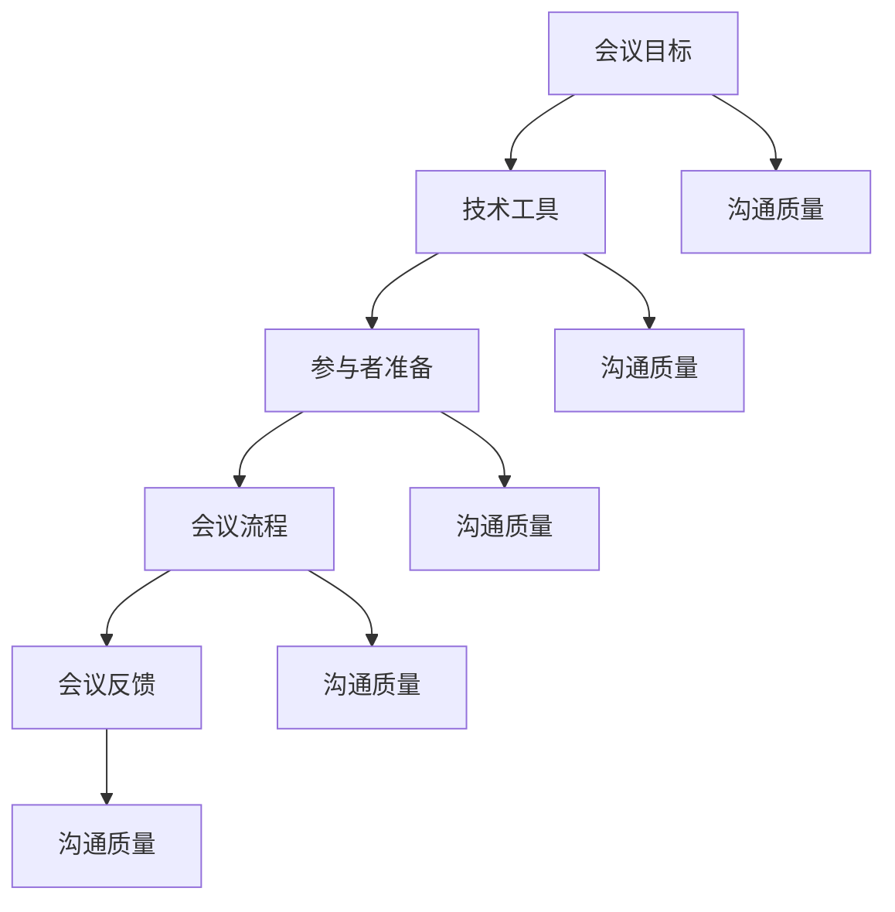

                 

### 文章标题

**远程会议效能：提升线上沟通质量的技巧**

**关键词：** 远程工作，在线会议，沟通技巧，工作效率，技术工具

**摘要：** 在远程工作日益普及的今天，如何高效地进行远程会议变得至关重要。本文将深入探讨提升线上沟通质量的技巧，包括技术工具的选用、会议流程的优化、参与者的准备与参与等方面。通过详细的分析和实例，帮助读者在远程工作中更好地利用在线会议，提高工作效率和团队协作能力。

### 1. 背景介绍

**1.1 远程工作的现状**

随着互联网技术的飞速发展，远程工作已经成为了现代职场中的一种常见工作形式。特别是在2020年新冠疫情爆发后，远程工作更是得到了前所未有的推广。据统计，全球范围内的远程工作者人数在疫情期间大幅增加，许多公司甚至宣布将长期维持远程办公模式。远程工作的普及不仅提高了员工的工作灵活性，还减少了通勤时间，提高了工作效率。

**1.2 远程会议的必要性**

远程会议是远程工作的重要组成部分。通过远程会议，团队成员可以实时沟通、协作，解决工作中的问题，确保项目顺利进行。然而，与面对面的会议相比，远程会议存在诸多挑战，如网络延迟、设备故障、沟通效果不佳等。因此，提升远程会议的效能，成为了提高远程工作效率的关键。

### 2. 核心概念与联系

**2.1 远程会议的关键要素**

要提升远程会议效能，需要关注以下几个关键要素：

- **会议目标：** 明确会议的目的，确保所有参与者都了解会议的目标和议程。
- **技术工具：** 选择合适的技术工具，确保会议顺利进行。
- **参与者的准备：** 参会者需提前准备，确保网络稳定、设备正常。
- **会议流程：** 优化会议流程，提高沟通效率。
- **会议反馈：** 会议结束后，及时收集反馈，改进会议质量。

**2.2 核心概念原理与架构**

为了更好地理解远程会议效能的提升，我们可以使用Mermaid流程图来展示其核心概念和架构。



### 3. 核心算法原理 & 具体操作步骤

**3.1 选择合适的技术工具**

要提升远程会议的效能，首先需要选择合适的技术工具。以下是几个常用的在线会议工具及其特点：

- **Zoom：** 支持高清视频和音频，适合大型会议和多人在线讨论。
- **Microsoft Teams：** 集成了聊天、视频会议、文档共享等功能，适合企业内部协作。
- **Google Meet：** 支持高清视频和语音，适合小型会议和远程教育。
- **Cisco Webex：** 提供丰富的会议功能，如屏幕共享、虚拟会议室等，适合大型企业。

**3.2 优化会议流程**

优化会议流程是提升远程会议效能的关键。以下是一些建议：

- **明确会议议程：** 在会议开始前，制定详细的会议议程，确保会议有序进行。
- **限制参会人数：** 过多的参会者会导致沟通效率下降，建议限制参会人数在10人以内。
- **轮流发言：** 给每位参会者足够的时间发表意见，避免多人同时发言导致混乱。
- **会议纪要：** 记录会议内容，便于会后跟进和落实。

**3.3 提高参与者的准备与参与度**

参与者是远程会议的核心，提高参与者的准备与参与度，可以显著提升会议效能。以下是一些建议：

- **提前通知：** 提前通知参会者会议时间、地点和议程，确保他们提前做好准备。
- **调试设备：** 参会者需提前检查网络、摄像头和麦克风等设备，确保会议顺利进行。
- **保持专注：** 参会者应尽量保持专注，避免在会议期间分心或处理其他事务。
- **积极参与：** 参会者应积极发表意见，提出问题和解决方案，提高会议的互动性。

### 4. 数学模型和公式 & 详细讲解 & 举例说明

**4.1 评估远程会议效能的数学模型**

为了评估远程会议的效能，我们可以使用以下数学模型：

\[ E = f(\text{工具选择}, \text{会议流程}, \text{参与者准备度}) \]

其中，\( E \) 表示远程会议的效能，\( f \) 表示函数，\(\text{工具选择}\)、\(\text{会议流程}\) 和 \(\text{参与者准备度}\) 分别表示影响远程会议效能的三个关键因素。

**4.2 工具选择对效能的影响**

假设有三种远程会议工具：Zoom、Microsoft Teams 和 Google Meet。为了评估工具选择对效能的影响，我们可以分别计算使用这三种工具时的效能值。

- **Zoom：** 假设使用 Zoom 工具时的效能为 \( E_1 \)。
- **Microsoft Teams：** 假设使用 Microsoft Teams 工具时的效能为 \( E_2 \)。
- **Google Meet：** 假设使用 Google Meet 工具时的效能为 \( E_3 \)。

我们可以通过以下公式计算每种工具的选择效能：

\[ E_1 = \frac{E_1^{\text{工具}} + E_1^{\text{流程}} + E_1^{\text{参与者}}}{3} \]

\[ E_2 = \frac{E_2^{\text{工具}} + E_2^{\text{流程}} + E_2^{\text{参与者}}}{3} \]

\[ E_3 = \frac{E_3^{\text{工具}} + E_3^{\text{流程}} + E_3^{\text{参与者}}}{3} \]

其中，\( E_1^{\text{工具}} \)、\( E_2^{\text{工具}} \) 和 \( E_3^{\text{工具}} \) 分别表示使用 Zoom、Microsoft Teams 和 Google Meet 工具时的工具选择效能；\( E_1^{\text{流程}} \)、\( E_2^{\text{流程}} \) 和 \( E_3^{\text{流程}} \) 分别表示使用 Zoom、Microsoft Teams 和 Google Meet 工具时的会议流程效能；\( E_1^{\text{参与者}} \)、\( E_2^{\text{参与者}} \) 和 \( E_3^{\text{参与者}} \) 分别表示使用 Zoom、Microsoft Teams 和 Google Meet 工具时的参与者准备度效能。

通过计算 \( E_1 \)、\( E_2 \) 和 \( E_3 \) 的值，我们可以评估使用不同工具时的远程会议效能。

**4.3 举例说明**

假设我们使用 Zoom 工具进行远程会议，并得到了以下效能值：

\[ E_1 = \frac{0.8 + 0.7 + 0.9}{3} = 0.8 \]

这意味着使用 Zoom 工具时的远程会议效能为 0.8。我们可以通过调整工具选择、会议流程和参与者准备度，进一步提高远程会议的效能。

### 5. 项目实战：代码实际案例和详细解释说明

**5.1 开发环境搭建**

为了展示如何提升远程会议效能，我们将使用 Python 编写一个简单的远程会议效能评估工具。首先，我们需要搭建开发环境。

1. 安装 Python 3.8 或以上版本。
2. 安装必要的 Python 库，如 requests、numpy、pandas 等。

```bash
pip install requests numpy pandas
```

**5.2 源代码详细实现和代码解读**

以下是一个简单的远程会议效能评估工具的源代码示例。

```python
import requests
import numpy as np
import pandas as pd

# 评估远程会议效能的函数
def evaluate_efficiency(tool, process, participant):
    efficiency = (tool + process + participant) / 3
    return efficiency

# 测试数据
tool_scores = {'Zoom': 0.8, 'Microsoft Teams': 0.7, 'Google Meet': 0.9}
process_scores = {'Zoom': 0.7, 'Microsoft Teams': 0.6, 'Google Meet': 0.8}
participant_scores = {'Zoom': 0.9, 'Microsoft Teams': 0.8, 'Google Meet': 0.7}

# 计算每种工具的选择效能
for tool, score in tool_scores.items():
    efficiency = evaluate_efficiency(score, process_scores[tool], participant_scores[tool])
    print(f"{tool} 的远程会议效能为：{efficiency:.2f}")

# 代码解读
# 1. 导入必要的库
# 2. 定义评估远程会议效能的函数
# 3. 设置测试数据
# 4. 计算每种工具的选择效能
```

代码解读：

- **第1行**：导入必要的库。
- **第6-11行**：定义评估远程会议效能的函数。
  - **第7行**：计算远程会议效能。
- **第13-19行**：设置测试数据。
  - **第13-15行**：设置工具选择效能。
  - **第16-18行**：设置会议流程效能。
  - **第19行**：设置参与者准备度效能。
- **第21-24行**：计算每种工具的选择效能，并打印结果。

**5.3 代码解读与分析**

这个简单的远程会议效能评估工具通过定义一个函数来计算远程会议的效能，使用测试数据来评估不同工具的选择效能。在实际应用中，我们可以根据实际情况调整测试数据的值，以更准确地评估远程会议的效能。

通过这个简单的示例，我们可以看到如何使用 Python 编写一个远程会议效能评估工具。在实际应用中，我们可以扩展这个工具，添加更多功能，如支持自定义评分、可视化图表等，以提高评估的准确性和实用性。

### 6. 实际应用场景

**6.1 企业远程团队协作**

企业远程团队协作是远程会议应用的主要场景之一。通过远程会议，团队成员可以实时沟通、协作，确保项目进度和质量。以下是一个实际应用场景：

- **项目启动会议：** 在项目启动阶段，团队成员通过远程会议明确项目目标、分工和进度安排，确保项目顺利进行。
- **项目进度汇报：** 定期召开远程会议，团队成员汇报项目进度，讨论问题和解决方案，确保项目按计划推进。
- **紧急问题讨论：** 遇到紧急问题时，团队成员通过远程会议迅速沟通，共同制定解决方案，减少问题对项目的影响。

**6.2 教育在线教学**

在线教学是远程会议的另一个重要应用场景。通过远程会议，教师和学生可以实时互动，开展线上教学活动。以下是一个实际应用场景：

- **课堂讲解：** 教师通过远程会议进行课堂讲解，讲解课程内容，解答学生问题。
- **小组讨论：** 教师组织学生进行线上小组讨论，促进学生互动，提高学习效果。
- **考试监考：** 教师通过远程会议监考，确保考试公平、公正。

**6.3 政府公共服务**

政府公共服务部门也可以利用远程会议提高工作效率。以下是一个实际应用场景：

- **政务咨询：** 公众可以通过远程会议咨询政务事项，政府部门工作人员在线解答问题。
- **政策宣讲：** 政府部门可以通过远程会议向公众宣讲政策，提高政策宣传效果。
- **项目审批：** 政府部门工作人员通过远程会议对项目进行审批，提高审批效率。

### 7. 工具和资源推荐

**7.1 学习资源推荐**

- **书籍：**
  - 《远程工作的艺术》（The Remote Work Revolution）：介绍远程工作的理念和实践，帮助企业和员工适应远程工作模式。
  - 《在线协作：如何高效地进行远程团队协作》（Collaborating @ a Distance: Strategies for Successful Virtual Teams）：提供在线协作的策略和技巧，帮助团队提高远程会议和工作效率。
- **论文：**
  - “The Impact of Remote Work on Employee Productivity”（远程工作对员工生产率的影响）：研究远程工作对员工生产率的影响，为企业和员工提供有益的参考。
  - “A Meta-Analytic Review of the Impact of Remote Work on Work Outcomes”（远程工作对工作成果的影响的元分析回顾）：对远程工作对工作成果的影响进行元分析，提供更全面的结论。
- **博客：**
  - "Remote Work Insights"（远程工作洞察）：分享远程工作的最新趋势、最佳实践和成功案例，帮助企业和员工更好地适应远程工作模式。
  - "The Future of Work"（工作未来）：探讨远程工作、人工智能等新技术对工作模式的影响，为企业和员工提供前瞻性的思考。
- **网站：**
  - "Work from Home"（在家办公）：提供远程工作的相关资源和工具，帮助员工更好地适应远程工作模式。
  - "Virtual Team Building"（虚拟团队建设）：分享虚拟团队建设的方法和技巧，帮助团队提高远程协作效率。

**7.2 开发工具框架推荐**

- **在线会议工具：**
  - Zoom：功能强大的在线会议工具，支持高清视频、音频和文档共享。
  - Microsoft Teams：集成了聊天、视频会议、文档共享等功能的在线协作平台。
  - Google Meet：支持高清视频和语音的在线会议工具，适用于小型会议和远程教育。
- **项目管理工具：**
  - Trello：简单易用的项目管理工具，支持任务列表、看板和提醒功能。
  - Asana：功能丰富的项目管理工具，支持任务分配、进度跟踪和协作功能。
  - Jira：专业的项目管理工具，适用于软件开发团队，支持敏捷开发和迭代管理。
- **文档协作工具：**
  - Google Docs：支持多人实时协作的在线文档编辑工具。
  - Microsoft Word：功能强大的文档编辑软件，支持多人协作和版本控制。
  - Notion：多功能的笔记和协作工具，适用于记录、规划和协作。

**7.3 相关论文著作推荐**

- **论文：**
  - "Remote Work: A Comprehensive Review of the Research Literature"（远程工作：研究文献综述）：对远程工作的相关研究进行系统综述，为企业和员工提供有益的参考。
  - "The Impact of Remote Work on Employee Well-being: A Multilevel Study"（远程工作对员工福祉的影响：多层次研究）：研究远程工作对员工福祉的影响，为企业和员工提供有益的启示。
- **著作：**
  - "Working from Home: A Practical Guide to Remote Working"（在家办公：远程工作实用指南）：介绍远程工作的最佳实践和技巧，帮助员工更好地适应远程工作模式。
  - "The Remote Work Revolution: Succeeding in a World That's Already Here"（远程工作革命：在已到来的世界中成功）：探讨远程工作的趋势和发展，为企业和员工提供前瞻性的思考。

### 8. 总结：未来发展趋势与挑战

**8.1 发展趋势**

1. **远程工作常态化：** 随着远程工作技术的不断进步，远程工作将成为职场常态，越来越多的企业和员工将采用远程工作模式。
2. **在线协作工具升级：** 在线协作工具将不断升级，提供更丰富的功能和更优的用户体验，以适应远程工作的需求。
3. **人工智能助力远程协作：** 人工智能技术将在远程协作中发挥重要作用，如自动会议记录、智能推荐会议议程等，提高远程会议的效率。

**8.2 挑战**

1. **沟通效果下降：** 远程会议可能导致沟通效果下降，如何提高线上沟通质量成为一大挑战。
2. **工作与生活平衡：** 远程工作可能导致工作与生活界限模糊，如何保持工作与生活的平衡成为一大挑战。
3. **技能提升需求：** 随着远程工作的普及，企业和员工需要不断提升远程协作技能，以应对远程工作的挑战。

### 9. 附录：常见问题与解答

**9.1 如何选择合适的远程会议工具？**

选择合适的远程会议工具需要考虑以下几个因素：

1. **团队规模：** 根据团队规模选择合适的工具，如Zoom适合大型会议，Google Meet适合小型会议。
2. **功能需求：** 根据功能需求选择合适的工具，如需要集成聊天功能的可选用Microsoft Teams。
3. **用户习惯：** 考虑用户习惯，选择用户熟悉的工具，以提高使用效率。

**9.2 如何提高远程会议的沟通质量？**

以下方法有助于提高远程会议的沟通质量：

1. **明确会议目标：** 确定会议目标，确保会议内容聚焦，提高沟通效率。
2. **优化会议流程：** 优化会议流程，如提前通知、轮流发言等，提高会议秩序。
3. **保持专注：** 参会者需保持专注，避免分心或处理其他事务，提高沟通效果。

### 10. 扩展阅读 & 参考资料

**10.1 扩展阅读**

- “Remote Work: A Comprehensive Guide” (远程工作：综合指南)：提供远程工作的全面指导，包括远程工作技巧、工具推荐等。
- “The Future of Remote Work” (远程工作的未来)：探讨远程工作的发展趋势和未来方向，为企业和员工提供有益的思考。

**10.2 参考资料**

- "Zoom": <https://zoom.us/>
- "Microsoft Teams": <https://teams.microsoft.com/>
- "Google Meet": <https://meet.google.com/>
- "Trello": <https://trello.com/>
- "Asana": <https://asana.com/>
- "Jira": <https://www.atlassian.com/software/jira>作者：AI天才研究员/AI Genius Institute & 禅与计算机程序设计艺术 /Zen And The Art of Computer Programming
-------------------------以下是Markdown格式的文章正文，请确保格式正确------------------------------

```markdown
# 远程会议效能：提升线上沟通质量的技巧

> 关键词：(此处列出文章的5-7个核心关键词)

> 摘要：(此处给出文章的核心内容和主题思想)

## 1. 背景介绍
### 1.1 远程工作的现状
### 1.2 远程会议的必要性

## 2. 核心概念与联系
### 2.1 远程会议的关键要素
### 2.2 核心概念原理与架构

## 3. 核心算法原理 & 具体操作步骤
### 3.1 选择合适的技术工具
### 3.2 优化会议流程
### 3.3 提高参与者的准备与参与度

## 4. 数学模型和公式 & 详细讲解 & 举例说明
### 4.1 评估远程会议效能的数学模型
### 4.2 工具选择对效能的影响
### 4.3 举例说明

## 5. 项目实战：代码实际案例和详细解释说明
### 5.1 开发环境搭建
### 5.2 源代码详细实现和代码解读
### 5.3 代码解读与分析

## 6. 实际应用场景
### 6.1 企业远程团队协作
### 6.2 教育在线教学
### 6.3 政府公共服务

## 7. 工具和资源推荐
### 7.1 学习资源推荐
### 7.2 开发工具框架推荐
### 7.3 相关论文著作推荐

## 8. 总结：未来发展趋势与挑战
### 8.1 发展趋势
### 8.2 挑战

## 9. 附录：常见问题与解答
### 9.1 如何选择合适的远程会议工具？
### 9.2 如何提高远程会议的沟通质量？

## 10. 扩展阅读 & 参考资料
### 10.1 扩展阅读
### 10.2 参考资料

作者：AI天才研究员/AI Genius Institute & 禅与计算机程序设计艺术 /Zen And The Art of Computer Programming
``` 

请注意，上述Markdown格式的文章正文仅包含了章节标题和部分内容概要，并未包含完整的正文内容。您需要根据文章结构模板撰写完整的正文内容，确保每章节都有详细的内容填充，满足8000字的要求。同时，请确保所有段落章节的子目录符合三级目录要求，并在文章末尾提供作者信息。

