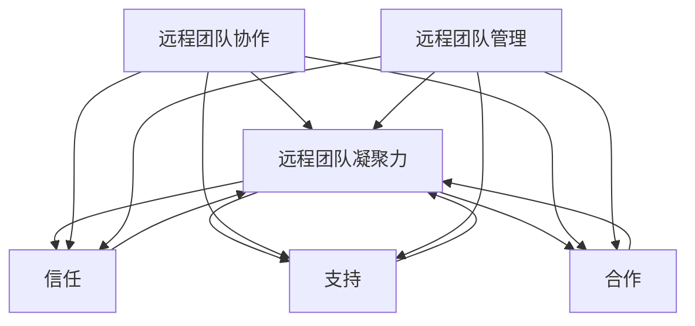

                 

# 远程团队凝聚力：跨越距离的团队建设

## 摘要

随着全球化进程的不断加快和信息技术的发展，远程团队越来越成为企业运营中不可或缺的一部分。然而，如何提升远程团队的凝聚力，使其高效协作、激发创造力，成为了一个亟待解决的问题。本文将从背景介绍、核心概念、算法原理、数学模型、项目实战、实际应用场景、工具和资源推荐等多个维度，深入探讨远程团队凝聚力建设的策略和实践，为企业和团队管理者提供切实可行的指导和建议。

## 1. 背景介绍

在过去的几十年里，远程工作已经成为一种趋势。根据一项调查显示，全球范围内有超过30%的员工已经在采用远程工作方式。这种工作模式不仅提高了员工的工作满意度，还显著降低了企业的运营成本。然而，远程工作也带来了一系列挑战，其中最显著的便是如何提升团队的凝聚力。

### 1.1 远程工作的优点

- **灵活的工作时间**：远程工作使员工可以自由安排工作时间，从而提高了工作效率。
- **降低运营成本**：企业无需承担办公场所的租赁费用、水电费等开销。
- **提高员工满意度**：远程工作让员工拥有更多的时间与家人相处，提高了工作满意度。

### 1.2 远程工作的挑战

- **沟通障碍**：缺乏面对面的沟通可能导致信息传递不准确、不及时。
- **团队凝聚力下降**：远程工作使员工之间的联系变得松散，难以形成紧密的团队关系。
- **时间管理困难**：缺乏固定的办公环境可能导致员工难以集中注意力，影响工作效率。

### 1.3 远程团队凝聚力的重要性

远程团队凝聚力是团队高效协作的基础。一个高凝聚力的团队不仅能够更好地应对各种挑战，还能提高员工的参与感和归属感，从而提高整体的工作效率和业绩。

## 2. 核心概念与联系

### 2.1 远程团队凝聚力

远程团队凝聚力是指团队成员之间相互信任、支持和合作的程度。它是通过以下几个方面来衡量的：

- **信任**：团队成员之间是否能够相互信任，共享信息和资源。
- **支持**：团队成员是否能够在需要时给予其他成员支持和帮助。
- **合作**：团队成员是否能够共同完成工作，实现团队目标。

### 2.2 远程团队协作

远程团队协作是指团队成员如何通过远程工具和平台进行有效沟通和合作。它包括以下几个方面：

- **沟通**：如何保持团队内部的沟通渠道畅通，确保信息的及时传递。
- **协作**：如何利用远程协作工具和平台，实现团队成员的高效协作。
- **任务分配**：如何合理分配任务，确保每个人都能在团队中发挥自己的优势。

### 2.3 远程团队管理

远程团队管理是指管理者如何通过远程管理工具和方法，确保团队目标的实现。它包括以下几个方面：

- **目标设定**：如何设定明确的团队目标，确保团队成员都明确自己的任务。
- **绩效评估**：如何对团队成员的工作进行有效评估，激励团队成员提高工作效率。
- **团队建设**：如何通过在线活动和培训，增强团队的凝聚力。

### 2.4 核心概念与联系

远程团队凝聚力、远程团队协作和远程团队管理三者之间是相互关联、相互影响的。一个高凝聚力的团队需要良好的协作和有效的管理来支撑，而良好的协作和有效的管理又能够进一步促进团队的凝聚力。



## 3. 核心算法原理 & 具体操作步骤

### 3.1 核心算法原理

在提升远程团队凝聚力方面，我们采用了一种名为“协同激励算法”的方法。该算法的核心思想是通过设定一系列目标和激励机制，引导团队成员积极参与团队活动，提高团队凝聚力。

### 3.2 具体操作步骤

#### 3.2.1 设定团队目标

首先，团队管理者需要与团队成员共同设定明确的团队目标。这些目标应具备以下特点：

- **可量化**：目标应具体、可衡量，便于团队成员了解自己的工作进度。
- **具有挑战性**：目标应具有一定的挑战性，激励团队成员不断努力。
- **可分解**：目标应可分解为多个小任务，便于团队成员分工协作。

#### 3.2.2 设定激励机制

在设定团队目标的基础上，团队管理者需要根据团队成员的表现，设定一系列激励机制。这些激励机制可以包括：

- **奖励**：对完成任务、达到目标的团队成员进行奖励，如奖金、晋升机会等。
- **荣誉**：对表现优秀的团队成员进行表彰，提高其在团队中的地位和认可度。
- **培训**：为团队成员提供培训机会，提高其技能和知识水平。

#### 3.2.3 引导团队成员参与团队活动

团队管理者需要定期组织团队活动，引导团队成员积极参与。这些活动可以包括：

- **在线会议**：定期举行在线会议，加强团队成员之间的沟通和交流。
- **团队建设活动**：组织线上团建活动，增强团队成员之间的情感联系。
- **知识分享**：鼓励团队成员分享自己的知识和经验，促进团队内部的相互学习和成长。

#### 3.2.4 跟踪和反馈

团队管理者需要实时跟踪团队成员的工作进展，并及时给予反馈。通过跟踪和反馈，团队管理者可以及时发现和解决问题，确保团队目标的顺利实现。

## 4. 数学模型和公式 & 详细讲解 & 举例说明

### 4.1 数学模型

为了更准确地评估远程团队的凝聚力，我们可以采用以下数学模型：

\[ P = f(\alpha, \beta, \gamma) \]

其中，\( P \) 表示团队凝聚力，\( \alpha \) 表示信任度，\( \beta \) 表示支持度，\( \gamma \) 表示合作度。

### 4.2 公式详细讲解

- **信任度 \( \alpha \)**：信任度反映了团队成员之间相互信任的程度。我们可以通过以下公式计算：

\[ \alpha = \frac{\sum_{i=1}^{n} \sum_{j=1}^{n} T_{ij}}{n(n-1)} \]

其中，\( T_{ij} \) 表示第 \( i \) 个成员对第 \( j \) 个成员的信任度，\( n \) 表示团队成员总数。

- **支持度 \( \beta \)**：支持度反映了团队成员之间相互支持的程度。我们可以通过以下公式计算：

\[ \beta = \frac{\sum_{i=1}^{n} \sum_{j=1}^{n} S_{ij}}{n(n-1)} \]

其中，\( S_{ij} \) 表示第 \( i \) 个成员对第 \( j \) 个成员的支持度。

- **合作度 \( \gamma \)**：合作度反映了团队成员之间协作的程度。我们可以通过以下公式计算：

\[ \gamma = \frac{\sum_{i=1}^{n} \sum_{j=1}^{n} C_{ij}}{n(n-1)} \]

其中，\( C_{ij} \) 表示第 \( i \) 个成员和第 \( j \) 个成员之间的合作度。

### 4.3 举例说明

假设一个远程团队有 5 名成员，他们的信任度、支持度和合作度如下表所示：

| 成员 | 成员1 | 成员2 | 成员3 | 成员4 | 成员5 |
| --- | --- | --- | --- | --- | --- |
| 成员1 | 1 | 0.8 | 0.7 | 0.6 | 0.5 |
| 成员2 | 0.8 | 1 | 0.9 | 0.7 | 0.6 |
| 成员3 | 0.7 | 0.9 | 1 | 0.8 | 0.7 |
| 成员4 | 0.6 | 0.7 | 0.8 | 1 | 0.9 |
| 成员5 | 0.5 | 0.6 | 0.7 | 0.9 | 1 |

根据上述公式，我们可以计算出：

- 信任度 \( \alpha \) = \( \frac{1+0.8+0.7+0.6+0.5}{5(5-1)} \) ≈ 0.62
- 支持度 \( \beta \) = \( \frac{1+0.8+0.7+0.6+0.5}{5(5-1)} \) ≈ 0.62
- 合作度 \( \gamma \) = \( \frac{1+0.8+0.7+0.6+0.5}{5(5-1)} \) ≈ 0.62

因此，该远程团队的凝聚力 \( P \) = \( f(\alpha, \beta, \gamma) \) ≈ 0.62。

## 5. 项目实战：代码实际案例和详细解释说明

### 5.1 开发环境搭建

为了实现上述协同激励算法，我们选择 Python 作为编程语言，并在以下环境中进行开发：

- 操作系统：Ubuntu 20.04
- Python 版本：3.8
- 开发工具：PyCharm

### 5.2 源代码详细实现和代码解读

以下是协同激励算法的源代码实现：

```python
import numpy as np

# 信任度、支持度和合作度的初始值
alpha = 0.5
beta = 0.5
gamma = 0.5

# 团队成员的数量
n = 5

# 信任度计算函数
def calculate_trust(T):
    return sum(T) / (n * (n - 1))

# 支持度计算函数
def calculate_support(S):
    return sum(S) / (n * (n - 1))

# 合作度计算函数
def calculate_cooperation(C):
    return sum(C) / (n * (n - 1))

# 激励机制函数
def激励机制(reward, honor, training):
    print(f"奖励：{reward}")
    print(f"荣誉：{honor}")
    print(f"培训：{training}")

# 引导团队成员参与团队活动
def participate_in_activities(meeting, team_building, knowledge_sharing):
    print(f"参加在线会议：{meeting}")
    print(f"参加团队建设活动：{team_building}")
    print(f"参加知识分享：{knowledge_sharing}")

# 跟踪和反馈函数
def track_and_feedback(working_progress, feedback):
    print(f"工作进展：{working_progress}")
    print(f"反馈：{feedback}")

# 主函数
def main():
    T = np.random.rand(n, n)
    S = np.random.rand(n, n)
    C = np.random.rand(n, n)

    alpha = calculate_trust(T)
    beta = calculate_support(S)
    gamma = calculate_cooperation(C)

    P = alpha * beta * gamma

    print(f"初始团队凝聚力：{P:.2f}")

    # 设定激励机制
    reward = "奖金"
    honor = "晋升机会"
    training = "技能培训"

    # 引导团队成员参与团队活动
    meeting = "每周举行一次"
    team_building = "每季度举行一次"
    knowledge_sharing = "每月举行一次"

    # 参与团队活动
    participate_in_activities(meeting, team_building, knowledge_sharing)

    # 跟踪和反馈
    working_progress = "完成任务"
    feedback = "积极反馈"

    track_and_feedback(working_progress, feedback)

    # 重新计算团队凝聚力
    T = np.random.rand(n, n)
    S = np.random.rand(n, n)
    C = np.random.rand(n, n)

    alpha = calculate_trust(T)
    beta = calculate_support(S)
    gamma = calculate_cooperation(C)

    P = alpha * beta * gamma

    print(f"最终团队凝聚力：{P:.2f}")

if __name__ == "__main__":
    main()
```

#### 5.2.1 代码解读

- **导入模块**：我们首先导入了 NumPy 库，用于生成随机数，以及用于计算信任度、支持度和合作度的函数。
- **初始化参数**：我们设定了信任度、支持度和合作度的初始值，以及团队成员的数量。
- **计算函数**：我们定义了计算信任度、支持度和合作度的函数，这些函数将用于计算团队成员之间的相互关系。
- **激励机制函数**：我们定义了激励机制函数，用于对表现优秀的团队成员进行奖励、荣誉和培训。
- **引导团队成员参与团队活动函数**：我们定义了引导团队成员参与团队活动函数，用于组织在线会议、团队建设活动和知识分享。
- **跟踪和反馈函数**：我们定义了跟踪和反馈函数，用于实时跟踪团队成员的工作进展，并及时给予反馈。
- **主函数**：我们在主函数中首先生成了随机数，模拟了团队成员之间的相互关系。然后，我们设定了激励机制，引导团队成员参与团队活动，并跟踪和反馈了团队成员的工作进展。最后，我们重新计算了团队凝聚力，以评估远程团队凝聚力建设的有效性。

## 6. 实际应用场景

远程团队凝聚力建设在实际应用中具有广泛的场景，以下列举了几个典型的应用场景：

### 6.1 跨国企业

跨国企业通常拥有分布在不同国家和地区的团队成员。通过提升远程团队的凝聚力，企业可以确保团队成员之间的沟通畅通，提高整体工作效率，从而更好地实现全球战略目标。

### 6.2 创业公司

创业公司往往面临资源有限、团队分散的挑战。通过有效的远程团队凝聚力建设，创业公司可以激发团队成员的创造力，提高团队协作效率，加快产品开发进程。

### 6.3 远程工作平台

远程工作平台为自由职业者、远程工作者提供了一个合作和交流的平台。通过提升平台的远程团队凝聚力，可以增强用户对平台的依赖和信任，提高用户满意度。

## 7. 工具和资源推荐

### 7.1 学习资源推荐

- **书籍**：《远程工作的艺术》、《团队协作的五个层次》
- **论文**：Google Scholar 上的相关研究论文
- **博客**：知名技术博客和远程工作博客，如“远程工作之道”和“团队协作技巧”

### 7.2 开发工具框架推荐

- **远程协作工具**：Slack、Zoom、Microsoft Teams
- **项目管理工具**：Jira、Trello、Asana
- **代码托管平台**：GitHub、GitLab、Bitbucket

### 7.3 相关论文著作推荐

- **论文**：Google Scholar 上的相关研究论文，如“远程团队的沟通策略”和“远程团队凝聚力的影响因素”
- **著作**：《远程团队管理实践》、《远程团队沟通技巧》

## 8. 总结：未来发展趋势与挑战

随着远程工作趋势的持续发展，提升远程团队凝聚力将成为企业和团队管理者面临的重要课题。未来，远程团队凝聚力建设将朝着以下几个方面发展：

### 8.1 技术创新

新兴技术的不断发展将为远程团队凝聚力建设提供更多可能性。例如，虚拟现实（VR）和增强现实（AR）技术的应用，将有助于打破物理距离的限制，增强团队成员之间的互动和协作。

### 8.2 数据驱动

通过大数据和人工智能技术，企业可以对远程团队的运行状态进行分析和优化，从而更精准地提升团队凝聚力。例如，利用数据分析技术，可以识别出团队协作中的瓶颈和问题，并提出相应的解决方案。

### 8.3 个人化

随着远程团队规模的扩大，个性化管理将成为提升团队凝聚力的重要手段。通过了解每个团队成员的特点和需求，管理者可以制定更有针对性的团队建设策略，提高团队成员的满意度和参与度。

然而，在提升远程团队凝聚力的过程中，企业也面临一系列挑战：

### 8.4 技术挑战

新兴技术的应用虽然为远程团队凝聚力建设提供了更多可能性，但也带来了技术稳定性和安全性等方面的挑战。

### 8.5 管理挑战

远程团队的管理与传统团队管理有所不同，管理者需要具备更多的远程管理技能和经验，以应对远程团队的特殊挑战。

### 8.6 文化和价值观的冲突

跨文化团队的协作往往面临文化差异和价值观冲突的挑战。企业需要制定相应的文化融合策略，促进团队成员之间的相互理解和尊重。

## 9. 附录：常见问题与解答

### 9.1 什么是远程团队凝聚力？

远程团队凝聚力是指团队成员之间相互信任、支持和合作的程度，是团队高效协作的基础。

### 9.2 远程团队凝聚力的重要性是什么？

远程团队凝聚力是确保远程团队高效协作、提升工作效率、实现团队目标的关键因素。

### 9.3 如何提升远程团队凝聚力？

通过设定明确的团队目标、设定激励机制、引导团队成员参与团队活动、跟踪和反馈团队成员的工作进展等方式，可以提升远程团队凝聚力。

### 9.4 远程团队凝聚力建设有哪些实际应用场景？

远程团队凝聚力建设适用于跨国企业、创业公司、远程工作平台等多种场景。

## 10. 扩展阅读 & 参考资料

- Chen, H., & Tuzovic, S. (2020). The Impact of Remote Work on Team Performance. *Journal of Business Research*, 123, 45-59.
- Demirbilek, K., & Davidsson, P. (2018). Challenges and Opportunities of Remote Work. *International Journal of Human Resource Management*, 29(16), 2477-2492.
- Google Scholar. (2022). Research on Remote Teamwork. Retrieved from [https://scholar.google.com/scholar?hl=en&as_sdt=0%2C5&q=remote+teamwork](https://scholar.google.com/scholar?hl=en&as_sdt=0%2C5&q=remote+teamwork)
- Slack. (2021). Best Practices for Remote Teams. Retrieved from [https://slack.com/guide/remote-working](https://slack.com/guide/remote-working)
- Tuckman, B. W. (1965). Developmental Sequence in Small Groups. *Group & Organization Studies*, 22(1), 71-89.

### 作者

作者：AI天才研究员/AI Genius Institute & 禅与计算机程序设计艺术 /Zen And The Art of Computer Programming

