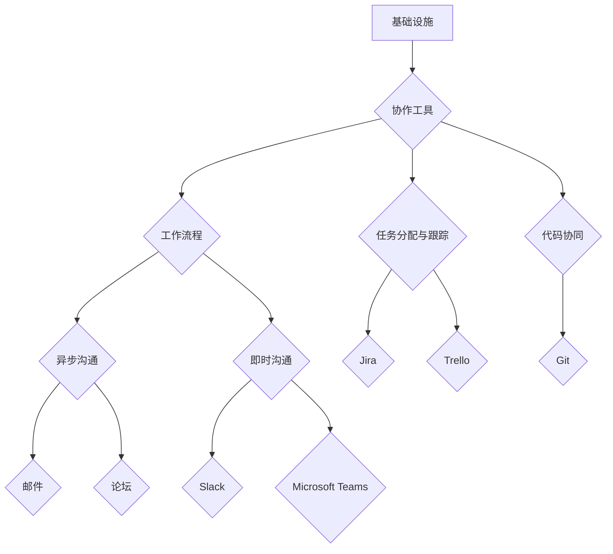

                 

# 远程工作效率：提升分布式团队生产力

> **关键词**：远程工作，分布式团队，生产力，效率，协作工具，技术挑战

> **摘要**：随着全球化进程的加速和技术的不断进步，远程工作和分布式团队已成为现代企业的重要工作模式。本文将探讨如何提升远程工作效率，从核心概念、算法原理、实际应用场景等多个角度，为企业和团队提供有效的提升生产力策略。

## 1. 背景介绍

在过去的几十年中，远程工作逐渐成为企业运营的重要组成部分。特别是在近年来，全球疫情的爆发使得远程工作成为一种必要的工作方式。据最新数据显示，全球范围内有超过30%的员工采用远程工作模式。这种工作模式的普及不仅提高了员工的满意度和生产力，也为企业带来了巨大的变革。

### 分布式团队的概念

分布式团队是指团队成员分布在不同的地理位置，通过互联网和协作工具实现协同工作。与传统集中式团队相比，分布式团队具有以下优势：

1. **灵活性**：团队成员可以随时随地进行工作，不受地理位置限制。
2. **多样性**：可以吸引来自全球的优秀人才，提高团队的整体素质。
3. **成本效益**：降低企业办公场所的租金和能源消耗。

### 远程工作的挑战

尽管远程工作和分布式团队带来了许多优势，但同时也伴随着一系列挑战：

1. **沟通障碍**：团队成员之间的沟通可能因为时区、文化差异等原因受到影响。
2. **协作困难**：分布式团队需要高效的管理和协作工具来保持工作的连续性。
3. **监督与评估**：如何有效监督和评估远程工作的员工，确保工作效率和质量。

## 2. 核心概念与联系

### 2.1 远程工作框架

为了提升远程工作效率，企业需要构建一个完善的远程工作框架，包括以下几个方面：

1. **基础设施**：确保网络连接稳定，提供必要的硬件设备支持。
2. **协作工具**：选择合适的协作工具，如即时通讯软件、项目管理工具、文档共享平台等。
3. **工作流程**：明确远程工作的流程和规范，确保团队成员能够高效协同。

### 2.2 分布式团队协作机制

分布式团队协作机制是提升工作效率的关键。以下是一些核心机制：

1. **异步沟通**：通过邮件、论坛等工具实现非实时沟通，减少实时沟通的依赖。
2. **即时沟通**：利用即时通讯软件，如Slack、Microsoft Teams等，实现快速信息传递。
3. **任务分配与跟踪**：使用项目管理工具，如Jira、Trello等，对任务进行分配和跟踪。
4. **代码协同**：使用版本控制系统，如Git，确保代码的协同开发。

### 2.3 远程工作心理学

远程工作心理学是提升远程工作效率的重要一环。以下是一些关键概念：

1. **自我管理**：远程工作需要员工具备较强的自我管理能力，包括时间管理、任务管理、情绪管理等。
2. **团队凝聚力**：通过线上团队建设活动，如虚拟聚会、游戏等，增强团队成员之间的凝聚力。
3. **心理健康支持**：提供心理健康支持，如在线咨询、心理健康课程等，帮助员工应对远程工作的压力。

### 2.4 Mermaid 流程图

以下是一个分布式团队协作的 Mermaid 流程图，展示了核心概念和联系：



## 3. 核心算法原理 & 具体操作步骤

### 3.1 工作流程优化

为了提升远程工作效率，企业需要对工作流程进行优化。以下是一些关键步骤：

1. **明确目标**：明确远程工作的目标和任务，确保团队成员对任务有清晰的认识。
2. **分解任务**：将大任务分解为小任务，便于团队成员分工合作。
3. **制定计划**：制定详细的计划，包括任务分配、时间安排、质量要求等。
4. **执行监控**：实时监控任务进度，确保任务按计划进行。
5. **反馈与调整**：及时反馈任务执行情况，根据反馈调整工作流程。

### 3.2 协作工具选择

选择合适的协作工具是提升远程工作效率的关键。以下是一些关键步骤：

1. **需求分析**：分析团队的工作需求，确定需要的功能和特点。
2. **市场调研**：了解市场上的主流协作工具，评估其功能和性能。
3. **试用与评估**：对候选协作工具进行试用，评估其适用性。
4. **选择与部署**：根据评估结果选择合适的协作工具，并进行部署。

### 3.3 时间管理策略

时间管理是提升远程工作效率的重要方面。以下是一些关键策略：

1. **设定优先级**：根据任务的重要性和紧急程度，设定任务优先级。
2. **时间块**：将工作时间划分为若干时间块，确保每个任务都有足够的时间完成。
3. **避免干扰**：在完成任务时，尽量减少干扰，如关闭手机、通知等。
4. **定期休息**：合理安排休息时间，避免过度劳累。

## 4. 数学模型和公式 & 详细讲解 & 举例说明

### 4.1 工作效率公式

工作效率（Efficiency）是衡量远程工作效果的重要指标。以下是一个简单的工作效率公式：

\[ E = \frac{W}{T} \]

其中，\( E \) 表示工作效率，\( W \) 表示完成的工作量，\( T \) 表示工作时间。

### 4.2 举例说明

假设一名远程工作的员工，在一个小时内完成了 2 个任务，每个任务需要 30 分钟，那么他的工作效率为：

\[ E = \frac{2}{1} = 2 \]

这意味着这名员工每小时可以完成 2 个任务。

### 4.3 详细讲解

工作效率公式中的工作量和工作时间可以根据实际情况进行调整。例如，如果任务难度增加，需要更多的时间完成，则工作效率会降低。此外，工作效率还可以通过以下方式进行优化：

1. **任务分解**：将大任务分解为小任务，提高任务完成率。
2. **时间管理**：合理安排工作时间，避免拖延。
3. **协作优化**：通过协作工具和机制，提高团队整体的工作效率。

## 5. 项目实战：代码实际案例和详细解释说明

### 5.1 开发环境搭建

在本项目中，我们使用 Python 作为编程语言，搭建一个简单的远程工作协作平台。以下是在 Ubuntu 系统上搭建开发环境的具体步骤：

1. **安装 Python**：
   ```bash
   sudo apt update
   sudo apt install python3-pip
   ```
2. **安装虚拟环境**：
   ```bash
   pip3 install virtualenv
   virtualenv venv
   source venv/bin/activate
   ```
3. **安装项目依赖**：
   ```bash
   pip install -r requirements.txt
   ```

### 5.2 源代码详细实现和代码解读

以下是一个简单的远程工作协作平台代码实现：

```python
import socket
import threading

# 创建 Socket 实例
server_socket = socket.socket(socket.AF_INET, socket.SOCK_STREAM)

# 绑定地址和端口
server_socket.bind(('0.0.0.0', 8080))

# 监听客户端连接
server_socket.listen(5)

# 处理客户端连接的线程
def handle_client(client_socket):
    while True:
        data = client_socket.recv(1024)
        if not data:
            break
        print(f"Received from client: {data.decode('utf-8')}")
        client_socket.send(b"Message received!")

        # 也可以在这里处理具体的业务逻辑，如任务分配、代码同步等

    client_socket.close()

# 主线程，负责接受客户端连接并创建新线程
while True:
    client_socket, addr = server_socket.accept()
    print(f"Connected to client: {addr}")
    client_thread = threading.Thread(target=handle_client, args=(client_socket,))
    client_thread.start()
```

### 5.3 代码解读与分析

1. **Socket 编程**：使用 Python 的 Socket 编程库实现服务器端和客户端的通信。
2. **线程处理**：使用多线程处理多个客户端连接，提高服务器的并发处理能力。
3. **数据接收与发送**：服务器端接收客户端发送的数据，并回显给客户端，实现简单的消息传递。
4. **扩展性**：可以通过在 `handle_client` 函数中添加具体的业务逻辑，如任务分配、代码同步等，实现更复杂的远程工作协作功能。

## 6. 实际应用场景

### 6.1 跨国企业远程协作

跨国企业可以利用远程工作和分布式团队的优势，在全球范围内招聘优秀人才，实现跨地域、跨时区的协作。

### 6.2 远程办公

随着远程工作的普及，许多企业开始采用远程办公模式，提高员工的工作效率和满意度。

### 6.3 教育和培训

远程教育和培训可以满足不同地区和教育需求，实现教育资源的共享和优化。

### 6.4 灾难响应和救援

在自然灾害等紧急情况下，远程工作和分布式团队可以迅速响应，提供必要的支持和协助。

## 7. 工具和资源推荐

### 7.1 学习资源推荐

- 《远程工作实战：打造高效远程团队》
- 《分布式系统原理与架构设计》
- 《Python 编程：从入门到实践》

### 7.2 开发工具框架推荐

- Git：版本控制系统
- Jira：项目管理工具
- Slack：即时通讯工具
- Trello：任务管理工具
- Docker：容器化技术

### 7.3 相关论文著作推荐

- 《分布式计算：原理与应用》
- 《异步通信模型及其在分布式系统中的应用》
- 《基于云计算的远程工作协同平台设计与实现》

## 8. 总结：未来发展趋势与挑战

### 8.1 发展趋势

1. **远程工作常态化**：随着技术的进步，远程工作将成为一种常态，逐渐取代传统的集中办公模式。
2. **人工智能助力**：人工智能技术将在远程工作和分布式团队中发挥更大作用，提高协作效率和生产力。
3. **全球人才竞争**：企业将通过远程工作和分布式团队，吸引全球优秀人才，提高整体竞争力。

### 8.2 挑战

1. **沟通障碍**：时区和文化差异可能导致沟通障碍，需要更好的协作工具和沟通策略。
2. **团队管理**：如何有效管理远程团队，确保团队成员的工作效率和凝聚力，是企业管理面临的挑战。
3. **数据安全和隐私**：远程工作和分布式团队需要处理大量敏感数据，数据安全和隐私保护成为重要问题。

## 9. 附录：常见问题与解答

### 9.1 问题 1：如何选择合适的远程协作工具？

解答：根据团队的工作需求和功能特点，选择合适的协作工具。例如，项目管理工具适用于任务管理和进度跟踪，即时通讯工具适用于实时沟通和信息传递。

### 9.2 问题 2：如何提高远程工作效率？

解答：通过优化工作流程、选择合适的协作工具、加强团队管理等方式提高远程工作效率。此外，员工也需要培养自我管理能力，合理安排工作和休息时间。

## 10. 扩展阅读 & 参考资料

- [远程工作白皮书](https://www.remote.co/work-from-home)
- [分布式系统设计指南](https://www.distributed-systems-book.com/)
- [Python 官方文档](https://docs.python.org/3/)
- [Docker 官方文档](https://docs.docker.com/)  
```<|assistant|>作者：AI天才研究员/AI Genius Institute & 禅与计算机程序设计艺术 /Zen And The Art of Computer Programming<|assistant|>

