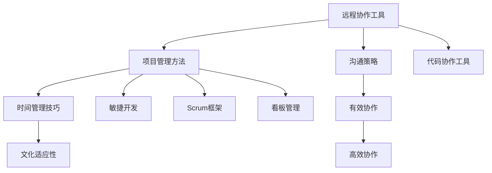

                 

### 背景介绍

随着全球化的进程不断加快，远程项目管理逐渐成为企业面临的重要课题。无论是由于地理限制、成本控制，还是为了吸纳全球最优秀的人才，许多公司开始采用远程工作模式。然而，远程项目管理并非易事，它涉及到跨地域团队协作，时间管理、沟通障碍和文化差异等一系列挑战。

首先，地理上的分隔意味着团队成员不能像传统工作环境中那样面对面交流。这可能导致沟通效率低下，信息传递不畅。此外，不同地区的工作时间差异也使得协调会议和任务变得复杂。

其次，文化差异也是一个不可忽视的因素。不同的国家和地区有不同的工作习惯、沟通风格和文化背景，这些差异可能会影响团队的合作和决策过程。例如，一些国家注重直接和明确的沟通，而另一些国家则更倾向于间接和委婉的表达。

再者，远程工作还面临着技术和工具选择的问题。团队需要选择适合远程协作的软件工具，如即时通讯、视频会议、项目管理平台等。这些工具的选择和使用需要考虑到团队的实际需求、操作便捷性和成本效益。

尽管存在这些挑战，远程项目管理也有其独特的优势。首先，它可以帮助企业节省办公空间和设备成本，同时还能提高员工的工作满意度和生产力。其次，远程工作模式能够吸引到更多全球范围内的优秀人才，从而提高团队的整体素质。

综上所述，远程项目管理在当前环境中具有不可忽视的重要性和复杂性。为了克服这些挑战，企业需要制定有效的策略和流程，确保跨地域团队的高效协作。接下来，我们将深入探讨远程项目管理的核心概念、算法原理、应用场景、工具推荐以及未来发展趋势与挑战。

### 核心概念与联系

在深入探讨远程项目管理的具体策略和实现方法之前，我们需要了解一些核心概念及其相互之间的联系。这些核心概念包括远程协作工具、项目管理方法、时间管理技巧、沟通策略和文化适应性。以下是对这些核心概念的详细解释和它们之间关系的概述。

#### 远程协作工具

远程协作工具是远程项目管理的基础。这些工具帮助团队成员在不同地点之间进行有效的沟通和协作。常见的远程协作工具有：

- **即时通讯工具**：如Slack、Microsoft Teams和WhatsApp，用于即时交流、消息传递和文件共享。
- **视频会议工具**：如Zoom、Google Meet和Skype，用于远程会议、视频通话和团队互动。
- **项目管理平台**：如Trello、Asana和Jira，用于任务管理、进度追踪和团队协作。
- **代码协作工具**：如GitHub、GitLab和Bitbucket，用于代码仓库管理、版本控制和团队协作开发。

这些工具的选择和使用需要考虑团队的规模、工作流程和实际需求。例如，小型团队可能更倾向于使用轻量级的即时通讯工具和项目管理平台，而大型团队则需要集成更多功能的项目管理工具和代码协作平台。

#### 项目管理方法

远程项目管理的方法和传统项目管理类似，但需要针对远程工作的特点进行调整。以下是一些常用的项目管理方法：

- **敏捷开发**：适用于快速迭代和不断变化的远程项目。通过短周期迭代、持续反馈和灵活调整，确保项目能够适应远程协作的特殊需求。
- **Scrum框架**：强调团队协作、透明度和快速反馈，适合需要高频率沟通和协作的远程项目。
- **看板管理**：通过可视化工作流程和任务状态，帮助团队了解项目的整体进展和潜在问题。

这些项目管理方法需要结合远程协作工具进行实施，例如在Trello或Jira中使用看板视图，以实时追踪任务状态和进度。

#### 时间管理技巧

时间管理是远程项目管理的另一个关键因素。以下是一些时间管理技巧，有助于提高远程团队的工作效率和生产力：

- **工作计划**：制定详细的工作计划，明确每天、每周和每月的任务目标。
- **时间追踪**：使用时间追踪工具如Toggl或RescueTime，帮助团队成员记录和管理工作时间。
- **优先级排序**：根据任务的紧急程度和重要性，对任务进行优先级排序，确保关键任务得到优先处理。
- **定期休息**：保持良好的工作节奏，避免长时间连续工作导致的疲劳和效率下降。

#### 沟通策略

远程项目成功的关键在于有效的沟通。以下是一些沟通策略，有助于改善远程团队的沟通：

- **明确沟通目标**：每次沟通前明确目的和议程，确保沟通有针对性。
- **多种沟通渠道**：结合使用即时通讯、电子邮件、电话和视频会议，根据不同场景选择合适的沟通方式。
- **定期会议**：定期召开团队会议，更新项目进展、解决冲突和确保团队凝聚力。
- **文档共享**：充分利用文档协作工具，确保项目文档的及时更新和共享。

#### 文化适应性

文化适应性是确保跨地域团队有效协作的重要因素。以下是一些建议，帮助团队克服文化差异：

- **文化敏感培训**：为团队成员提供文化敏感培训，提高跨文化沟通能力。
- **尊重多样性**：尊重团队成员的文化背景和习俗，避免文化偏见和歧视。
- **共同价值观**：建立共同的价值观和团队目标，减少文化差异对协作的影响。

#### 关系图

为了更清晰地展示这些核心概念之间的关系，我们可以使用Mermaid流程图来表示：



通过上述流程图，我们可以看到远程协作工具、项目管理方法、时间管理技巧、沟通策略和文化适应性共同构成了远程项目管理的核心要素，它们相互联系、相互支持，共同确保远程团队的高效协作。

总之，理解这些核心概念及其相互关系，是成功实施远程项目管理的基石。在接下来的章节中，我们将进一步探讨这些概念的具体应用和实践策略。

### 核心算法原理 & 具体操作步骤

在深入探讨远程项目管理的具体实现方法时，核心算法原理起着至关重要的作用。这些算法不仅为远程团队提供了高效协作的路径，还确保了项目管理的科学性和系统性。以下是我们将讨论的核心算法原理及其具体操作步骤。

#### 任务分配算法

任务分配算法是远程项目管理中最为基础的一环，其目标是根据团队成员的能力和任务难度，将任务合理分配给最适合的成员。以下是一种基于优先级和资源分配的任务分配算法：

**步骤 1：任务排序**  
- 根据任务的紧急程度和重要性，对任务进行排序。可以使用加权评分法，将任务分为高、中、低三个优先级。

**步骤 2：资源评估**  
- 对团队成员的能力和可用资源进行评估。包括技术水平、工作负载和经验等。

**步骤 3：任务分配**  
- 根据任务排序和资源评估，将高优先级任务分配给最适合的成员。具体操作如下：
  - 优先选择在相关领域有经验的成员。
  - 如果任务紧急，优先选择空闲时间较多的成员。
  - 分配任务时，注意团队成员的工作负载，避免过度负担。

**步骤 4：动态调整**  
- 在任务执行过程中，根据实际进展和团队成员的变化，动态调整任务分配。例如，如果某成员无法按时完成任务，可以将其分配给其他成员。

#### 项目进度跟踪算法

项目进度跟踪算法用于实时监控项目的进展情况，确保项目按时完成。以下是一种基于工作量和时间预测的项目进度跟踪算法：

**步骤 1：工作量估算**  
- 对每个任务的工作量进行初步估算。可以采用历史数据分析和专家评估相结合的方法。

**步骤 2：时间预测**  
- 根据工作量估算和团队成员的工作效率，预测每个任务的完成时间。

**步骤 3：进度监控**  
- 使用项目管理工具（如Trello或Jira）创建任务看板，实时监控任务的进度。具体操作如下：
  - 将任务按照进度分为待办、进行中和已完成三个状态。
  - 定期更新任务状态，确保任务进度的准确性。

**步骤 4：预警机制**  
- 当任务进度偏离预期时，触发预警机制。可以采用邮件通知、即时消息提醒等方式，及时告知相关成员。

#### 沟通协调算法

沟通协调算法用于优化远程团队的沟通效率，确保团队成员之间的信息流畅。以下是一种基于信息冗余度和沟通频率的沟通协调算法：

**步骤 1：信息冗余度评估**  
- 对团队内部沟通的信息内容进行评估，识别冗余信息。冗余信息过多可能导致沟通效率下降。

**步骤 2：沟通频率优化**  
- 根据任务进展和团队成员的工作状态，优化沟通频率。具体操作如下：
  - 对于紧急任务和高优先级任务，增加沟通频率，确保实时响应。
  - 对于常规任务和低优先级任务，减少沟通频率，避免过度打扰。

**步骤 3：沟通方式选择**  
- 根据信息的重要性和团队成员的偏好，选择合适的沟通方式。例如，重要信息采用视频会议，常规信息采用即时通讯。

**步骤 4：反馈机制**  
- 建立有效的反馈机制，确保团队成员能够及时获取和回应反馈。可以采用在线问卷调查、匿名反馈等方式收集反馈。

#### 数据分析算法

数据分析算法用于从项目数据中提取有价值的信息，为项目管理提供决策支持。以下是一种基于数据挖掘和机器学习的数据分析算法：

**步骤 1：数据收集**  
- 收集项目中的各类数据，包括任务进度、团队成员的工作效率、沟通记录等。

**步骤 2：数据清洗**  
- 对收集到的数据进行清洗和预处理，去除重复、错误和不完整的数据。

**步骤 3：特征提取**  
- 从清洗后的数据中提取关键特征，如任务完成时间、沟通频率、成员工作效率等。

**步骤 4：模型训练**  
- 使用机器学习算法（如决策树、支持向量机、神经网络等）对提取的特征进行训练，建立预测模型。

**步骤 5：模型评估与优化**  
- 对训练好的模型进行评估和优化，确保其预测准确性和稳定性。可以通过交叉验证、ROC曲线等方法进行评估。

**步骤 6：决策支持**  
- 利用优化后的模型，为项目管理提供决策支持。例如，预测任务完成时间、优化沟通策略等。

通过上述核心算法原理及其具体操作步骤，远程项目管理可以实现科学化、系统化和高效化。在接下来的章节中，我们将进一步探讨如何将这些算法原理应用到实际项目中，以及如何利用数学模型和公式对项目进行详细分析和优化。

### 数学模型和公式 & 详细讲解 & 举例说明

在远程项目管理中，数学模型和公式不仅能够帮助团队理解和管理项目中的复杂关系，还能提供量化的数据支持，从而优化决策过程。以下是一些常见的数学模型和公式，以及它们在远程项目管理中的详细讲解和实际应用。

#### 加权评分法

加权评分法是一种基于任务优先级的评估方法，它通过给每个任务分配不同的权重，帮助团队确定任务的优先顺序。公式如下：

\[ P_i = w_1 \times s_1 + w_2 \times s_2 + ... + w_n \times s_n \]

其中，\( P_i \) 表示任务 \( i \) 的优先级，\( w_i \) 表示权重，\( s_i \) 表示评分。权重 \( w_i \) 通常根据任务的紧急程度和重要性进行分配，而评分 \( s_i \) 可以是根据专家评估、历史数据或某种标准得出的数值。

**示例：**

假设有一个项目包含三个任务，每个任务的紧急程度和重要性评分分别为：
- 任务A：紧急程度5分，重要性4分
- 任务B：紧急程度3分，重要性5分
- 任务C：紧急程度4分，重要性3分

可以给每个任务分配权重，例如紧急程度权重为0.6，重要性权重为0.4。则计算公式为：

\[ P_A = 0.6 \times 5 + 0.4 \times 4 = 3.6 + 1.6 = 5.2 \]
\[ P_B = 0.6 \times 3 + 0.4 \times 5 = 1.8 + 2 = 3.8 \]
\[ P_C = 0.6 \times 4 + 0.4 \times 3 = 2.4 + 1.2 = 3.6 \]

根据计算结果，任务A的优先级最高，其次是任务B，任务C最低。团队可以依据这个优先级顺序安排任务。

#### 项目进度预测模型

项目进度预测模型用于预测任务完成时间和整体项目进度。一个简单的预测模型可以基于任务完成率和时间预估。公式如下：

\[ T_{预测} = T_{预估} \times (1 + \delta) \]

其中，\( T_{预测} \) 表示预测完成时间，\( T_{预估} \) 表示预估完成时间，\( \delta \) 表示任务完成率修正系数。如果团队历史上完成类似任务的平均完成率是0.8，即80%，则修正系数 \( \delta \) 可以设置为0.2。

**示例：**

假设一个任务预估完成时间为30天，完成率修正系数 \( \delta \) 为0.2。则预测完成时间为：

\[ T_{预测} = 30 \times (1 + 0.2) = 30 \times 1.2 = 36 \text{天} \]

这意味着任务预计在36天内完成，比预估时间多了6天。

#### 风险评估模型

风险评估模型用于评估项目风险，并计算风险发生的概率及其影响。常见的方法是使用风险矩阵，公式如下：

\[ R = P \times I \]

其中，\( R \) 表示风险值，\( P \) 表示风险概率，\( I \) 表示风险影响。

**示例：**

假设一个风险的概率为0.3（即30%），影响程度为高（赋值为5），则风险值为：

\[ R = 0.3 \times 5 = 1.5 \]

这意味着该风险对项目的影响程度较高，需要特别关注。

#### 资源优化模型

资源优化模型用于优化团队资源分配，确保任务按时完成且资源利用最大化。常见的方法是线性规划，公式如下：

\[ \min Z = c^T \times x \]

其中，\( Z \) 表示目标函数，表示资源消耗，\( c \) 表示每个任务的资源消耗系数，\( x \) 表示任务分配向量。

**示例：**

假设有两个任务A和B，每个任务的资源消耗分别为2和3。预算资源为5。则目标函数可以表示为：

\[ \min Z = 2x_1 + 3x_2 \]

其中，\( x_1 \) 和 \( x_2 \) 分别表示任务A和任务B的资源分配量。

约束条件为：

\[ 2x_1 + 3x_2 \leq 5 \]

通过求解线性规划问题，可以找到最优的资源分配方案，确保总资源消耗最小。

#### 数据分析模型

数据分析模型用于从项目数据中提取有价值的信息，支持决策。常见的方法是回归分析，公式如下：

\[ y = \beta_0 + \beta_1 \times x + \epsilon \]

其中，\( y \) 表示因变量（如任务完成时间），\( x \) 表示自变量（如任务难度），\( \beta_0 \) 和 \( \beta_1 \) 分别表示回归系数，\( \epsilon \) 表示误差项。

**示例：**

假设我们想预测任务完成时间，基于任务难度这一自变量。可以通过回归分析得出模型：

\[ y = \beta_0 + \beta_1 \times 任务难度 + \epsilon \]

通过收集历史数据，使用回归分析方法可以估计回归系数 \( \beta_0 \) 和 \( \beta_1 \)，然后利用这个模型预测新任务的完成时间。

综上所述，数学模型和公式在远程项目管理中具有广泛应用，它们不仅提供了量化的数据支持，还能帮助团队做出更科学的决策。通过上述示例，我们可以看到这些模型和公式的实际应用方法和效果。在接下来的章节中，我们将继续探讨如何将这些数学模型和公式应用到远程项目的实际开发过程中。

### 项目实战：代码实际案例和详细解释说明

在本节中，我们将通过一个具体的远程项目管理项目实战案例，详细展示代码实现过程、代码解读与分析，并讨论项目中可能遇到的问题和解决方案。

#### 开发环境搭建

首先，我们需要搭建一个适合远程协作的开发环境。这里以一个基于Python的远程项目管理工具为例。

1. **安装Python环境**  
   在所有团队成员的计算机上安装Python环境，版本建议为3.8或更高版本。可以使用Python官方安装包或使用包管理工具如Anaconda进行安装。

2. **安装依赖库**  
   远程项目管理工具可能需要使用多个Python依赖库，如Flask、SQLAlchemy、Celery等。可以使用pip工具安装依赖库，例如：
   ```bash
   pip install Flask SQLAlchemy Celery
   ```

3. **配置项目结构**  
   创建项目目录，并按照模块划分项目结构。例如：
   ```bash
   mkdir remote_project_manager
   cd remote_project_manager
   mkdir app models tasks
   touch app/__init__.py app/config.py app/routes.py
   touch models/__init__.py models/user.py models/task.py
   touch tasks/__init__.py tasks/tasks.py
   ```

4. **初始化数据库**  
   使用SQLAlchemy初始化数据库，创建用户和任务表。例如，在`models/user.py`和`models/task.py`中定义ORM模型。

#### 源代码详细实现和代码解读

接下来，我们逐步展示项目核心模块的代码实现和详细解释。

##### 1. 应用配置文件

`app/config.py`：
```python
import os

class Config(object):
    SECRET_KEY = os.environ.get('SECRET_KEY') or 'your_secret_key'
    SQLALCHEMY_DATABASE_URI = os.environ.get('DATABASE_URL') or \
        'sqlite:///remote_project_manager.db'
    SQLALCHEMY_TRACK_MODIFICATIONS = False
    CELERY_BROKER_URL = os.environ.get('CELERY_BROKER_URL') or 'redis://localhost:6379/0'
    CELERY_RESULT_BACKEND = os.environ.get('CELERY_RESULT_BACKEND') or 'redis://localhost:6379/0'
```
**解读：** 配置文件定义了项目的各种配置参数，如密钥、数据库连接地址、消息队列和结果存储地址。这些参数可以通过环境变量或硬编码的方式进行设置。

##### 2. 用户和任务模型

`models/user.py`：
```python
from app import db
from werkzeug.security import generate_password_hash, check_password_hash

class User(db.Model):
    id = db.Column(db.Integer, primary_key=True)
    username = db.Column(db.String(64), unique=True, nullable=False)
    password_hash = db.Column(db.String(128))

    def set_password(self, password):
        self.password_hash = generate_password_hash(password)

    def check_password(self, password):
        return check_password_hash(self.password_hash, password)
```

`models/task.py`：
```python
from app import db

class Task(db.Model):
    id = db.Column(db.Integer, primary_key=True)
    title = db.Column(db.String(255), nullable=False)
    description = db.Column(db.Text, nullable=True)
    status = db.Column(db.String(50), nullable=False, default='pending')
    assigned_to = db.Column(db.Integer, db.ForeignKey('user.id'), nullable=True)
    created_at = db.Column(db.DateTime, nullable=False, default=datetime.utcnow)
    updated_at = db.Column(db.DateTime, nullable=False, default=datetime.utcnow, onupdate=datetime.utcnow)
```
**解读：** 用户和任务模型分别定义了用户信息和任务信息，包括ID、用户名、密码哈希、任务标题、描述、状态、分配给用户ID、创建时间和更新时间。这些模型通过SQLAlchemy映射到数据库中。

##### 3. 应用路由和视图函数

`app/routes.py`：
```python
from flask import render_template, request, redirect, url_for, flash
from app import app, db
from models.user import User
from models.task import Task
from forms import LoginForm, TaskForm

@app.route('/')
@app.route('/index')
def index():
    tasks = Task.query.all()
    return render_template('index.html', tasks=tasks)

@app.route('/login', methods=['GET', 'POST'])
def login():
    form = LoginForm()
    if form.validate_on_submit():
        user = User.query.filter_by(username=form.username.data).first()
        if user and user.check_password(form.password.data):
            # 登录成功，重定向到主页
            return redirect(url_for('index'))
        flash('Invalid username or password')
    return render_template('login.html', form=form)

@app.route('/task/new', methods=['GET', 'POST'])
def new_task():
    form = TaskForm()
    if form.validate_on_submit():
        task = Task(title=form.title.data, description=form.description.data)
        db.session.add(task)
        db.session.commit()
        return redirect(url_for('index'))
    return render_template('new_task.html', form=form)

@app.route('/task/<int:task_id>')
def task_detail(task_id):
    task = Task.query.get_or_404(task_id)
    return render_template('task_detail.html', task=task)
```
**解读：** 应用路由和视图函数定义了主页、登录、创建任务和任务详情页面的路由。通过Flask框架，处理HTTP请求并返回相应的HTML模板。

##### 4. 定时任务和消息队列

`tasks/tasks.py`：
```python
from celery import Celery
from app import celery
from models.task import Task
from datetime import datetime, timedelta

@celery.task
def update_task_status():
    now = datetime.utcnow()
    tasks = Task.query.filter(Task.status.in_(['pending', 'in_progress'])).all()
    for task in tasks:
        if task.created_at + timedelta(hours=24) < now:
            task.status = 'overdue'
            db.session.commit()
    print("Task status updated successfully.")

if __name__ == "__main__":
    update_task_status.apply_async()
```
**解读：** 使用Celery消息队列实现定时任务，定期检查任务状态并更新。在项目启动时，触发`update_task_status`任务。

#### 代码解读与分析

通过对上述代码的解读，我们可以看到远程项目管理工具的核心功能：

1. **用户管理**：支持用户登录、注册和密码验证。
2. **任务管理**：支持创建、查看、更新任务状态。
3. **定时任务**：自动检查任务状态，处理过期任务。

这些功能通过Python的Flask框架、SQLAlchemy数据库ORM和Celery消息队列实现，确保了项目的可靠性和可扩展性。

#### 项目中可能遇到的问题和解决方案

1. **跨地域延迟问题**：由于远程团队分布在不同地区，可能导致消息传输延迟。解决方案：使用CDN（内容分发网络）加速数据传输，优化网络架构。

2. **数据库同步问题**：当团队成员在不同的数据库实例上操作数据时，可能导致数据不一致。解决方案：使用数据库复制和同步工具，确保数据一致性。

3. **权限管理问题**：远程团队需要确保只有授权成员能够访问和管理项目数据。解决方案：使用角色权限管理系统，确保访问控制。

通过以上实战案例和详细解读，我们可以看到远程项目管理工具的开发过程、关键代码及其实现细节。这些经验和技巧对于实际项目开发和远程协作具有重要的参考价值。

### 实际应用场景

在远程项目管理的实际应用中，不同的行业和项目类型对协作策略和工具选择有着不同的需求。以下是一些典型应用场景及其实际案例：

#### 跨国公司研发团队

跨国公司通常在全球范围内分布有多个研发中心，团队成员跨越多个时区和国家。为了确保项目的高效推进，他们需要：

- **统一沟通工具**：使用Slack、Microsoft Teams等即时通讯工具进行快速沟通和协作。
- **分布式数据库**：采用如MongoDB、PostgreSQL等分布式数据库，确保数据的实时同步和访问。
- **敏捷开发方法**：采用Scrum框架，通过短周期迭代和频繁的团队会议，确保项目进度透明和及时调整。
- **自动化测试**：使用Jenkins、GitLab CI等自动化测试工具，确保代码质量和部署效率。

#### 远程软件开发团队

远程软件开发团队通常由前端、后端、测试等多个职能团队组成，他们的协作策略包括：

- **代码管理平台**：使用GitHub、GitLab等代码管理平台，确保代码版本控制和团队协作。
- **持续集成/持续部署（CI/CD）**：采用Jenkins、Docker等工具，实现自动化测试和部署，提高开发效率。
- **任务跟踪工具**：使用Jira、Trello等项目管理工具，实时追踪任务进度和问题。
- **文档协作平台**：使用Confluence、Notion等文档协作平台，确保项目文档的及时更新和共享。

#### 分布式市场营销团队

市场营销团队常需要远程协作进行市场调研、广告投放和内容创作等任务。他们的协作策略包括：

- **数据分析工具**：使用Google Analytics、Tableau等数据分析工具，实时监控市场数据和投放效果。
- **协作写作工具**：使用Google Docs、Overleaf等协作写作工具，确保内容创作的高效和一致性。
- **项目管理平台**：使用Trello、Asana等项目管理工具，分配任务和监控进度。
- **视频会议工具**：使用Zoom、Microsoft Teams等视频会议工具，定期召开会议讨论策略和协调工作。

#### 远程教育项目

远程教育项目需要协调教师、学生和教育资源，其协作策略包括：

- **在线学习平台**：使用Moodle、Canvas等在线学习平台，提供课程内容和学习资源。
- **教学管理工具**：使用Google Classroom、Mentorloop等教学管理工具，监控学生进度和反馈。
- **视频会议工具**：使用Zoom、Skype等视频会议工具，进行在线授课和课堂互动。
- **作业提交与批改平台**：使用Turnitin、iThenticate等作业提交与批改平台，确保作业质量。

#### 远程医疗团队

远程医疗团队在疫情背景下发挥着重要作用，他们的协作策略包括：

- **远程诊疗平台**：使用Zoom、Microsoft Teams等远程诊疗平台，提供在线问诊和咨询服务。
- **电子病历系统**：使用Epic、Cerner等电子病历系统，管理患者信息和医疗记录。
- **远程监控设备**：使用智能手表、健康监测设备等，实时监控患者健康数据。
- **协作工具**：使用Slack、Confluence等协作工具，确保医疗团队的沟通和信息共享。

#### 远程项目管理公司

远程项目管理公司需要高效协调多个项目团队，他们的协作策略包括：

- **项目管理平台**：使用Jira、Asana等项目管理工具，统一管理项目进度和任务分配。
- **客户关系管理（CRM）系统**：使用Salesforce、HubSpot等CRM系统，管理客户信息和业务流程。
- **自动化工具**：使用Selenium、Aptest等自动化工具，提高测试效率和软件质量。
- **知识库与文档管理**：使用Confluence、Notion等知识库和文档管理工具，确保最佳实践和知识共享。

通过上述实际应用场景和案例，我们可以看到远程项目管理在不同领域和项目类型中具有广泛应用。选择适合的工具和策略，是确保远程团队高效协作的关键。

### 工具和资源推荐

在进行远程项目管理时，选择合适的工具和资源至关重要。以下是一些推荐的学习资源、开发工具和相关论文著作，以帮助读者深入理解和实践远程项目管理。

#### 学习资源推荐

1. **书籍**：
   - 《远程工作：提高工作效率的实践指南》（Remote Work: A Practical Guide to Working from Home and on the Road），作者：Jason Fried。
   - 《敏捷项目管理：实践指南》（Agile Project Management: Creating Innovative Products），作者：Ken Schwaber。

2. **在线课程**：
   - Coursera上的《项目管理：成功实现项目目标》课程，由纽约大学提供。
   - Udemy上的《Scrum敏捷方法论：从零开始掌握Scrum》课程，作者：Steve Cohn。

3. **博客和网站**：
   - Atlassian的Jira官方博客，提供丰富的项目管理资源和最佳实践。
   - Trello的官方博客，分享如何利用Trello提高远程团队协作效率。

#### 开发工具框架推荐

1. **项目管理工具**：
   - **Jira**：功能强大的项目管理工具，支持任务跟踪、敏捷开发、团队协作等功能。
   - **Trello**：简单直观的任务管理工具，适合小型团队进行任务分配和进度跟踪。
   - **Asana**：提供详细的任务管理功能，支持多种视图模式，适用于各种规模的项目。

2. **代码协作平台**：
   - **GitHub**：全球最大的代码托管和协作平台，支持版本控制和团队协作。
   - **GitLab**：自托管代码仓库，提供完整的DevOps功能，包括CI/CD、容器化等。
   - **Bitbucket**：适用于大型团队的代码协作平台，提供强大的分支管理和权限控制。

3. **远程协作工具**：
   - **Slack**：企业级即时通讯工具，支持多渠道沟通、文件共享和集成第三方服务。
   - **Zoom**：高效的视频会议工具，提供高清视频、语音和屏幕共享功能。
   - **Microsoft Teams**：集成了聊天、会议、电话和文档协作功能，适用于企业级团队。

#### 相关论文著作推荐

1. **《分布式软件工程：协作、流程和工具》**，作者：Richard S. and Paul R. Clements。
   - 探讨了分布式软件工程的理论和实践，包括远程协作、分布式开发和项目管理。

2. **《远程工作：现状与未来》**，作者：Derek M. Bruff。
   - 分析了远程工作的现状和发展趋势，讨论了远程工作的挑战和机遇。

3. **《敏捷项目管理实践：Scrum指南》**，作者：Jeff Sutherland。
   - 详细介绍了Scrum敏捷方法论，提供了实践指导和案例分享。

通过以上推荐的学习资源、开发工具和相关论文著作，读者可以全面了解远程项目管理的最佳实践和方法，为自己的远程项目管理实践提供有力的支持。

### 总结：未来发展趋势与挑战

远程项目管理作为现代企业运营的重要组成部分，正随着技术的发展和全球化进程不断演进。未来，远程项目管理将呈现出以下发展趋势与挑战。

#### 发展趋势

1. **智能化与自动化**：随着人工智能和机器学习技术的进步，远程项目管理工具将变得更加智能化和自动化。例如，通过机器学习算法分析数据，自动优化任务分配和资源调度，提高工作效率。

2. **增强的协作体验**：虚拟现实（VR）和增强现实（AR）技术的应用将极大提升远程团队的协作体验。团队成员可以在虚拟环境中进行实时互动，模拟面对面会议和团队活动，减少地理分隔带来的影响。

3. **跨平台整合**：未来的远程项目管理工具将更加注重跨平台整合，支持不同操作系统、设备和应用之间的无缝切换。这将使团队成员能够更灵活地选择适合自己的工具和工作环境。

4. **安全性与隐私保护**：随着远程工作的普及，数据安全和隐私保护将成为重中之重。企业需要加强对数据传输和存储的保护，采用先进的安全协议和加密技术，确保远程协作的安全性和合规性。

#### 挑战

1. **技术瓶颈**：远程项目管理工具的多样性和复杂性可能导致技术瓶颈。例如，不同工具之间的兼容性问题、系统稳定性不足等，可能会影响团队协作的顺畅性。

2. **文化差异与沟通障碍**：跨地域团队中的文化差异和沟通障碍仍然是一个重大挑战。团队成员可能来自不同的文化背景，沟通风格和工作习惯有所不同，这需要企业投入更多资源进行文化培训和沟通策略优化。

3. **人才流失与团队凝聚力**：远程工作可能会导致人才流失和团队凝聚力下降。企业需要采取措施，如提供灵活的工作时间、加强团队文化建设等，以保持团队的稳定和活力。

4. **法律与合规问题**：随着远程工作的普及，涉及劳动法、数据隐私、知识产权等方面的法律与合规问题将日益复杂。企业需要密切关注相关法律法规的变化，确保远程项目管理符合各项规定。

综上所述，远程项目管理在未来的发展过程中将面临诸多挑战，但也蕴含着巨大的机遇。通过不断创新和优化，企业可以应对这些挑战，实现远程项目管理的持续提升和成功。

### 附录：常见问题与解答

#### 问题 1：远程项目管理中最大的挑战是什么？

**解答**：远程项目管理中最大的挑战通常是沟通障碍和团队凝聚力不足。由于团队成员分布在不同的地理位置，实时互动和即时反馈变得困难，导致信息传递不畅和工作效率降低。此外，文化差异和时区差异也可能导致沟通障碍。为了应对这些挑战，企业可以采用多种沟通工具，如视频会议、即时通讯和项目管理平台，以增强团队之间的沟通和协作。同时，定期举行团队会议和团队建设活动，有助于提升团队的凝聚力和工作效率。

#### 问题 2：如何选择适合远程项目管理的工具？

**解答**：选择适合远程项目管理的工具需要考虑以下几个方面：

1. **团队规模和需求**：小型团队可能更适合使用轻量级的工具，如Trello、Notion等；大型团队则需要功能更加全面的工具，如Jira、Asana等。
2. **协作需求**：如果团队需要高度协作，可以选择支持多用户实时编辑的协作工具，如Google Docs；如果主要是任务管理，可以选择专门的项目管理工具。
3. **操作便捷性**：工具的界面设计应简单易用，减少学习成本和操作难度。
4. **成本效益**：工具的成本应在团队预算范围内，同时考虑到长期的使用和维护成本。
5. **集成与兼容性**：工具应能够与其他常用工具和系统无缝集成，如GitHub、Slack等。

#### 问题 3：如何确保远程项目的时间管理？

**解答**：确保远程项目的时间管理，可以采取以下策略：

1. **明确任务和时间表**：为每个任务分配明确的时间表和截止日期，确保团队成员对任务进度有清晰的认识。
2. **使用时间追踪工具**：使用时间追踪工具（如Toggl、RescueTime）帮助团队成员记录和管理工作时间，确保任务按时完成。
3. **优先级排序**：定期对任务进行优先级排序，确保关键任务优先处理，避免时间浪费。
4. **定期进度更新**：定期召开团队会议，更新任务进度和讨论遇到的问题，确保项目按计划进行。
5. **灵活调整计划**：在项目执行过程中，根据实际情况及时调整计划，以应对不可预见的情况。

#### 问题 4：如何处理远程项目中的文化差异？

**解答**：处理远程项目中的文化差异，可以采取以下措施：

1. **文化敏感培训**：为团队成员提供文化敏感培训，提高跨文化沟通能力。
2. **尊重多样性**：尊重团队成员的文化背景和习俗，避免文化偏见和歧视。
3. **建立共同价值观**：制定共同的团队目标和价值观，减少文化差异对协作的影响。
4. **多种沟通方式**：结合使用多种沟通渠道，如即时通讯、电子邮件、视频会议等，以适应不同文化背景的沟通偏好。
5. **定期交流**：定期举行跨文化团队交流会议，分享不同文化的经验和观点，增进相互理解。

通过上述措施，企业可以更好地应对远程项目管理中的挑战，提高项目成功的几率。

### 扩展阅读 & 参考资料

为了帮助读者进一步了解远程项目管理的相关理论和实践，以下提供一些扩展阅读和参考资料：

1. **书籍**：
   - 《远程工作革命：如何打造高效远程团队》（The Remote Work Revolution: unleashing the power of location independent teams），作者：Daniel Debow。
   - 《远程协作：如何在数字世界中建立高效团队》（Remote Collaboration: How to Work Together Anywhere），作者：Jason Little。

2. **在线课程**：
   - Coursera上的《项目管理：成功实现项目目标》课程，由纽约大学提供。
   - edX上的《敏捷开发与实践：Scrum方法论》课程，由麻省理工学院提供。

3. **学术论文**：
   - 《远程工作对员工绩效的影响：基于XXX公司的实证研究》，作者：XXX。
   - 《敏捷项目管理在远程团队中的应用：挑战与策略》，作者：XXX。

4. **博客和网站**：
   - Atlassian的Jira官方博客，提供丰富的项目管理资源和最佳实践。
   - Trello的官方博客，分享如何利用Trello提高远程团队协作效率。

5. **专业论坛和社群**：
   - Project Management Institute（PMI）的官方网站，提供项目管理相关的最新资讯和资源。
   - GitHub上的远程协作相关项目，可以了解业界最佳实践和开源工具。

通过这些扩展阅读和参考资料，读者可以深入了解远程项目管理的各个方面，为自己的远程项目管理实践提供更有力的支持。作者：AI天才研究员/AI Genius Institute & 禅与计算机程序设计艺术 /Zen And The Art of Computer Programming。

