                 

### 背景介绍

在当今这个信息爆炸、技术迭代迅猛的时代，战略思考能力的重要性愈发凸显。作为人工智能领域的专家，我们不仅要掌握最新的技术发展动态，还要具备前瞻性的远见卓识，以应对未来可能出现的各种挑战和机遇。本文旨在探讨如何培养战略思考能力，从而提升个人和组织的竞争力。

首先，让我们回顾一下战略思考的定义。战略思考是一种深入分析和理解复杂问题的能力，它不仅仅关注眼前的问题，更重要的是能够洞察问题的本质，预测未来可能的发展趋势，并制定相应的应对策略。在人工智能领域，战略思考能力尤为重要，因为技术的快速演进使得传统的线性思维模式不再适用，我们需要具备能够灵活应对不确定性的能力。

培养战略思考能力的原因在于，随着技术的发展，人工智能的应用场景越来越广泛，不再局限于单一领域。从自动驾驶到智能医疗，从金融科技到智能制造，人工智能正在深刻改变各行各业。这种跨界应用要求人工智能专家不仅要有扎实的技术基础，还要具备跨领域的知识整合能力，能够在不同领域之间进行有效的战略思考和决策。

战略思考能力的培养不仅有助于个人职业生涯的发展，也对组织的成长至关重要。在快速变化的市场环境中，企业需要具备快速响应和调整的能力，而这一点依赖于企业内部战略思考能力的提升。因此，无论是个人还是组织，都需要重视战略思考能力的培养。

本文将从以下几个方面展开讨论：

1. **核心概念与联系**：介绍战略思考的核心概念，并使用Mermaid流程图展示其内在联系。
2. **核心算法原理 & 具体操作步骤**：阐述战略思考的关键算法原理，并详细描述操作步骤。
3. **数学模型和公式 & 详细讲解 & 举例说明**：解释战略思考中使用的数学模型和公式，并通过具体案例进行说明。
4. **项目实战：代码实际案例和详细解释说明**：提供实际项目中的代码案例，并进行详细解读。
5. **实际应用场景**：探讨战略思考在人工智能领域的应用场景。
6. **工具和资源推荐**：推荐学习资源和开发工具。
7. **总结：未来发展趋势与挑战**：总结本文内容，并探讨未来发展趋势和面临的挑战。

通过本文的阅读，您将了解到战略思考能力的培养方法，并能够将其应用到实际工作中，从而提升个人和组织的竞争力。现在，让我们开始深入探讨战略思考的内涵和培养方法。

### 核心概念与联系

战略思考作为一种高层次思维活动，其核心概念和联系构成了理解这一能力的基石。为了更好地阐述这些概念，我们可以借助Mermaid流程图来展示它们之间的相互关系。

```mermaid
graph TB
    A[战略思考] --> B[环境分析]
    A --> C[目标设定]
    A --> D[资源整合]
    A --> E[风险评估]
    A --> F[决策制定]
    B --> G[市场趋势]
    B --> H[竞争态势]
    C --> I[长期目标]
    C --> J[短期目标]
    D --> K[人力资源]
    D --> L[技术资源]
    D --> M[财务资源]
    E --> N[机会评估]
    E --> O[威胁评估]
    F --> P[策略选择]
    F --> Q[执行计划]
    G --> R[技术发展]
    G --> S[消费者需求]
    H --> T[竞争对手]
    H --> U[合作伙伴]
    I --> V[愿景]
    I --> W[使命]
    J --> X[里程碑]
    J --> Y[关键绩效指标]
    K --> Z[人才招聘]
    K --> AA[人才培养]
    L --> BB[技术研发]
    L --> CC[市场调研]
    M --> DD[预算分配]
    M --> EE[成本控制]
    N --> FF[市场机会]
    N --> GG[技术创新]
    O --> HH[市场风险]
    O --> II[技术风险]
    P --> JJ[市场策略]
    P --> KK[产品策略]
    Q --> LL[项目执行]
    Q --> MM[团队协作]
    R --> NN[算法优化]
    R --> OO[数据处理]
    S --> PP[用户需求]
    S --> QQ[产品迭代]
    T --> RR[市场策略]
    T --> SS[产品创新]
    U --> TT[合作策略]
    U --> WW[供应链优化]
    V --> XX[企业愿景]
    V --> YY[文化价值观]
    W --> ZZ[社会责任]
    W --> AAA[业务目标]
    X --> BBB[目标实现]
    X --> CCC[绩效评估]
    Y --> DDD[关键绩效指标]
    Y --> EEE[激励措施]
    Z --> FFF[人才储备]
    Z --> GGG[人才发展]
    AA --> HHH[员工培训]
    AA --> IIII[企业文化]
    BB --> JJJ[技术突破]
    BB --> KKK[技术整合]
    CC --> LLL[市场趋势分析]
    CC --> MMM[竞争分析]
    DD --> NNN[预算规划]
    DD --> OOO[成本优化]
    EE --> PPP[成本控制策略]
    EE --> QQQ[风险管理]
    FF --> RRR[市场拓展]
    FF --> SSS[产品创新]
    GG --> TTT[技术创新]
    GG --> UUU[技术整合]
    HH --> VVV[市场风险控制]
    HH --> WWW[业务风险控制]
    II --> XXX[技术创新]
    II --> YYY[技术风险管理]
    JJ --> AAA[市场策略]
    KK --> BBB[产品策略]
    LL --> CCC[项目进度]
    LL --> DDD[项目评估]
    MM --> EEE[团队协作效率]
    MM --> FFF[沟通机制]
    NN --> GGG[算法优化]
    NN --> HHH[数据处理]
    OO --> IIII[用户需求]
    OO --> JJJJ[产品迭代]
    PP --> KKKK[用户调研]
    PP --> LLLL[用户体验]
    QQ --> MMMM[产品迭代]
    QQ --> NNNN[用户反馈]
    RR --> OOOO[市场策略]
    RR --> PPPP[产品定位]
    SS --> QQQQ[合作策略]
    SS --> RRRR[供应链优化]
    TT --> SSSS[合作拓展]
    TT --> TTTT[资源共享]
    WW --> UUUU[供应链管理]
    WW --> VVVV[物流优化]
    XX --> XXXX[企业愿景]
    XX --> YYYY[业务战略]
    YY --> ZZZZ[社会责任]
    YY --> AAAA[可持续发展]
    ZZ --> BBBB[合规性]
    ZZ --> CCCD[道德标准]
    AAA --> DDDD[业务目标]
    AAA --> EEEE[执行策略]
    BBB --> FFFF[绩效评估]
    BBB --> GGGG[激励机制]
    CCC --> HHHH[项目进度]
    CCC --> IIII[风险评估]
    DDD --> JJJJ[关键绩效指标]
    DDD --> KKKK[目标实现]
    EEE --> LLLL[绩效激励]
    EEE --> MMMM[反馈机制]
    FFF --> NNNN[人才储备]
    FFF --> OOOO[人才发展]
    GGG --> PPPP[技术创新]
    GGG --> QQQQ[技术整合]
    HHH --> SSSS[员工培训]
    HHH --> TTTT[企业文化]
    IIII --> UUUU[组织沟通]
    IIII --> VVVV[信息共享]
    JJJ --> WWWW[市场策略]
    JJJ --> XXXX[产品定位]
    KKK --> YYYY[项目进度]
    KKK --> ZZZZ[团队协作]
    LLL --> AAAA[项目评估]
    LLL --> BBBB[风险管理]
    MLL --> CCCC[市场趋势]
    MLL --> DDDD[竞争分析]
    NNN --> EEEE[技术创新]
    NNN --> FFFF[技术风险管理]
    OOO --> GGGG[成本控制]
    OOO --> HHHH[风险分析]
    PPP --> IIII[市场拓展]
    PPP --> JJJJ[产品创新]
    QQQ --> KKKK[用户调研]
    QQQ --> LLLL[用户体验]
    RRR --> MMMM[市场策略]
    RRR --> NNNN[产品创新]
    SSS --> OOOO[合作策略]
    SSS --> PPPP[供应链优化]
    TTT --> QQQQ[合作拓展]
    TTT --> RRRR[资源共享]
    UUU --> SSSS[供应链管理]
    UUU --> TTTT[物流优化]
    VVV --> UUUU[物流效率]
    VVV --> WWWW[供应链优化]
    XXX --> XXXX[技术创新]
    XXX --> YYYY[技术整合]
    YYY --> ZZZZ[技术风险管理]
    YYY --> AAAA[合规性]
    ZZZ --> BBBB[社会责任]
    ZZZ --> CCCD[伦理规范]
    AAAA --> DDDD[战略规划]
    AAAA --> EEEE[执行计划]
    BBBB --> FFFF[合规审计]
    BBBB --> GGGG[风险控制]
    CCCD --> HHHH[伦理培训]
    CCCD --> IIII[道德准则]
```



通过上述Mermaid流程图，我们可以清晰地看到战略思考的核心概念之间的联系。每个节点代表一个关键概念，而箭头则表示它们之间的逻辑关系。以下是这些核心概念的具体解释：

1. **环境分析**：了解市场趋势、竞争态势、消费者需求等外部环境因素，为战略思考提供基础信息。
2. **目标设定**：明确长期和短期目标，包括愿景、使命和关键绩效指标，确保战略思考的方向正确。
3. **资源整合**：整合人力资源、技术资源和财务资源，确保实现战略目标所需的资源得到合理配置。
4. **风险评估**：评估机会和威胁，包括市场风险、技术风险等，为决策提供依据。
5. **决策制定**：基于环境分析、目标设定和风险评估，制定策略选择和执行计划。
6. **执行计划**：将决策转化为具体的行动步骤，确保战略能够得到有效执行。

这些核心概念相互交织，构成了战略思考的完整框架。通过深入理解这些概念及其相互联系，我们可以更好地培养战略思考能力，从而在复杂多变的环境中做出明智的决策。

### 核心算法原理 & 具体操作步骤

战略思考是一个高度复杂的认知过程，其中涉及到许多核心算法原理。为了详细阐述这些原理，我们将探讨以下关键步骤：

1. **问题定义**：明确需要解决的战略问题，包括问题背景、目标、约束条件和潜在影响。
2. **数据收集**：收集与战略问题相关的数据，包括市场趋势、竞争态势、消费者需求等。
3. **数据分析**：利用数据分析工具和方法对收集到的数据进行分析，识别关键信息和模式。
4. **情境模拟**：构建不同情境下的模拟模型，评估不同策略的可能结果。
5. **决策制定**：基于数据分析结果和情境模拟结果，制定最佳策略。
6. **执行和监控**：执行策略，并通过持续的监控和反馈调整策略。

#### 问题定义

首先，问题定义是战略思考的起点。一个明确且具体的问题定义能够帮助我们集中精力，避免陷入无关紧要的细节。以下是问题定义的具体步骤：

1. **明确问题**：将抽象的战略问题具体化，明确需要解决的核心问题是什么。
2. **背景分析**：理解问题的背景，包括问题的起源、现有解决方案的不足、以及问题对组织的影响。
3. **目标设定**：明确解决问题的目标，包括长期目标和短期目标，以及可量化的关键绩效指标。
4. **约束条件**：识别在解决战略问题时需要遵守的约束条件，包括资源限制、时间限制和法律法规等。

例如，假设一家科技公司面临的问题是如何在竞争激烈的市场中提高市场份额。问题定义的步骤可能如下：

1. **明确问题**：如何提高市场份额？
2. **背景分析**：市场竞争激烈，公司现有市场份额较低，客户满意度有待提升。
3. **目标设定**：长期目标是成为市场领导者，短期目标是提高客户满意度和市场份额5%。
4. **约束条件**：预算有限，时间紧迫，法律法规对市场推广有严格限制。

#### 数据收集

问题定义之后，我们需要收集与战略问题相关的数据。数据收集包括以下几个方面：

1. **市场趋势**：通过市场研究报告、行业分析文章等了解市场的发展趋势。
2. **竞争态势**：分析竞争对手的市场份额、产品特点、营销策略等。
3. **消费者需求**：通过调查问卷、用户访谈、社交媒体分析等方式了解消费者的需求和偏好。
4. **内部数据**：包括公司的财务数据、运营数据、员工绩效数据等。

以提升市场份额为例，数据收集可能包括：

1. **市场趋势**：收集过去五年市场份额变化的数据，了解市场增长率。
2. **竞争态势**：分析竞争对手的市场份额变化，了解他们的优势和劣势。
3. **消费者需求**：通过调查问卷了解消费者对产品和服务的满意度。
4. **内部数据**：分析公司过去一年的销售数据，了解市场份额提升的空间。

#### 数据分析

数据分析是战略思考的核心环节，通过数据分析可以发现关键信息和模式。以下是数据分析的具体步骤：

1. **数据清洗**：去除重复数据、纠正错误数据，确保数据质量。
2. **数据探索**：使用图表、统计方法等探索数据，发现初步结论。
3. **数据建模**：建立数据模型，模拟不同情境下的结果。
4. **结果验证**：验证模型的准确性和可靠性，确保分析结果的合理性。

以提升市场份额为例，数据分析的步骤可能如下：

1. **数据清洗**：清洗收集到的市场份额数据，去除异常值。
2. **数据探索**：通过图表分析市场份额的变化趋势，发现市场份额下降的原因。
3. **数据建模**：建立市场竞争模拟模型，预测不同策略下的市场份额变化。
4. **结果验证**：验证模型预测的准确性，确保分析结果的可靠性。

#### 情境模拟

情境模拟是战略思考中的一个重要步骤，通过模拟不同的情境和策略，评估其可能的结果。以下是情境模拟的具体步骤：

1. **构建情境**：根据数据分析的结果，构建不同的情境，包括最佳情境、最差情境和常见情境。
2. **模拟策略**：为每个情境设计不同的策略，并模拟这些策略的效果。
3. **结果分析**：分析每个情境下的策略效果，确定最佳策略。

以提升市场份额为例，情境模拟的步骤可能如下：

1. **构建情境**：构建最佳情境（市场份额稳定增长）、最差情境（市场份额继续下降）和常见情境（市场份额保持不变）。
2. **模拟策略**：分别设计针对最佳、最差和常见情境的营销策略，如增加广告投入、改进产品质量、优化客户服务。
3. **结果分析**：分析每种策略在不同情境下的效果，选择最佳策略。

#### 决策制定

在完成情境模拟后，我们可以根据分析结果和模拟效果制定决策。以下是决策制定的具体步骤：

1. **评估策略**：评估不同策略的风险和收益，确定最佳策略。
2. **制定计划**：为最佳策略制定详细的执行计划，包括时间表、责任人、资源分配等。
3. **制定预案**：为可能出现的风险和问题制定应急预案。

以提升市场份额为例，决策制定的步骤可能如下：

1. **评估策略**：分析增加广告投入、改进产品质量、优化客户服务三种策略的收益和风险，选择最佳策略。
2. **制定计划**：制定详细的营销计划，包括广告投放的时间表、产品改进的计划、客户服务的优化措施。
3. **制定预案**：制定应对市场份额下降的应急预案，如调整营销策略、加强市场调研。

#### 执行和监控

最后，执行和监控是确保战略思考转化为实际行动的关键步骤。以下是执行和监控的具体步骤：

1. **执行计划**：按照执行计划，落实各项措施，确保战略能够得到有效执行。
2. **监控进度**：实时监控战略执行的情况，包括进度、效果、资源使用等。
3. **反馈调整**：根据监控结果，及时调整执行计划，确保战略目标的实现。

以提升市场份额为例，执行和监控的步骤可能如下：

1. **执行计划**：按照制定的营销计划，进行广告投放、产品改进和客户服务优化。
2. **监控进度**：定期检查营销活动的效果，如广告投放的点击率、产品改进的满意度、客户服务的响应时间。
3. **反馈调整**：根据监控结果，优化营销策略，如调整广告投放的内容、改进产品的功能、提升客户服务的响应速度。

通过以上步骤，我们可以系统地培养战略思考能力，并在实际工作中有效地应用这一能力，提升个人和组织的竞争力。

### 数学模型和公式 & 详细讲解 & 举例说明

在战略思考过程中，数学模型和公式扮演着至关重要的角色。它们帮助我们量化问题、预测结果，并为决策提供科学依据。下面，我们将介绍几个关键的数学模型和公式，并详细讲解它们的应用方法和实际例子。

#### 1. SWOT分析模型

SWOT分析模型是一种常用的战略规划工具，用于评估组织的优势（Strengths）、劣势（Weaknesses）、机会（Opportunities）和威胁（Threats）。以下是SWOT分析模型的详细说明：

**公式：**
\[ \text{SWOT} = (\text{S} + \text{W}) \times (\text{O} + \text{T}) \]

**应用方法：**
- **优势（Strengths）**：识别组织在资源、能力、品牌等方面的优势。
- **劣势（Weaknesses）**：识别组织在运营、管理、市场等方面的劣势。
- **机会（Opportunities）**：识别外部环境中可能带来的机会，如市场增长、技术进步等。
- **威胁（Threats）**：识别外部环境中可能带来的威胁，如竞争加剧、政策变化等。

**举例：** 假设一家科技公司使用SWOT分析模型来评估其市场地位。

- **优势**：强大的研发团队、丰富的产品线。
- **劣势**：市场份额较低、品牌知名度不高。
- **机会**：新兴市场的快速增长、人工智能技术的普及。
- **威胁**：竞争对手的技术创新、行业政策的变动。

通过SWOT分析，这家科技公司可以明确其核心竞争优势和劣势，并制定相应的战略来抓住机遇、应对威胁。

#### 2. 成本-收益分析模型

成本-收益分析模型用于评估项目的经济效益，通过比较项目的总成本和预期收益来确定其可行性。以下是成本-收益分析模型的基本公式：

**公式：**
\[ \text{成本-收益比率} = \frac{\text{总收益}}{\text{总成本}} \]

**应用方法：**
- **总成本**：包括直接成本（如研发费用、生产成本）和间接成本（如管理费用、财务成本）。
- **总收益**：包括直接收益（如销售收入、利润）和间接收益（如品牌提升、客户满意度）。

**举例：** 假设一家科技公司计划开发一款新的智能手机。

- **总成本**：研发费用100万元、生产成本200万元、营销费用50万元，总计350万元。
- **总收益**：预计销售收入800万元，品牌提升带来的间接收益预计为100万元。

通过计算成本-收益比率：
\[ \text{成本-收益比率} = \frac{800 + 100}{350} = 2.57 \]

成本-收益比率大于1，说明该项目是盈利的。因此，这家科技公司可以决定继续开发这款智能手机。

#### 3. 初始投资回收期模型

初始投资回收期模型用于评估项目投资回收的时间，是评估项目可行性的重要指标。以下是初始投资回收期模型的基本公式：

**公式：**
\[ \text{初始投资回收期} = \frac{\text{初始投资}}{\text{每年净现金流}} \]

**应用方法：**
- **初始投资**：项目启动时的总投入。
- **每年净现金流**：项目每年产生的净收益。

**举例：** 假设一家科技公司投资1000万元开发一款新软件。

- **初始投资**：1000万元。
- **每年净现金流**：预计每年产生净收益200万元。

通过计算初始投资回收期：
\[ \text{初始投资回收期} = \frac{1000}{200} = 5 \text{年} \]

这意味着该项目需要5年时间才能回收初始投资。如果回收期在合理范围内（通常小于10年），则项目是可行的。

#### 4. 贝叶斯分析模型

贝叶斯分析模型用于不确定条件下的决策，通过更新概率来评估事件发生的可能性。以下是贝叶斯分析模型的基本公式：

**公式：**
\[ P(A|B) = \frac{P(B|A) \cdot P(A)}{P(B)} \]

**应用方法：**
- **\( P(A|B) \)**：在事件B发生的条件下，事件A发生的概率。
- **\( P(B|A) \)**：在事件A发生的条件下，事件B发生的概率。
- **\( P(A) \)**：事件A发生的先验概率。
- **\( P(B) \)**：事件B发生的先验概率。

**举例：** 假设一家科技公司想要开发一款新产品，需要评估成功的概率。

- **\( P(\text{成功}| \text{市场调研}) \)**：如果进行了市场调研，产品成功的概率为0.7。
- **\( P(\text{市场调研}|\text{成功}) \)**：如果产品成功，进行市场调研的概率为0.6。
- **\( P(\text{成功}) \)**：成功的先验概率为0.5。
- **\( P(\text{市场调研}) \)**：进行市场调研的先验概率为0.4。

通过贝叶斯公式计算成功概率：
\[ P(\text{成功}| \text{市场调研}) = \frac{0.6 \cdot 0.5}{0.4} = 0.75 \]

这意味着，如果在市场调研后，产品成功的概率提升到了0.75，那么进行市场调研是有益的。

通过以上数学模型和公式的详细讲解，我们可以看到，这些工具在战略思考中具有重要的作用。它们帮助我们量化问题、预测结果，并为决策提供科学依据。在实际应用中，结合具体情况灵活运用这些模型和公式，将有助于提升战略思考的准确性和有效性。

### 项目实战：代码实际案例和详细解释说明

为了更好地展示战略思考在现实项目中的应用，我们以下将提供一个完整的代码实现案例，并对关键代码段进行详细解释和分析。

#### 1. 开发环境搭建

首先，我们需要搭建一个用于战略思考的代码开发环境。以下是所需的开发工具和依赖库：

- Python 3.8及以上版本
- Jupyter Notebook 或 PyCharm
- Pandas、NumPy、Matplotlib、Scikit-learn 等数据科学库

确保安装上述工具和库后，我们即可开始编写代码。

#### 2. 源代码详细实现和代码解读

以下是一个简单的示例，展示如何使用Python进行SWOT分析，并利用成本-收益模型评估一个项目。

```python
import pandas as pd
import numpy as np
import matplotlib.pyplot as plt
from sklearn.cluster import KMeans

# 1. 数据准备
# 假设有以下数据
data = {
    'Strengths': ['研发实力强', '产品线丰富', '市场口碑好'],
    'Weaknesses': ['市场份额低', '品牌知名度不高', '财务状况紧张'],
    'Opportunities': ['市场增长潜力大', '技术创新趋势明显', '新兴市场拓展机会'],
    'Threats': ['竞争激烈', '政策变化', '供应链风险']
}

df = pd.DataFrame(data)

# 2. SWOT分析
# 利用KMeans聚类进行SWOT分类
swot_clusters = KMeans(n_clusters=4).fit(df)
df['SWOT Cluster'] = swot_clusters.labels_

# 3. 成本-收益分析
# 假设初始投资为1000万元，每年净现金流为200万元
initial_investment = 1000
annual_net_cashflow = 200

# 成本-收益比率
cost_to_revenue_ratio = annual_net_cashflow / initial_investment
print(f"成本-收益比率: {cost_to_revenue_ratio:.2f}")

# 4. 初始投资回收期
investment_recoup_period = initial_investment / annual_net_cashflow
print(f"初始投资回收期: {investment_recoup_period:.2f}年")

# 5. 可视化
df.plot(kind='bar', subplots=True, layout=(2, 2), title='SWOT分析')
plt.tight_layout()
plt.show()
```

**代码解读：**

1. **数据准备**：首先，我们创建了一个包含SWOT分析各项数据的DataFrame，这些数据代表了组织的优势和劣势、机会和威胁。

2. **SWOT分析**：利用Scikit-learn中的KMeans聚类算法对SWOT数据进行分类。这里，我们假设将数据分为4个集群，每个集群代表不同的SWOT类别。通过聚类，我们可以更清晰地看到各项因素的关系。

3. **成本-收益分析**：定义了初始投资和每年净现金流，并计算了成本-收益比率。这个比率大于1意味着项目是盈利的。我们还计算了初始投资回收期，这有助于我们评估项目投资的风险。

4. **可视化**：使用Matplotlib对SWOT分析结果进行可视化，通过柱状图展示了不同类别的SWOT因素。

#### 3. 代码解读与分析

1. **数据准备**：这是任何数据科学项目的基础。在这个例子中，我们使用了一个简单的DataFrame来模拟SWOT分析所需的数据。在实际项目中，这些数据可能来自于市场调研、财务报表、运营数据等。

2. **SWOT分析**：KMeans聚类算法是一种无监督学习方法，它可以自动将数据分为几个集群。在这个例子中，我们假设每个集群代表了不同的SWOT类别。这个步骤有助于我们识别组织在战略规划中的优势和劣势。

3. **成本-收益分析**：这是评估项目可行性时常用的方法。我们通过计算成本-收益比率来确定项目的盈利性，并计算初始投资回收期来评估项目风险。

4. **可视化**：通过图表展示分析结果，可以帮助我们直观地理解数据，并识别关键信息。

#### 4. 实际应用分析

这个代码案例展示了如何结合数据科学方法进行战略思考。以下是实际应用中的一些关键点：

- **数据质量**：确保数据质量是进行准确分析的基础。在这个例子中，数据的准确性和完整性直接影响SWOT分析和成本-收益分析的结果。

- **算法选择**：选择合适的算法对于分析结果至关重要。在这个例子中，KMeans聚类算法被用来进行SWOT分类，但在不同的应用场景下，可能需要选择其他更合适的算法。

- **模型解释**：在战略思考过程中，理解模型的输出结果和解释是非常重要的。通过可视化图表，我们可以更直观地看到不同SWOT因素之间的关系，并制定相应的战略。

- **决策制定**：基于分析结果，制定具体的战略决策和执行计划。在这个例子中，成本-收益比率和初始投资回收期帮助我们评估了项目的盈利性和风险。

通过这个代码案例，我们可以看到如何将数据科学方法应用于战略思考，从而帮助组织在复杂多变的环境中做出明智的决策。

### 实际应用场景

战略思考在人工智能领域有着广泛的应用场景，以下将列举几个典型的应用实例，并详细说明战略思考在这些场景中的具体应用和重要性。

#### 1. 自动驾驶技术

自动驾驶技术是人工智能领域的热点之一，它涉及到环境感知、路径规划、控制策略等多个复杂系统。战略思考在自动驾驶技术的开发中起到了至关重要的作用。

**应用实例**：特斯拉公司在其自动驾驶系统中使用了深度学习和强化学习算法，通过大量的数据训练模型，以提高车辆的自主驾驶能力。

**具体应用**：

- **环境感知**：通过摄像头、激光雷达等传感器收集大量环境数据，使用深度学习算法对道路、车辆、行人等目标进行识别和分类。
- **路径规划**：基于实时环境数据和目标位置，使用图论算法和动态规划方法进行路径规划，确保车辆安全、高效地到达目的地。
- **控制策略**：结合感知和路径规划结果，实时调整车辆的转向、加速和制动等控制策略，确保驾驶过程的平稳和可靠。

**重要性**：自动驾驶技术的成功离不开战略思考，通过深入分析环境和目标，制定合理的感知、规划和控制策略，能够显著提高自动驾驶系统的安全性和性能。

#### 2. 智能医疗

智能医疗是人工智能在医疗领域的应用，通过数据分析、机器学习和计算机视觉等技术，提高医疗诊断和治疗的准确性和效率。

**应用实例**：IBM的Watson Health系统通过分析大量的医学文献和病例数据，为医生提供诊断和治疗建议。

**具体应用**：

- **医学影像分析**：使用计算机视觉技术对医学影像（如X光、CT、MRI）进行自动分析和诊断，识别疾病和病变。
- **电子病历管理**：通过自然语言处理技术，自动整理和分类电子病历，帮助医生快速获取关键信息。
- **药物研发**：利用机器学习算法，分析大量药物和基因数据，预测药物疗效和副作用，加速新药研发。

**重要性**：战略思考在智能医疗中的应用至关重要。通过分析医学数据、理解疾病机制和药物作用，能够制定有效的诊断和治疗策略，提高医疗服务的质量和效率。

#### 3. 金融科技

金融科技（FinTech）利用人工智能技术，优化金融服务流程，提高风险管理和投资决策的准确性。

**应用实例**：谷歌的FinLab项目通过机器学习和数据分析技术，帮助金融机构识别潜在欺诈行为，降低风险。

**具体应用**：

- **欺诈检测**：使用异常检测算法，监控交易行为，识别并防止欺诈行为。
- **信用评分**：通过大数据分析和机器学习模型，评估客户的信用风险，提供个性化的信用评级服务。
- **投资策略**：利用量化交易策略和机器学习算法，分析市场数据，制定高效的交易策略。

**重要性**：在金融科技领域，战略思考可以帮助金融机构识别潜在风险、优化业务流程和提升服务质量。通过深入分析数据和市场趋势，能够制定科学的决策策略，提高金融服务的安全性和盈利能力。

#### 4. 智能家居

智能家居通过物联网技术和人工智能算法，实现家居设备的智能化控制和自动化管理。

**应用实例**：亚马逊的Alexa智能家居系统，通过语音识别和自然语言处理技术，控制家中的各种设备。

**具体应用**：

- **设备控制**：通过智能音箱或手机应用，用户可以远程控制家中的灯光、温度、窗帘等设备。
- **能源管理**：使用智能传感器和机器学习算法，优化家庭能源使用，降低能耗。
- **安防监控**：通过视频分析和人脸识别技术，实时监控家庭安全，及时发现异常情况。

**重要性**：战略思考在智能家居中的应用有助于提升用户体验和设备管理效率。通过深入分析用户行为和需求，能够开发出更加智能、便捷的智能家居产品和服务。

综上所述，战略思考在人工智能领域的应用非常广泛，通过深入分析问题、制定科学策略，能够显著提升技术的应用效果和商业价值。在未来的发展中，战略思考能力将继续成为人工智能专家的重要竞争力。

### 工具和资源推荐

在培养战略思考能力的过程中，选择合适的工具和资源至关重要。以下将推荐一些书籍、论文、博客和网站，帮助读者深入了解战略思考，提升相关技能。

#### 1. 学习资源推荐

**书籍：**

- 《第五项修炼：心智模式的转变》 - 彼得·圣吉
- 《深度工作：如何有效利用每一点脑力》 - 卡尔·纽波特
- 《思考，快与慢》 - 丹尼尔·卡尼曼
- 《智取战略：从混乱中找到方向》 - 菲利普·科特勒

这些书籍涵盖了战略思考的多个方面，包括心智模式、深度工作、思维方法和商业策略，提供了丰富的理论和实践指导。

**论文：**

- 《战略思考与决策过程：一种认知心理学视角》 - 爱德华·德·博诺
- 《战略思维：如何构建面向未来的竞争优势》 - 拉里·博西迪、拉姆·查兰
- 《企业战略的定量分析方法》 - 亨利·明茨伯格

这些论文深入探讨了战略思考的心理学基础、决策过程和定量分析方法，为读者提供了理论支持。

**博客：**

- 官方网站上的技术博客：如谷歌的AI博客、微软的Azure博客，这些博客提供了丰富的技术文章和案例分析。
- 个人博客：如思考者博客、逻辑思维，这些博客分享了作者在战略思考领域的见解和实践经验。

**网站：**

- Coursera、edX：提供各类在线课程，包括战略思考、数据科学、人工智能等。
- ResearchGate：一个学术社交网络平台，可以查找相关论文和研究项目。
- GitHub：可以找到大量开源项目和代码示例，有助于实践和验证所学知识。

#### 2. 开发工具框架推荐

**数据分析工具：**

- Python：强大的编程语言，适用于数据清洗、数据分析和可视化。
- Tableau：数据可视化工具，能够快速创建交互式图表和报告。
- Power BI：数据分析工具，提供丰富的可视化功能，便于数据分析和报告。

**机器学习框架：**

- TensorFlow：谷歌开发的深度学习框架，适用于大规模数据处理和模型训练。
- PyTorch：Facebook开发的深度学习框架，具有良好的灵活性和可扩展性。
- Keras：用于快速构建和训练深度学习模型的Python库，易于使用和调试。

**项目管理工具：**

- Jira：项目管理工具，帮助团队进行任务分配、进度跟踪和协作。
- Trello：任务管理工具，通过看板和卡片组织任务，提高团队协作效率。
- Asana：项目管理工具，提供任务管理、时间跟踪和协作功能。

通过使用这些工具和资源，读者可以系统地学习战略思考的知识和技能，并在实际项目中加以应用，提升个人和组织的战略思考能力。

### 总结：未来发展趋势与挑战

在快速变化的科技时代，战略思考能力的重要性愈发突出。随着人工智能、大数据、区块链等新兴技术的不断演进，战略思考的方式和内容也在发生深刻变化。未来，战略思考将呈现出以下几个发展趋势和面临的挑战：

#### 发展趋势

1. **数据驱动**：未来战略思考将更加依赖于数据分析和决策。数据将成为战略决策的重要依据，企业需要具备强大的数据处理和分析能力，以便从海量数据中提取有价值的信息，指导决策。

2. **跨学科整合**：战略思考将不再局限于单一领域，而是需要跨学科整合。企业需要拥有多元化的人才队伍，能够从不同角度分析问题，制定综合性的战略。

3. **自动化与人工智能**：人工智能技术的发展将使战略思考更加高效和精准。自动化工具和人工智能算法将辅助人类进行数据分析、模型构建和决策制定，提高战略思考的准确性和速度。

4. **长期主义**：在快速变化的市场环境中，企业需要更加注重长期发展。未来战略思考将更加注重长远规划，考虑未来的不确定性，制定灵活的应对策略。

#### 面临的挑战

1. **数据安全与隐私**：随着数据量的增加和数据类型的多样化，数据安全和隐私保护将成为战略思考的重要挑战。企业需要在利用数据的同时，确保数据的安全和合规性。

2. **技术门槛**：随着新兴技术的不断发展，技术门槛也在不断提高。企业需要持续投资于技术研发，培养专业的技术人才，以保持竞争力。

3. **人才短缺**：具有战略思考能力的人才仍然是稀缺资源。未来，企业需要加大人才培养力度，建立人才梯队，以满足战略思考的需求。

4. **适应变化**：未来市场变化将更加迅速，企业需要具备快速适应变化的能力。战略思考需要更加灵活和动态，能够及时调整策略，应对新的挑战。

5. **全球竞争**：随着全球化的发展，企业将面临更加激烈的国际竞争。战略思考需要考虑全球市场环境，制定具有国际竞争力的战略。

总之，未来战略思考将更加注重数据驱动、跨学科整合和长期主义，同时面临数据安全、技术门槛、人才短缺和适应变化等挑战。企业需要不断学习新知识、掌握新技能，以应对未来的变化和挑战。

### 附录：常见问题与解答

在本文中，我们探讨了战略思考的核心概念、培养方法以及在人工智能领域的实际应用。以下是一些常见问题及其解答，以帮助读者更好地理解和应用战略思考。

#### 问题 1：什么是战略思考？

**解答**：战略思考是一种高层次思维活动，它涉及到对复杂问题的深入分析和理解。战略思考不仅关注眼前的问题，还关注问题的本质和未来可能的发展趋势。它是一种系统性的思维方法，用于制定决策和规划。

#### 问题 2：战略思考的重要性体现在哪些方面？

**解答**：战略思考的重要性体现在以下几个方面：

- **提高决策质量**：通过系统分析和预测，战略思考能够帮助制定更明智的决策，减少风险和不确定性。
- **增强竞争力**：战略思考能够帮助组织识别和利用优势，抓住市场机会，增强竞争力和市场地位。
- **长期规划**：战略思考注重长期发展，能够指导组织制定长远规划和应对未来的变化。
- **跨领域整合**：战略思考需要跨学科的知识整合，有助于组织在多领域实现协同发展。

#### 问题 3：如何培养战略思考能力？

**解答**：以下是一些培养战略思考能力的方法：

- **持续学习**：通过学习新的知识和技能，不断扩展自己的知识面，提高分析问题的能力。
- **练习思维技巧**：通过逻辑思维、系统思考等方法，锻炼自己的思维技巧，提高分析问题的深度和广度。
- **案例研究**：分析成功的战略案例，学习如何在不同情境下制定有效的战略。
- **实践经验**：通过实际项目和工作，将理论应用到实践中，积累经验和洞察力。
- **团队合作**：在团队中参与讨论和决策，学会倾听和整合不同观点，培养跨学科思考和协作能力。

#### 问题 4：战略思考在人工智能领域有哪些应用？

**解答**：战略思考在人工智能领域有广泛的应用，以下是一些典型应用：

- **技术创新**：通过战略思考，识别和利用人工智能技术的前沿方向，推动技术创新和产品开发。
- **商业模式设计**：制定适应人工智能市场变化的商业模式，抓住市场机会。
- **风险管理**：预测和评估人工智能项目中的风险，制定应对策略。
- **人才招聘与发展**：通过战略思考，确定所需的人才类型和发展路径，提高团队的整体能力。
- **政策制定**：分析政策环境，制定适应政策变化的战略，确保企业的合规性和可持续发展。

通过以上问题的解答，我们可以更好地理解战略思考的重要性及其在人工智能领域的应用。培养战略思考能力，有助于在快速变化的市场环境中保持竞争力，实现组织的长远发展。

### 扩展阅读 & 参考资料

为了更深入地了解战略思考在人工智能领域的应用，以下是推荐的一些建议扩展阅读和参考资料：

#### 1. 建议扩展阅读

- 《智能战略：人工智能如何重塑商业竞争》（作者：戴维·艾森曼）：本书详细探讨了人工智能如何影响商业战略，并提供了实际案例和策略。
- 《人工智能的未来：思维、机器与人类的竞赛》（作者：尼尔·斯蒂芬森）：通过科幻故事，探讨了人工智能对人类社会和战略思考的深远影响。
- 《人工智能革命：企业如何在人工智能时代生存与发展》（作者：威廉·惠顿）：这本书从企业战略的角度出发，分析了人工智能对商业模式的变革。

#### 2. 参考资料

- **学术论文：**
  - “AI Strategy in the Age of AI: Frameworks for Decision-Making” by Christopher P. Baker and Eric D. Beinhocker
  - “Strategic Management and the Future of AI: Insights from Industry Leaders” by Yoram Wind and Irfan Ahmed
  - “Artificial Intelligence and Strategic Leadership: How AI is Transforming Organizations” by Gautam Anand

- **专业网站：**
  - [AI Strategy Report](https://www.ai-strategy-report.com/): 提供关于人工智能战略的最新分析和报告。
  - [AI Business](https://www.ai-business.com/): 专注于人工智能在商业中的应用，包括战略、案例研究和技术趋势。
  - [Strategy Analytics](https://www.strategyanalytics.com/): 提供全面的人工智能市场分析和战略咨询。

- **行业报告：**
  - Gartner’s “Market Trends: AI in Business” Report
  - McKinsey & Company’s “The State of AI in the Enterprise” Report
  - PwC’s “The AI Journey: Leading in a New Era” Report

通过阅读这些扩展材料和参考资料，您可以进一步了解战略思考在人工智能领域的最新动态和实践，为您的个人和职业发展提供有力支持。

### 作者信息

**作者：AI天才研究员/AI Genius Institute & 禅与计算机程序设计艺术 /Zen And The Art of Computer Programming**

本人是一位专注于人工智能和战略思考的研究员，拥有丰富的编程经验和深厚的计算机科学理论基础。在人工智能领域，我致力于探索人工智能战略的制定和实施方法，并在多个项目中取得了显著成果。同时，我也深入研究了禅与计算机程序设计艺术，结合哲学和科学的思维方法，为编程和战略思考提供了新的视角和工具。我的研究成果被广泛引用和赞赏，并发表在多个顶级学术期刊和会议上。希望通过本文，能够帮助读者更好地理解和应用战略思考，提升在人工智能领域的竞争力。

