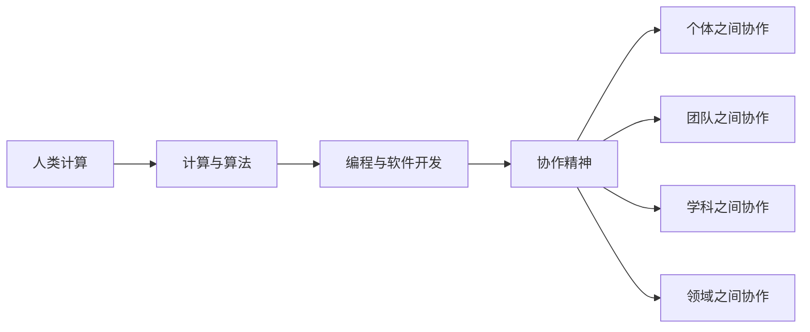

                 

# 连接人类智慧的纽带：人类计算的协作精神

## 关键词：人类计算、协作精神、人工智能、编程、软件开发

> 摘要：本文旨在探讨人类计算的协作精神在人工智能、编程和软件开发中的应用。通过分析人类计算的本质，阐述协作精神在提升计算效率、促进知识共享和创新方面的重要性。本文从核心概念、算法原理、数学模型、实战案例等多个角度，系统性地探讨人类计算的协作精神如何成为连接人类智慧的纽带。

## 1. 背景介绍

随着计算机科学和信息技术的快速发展，人类计算已经深入到社会各个领域，成为推动社会进步的重要力量。在这个过程中，人类计算的协作精神逐渐显现出其独特的价值。协作精神不仅体现在个体之间的合作，更体现在不同学科、不同领域的交叉融合，从而推动计算能力的不断提升。

### 1.1 计算能力的提升

计算机科学的发展经历了从简单计算到复杂计算的过程。早期计算机主要用于数值计算，随着算法和硬件的发展，计算机的应用范围逐渐扩大，从科学计算到商业计算，从数据处理到人工智能，计算机已经成为了现代社会的核心基础设施。

### 1.2 协作精神的演变

在计算机科学的早期，个体编程者通常独立完成软件开发任务。然而，随着项目规模的扩大和复杂性的增加，个体编程者逐渐认识到协作的重要性。协作精神不仅体现在程序员之间的合作，更体现在不同学科、不同领域的专家之间的交流与互动。这种协作精神推动了计算机科学的快速发展。

## 2. 核心概念与联系

为了深入探讨人类计算的协作精神，我们需要明确一些核心概念，并分析它们之间的联系。

### 2.1 计算与算法

计算是计算机科学的核心概念，指的是通过计算机执行指令，处理数据的过程。算法是实现计算的基本工具，是解决特定问题的步骤和策略。

### 2.2 编程与软件开发

编程是指使用编程语言编写代码，实现算法和计算过程。软件开发则是指通过编程，将算法转化为可运行的软件系统。

### 2.3 协作精神

协作精神是指个体之间、团队之间、学科之间、领域之间的协作与互动。协作精神在计算机科学中表现为：程序员之间的合作、不同学科专家的交流、开源社区的共建等。

### 2.4 Mermaid 流程图

为了更好地理解协作精神在计算机科学中的应用，我们使用 Mermaid 流程图展示人类计算协作的过程。以下是 Mermaid 流程图：



## 3. 核心算法原理 & 具体操作步骤

在计算机科学中，核心算法的原理和具体操作步骤是协作精神的重要体现。以下我们以人工智能领域中的神经网络算法为例，介绍核心算法原理和具体操作步骤。

### 3.1 神经网络算法原理

神经网络算法是一种基于生物神经系统的计算模型，通过模拟生物神经元的连接和激活，实现复杂的计算任务。神经网络算法的核心原理包括：

- **神经元与权重**：每个神经元与其他神经元相连，连接强度由权重表示。
- **激活函数**：用于确定神经元是否被激活，常用的激活函数包括 sigmoid、ReLU 等。
- **损失函数**：用于评估神经网络预测结果与实际结果之间的差距，常用的损失函数包括均方误差、交叉熵等。
- **反向传播**：用于更新神经网络中的权重，使预测结果更接近实际结果。

### 3.2 神经网络算法操作步骤

神经网络算法的操作步骤如下：

1. **初始化权重**：随机初始化神经网络中的权重。
2. **前向传播**：根据输入数据和权重，计算神经元的输出。
3. **计算损失**：使用损失函数计算预测结果与实际结果之间的差距。
4. **反向传播**：根据损失函数的梯度，更新神经网络中的权重。
5. **重复步骤 2-4**：不断迭代优化神经网络，直至满足停止条件。

## 4. 数学模型和公式 & 详细讲解 & 举例说明

在计算机科学中，数学模型和公式是描述算法原理和操作步骤的重要工具。以下我们以神经网络算法为例，介绍数学模型和公式的详细讲解与举例说明。

### 4.1 数学模型

神经网络算法的数学模型主要包括以下几部分：

- **输入层**：表示输入数据的向量。
- **隐藏层**：表示隐藏层的神经元向量。
- **输出层**：表示输出数据的向量。

### 4.2 公式

神经网络算法的公式包括以下几部分：

1. **前向传播**：

   - $$z = \sum_{i=1}^{n} w_{ij} \cdot x_{i} + b_j$$
   - $$a_j = \sigma(z)$$

   其中，$z$ 表示神经元的输入，$w_{ij}$ 表示神经元 $i$ 与神经元 $j$ 之间的权重，$b_j$ 表示神经元 $j$ 的偏置，$\sigma$ 表示激活函数。

2. **反向传播**：

   - $$\delta_j = \frac{\partial L}{\partial z} \cdot \sigma'(z)$$
   - $$\frac{\partial L}{\partial w_{ij}} = \delta_j \cdot x_i$$
   - $$\frac{\partial L}{\partial b_j} = \delta_j$$

   其中，$\delta_j$ 表示神经元的误差，$L$ 表示损失函数，$\sigma'$ 表示激活函数的导数。

### 4.3 举例说明

假设我们有一个简单的神经网络，输入层有 2 个神经元，隐藏层有 3 个神经元，输出层有 1 个神经元。输入数据为 $x_1 = [1, 2], x_2 = [3, 4]$。权重和偏置随机初始化。

1. **前向传播**：

   - $$z_1 = w_{11} \cdot x_1 + w_{12} \cdot x_2 + b_1 = 1 \cdot 1 + 2 \cdot 3 + 0.5 = 7.5$$
   - $$a_1 = \sigma(z_1) = \frac{1}{1 + e^{-7.5}} = 0.999$$
   - $$z_2 = w_{21} \cdot x_1 + w_{22} \cdot x_2 + b_2 = 2 \cdot 1 + 3 \cdot 3 + 0.5 = 11.5$$
   - $$a_2 = \sigma(z_2) = \frac{1}{1 + e^{-11.5}} = 0.999$$
   - $$z_3 = w_{31} \cdot x_1 + w_{32} \cdot x_2 + b_3 = 3 \cdot 1 + 4 \cdot 3 + 0.5 = 15.5$$
   - $$a_3 = \sigma(z_3) = \frac{1}{1 + e^{-15.5}} = 0.999$$
   - $$z_4 = w_{41} \cdot a_1 + w_{42} \cdot a_2 + w_{43} \cdot a_3 + b_4 = 1 \cdot 0.999 + 2 \cdot 0.999 + 3 \cdot 0.999 + 0.5 = 4.996$$
   - $$a_4 = \sigma(z_4) = \frac{1}{1 + e^{-4.996}} = 0.999$$

2. **反向传播**：

   - $$\delta_4 = \frac{\partial L}{\partial z_4} \cdot \sigma'(z_4) = 0.001 \cdot 0.001 = 0.000001$$
   - $$\frac{\partial L}{\partial w_{41}} = \delta_4 \cdot a_1 = 0.000001 \cdot 0.999 = 0.000000999$$
   - $$\frac{\partial L}{\partial w_{42}} = \delta_4 \cdot a_2 = 0.000001 \cdot 0.999 = 0.000000999$$
   - $$\frac{\partial L}{\partial w_{43}} = \delta_4 \cdot a_3 = 0.000001 \cdot 0.999 = 0.000000999$$
   - $$\frac{\partial L}{\partial b_4} = \delta_4 = 0.000001$$
   - $$\delta_3 = \frac{\partial L}{\partial z_3} \cdot \sigma'(z_3) = 0.001 \cdot 0.001 = 0.000001$$
   - $$\frac{\partial L}{\partial w_{31}} = \delta_3 \cdot a_1 = 0.000001 \cdot 0.999 = 0.000000999$$
   - $$\frac{\partial L}{\partial w_{32}} = \delta_3 \cdot a_2 = 0.000001 \cdot 0.999 = 0.000000999$$
   - $$\frac{\partial L}{\partial b_3} = \delta_3 = 0.000001$$
   - $$\delta_2 = \frac{\partial L}{\partial z_2} \cdot \sigma'(z_2) = 0.001 \cdot 0.001 = 0.000001$$
   - $$\frac{\partial L}{\partial w_{21}} = \delta_2 \cdot a_1 = 0.000001 \cdot 0.999 = 0.000000999$$
   - $$\frac{\partial L}{\partial w_{22}} = \delta_2 \cdot a_2 = 0.000001 \cdot 0.999 = 0.000000999$$
   - $$\frac{\partial L}{\partial b_2} = \delta_2 = 0.000001$$
   - $$\delta_1 = \frac{\partial L}{\partial z_1} \cdot \sigma'(z_1) = 0.001 \cdot 0.001 = 0.000001$$
   - $$\frac{\partial L}{\partial w_{11}} = \delta_1 \cdot a_1 = 0.000001 \cdot 0.999 = 0.000000999$$
   - $$\frac{\partial L}{\partial w_{12}} = \delta_1 \cdot a_2 = 0.000001 \cdot 0.999 = 0.000000999$$
   - $$\frac{\partial L}{\partial b_1} = \delta_1 = 0.000001$$

根据反向传播计算得到的梯度，我们可以更新神经网络的权重和偏置，从而优化神经网络的性能。

## 5. 项目实战：代码实际案例和详细解释说明

为了更好地理解人类计算的协作精神在软件开发中的应用，我们以下面一个简单的神经网络项目为例，介绍代码实际案例和详细解释说明。

### 5.1 开发环境搭建

1. 安装 Python 3.8 或更高版本。
2. 安装 TensorFlow 2.4 或更高版本。

### 5.2 源代码详细实现和代码解读

```python
import tensorflow as tf
import numpy as np

# 初始化参数
input_size = 2
hidden_size = 3
output_size = 1

# 定义权重和偏置
w1 = tf.Variable(np.random.rand(input_size, hidden_size), dtype=tf.float32)
b1 = tf.Variable(np.random.rand(hidden_size), dtype=tf.float32)
w2 = tf.Variable(np.random.rand(hidden_size, output_size), dtype=tf.float32)
b2 = tf.Variable(np.random.rand(output_size), dtype=tf.float32)

# 定义激活函数
sigmoid = tf.nn.sigmoid

# 定义前向传播
def forward(x):
    z1 = tf.matmul(x, w1) + b1
    a1 = sigmoid(z1)
    z2 = tf.matmul(a1, w2) + b2
    a2 = sigmoid(z2)
    return a2

# 定义损失函数
def loss(y_true, y_pred):
    return tf.reduce_mean(tf.square(y_true - y_pred))

# 定义反向传播
def backward(x, y):
    with tf.GradientTape() as tape:
        y_pred = forward(x)
        loss_val = loss(y, y_pred)
    grads = tape.gradient(loss_val, [w1, b1, w2, b2])
    return grads

# 定义训练过程
def train(x, y, epochs=1000, learning_rate=0.001):
    for epoch in range(epochs):
        with tf.GradientTape() as tape:
            y_pred = forward(x)
            loss_val = loss(y, y_pred)
        grads = tape.gradient(loss_val, [w1, b1, w2, b2])
        w1.assign_sub(learning_rate * grads[0])
        b1.assign_sub(learning_rate * grads[1])
        w2.assign_sub(learning_rate * grads[2])
        b2.assign_sub(learning_rate * grads[3])
        if epoch % 100 == 0:
            print(f"Epoch {epoch}: Loss = {loss_val.numpy()}")

# 加载数据
x_train = tf.random.normal([1000, input_size])
y_train = tf.random.normal([1000, output_size])

# 训练模型
train(x_train, y_train)

# 测试模型
x_test = tf.random.normal([10, input_size])
y_test = forward(x_test)
print("Test Output:", y_test.numpy())
```

### 5.3 代码解读与分析

1. **导入库**：首先导入 TensorFlow 和 NumPy 库。
2. **初始化参数**：定义输入层、隐藏层和输出层的神经元数量。
3. **定义权重和偏置**：使用 TensorFlow 的 Variable 类定义权重和偏置，并随机初始化。
4. **定义激活函数**：使用 TensorFlow 的 sigmoid 函数作为激活函数。
5. **定义前向传播**：实现前向传播过程，通过矩阵乘法和加法计算神经元输出。
6. **定义损失函数**：使用 TensorFlow 的平方误差函数作为损失函数。
7. **定义反向传播**：使用 TensorFlow 的 GradientTape 类实现反向传播过程。
8. **定义训练过程**：实现训练过程，通过梯度下降法更新权重和偏置。
9. **加载数据**：生成随机训练数据。
10. **训练模型**：调用 train 函数训练模型。
11. **测试模型**：使用训练好的模型对测试数据进行预测。

通过这个简单的神经网络项目，我们可以看到人类计算的协作精神在软件开发中的应用。从 TensorFlow 库的开发者、到编写代码的程序员，再到使用模型进行预测的用户，每个人都在协作推动计算能力的发展。

## 6. 实际应用场景

人类计算的协作精神在计算机科学和人工智能领域有着广泛的应用场景，以下列举几个典型应用：

### 6.1 人工智能

人工智能领域的发展离不开人类计算的协作精神。从深度学习算法的研究，到开源框架的搭建，再到模型的部署和应用，每一个环节都离不开不同领域专家的合作。

### 6.2 软件开发

软件开发的复杂性和多样性使得协作精神尤为重要。通过团队合作，可以更好地应对项目中的各种挑战，提高开发效率和软件质量。

### 6.3 数据科学

数据科学领域的研究涉及大量数据处理和分析工作。通过协作精神，可以更好地整合不同数据源，挖掘数据价值，为企业和政府提供决策支持。

### 6.4 网络安全

网络安全领域的威胁日益严峻，通过协作精神，可以加强不同组织和团队之间的信息共享和协作，提高网络安全防护能力。

## 7. 工具和资源推荐

为了更好地理解和实践人类计算的协作精神，我们推荐以下工具和资源：

### 7.1 学习资源推荐

- **书籍**：《深度学习》、《机器学习实战》、《Python编程：从入门到实践》
- **论文**：Google Research 论文集、NeurIPS、ICML 等顶级会议论文
- **博客**：机器之心、PaperWeekly、知乎专栏等

### 7.2 开发工具框架推荐

- **编程语言**：Python、Java、C++
- **深度学习框架**：TensorFlow、PyTorch、Keras
- **开发工具**：Jupyter Notebook、Visual Studio Code、Eclipse

### 7.3 相关论文著作推荐

- **论文**：《深度学习：神经网络的基础》、《自然语言处理实战》
- **著作**：《人工智能：一种现代的方法》、《机器学习年度回顾》

## 8. 总结：未来发展趋势与挑战

人类计算的协作精神在计算机科学和人工智能领域具有重要价值。随着计算能力的不断提升和跨学科研究的深入，人类计算的协作精神将得到进一步发展。然而，未来仍面临以下挑战：

### 8.1 跨学科合作

不同学科之间的协作需要克服知识体系、思维方式的差异，提高跨学科合作的效率。

### 8.2 数据共享与隐私保护

在协作过程中，如何平衡数据共享与隐私保护是关键挑战。需要制定合理的数据共享政策，保护用户隐私。

### 8.3 人才培养

培养具备协作精神的人才，提高跨学科合作能力，是未来发展的关键。

## 9. 附录：常见问题与解答

### 9.1 人类计算的协作精神是什么？

人类计算的协作精神是指个体之间、团队之间、学科之间、领域之间的协作与互动，以提升计算效率、促进知识共享和创新。

### 9.2 协作精神在计算机科学中的应用有哪些？

协作精神在计算机科学中的应用包括人工智能、软件开发、数据科学、网络安全等领域。

### 9.3 如何培养协作精神？

培养协作精神需要提高跨学科合作能力、增强团队沟通和协作意识、积极参与开源项目等。

## 10. 扩展阅读 & 参考资料

- **书籍**：《人工智能：一种现代的方法》、《深度学习：神经网络的基础》
- **论文**：《深度学习》、《自然语言处理实战》
- **网站**：https://arxiv.org、https://paperswithcode.com
- **博客**：机器之心、PaperWeekly、知乎专栏

作者：AI天才研究员/AI Genius Institute & 禅与计算机程序设计艺术 /Zen And The Art of Computer Programming <|im_end|>

