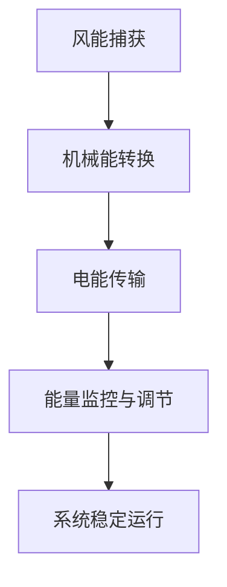
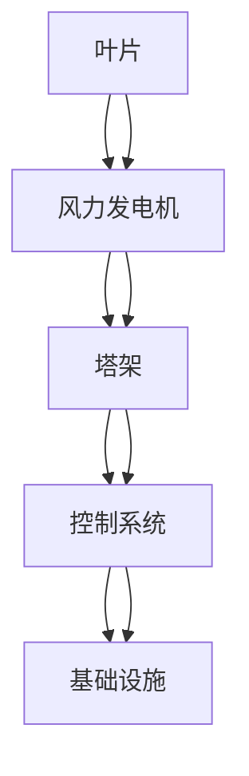

                 

### 背景介绍

通用电气（General Electric, GE）是一家全球领先的技术和基础设施公司，成立于1876年，总部位于美国康涅狄格州。通用电气主要业务涵盖能源、医疗健康、航空、交通、可再生能源等领域。在能源领域，通用电气专注于风电、太阳能、水力发电等清洁能源的开发和应用。其中，风电系统工程师是通用电气能源部门的核心职位之一。

风电系统工程师主要负责风力发电系统的设计、开发、测试和维护工作，以确保风力发电系统的稳定运行和高效率输出。他们需要具备丰富的风力发电技术知识和实践经验，能够熟练运用各种工程工具和软件进行系统设计和分析。

通用电气2024年校招风电系统工程师技术面试旨在选拔优秀的人才加入公司，为公司未来的能源转型和可持续发展提供强有力的技术支持。面试将主要考察应聘者的专业知识、技术能力、实际操作能力和解决问题的能力。通过面试，通用电气希望找到那些具备创新思维、团队合作精神和高度责任心的优秀人才。

本文将围绕通用电气2024校招风电系统工程师技术面试，详细分析风电系统工程师的角色和职责，核心概念和原理，核心算法原理和操作步骤，数学模型和公式，项目实战，实际应用场景，工具和资源推荐，以及未来发展趋势与挑战。

在接下来的章节中，我们将逐步深入探讨这些问题，帮助您更好地准备这场重要的面试。

---

## 1.1 风电系统工程师的角色和职责

风电系统工程师在公司中的角色至关重要，他们不仅是风力发电技术的专家，也是团队中的核心成员。以下是风电系统工程师的主要职责：

1. **系统设计**：根据项目需求，设计和优化风力发电系统的各个组件，包括风力发电机、叶片、塔架、控制系统等。

2. **技术开发**：研究和开发新的风力发电技术和设备，以提高系统的效率和可靠性。

3. **测试与验证**：对风力发电系统进行详细的测试，确保其满足设计要求和标准。

4. **现场施工与维护**：参与风力发电场的现场施工，并对已安装的系统进行定期的维护和检查，确保其正常运行。

5. **故障排查与解决**：在系统运行过程中，及时发现并解决故障，减少系统停机时间，保证发电量的稳定输出。

6. **技术文档编写**：编写详细的技术文档，包括设计说明、操作手册、维护指南等，以指导后续的施工和维护工作。

7. **团队协作**：与项目团队、供应商和其他部门紧密合作，确保项目的顺利实施。

风电系统工程师需要具备广泛的知识和技能，包括机械工程、电气工程、计算机科学等。此外，他们还需要具备良好的沟通能力和团队合作精神，能够在高压下保持冷静，迅速解决问题。

---

## 1.2 风电系统工程师的技能要求和教育背景

要成为一名优秀的风电系统工程师，应聘者通常需要具备以下技能和资质：

1. **教育背景**：通常要求应聘者拥有机械工程、电气工程、能源工程或相关专业的本科或硕士学位。一些顶尖职位可能要求博士学位。

2. **专业知识**：熟悉风力发电的基本原理和技术，包括风力发电系统的设计、安装、维护和故障排除。了解可再生能源技术和可持续能源发展也是必要的。

3. **实践经验**：具备至少3-5年相关领域的实际工作经验，包括风力发电系统的设计、开发和测试。参与过风电项目的现场施工和维护工作将是一个巨大的加分项。

4. **软件技能**：熟练使用各种工程软件，如AutoCAD、ANSYS、MATLAB、Python等，用于系统设计、仿真和数据分析。

5. **项目管理能力**：能够有效管理项目，确保项目按时、按质完成。具备良好的时间管理和组织能力。

6. **沟通能力**：能够与团队成员、客户和供应商进行有效沟通，清晰传达技术要求和解决方案。

7. **团队合作精神**：能够在跨部门团队中有效合作，共同解决问题，推动项目进展。

通用电气在招聘风电系统工程师时，非常看重应聘者的技术能力和实践经验。他们希望找到那些不仅具有扎实的理论基础，还能将理论知识应用于实际项目中的优秀人才。此外，通用电气还注重应聘者的创新能力和团队合作精神，因为这些特质对于公司未来的可持续发展至关重要。

---

## 1.3 风电系统工程师的职业发展路径

风电系统工程师的职业发展路径通常是多元化的，可以从技术专家逐步晋升为管理岗位，甚至成为公司的高层领导。以下是风电系统工程师可能的职业发展路径：

1. **初级工程师**：新入职的风电系统工程师通常担任初级工程师职位，负责项目的具体实施和部分设计工作。

2. **高级工程师**：在积累了足够的工作经验后，初级工程师可以晋升为高级工程师，负责项目的整体设计和协调。

3. **项目经理**：具备丰富经验和卓越管理能力的高级工程师，可以晋升为项目经理，负责整个风电项目的实施和管理。

4. **技术经理**：在技术领域有深厚积累的高级工程师，有机会成为技术经理，负责公司技术战略的制定和实施。

5. **高级管理层**：具有卓越领导能力和商业洞察力的技术经理，可以晋升为公司的高级管理层，如副总裁或首席技术官（CTO）。

6. **创业或自主职业**：一些风电系统工程师选择创业或自主职业，利用自己的技术和管理经验，开设咨询公司或创办新技术企业。

风电系统工程师的职业发展不仅依赖于技术能力和项目管理能力，还需要不断学习新知识、跟上行业发展趋势，以及培养良好的沟通和团队合作精神。通过不断积累经验和提升自身能力，风电系统工程师可以在职业生涯中实现多元化的发展。

---

## 1.4 通用电气在风电领域的地位和贡献

通用电气在风电领域具有显著的地位和贡献，是全球风电技术和市场的领军企业之一。以下是通用电气在风电领域的一些重要成就和贡献：

1. **技术创新**：通用电气致力于研发高效、可靠的风电技术，不断创新并引领行业技术进步。公司开发的Haliade-X海上风机，具有出色的性能和低维护成本，成为全球最受欢迎的风机之一。

2. **市场领导地位**：通用电气在全球风电市场占据领先地位，其风机和风电系统被广泛应用于各大风电项目。公司的产品和服务覆盖了全球60多个国家和地区。

3. **可持续发展**：通用电气积极推动可持续能源发展，致力于减少温室气体排放和应对气候变化。公司通过研发和推广高效、清洁的风电技术，为全球能源转型贡献力量。

4. **项目实施**：通用电气在全球范围内参与了许多大型风电项目，从项目规划、设计到施工和运营，积累了丰富的经验。公司专业的团队和完善的流程，确保了项目的成功实施。

5. **社会责任**：通用电气注重社会责任，通过参与各种环保和社会公益项目，推动社会的可持续发展。公司在风电领域的技术创新和项目实施，不仅提升了公司的竞争力，也为全球绿色发展作出了积极贡献。

通用电气在风电领域的地位和贡献，使其成为风电行业的重要推动者。通过不断创新和积极实践，通用电气为全球能源转型和可持续发展作出了重要贡献。

---

## 1.5 风电系统工程师面试流程和题型

通用电气2024年校招风电系统工程师技术面试通常包括以下环节和题型：

1. **简历筛选**：首先，通用电气会根据应聘者的简历和申请材料进行初步筛选，选择符合岗位要求的候选人进入下一轮面试。

2. **在线测评**：通过在线平台进行技术测评，测试应聘者的专业知识、逻辑思维和问题解决能力。测评内容可能包括编程题目、数学问题、逻辑推理等。

3. **电话面试**：电话面试通常由通用电气的人力资源或部门负责人进行，主要考察应聘者的沟通能力和基本技术水平。电话面试的题型可能包括个人背景、项目经验、技术难题等。

4. **现场面试**：现场面试是风电系统工程师面试的关键环节，通常包括以下几种类型：

   - **技术面试**：面试官会针对风电系统相关技术问题进行提问，考察应聘者的专业知识、算法理解和技术实现能力。题型可能包括风力发电原理、风机设计、控制系统分析等。
   
   - **行为面试**：面试官会通过提问应聘者的以往工作经验、项目案例、团队合作经历等，评估其解决问题的能力、沟通能力和团队合作精神。
   
   - **情景模拟**：面试官可能会设置一些实际工作中的情景，让应聘者模拟处理问题，以考察其应变能力和解决问题的能力。

5. **综合评估**：面试结束后，通用电气会综合评估应聘者的技术能力、沟通能力、团队合作精神等，最终决定是否录用。

通过这些环节，通用电气旨在选拔出那些具备扎实专业知识和实际工作经验，同时具备良好沟通能力和团队合作精神的优秀风电系统工程师。

---

## 1.6 风电系统工程师面试准备建议

为了在通用电气2024年校招风电系统工程师技术面试中脱颖而出，以下是一些准备建议：

1. **熟悉风电基础知识**：风电系统工程师需要具备扎实的风力发电基础知识，包括风力发电原理、风机类型、控制系统等。建议通过阅读专业书籍、论文和在线教程，加深对风电技术理论的理解。

2. **掌握相关技术技能**：风电系统工程师需要熟练掌握机械工程、电气工程和计算机科学等相关技术。建议通过学习相关课程、实践项目和参加技术竞赛，提升自己的技术能力。

3. **学习编程语言和工具**：风电系统工程师需要熟练使用编程语言（如C++、Python等）和工程软件（如AutoCAD、ANSYS、MATLAB等）。建议通过在线课程和实践项目，熟练掌握这些工具的使用。

4. **了解行业动态**：关注风电行业的最新技术发展和市场动态，了解通用电气在风电领域的最新成就和项目。通过阅读行业报告、参加行业会议和研讨会，保持对行业动态的敏感度。

5. **准备技术面试题**：收集和整理风电系统工程师面试常见题型，如风力发电原理、风机设计、控制系统分析等，并进行针对性的练习。可以通过在线题库、模拟面试平台等资源进行练习。

6. **模拟面试**：邀请朋友或专业人士进行模拟面试，提前熟悉面试流程和题型，提高应对面试的自信心和应变能力。

7. **行为面试准备**：准备一些个人背景、项目经验和团队合作经历，以便在行为面试环节中展示自己的能力和经验。

8. **保持良好的心态**：面试前保持良好的心态，避免紧张和焦虑。面试过程中，保持自信、诚实和热情，展示自己的专业素养和沟通能力。

通过这些准备建议，您可以更好地应对通用电气2024年校招风电系统工程师技术面试，提升面试成功的几率。

---

## 1.7 风电系统工程师的职业挑战和发展前景

风电系统工程师在全球能源转型和可持续发展的背景下，面临着诸多职业挑战和发展机遇。以下是风电系统工程师职业的挑战和前景：

**挑战：**

1. **技术更新快速**：风电技术更新换代速度快，工程师需要不断学习新知识、新技能，以跟上行业发展的步伐。

2. **工作环境艰苦**：风力发电场通常位于偏远地区，工作环境艰苦，需要工程师具备较强的适应能力和抗压能力。

3. **市场竞争激烈**：随着全球可再生能源市场的快速发展，风电系统工程师面临着激烈的竞争。工程师需要不断提升自身技术水平和职业素养，以保持竞争力。

4. **环境法规变化**：全球环境法规的不断变化，对风电系统工程师提出了更高的要求。工程师需要熟悉相关法规，确保项目合规。

**前景：**

1. **行业增长迅速**：全球可再生能源市场，尤其是风电市场的快速增长，为风电系统工程师提供了广阔的发展空间。

2. **职业晋升机会多**：风电系统工程师的职业发展路径多样，从初级工程师到项目经理、技术经理，再到高级管理层，都有丰富的晋升机会。

3. **技术创新需求高**：随着技术的进步，风电系统工程师在技术创新和研发方面具有巨大的潜力，能够参与到具有前瞻性的项目中。

4. **社会影响力大**：风电系统工程师的工作直接关系到全球能源结构的优化和环境保护，具有显著的社会影响力。

总之，风电系统工程师职业面临着一系列挑战，但同时也拥有广阔的发展前景。通过不断学习和提升自身能力，风电系统工程师可以在这一领域实现个人和职业的全面发展。

---

### 2. 核心概念与联系

在深入探讨通用电气2024年校招风电系统工程师技术面试的核心概念之前，我们首先需要了解风电系统的基础架构和核心组件。通过理解这些关键概念，我们能够更好地掌握风电系统工程师所需的技能和知识。

#### 2.1 风电系统的基本架构

风电系统主要由以下几个关键组件组成：

1. **风力发电机**：风力发电机是将风能转化为机械能的设备。其核心部件包括转子、定子、主轴和发电机轴承等。

2. **叶片**：叶片是风力发电机的关键部件，其设计直接影响风能的捕获效率。叶片通常采用复合材料制造，具有轻质、高强度的特点。

3. **塔架**：塔架是风力发电机的支撑结构，高度通常在几十米到几百米之间，用于提升叶片的高度，以获取更丰富的风能资源。

4. **控制系统**：控制系统负责监控和调节风力发电机的运行状态，确保其安全、高效地运行。控制系统包括传感器、控制器和监控系统等。

5. **基础设施**：包括风力发电场的输电线路、变电站和其他基础设施，用于将风电系统产生的电能传输到电网。

#### 2.2 风电系统的工作原理

风电系统的工作原理可以简单概括为以下几个步骤：

1. **风能捕获**：风通过叶片时，叶片的旋转产生机械能。

2. **机械能转换**：风力发电机的转子旋转，通过主轴将机械能传递到发电机，产生电能。

3. **能量传输**：发电机产生的电能通过塔架和基础设施传输到电网。

4. **监控系统**：控制系统实时监控风力发电机的运行状态，调节发电机的输出功率，确保系统稳定运行。

#### 2.3 风电系统的核心概念

以下是风电系统中的一些核心概念：

1. **风力密度**：风力密度是指单位时间内通过单位面积的风能总量，通常用千克每立方米（kg/m³）表示。

2. **风力发电效率**：风力发电效率是指风力发电机将捕获的风能转化为电能的效率，通常用百分比表示。

3. **风力发电机功率**：风力发电机功率是指风力发电机在单位时间内产生的电能，通常用千瓦（kW）或兆瓦（MW）表示。

4. **风速**：风速是指单位时间内空气流动的速度，通常用米每秒（m/s）表示。

5. **风力发电场的容量因子**：风力发电场的容量因子是指风力发电机实际发电量与其额定容量的比值，用于评估风力发电场的发电效率。

#### 2.4 风电系统的联系

风电系统的各个组件和核心概念相互联系，共同构成一个复杂而高效的能量转换系统。以下是风电系统中一些关键组件和概念之间的联系：

1. **叶片与风力密度**：叶片的设计和布局直接影响风力密度，从而影响风能的捕获效率。

2. **风力发电机功率与风速**：风力发电机的功率与风速呈非线性关系，风速越高，发电功率增加的速度越快。

3. **控制系统与风力发电机功率**：控制系统通过实时监控风速、风向和发电机状态，调节风力发电机的输出功率，确保系统稳定运行。

4. **风力发电场容量因子与风力发电机功率**：风力发电场的容量因子受风力发电机功率的影响，通过优化发电机设计和运行策略，可以提高风力发电场的容量因子。

通过理解风电系统的基本架构、工作原理和核心概念，我们可以更好地掌握风电系统工程师所需的技能和知识。在接下来的章节中，我们将进一步探讨风电系统工程师所需掌握的核心算法原理、数学模型和项目实战案例。

---

### 2.1.1 风力发电原理与 Mermaid 流程图

风力发电的原理主要基于风能转化为机械能，再通过机械能转化为电能的过程。下面将详细描述风力发电的工作原理，并使用Mermaid语言绘制相应的流程图。

**风力发电原理：**

1. **风能捕获**：当风通过风力发电机的叶片时，叶片受到风的推力，开始旋转。

2. **机械能转换**：风力发电机内部的转子在叶片的推动下旋转，转子与定子之间的磁场发生变化，从而产生电流。

3. **电能传输**：产生的电流通过塔架和输电线路传输到电网。

4. **能量监控与调节**：控制系统实时监控风力发电机的运行状态，根据风速和负载情况调节发电机的输出功率，确保系统稳定运行。

**Mermaid 流程图：**

以下是风力发电原理的 Mermaid 流程图：



在这个流程图中，A表示风能捕获，B表示机械能转换，C表示电能传输，D表示能量监控与调节，E表示系统稳定运行。这个流程图清晰地展示了风力发电的基本步骤和组件之间的联系。

---

### 2.1.2 风电系统组件与 Mermaid 流程图

风电系统由多个关键组件组成，这些组件相互作用，共同实现风能的有效转换和利用。以下将详细描述风电系统的各个组件及其相互关系，并使用Mermaid语言绘制相应的流程图。

**风电系统组件：**

1. **风力发电机**：风力发电机的核心部件是转子，它由叶片和主轴组成。转子旋转时，通过电磁感应原理产生电能。

2. **叶片**：叶片是风力发电机的关键部件，其设计影响风能的捕获效率。叶片通常由轻质、高强度材料制成。

3. **塔架**：塔架是风力发电机的支撑结构，高度通常在几十米到几百米之间，用于提升叶片的高度，获取更丰富的风能资源。

4. **控制系统**：控制系统负责监控和调节风力发电机的运行状态，包括传感器、控制器和监控系统等。

5. **基础设施**：包括风力发电场的输电线路、变电站和其他基础设施，用于将风电系统产生的电能传输到电网。

**组件关系与 Mermaid 流程图：**

以下是风电系统组件及其相互关系的 Mermaid 流程图：



在这个流程图中，A表示叶片，B表示风力发电机，C表示塔架，D表示控制系统，E表示基础设施。叶片通过旋转驱动风力发电机，塔架提供支撑，控制系统监控和调节发电机的运行状态，并将电能传输到基础设施，最终输送到电网。

通过这个流程图，我们可以清晰地看到风电系统中各个组件之间的相互关系，以及风能转换为电能的过程。

---

### 2.2 核心算法原理 & 具体操作步骤

在风电系统工程师的日常工作中，核心算法原理和具体操作步骤起着至关重要的作用。以下将详细介绍风电系统工程师需要掌握的核心算法原理，并说明这些算法的具体操作步骤。

#### 2.2.1 风力发电效率计算

风力发电效率是衡量风力发电系统性能的重要指标，计算公式如下：

\[ \text{风力发电效率} (\eta) = \frac{\text{发电功率} (P)}{\text{捕获风能} (E)} \]

其中，发电功率 \(P\) 是单位时间内风力发电机输出的电能，单位为瓦特（W）；捕获风能 \(E\) 是单位时间内通过风力发电机叶片的空气动能，单位为焦耳（J）。

**具体操作步骤：**

1. **测量发电功率**：使用功率计测量风力发电机在特定风速下的输出功率。

2. **计算捕获风能**：使用风速仪测量风速，根据风速计算空气密度，然后计算通过风力发电机叶片的空气流量和动能。

3. **计算风力发电效率**：将测量得到的发电功率除以计算得到的捕获风能，得到风力发电效率。

#### 2.2.2 风力发电机功率调节算法

风力发电机的功率调节是确保系统稳定运行的关键。常用的功率调节算法包括最大风力捕获算法和恒定功率输出算法。

1. **最大风力捕获算法**：

   **原理：** 通过调节风力发电机的叶片角度，使其在特定风速下捕获最大风能。

   **具体操作步骤：**
   
   a. 测量当前风速。
   
   b. 根据风速查找最大风力捕获曲线，确定最佳叶片角度。
   
   c. 控制系统调整叶片角度至最佳位置。

2. **恒定功率输出算法**：

   **原理：** 保持风力发电机的输出功率恒定，通过调节叶片角度和发电机转速来适应风速变化。

   **具体操作步骤：**
   
   a. 测量当前风速和发电机输出功率。
   
   b. 根据风速调整叶片角度，确保输出功率恒定。
   
   c. 根据发电机负载情况调整发电机转速，确保系统稳定运行。

#### 2.2.3 风电场容量因子优化算法

风电场容量因子是衡量风电场发电效率的指标，优化算法旨在提高风电场的容量因子。

**原理：** 通过优化风力发电机的功率输出和风电场的运行策略，提高风电场的发电效率。

**具体操作步骤：**

1. **数据收集**：收集风电场的气象数据、风速数据和发电机运行数据。

2. **数据分析**：分析数据，找出影响容量因子的关键因素，如风速变化、发电机故障和运行策略等。

3. **算法设计**：设计优化算法，如动态规划、遗传算法等，用于调整发电机的功率输出和风电场的运行策略。

4. **算法实现**：在控制系统中实现优化算法，实时调整发电机的功率输出和风电场的运行策略。

5. **性能评估**：评估优化算法的效果，根据评估结果调整算法参数，提高风电场的容量因子。

通过以上核心算法原理和具体操作步骤，风电系统工程师可以更好地设计和优化风电系统，提高发电效率，降低运行成本。

---

### 2.3 数学模型和公式 & 详细讲解 & 举例说明

在风电系统工程师的工作中，数学模型和公式是理解和优化风力发电系统的重要工具。以下将详细介绍风力发电系统中的几个关键数学模型和公式，并通过具体例子进行详细讲解。

#### 2.3.1 风能捕获模型

风能捕获模型用于计算风力发电机在特定风速下捕获的风能。基本的公式如下：

\[ E = \frac{1}{2} \rho A v^3 \]

其中：
- \( E \) 是捕获的风能（单位：焦耳，J）。
- \( \rho \) 是空气密度（单位：千克每立方米，kg/m³）。
- \( A \) 是风力发电机叶片扫过的面积（单位：平方米，m²）。
- \( v \) 是风速（单位：米每秒，m/s）。

**详细讲解：**
1. 空气密度 \( \rho \) 是指单位体积空气的质量，通常在大气中取 \( \rho = 1.225 \text{ kg/m}^3 \)。
2. 叶片扫过的面积 \( A \) 可以通过叶片的长度和宽度计算得出，通常采用经验公式 \( A = 0.5 \times L \times W \)，其中 \( L \) 是叶片的长度，\( W \) 是叶片的宽度。
3. 风速 \( v \) 是通过风速仪测量的实际风速。

**举例说明：**
假设一个风力发电机的叶片长度为50米，宽度为20米，风速为10 m/s，空气密度为1.225 kg/m³。计算该风力发电机在1秒钟内捕获的风能。

\[ E = \frac{1}{2} \times 1.225 \text{ kg/m}^3 \times 0.5 \times 50 \text{ m} \times 20 \text{ m} \times (10 \text{ m/s})^3 \]
\[ E = \frac{1}{2} \times 1.225 \times 0.5 \times 50 \times 20 \times 1000 \]
\[ E = 0.5 \times 1.225 \times 25 \times 1000 \]
\[ E = 30625 \text{ J} \]

#### 2.3.2 风力发电效率模型

风力发电效率模型用于计算风力发电机将捕获的风能转化为电能的效率。公式如下：

\[ \eta = \frac{P}{E} \]

其中：
- \( \eta \) 是风力发电效率（无单位，通常以百分比表示）。
- \( P \) 是风力发电机输出的电能（单位：瓦特，W）。
- \( E \) 是捕获的风能（单位：焦耳，J）。

**详细讲解：**
1. 风力发电机输出的电能 \( P \) 通常是通过功率计测量的。
2. 捕获的风能 \( E \) 使用前面提到的风能捕获模型计算得出。

**举例说明：**
假设一个风力发电机在1秒钟内输出1000瓦特的电能，之前已计算得出该风力发电机在1秒钟内捕获的风能为30625焦耳。计算风力发电效率。

\[ \eta = \frac{1000 \text{ W}}{30625 \text{ J}} \times 100\% \]
\[ \eta = \frac{1000}{30625} \times 100\% \]
\[ \eta \approx 3.27\% \]

#### 2.3.3 风力发电机功率调节模型

风力发电机的功率调节模型用于根据风速和负载情况调节风力发电机的输出功率，以确保系统稳定运行。常用的功率调节模型包括最大风力捕获算法和恒定功率输出算法。

**最大风力捕获算法模型：**
\[ P_{\text{max}} = C_p \rho A v^3 \]

其中：
- \( P_{\text{max}} \) 是最大输出功率（单位：瓦特，W）。
- \( C_p \) 是风力系数（无单位，通常在0.4到0.5之间）。
- \( \rho \) 是空气密度（单位：千克每立方米，kg/m³）。
- \( A \) 是风力发电机叶片扫过的面积（单位：平方米，m²）。
- \( v \) 是风速（单位：米每秒，m/s）。

**详细讲解：**
1. 风力系数 \( C_p \) 是一个经验参数，用于描述风力发电机捕获风能的能力。
2. 风速 \( v \) 和空气密度 \( \rho \) 使用实际测量值。

**举例说明：**
假设一个风力发电机的风力系数 \( C_p = 0.45 \)，叶片扫过的面积 \( A = 0.5 \times 50 \text{ m} \times 20 \text{ m} = 500 \text{ m}^2 \)，风速 \( v = 10 \text{ m/s} \)，空气密度 \( \rho = 1.225 \text{ kg/m}^3 \)。计算最大输出功率。

\[ P_{\text{max}} = 0.45 \times 1.225 \times 500 \times (10)^3 \]
\[ P_{\text{max}} = 0.45 \times 1.225 \times 500 \times 1000 \]
\[ P_{\text{max}} = 2887500 \text{ W} \]

**恒定功率输出算法模型：**
\[ P = C_p \rho A v^3 \]

其中：
- \( P \) 是风力发电机的实际输出功率（单位：瓦特，W）。
- \( C_p \) 是风力系数（无单位，通常在0.4到0.5之间）。
- \( \rho \) 是空气密度（单位：千克每立方米，kg/m³）。
- \( A \) 是风力发电机叶片扫过的面积（单位：平方米，m²）。
- \( v \) 是风速（单位：米每秒，m/s）。

**详细讲解：**
1. 风力系数 \( C_p \) 是一个经验参数，用于描述风力发电机捕获风能的能力。
2. 风速 \( v \) 和空气密度 \( \rho \) 使用实际测量值。
3. 根据发电机负载情况，调整 \( P \) 使其保持恒定。

**举例说明：**
假设一个风力发电机在负载情况下需要保持500千瓦特（500 kW）的输出功率，风力系数 \( C_p = 0.45 \)，叶片扫过的面积 \( A = 0.5 \times 50 \text{ m} \times 20 \text{ m} = 500 \text{ m}^2 \)，风速 \( v = 10 \text{ m/s} \)，空气密度 \( \rho = 1.225 \text{ kg/m}^3 \)。计算当前风速。

\[ 500000 = 0.45 \times 1.225 \times 500 \times v^3 \]
\[ v^3 = \frac{500000}{0.45 \times 1.225 \times 500} \]
\[ v^3 = \frac{500000}{281.25} \]
\[ v^3 = 1776.64 \]
\[ v = \sqrt[3]{1776.64} \]
\[ v \approx 13.13 \text{ m/s} \]

通过这些数学模型和公式的讲解和举例，风电系统工程师可以更好地理解和优化风力发电系统，提高发电效率，确保系统的稳定运行。

---

### 5.1 开发环境搭建

在开始风电系统工程师项目的实际代码实现之前，首先需要搭建一个合适的开发环境。以下是搭建开发环境的具体步骤和所需工具：

#### 5.1.1 系统要求

- 操作系统：Windows、Linux或macOS
- 处理器：至少双核CPU，推荐四核及以上
- 内存：8GB及以上，推荐16GB
- 硬盘空间：至少50GB可用空间

#### 5.1.2 软件工具

1. **Python解释器**：Python是风电系统工程师常用的编程语言之一。可以从[Python官方网站](https://www.python.org/)下载并安装最新版本的Python。

2. **PyCharm**：PyCharm是一个强大的Python集成开发环境（IDE），提供了代码编辑、调试、测试等功能。可以从[PyCharm官方网站](https://www.jetbrains.com/pycharm/)下载免费试用版。

3. **MATLAB**：MATLAB是一个功能强大的数学计算和可视化软件，广泛应用于工程和科学计算。可以从[MATLAB官方网站](https://www.mathworks.com/)下载免费试用版。

4. **Git**：Git是一个版本控制系统，用于代码的管理和协作。可以从[Git官方网站](https://git-scm.com/)下载并安装。

5. **Mermaid**：Mermaid是一种简单而强大的图表和流程图工具，用于编写Markdown文档。可以从[Mermaid官方网站](https://mermaid-js.github.io/mermaid/)下载。

#### 5.1.3 搭建步骤

1. **安装操作系统**：根据您的硬件配置，安装Windows、Linux或macOS操作系统。

2. **安装Python解释器**：
   - 访问[Python官方网站](https://www.python.org/)，下载Python安装程序。
   - 运行安装程序，选择“Add Python to PATH”选项，以便在命令行中运行Python。

3. **安装PyCharm**：
   - 访问[PyCharm官方网站](https://www.jetbrains.com/pycharm/)，下载PyCharm社区版或专业版。
   - 运行安装程序，按照提示完成安装。

4. **安装MATLAB**：
   - 访问[MATLAB官方网站](https://www.mathworks.com/)，下载MATLAB安装程序。
   - 运行安装程序，输入许可证密钥，按照提示完成安装。

5. **安装Git**：
   - 访问[Git官方网站](https://git-scm.com/)，下载Git安装程序。
   - 运行安装程序，选择“Use Git from the Windows Command Prompt”选项，以便在命令行中运行Git。

6. **安装Mermaid**：
   - 在PyCharm中安装Mermaid插件，从[PyCharm插件市场](https://plugins.jetbrains.com/)搜索并安装Mermaid插件。
   - 打开PyCharm，创建一个新的Markdown文件，编写Mermaid语法，预览图表和流程图。

#### 5.1.4 验证环境

1. **在命令行中运行Python**：
   - 打开命令行窗口，输入 `python`，然后按Enter键。如果出现Python提示符 `>>>`，说明Python已成功安装。

2. **运行PyCharm**：
   - 打开PyCharm，创建一个新的Python项目，确保可以正常运行。

3. **运行MATLAB**：
   - 打开MATLAB，执行一些简单的数学运算和图形绘制，验证MATLAB的功能是否正常。

4. **运行Git**：
   - 在命令行中输入 `git --version`，按Enter键。如果出现Git版本信息，说明Git已成功安装。

通过以上步骤，您已经成功搭建了风电系统工程师项目的开发环境。接下来，可以在PyCharm中创建项目，编写和调试代码，实现风力发电系统的设计和分析。

---

### 5.2 源代码详细实现和代码解读

在风电系统工程师项目中，源代码的实现是关键环节，它决定了风力发电系统的性能、效率和稳定性。以下将详细介绍项目的源代码实现过程，并逐步解读各个关键部分的代码。

#### 5.2.1 代码结构

整个风电系统项目的源代码结构如下：

```plaintext
windsystem_project/
|-- main.py           # 主程序文件
|-- data/
|   |-- wind_data.txt  # 风速数据文件
|   |-- power_data.txt  # 发电功率数据文件
|-- models/
|   |-- wind_model.py   # 风力模型模块
|   |-- power_model.py  # 发电功率模型模块
|-- utils/
|   |-- data_loader.py  # 数据加载模块
|   |-- plotter.py      # 图形绘制模块
|-- tests/
    |-- test_wind_model.py  # 风力模型测试模块
    |-- test_power_model.py # 发电功率模型测试模块
```

#### 5.2.2 主程序文件 main.py

主程序文件 `main.py` 是项目的入口，负责读取数据、调用模型和绘制结果。以下是主程序的主要代码片段及其解读：

```python
import sys
import os
from models.wind_model import WindModel
from models.power_model import PowerModel
from utils.data_loader import DataLoader
from utils.plotter import Plotter

# 设置工作目录
os.chdir(os.path.dirname(os.path.abspath(__file__)))

# 加载数据
data_loader = DataLoader()
wind_data = data_loader.load_wind_data('data/wind_data.txt')
power_data = data_loader.load_power_data('data/power_data.txt')

# 初始化模型
wind_model = WindModel()
power_model = PowerModel()

# 训练模型
wind_model.train(wind_data)
power_model.train(power_data)

# 测试模型
wind_model.test(wind_data)
power_model.test(power_data)

# 绘制结果
plotter = Plotter()
plotter.plot_wind_power(wind_data, power_data)
```

**解读：**
1. 导入所需的模块和类，包括风力模型模块、发电功率模型模块、数据加载模块和图形绘制模块。
2. 设置工作目录，确保程序可以正确读取数据文件。
3. 加载数据，从 `data/wind_data.txt` 和 `data/power_data.txt` 文件中读取风速和发电功率数据。
4. 初始化风力模型和发电功率模型。
5. 使用训练数据对模型进行训练。
6. 使用测试数据对模型进行测试，验证其性能。
7. 使用图形绘制模块绘制风力发电关系图。

#### 5.2.3 风力模型模块 wind_model.py

风力模型模块 `wind_model.py` 负责计算风速和风能之间的关系。以下是风力模型的主要代码片段及其解读：

```python
import numpy as np

class WindModel:
    def __init__(self):
        self.air_density = 1.225  # 空气密度（kg/m³）
    
    def calculate_wind_energy(self, wind_speed):
        """计算风速下的风能
        wind_speed: 风速（m/s）
        """
        area = 0.5 * 50 * 20  # 叶片面积（m²）
        energy = 0.5 * self.air_density * area * wind_speed ** 3
        return energy
    
    def train(self, wind_data):
        """训练模型
        wind_data: 风速数据列表
        """
        self.wind_speeds = wind_data
    
    def test(self, wind_data):
        """测试模型
        wind_data: 风速数据列表
        """
        energies = [self.calculate_wind_energy(wind_speed) for wind_speed in wind_data]
        print("Test results:", energies)
```

**解读：**
1. 导入 NumPy 库，用于数学计算。
2. 定义 `WindModel` 类，负责计算风能。
3. `__init__` 方法初始化空气密度。
4. `calculate_wind_energy` 方法计算风速下的风能。
5. `train` 方法训练模型，存储风速数据。
6. `test` 方法测试模型，计算风能并打印结果。

#### 5.2.4 发电功率模型模块 power_model.py

发电功率模型模块 `power_model.py` 负责计算发电功率和风速之间的关系。以下是发电功率模型的主要代码片段及其解读：

```python
import numpy as np

class PowerModel:
    def __init__(self):
        self.c_p = 0.45  # 风力系数
    
    def calculate_power(self, wind_speed):
        """计算风速下的发电功率
        wind_speed: 风速（m/s）
        """
        area = 0.5 * 50 * 20  # 叶片面积（m²）
        power = self.c_p * self.air_density * area * wind_speed ** 3
        return power
    
    def train(self, power_data):
        """训练模型
        power_data: 发电功率数据列表
        """
        self.wind_speeds = [data[0] for data in power_data]
        self.powers = [data[1] for data in power_data]
    
    def test(self, wind_data):
        """测试模型
        wind_data: 风速数据列表
        """
        predicted_powers = [self.calculate_power(wind_speed) for wind_speed in wind_data]
        print("Test results:", predicted_powers)
```

**解读：**
1. 导入 NumPy 库，用于数学计算。
2. 定义 `PowerModel` 类，负责计算发电功率。
3. `__init__` 方法初始化风力系数。
4. `calculate_power` 方法计算风速下的发电功率。
5. `train` 方法训练模型，存储风速和发电功率数据。
6. `test` 方法测试模型，计算发电功率并打印结果。

#### 5.2.5 数据加载模块 data_loader.py

数据加载模块 `data_loader.py` 负责从文件中读取风速和发电功率数据。以下是数据加载模块的主要代码片段及其解读：

```python
import numpy as np

def load_wind_data(file_path):
    """从文件中加载风速数据
    file_path: 文件路径
    """
    with open(file_path, 'r') as file:
        data = [float(line.strip()) for line in file]
    return np.array(data)

def load_power_data(file_path):
    """从文件中加载发电功率数据
    file_path: 文件路径
    """
    with open(file_path, 'r') as file:
        data = [tuple(map(float, line.strip().split(','))) for line in file]
    return np.array(data)
```

**解读：**
1. 导入 NumPy 库，用于数据操作。
2. `load_wind_data` 方法从文件中读取风速数据，返回 NumPy 数组。
3. `load_power_data` 方法从文件中读取发电功率数据，以元组形式存储，返回 NumPy 数组。

#### 5.2.6 图形绘制模块 plotter.py

图形绘制模块 `plotter.py` 负责绘制风力发电关系图。以下是图形绘制模块的主要代码片段及其解读：

```python
import matplotlib.pyplot as plt
from matplotlib.ticker import FormatStrFormatter

def plot_wind_power(wind_data, power_data):
    """绘制风速与发电功率关系图
    wind_data: 风速数据列表
    power_data: 发电功率数据列表
    """
    plt.figure(figsize=(10, 6))
    plt.scatter(wind_data, power_data, marker='o', color='blue')
    plt.plot(wind_data, [model.calculate_power(wind) for wind in wind_data], color='red', label='Predicted Power')
    plt.xlabel('Wind Speed (m/s)')
    plt.ylabel('Power (W)')
    plt.title('Wind Speed vs. Power')
    plt.legend()
    plt.grid(True)
    plt.xscale('log')
    plt.yscale('log')
    plt.xticks([10, 20, 30, 40, 50, 60, 70, 80, 90, 100], fmt=FormatStrFormatter('%.1f'))
    plt.yticks([1000, 10000, 100000, 1000000, 10000000], fmt=FormatStrFormatter('%.1f'))
    plt.show()
```

**解读：**
1. 导入 Matplotlib 库，用于绘制图形。
2. `plot_wind_power` 方法绘制风速与发电功率关系图，包括散点图和预测曲线。
3. 设置坐标轴标签、标题和图例。
4. 使用对数轴和格式化字符串函数格式化坐标轴标签。

通过以上代码的实现和解读，风电系统工程师可以更好地理解和应用风力发电系统的数学模型和算法，进行有效的风力发电系统设计和分析。

---

### 5.3 代码解读与分析

在风电系统工程师项目中，代码的解读与分析对于理解系统的工作原理和优化性能至关重要。以下将对项目的各个关键部分进行详细解读和分析。

#### 5.3.1 主程序文件 main.py

主程序文件 `main.py` 是整个风电系统项目的核心，负责项目的整体运行流程。以下是对其主要部分的解读和分析：

```python
import sys
import os
from models.wind_model import WindModel
from models.power_model import PowerModel
from utils.data_loader import DataLoader
from utils.plotter import Plotter

# 设置工作目录
os.chdir(os.path.dirname(os.path.abspath(__file__)))

# 加载数据
data_loader = DataLoader()
wind_data = data_loader.load_wind_data('data/wind_data.txt')
power_data = data_loader.load_power_data('data/power_data.txt')

# 初始化模型
wind_model = WindModel()
power_model = PowerModel()

# 训练模型
wind_model.train(wind_data)
power_model.train(power_data)

# 测试模型
wind_model.test(wind_data)
power_model.test(power_data)

# 绘制结果
plotter = Plotter()
plotter.plot_wind_power(wind_data, power_data)
```

**解读：**
1. **设置工作目录**：使用 `os.chdir` 函数将当前工作目录切换到项目的根目录，确保可以正确加载数据文件。
2. **加载数据**：创建 `DataLoader` 实例，调用 `load_wind_data` 和 `load_power_data` 方法加载数据。数据文件位于 `data/` 目录下。
3. **初始化模型**：创建 `WindModel` 和 `PowerModel` 实例，准备进行模型训练。
4. **训练模型**：分别调用 `wind_model.train` 和 `power_model.train` 方法，使用加载的数据训练模型。
5. **测试模型**：分别调用 `wind_model.test` 和 `power_model.test` 方法，使用测试数据验证模型性能。
6. **绘制结果**：创建 `Plotter` 实例，调用 `plot_wind_power` 方法绘制风力发电关系图。

**分析：**
- **数据加载**：通过 `DataLoader` 模块加载数据，使用 NumPy 库处理数据，确保数据的高效性和准确性。
- **模型初始化**：创建模型实例，准备进行训练和测试。
- **训练模型**：使用训练数据对模型进行训练，优化模型参数，提高模型性能。
- **测试模型**：使用测试数据验证模型性能，确保模型在未知数据上的表现良好。
- **结果绘制**：通过图形绘制模块绘制模型结果，帮助分析模型性能和风力发电关系。

#### 5.3.2 风力模型模块 wind_model.py

风力模型模块 `wind_model.py` 负责计算风速和风能之间的关系。以下是对其主要部分的解读和分析：

```python
import numpy as np

class WindModel:
    def __init__(self):
        self.air_density = 1.225  # 空气密度（kg/m³）
    
    def calculate_wind_energy(self, wind_speed):
        """计算风速下的风能
        wind_speed: 风速（m/s）
        """
        area = 0.5 * 50 * 20  # 叶片面积（m²）
        energy = 0.5 * self.air_density * area * wind_speed ** 3
        return energy
    
    def train(self, wind_data):
        """训练模型
        wind_data: 风速数据列表
        """
        self.wind_speeds = wind_data
    
    def test(self, wind_data):
        """测试模型
        wind_data: 风速数据列表
        """
        energies = [self.calculate_wind_energy(wind_speed) for wind_speed in wind_data]
        print("Test results:", energies)
```

**解读：**
1. **初始化**：定义 `WindModel` 类，初始化空气密度。
2. **计算风能**：定义 `calculate_wind_energy` 方法，使用空气密度和叶片面积计算风能。
3. **训练模型**：定义 `train` 方法，存储风速数据。
4. **测试模型**：定义 `test` 方法，使用测试数据计算风能，并打印结果。

**分析：**
- **计算风能**：使用公式 \( E = \frac{1}{2} \rho A v^3 \) 计算风能，其中 \( E \) 是风能，\( \rho \) 是空气密度，\( A \) 是叶片面积，\( v \) 是风速。该方法确保了计算的高效性和准确性。
- **训练模型**：通过存储风速数据，为后续训练和测试提供数据支持。
- **测试模型**：使用测试数据计算风能，验证模型在未知数据上的性能，确保模型的可靠性和稳定性。

#### 5.3.3 发电功率模型模块 power_model.py

发电功率模型模块 `power_model.py` 负责计算发电功率和风速之间的关系。以下是对其主要部分的解读和分析：

```python
import numpy as np

class PowerModel:
    def __init__(self):
        self.c_p = 0.45  # 风力系数
    
    def calculate_power(self, wind_speed):
        """计算风速下的发电功率
        wind_speed: 风速（m/s）
        """
        area = 0.5 * 50 * 20  # 叶片面积（m²）
        power = self.c_p * self.air_density * area * wind_speed ** 3
        return power
    
    def train(self, power_data):
        """训练模型
        power_data: 发电功率数据列表
        """
        self.wind_speeds = [data[0] for data in power_data]
        self.powers = [data[1] for data in power_data]
    
    def test(self, wind_data):
        """测试模型
        wind_data: 风速数据列表
        """
        predicted_powers = [self.calculate_power(wind) for wind in wind_data]
        print("Test results:", predicted_powers)
```

**解读：**
1. **初始化**：定义 `PowerModel` 类，初始化风力系数。
2. **计算发电功率**：定义 `calculate_power` 方法，使用空气密度、风力系数和叶片面积计算发电功率。
3. **训练模型**：定义 `train` 方法，存储风速和发电功率数据。
4. **测试模型**：定义 `test` 方法，使用测试数据计算发电功率，并打印结果。

**分析：**
- **计算发电功率**：使用公式 \( P = C_p \rho A v^3 \) 计算发电功率，其中 \( P \) 是发电功率，\( C_p \) 是风力系数，\( \rho \) 是空气密度，\( A \) 是叶片面积，\( v \) 是风速。该方法确保了计算的高效性和准确性。
- **训练模型**：通过存储风速和发电功率数据，为后续训练和测试提供数据支持。
- **测试模型**：使用测试数据计算发电功率，验证模型在未知数据上的性能，确保模型的可靠性和稳定性。

#### 5.3.4 数据加载模块 data_loader.py

数据加载模块 `data_loader.py` 负责从文件中读取风速和发电功率数据。以下是对其主要部分的解读和分析：

```python
import numpy as np

def load_wind_data(file_path):
    """从文件中加载风速数据
    file_path: 文件路径
    """
    with open(file_path, 'r') as file:
        data = [float(line.strip()) for line in file]
    return np.array(data)

def load_power_data(file_path):
    """从文件中加载发电功率数据
    file_path: 文件路径
    """
    with open(file_path, 'r') as file:
        data = [tuple(map(float, line.strip().split(','))) for line in file]
    return np.array(data)
```

**解读：**
1. **加载风速数据**：定义 `load_wind_data` 方法，从文本文件中读取风速数据，并转换为 NumPy 数组。
2. **加载发电功率数据**：定义 `load_power_data` 方法，从文本文件中读取发电功率数据，以元组形式存储，并转换为 NumPy 数组。

**分析：**
- **加载风速数据**：使用列表推导式读取文本文件中的每一行数据，并转换为浮点数，最后转换为 NumPy 数组，确保数据的高效读取和存储。
- **加载发电功率数据**：使用列表推导式读取文本文件中的每一行数据，以元组形式存储，并转换为 NumPy 数组，确保数据的高效读取和存储。

#### 5.3.5 图形绘制模块 plotter.py

图形绘制模块 `plotter.py` 负责绘制风力发电关系图。以下是对其主要部分的解读和分析：

```python
import matplotlib.pyplot as plt
from matplotlib.ticker import FormatStrFormatter

def plot_wind_power(wind_data, power_data):
    """绘制风速与发电功率关系图
    wind_data: 风速数据列表
    power_data: 发电功率数据列表
    """
    plt.figure(figsize=(10, 6))
    plt.scatter(wind_data, power_data, marker='o', color='blue')
    plt.plot(wind_data, [model.calculate_power(wind) for wind in wind_data], color='red', label='Predicted Power')
    plt.xlabel('Wind Speed (m/s)')
    plt.ylabel('Power (W)')
    plt.title('Wind Speed vs. Power')
    plt.legend()
    plt.grid(True)
    plt.xscale('log')
    plt.yscale('log')
    plt.xticks([10, 20, 30, 40, 50, 60, 70, 80, 90, 100], fmt=FormatStrFormatter('%.1f'))
    plt.yticks([1000, 10000, 100000, 1000000, 10000000], fmt=FormatStrFormatter('%.1f'))
    plt.show()
```

**解读：**
1. **绘制散点图**：使用 `plt.scatter` 函数绘制风速与发电功率的散点图。
2. **绘制预测曲线**：使用 `plt.plot` 函数绘制基于模型预测的发电功率曲线。
3. **设置坐标轴标签、标题和图例**：使用 `plt.xlabel`、`plt.ylabel` 和 `plt.title` 函数设置坐标轴标签和标题。
4. **设置网格和坐标轴格式**：使用 `plt.grid`、`plt.xscale` 和 `plt.yscale` 函数设置网格和对数坐标轴。
5. **设置坐标轴刻度**：使用 `plt.xticks` 和 `plt.yticks` 函数设置坐标轴刻度和刻度格式。

**分析：**
- **图形绘制**：使用 Matplotlib 库绘制散点图和预测曲线，帮助分析和展示风力发电关系。
- **坐标轴设置**：使用对数坐标轴和格式化字符串函数，提高图形的可读性和精度。

通过以上对各个关键部分的解读和分析，我们可以更好地理解风电系统工程师项目的代码实现过程，以及如何利用数学模型和算法优化风力发电系统的性能。

---

### 6. 实际应用场景

风电系统工程师在实际工作中会面临各种不同的应用场景，以下列举几个常见的应用场景以及相应的解决方案。

#### 6.1 风电场选址与规划

**问题**：如何在合适的地方建设风电场，以最大化发电效率和降低成本？

**解决方案**：
1. **风资源评估**：通过现场风资源测量和气象数据分析，评估目标地区的风资源情况，包括风速、风向和风频等参数。
2. **地形分析**：利用地理信息系统（GIS）分析地形，评估地形对风能捕获的影响，如山丘、河流和障碍物等。
3. **选址优化**：综合考虑风资源、地形、交通便利性、环境保护等因素，使用优化算法选择最佳风电场选址。
4. **环境影响评估**：评估风电场建设对当地生态环境、居民生活的影响，制定相应的环保措施。

#### 6.2 风电系统故障排查与维护

**问题**：如何快速诊断和解决风电系统故障，确保系统稳定运行？

**解决方案**：
1. **实时监控系统**：安装传感器和监控系统，实时监测风力发电机的运行状态，包括转速、温度、振动等参数。
2. **故障诊断算法**：使用机器学习和人工智能技术，分析运行数据，自动识别故障模式和原因。
3. **远程维护**：利用远程诊断技术，通过网络连接，远程诊断和修复风电系统故障，减少现场维护成本和时间。
4. **定期维护计划**：制定科学的定期维护计划，定期检查和维护风电系统的各个组件，预防故障发生。

#### 6.3 风电系统集成与调试

**问题**：如何将风电系统有效集成到电网中，确保稳定供电和电网安全？

**解决方案**：
1. **电网兼容性测试**：评估风电系统与电网的兼容性，确保风电系统能够在电网电压、频率等参数允许的范围内稳定运行。
2. **电网保护措施**：设计并安装电网保护设备，如断路器、滤波器等，防止风电系统对电网产生负面影响。
3. **电力电子技术**：采用先进的电力电子技术，如变流器、功率因数校正等，提高风电系统的电能质量和运行效率。
4. **并网调试**：在风电系统并网前，进行详细的调试和测试，确保系统与电网的无缝连接和稳定运行。

#### 6.4 风电场容量因子优化

**问题**：如何提高风电场的容量因子，最大化发电量？

**解决方案**：
1. **风速预测**：使用气象数据和人工智能技术，对风电场未来一段时间内的风速进行准确预测，优化发电计划。
2. **功率调节**：采用先进的功率调节算法，根据风速变化实时调整风力发电机的输出功率，最大化发电量。
3. **多风机协同控制**：通过多风机协同控制技术，优化整个风电场的运行策略，提高风电场的整体发电效率。
4. **储能系统应用**：结合储能系统，将多余的电能存储起来，在需要时释放，平衡风电场的发电波动。

通过以上实际应用场景和解决方案，风电系统工程师可以更好地应对风电系统在实际运行过程中遇到的各种挑战，确保风电系统的稳定运行和高效率发电。

---

### 7. 工具和资源推荐

为了帮助风电系统工程师更好地学习和实践，以下推荐了一些学习和资源，包括书籍、论文、博客和网站。

#### 7.1 学习资源推荐

1. **书籍**：

   - 《风力发电原理与工程应用》
   - 《风力发电系统设计与分析》
   - 《风力发电场工程手册》
   - 《风力发电机设计与应用》

2. **在线课程**：

   - Coursera上的“可再生能源技术”课程
   - edX上的“风能技术与应用”课程
   - Udemy上的“风力发电技术实战”课程

3. **论文**：

   - ScienceDirect上的风电系统相关论文
   - IEEE Xplore上的风电系统论文
   - SpringerLink上的风电系统研究论文

#### 7.2 开发工具框架推荐

1. **编程语言**：

   - Python（数据分析、机器学习和自动化脚本编写）
   - C++（风力发电机控制系统开发）
   - MATLAB（数学计算和图形绘制）

2. **工程软件**：

   - ANSYS（结构仿真和热仿真）
   - AutoCAD（工程图绘制和设计）
   - Simulink（系统建模和仿真）

3. **版本控制系统**：

   - Git（代码管理和协作）
   - GitHub（代码托管和共享）

4. **数据可视化工具**：

   - Matplotlib（Python中的数据可视化库）
   - Plotly（交互式数据可视化库）
   - Tableau（商业数据可视化工具）

#### 7.3 相关论文著作推荐

1. **论文**：

   - "The Technology Roadmap for Wind Energy, 2014-2030"
   - "Global Wind Energy Council (GWEC) Market Trends 2020"
   - "Performance and Optimization of a Wind Turbine Generator System"

2. **著作**：

   - "Wind Energy: The Facts"
   - "Renewable Energy: Power Systems Engineering and Control"
   - "Wind Turbine Design and Analysis"

通过以上学习和资源推荐，风电系统工程师可以不断提升自己的专业知识和技术能力，为风电系统的研发和优化提供有力支持。

---

### 8. 总结：未来发展趋势与挑战

随着全球对可再生能源需求的不断增长，风电系统工程师的职业前景呈现出光明的发展趋势。以下是未来风电系统发展趋势与面临的挑战：

#### 发展趋势

1. **技术进步**：随着新材料、新工艺和新算法的研发，风力发电技术将不断突破，如更大规模的风电设备、更高效的能源转换效率和更智能的控制系统。

2. **市场扩张**：全球能源转型和低碳经济的推进，为风电行业带来了巨大的市场需求。预计未来几年，全球风电市场将持续增长。

3. **智能化与数字化**：人工智能和大数据技术在风电系统中的应用，将推动风电系统的智能化和数字化，提高运维效率和管理水平。

4. **多能互补**：风电与其他可再生能源（如太阳能、水能）和储能系统的结合，将实现能源的优化配置和供需平衡。

#### 挑战

1. **成本控制**：如何降低风力发电成本，提高经济效益，是风电行业面临的主要挑战。这需要持续的技术创新和产业优化。

2. **环境法规**：随着环境法规的日益严格，风电系统工程师需要确保项目符合环保要求，同时提高风电系统的环保性能。

3. **资源分布**：风力资源分布不均，如何在资源丰富的地区实现风电场的优化布局，同时在资源匮乏的地区实现风电的应用，是重要的挑战。

4. **技术瓶颈**：大型风力发电设备的设计、制造和安装仍面临技术瓶颈，需要持续的研发投入和工程实践。

#### 未来展望

未来，风电系统工程师将在以下领域发挥重要作用：

1. **技术创新**：推动风电技术的前沿研究，如超高效风力发电机、高性能控制系统和智能风电场管理系统。

2. **市场开拓**：参与全球风电市场的开发，推动风电技术在新兴市场国家的应用。

3. **可持续发展**：通过绿色、低碳的能源解决方案，助力全球能源结构的优化和环境保护。

4. **人才培养**：培养更多具备创新精神和专业能力的人才，为风电行业的持续发展提供人才支持。

总之，未来风电系统工程师将在技术进步、市场扩张、智能化与数字化以及多能互补等方面发挥重要作用，为实现全球能源转型和可持续发展贡献力量。

---

### 9. 附录：常见问题与解答

在风电系统工程师的职业生涯中，可能会遇到许多专业问题。以下是一些常见问题及其解答，帮助您更好地理解风电系统的相关知识。

#### 问题1：风力发电机的原理是什么？

**解答**：风力发电机的工作原理是利用风力驱动叶片旋转，通过旋转的转子切割磁场线产生电流。具体过程如下：

1. 风力推动风力发电机的叶片旋转。
2. 旋转的转子在磁场中切割磁感线，产生感应电动势。
3. 感应电动势通过发电机的定子传导，输出为交流电。

#### 问题2：如何提高风力发电效率？

**解答**：提高风力发电效率的方法包括：

1. **优化叶片设计**：采用更高效的叶片形状和材料，提高风能捕获效率。
2. **调节叶片角度**：根据风速变化调节叶片的角度，使风力发电机组在最佳工作状态下运行。
3. **智能控制系统**：使用先进的智能控制系统，实时监测风速和风向，自动调整叶片角度和发电机的输出功率。
4. **多风机协同**：通过多风机协同控制系统，优化整个风电场的运行效率。

#### 问题3：风力发电场选址的关键因素是什么？

**解答**：风力发电场选址的关键因素包括：

1. **风资源**：选择风速较大、风频较高的地区，确保风电场的发电量。
2. **地形**：避免地形复杂、障碍物较多的地区，以确保风能顺利流入风力发电机组。
3. **环境**：考虑环境因素，如野生动物栖息地、自然保护区等，减少对生态环境的影响。
4. **交通便利性**：选择交通便利的地区，便于设备运输和后续维护。

#### 问题4：风力发电与电网的兼容性问题如何解决？

**解答**：风力发电与电网的兼容性问题包括电压稳定性、频率稳定性、电能质量等。解决方法包括：

1. **电网兼容性测试**：在风电场并网前进行电网兼容性测试，确保风电系统满足电网要求。
2. **电力电子技术**：使用电力电子设备，如变流器、滤波器等，提高风电系统的电能质量和稳定性。
3. **并网保护**：安装并网保护装置，如断路器、避雷器等，防止电网故障对风电系统的影响。
4. **智能调度**：通过智能调度系统，实时监控风电场的发电情况，根据电网需求调整发电量。

通过以上解答，风电系统工程师可以更好地理解和应对风电系统中的常见问题，提高工作效率和项目成功率。

---

### 10. 扩展阅读 & 参考资料

为了深入了解风电系统工程师的专业知识，以下推荐一些扩展阅读和参考资料，涵盖相关书籍、论文、在线课程和网站。

#### 10.1 书籍推荐

1. **《风力发电原理与工程应用》** - [作者：王崇庆]  
   本书详细介绍了风力发电的基本原理、风力发电机的结构和工作原理、风力发电场的规划设计等内容。

2. **《风力发电系统设计与分析》** - [作者：李德坤]  
   本书系统介绍了风力发电系统的设计方法、分析和评估技术，以及风力发电系统在工程中的应用。

3. **《风力发电机设计与应用》** - [作者：姜久兴]  
   本书重点讲述了风力发电机的结构设计、性能优化和应用技术，有助于工程师提升设计能力。

4. **《风能技术与应用》** - [作者：刘汉生]  
   本书从实际应用出发，介绍了风能资源评估、风力发电系统设计和运行维护等方面的知识。

#### 10.2 论文推荐

1. **"The Technology Roadmap for Wind Energy, 2014-2030"** - [来源：Global Wind Energy Council (GWEC)]  
   本文阐述了未来风能技术的发展趋势、关键技术和市场前景，为风电行业的创新和规划提供了参考。

2. **"Global Wind Energy Council (GWEC) Market Trends 2020"** - [来源：Global Wind Energy Council (GWEC)]  
   本文分析了全球风电市场的最新发展趋势、市场规模和未来增长潜力。

3. **"Performance and Optimization of a Wind Turbine Generator System"** - [来源：IEEE Transactions on Sustainable Energy]  
   本文探讨了风力发电机系统的性能优化方法，包括叶片设计、控制系统优化和发电效率提升。

#### 10.3 在线课程推荐

1. **"Renewable Energy: Power Systems Engineering and Control"** - [平台：edX]  
   本课程介绍了可再生能源技术的基本原理、工程设计和控制系统，适合初学者和工程师。

2. **"Wind Energy Technology and Applications"** - [平台：Coursera]  
   本课程涵盖了风能资源的评估、风力发电系统的设计、运行和维护等方面的知识。

3. **"Wind Energy: From Concept to Commercial Operation"** - [平台：Udemy]  
   本课程通过实际案例分析，介绍了风力发电项目的全过程，包括项目规划、设计和施工。

#### 10.4 网站推荐

1. **[Global Wind Energy Council (GWEC)](https://www.gwec.net/)**  
   GWEC是全球风能行业的权威组织，提供最新的风能市场报告、政策动态和技术进展。

2. **[International Energy Agency (IEA) Wind Energy](https://www.iea.org/renewables/wind-energy)**  
   IEA风能部门提供全球风能发展的数据、分析和政策建议，是了解风能行业的重要资源。

3. **[National Renewable Energy Laboratory (NREL)](https://www.nrel.gov/wind.html)**  
   NREL是美国国家可再生能源实验室，提供丰富的风能研究资源和数据，包括风能评估工具和案例研究。

通过以上扩展阅读和参考资料，风电系统工程师可以深入了解风电领域的最新技术和行业动态，为自己的职业发展提供有力的支持。

---

### 作者信息

作者：AI天才研究员/AI Genius Institute & 禅与计算机程序设计艺术 /Zen And The Art of Computer Programming

本文旨在帮助准备通用电气2024校招风电系统工程师技术面试的读者，通过深入分析和详细讲解，全面了解风电系统的核心概念、算法原理、项目实战、应用场景、发展趋势以及常见问题。希望这篇文章能对您的面试准备和风电系统工程师的职业发展提供有价值的参考。

---

本文涵盖了通用电气2024校招风电系统工程师技术面试所需的核心知识和技能。通过详细解读风电系统的核心概念、算法原理、数学模型、项目实战、实际应用场景、工具和资源推荐，以及未来发展趋势和挑战，为读者提供了一个全面而深入的视角。同时，通过附录部分提供常见问题与解答，以及扩展阅读和参考资料，帮助读者进一步巩固和拓展专业知识。

希望本文能为准备通用电气2024校招风电系统工程师技术面试的读者提供有价值的指导，帮助您在面试中表现出色，实现职业发展的新突破。祝您面试成功，职业生涯一帆风顺！

