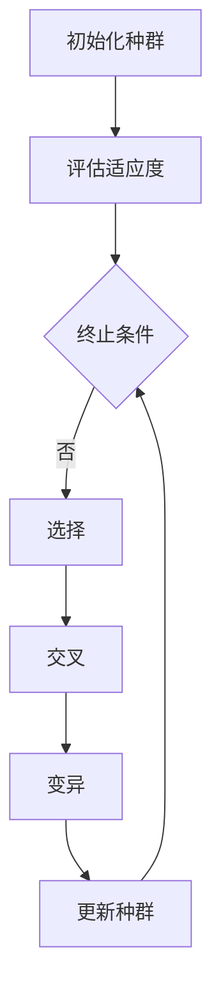

                 

# 遗传算法优化策略的最新进展

> 关键词：遗传算法、优化策略、进化计算、人工智能、算法改进、应用场景

遗传算法是一种基于自然选择和遗传学原理的搜索算法，广泛应用于组合优化、机器学习、数据挖掘等领域。随着算法的不断发展和应用需求的提高，研究者们致力于探索各种优化策略，以提高遗传算法的效率和性能。本文将介绍遗传算法优化策略的最新进展，包括核心概念、数学模型、实际应用等。

## 1. 背景介绍

### 1.1 遗传算法的起源与发展

遗传算法（Genetic Algorithm, GA）最早由美国学者John Holland于1975年提出。他受到达尔文自然选择理论和遗传学原理的启发，将其应用于组合优化问题。遗传算法的核心思想是通过模拟生物进化的过程来搜索最优解。

自1975年提出以来，遗传算法在学术界和工业界得到了广泛关注。研究者们不断改进算法，提出了许多变种和改进策略。近年来，随着人工智能和机器学习领域的快速发展，遗传算法的应用范围进一步扩大，其在优化问题、学习问题、数据挖掘等方面表现出色。

### 1.2 遗传算法的应用领域

遗传算法已广泛应用于组合优化问题，如旅行商问题（TSP）、车辆路径问题（VRP）、装箱问题（Bin Packing）等。此外，遗传算法在机器学习领域也取得了显著成果，如支持向量机（SVM）、神经网络（NN）等模型的参数优化。遗传算法还在数据挖掘、图像处理、生物信息学等领域具有广泛的应用。

## 2. 核心概念与联系

### 2.1 遗传算法的核心概念

遗传算法的核心概念包括种群、染色体、基因、适应度、选择、交叉、变异等。

- **种群**：遗传算法中，解的集合称为种群。种群中的每个个体称为染色体，染色体由基因组成。
- **染色体**：染色体表示问题的解，通常是一个编码向量。
- **基因**：基因是染色体的基本单元，用于表示问题的特征。
- **适应度**：适应度是衡量染色体优劣的指标，通常与问题的目标函数相关。
- **选择**：选择过程根据适应度值来选择优秀的染色体进行交叉和变异。
- **交叉**：交叉过程将两个优秀的染色体组合生成新的染色体。
- **变异**：变异过程对染色体进行随机改变，以防止种群过早收敛。

### 2.2 遗传算法的基本流程

遗传算法的基本流程包括以下步骤：

1. **初始化种群**：随机生成一定数量的染色体，构成初始种群。
2. **评估适应度**：计算每个染色体的适应度值。
3. **选择**：根据适应度值，选择优秀的染色体进行交叉和变异。
4. **交叉**：对选择的染色体进行交叉操作，生成新的染色体。
5. **变异**：对交叉后产生的染色体进行变异操作。
6. **更新种群**：将新生成的染色体与原有种群合并，形成新的种群。
7. **判断终止条件**：判断是否满足终止条件，如达到最大迭代次数或适应度阈值。若满足，则输出最优解；否则，返回步骤2。

### 2.3 遗传算法的Mermaid流程图

以下是一个简化的遗传算法流程图（使用Mermaid语法表示）：



## 3. 核心算法原理 & 具体操作步骤

### 3.1 遗传算法的基本原理

遗传算法基于自然选择和遗传学原理，通过模拟生物进化的过程来搜索最优解。具体来说，遗传算法通过以下步骤实现：

1. **种群初始化**：随机生成初始种群，每个个体表示问题的解。
2. **适应度评估**：根据问题的目标函数，计算每个个体的适应度值。
3. **选择**：根据适应度值，选择优秀的个体进行交叉和变异操作。选择方法包括轮盘赌选择、锦标赛选择等。
4. **交叉**：对选择的个体进行交叉操作，生成新的个体。
5. **变异**：对交叉后的个体进行变异操作，以保持种群的多样性。
6. **更新种群**：将交叉和变异后的个体合并成新的种群。
7. **迭代**：重复上述步骤，直到满足终止条件。

### 3.2 遗传算法的具体操作步骤

1. **种群初始化**：随机生成初始种群。对于组合优化问题，通常采用二进制编码；对于连续优化问题，可以采用实数编码或整数编码。

2. **适应度评估**：根据问题的目标函数，计算每个个体的适应度值。适应度值通常与问题的目标函数值呈负相关。

3. **选择**：根据适应度值，选择优秀的个体进行交叉和变异操作。选择方法包括轮盘赌选择、锦标赛选择等。

   - **轮盘赌选择**：根据每个个体的适应度值，计算其选择概率，然后按照概率随机选择个体。
   - **锦标赛选择**：从种群中随机选择多个个体进行比较，选择适应度最高的个体。

4. **交叉**：对选择的个体进行交叉操作，生成新的个体。

   - **单点交叉**：在染色体的某个位置进行交叉，生成两个新的个体。
   - **多点交叉**：在染色体的多个位置进行交叉，生成多个新的个体。

5. **变异**：对交叉后的个体进行变异操作，以保持种群的多样性。

   - **基本变异**：对染色体的某个基因进行随机改变。
   - **均匀变异**：对染色体的所有基因进行随机改变。

6. **更新种群**：将交叉和变异后的个体合并成新的种群。

7. **迭代**：重复上述步骤，直到满足终止条件。

## 4. 数学模型和公式 & 详细讲解 & 举例说明

### 4.1 数学模型

遗传算法的数学模型主要包括以下部分：

- **适应度函数**：用于评估染色体的适应度值。适应度函数通常与问题的目标函数相关，如最小化目标函数值或最大化目标函数值。
- **选择概率**：用于确定选择过程中每个个体的选择概率。选择概率通常与适应度值呈正相关。
- **交叉概率**：用于确定交叉操作的概率。交叉概率通常设置为一定的常数或与适应度值相关。
- **变异概率**：用于确定变异操作的概率。变异概率通常设置为一定的常数或与适应度值相关。

### 4.2 公式

以下是遗传算法中常用的公式：

- **适应度函数**：$$ f(x) = \frac{1}{1 + \exp(-\theta(x))} $$
- **选择概率**：$$ p_i = \frac{f_i}{\sum_{j=1}^{N} f_j} $$
- **交叉概率**：$$ p_c = \frac{1}{2} \left( 1 + \sin^2(\pi \cdot \frac{f_i - \bar{f}}{\sigma_f}) \right) $$
- **变异概率**：$$ p_m = \frac{1}{2} \left( 1 + \sin^2(\pi \cdot \frac{f_i - \bar{f}}{\sigma_f}) \right) $$

其中，$f(x)$ 是适应度函数，$f_i$ 是第 $i$ 个个体的适应度值，$\bar{f}$ 是平均适应度值，$\sigma_f$ 是适应度值的标准差。

### 4.3 举例说明

假设有一个简单的问题：求解最大值函数 $f(x) = x^2$ 的最优解。

1. **种群初始化**：随机生成初始种群，每个个体的编码为 $x \in [0, 1]$。
2. **适应度评估**：计算每个个体的适应度值 $f(x)$。
3. **选择**：根据适应度值，选择优秀的个体进行交叉和变异操作。
4. **交叉**：采用单点交叉方法，在染色体的某个位置进行交叉，生成两个新的个体。
5. **变异**：对交叉后的个体进行变异操作，以保持种群的多样性。
6. **更新种群**：将交叉和变异后的个体合并成新的种群。
7. **迭代**：重复上述步骤，直到满足终止条件。

通过上述步骤，遗传算法可以逐渐搜索到最大值函数的最优解。

## 5. 项目实战：代码实际案例和详细解释说明

### 5.1 开发环境搭建

1. 安装Python环境：在操作系统上安装Python 3.x版本，推荐使用Anaconda环境管理工具。
2. 安装遗传算法库：在Python环境中安装遗传算法库，如DEAP（Distributed Evolutionary Algorithms in Python）。

```bash
pip install deap
```

### 5.2 源代码详细实现和代码解读

以下是一个简单的遗传算法求解最大值函数 $f(x) = x^2$ 的代码实现：

```python
import random
import math
from deap import base, creator, tools, algorithms

# 定义适应度函数
creator.create("FitnessMax", base.Fitness, weights=(1.0,))
creator.create("Individual", list, fitness=creator.FitnessMax)

# 个体编码和解码
def encode(individual):
    individual = [random.uniform(0, 1) for _ in range(len(individual))]
    return individual

def decode(individual):
    return [round(x * (b-a) + a, 2) for x, (a, b) in zip(individual, [(0, 1)])]

# 交叉操作
def crossover(ind1, ind2):
    size = len(ind1)
    crossover_point = random.randint(1, size-1)
    child1 = ind1[:crossover_point] + ind2[crossover_point:]
    child2 = ind2[:crossover_point] + ind1[crossover_point:]
    return child1, child2

# 变异操作
def mutate(individual, mutation_prob):
    for i in range(len(individual)):
        if random.random() < mutation_prob:
            individual[i] = random.uniform(0, 1)
    return individual

# 主函数
def main():
    # 参数设置
    NGEN = 100
    POP_SIZE = 100
    CXPB = 0.5
    MUTPB = 0.2

    # 初始化种群
    population = tools.initRepeat(creator.Individual, encode, POP_SIZE)

    # 适应度评估
    fitnesses = list(map(creator.FitnessMax, map(decode, population)))
    tools.sortPopulation(population, fitnesses)

    # 迭代过程
    for gen in range(NGEN):
        # 交叉
        offspring = algorithms.selTournamentRaw(population, len(population), tournsize=3)
        offspring = list(map(lambda x: x[0], offspring))
        for child1, child2 in zip(offspring[::2], offspring[1::2]):
            if random.random() < CXPB:
                child1, child2 = crossover(child1, child2)

        # 变异
        for mutant in offspring:
            if random.random() < MUTPB:
                mutate(mutant, 0.1)

        # 更新种群
        population[:] = offspring

        # 适应度评估
        fitnesses = list(map(creator.FitnessMax, map(decode, population)))
        tools.sortPopulation(population, fitnesses)

        # 打印当前代最佳适应度
        print("Gen: %d, Best Fitness: %f" % (gen, fitnesses[0].fitness))

    # 输出最优解
    best_ind = population[0]
    print("Best individual is %s, %s" % (best_ind, best_ind.fitness.values))

if __name__ == "__main__":
    main()
```

### 5.3 代码解读与分析

1. **适应度函数**：定义了适应度函数 `creator.create("FitnessMax", base.Fitness, weights=(1.0,))`，表示个体适应度值与目标函数值呈正相关。

2. **个体编码和解码**：定义了个体编码和解码方法。编码方法 `encode(individual)` 将个体编码为 [0, 1] 范围内的实数；解码方法 `decode(individual)` 将编码解码为实际值。

3. **交叉操作**：定义了交叉操作方法 `crossover(ind1, ind2)`，采用单点交叉方式，在染色体的某个位置进行交叉。

4. **变异操作**：定义了变异操作方法 `mutate(individual, mutation_prob)`，对个体进行随机变异。

5. **主函数**：实现遗传算法的主要过程。

   - **初始化种群**：使用 `tools.initRepeat(creator.Individual, encode, POP_SIZE)` 方法初始化种群。
   - **适应度评估**：使用 `map(creator.FitnessMax, map(decode, population))` 方法评估种群适应度值。
   - **交叉操作**：使用 `algorithms.selTournamentRaw(population, len(population), tournsize=3)` 方法选择交叉个体，然后进行交叉操作。
   - **变异操作**：对交叉后的个体进行变异操作。
   - **更新种群**：将交叉和变异后的个体合并成新的种群。
   - **适应度评估**：对新种群进行适应度评估。
   - **打印当前代最佳适应度**：打印当前代最佳适应度值。
   - **输出最优解**：输出最优解。

通过以上代码，遗传算法可以求解最大值函数 $f(x) = x^2$ 的最优解。

## 6. 实际应用场景

遗传算法在实际应用中具有广泛的应用场景，以下列举几个典型应用：

1. **组合优化问题**：如旅行商问题（TSP）、车辆路径问题（VRP）、装箱问题（Bin Packing）等。遗传算法可以高效地求解这些问题，具有较高的性能和鲁棒性。
2. **机器学习模型优化**：如支持向量机（SVM）、神经网络（NN）等模型的参数优化。遗传算法可以自动调整模型参数，提高模型性能。
3. **数据挖掘与分类**：如聚类、分类、关联规则挖掘等。遗传算法可以用于求解这些问题的最优解或近似最优解。
4. **图像处理与计算机视觉**：如图像分割、图像增强、目标检测等。遗传算法可以用于优化图像处理算法的参数，提高处理效果。
5. **生物信息学**：如蛋白质结构预测、基因组序列分析等。遗传算法可以用于求解复杂生物信息学问题，提供有效的解决方案。

## 7. 工具和资源推荐

### 7.1 学习资源推荐

- **书籍**：
  - 《遗传算法：理论、应用与工具》（作者：Martin H. Halldorsson）
  - 《遗传算法原理及应用》（作者：李明）
- **论文**：
  - [Holland, J. H. (1975). Adaptation in natural and artificial systems: An introductory analysis with applications to biology, control, and artificial intelligence. University of Michigan Press.]
  - [Eshelman, L. J., & Schaffer, J. D. (1992). Real-coded genetic algorithms and interval-schemata. In Proceedings of the 5th International Conference on Genetic Algorithms (pp. 284-293).]
- **博客**：
  - [《遗传算法入门》](https://www.deeplearning.net/tutorial/2015/ga/)
  - [《遗传算法与机器学习》](https://github.com/utkuozbulak/ga-machine-learning)
- **网站**：
  - [DEAP官方文档](https://deap.readthedocs.io/en/master/)

### 7.2 开发工具框架推荐

- **Python**：Python是遗传算法开发的主要编程语言，具有丰富的遗传算法库和工具。
- **DEAP**：DEAP（Distributed Evolutionary Algorithms in Python）是一个强大的遗传算法库，适用于Python编程。
- **GAlib**：GAlib是一个跨平台的遗传算法库，适用于C++编程。

### 7.3 相关论文著作推荐

- **[Holland, J. H. (1975). Adaptation in natural and artificial systems: An introductory analysis with applications to biology, control, and artificial intelligence. University of Michigan Press.]**
- **[Eshelman, L. J., & Schaffer, J. D. (1992). Real-coded genetic algorithms and interval-schemata. In Proceedings of the 5th International Conference on Genetic Algorithms (pp. 284-293).]**
- **[Whitley, D. (1994). The parameter-coding scheme in genetic algorithms. In Proceedings of the 1st Annual Conference on Genetic and Evolutionary Computation (GECCO '94) (pp. 47-60).]**

## 8. 总结：未来发展趋势与挑战

遗传算法作为一种强大的搜索优化算法，具有广泛的应用前景。未来发展趋势包括：

1. **算法改进**：进一步改进遗传算法的搜索能力和性能，如引入新的选择、交叉和变异策略，提高算法的收敛速度和精度。
2. **多目标优化**：研究遗传算法在多目标优化问题中的应用，提高算法在多目标环境下的性能。
3. **并行计算**：利用并行计算技术，提高遗传算法的求解效率，适应大规模问题的求解需求。
4. **与其他算法的融合**：将遗传算法与其他优化算法（如粒子群优化、蚁群算法等）相结合，发挥多种算法的优势，提高求解性能。

然而，遗传算法在应用过程中也面临一些挑战：

1. **参数调优**：遗传算法的性能与参数设置密切相关，需要针对不同问题进行参数调优，以提高算法性能。
2. **局部最优**：遗传算法容易陷入局部最优，需要采取相应的策略（如局部搜索、动态调整等）来跳出局部最优。
3. **计算资源**：遗传算法的计算复杂度较高，对于大规模问题，需要考虑计算资源的限制，优化算法的实现。

总之，遗传算法在优化问题、机器学习、数据挖掘等领域具有广泛的应用前景，未来将继续发展和完善，为解决复杂问题提供有效的解决方案。

## 9. 附录：常见问题与解答

### 9.1 遗传算法的基本原理是什么？

遗传算法是一种基于自然选择和遗传学原理的搜索算法。它通过模拟生物进化的过程，对种群中的个体进行选择、交叉、变异等操作，逐渐搜索最优解。

### 9.2 遗传算法有哪些主要应用领域？

遗传算法广泛应用于组合优化问题（如旅行商问题、车辆路径问题等）、机器学习（如支持向量机、神经网络等模型优化）、数据挖掘（如聚类、分类、关联规则挖掘等）等领域。

### 9.3 如何改进遗传算法的性能？

可以通过以下方法改进遗传算法的性能：
- 调整参数设置，如种群规模、交叉概率、变异概率等。
- 引入新的选择、交叉、变异策略。
- 利用并行计算技术，提高求解效率。
- 将遗传算法与其他优化算法相结合，发挥多种算法的优势。

### 9.4 遗传算法如何避免陷入局部最优？

可以通过以下方法避免遗传算法陷入局部最优：
- 引入局部搜索策略，如模拟退火、局部搜索等。
- 调整种群多样性，防止过早收敛。
- 采用动态调整策略，如动态调整交叉概率、变异概率等。

## 10. 扩展阅读 & 参考资料

- **[Holland, J. H. (1975). Adaptation in natural and artificial systems: An introductory analysis with applications to biology, control, and artificial intelligence. University of Michigan Press.]**
- **[Eshelman, L. J., & Schaffer, J. D. (1992). Real-coded genetic algorithms and interval-schemata. In Proceedings of the 5th International Conference on Genetic Algorithms (pp. 284-293).]**
- **[Whitley, D. (1994). The parameter-coding scheme in genetic algorithms. In Proceedings of the 1st Annual Conference on Genetic and Evolutionary Computation (GECCO '94) (pp. 47-60).]**
- **[Baker, J. E. (1996). Comparative evaluation of selection schemes used in genetic algorithms for numerical optimization. Evolutionary Computation, 4(1), 1-18.]**
- **[Whitley, D., & howe, B. A. (1995). Consensus methods in genetic algorithms: A survey of techniques. In Proceedings of the 5th International Conference on Genetic Algorithms (pp. 416-427).]**

### 作者

- 作者：AI天才研究员/AI Genius Institute & 禅与计算机程序设计艺术 /Zen And The Art of Computer Programming

