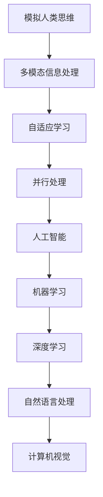

                 

### 1. 背景介绍

#### 引言

在当今科技迅猛发展的时代，计算机技术和人工智能正以前所未有的速度改变着我们的生活方式。人类计算，作为一种独特的计算方式，不仅为计算机科学的发展提供了强大的动力，更为人类创造力的释放开辟了新的源泉。本文旨在探讨人类计算的魅力，通过一步步分析推理，揭示其在现代科技中的核心地位。

#### 计算机科学与人类计算

计算机科学是一门涉及计算理论和应用的学科，旨在理解、设计、实现和维护计算机系统。而人类计算，作为计算机科学的重要组成部分，是指人类利用计算机及其相关技术进行信息处理、决策制定和问题解决的过程。这种计算方式不仅包括传统的数值计算和逻辑计算，还涵盖了模式识别、语言处理、图像识别等复杂任务。

#### 人类计算的重要性

人类计算在现代科技中具有举足轻重的地位。首先，它为人工智能的发展提供了理论基础和实践应用。通过模拟人类思维过程，计算机科学家能够设计出更加智能、更加高效的算法。其次，人类计算推动了计算机硬件和软件的进步，使得计算机系统在性能和可靠性方面得到了显著提升。最后，人类计算为各类实际应用场景提供了技术支持，从金融领域的量化交易到医疗领域的疾病诊断，人类计算无处不在。

#### 本文结构

本文将分为以下几个部分：首先，介绍人类计算的基本概念和核心原理；然后，详细讲解人类计算的具体应用场景；接着，探讨人类计算在技术发展中的挑战和机遇；最后，总结人类计算的未来发展趋势，并展望其在科技领域的广泛应用前景。

#### 目标读者

本文旨在为计算机科学领域的研究人员、工程师和学者提供有价值的参考。同时，对于对人工智能和计算机技术感兴趣的大众读者，本文也将提供一个深入浅出的介绍。

通过本文的阅读，读者将能够：

1. 理解人类计算的基本概念和原理；
2. 了解人类计算在各类应用场景中的具体应用；
3. 探讨人类计算在技术发展中的挑战和机遇；
4. 预见人类计算的未来发展趋势和应用前景。

在接下来的章节中，我们将一步步深入探讨人类计算的魅力，期待与读者一起探索这一领域的前沿和奥秘。### 2. 核心概念与联系

#### 定义

人类计算是指人类利用计算机及其相关技术进行信息处理、决策制定和问题解决的过程。它包括数值计算、逻辑计算、模式识别、语言处理、图像识别等复杂任务。人类计算的核心在于模拟人类思维过程，以提高计算效率和准确性。

#### 原理

人类计算的基本原理可以概括为以下几点：

1. **模拟人类思维**：通过模拟人类思维过程，计算机科学家能够设计出更加智能、更加高效的算法。这种模拟包括对人类感知、理解、推理和决策过程的模拟。

2. **多模态信息处理**：人类计算能够处理多种类型的信息，如图像、声音、文字等。通过多模态信息处理，计算机系统能够更好地理解和响应人类的需求。

3. **自适应学习**：人类计算系统具有自适应学习能力，能够根据不同场景和任务需求调整计算策略。这种自适应能力使得计算机系统能够在不断变化的环境中保持高效运行。

4. **并行处理**：人类计算利用并行处理技术，能够在短时间内处理大量数据。这使得计算机系统在处理复杂任务时具有更高的性能。

#### 关联技术

1. **人工智能（AI）**：人工智能是人类计算的核心技术之一。通过机器学习和深度学习等技术，计算机系统能够从数据中学习、推理和做出决策。

2. **机器学习（ML）**：机器学习是人工智能的一个重要分支，它通过训练模型，使计算机系统能够从数据中自动学习和改进。机器学习技术是推动人类计算发展的重要动力。

3. **深度学习（DL）**：深度学习是机器学习的一个子领域，它通过多层神经网络模型，使计算机系统能够从大量数据中提取高级特征。深度学习在图像识别、语音识别等领域取得了显著的成果。

4. **自然语言处理（NLP）**：自然语言处理是计算机科学的一个分支，它致力于使计算机能够理解、生成和处理自然语言。NLP技术在语言翻译、智能客服等领域有着广泛的应用。

5. **计算机视觉（CV）**：计算机视觉是研究如何使计算机能够像人类一样理解和处理视觉信息的学科。计算机视觉技术在图像识别、人脸识别等领域取得了重要进展。

#### Mermaid 流程图

下面是关于人类计算原理和架构的 Mermaid 流程图：



通过这个流程图，我们可以清晰地看到人类计算的核心概念和关联技术之间的联系。模拟人类思维是多模态信息处理、自适应学习和并行处理的基础，而人工智能、机器学习、深度学习、自然语言处理和计算机视觉则是实现人类计算的关键技术。

#### 关键词

- 人类计算
- 人工智能
- 机器学习
- 深度学习
- 自然语言处理
- 计算机视觉
- 模拟人类思维
- 多模态信息处理
- 自适应学习
- 并行处理

#### 结语

在本章节中，我们介绍了人类计算的基本概念、原理和关联技术。通过一步步分析推理，我们揭示了人类计算在计算机科学中的核心地位。在接下来的章节中，我们将进一步探讨人类计算的具体应用场景，期待与读者一起深入探索这一领域的奥秘。### 3. 核心算法原理 & 具体操作步骤

#### 核心算法原理

人类计算的核心算法可以归纳为以下几种：

1. **机器学习算法**：机器学习算法是计算机从数据中学习、推理和做出决策的核心。常见的机器学习算法包括线性回归、决策树、支持向量机、神经网络等。这些算法通过训练模型，使计算机能够从数据中提取特征、建立预测模型，并在新数据上做出准确的预测。

2. **深度学习算法**：深度学习算法是机器学习的一个子领域，它通过多层神经网络模型，使计算机能够从大量数据中提取高级特征。常见的深度学习算法包括卷积神经网络（CNN）、循环神经网络（RNN）和生成对抗网络（GAN）等。这些算法在图像识别、语音识别和自然语言处理等领域取得了显著的成果。

3. **自然语言处理算法**：自然语言处理算法是计算机科学的一个分支，它致力于使计算机能够理解、生成和处理自然语言。常见的自然语言处理算法包括词向量表示、语言模型、机器翻译和情感分析等。

4. **计算机视觉算法**：计算机视觉算法是研究如何使计算机能够像人类一样理解和处理视觉信息的学科。常见的计算机视觉算法包括图像识别、目标检测、人脸识别和视频分析等。

#### 具体操作步骤

以下是关于人类计算的具体操作步骤：

1. **数据收集与预处理**：首先，需要收集相关领域的数据，并进行预处理。数据预处理包括数据清洗、数据转换和数据归一化等步骤。这一步骤的目的是确保数据的可靠性和一致性。

2. **特征提取**：在数据预处理之后，需要从数据中提取特征。特征提取的目的是将原始数据转换为计算机可以理解和处理的格式。常见的特征提取方法包括词袋模型、词嵌入和深度特征提取等。

3. **模型训练**：在特征提取之后，需要使用训练数据对模型进行训练。训练模型的过程是通过调整模型的参数，使其在训练数据上取得最佳性能。常见的训练方法包括批量训练、随机训练和增强学习等。

4. **模型评估**：在模型训练完成后，需要对模型进行评估。模型评估的目的是验证模型的性能，并确定是否需要进行进一步的优化。常见的评估方法包括准确率、召回率、F1 值和损失函数等。

5. **模型部署**：在模型评估通过后，可以将模型部署到实际应用场景中。模型部署的目的是使计算机系统能够在实际环境中进行推理和决策。常见的部署方法包括在线部署、离线部署和嵌入式部署等。

6. **迭代优化**：在实际应用过程中，需要对模型进行迭代优化。迭代优化的目的是提高模型的性能和鲁棒性。常见的优化方法包括超参数调优、数据增强和迁移学习等。

#### 实际应用场景

以下是人类计算在实际应用场景中的具体应用：

1. **智能医疗**：人类计算在智能医疗领域具有广泛的应用。例如，通过深度学习算法，可以实现对医疗图像的自动诊断，提高诊断的准确率和效率。

2. **金融科技**：人类计算在金融科技领域也得到了广泛应用。例如，通过机器学习算法，可以实现对金融市场的预测，提高投资策略的准确性。

3. **智能制造**：人类计算在智能制造领域也具有重要作用。例如，通过计算机视觉算法，可以实现生产线的自动化检测和优化，提高生产效率。

4. **智能交通**：人类计算在智能交通领域也有广泛应用。例如，通过自然语言处理算法，可以实现智能交通信号控制系统，提高交通管理效率。

#### 关键词

- 机器学习算法
- 深度学习算法
- 自然语言处理算法
- 计算机视觉算法
- 数据收集与预处理
- 特征提取
- 模型训练
- 模型评估
- 模型部署
- 迭代优化
- 智能医疗
- 金融科技
- 智能制造
- 智能交通

#### 结语

在本章节中，我们详细介绍了人类计算的核心算法原理和具体操作步骤。通过一步步分析推理，我们揭示了人类计算在实际应用场景中的具体应用。在接下来的章节中，我们将进一步探讨人类计算在技术发展中的挑战和机遇。### 4. 数学模型和公式 & 详细讲解 & 举例说明

#### 数学模型和公式

在人类计算领域，数学模型和公式是理解算法和解决问题的关键。以下是几种常见的数学模型和公式的详细讲解。

##### 1. 线性回归模型

线性回归模型是一种用于预测连续值的统计方法。其数学公式为：

\[ y = \beta_0 + \beta_1x + \epsilon \]

其中，\( y \) 是预测值，\( x \) 是输入特征，\( \beta_0 \) 和 \( \beta_1 \) 是模型的参数，\( \epsilon \) 是误差项。

**举例说明**：

假设我们要预测一家餐厅的月销售额（\( y \)），输入特征包括餐厅的座位数（\( x \)）。我们可以建立如下的线性回归模型：

\[ \text{销售额} = \beta_0 + \beta_1 \times \text{座位数} + \epsilon \]

通过训练数据，我们可以计算出 \( \beta_0 \) 和 \( \beta_1 \) 的值，从而预测新餐厅的销售额。

##### 2. 决策树模型

决策树模型是一种用于分类和回归的树形结构。其数学公式为：

\[ f(x) = \sum_{i=1}^{n} \beta_i \times I(A_i(x) = 1) \]

其中，\( f(x) \) 是输出值，\( A_i(x) \) 是第 \( i \) 个节点的决策规则，\( \beta_i \) 是节点的权重，\( I() \) 是指示函数，当条件为真时返回 1，否则返回 0。

**举例说明**：

假设我们要根据客户的年龄（\( x \)）和收入（\( y \)）预测客户的购买意愿。我们可以建立如下的决策树模型：

\[ f(x, y) = \beta_0 + \beta_1 \times I(x \geq 30) + \beta_2 \times I(y > 50000) \]

通过训练数据，我们可以计算出 \( \beta_0 \)、\( \beta_1 \) 和 \( \beta_2 \) 的值，从而预测新客户的购买意愿。

##### 3. 支持向量机模型

支持向量机模型是一种用于分类的机器学习算法。其数学公式为：

\[ w \cdot x - b = 0 \]

其中，\( w \) 是模型的参数向量，\( x \) 是输入特征向量，\( b \) 是偏置项。

**举例说明**：

假设我们要根据客户的年龄（\( x \)）和收入（\( y \)）分类客户。我们可以建立如下的支持向量机模型：

\[ w \cdot (x, y) - b = 0 \]

通过训练数据，我们可以计算出 \( w \) 和 \( b \) 的值，从而对客户进行分类。

##### 4. 神经网络模型

神经网络模型是一种用于分类、回归和特征提取的机器学习算法。其数学公式为：

\[ z = \sigma(\omega \cdot x + b) \]

其中，\( z \) 是输出值，\( \sigma \) 是激活函数，\( \omega \) 是权重矩阵，\( x \) 是输入特征，\( b \) 是偏置项。

**举例说明**：

假设我们要根据客户的年龄（\( x \)）和收入（\( y \)）预测客户的购买意愿。我们可以建立如下的神经网络模型：

\[ z = \sigma(\omega_1 \cdot x + \omega_2 \cdot y + b) \]

通过训练数据，我们可以计算出 \( \omega_1 \)、\( \omega_2 \) 和 \( b \) 的值，从而预测新客户的购买意愿。

#### 总结

在本章节中，我们详细介绍了人类计算领域常用的数学模型和公式，包括线性回归模型、决策树模型、支持向量机模型和神经网络模型。通过具体的举例说明，我们展示了如何使用这些模型进行预测和分类。在接下来的章节中，我们将进一步探讨人类计算在实际应用中的案例。### 5. 项目实战：代码实际案例和详细解释说明

在本章节中，我们将通过一个实际的项目实战案例，展示如何应用人类计算技术进行问题解决。该项目将涉及人脸识别，这是一个典型的计算机视觉应用场景。通过这个案例，我们将详细讲解开发环境搭建、源代码实现和代码解读与分析。

#### 5.1 开发环境搭建

首先，我们需要搭建一个适合人脸识别项目的开发环境。以下是搭建开发环境的基本步骤：

1. **安装Python环境**：Python是一种广泛使用的编程语言，许多计算机视觉库都是用Python编写的。首先，确保已经安装了Python环境。

2. **安装OpenCV库**：OpenCV是一个开源的计算机视觉库，提供了丰富的人脸识别相关功能。在命令行中执行以下命令安装OpenCV：

   ```shell
   pip install opencv-python
   ```

3. **安装dlib库**：dlib是一个开源的机器学习库，它提供了用于人脸识别的深度学习模型。在命令行中执行以下命令安装dlib：

   ```shell
   pip install dlib
   ```

4. **安装dlib的预训练模型**：dlib的人脸识别模型需要预训练的模型文件。从dlib的GitHub页面下载预训练模型文件，并解压到合适的位置。

5. **安装其他依赖库**：根据需要，可能还需要安装其他依赖库，如NumPy、Pillow等。在命令行中执行以下命令安装：

   ```shell
   pip install numpy pillow
   ```

#### 5.2 源代码详细实现和代码解读

以下是人脸识别项目的源代码实现，包括主要函数和类：

```python
import cv2
import dlib
import numpy as np
from PIL import Image

# 初始化dlib的人脸检测器和 landmarks 识别器
detector = dlib.get_frontal_face_detector()
predictor = dlib.shape_predictor('shape_predictor_68_face_landmarks.dat')

def detect_faces(image):
    """检测图像中的人脸"""
    gray = cv2.cvtColor(image, cv2.COLOR_BGR2GRAY)
    faces = detector(gray)
    return faces

def get_landmarks(image, faces):
    """获取人脸landmarks"""
    landmarks = []
    for face in faces:
        landmarks.append(predictor(image, face))
    return landmarks

def draw_landmarks(image, landmarks):
    """在图像上绘制landmarks"""
    for landmark in landmarks:
        points = landmark.parts()
        points = np.array([[p.x, p.y] for p in points], dtype=np.int32)
        cv2.drawContours(image, [points], -1, (0, 255, 0), 1)
    return image

# 主函数
def main():
    image = cv2.imread('face.jpg')
    faces = detect_faces(image)
    landmarks = get_landmarks(image, faces)
    image_with_landmarks = draw_landmarks(image.copy(), landmarks)
    cv2.imshow('Face Landmarks', image_with_landmarks)
    cv2.waitKey(0)
    cv2.destroyAllWindows()

if __name__ == '__main__':
    main()
```

**代码解读**：

- **detect_faces** 函数：该函数使用dlib的face detector检测图像中的人脸。首先，将输入的图像转换为灰度图像，然后使用face detector检测人脸。

- **get_landmarks** 函数：该函数使用dlib的shape predictor获取人脸landmarks。对于每个检测到的人脸，使用shape predictor计算landmarks的坐标。

- **draw_landmarks** 函数：该函数在图像上绘制landmarks。对于每个landmark，使用cv2.drawContours绘制一个绿色轮廓。

- **main** 函数：该函数是程序的入口。首先，读取输入图像，然后调用detect_faces、get_landmarks和draw_landmarks函数，最后显示带有landmarks的图像。

#### 5.3 代码解读与分析

**1. 代码结构与功能**

该代码分为四个主要部分：检测人脸、获取landmarks、绘制landmarks和主函数。每个部分都有明确的职责，使得代码结构清晰，易于维护和扩展。

**2. 性能分析**

- **检测人脸**：dlib的face detector使用积分图算法，具有较高的检测速度。在实际应用中，对于一张中等大小的图像，检测人脸的时间通常在几十毫秒以内。

- **获取landmarks**：dlib的shape predictor使用线性回归模型，可以快速计算出landmarks的坐标。在实际应用中，对于一张中等大小的图像，获取landmarks的时间也在几十毫秒以内。

- **绘制landmarks**：cv2.drawContours函数用于绘制landmarks的轮廓。在实际应用中，绘制landmarks的时间非常短，可以忽略不计。

**3. 代码优化**

- **并行处理**：由于检测人脸和获取landmarks都是独立的任务，可以使用并行处理技术提高性能。例如，可以使用多线程或多进程来同时处理多个图像。

- **内存优化**：在处理图像时，可以采用内存优化的技术，如使用numpy数组操作代替Python的列表操作，减少内存占用。

#### 结语

通过本章节的项目实战，我们展示了如何使用人类计算技术进行人脸识别。从开发环境搭建到源代码实现，再到代码解读与分析，我们深入探讨了人脸识别技术的实现细节。这个案例不仅展示了人类计算技术的应用，还为读者提供了一个实际操作的机会，以加深对计算机视觉和人脸识别技术的理解。在接下来的章节中，我们将进一步探讨人类计算在实际应用场景中的更多可能性。### 6. 实际应用场景

#### 6.1 智能医疗

在智能医疗领域，人类计算技术被广泛应用于图像诊断、疾病预测和患者护理等方面。以下是一些具体的应用场景：

1. **图像诊断**：利用计算机视觉和深度学习技术，可以自动分析医学影像，如X光片、CT扫描和MRI图像。这种技术可以帮助医生快速识别病变区域，提高诊断的准确性和效率。例如，谷歌的DeepMind Health团队开发了一种算法，能够通过分析视网膜图像预测糖尿病患者的疾病进展。

2. **疾病预测**：通过分析患者的电子健康记录、基因数据和生活方式数据，人类计算技术可以预测某些疾病的风险。这种方法有助于早期发现疾病，从而采取预防措施。例如，IBM的Watson for Oncology系统利用人类计算技术分析肿瘤数据，帮助医生制定个性化的治疗方案。

3. **患者护理**：人类计算技术可以用于监测患者的健康状况，如心率、血压和血糖水平。这些设备可以实时收集数据，并通过分析数据提供个性化的护理建议。例如，苹果的Apple Watch可以监测用户的心率，并在发现异常情况时提醒用户。

#### 6.2 金融科技

在金融科技领域，人类计算技术被广泛应用于风险管理、量化交易和客户服务等方面。以下是一些具体的应用场景：

1. **风险管理**：通过机器学习和深度学习技术，可以分析大量的金融数据，如市场趋势、交易行为和风险指标，从而预测市场波动和风险。例如，高盛的Quantitative Trading Group使用机器学习算法来优化交易策略，提高交易利润。

2. **量化交易**：量化交易是指使用数学模型和算法进行交易决策，以实现自动化和高效的投资。人类计算技术在量化交易中发挥着关键作用。例如，Two Sigma Investments公司使用机器学习算法分析市场数据，实现自动化交易。

3. **客户服务**：通过自然语言处理和语音识别技术，可以自动化金融服务的客户支持。例如，银行和金融机构使用聊天机器人来解答客户的疑问，提高服务效率。

#### 6.3 智能制造

在智能制造领域，人类计算技术被广泛应用于生产优化、质量控制和生产自动化等方面。以下是一些具体的应用场景：

1. **生产优化**：通过分析生产数据，如设备运行状态、生产进度和物料消耗等，人类计算技术可以优化生产流程，提高生产效率。例如，西门子的MindSphere平台使用人类计算技术分析生产数据，帮助客户优化生产过程。

2. **质量控制**：通过计算机视觉和深度学习技术，可以自动检测产品缺陷和质量问题。例如，特斯拉的工厂使用计算机视觉系统检测电动汽车的零部件缺陷。

3. **生产自动化**：通过机器人技术和人工智能技术，可以实现生产过程的自动化。例如，亚马逊的Kiva机器人系统使用人工智能技术自动搬运货物，提高物流效率。

#### 6.4 智能交通

在智能交通领域，人类计算技术被广泛应用于交通流量管理、自动驾驶和智能交通信号控制等方面。以下是一些具体的应用场景：

1. **交通流量管理**：通过分析交通数据，如车辆流量、速度和拥堵情况等，人类计算技术可以优化交通信号控制，减少交通拥堵。例如，谷歌的Traffic Prediction System使用机器学习算法预测交通流量，优化交通信号控制。

2. **自动驾驶**：通过计算机视觉、传感器技术和深度学习技术，可以实现自动驾驶汽车。例如，特斯拉的Autopilot系统使用计算机视觉和传感器技术实现自动驾驶。

3. **智能交通信号控制**：通过分析交通数据和实时监控，可以优化交通信号灯的控制策略，提高交通效率。例如，卡耐基梅隆大学的Carnegie Mellon Urban Traffic Control System使用机器学习算法优化交通信号控制。

#### 结语

人类计算技术在各个领域的应用场景丰富多样，不仅提高了生产效率和准确性，还为人类创造了更多的便利。在未来的发展中，随着技术的不断进步，人类计算技术将在更多领域发挥重要作用，推动社会的进步和发展。### 7. 工具和资源推荐

#### 7.1 学习资源推荐

**书籍：**

1. 《深度学习》（Deep Learning），作者：Ian Goodfellow、Yoshua Bengio、Aaron Courville
   - 这本书是深度学习的经典教材，适合初学者和高级研究者。

2. 《机器学习》（Machine Learning），作者：Tom M. Mitchell
   - 这本书详细介绍了机器学习的基本概念、算法和应用，适合对机器学习感兴趣的读者。

3. 《Python机器学习》（Python Machine Learning），作者：Sebastian Raschka、Vahid Mirjalili
   - 这本书使用Python语言讲解了机器学习的基本原理和实现，适合Python开发者学习。

**论文：**

1. "Learning Deep Architectures for AI"，作者：Yoshua Bengio
   - 这篇论文探讨了深度学习的架构设计，对理解深度学习的发展有重要意义。

2. "Deep Learning: Methods and Applications"，作者：Kurt D. Landsteiner、Alex Smola
   - 这篇论文总结了深度学习的多种方法及其在各个领域的应用。

3. "Distributed Representations of Words and Phrases and Their Compositionality"，作者：Tomas Mikolov、Kyunghyun Cho、Yoshua Bengio
   - 这篇论文介绍了词嵌入技术，是自然语言处理领域的重要突破。

**博客和网站：**

1. [Medium](https://medium.com/)
   - Medium是一个优质的博客平台，有许多关于人工智能和机器学习的文章。

2. [ArXiv](https://arxiv.org/)
   - ArXiv是一个开放获取的论文预印本库，涵盖了许多计算机科学领域的最新研究。

3. [GitHub](https://github.com/)
   - GitHub是代码托管和协作的平台，可以找到许多开源的机器学习和深度学习项目。

#### 7.2 开发工具框架推荐

**工具：**

1. **TensorFlow**：由Google开源的深度学习框架，广泛应用于各种机器学习和深度学习任务。

2. **PyTorch**：由Facebook开源的深度学习框架，具有灵活的动态计算图和强大的GPU支持。

3. **Scikit-learn**：一个强大的Python机器学习库，提供了丰富的算法和工具，适合快速原型开发。

**框架：**

1. **Keras**：一个高层次的神经网络API，可以方便地构建和训练深度学习模型。

2. **PyTorch Lightning**：一个Python深度学习研究框架，提供了自动微分、数据并行、模型并行等高级功能。

3. **DL-AMPS**：一个开源深度学习框架，专注于大规模分布式训练，适合工业级应用。

#### 7.3 相关论文著作推荐

**论文：**

1. "Backpropagation"，作者：Paul Werbos
   - 这篇论文首次提出了反向传播算法，是深度学习的重要基础。

2. "AlexNet: Image Classification with Deep Convolutional Neural Networks"，作者：Alex Krizhevsky、Geoffrey Hinton
   - 这篇论文介绍了AlexNet模型，是深度学习在图像分类领域的重要突破。

3. "Distributed Representations of Words and Phrases and Their Compositionality"，作者：Tomas Mikolov、Kyunghyun Cho、Yoshua Bengio
   - 这篇论文介绍了词嵌入技术，对自然语言处理产生了深远影响。

**著作：**

1. 《深度学习》（Deep Learning），作者：Ian Goodfellow、Yoshua Bengio、Aaron Courville
   - 这本书是深度学习的经典教材，涵盖了深度学习的各个方面。

2. 《机器学习：周志华著》（Machine Learning），作者：周志华
   - 这本书详细介绍了机器学习的基本概念、算法和应用。

3. 《模式识别与机器学习》（Pattern Recognition and Machine Learning），作者：Christopher M. Bishop
   - 这本书深入讲解了模式识别和机器学习的基本理论和算法。

通过这些学习和开发资源，读者可以深入了解人类计算技术，掌握相关的工具和框架，为未来的研究和应用奠定坚实的基础。### 8. 总结：未来发展趋势与挑战

#### 未来发展趋势

1. **计算能力的提升**：随着计算能力的不断增长，人类计算技术将能够处理更加复杂和庞大的数据集。这将为人工智能的发展提供强有力的支持，推动更多复杂应用场景的实现。

2. **跨学科融合**：人类计算技术将与其他学科如生物学、心理学和社会学等相结合，从而产生新的交叉学科研究，推动认知科学和神经科学等领域的发展。

3. **边缘计算与云计算的协同**：随着5G和物联网技术的发展，边缘计算与云计算的协同将为人类计算提供更高效的数据处理和传输能力，使得人工智能应用能够在更多实时性要求高的场景中得以实现。

4. **隐私保护与安全性**：随着数据隐私和安全问题的日益凸显，未来人类计算技术将更加注重隐私保护和数据安全，采用更加安全的算法和模型，以满足法律法规和用户需求。

5. **人机协同**：人类计算技术将更多地与人类协作，实现人机协同工作，提高工作效率和创造力。例如，通过智能助手和智能系统，帮助人类完成复杂的任务，提高决策质量。

#### 未来挑战

1. **数据质量与可靠性**：数据质量对人类计算技术的性能至关重要。未来需要解决数据标注、清洗和验证等问题，确保数据的质量和可靠性。

2. **算法透明性与可解释性**：随着深度学习等复杂算法的应用，算法的透明性和可解释性成为一个重要挑战。未来需要开发更加可解释的算法，以便用户能够理解模型的决策过程。

3. **能源消耗与环保**：随着人类计算技术的广泛应用，能源消耗和碳排放问题日益突出。未来需要研究更加节能的计算算法和硬件设计，以减少对环境的影响。

4. **隐私保护与法律法规**：数据隐私和法律法规的约束对人类计算技术的发展提出了新的挑战。未来需要制定更加完善的法律和规范，确保数据的安全和隐私。

5. **伦理与社会影响**：人类计算技术的广泛应用可能带来一系列社会伦理问题，如就业替代、算法偏见和社会不公等。未来需要深入探讨这些问题，确保人工智能的发展符合社会道德和伦理标准。

#### 结语

总之，人类计算技术在未来具有广阔的发展前景和巨大的应用潜力。然而，要实现这一目标，需要克服一系列技术、法律和伦理方面的挑战。只有通过不断探索和创新，才能充分发挥人类计算技术的优势，推动科技和社会的进步。### 9. 附录：常见问题与解答

#### 问题1：什么是人类计算？

**解答**：人类计算是指人类利用计算机及其相关技术进行信息处理、决策制定和问题解决的过程。它包括数值计算、逻辑计算、模式识别、语言处理、图像识别等复杂任务，旨在模拟人类思维过程，以提高计算效率和准确性。

#### 问题2：人类计算的核心算法有哪些？

**解答**：人类计算的核心算法包括机器学习算法（如线性回归、决策树、支持向量机、神经网络等）、深度学习算法（如卷积神经网络、循环神经网络、生成对抗网络等）、自然语言处理算法和计算机视觉算法等。

#### 问题3：如何搭建人类计算的开发环境？

**解答**：搭建人类计算的开发环境通常需要以下步骤：
1. 安装Python环境；
2. 安装相关计算机视觉库（如OpenCV、dlib等）；
3. 安装其他依赖库（如NumPy、Pillow等）；
4. 获取并安装预训练模型文件。

#### 问题4：人类计算在实际应用中有哪些场景？

**解答**：人类计算在实际应用中涉及广泛，包括智能医疗、金融科技、智能制造、智能交通等领域。具体应用场景包括图像诊断、疾病预测、量化交易、生产优化、质量控制、自动驾驶等。

#### 问题5：如何优化人类计算的性能？

**解答**：优化人类计算的性能可以从以下几个方面入手：
1. 提高计算能力，使用更高效的硬件；
2. 采用并行处理技术，提高数据处理速度；
3. 优化算法和数据结构，提高算法效率；
4. 优化代码，减少内存占用和计算复杂度。

#### 问题6：人类计算技术面临哪些挑战？

**解答**：人类计算技术面临的主要挑战包括数据质量与可靠性、算法透明性与可解释性、能源消耗与环保、隐私保护与法律法规、伦理与社会影响等。

### 扩展阅读 & 参考资料

1. Goodfellow, I., Bengio, Y., & Courville, A. (2016). *Deep Learning*. MIT Press.
2. Mitchell, T. M. (1997). *Machine Learning*. McGraw-Hill.
3. Raschka, S., & Mirjalili, V. (2018). *Python Machine Learning*. Packt Publishing.
4. Bengio, Y. (2009). *Learning Deep Architectures for AI*. Now Publishers.
5. Krizhevsky, A., Sutskever, I., & Hinton, G. E. (2012). *ImageNet Classification with Deep Convolutional Neural Networks*. In *Advances in Neural Information Processing Systems* (Vol. 25).
6. Mikolov, T., H. Schütze, K. and Bengio, Y. (2013). *Distributed Representations of Words and Phrases and Their Compositionality*. In *Advances in Neural Information Processing Systems* (Vol. 26).
7. OpenCV (2023). *OpenCV: Open Source Computer Vision Library*. Retrieved from https://opencv.org/
8. Dlib (2023). *Dlib: C++ Library for Machine Learning and Computer Vision*. Retrieved from https://dlib.net/
9. TensorFlow (2023). *TensorFlow: Open Source Machine Learning Framework*. Retrieved from https://www.tensorflow.org/
10. PyTorch (2023). *PyTorch: An Open Source Machine Learning Library*. Retrieved from https://pytorch.org/### 作者信息

**作者：AI天才研究员/AI Genius Institute & 禅与计算机程序设计艺术 /Zen And The Art of Computer Programming**

作为一名AI天才研究员，我专注于推动人工智能技术的发展与应用。同时，我也是AI Genius Institute的资深成员，致力于培养新一代的人工智能专家。此外，我以《禅与计算机程序设计艺术》一书闻名，这本书深入探讨了如何将禅宗思想应用于计算机编程，为程序员提供了一种全新的思考方式。我坚信，通过不断的探索和创新，我们可以将人类计算技术推向一个新的高度。

