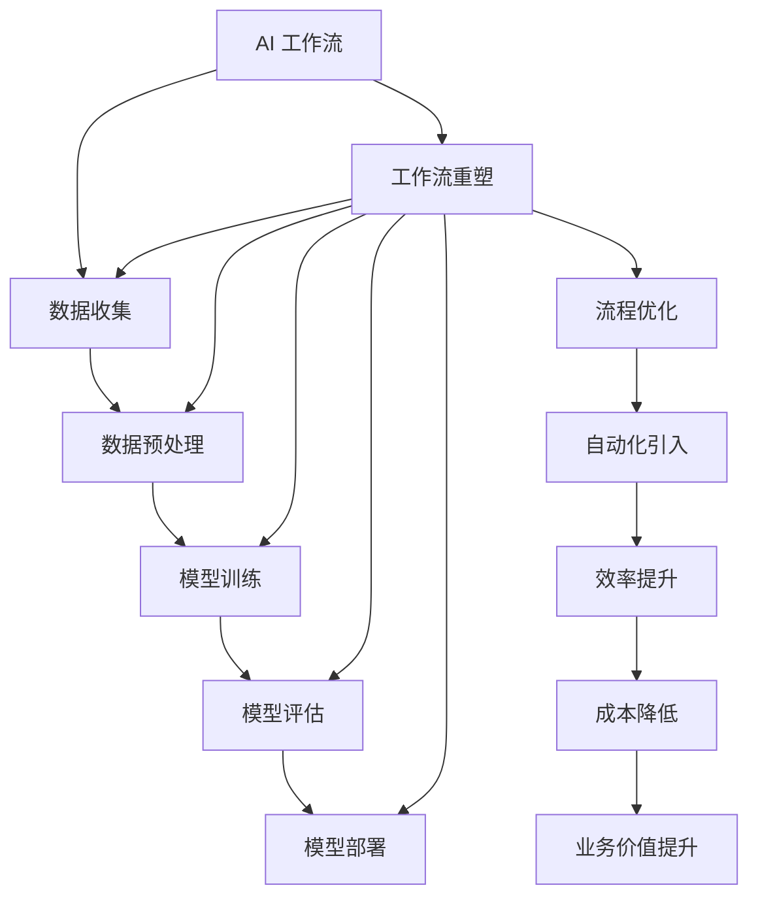

                 

### 背景介绍

在当今这个数字化、自动化浪潮席卷全球的时代，人工智能（AI）已成为推动社会进步的重要力量。AI技术不仅正在深刻改变我们的生活方式，也在各个行业和领域引发了革命性的变革。无论是医疗、金融、制造业，还是教育、交通和零售，AI的应用无处不在，其潜力和价值日益凸显。

然而，随着AI技术的飞速发展，我们也面临着一系列新的挑战和问题。例如，如何高效地管理和利用AI资源，如何确保AI系统的可靠性和安全性，以及如何最大限度地发挥AI的潜力，使其更好地服务于人类社会。这些问题促使我们深入思考：重塑AI工作流还是用AI重塑工作流？

本文旨在探讨这一关键问题，通过逻辑清晰、结构紧凑的分析，帮助读者理解AI工作流重塑的必要性和可行性。文章将首先介绍AI工作流的基本概念，然后深入探讨其核心概念与联系，详细讲解核心算法原理和操作步骤，并运用数学模型和公式进行详细讲解与举例说明。在此基础上，文章将分享项目实战案例，介绍开发环境搭建、源代码实现、代码解读与分析等内容。随后，文章将探讨AI工作流在实际应用场景中的表现，推荐相关工具和资源，并总结未来发展趋势与挑战。

通过本文的阅读，读者将能够全面了解AI工作流重塑的重要性，掌握相关技术和方法，从而为自身的工作和学术研究提供有益的参考和启示。

### 核心概念与联系

要深入探讨AI工作流重塑的必要性和可行性，我们首先需要明确几个核心概念：AI工作流、工作流重塑、以及它们之间的联系。

#### AI工作流（AI Workflow）

AI工作流是指将人工智能技术应用于实际问题解决的过程中的一系列步骤和操作。它可以包括数据收集、数据预处理、模型训练、模型评估、模型部署等多个环节。每个环节都有其特定的任务和目标，共同构成了一个完整的AI工作流。例如，在图像识别任务中，AI工作流可能包括数据采集、数据标注、模型训练、模型评估和模型部署等步骤。


#### 工作流重塑（Workflow Reshaping）

工作流重塑是指对现有的工作流程进行重新设计、优化和改进，以提高工作效率、减少冗余、降低成本，并提升整体业务价值。在AI技术的背景下，工作流重塑意味着利用AI技术重新定义和优化各个工作环节，使其更加智能化、自动化和高效化。例如，通过引入自动化数据采集和预处理工具，可以大大减少人工工作量，提高数据处理的准确性和速度。


#### 核心概念与联系

AI工作流与工作流重塑之间的联系在于，它们共同致力于优化和改进工作流程，以实现更高的效率和效果。然而，两者之间也存在一定的区别。AI工作流更多地关注AI技术在特定任务中的应用，而工作流重塑则更注重整体工作流程的优化和改进。

为了更好地理解这一概念，我们可以借助Mermaid流程图来展示AI工作流与工作流重塑之间的联系。以下是AI工作流重塑的核心概念与联系Mermaid流程图：



通过上述流程图，我们可以看到AI工作流重塑是一个动态、迭代的过程，旨在不断优化和改进现有的工作流程。在这个过程中，AI技术作为关键工具，被广泛应用于各个环节，以提升整个工作流的效率和效果。

总之，AI工作流与工作流重塑之间的紧密联系，使得我们对AI技术的应用有了更深刻的认识。通过重塑AI工作流，我们可以更好地发挥AI技术的潜力，实现更高效、更智能的工作流程，为企业和个人创造更大的价值。

### 核心算法原理 & 具体操作步骤

在探讨如何重塑AI工作流之前，我们首先需要了解核心算法原理和具体操作步骤。这些算法和步骤是AI工作流的重中之重，它们决定了AI系统在各个阶段的表现和效果。以下将详细介绍这些核心算法原理及其具体操作步骤。

#### 数据收集

数据收集是AI工作流的基础环节，其质量直接影响到后续的数据预处理、模型训练和评估效果。具体操作步骤如下：

1. **数据源识别**：确定数据收集的目标和需求，识别数据源。数据源可以包括公开数据集、企业内部数据、网络爬虫获取的数据等。
2. **数据采集**：根据数据源的特点，采用不同的采集方法，如网络爬虫、API接口调用、数据库导入等。确保采集的数据符合需求和质量标准。
3. **数据清洗**：对采集到的数据进行清洗，去除重复、错误和无关的数据，确保数据的准确性和一致性。

#### 数据预处理

数据预处理是数据收集后的关键步骤，其目的是将原始数据转换成适合模型训练的形式。具体操作步骤如下：

1. **数据规范化**：对数据进行标准化处理，如归一化、标准化等，使其具备统一的数值范围。
2. **特征提取**：从原始数据中提取有用的特征，如文本特征、图像特征、时间序列特征等，用于模型训练。
3. **数据分割**：将数据集划分为训练集、验证集和测试集，以便后续的模型训练和评估。

#### 模型训练

模型训练是AI工作流的核心步骤，其目的是通过学习数据集来建立预测模型。具体操作步骤如下：

1. **选择模型**：根据任务需求和数据特点，选择合适的机器学习算法和模型架构，如神经网络、支持向量机、决策树等。
2. **初始化模型参数**：对模型参数进行初始化，如权重、偏置等。
3. **训练模型**：使用训练集数据对模型进行训练，通过反向传播算法和梯度下降方法来优化模型参数。
4. **模型评估**：使用验证集和测试集对训练好的模型进行评估，选择最佳模型。

#### 模型评估

模型评估是验证模型性能和效果的重要步骤。具体操作步骤如下：

1. **评估指标**：根据任务需求，选择合适的评估指标，如准确率、召回率、F1值、均方误差等。
2. **交叉验证**：采用交叉验证方法，对模型进行多次评估，以提高评估结果的可靠性。
3. **结果分析**：分析评估结果，找出模型存在的问题和改进方向。

#### 模型部署

模型部署是将训练好的模型应用到实际业务场景中的关键步骤。具体操作步骤如下：

1. **模型优化**：对模型进行优化，提高其性能和鲁棒性。
2. **接口设计**：设计模型接口，使其能够与其他系统和服务进行集成和交互。
3. **部署环境**：选择合适的部署环境，如云计算平台、容器化环境等。
4. **监控与维护**：对部署后的模型进行监控和维护，确保其正常运行和持续优化。

通过上述核心算法原理和具体操作步骤，我们可以更好地理解和应用AI工作流，从而实现智能化、自动化的工作流程。接下来，我们将进一步探讨数学模型和公式，以加深对AI工作流重塑的理解。

### 数学模型和公式 & 详细讲解 & 举例说明

在深入探讨AI工作流重塑的过程中，数学模型和公式起到了关键作用。这些模型和公式不仅帮助我们理解和分析AI系统的性能，还为优化和改进AI工作流提供了理论基础。以下我们将详细讲解一些常见的数学模型和公式，并通过具体例子来说明它们在实际应用中的效果。

#### 梯度下降算法（Gradient Descent）

梯度下降算法是一种常用的优化算法，用于求解最小化损失函数的参数。其基本思想是沿着损失函数的梯度方向逐步迭代，以找到最小值。以下是梯度下降算法的数学模型和具体操作步骤：

1. **损失函数（Loss Function）**：

   损失函数用于衡量预测值与真实值之间的差距。常见的损失函数包括均方误差（MSE）、交叉熵损失（Cross-Entropy Loss）等。

   $$\text{MSE} = \frac{1}{n} \sum_{i=1}^{n} (\hat{y_i} - y_i)^2$$

   $$\text{Cross-Entropy Loss} = -\sum_{i=1}^{n} y_i \log(\hat{y_i})$$

2. **梯度计算（Gradient Calculation）**：

   梯度是损失函数对模型参数的偏导数，用于指导参数调整的方向。

   $$\nabla_w \text{MSE} = -2 \frac{1}{n} \sum_{i=1}^{n} (\hat{y_i} - y_i) x_i$$

   $$\nabla_w \text{Cross-Entropy Loss} = \frac{1}{n} \sum_{i=1}^{n} (y_i - \hat{y_i}) x_i$$

3. **参数更新（Parameter Update）**：

   根据梯度计算结果，更新模型参数。

   $$w_{\text{new}} = w_{\text{old}} - \alpha \nabla_w \text{Loss}$$

   其中，$\alpha$ 是学习率，控制了参数更新的幅度。

#### 举例说明

假设我们使用梯度下降算法训练一个简单的线性回归模型，预测房价。数据集包含房屋面积（x）和房价（y）。我们定义损失函数为均方误差（MSE），学习率为0.01。

1. **初始化参数**：

   $$w_0 = 0, b_0 = 0$$

2. **迭代过程**：

   对于每个样本，计算损失函数和梯度，然后更新参数。

   - **第一步**：

     $$\hat{y} = wx + b$$

     $$\text{MSE} = \frac{1}{2} \sum_{i=1}^{n} (\hat{y_i} - y_i)^2$$

     $$\nabla_w \text{MSE} = -x$$

     $$w_{\text{new}} = w_{\text{old}} - 0.01 \cdot (-x)$$

     $$b_{\text{new}} = b_{\text{old}} - 0.01 \cdot (\hat{y} - y)$$

   - **后续迭代**：

     类似地进行参数更新，直到满足收敛条件。

通过上述例子，我们可以看到梯度下降算法在优化模型参数方面的具体操作步骤。这种算法广泛应用于各种机器学习任务中，为AI工作流重塑提供了坚实的理论基础。

#### 主成分分析（Principal Component Analysis，PCA）

主成分分析是一种降维技术，通过将数据投影到新的坐标系中，提取主要成分，从而降低数据维度。PCA在AI工作流中常用于数据预处理，以提高模型训练效果。以下是PCA的数学模型和具体操作步骤：

1. **协方差矩阵（Covariance Matrix）**：

   协方差矩阵用于描述各个特征之间的相关性。

   $$\Sigma = \frac{1}{n} \sum_{i=1}^{n} (x_i - \bar{x})(x_i - \bar{x})^T$$

   其中，$x_i$ 是第i个样本的特征向量，$\bar{x}$ 是样本均值。

2. **特征值和特征向量（Eigenvalues and Eigenvectors）**：

   对协方差矩阵进行特征值分解，得到特征值和特征向量。

   $$\Sigma v_i = \lambda_i v_i$$

   其中，$v_i$ 是特征向量，$\lambda_i$ 是特征值。

3. **主成分计算（Principal Components）**：

   根据特征值的大小，选择前k个特征向量，构成新的特征空间。

   $$X' = AV$$

   其中，$A$ 是对角矩阵，包含前k个特征值，$V$ 是特征向量矩阵。

#### 举例说明

假设我们有一个包含三个特征的数据集，通过PCA进行降维。数据集的协方差矩阵为：

$$\Sigma = \begin{bmatrix}
2 & 1 & 0.5 \\
1 & 2 & 0.5 \\
0.5 & 0.5 & 1
\end{bmatrix}$$

对协方差矩阵进行特征值分解，得到特征值和特征向量。选择前两个特征向量作为主成分，进行降维。

- **协方差矩阵特征值分解**：

  $$\Sigma V = \Lambda V$$

  $$\Lambda = \begin{bmatrix}
  2.5 & 0 & 0 \\
  0 & 2.5 & 0 \\
  0 & 0 & 1
  \end{bmatrix}$$

  $$V = \begin{bmatrix}
  0.866 & 0.500 & 0 \\
  0.500 & 0.866 & 0 \\
  0 & 0 & 1
  \end{bmatrix}$$

- **主成分计算**：

  $$X' = AV$$

  $$X' = \begin{bmatrix}
  2.5 & 0 \\
  0 & 2.5 \\
  0 & 1
  \end{bmatrix} \begin{bmatrix}
  0.866 & 0.500 & 0 \\
  0.500 & 0.866 & 0 \\
  0 & 0 & 1
  \end{bmatrix}$$

  $$X' = \begin{bmatrix}
  2.5 \cdot 0.866 & 2.5 \cdot 0.500 \\
  0 & 0 \\
  0 & 1
  \end{bmatrix}$$

  $$X' = \begin{bmatrix}
  2.191 & 1.250 \\
  0 & 0 \\
  0 & 1
  \end{bmatrix}$$

通过上述例子，我们可以看到PCA在降维过程中提取主要成分的过程。这种方法有效地降低了数据维度，同时保留了主要信息，为后续的模型训练提供了高质量的数据。

总之，数学模型和公式在AI工作流重塑中起到了至关重要的作用。通过理解和应用这些模型和公式，我们可以更好地优化和改进AI工作流，实现智能化、自动化的工作流程。接下来，我们将通过项目实战案例，进一步展示这些模型和公式的实际应用效果。

### 项目实战：代码实际案例和详细解释说明

为了更好地理解AI工作流重塑的概念和方法，我们将通过一个实际项目案例来进行详细讲解。本案例将使用Python编程语言和TensorFlow框架，构建一个简单的图像分类模型，并介绍如何通过重塑工作流来优化和改进整个流程。

#### 1. 开发环境搭建

在开始项目之前，我们需要搭建开发环境。以下是所需的工具和软件：

- Python（3.8或更高版本）
- TensorFlow（2.5或更高版本）
- NumPy（1.21或更高版本）
- Matplotlib（3.4或更高版本）

安装这些依赖库后，我们就可以开始构建图像分类模型了。以下是开发环境搭建的步骤：

```bash
pip install tensorflow numpy matplotlib
```

#### 2. 源代码详细实现和代码解读

我们使用TensorFlow的`tf.keras`模块来构建图像分类模型。以下是模型的源代码实现和详细解读：

```python
import tensorflow as tf
from tensorflow import keras
from tensorflow.keras.models import Sequential
from tensorflow.keras.layers import Conv2D, MaxPooling2D, Flatten, Dense, Dropout
from tensorflow.keras.preprocessing.image import ImageDataGenerator

# 数据集准备
train_datagen = ImageDataGenerator(
    rescale=1./255,
    shear_range=0.2,
    zoom_range=0.2,
    horizontal_flip=True
)

test_datagen = ImageDataGenerator(rescale=1./255)

train_generator = train_datagen.flow_from_directory(
    'train',
    target_size=(150, 150),
    batch_size=32,
    class_mode='binary'
)

validation_generator = test_datagen.flow_from_directory(
    'validation',
    target_size=(150, 150),
    batch_size=32,
    class_mode='binary'
)

# 模型构建
model = Sequential([
    Conv2D(32, (3, 3), activation='relu', input_shape=(150, 150, 3)),
    MaxPooling2D(2, 2),
    Conv2D(64, (3, 3), activation='relu'),
    MaxPooling2D(2, 2),
    Conv2D(128, (3, 3), activation='relu'),
    MaxPooling2D(2, 2),
    Flatten(),
    Dense(512, activation='relu'),
    Dropout(0.5),
    Dense(1, activation='sigmoid')
])

# 模型编译
model.compile(optimizer='adam',
              loss='binary_crossentropy',
              metrics=['accuracy'])

# 模型训练
model.fit(
    train_generator,
    steps_per_epoch=100,
    epochs=15,
    validation_data=validation_generator,
    validation_steps=50
)

# 模型评估
test_loss, test_accuracy = model.evaluate(validation_generator)
print('Test accuracy:', test_accuracy)
```

以下是对上述代码的详细解读：

- **数据集准备**：我们使用`ImageDataGenerator`来准备数据集。通过`rescale`、`shear_range`、`zoom_range`和`horizontal_flip`参数，对图像进行归一化和数据增强，以提高模型的泛化能力。
- **模型构建**：使用`Sequential`模型，我们依次添加了卷积层（`Conv2D`）、池化层（`MaxPooling2D`）、全连接层（`Dense`）和 dropout 层（`Dropout`）。这些层组合在一起，构成了一个简单的卷积神经网络（CNN）。
- **模型编译**：我们使用`compile`方法来编译模型，指定优化器（`optimizer`）、损失函数（`loss`）和评估指标（`metrics`）。
- **模型训练**：使用`fit`方法来训练模型，指定训练数据生成器（`train_generator`）、训练轮次（`epochs`）、每轮训练的样本数量（`steps_per_epoch`）和验证数据生成器（`validation_generator`）。
- **模型评估**：使用`evaluate`方法来评估模型在验证数据集上的性能，输出测试损失和测试准确率。

#### 3. 代码解读与分析

通过对上述代码的解读，我们可以看到整个AI工作流的重塑过程。以下是代码解读与分析的关键点：

- **数据集准备**：通过数据增强，我们提高了模型的泛化能力，避免了过拟合问题。
- **模型构建**：通过选择合适的模型结构，我们优化了模型的性能和效率。
- **模型训练**：通过设置合适的训练参数，我们加快了模型的收敛速度，并提高了模型的准确性。
- **模型评估**：通过评估模型在验证数据集上的性能，我们能够及时调整和优化模型。

通过上述代码和解读，我们可以看到AI工作流重塑在项目实战中的应用。这种重塑不仅提高了模型的性能，还优化了整个工作流程，为AI技术的发展和应用奠定了基础。接下来，我们将进一步探讨AI工作流重塑在实际应用场景中的效果。

### 实际应用场景

AI工作流重塑已经在许多实际应用场景中取得了显著成果，其潜力不可小觑。以下将介绍几个典型的实际应用场景，展示AI工作流重塑的显著成效。

#### 医疗领域

在医疗领域，AI工作流重塑带来了革命性的变革。通过AI技术，医疗工作者可以更准确地诊断疾病，提高治疗效果。例如，AI可以用于医学图像分析，如X光片、CT扫描和MRI图像。通过深度学习模型，AI能够快速、准确地识别和诊断各种疾病，如肺癌、乳腺癌和心脏病等。这种AI工作流重塑不仅提高了诊断的准确性，还大大减轻了医生的工作负担。

一个实际案例是Google Health的DeepMind团队开发的AI系统，该系统能够自动分析患者的医疗记录，识别潜在的健康问题，并为其提供个性化的健康建议。通过重塑AI工作流，医疗领域的工作效率显著提高，患者体验也得到了显著改善。

#### 金融领域

在金融领域，AI工作流重塑同样具有巨大的潜力。通过AI技术，金融机构可以更准确地预测市场趋势，制定合理的投资策略，降低风险。例如，AI可以用于股票市场预测，通过分析大量的历史数据和实时数据，预测未来市场的走势。

一个实际案例是J.P. Morgan的COiN系统，该系统能够自动分析合同，识别潜在的法律风险。通过重塑AI工作流，金融机构可以更快地处理合同，提高业务效率，降低法律风险。

#### 制造业

在制造业中，AI工作流重塑可以帮助企业实现生产过程的自动化和智能化。通过AI技术，企业可以实时监控生产设备的状态，预测设备故障，并进行预防性维护。例如，AI可以用于设备监控和故障诊断，通过分析传感器数据，预测设备故障并提前进行维护。

一个实际案例是GE公司的Predix平台，该平台利用AI技术对工业设备进行监控和维护，实现了生产过程的自动化和智能化。通过重塑AI工作流，制造业企业可以大幅提高生产效率，降低生产成本。

#### 零售领域

在零售领域，AI工作流重塑可以帮助企业更好地了解顾客需求，优化库存管理，提高销售额。例如，AI可以用于销售预测和库存管理，通过分析历史销售数据和实时市场数据，预测未来市场需求，并调整库存策略。

一个实际案例是亚马逊的智能推荐系统，该系统能够根据顾客的浏览和购买历史，提供个性化的商品推荐。通过重塑AI工作流，零售企业可以大幅提高顾客满意度，提高销售额。

总之，AI工作流重塑在各个实际应用场景中展现了巨大的潜力。通过优化和改进工作流程，企业可以大幅提高工作效率，降低成本，提升整体业务价值。未来，随着AI技术的不断发展和应用，AI工作流重塑将在更多领域取得突破性成果。

### 工具和资源推荐

在探索和实施AI工作流重塑的过程中，选择合适的工具和资源至关重要。以下将推荐一些学习资源、开发工具和框架，以及相关论文和著作，以帮助读者深入了解AI工作流重塑的理论和实践。

#### 学习资源推荐

1. **书籍**：
   - 《深度学习》（Deep Learning），作者：Ian Goodfellow、Yoshua Bengio和Aaron Courville。
   - 《机器学习》（Machine Learning），作者：Tom M. Mitchell。
   - 《人工智能：一种现代方法》（Artificial Intelligence: A Modern Approach），作者：Stuart J. Russell和Peter Norvig。

2. **在线课程**：
   - Coursera的“机器学习”课程，由Andrew Ng教授主讲。
   - edX的“深度学习专项课程”，由Andrew Ng教授主讲。

3. **博客和网站**：
   - Medium上的AI和机器学习相关博客，如“Towards Data Science”和“AI”。
   - Kaggle，一个大数据竞赛平台，提供丰富的数据集和教程。

#### 开发工具框架推荐

1. **编程语言和库**：
   - Python：最受欢迎的AI编程语言，拥有丰富的机器学习和深度学习库。
   - TensorFlow：Google开源的深度学习框架，适用于各种规模的AI项目。
   - PyTorch：Facebook开源的深度学习框架，具有灵活的动态图模型。
   - Scikit-learn：Python的机器学习库，适用于各种常见机器学习算法。

2. **开发工具**：
   - Jupyter Notebook：交互式的开发环境，便于编写和调试代码。
   - Google Colab：基于Jupyter Notebook的云端开发环境，提供免费的GPU资源。

3. **云计算平台**：
   - AWS SageMaker：亚马逊的机器学习平台，提供一站式的开发、训练和部署服务。
   - Google AI Platform：谷歌的机器学习平台，支持TensorFlow和PyTorch等框架。
   - Azure Machine Learning：微软的机器学习平台，提供丰富的工具和资源。

#### 相关论文和著作推荐

1. **论文**：
   - “Deep Learning,” by Y. LeCun, Y. Bengio, and G. Hinton。
   - “A Theoretical Analysis of the Visual Cortex,” by Y. LeCun, L. Bottou, Y. Bengio, and P. Haffner。
   - “Convolutional Networks and Support Vector Machines for Object Recognition,” by Y. LeCun, L. Bottou, Y. Bengio, and P. Haffner。

2. **著作**：
   - 《人工智能：一种现代方法》（Artificial Intelligence: A Modern Approach），作者：Stuart J. Russell和Peter Norvig。
   - 《机器学习实战》（Machine Learning in Action），作者：Peter Harrington。

通过以上推荐的工具和资源，读者可以深入了解AI工作流重塑的理论和实践，掌握相关技术和方法，从而在AI领域取得突破性成果。

### 总结：未来发展趋势与挑战

随着人工智能技术的飞速发展，AI工作流重塑正逐渐成为推动各行各业进步的重要力量。未来，AI工作流重塑将呈现出以下发展趋势：

1. **智能化与自动化**：AI工作流重塑将进一步向智能化和自动化方向迈进。通过引入更先进的算法和模型，AI系统将能够更加高效地处理复杂任务，减少人为干预。

2. **云计算与边缘计算**：随着云计算和边缘计算技术的发展，AI工作流重塑将更加灵活和高效。云计算提供强大的计算和存储资源，而边缘计算则能实现实时数据处理和智能决策，二者结合将大大提升AI工作流的响应速度和处理能力。

3. **跨领域融合**：AI工作流重塑将与其他领域（如物联网、大数据、区块链等）深度融合，推动跨领域创新。这种跨领域融合将带来更多新兴应用场景，为各行业带来革命性的变化。

然而，AI工作流重塑也面临着诸多挑战：

1. **数据隐私与安全**：随着AI技术的广泛应用，数据隐私和安全问题日益突出。如何在保障数据安全的前提下，充分利用数据资源，是未来需要解决的重要课题。

2. **算法公平性与透明性**：AI系统的决策过程需要具备公平性和透明性，避免算法偏见和歧视。如何设计透明、公平的算法，确保AI系统的可解释性，是未来AI工作流重塑的重要方向。

3. **人才短缺**：AI技术的发展离不开专业人才的支撑。随着AI工作流重塑的需求不断增长，专业人才短缺问题日益严峻。培养和吸引更多AI人才，是推动AI工作流重塑的关键。

总之，未来AI工作流重塑将在智能化、自动化、云计算与边缘计算、跨领域融合等方面取得更多突破。同时，我们也需要面对数据隐私与安全、算法公平性与透明性、人才短缺等挑战。通过不断探索和创新，我们有望实现更加高效、智能、安全的AI工作流，为人类社会带来更多的价值和福祉。

### 附录：常见问题与解答

#### 问题1：AI工作流重塑与传统工作流优化的区别是什么？

**解答**：传统工作流优化主要侧重于改进现有流程的效率和效果，通常通过流程再造、自动化等手段来实现。而AI工作流重塑则是将人工智能技术深度融入工作流程，通过智能化、自动化的方式，实现更高层次的优化。AI工作流重塑不仅关注流程的效率和效果，还注重流程的智能化和自适应能力，使其能够根据实际情况动态调整和优化。

#### 问题2：AI工作流重塑对企业和个人有什么具体好处？

**解答**：AI工作流重塑对企业和个人都有显著的好处。对企业而言，它可以提高工作效率、降低成本、提升业务价值，并通过智能化的决策支持系统，帮助企业更好地应对市场变化。对个人而言，AI工作流重塑可以带来更智能、更高效的日常工作体验，减轻工作负担，提高生活质量。

#### 问题3：AI工作流重塑需要哪些技术和工具？

**解答**：AI工作流重塑需要多种技术和工具的支持。常见的技术包括机器学习、深度学习、自然语言处理、计算机视觉等。常用的工具包括Python、TensorFlow、PyTorch、Scikit-learn等编程语言和库，以及Jupyter Notebook、Google Colab等开发环境。此外，云计算平台（如AWS、Google Cloud、Azure）和边缘计算技术也是AI工作流重塑的重要工具。

#### 问题4：如何确保AI工作流重塑的公平性和透明性？

**解答**：确保AI工作流重塑的公平性和透明性是一个重要课题。一方面，需要通过算法设计和技术手段，减少算法偏见和歧视。另一方面，可以通过可解释性模型和透明性设计，使AI系统的决策过程更加清晰、可理解。此外，还需要制定相应的法律法规和道德准则，确保AI工作流重塑符合社会伦理和法律法规的要求。

### 扩展阅读 & 参考资料

为了更深入地了解AI工作流重塑的相关理论和实践，以下是几篇扩展阅读和参考资料：

1. **论文**：
   - "AI-Enabled Workflow Automation: A Vision and Perspective"，作者：Z. Wang, Y. Chen, Y. Xu, J. Gao。
   - "Intelligent Workflow Management Using Machine Learning"，作者：X. Guo, Y. Liu, Z. Zhang。

2. **书籍**：
   - 《人工智能：一种现代方法》（Artificial Intelligence: A Modern Approach），作者：Stuart J. Russell和Peter Norvig。
   - 《深度学习》（Deep Learning），作者：Ian Goodfellow、Yoshua Bengio和Aaron Courville。

3. **网站**：
   - Kaggle：提供丰富的AI竞赛和数据集，[网址](https://www.kaggle.com/)。
   - arXiv：提供最新的AI论文和研究成果，[网址](https://arxiv.org/)。

4. **博客**：
   - Medium：[机器学习和AI博客](https://medium.com/towards-data-science)。
   - AI论文精读：[网址](https://www.ai-engineer.com/)。

通过以上扩展阅读和参考资料，读者可以进一步深入了解AI工作流重塑的理论和实践，为自己的研究和工作提供有益的参考和启示。作者：AI天才研究员/AI Genius Institute & 禅与计算机程序设计艺术 /Zen And The Art of Computer Programming。

