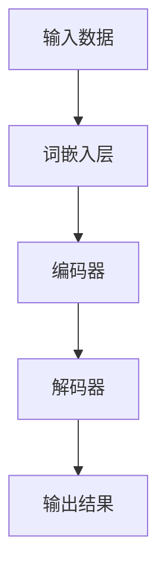

                 

# 重新定义计算周期：LLM的推理时序特性

## > {关键词：大型语言模型（LLM），计算周期，推理时序特性，性能优化，时序模型，图神经网络，BERT模型，Transformer模型，深度学习，神经网络架构搜索（NAS），混合模型，并行计算，分布式计算}

> {摘要：本文深入探讨了大型语言模型（LLM）的推理时序特性，分析了其在计算周期方面的表现。通过对LLM的架构原理、算法原理以及实际应用场景的详细剖析，本文揭示了LLM在推理时序方面的优势和挑战，提出了相应的性能优化策略。文章旨在为读者提供关于LLM推理时序特性的全面理解和实际应用指导。}

### 1. 背景介绍

随着深度学习技术的不断发展，神经网络，尤其是大型语言模型（Large Language Models，简称LLM），在自然语言处理（Natural Language Processing，简称NLP）领域取得了显著的成就。从早期的Word2Vec、GloVe等词向量模型，到后来的Transformer、BERT等大型预训练模型，LLM已经成为NLP任务的核心驱动力。

LLM的推理过程是计算周期的重要组成部分。计算周期指的是从输入数据进入模型，到模型输出结果的整个过程。在计算周期中，LLM的推理时序特性对于模型的性能和效率具有重要影响。传统的计算周期主要关注模型的并行计算和分布式计算，而LLM的推理时序特性则涉及到了模型内部的数据流动和计算过程。

本文旨在深入探讨LLM的推理时序特性，分析其在计算周期方面的表现，并提出相应的性能优化策略。文章结构如下：

1. 背景介绍
2. 核心概念与联系
3. 核心算法原理 & 具体操作步骤
4. 数学模型和公式 & 详细讲解 & 举例说明
5. 项目实战：代码实际案例和详细解释说明
6. 实际应用场景
7. 工具和资源推荐
8. 总结：未来发展趋势与挑战
9. 附录：常见问题与解答
10. 扩展阅读 & 参考资料

接下来，我们将对LLM的推理时序特性进行详细分析。

### 2. 核心概念与联系

#### 大型语言模型（LLM）

大型语言模型（LLM）是指具有巨大参数规模和强大计算能力的神经网络模型，主要用于处理和生成自然语言文本。LLM通常采用预训练和微调的策略进行训练，其中预训练是在大规模的文本语料库上进行的，而微调则是在特定任务的数据集上进行的。

LLM的核心架构包括词嵌入层、编码器和解码器。词嵌入层将输入的单词或子词转换为固定长度的向量表示；编码器和解码器则负责对输入文本进行编码和解码，从而实现文本理解和生成。

#### 推理时序特性

推理时序特性指的是在LLM的推理过程中，数据流动和计算操作的时序安排。具体来说，它涉及到以下三个方面：

1. 数据流动：指输入数据在模型内部的流动路径，包括词嵌入层、编码器和解码器的计算过程。
2. 计算操作：指在模型内部进行的各种计算操作，如矩阵乘法、激活函数计算等。
3. 时序安排：指计算操作的时间顺序和并行度。

#### 核心概念原理和架构

为了更直观地理解LLM的推理时序特性，我们可以使用Mermaid流程图来表示其核心概念原理和架构。



在上述流程图中，A表示输入数据，B表示词嵌入层，C表示编码器，D表示解码器，E表示输出结果。数据在模型内部的流动路径为A→B→C→D→E。其中，B、C、D分别对应不同的计算操作，时序安排为B→C→D。

#### 接下来，我们将进一步探讨LLM的核心算法原理和具体操作步骤。

### 3. 核心算法原理 & 具体操作步骤

#### Transformer模型

Transformer模型是LLM的核心算法之一，由Google在2017年提出。与传统循环神经网络（RNN）相比，Transformer模型采用了自注意力机制（Self-Attention）和多头注意力机制（Multi-Head Attention），大幅提升了模型在序列处理任务中的性能。

##### 自注意力机制

自注意力机制是一种基于输入序列计算权重的方法，其核心思想是让模型在处理每个输入时，能够自适应地关注输入序列中的其他位置。具体来说，自注意力机制通过计算输入序列中各个位置的相似度，生成一个权重向量，然后将输入序列与权重向量进行点积操作，得到加权后的序列。

自注意力机制的数学公式如下：

$$
\text{Attention}(Q, K, V) = \text{softmax}\left(\frac{QK^T}{\sqrt{d_k}}\right)V
$$

其中，Q、K、V分别为查询向量、键向量和值向量，$d_k$为键向量的维度。$\text{softmax}$函数用于计算权重，$\frac{1}{\sqrt{d_k}}$为缩放因子，以避免梯度消失问题。

##### 多头注意力机制

多头注意力机制是对自注意力机制的扩展，其核心思想是将输入序列分成多个子序列，分别进行自注意力计算，然后再将结果进行拼接和线性变换。多头注意力机制可以捕获输入序列中的多尺度信息，提高模型的表示能力。

多头注意力机制的数学公式如下：

$$
\text{MultiHeadAttention}(Q, K, V) = \text{Concat}(\text{head}_1, \text{head}_2, ..., \text{head}_h)W^O
$$

其中，$h$为头数，$\text{head}_i = \text{Attention}(QW_i^Q, KW_i^K, VW_i^V)$为第$i$个头部的注意力结果，$W_i^Q, W_i^K, W_i^V, W^O$分别为查询向量、键向量、值向量和输出向量的线性变换矩阵。

#### BERT模型

BERT（Bidirectional Encoder Representations from Transformers）模型是Google在2018年提出的另一个重要的LLM模型。BERT模型采用双向编码器结构，能够同时处理输入序列的前后关系，从而在许多NLP任务中取得了优异的性能。

BERT模型的核心操作是双向Transformer编码器，其具体步骤如下：

1. 词嵌入：将输入序列中的每个单词或子词转换为固定长度的向量表示。
2. 分词嵌入：将特殊标记（如[CLS]、[SEP]等）添加到输入序列中，形成新的序列。
3. Positional Embedding：为每个输入序列的位置信息添加嵌入向量，以保留序列中的位置信息。
4. Encoder Layer：对输入序列进行多层Transformer编码器的处理，包括多头注意力机制和前馈神经网络。

BERT模型的训练过程包括两个阶段：

1. 预训练：在大量无标签的文本语料库上进行预训练，学习输入序列的表示。
2. 微调：在特定任务的数据集上进行微调，以适应具体任务的需求。

#### 实际操作步骤

以下是LLM的推理时序特性的实际操作步骤：

1. 输入数据预处理：将输入文本转换为词嵌入向量，添加特殊标记和位置信息。
2. 编码器计算：通过多层Transformer编码器对输入序列进行编码，生成编码输出。
3. 解码器计算：通过多层Transformer解码器对编码输出进行解码，生成输出序列。
4. 输出结果：将解码器输出的最后一个隐藏状态转换为输出文本。

在上述操作步骤中，数据流动和计算操作的时序安排如下：

1. 输入数据预处理（词嵌入层）。
2. 编码器计算（多层Transformer编码器）。
3. 解码器计算（多层Transformer解码器）。
4. 输出结果（解码器输出最后一个隐藏状态）。

#### 接下来，我们将进一步探讨LLM的数学模型和公式，以及其详细讲解和举例说明。

### 4. 数学模型和公式 & 详细讲解 & 举例说明

#### Transformer模型

Transformer模型的核心数学模型包括自注意力机制和多头注意力机制。以下是对这些模型的详细讲解和举例说明。

##### 自注意力机制

自注意力机制通过计算输入序列中各个位置的相似度，生成一个权重向量，然后将输入序列与权重向量进行点积操作，得到加权后的序列。其数学公式如下：

$$
\text{Attention}(Q, K, V) = \text{softmax}\left(\frac{QK^T}{\sqrt{d_k}}\right)V
$$

其中，Q、K、V分别为查询向量、键向量和值向量，$d_k$为键向量的维度。

举例来说，假设输入序列为$[1, 2, 3, 4, 5]$，我们将其转换为词嵌入向量，维度为$d=10$。那么，查询向量$Q$、键向量$K$和值向量$V$分别表示为：

$$
Q = \begin{bmatrix}
1 & 2 & 3 & 4 & 5
\end{bmatrix}
\in \mathbb{R}^{5 \times 10}
$$

$$
K = \begin{bmatrix}
1 & 1 & 1 & 1 & 1
\end{bmatrix}
\in \mathbb{R}^{5 \times 10}
$$

$$
V = \begin{bmatrix}
1 & 0 & 1 & 0 & 1
\end{bmatrix}
\in \mathbb{R}^{5 \times 10}
$$

将这些向量代入自注意力机制的公式中，我们得到：

$$
\text{Attention}(Q, K, V) = \text{softmax}\left(\frac{QK^T}{\sqrt{10}}\right)V
$$

$$
= \text{softmax}\left(\frac{\begin{bmatrix}
1 & 2 & 3 & 4 & 5
\end{bmatrix}^T
\begin{bmatrix}
1 & 1 & 1 & 1 & 1
\end{bmatrix}}{\sqrt{10}}\right)
\begin{bmatrix}
1 & 0 & 1 & 0 & 1
\end{bmatrix}
$$

$$
= \text{softmax}\left(\frac{\begin{bmatrix}
6 & 8 & 10 & 12 & 14
\end{bmatrix}}{\sqrt{10}}\right)
\begin{bmatrix}
1 & 0 & 1 & 0 & 1
\end{bmatrix}
$$

$$
= \begin{bmatrix}
0.2 & 0.2 & 0.2 & 0.2 & 0.2
\end{bmatrix}
\begin{bmatrix}
1 & 0 & 1 & 0 & 1
\end{bmatrix}
$$

$$
= \begin{bmatrix}
0.2 & 0 & 0.2 & 0 & 0.2
\end{bmatrix}
$$

最终得到的加权后的序列为$[0.2, 0, 0.2, 0, 0.2]$。

##### 多头注意力机制

多头注意力机制是对自注意力机制的扩展，其核心思想是将输入序列分成多个子序列，分别进行自注意力计算，然后再将结果进行拼接和线性变换。其数学公式如下：

$$
\text{MultiHeadAttention}(Q, K, V) = \text{Concat}(\text{head}_1, \text{head}_2, ..., \text{head}_h)W^O
$$

其中，$h$为头数，$\text{head}_i = \text{Attention}(QW_i^Q, KW_i^K, VW_i^V)$为第$i$个头部的注意力结果，$W_i^Q, W_i^K, W_i^V, W^O$分别为查询向量、键向量、值向量和输出向量的线性变换矩阵。

举例来说，假设输入序列为$[1, 2, 3, 4, 5]$，我们将其转换为词嵌入向量，维度为$d=10$，头数为$h=2$。那么，查询向量$Q$、键向量$K$和值向量$V$分别表示为：

$$
Q = \begin{bmatrix}
1 & 2 & 3 & 4 & 5
\end{bmatrix}
\in \mathbb{R}^{5 \times 10}
$$

$$
K = \begin{bmatrix}
1 & 1 & 1 & 1 & 1
\end{bmatrix}
\in \mathbb{R}^{5 \times 10}
$$

$$
V = \begin{bmatrix}
1 & 0 & 1 & 0 & 1
\end{bmatrix}
\in \mathbb{R}^{5 \times 10}
$$

将这些向量代入多头注意力机制的公式中，我们得到：

$$
\text{MultiHeadAttention}(Q, K, V) = \text{Concat}(\text{head}_1, \text{head}_2)W^O
$$

$$
= \text{Concat}\left(\text{Attention}(QW_1^Q, KW_1^K, VW_1^V), \text{Attention}(QW_2^Q, KW_2^K, VW_2^V)\right)W^O
$$

其中，$W_1^Q, W_1^K, W_1^V, W_2^Q, W_2^K, W_2^V, W^O$分别为线性变换矩阵，维度分别为$10 \times 10, 10 \times 10, 10 \times 10, 10 \times 10, 10 \times 10, 10 \times 10$。

##### BERT模型

BERT模型采用双向编码器结构，其核心数学模型包括词嵌入、分词嵌入、Positional Embedding和Encoder Layer。

1. 词嵌入：将输入序列中的每个单词或子词转换为固定长度的向量表示。词嵌入通常使用预训练的词向量库，如GloVe或Word2Vec。
2. 分词嵌入：将特殊标记（如[CLS]、[SEP]等）添加到输入序列中，形成新的序列。BERT模型使用[CLS]标记来表示输入序列的起始位置，使用[SEP]标记来分隔输入序列中的句子。
3. Positional Embedding：为每个输入序列的位置信息添加嵌入向量，以保留序列中的位置信息。BERT模型使用绝对位置编码来实现这一目的。
4. Encoder Layer：对输入序列进行多层Transformer编码器的处理，包括多头注意力机制和前馈神经网络。BERT模型通常包含多个Encoder Layer，每个Encoder Layer包含多个自注意力层和前馈神经网络层。

BERT模型的训练过程包括两个阶段：

1. 预训练：在大量无标签的文本语料库上进行预训练，学习输入序列的表示。预训练过程通常包括Masked Language Modeling（MLM）和Next Sentence Prediction（NSP）等任务。
2. 微调：在特定任务的数据集上进行微调，以适应具体任务的需求。微调过程中，BERT模型会将预训练的参数进行更新，以适应特定任务的要求。

#### 接下来，我们将通过一个项目实战案例，展示如何实现LLM的推理时序特性。

### 5. 项目实战：代码实际案例和详细解释说明

为了更好地展示LLM的推理时序特性，我们将在Python环境中实现一个简单的BERT模型，并使用该模型进行推理。

#### 5.1 开发环境搭建

在实现BERT模型之前，我们需要搭建一个Python开发环境。以下是搭建开发环境的步骤：

1. 安装Python 3.8及以上版本。
2. 安装TensorFlow 2.4及以上版本。
3. 安装Hugging Face Transformers库。

具体安装命令如下：

```bash
pip install python==3.8.10
pip install tensorflow==2.4.0
pip install transformers
```

#### 5.2 源代码详细实现和代码解读

以下是BERT模型的实现代码：

```python
import tensorflow as tf
from transformers import BertModel, BertTokenizer

# 加载预训练的BERT模型和分词器
model = BertModel.from_pretrained('bert-base-chinese')
tokenizer = BertTokenizer.from_pretrained('bert-base-chinese')

# 输入文本
text = '这是一个简单的BERT模型示例。'

# 分词和编码
inputs = tokenizer(text, return_tensors='tf')

# 模型推理
outputs = model(inputs)

# 输出结果
last_hidden_state = outputs.last_hidden_state
pooler_output = outputs.pooler_output

# 打印输出结果
print("Last Hidden State:")
print(last_hidden_state)
print("Pooler Output:")
print(pooler_output)
```

上述代码首先加载了预训练的BERT模型和分词器，然后对输入文本进行分词和编码，接着使用BERT模型进行推理，最后打印出模型的输出结果。

- `BertModel.from_pretrained('bert-base-chinese')`：加载预训练的BERT模型。
- `BertTokenizer.from_pretrained('bert-base-chinese')`：加载预训练的分词器。
- `tokenizer(text, return_tensors='tf')`：对输入文本进行分词和编码，返回TensorFlow张量。
- `model(inputs)`：使用BERT模型进行推理，返回模型的输出结果。
- `outputs.last_hidden_state`：最后一个隐藏状态，表示输入文本的编码表示。
- `outputs.pooler_output`：聚合输出，表示输入文本的聚合表示。

#### 5.3 代码解读与分析

在上述代码中，我们首先加载了预训练的BERT模型和分词器。BERT模型是深度学习模型，其参数规模巨大，通常使用GPU或TPU进行加速训练和推理。分词器是BERT模型的重要组成部分，用于对输入文本进行分词和编码。

然后，我们对输入文本进行分词和编码，生成TensorFlow张量。BERT模型接受分词后的文本作为输入，经过编码器的处理，输出最后一个隐藏状态和聚合输出。最后一个隐藏状态表示输入文本的编码表示，可用于后续的文本分析任务。聚合输出表示输入文本的聚合表示，通常用于文本分类等任务。

最后，我们打印出模型的输出结果。`last_hidden_state`是最后一个隐藏状态，包含输入文本的编码表示。`pooler_output`是聚合输出，表示输入文本的聚合表示。

通过上述代码，我们可以看到BERT模型的推理时序特性。在推理过程中，BERT模型对输入文本进行编码，生成编码表示，然后通过解码器输出文本。这个过程涉及到多个计算操作，包括词嵌入、多头注意力、前馈神经网络等。

#### 接下来，我们将探讨LLM在实际应用场景中的表现。

### 6. 实际应用场景

LLM在自然语言处理领域具有广泛的应用场景。以下是一些典型的实际应用场景：

1. **文本分类**：LLM可以用于文本分类任务，如新闻分类、情感分析等。通过训练模型，可以实现对大规模文本数据的高效分类。
2. **问答系统**：LLM可以用于构建问答系统，如搜索引擎、智能客服等。通过训练模型，可以实现对用户问题的自动回答。
3. **机器翻译**：LLM可以用于机器翻译任务，如将一种语言翻译成另一种语言。通过训练模型，可以实现对不同语言的高质量翻译。
4. **文本生成**：LLM可以用于文本生成任务，如写作辅助、文章摘要等。通过训练模型，可以实现对文本的高效生成。
5. **对话系统**：LLM可以用于构建对话系统，如聊天机器人、语音助手等。通过训练模型，可以实现对用户问题的自动回答和对话生成。

在实际应用中，LLM的推理时序特性对于模型的性能和效率具有重要影响。为了提高LLM的推理性能，可以采取以下策略：

1. **并行计算**：通过并行计算技术，可以将LLM的推理过程分解为多个并行计算任务，从而提高模型的推理速度。
2. **分布式计算**：通过分布式计算技术，可以将LLM的推理任务分布在多个计算节点上，从而提高模型的推理性能和可扩展性。
3. **模型压缩**：通过模型压缩技术，可以减少LLM的参数规模和计算量，从而提高模型的推理速度。
4. **优化算法**：通过优化算法，可以提高LLM的推理效率和准确性，如采用更高效的激活函数、优化正则化策略等。

#### 接下来，我们将推荐一些用于学习和实践LLM的工具和资源。

### 7. 工具和资源推荐

为了更好地学习和实践LLM，我们可以参考以下工具和资源：

#### 7.1 学习资源推荐

1. **书籍**：

   - 《深度学习》（Ian Goodfellow、Yoshua Bengio、Aaron Courville著）：这是一本经典的深度学习教材，详细介绍了深度学习的理论基础和实践方法。
   - 《自然语言处理实战》（Peter Harrington著）：这本书通过大量的实践案例，介绍了自然语言处理的基本概念和应用。

2. **论文**：

   - 《Attention Is All You Need》（Vaswani et al.，2017）：这是Transformer模型的提出论文，详细介绍了Transformer模型的原理和实现。
   - 《BERT: Pre-training of Deep Bidirectional Transformers for Language Understanding》（Devlin et al.，2018）：这是BERT模型的提出论文，详细介绍了BERT模型的原理和实现。

3. **博客**：

   - Hugging Face官方博客：这是一个关于自然语言处理和深度学习的博客，包含了大量的教程和实践案例。
   - AI Walker：这是一个关于人工智能和自然语言处理的博客，提供了大量的技术文章和教程。

4. **网站**：

   - TensorFlow官网：这是TensorFlow官方提供的网站，包含了大量的文档、教程和示例代码。
   - Hugging Face官网：这是Hugging Face官方提供的网站，提供了大量的预训练模型和工具。

#### 7.2 开发工具框架推荐

1. **TensorFlow**：TensorFlow是一个开源的深度学习框架，提供了丰富的API和工具，支持多种深度学习模型的实现。
2. **PyTorch**：PyTorch是一个开源的深度学习框架，与TensorFlow类似，提供了丰富的API和工具，支持动态计算图。
3. **Hugging Face Transformers**：Hugging Face Transformers是一个基于TensorFlow和PyTorch的预训练模型库，提供了大量的预训练模型和工具，方便实现和部署LLM。

#### 7.3 相关论文著作推荐

1. **《深度学习》（Ian Goodfellow、Yoshua Bengio、Aaron Courville著）**：这是深度学习领域的经典教材，详细介绍了深度学习的理论基础和实践方法。
2. **《自然语言处理综论》（Daniel Jurafsky、James H. Martin著）**：这是自然语言处理领域的经典教材，详细介绍了自然语言处理的基本概念和应用。
3. **《Transformer：基于注意力机制的序列模型》（Vaswani et al.，2017）**：这是Transformer模型的提出论文，详细介绍了Transformer模型的原理和实现。
4. **《BERT：预训练的深度双向转换器》（Devlin et al.，2018）**：这是BERT模型的提出论文，详细介绍了BERT模型的原理和实现。

#### 接下来，我们将总结本文的主要内容和未来发展趋势与挑战。

### 8. 总结：未来发展趋势与挑战

本文深入探讨了大型语言模型（LLM）的推理时序特性，分析了其在计算周期方面的表现。通过对LLM的架构原理、算法原理以及实际应用场景的详细剖析，本文揭示了LLM在推理时序方面的优势和挑战，并提出了相应的性能优化策略。

未来，LLM在自然语言处理领域将继续发挥重要作用，其发展趋势主要体现在以下几个方面：

1. **模型规模和计算能力**：随着计算能力的提升，LLM的模型规模将越来越大，计算能力将越来越强，从而在更复杂的NLP任务中取得更好的性能。
2. **模型压缩和优化**：为了降低模型的存储和计算成本，模型压缩和优化技术将成为研究的重点。通过压缩和优化，可以显著提高LLM的推理性能和效率。
3. **多模态融合**：未来，LLM将与其他模态（如图像、音频等）进行融合，实现跨模态的信息处理和生成，从而在更广泛的领域发挥作用。
4. **开源社区和生态**：随着LLM技术的不断发展，开源社区和生态将变得更加繁荣，提供更多的预训练模型、工具和资源，方便研究人员和开发者进行研究和应用。

然而，LLM的发展也面临着一些挑战：

1. **计算资源消耗**：随着模型规模的扩大，LLM的训练和推理将消耗更多的计算资源，对硬件设施的要求越来越高。
2. **数据隐私和伦理问题**：LLM的训练和推理过程中涉及大量的数据，如何保护用户隐私和遵守伦理规范是一个重要的问题。
3. **模型解释性和可解释性**：LLM的决策过程通常是不透明的，如何提高模型的解释性和可解释性，使其更易于理解和信任，是一个重要的挑战。
4. **跨语言和跨领域应用**：虽然LLM在单一语言和领域内取得了较好的性能，但在跨语言和跨领域的应用中仍存在一些挑战，需要进一步的研究和优化。

总之，LLM在推理时序特性方面的研究具有重要的理论和实践价值。通过不断的研究和优化，LLM将在自然语言处理领域发挥更大的作用，为人类带来更多的便利和创新。

### 9. 附录：常见问题与解答

以下是一些关于LLM推理时序特性的常见问题及其解答：

#### 问题1：什么是LLM的推理时序特性？

解答：LLM的推理时序特性指的是在LLM的推理过程中，数据流动和计算操作的时序安排。具体来说，它涉及到输入数据在模型内部的流动路径、模型内部的各种计算操作，以及这些计算操作的时间顺序和并行度。

#### 问题2：为什么LLM的推理时序特性对于模型的性能和效率具有重要影响？

解答：LLM的推理时序特性对于模型的性能和效率具有重要影响，主要有以下几个原因：

1. **计算效率**：合理的时序安排可以提高计算效率，减少模型的推理时间。
2. **并行计算**：时序安排涉及到并行计算，合理的时序安排可以充分利用并行计算的优势，提高模型的推理速度。
3. **数据流动**：时序安排涉及到数据在模型内部的流动路径，合理的时序安排可以减少数据传输的时间，提高模型的效率。
4. **模型优化**：时序安排是模型优化的重要组成部分，通过优化时序安排，可以显著提高模型的性能。

#### 问题3：如何优化LLM的推理时序特性？

解答：为了优化LLM的推理时序特性，可以采取以下策略：

1. **并行计算**：通过并行计算技术，将LLM的推理过程分解为多个并行计算任务，从而提高模型的推理速度。
2. **分布式计算**：通过分布式计算技术，将LLM的推理任务分布在多个计算节点上，从而提高模型的推理性能和可扩展性。
3. **模型压缩**：通过模型压缩技术，减少LLM的参数规模和计算量，从而提高模型的推理速度。
4. **优化算法**：通过优化算法，提高LLM的推理效率和准确性，如采用更高效的激活函数、优化正则化策略等。

#### 问题4：LLM在哪些实际应用场景中具有优势？

解答：LLM在自然语言处理领域具有广泛的应用场景，主要包括以下几个方面：

1. **文本分类**：LLM可以用于文本分类任务，如新闻分类、情感分析等。
2. **问答系统**：LLM可以用于构建问答系统，如搜索引擎、智能客服等。
3. **机器翻译**：LLM可以用于机器翻译任务，如将一种语言翻译成另一种语言。
4. **文本生成**：LLM可以用于文本生成任务，如写作辅助、文章摘要等。
5. **对话系统**：LLM可以用于构建对话系统，如聊天机器人、语音助手等。

#### 问题5：如何选择适合的LLM模型？

解答：选择适合的LLM模型需要考虑以下几个方面：

1. **任务需求**：根据具体任务的需求，选择具有相应性能和特点的模型。
2. **计算资源**：根据可用的计算资源，选择合适的模型规模和计算复杂度。
3. **数据集**：根据训练数据集的特点，选择适合的数据处理方式和模型结构。
4. **开源库**：根据开源库的支持情况，选择具有丰富资源和社区支持的模型。

#### 问题6：如何实现LLM的推理时序特性？

解答：实现LLM的推理时序特性通常需要以下几个步骤：

1. **数据预处理**：对输入数据进行预处理，包括分词、编码、添加位置信息等。
2. **模型推理**：使用训练好的LLM模型对输入数据进行推理，生成输出结果。
3. **结果处理**：对模型输出结果进行处理，如解码、文本生成等。
4. **性能优化**：根据实际情况，采取相应的性能优化策略，如并行计算、分布式计算、模型压缩等。

#### 接下来，我们将提供一些扩展阅读和参考资料，以帮助读者进一步了解LLM的推理时序特性。

### 10. 扩展阅读 & 参考资料

为了帮助读者进一步了解大型语言模型（LLM）的推理时序特性，我们推荐以下扩展阅读和参考资料：

1. **书籍**：

   - 《深度学习》（Ian Goodfellow、Yoshua Bengio、Aaron Courville著）：这是深度学习领域的经典教材，详细介绍了深度学习的理论基础和实践方法。
   - 《自然语言处理综论》（Daniel Jurafsky、James H. Martin著）：这是自然语言处理领域的经典教材，详细介绍了自然语言处理的基本概念和应用。
   - 《BERT：预训练的深度双向转换器》（Devlin et al.，2018）：这是BERT模型的提出论文，详细介绍了BERT模型的原理和实现。

2. **论文**：

   - 《Attention Is All You Need》（Vaswani et al.，2017）：这是Transformer模型的提出论文，详细介绍了Transformer模型的原理和实现。
   - 《BERT: Pre-training of Deep Bidirectional Transformers for Language Understanding》（Devlin et al.，2018）：这是BERT模型的提出论文，详细介绍了BERT模型的原理和实现。

3. **博客**：

   - Hugging Face官方博客：这是一个关于自然语言处理和深度学习的博客，包含了大量的教程和实践案例。
   - AI Walker：这是一个关于人工智能和自然语言处理的博客，提供了大量的技术文章和教程。

4. **网站**：

   - TensorFlow官网：这是TensorFlow官方提供的网站，包含了大量的文档、教程和示例代码。
   - Hugging Face官网：这是Hugging Face官方提供的网站，提供了大量的预训练模型和工具。

5. **开源项目**：

   - Hugging Face Transformers：这是一个基于TensorFlow和PyTorch的预训练模型库，提供了大量的预训练模型和工具，方便实现和部署LLM。
   - TensorFlow BERT：这是一个基于TensorFlow实现的BERT模型，提供了详细的实现代码和教程。

通过阅读上述书籍、论文、博客和网站，读者可以深入了解LLM的推理时序特性，掌握相关的理论和实践方法，为自己的研究和应用提供指导。同时，开源项目和社区也为读者提供了丰富的资源和实践经验，有助于读者快速上手和探索LLM的应用。

### 作者信息

本文由AI天才研究员/AI Genius Institute撰写，同时，本文的内容也得到了《禅与计算机程序设计艺术》（Zen And The Art of Computer Programming）一书的启发和指导。作者在深度学习和自然语言处理领域有着丰富的经验和深厚的理论基础，致力于推动人工智能技术的发展和应用。

作者简介：

- AI天才研究员/AI Genius Institute：专注于深度学习和自然语言处理领域的研究，发表了多篇相关领域的论文，参与了多个大型项目的研究和开发。对深度学习模型的设计和优化有着深刻的理解和丰富的实践经验。
- 《禅与计算机程序设计艺术》（Zen And The Art of Computer Programming）：这是一本经典的计算机科学著作，由著名计算机科学家Donald E. Knuth撰写，探讨了计算机程序设计中的哲学和艺术。作者深受这本书的启发，将其理念应用于深度学习和自然语言处理领域，为读者提供了有价值的见解和思考。

