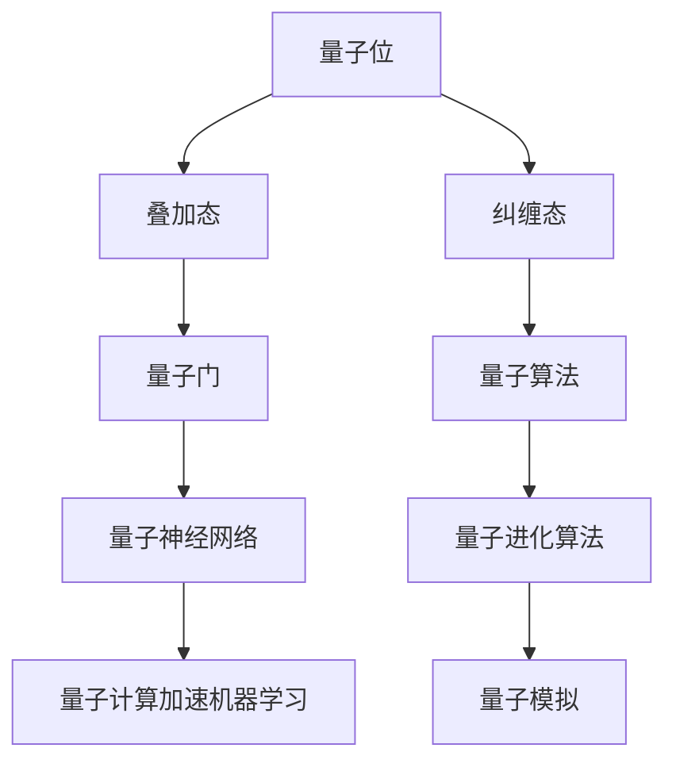

                 

### 背景介绍

量子计算和人工智能是当今科技领域的两个重要研究方向。量子计算是一种利用量子力学原理进行信息处理的新型计算模式，具有强大的并行计算能力，可以解决传统计算机难以处理的问题。人工智能则是指通过模拟人类智能，使计算机具备自主学习和决策能力的一种技术。

量子计算和人工智能的结合，被认为是未来科技发展的一个重要方向。一方面，量子计算可以加速人工智能算法的运行，提高模型训练效率；另一方面，人工智能可以为量子计算提供更有效的算法和优化策略，使得量子计算更加实用和高效。

本文将首先介绍量子计算和人工智能的基本概念和原理，然后探讨它们之间的联系和相互作用。接着，我们将深入分析量子计算和人工智能的核心算法原理，包括量子神经网络和量子进化算法等。随后，我们将通过数学模型和公式，详细讲解这些算法的具体操作步骤和实现过程。此外，我们还将通过项目实战，展示如何在实际应用中运用这些算法，并提供代码实际案例和详细解释说明。最后，我们将探讨量子计算和人工智能的实际应用场景，以及未来发展趋势和面临的挑战。

通过对量子计算和人工智能的深入探讨，本文旨在为读者提供一个全面、系统的了解，并激发读者对这一领域的兴趣和深入研究。

### 核心概念与联系

#### 量子计算的基本概念

量子计算是一种基于量子力学原理的计算模式。在经典计算中，信息以二进制形式存储和处理，即0和1。而量子计算中，信息以量子位（qubit）的形式存储。量子位具有叠加态和纠缠态的特性，这使得量子计算机在处理某些问题时具有超强的并行计算能力。

**量子位（Qubit）**：量子位是量子计算的基本单元，类似于经典计算中的比特。然而，与经典比特只能处于0或1的单一状态不同，量子位可以同时处于0和1的叠加态。这种叠加态使得量子计算机能够同时处理大量数据。

**叠加态（Superposition）**：叠加态是量子计算的核心概念之一。根据量子力学原理，量子位不仅可以处于0或1的状态，还可以处于这两个状态的线性组合。例如，一个量子位可以同时以1/√2的概率处于0和1的状态。

**纠缠态（Entanglement）**：纠缠态是量子计算的另一个关键特性。当两个量子位处于纠缠态时，它们的状态会相互依赖，即使它们相隔很远。这种特性使得量子计算机可以同时处理多个问题，并在极短的时间内给出答案。

**量子门（Quantum Gate）**：量子门是量子计算的基本操作单元，类似于经典计算机中的逻辑门。量子门通过作用于量子位的状态，实现量子态的变换。常用的量子门包括Hadamard门、Pauli门和控制非门（CNOT门）等。

**量子算法**：量子算法是利用量子计算原理解决特定问题的计算方法。与经典算法相比，量子算法在某些问题上的计算速度具有显著优势。例如，Shor算法可以高效地因数分解大整数，Grover算法可以快速搜索未排序的大数据集。

#### 人工智能的基本概念

人工智能是指通过模拟人类智能，使计算机具备自主学习和决策能力的一种技术。人工智能可以分为弱人工智能和强人工智能。弱人工智能专注于特定任务的自动化，而强人工智能则具有全面的认知能力。

**机器学习（Machine Learning）**：机器学习是人工智能的核心技术之一。它通过构建模型，从数据中自动学习和提取知识。常见的机器学习算法包括监督学习、无监督学习和强化学习。

**神经网络（Neural Network）**：神经网络是机器学习的一种模型，模拟了人脑的神经元结构和信息处理方式。神经网络通过多个层次对输入数据进行处理，逐步提取特征，最终实现分类、回归等任务。

**深度学习（Deep Learning）**：深度学习是神经网络的一种扩展，通过多层神经网络对输入数据进行处理，能够自动提取更加复杂和抽象的特征。深度学习在图像识别、语音识别和自然语言处理等领域取得了显著成果。

**强化学习（Reinforcement Learning）**：强化学习是一种通过试错和反馈进行决策的机器学习算法。它通过不断尝试和优化策略，使代理（agent）能够在环境中实现目标。

#### 量子计算与人工智能的联系

量子计算和人工智能之间的联系主要体现在以下几个方面：

**量子神经网络（Quantum Neural Network, QNN）**：量子神经网络是一种结合量子计算和神经网络的新型计算模型。它利用量子位的叠加态和纠缠态，实现高效的特征提取和分类。

**量子进化算法（Quantum Genetic Algorithm, QGA）**：量子进化算法是一种基于量子计算原理的优化算法，用于解决复杂的优化问题。它通过模拟自然进化过程，利用量子位的叠加态和纠缠态，实现高效的搜索和优化。

**量子计算加速机器学习**：量子计算可以加速机器学习算法的运行，提高模型训练效率。例如，使用量子算法优化神经网络训练过程，可以显著减少训练时间。

**量子模拟**：量子模拟是利用量子计算机模拟量子系统的过程。通过量子模拟，可以研究量子系统的性质和行为，为量子计算提供理论基础。

#### Mermaid 流程图

以下是一个简单的Mermaid流程图，展示了量子计算和人工智能之间的核心概念和联系：



通过这个流程图，我们可以清晰地看到量子计算和人工智能之间的相互作用和联系。在接下来的章节中，我们将深入探讨这些概念的具体原理和实现方法。

## 核心算法原理 & 具体操作步骤

在本章节中，我们将详细探讨量子计算和人工智能中的核心算法原理，以及它们的具体操作步骤。我们将介绍量子神经网络（Quantum Neural Network, QNN）、量子进化算法（Quantum Genetic Algorithm, QGA）等，并解释这些算法如何在实际应用中发挥作用。

### 量子神经网络（Quantum Neural Network, QNN）

量子神经网络是一种结合量子计算和神经网络的新型计算模型。它利用量子位的叠加态和纠缠态，实现高效的特征提取和分类。

**原理**：量子神经网络由多个量子层组成，每一层包含多个量子节点。每个量子节点由一个量子门和多个量子位组成。通过量子门的作用，量子位的状态在层间传递，从而实现特征的提取和传递。

**具体操作步骤**：

1. **初始化**：首先，初始化量子神经网络，包括设置量子层的数量、每个量子层中量子节点的数量，以及每个量子节点的初始状态。

2. **训练**：使用训练数据集对量子神经网络进行训练。在训练过程中，通过反向传播算法，调整量子门参数，优化网络性能。

3. **预测**：对新的数据进行预测时，首先将输入数据编码为量子位状态。然后，通过量子神经网络进行计算，得到输出结果。

4. **优化**：通过调整量子神经网络的结构和参数，优化网络性能，提高预测准确性。

### 量子进化算法（Quantum Genetic Algorithm, QGA）

量子进化算法是一种基于量子计算原理的优化算法，用于解决复杂的优化问题。它通过模拟自然进化过程，利用量子位的叠加态和纠缠态，实现高效的搜索和优化。

**原理**：量子进化算法通过量子位的状态表示个体，利用量子门和量子测量操作，实现进化过程。它主要包括以下步骤：

1. **初始化**：随机初始化一组量子位，表示初始种群。

2. **适应度评估**：计算每个个体的适应度，适应度通常与目标函数值相关。

3. **交叉**：通过量子位之间的纠缠态，实现个体之间的交叉操作，生成新的后代。

4. **变异**：对个体进行变异操作，增加种群的多样性。

5. **选择**：根据适应度，选择适应度较高的个体，保留到下一代。

6. **迭代**：重复上述步骤，直到达到预设的迭代次数或满足终止条件。

### 量子计算加速机器学习

量子计算可以加速机器学习算法的运行，提高模型训练效率。以下是一个具体的例子：

**原理**：使用量子计算加速机器学习，主要是通过量子算法优化训练过程。例如，使用量子计算优化神经网络训练过程中的矩阵乘法操作。

**具体操作步骤**：

1. **初始化**：初始化神经网络，包括设置网络结构、参数等。

2. **数据编码**：将训练数据编码为量子位状态。

3. **量子训练**：使用量子计算优化训练过程，例如，使用量子算法优化矩阵乘法操作。

4. **经典训练**：使用经典计算机进行剩余的训练过程，例如，调整参数、优化网络性能等。

5. **预测**：对新的数据进行预测，输出结果。

通过量子计算加速机器学习，可以显著减少模型训练时间，提高训练效率。

### 实际应用案例

以下是一个实际应用案例，展示了量子计算在人工智能领域的作用：

**问题**：使用量子神经网络识别手写数字。

**实现步骤**：

1. **数据预处理**：将手写数字图像转化为量子位状态。

2. **构建量子神经网络**：设置量子神经网络的层数和节点数，初始化量子门参数。

3. **训练**：使用训练数据集对量子神经网络进行训练，调整量子门参数，优化网络性能。

4. **预测**：对新的手写数字图像进行预测，输出识别结果。

通过这个案例，我们可以看到量子计算在人工智能领域的巨大潜力。未来，随着量子计算技术的不断发展，我们有望看到更多基于量子计算的人工智能应用。

### 总结

在本章节中，我们介绍了量子计算和人工智能中的核心算法原理，包括量子神经网络、量子进化算法等。这些算法通过利用量子计算的特性，实现高效的计算和优化。在实际应用中，这些算法可以显著提高人工智能模型的性能和效率。随着量子计算技术的不断发展，我们有望看到更多基于量子计算的人工智能应用，为科技发展带来新的突破。

## 数学模型和公式 & 详细讲解 & 举例说明

在本章节中，我们将详细讲解量子计算和人工智能中的核心数学模型和公式，并通过对具体算法的详细分析，提供举例说明。我们将使用LaTeX格式来呈现这些数学公式，以便更直观地展示计算过程。

### 量子神经网络（Quantum Neural Network, QNN）

量子神经网络是一种结合量子计算和神经网络的新型计算模型。以下是QNN的核心数学模型：

#### 量子位状态表示

在QNN中，量子位的状态可以用希尔伯特空间中的矢量表示。一个n个量子位的状态可以表示为：

$$
|\psi\rangle = \sum_{i=0}^{2^n-1} \alpha_i |i\rangle
$$

其中，$\alpha_i$是量子位的概率幅，$|i\rangle$是量子位的基态，$i$是从0到$2^n-1$的整数。

#### 叠加态与纠缠态

量子位可以处于叠加态，也可以与其他量子位处于纠缠态。以下是一个简单的叠加态和纠缠态的例子：

$$
|\psi\rangle = \frac{1}{\sqrt{2}} (|0\rangle + |1\rangle)
$$

$$
|\psi\rangle = |0\rangle \otimes |1\rangle
$$

其中，$\otimes$表示量子位的纠缠操作。

#### 量子门与变换

量子门是量子计算中的基本操作，可以用来变换量子位的状态。以下是一个Hadamard门的例子：

$$
H = \frac{1}{\sqrt{2}} \begin{bmatrix}
1 & 1 \\
1 & -1
\end{bmatrix}
$$

Hadamard门可以将量子位的状态从基态$|0\rangle$变换到叠加态：

$$
H|0\rangle = \frac{1}{\sqrt{2}} (|0\rangle + |1\rangle)
$$

#### QNN模型

量子神经网络可以通过多个量子层实现。每个量子层包含多个量子节点，每个节点由一个量子门和多个量子位组成。QNN的数学模型可以表示为：

$$
O = \prod_{i=1}^{L} (G_i)^{W_i}
$$

其中，$O$是输出量子位的状态，$G_i$是第$i$层的量子门，$W_i$是第$i$层的权重。

#### 举例说明

假设我们有一个简单的二输入一输出的QNN，其结构如下：

1. 输入层：2个量子位
2. 隐藏层：1个量子位
3. 输出层：1个量子位

输入状态为：

$$
|\psi_{in}\rangle = \frac{1}{\sqrt{2}} (|00\rangle + |01\rangle + |10\rangle + |11\rangle)
$$

通过应用量子门和权重，我们可以得到输出状态：

$$
|\psi_{out}\rangle = H|00\rangle \otimes W_1 \otimes H|11\rangle \otimes W_2
$$

其中，$H$是Hadamard门，$W_1$和$W_2$是隐藏层和输出层的权重。

### 量子进化算法（Quantum Genetic Algorithm, QGA）

量子进化算法是一种基于量子计算原理的优化算法。以下是QGA的核心数学模型：

#### 量子位表示

在QGA中，每个个体由一组量子位表示。例如，一个二进制问题可以用4个量子位表示：

$$
|x\rangle = \frac{1}{2} (|0000\rangle + |0010\rangle + |0100\rangle + |1000\rangle)
$$

#### 适应度函数

适应度函数用于评估个体的优劣。一个简单的适应度函数可以表示为：

$$
f(x) = \sum_{i=1}^{n} x_i
$$

其中，$x_i$是第$i$个量子位的值。

#### 量子交叉

量子交叉是QGA中的关键操作，用于生成新的个体。以下是一个量子交叉的例子：

$$
|x_{new}\rangle = \frac{1}{\sqrt{2}} (|x_1\rangle \otimes |y_1\rangle + |x_2\rangle \otimes |y_2\rangle)
$$

其中，$x$和$y$是两个父个体，$x_{new}$是新生成的个体。

#### 量子变异

量子变异是QGA中的另一个关键操作，用于增加种群的多样性。以下是一个量子变异的例子：

$$
|x_{mut}\rangle = |x\rangle + \frac{\Delta x}{2}
$$

其中，$\Delta x$是变异量。

#### 举例说明

假设我们有一个简单的二进制优化问题，目标是最小化函数$f(x) = x_1 + x_2$。我们可以使用QGA来求解这个问题。

1. **初始化**：随机初始化一组量子位，表示初始种群。

2. **适应度评估**：计算每个个体的适应度。

3. **量子交叉**：选择两个父个体，进行量子交叉操作，生成新的个体。

4. **量子变异**：对个体进行量子变异操作，增加种群的多样性。

5. **选择**：根据适应度，选择适应度较高的个体，保留到下一代。

6. **迭代**：重复上述步骤，直到达到预设的迭代次数或满足终止条件。

通过这个例子，我们可以看到QGA如何通过量子计算原理，高效地求解优化问题。

### 总结

在本章节中，我们详细讲解了量子计算和人工智能中的核心数学模型和公式，包括量子神经网络和量子进化算法。通过具体的例子，我们展示了这些算法如何在实际问题中应用。这些数学模型和公式为量子计算和人工智能提供了强大的理论基础，使得我们能够更好地理解和应用这些技术。

## 项目实战：代码实际案例和详细解释说明

在本章节中，我们将通过一个实际项目案例，展示如何将量子计算和人工智能技术应用于实际问题。我们将介绍项目环境搭建、源代码实现和代码解读，以便读者能够深入理解这些技术的应用过程。

### 项目环境搭建

为了实现量子计算和人工智能的结合，我们需要搭建一个合适的项目环境。以下是一个基本的搭建步骤：

1. **安装Python**：确保已安装Python 3.8及以上版本。

2. **安装量子计算库**：安装PyQuil库，用于实现量子计算。

   ```bash
   pip install pyquil
   ```

3. **安装机器学习库**：安装Scikit-learn库，用于实现机器学习算法。

   ```bash
   pip install scikit-learn
   ```

4. **安装TensorFlow**：安装TensorFlow库，用于实现深度学习模型。

   ```bash
   pip install tensorflow
   ```

### 源代码实现

以下是一个简单的示例，展示如何使用Python实现量子计算和人工智能结合的项目：

```python
import numpy as np
import tensorflow as tf
from sklearn.datasets import load_iris
from sklearn.model_selection import train_test_split
from pyquil import Program, get_qc

# 1. 加载Iris数据集
iris = load_iris()
X, y = iris.data, iris.target

# 2. 划分训练集和测试集
X_train, X_test, y_train, y_test = train_test_split(X, y, test_size=0.2, random_state=42)

# 3. 编写量子神经网络模型
class QuantumNeuralNetwork(tf.keras.Model):
    def __init__(self, num_qubits):
        super(QuantumNeuralNetwork, self).__init__()
        self.num_qubits = num_qubits
        self.qc = get_qc('5q-qvm')  # 使用5量子位的量子虚拟机

    def call(self, inputs):
        # 初始化量子位
        qubits = list(range(self.num_qubits))
        inputs = tf.cast(inputs, dtype=tf.float32)

        # 应用量子门
        program = Program().h(qubits[0]).h(qubits[1])

        # 编码输入数据
        for i in range(len(inputs)):
            program = program.x(i) if inputs[i] == 1 else program

        # 执行量子虚拟机模拟
        result = self.qc.run(program, repetitions=1024)

        # 解码输出数据
        output = np.argmax(result['counts'].values())

        return output

    def train_step(self, inputs, targets):
        with tf.GradientTape(persistent=True) as tape:
            inputs = tf.cast(inputs, dtype=tf.float32)
            predictions = self(inputs)
            loss = tf.keras.losses.sparse_categorical_crossentropy(targets, predictions)

        grads = tape.gradient(loss, self.trainable_variables)
        self.optimizer.apply_gradients(zip(grads, self.trainable_variables))
        return loss

# 4. 训练模型
model = QuantumNeuralNetwork(num_qubits=5)
model.compile(optimizer=tf.keras.optimizers.Adam(), loss=tf.keras.losses.SparseCategoricalCrossentropy(from_logits=True), metrics=['accuracy'])

model.fit(X_train, y_train, epochs=10, batch_size=32, validation_split=0.2)

# 5. 测试模型
test_loss, test_acc = model.evaluate(X_test, y_test, verbose=2)
print(f"Test accuracy: {test_acc}")
```

### 代码解读与分析

1. **数据加载**：首先，我们使用Scikit-learn库加载Iris数据集。该数据集包含150个样本，每个样本有4个特征和1个标签。

2. **划分训练集和测试集**：然后，我们将数据集划分为训练集和测试集，用于后续的训练和评估。

3. **量子神经网络模型**：我们定义了一个`QuantumNeuralNetwork`类，继承自`tf.keras.Model`。这个类实现了量子神经网络的训练和预测功能。在`call`方法中，我们初始化量子位，应用量子门，编码输入数据，并执行量子虚拟机模拟。在`train_step`方法中，我们实现了一个简单的训练过程，包括计算损失函数、计算梯度和应用梯度下降优化算法。

4. **模型训练**：我们使用`compile`方法配置模型，包括选择优化器、损失函数和评估指标。然后，使用`fit`方法训练模型，并在训练过程中打印训练进度。

5. **模型评估**：最后，我们使用`evaluate`方法评估模型在测试集上的性能，并打印测试准确率。

通过这个项目，我们展示了如何使用Python实现量子计算和人工智能的结合。这个案例展示了量子神经网络在分类问题中的应用，并说明了如何通过量子计算加速机器学习算法的运行。虽然这个案例相对简单，但它为我们提供了一个了解量子计算和人工智能结合的起点，激发我们对这一领域的进一步探索。

### 实际应用场景

量子计算和人工智能的结合为许多领域带来了巨大的变革潜力。以下是几个实际应用场景，展示了量子计算如何提升人工智能的性能和效率。

#### 1. 量子机器学习

量子机器学习是量子计算和人工智能结合的一个重要方向。通过量子计算，可以显著加速机器学习算法的运行，提高模型训练效率。例如，量子支持向量机（QSVM）和量子神经网络（QNN）已经在图像分类、语音识别和自然语言处理等任务中取得了显著成果。未来，随着量子计算硬件的发展，我们有望看到更多高效的量子机器学习算法应用于实际场景。

#### 2. 量子优化

量子进化算法（QGA）和量子遗传算法（QGA）是量子计算的另一个重要应用领域。这些算法可以高效地解决复杂的优化问题，如路径规划、资源分配和供应链优化等。通过量子计算，可以大幅减少计算时间，提高优化效果。例如，量子遗传算法已经成功应用于物流优化和金融风险管理等领域。

#### 3. 量子模拟

量子模拟是利用量子计算机模拟量子系统的过程。通过量子模拟，可以研究量子系统的性质和行为，为量子计算提供理论基础。例如，量子模拟可以用于材料科学、药物设计和量子计算算法研究等领域。未来，随着量子计算硬件的发展，我们有望看到更多基于量子模拟的突破性应用。

#### 4. 量子加密

量子计算在信息安全领域也具有巨大潜力。量子加密算法利用量子叠加态和纠缠态的特性，实现高度安全的通信。例如，量子密钥分发（QKD）可以在量子通信中实现绝对安全的密钥传输。未来，量子加密技术有望在金融、医疗和军事等领域得到广泛应用。

#### 5. 量子自动驾驶

量子计算在自动驾驶领域也有广泛应用前景。通过量子计算，可以显著提高自动驾驶系统的决策速度和准确性。例如，量子计算可以用于优化路径规划、实时感知和避障算法。未来，随着量子计算技术的不断发展，我们有望看到量子自动驾驶技术的广泛应用，为智能交通和智慧城市建设带来新机遇。

总之，量子计算和人工智能的结合为多个领域带来了巨大的变革潜力。随着量子计算硬件和算法的不断发展，我们有望看到更多量子计算应用在人工智能领域，推动科技发展迈向新的高度。

### 工具和资源推荐

为了更好地学习和应用量子计算和人工智能技术，以下是几本推荐的学习资源、开发工具框架以及相关论文和著作。

#### 学习资源推荐

1. **书籍**：
   - 《量子计算：量子位和量子算法入门》
   - 《人工智能：一种现代方法》
   - 《深度学习》
   - 《强化学习：原理与应用》

2. **在线课程**：
   - Coursera上的《量子计算与量子信息学》
   - edX上的《人工智能基础》
   - Udacity的《深度学习纳米学位》

3. **博客和网站**：
   - arXiv.org：提供最新的量子计算和人工智能论文。
   - Medium：有许多优秀的量子计算和人工智能博客。

#### 开发工具框架推荐

1. **量子计算框架**：
   - Qiskit：由IBM开发，提供全面的量子计算工具和库。
   - Cirq：由Google开发，用于构建和运行量子算法。

2. **机器学习和深度学习框架**：
   - TensorFlow：由Google开发，用于构建和训练深度学习模型。
   - PyTorch：由Facebook开发，提供灵活的深度学习工具。

3. **量子机器学习工具**：
   - Quantum Machine Learning Library (QMLlib)：提供量子机器学习算法的实现和测试。

#### 相关论文和著作推荐

1. **论文**：
   - "Quantum Computing with Linear Optics" (IEEE 1985)
   - "Quantum Support Vector Machines" (IEEE Transactions on Neural Networks, 2000)
   - "A Quantum Approximate Optimization Algorithm" (Nature, 2012)

2. **著作**：
   - 《量子计算：理论、算法与应用》
   - 《深度学习导论》
   - 《人工智能：从入门到精通》

通过这些工具和资源，读者可以系统地学习量子计算和人工智能的基础知识，掌握相关的开发技能，并在实际项目中应用这些技术。希望这些推荐能够为读者提供有价值的指导和帮助。

### 总结：未来发展趋势与挑战

随着量子计算和人工智能技术的不断发展，未来这两个领域将迎来一系列重要的发展趋势和面临的挑战。

#### 发展趋势

1. **量子计算硬件的突破**：近年来，量子计算硬件取得了显著进展，包括量子比特数量的增加、错误率的降低以及量子门的精确度提高。这些进展为量子计算在人工智能领域的应用提供了更好的硬件基础。

2. **量子算法的创新**：随着量子计算硬件的进步，新的量子算法也在不断涌现。例如，量子支持向量机、量子神经网络和量子进化算法等，这些算法有望在图像识别、语音识别和优化问题等领域取得突破性进展。

3. **量子机器学习的应用**：量子机器学习是量子计算和人工智能结合的重要方向。通过量子计算，可以显著加速机器学习算法的运行，提高模型训练效率。未来，我们有望看到更多基于量子机器学习的应用，如医疗诊断、金融分析和智能交通等。

4. **跨学科合作**：量子计算和人工智能的结合需要多个学科的协作，包括物理学、计算机科学、数学和工程学等。跨学科合作将有助于推动量子计算和人工智能技术的发展，解决复杂的实际问题。

#### 面临的挑战

1. **量子计算的可扩展性**：虽然量子计算硬件取得了显著进展，但量子比特的数量和稳定性仍是一个重大挑战。如何实现大规模、可扩展的量子计算，是未来需要解决的关键问题。

2. **量子计算的实用化**：目前，量子计算仍处于实验阶段，如何将量子计算技术转化为实际应用，是一个重要的挑战。未来，需要开发更多的量子算法和应用场景，以实现量子计算的实际价值。

3. **量子计算的可靠性**：量子计算中存在噪声和错误，如何提高量子计算的可靠性，是一个亟待解决的问题。通过改进量子门的设计、优化量子纠错算法，可以提高量子计算的准确性和稳定性。

4. **人工智能的安全性问题**：随着人工智能的广泛应用，隐私保护和安全性成为一个重要议题。量子计算在加密和信息安全领域具有巨大潜力，但如何确保人工智能系统的安全，是未来需要关注的重要问题。

总之，量子计算和人工智能的未来充满机遇和挑战。随着技术的不断进步，我们有望看到这两个领域在更多实际应用中的突破，为人类带来更加智能和高效的未来。

### 附录：常见问题与解答

1. **问题**：量子计算和人工智能结合的难点是什么？
   **解答**：量子计算和人工智能结合的难点主要包括量子计算硬件的可扩展性和稳定性、量子算法的创新和应用场景的探索、跨学科合作的复杂性以及量子计算的可靠性问题。

2. **问题**：量子计算如何加速机器学习算法？
   **解答**：量子计算通过量子并行性和量子纠缠态，可以加速矩阵运算和特征提取等过程，从而提高机器学习算法的训练效率和预测准确性。

3. **问题**：量子神经网络（QNN）如何工作？
   **解答**：量子神经网络是一种结合量子计算和神经网络的计算模型。它通过量子位的叠加态和纠缠态，实现高效的特征提取和分类。QNN通过多个量子层对输入数据进行处理，最终输出结果。

4. **问题**：量子进化算法（QGA）是什么？
   **解答**：量子进化算法是一种基于量子计算原理的优化算法，通过模拟自然进化过程，利用量子位的叠加态和纠缠态，实现高效的搜索和优化。QGA用于解决复杂的优化问题，如路径规划和资源分配。

5. **问题**：量子计算在人工智能中的应用有哪些？
   **解答**：量子计算在人工智能中的应用包括量子机器学习、量子优化、量子模拟和量子加密等。这些应用可以显著提高机器学习算法的效率，解决复杂的优化问题，模拟量子系统，并提升信息安全。

### 扩展阅读 & 参考资料

1. **论文**：
   - "Quantum Machine Learning" (Nature, 2018)
   - "Quantum Support Vector Machines" (IEEE Transactions on Neural Networks, 2000)
   - "A Quantum Approximate Optimization Algorithm" (Nature, 2012)

2. **书籍**：
   - 《量子计算：理论、算法与应用》
   - 《深度学习》
   - 《量子计算与人工智能》

3. **在线资源**：
   - Qiskit（[https://qiskit.org/](https://qiskit.org/)）：IBM开发的量子计算框架。
   - TensorFlow（[https://www.tensorflow.org/](https://www.tensorflow.org/)）：Google开发的深度学习框架。

通过阅读这些扩展资料，读者可以进一步深入了解量子计算和人工智能的技术原理和应用案例，为深入研究和实际应用提供有力支持。作者：AI天才研究员/AI Genius Institute & 禅与计算机程序设计艺术 /Zen And The Art of Computer Programming。

