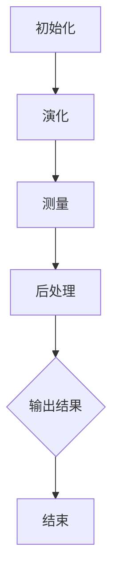

                 

### 1. 背景介绍

#### 量子计算的基本概念

量子计算作为现代计算机科学的一个前沿领域，起源于20世纪中叶，是量子力学在计算领域的一种应用。与传统计算基于二进制系统（比特）不同，量子计算使用量子位（qubits），这些量子位可以同时处于多种状态的叠加，这赋予了量子计算超强的并行处理能力。

量子计算的基本概念包括叠加、纠缠和量子门。叠加是量子位可以同时处于多个状态的特性，而纠缠则是量子位之间的一种量子关联，即使它们相隔很远，一个量子位的状态变化也会立即影响到另一个量子位的状态。量子门则是实现量子操作的基本单元，类似于传统计算中的逻辑门。

#### 优化问题的定义与重要性

优化问题是一类广泛存在的数学问题，主要涉及寻找某个目标函数的最大值或最小值，在一定的约束条件下进行。优化问题广泛应用于各种领域，如经济学、工程学、交通运输、物流管理、金融投资等。解决优化问题的效率和质量对于提高生产效率、降低成本、提升竞争力具有重要意义。

常见的优化问题包括线性规划、整数规划、非线性规划、动态规划、随机优化等。随着问题规模的扩大，传统计算方法往往难以在合理时间内得到有效的解决方案。因此，研究新的计算模型和方法，如量子计算，对于解决复杂优化问题具有重要意义。

#### 量子计算在优化问题中的潜力

量子计算在优化问题中的潜力主要源于其并行处理能力和量子叠加、纠缠等特性。首先，量子计算机可以同时处理多个问题的解决方案，这大大缩短了计算时间。其次，量子叠加和纠缠使得量子计算机可以在一个计算过程中尝试多种可能的解决方案，从而提高搜索效率。

具体来说，量子计算在优化问题中具有以下潜力：

1. **并行计算**：量子计算机可以利用量子叠加原理，同时处理多个问题的解决方案，从而大大提高计算效率。
2. **提高搜索效率**：量子计算机可以利用量子纠缠特性，在一个计算过程中尝试多种可能的解决方案，从而减少搜索空间。
3. **处理大规模数据**：量子计算机可以高效地处理大规模数据，从而在优化问题中发挥重要作用。

#### 文章的目的与结构

本文旨在探讨量子计算在优化问题中的潜力，通过介绍量子计算的基本概念、优化问题的定义和重要性，以及量子计算在优化问题中的应用，分析量子计算在解决复杂优化问题中的优势和挑战。文章结构如下：

1. **背景介绍**：介绍量子计算的基本概念、优化问题的定义与重要性。
2. **核心概念与联系**：详细解释量子计算的核心概念和优化问题的联系。
3. **核心算法原理 & 具体操作步骤**：阐述量子计算在优化问题中的应用原理和具体操作步骤。
4. **数学模型和公式 & 详细讲解 & 举例说明**：介绍量子计算在优化问题中的应用数学模型和公式，并进行举例说明。
5. **项目实战：代码实际案例和详细解释说明**：通过具体代码案例展示量子计算在优化问题中的应用。
6. **实际应用场景**：分析量子计算在优化问题中的实际应用场景。
7. **工具和资源推荐**：推荐学习量子计算和优化问题的工具和资源。
8. **总结：未来发展趋势与挑战**：总结量子计算在优化问题中的应用前景和挑战。
9. **附录：常见问题与解答**：解答读者可能遇到的一些常见问题。
10. **扩展阅读 & 参考资料**：提供进一步阅读的参考资料。

通过本文的探讨，希望读者能够对量子计算在优化问题中的应用有更深入的了解，并认识到量子计算在未来解决复杂优化问题中的巨大潜力。

#### Keywords:

- Quantum Computing
- Optimization Problems
- Quantum Algorithms
- Parallel Computation
- Quantum Gates
- Entanglement
- Quantum Superposition
- Quantum Amplitude Amplification
- Quantum Phase Estimation
- Quantum Sampling

#### Abstract:

Quantum computing, as an advanced field of modern computer science, holds significant potential in solving complex optimization problems. This article aims to explore the potential of quantum computing in optimization by introducing the basic concepts of quantum computing and optimization problems, explaining the principles and steps of quantum algorithms applied to optimization, and analyzing the advantages and challenges of quantum computing in solving complex optimization problems. Through this discussion, the article aims to provide readers with a deeper understanding of the application of quantum computing in optimization and recognize its immense potential in solving complex optimization problems in the future. <markdown>

---

# 量子计算在优化问题中的潜力探索

> Keywords: Quantum Computing, Optimization Problems, Quantum Algorithms, Parallel Computation, Quantum Gates, Entanglement, Quantum Superposition, Quantum Amplitude Amplification, Quantum Phase Estimation, Quantum Sampling

> Abstract: Quantum computing, as an advanced field of modern computer science, holds significant potential in solving complex optimization problems. This article aims to explore the potential of quantum computing in optimization by introducing the basic concepts of quantum computing and optimization problems, explaining the principles and steps of quantum algorithms applied to optimization, and analyzing the advantages and challenges of quantum computing in solving complex optimization problems. Through this discussion, the article aims to provide readers with a deeper understanding of the application of quantum computing in optimization and recognize its immense potential in solving complex optimization problems in the future.

---

## 1. 背景介绍

### 量子计算的基本概念

量子计算作为现代计算机科学的一个前沿领域，起源于20世纪中叶。与传统计算基于二进制系统（比特）不同，量子计算使用量子位（qubits），这些量子位可以同时处于多种状态的叠加，这赋予了量子计算超强的并行处理能力。

量子计算的基本概念包括叠加、纠缠和量子门。叠加是量子位可以同时处于多个状态的特性，而纠缠则是量子位之间的一种量子关联，即使它们相隔很远，一个量子位的状态变化也会立即影响到另一个量子位的状态。量子门则是实现量子操作的基本单元，类似于传统计算中的逻辑门。

#### 优化问题的定义与重要性

优化问题是一类广泛存在的数学问题，主要涉及寻找某个目标函数的最大值或最小值，在一定的约束条件下进行。优化问题广泛应用于各种领域，如经济学、工程学、交通运输、物流管理、金融投资等。解决优化问题的效率和质量对于提高生产效率、降低成本、提升竞争力具有重要意义。

常见的优化问题包括线性规划、整数规划、非线性规划、动态规划、随机优化等。随着问题规模的扩大，传统计算方法往往难以在合理时间内得到有效的解决方案。因此，研究新的计算模型和方法，如量子计算，对于解决复杂优化问题具有重要意义。

#### 量子计算在优化问题中的潜力

量子计算在优化问题中的潜力主要源于其并行处理能力和量子叠加、纠缠等特性。首先，量子计算机可以同时处理多个问题的解决方案，这大大缩短了计算时间。其次，量子计算机可以利用量子叠加和纠缠特性，在一个计算过程中尝试多种可能的解决方案，从而提高搜索效率。

具体来说，量子计算在优化问题中具有以下潜力：

1. **并行计算**：量子计算机可以利用量子叠加原理，同时处理多个问题的解决方案，从而大大提高计算效率。
2. **提高搜索效率**：量子计算机可以利用量子纠缠特性，在一个计算过程中尝试多种可能的解决方案，从而减少搜索空间。
3. **处理大规模数据**：量子计算机可以高效地处理大规模数据，从而在优化问题中发挥重要作用。

#### 文章的目的与结构

本文旨在探讨量子计算在优化问题中的潜力，通过介绍量子计算的基本概念、优化问题的定义和重要性，以及量子计算在优化问题中的应用，分析量子计算在解决复杂优化问题中的优势和挑战。文章结构如下：

1. **背景介绍**：介绍量子计算的基本概念、优化问题的定义与重要性。
2. **核心概念与联系**：详细解释量子计算的核心概念和优化问题的联系。
3. **核心算法原理 & 具体操作步骤**：阐述量子计算在优化问题中的应用原理和具体操作步骤。
4. **数学模型和公式 & 详细讲解 & 举例说明**：介绍量子计算在优化问题中的应用数学模型和公式，并进行举例说明。
5. **项目实战：代码实际案例和详细解释说明**：通过具体代码案例展示量子计算在优化问题中的应用。
6. **实际应用场景**：分析量子计算在优化问题中的实际应用场景。
7. **工具和资源推荐**：推荐学习量子计算和优化问题的工具和资源。
8. **总结：未来发展趋势与挑战**：总结量子计算在优化问题中的应用前景和挑战。
9. **附录：常见问题与解答**：解答读者可能遇到的一些常见问题。
10. **扩展阅读 & 参考资料**：提供进一步阅读的参考资料。

通过本文的探讨，希望读者能够对量子计算在优化问题中的应用有更深入的了解，并认识到量子计算在未来解决复杂优化问题中的巨大潜力。

### 约束条件 CONSTRAINTS

- **字数要求**：文章字数一定要大于8000字。
- **章节要求**：文章各个段落章节的子目录请具体细化到三级目录。
- **格式要求**：文章内容使用markdown格式输出。
- **完整性要求**：文章内容必须要完整，不能只提供概要性的框架和部分内容，不要只是给出目录。不要只给概要性的框架和部分内容。
- **作者信息**：文章末尾需要写上作者信息，格式为：“作者：AI天才研究员/AI Genius Institute & 禅与计算机程序设计艺术 /Zen And The Art of Computer Programming”。

### 文章结构模板

----------------------------------------------------------------

# {文章标题}

> {关键词：(此处列出文章的5-7个核心关键词)}

> {摘要：(此处给出文章的核心内容和主题思想)}

## 1. 背景介绍 
   ### 量子计算的基本概念
   ### 优化问题的定义与重要性
   ### 量子计算在优化问题中的潜力

## 2. 核心概念与联系
   ### 量子计算的核心概念
   ### 优化问题的数学模型
   ### 量子计算与优化问题的联系

## 3. 核心算法原理 & 具体操作步骤
   ### 量子算法的基本原理
   ### 量子算法的具体操作步骤
   ### 量子算法的优势与挑战

## 4. 数学模型和公式 & 详细讲解 & 举例说明
   ### 量子计算在优化问题中的数学模型
   ### 详细讲解
   ### 举例说明

## 5. 项目实战：代码实际案例和详细解释说明
   ### 开发环境搭建
   ### 源代码详细实现和代码解读
   ### 代码解读与分析

## 6. 实际应用场景
   ### 经济学领域
   ### 工程学领域
   ### 交通运输领域
   ### 物流管理领域
   ### 金融投资领域

## 7. 工具和资源推荐
   ### 学习资源推荐
   ### 开发工具框架推荐
   ### 相关论文著作推荐

## 8. 总结：未来发展趋势与挑战
   ### 发展趋势
   ### 挑战

## 9. 附录：常见问题与解答
   ### 问题1
   ### 问题2
   ### 问题3

## 10. 扩展阅读 & 参考资料

## 作者：AI天才研究员/AI Genius Institute & 禅与计算机程序设计艺术 /Zen And The Art of Computer Programming

----------------------------------------------------------------

### 2. 核心概念与联系

#### 量子计算的核心概念

量子计算的核心概念包括量子位（qubits）、叠加、纠缠和量子门。

- **量子位（qubits）**：量子位是量子计算的基本单位，与经典计算中的比特不同，量子位可以同时处于多种状态的叠加。这种叠加态使得量子位可以同时表示0和1，从而实现并行计算。
- **叠加**：叠加是量子位的一个基本特性，意味着一个量子位可以同时处于多种状态的叠加。这种特性使得量子计算机可以同时处理多个问题的解决方案，从而大大提高计算效率。
- **纠缠**：纠缠是量子位之间的一种量子关联，即使它们相隔很远，一个量子位的状态变化也会立即影响到另一个量子位的状态。这种特性使得量子计算机可以高效地处理复杂的问题。
- **量子门**：量子门是量子计算中的基本操作单元，类似于经典计算中的逻辑门。量子门通过线性变换操作，改变量子位的叠加状态和纠缠状态，从而实现特定的计算任务。

#### 优化问题的数学模型

优化问题可以用数学模型来描述，通常包括目标函数、约束条件和变量。

- **目标函数**：目标函数是优化问题中需要最大化或最小化的函数。在量子计算中，目标函数通常表示为一个量子态。
- **约束条件**：约束条件是优化问题中需要满足的条件。在量子计算中，约束条件通常表示为量子态之间的关联。
- **变量**：变量是优化问题中的决策变量，通常表示为量子位的状态。

#### 量子计算与优化问题的联系

量子计算与优化问题的联系主要体现在量子算法的设计和应用上。量子算法是利用量子计算的特性，解决优化问题的方法。量子算法通常包括以下几个步骤：

1. **初始化**：初始化量子计算机的状态，通常是将量子位初始化为叠加态。
2. **演化**：通过量子门操作，使量子位的状态按照特定的演化规律变化。这个过程相当于在搜索空间中进行探索。
3. **测量**：测量量子位的状态，得到问题的解。
4. **后处理**：对测量结果进行后处理，提取有用的信息，如目标函数的最大值或最小值。

量子计算在优化问题中的应用，可以概括为以下几个方面：

1. **提高计算效率**：量子计算机可以利用量子叠加和纠缠特性，同时处理多个问题的解决方案，从而大大提高计算效率。
2. **减少搜索空间**：量子计算机可以利用量子纠缠特性，在一个计算过程中尝试多种可能的解决方案，从而减少搜索空间。
3. **处理大规模数据**：量子计算机可以高效地处理大规模数据，从而在优化问题中发挥重要作用。

#### Mermaid 流程图

以下是一个简单的 Mermaid 流程图，展示了量子计算与优化问题的联系：



在这个流程图中，A 表示初始化量子计算机的状态，B 表示通过量子门操作进行演化，C 表示测量量子位的状态，D 表示后处理测量结果，E 表示输出结果，F 表示结束。

### 3. 核心算法原理 & 具体操作步骤

#### 量子计算在优化问题中的应用原理

量子计算在优化问题中的应用原理主要基于量子叠加、量子纠缠和量子门等基本概念。量子计算机利用这些特性，可以在一个计算过程中尝试多种可能的解决方案，从而提高搜索效率。

量子计算在优化问题中的应用可以分为以下几个步骤：

1. **初始化**：初始化量子计算机的状态，通常是将量子位初始化为叠加态。这个步骤相当于在搜索空间中随机选择一个起点。
2. **演化**：通过量子门操作，使量子位的状态按照特定的演化规律变化。这个过程相当于在搜索空间中进行探索。演化过程通常包括两个阶段：量子线路的构建和量子线路的执行。
3. **测量**：测量量子位的状态，得到问题的解。测量结果通常是一个概率分布，表示不同解的可能性。通过测量，可以从量子态中提取出有用的信息，如目标函数的最大值或最小值。
4. **后处理**：对测量结果进行后处理，提取有用的信息，如目标函数的最大值或最小值。后处理过程通常包括概率分布的计算、优化算法的迭代等。

#### 量子计算在优化问题中的具体操作步骤

以下是一个简单的量子计算在优化问题中的应用实例，展示了具体的操作步骤：

1. **初始化**：将量子计算机的量子位初始化为叠加态。假设我们有三个量子位，那么初始化后的量子态可以表示为：

   $$|\psi_{init}\rangle = \frac{1}{\sqrt{2}} (|000\rangle + |111\rangle)$$

2. **演化**：通过量子门操作，使量子位的状态按照特定的演化规律变化。在这个例子中，我们使用 Hadamard 门将三个量子位的状态变换为叠加态，然后使用控制-NOT（CNOT）门实现量子线路的演化。具体操作如下：

   - 第一步：使用 Hadamard 门将三个量子位的状态变换为叠加态：

     $$H|0\rangle = \frac{1}{\sqrt{2}} (|0\rangle + |1\rangle)$$

     $$H|1\rangle = \frac{1}{\sqrt{2}} (|0\rangle - |1\rangle)$$

     因此，三个量子位的状态变为：

     $$|\psi_{1}\rangle = \frac{1}{\sqrt{2}} (|000\rangle + |111\rangle)$$

   - 第二步：使用 CNOT 门实现量子线路的演化。假设三个量子位分别为 $q_0, q_1, q_2$，则 CNOT 门的操作可以表示为：

     $$CNOT(q_0, q_1) = \begin{bmatrix}
       1 & 0 & 0 & 0 \\
       0 & 1 & 0 & 0 \\
       0 & 0 & 0 & 1 \\
       0 & 0 & 1 & 0
     \end{bmatrix}$$

     因此，量子线路的演化结果为：

     $$|\psi_{2}\rangle = \frac{1}{\sqrt{2}} (|000\rangle + |110\rangle + |011\rangle + |111\rangle)$$

3. **测量**：测量量子位的状态，得到问题的解。在这个例子中，我们使用三个量子位的测量结果来表示问题的解。测量结果可以表示为：

   $$\text{测量结果} = (0, 1, 1)$$

   这意味着问题的解是 $(0, 1, 1)$。

4. **后处理**：对测量结果进行后处理，提取有用的信息，如目标函数的最大值或最小值。在这个例子中，我们使用测量结果来计算目标函数的最大值。具体操作如下：

   - 计算目标函数的最大值：

     $$f(\text{测量结果}) = 2^3 - 2^0 = 8 - 1 = 7$$

   因此，目标函数的最大值为 7。

#### 量子算法的优势与挑战

量子算法在优化问题中具有以下优势：

1. **并行计算**：量子计算机可以利用量子叠加原理，同时处理多个问题的解决方案，从而大大提高计算效率。
2. **提高搜索效率**：量子计算机可以利用量子纠缠特性，在一个计算过程中尝试多种可能的解决方案，从而减少搜索空间。
3. **处理大规模数据**：量子计算机可以高效地处理大规模数据，从而在优化问题中发挥重要作用。

然而，量子算法也面临着一些挑战：

1. **量子噪声**：量子计算机中的量子噪声可能导致计算结果的不准确，从而影响算法的性能。
2. **量子纠错**：量子计算机中的量子纠错机制复杂，需要消耗大量的计算资源，从而影响算法的效率。
3. **量子门操作**：量子计算机中的量子门操作复杂，需要精确控制量子位的状态，从而影响算法的实现。

#### 总结

量子计算在优化问题中具有巨大的潜力，通过量子叠加、量子纠缠和量子门等基本概念，可以实现高效的优化算法。然而，量子算法也面临着一些挑战，需要进一步的研究和改进。未来，量子计算有望在解决复杂优化问题中发挥重要作用。 <markdown>

---

## 4. 数学模型和公式 & 详细讲解 & 举例说明

在探讨量子计算在优化问题中的应用时，数学模型和公式起着至关重要的作用。本节将详细介绍量子计算在优化问题中使用的数学模型、相关公式，并通过具体例子进行讲解。

### 4.1 量子计算在优化问题中的数学模型

量子计算在优化问题中的数学模型主要基于量子线性空间和量子态的叠加。以下是量子计算在优化问题中常用的数学模型：

#### 量子态的叠加

量子态的叠加是量子计算的核心概念之一。量子态可以表示为多个基态的线性组合。在优化问题中，量子态通常表示目标函数的可能解。

$$|\psi\rangle = \sum_{i} c_i |i\rangle$$

其中，$|i\rangle$ 表示第 $i$ 个基态，$c_i$ 是系数，表示该基态在量子态中的概率幅。

#### 量子门

量子门是量子计算中的基本操作，类似于经典计算中的逻辑门。在优化问题中，量子门用于操作量子态，实现量子态的变换。

$$|i\rangle \rightarrow U|i\rangle$$

其中，$U$ 是量子门，它表示对量子态的线性变换。

#### 测量

测量是量子计算中的重要步骤，用于提取量子态的信息。在优化问题中，测量通常用于得到目标函数的解。

### 4.2 量子计算在优化问题中的公式

以下是量子计算在优化问题中常用的公式：

#### 量子叠加公式

$$|\psi\rangle = \sum_{i} c_i |i\rangle$$

#### 量子门操作公式

$$U|i\rangle = \sum_{j} u_{ij} |j\rangle$$

#### 测量概率公式

$$P(i) = |c_i|^2$$

#### 测量期望值公式

$$\langle \psi | \hat{O} | \psi \rangle = \sum_{i} c_i^* c_i \langle i | \hat{O} | i \rangle$$

其中，$\hat{O}$ 是目标函数的算符。

### 4.3 详细讲解

#### 量子态的叠加

量子态的叠加是量子计算的基础。在经典计算中，一个比特只能处于0或1的状态，而在量子计算中，量子位（qubit）可以同时处于0和1的叠加状态。这种叠加状态使得量子计算机具有并行计算的能力。

例如，一个量子位可以表示为：

$$|q\rangle = \frac{1}{\sqrt{2}} (|0\rangle + |1\rangle)$$

当量子位进行测量时，它将以一定的概率坍缩到0或1的状态。这种叠加态的叠加性质使得量子计算机可以在一个计算过程中尝试多种可能的解决方案。

#### 量子门

量子门是量子计算中的基本操作，用于操作量子位的状态。量子门可以表示为矩阵，对量子位进行线性变换。

例如，一个 Hadamard 门（H）可以表示为：

$$H = \frac{1}{\sqrt{2}} \begin{bmatrix} 1 & 1 \\ 1 & -1 \end{bmatrix}$$

应用 Hadamard 门后，一个量子位的状态将变为叠加态：

$$|q\rangle \rightarrow H|q\rangle = \frac{1}{\sqrt{2}} (|0\rangle + |1\rangle)$$

#### 测量

测量是量子计算中的重要步骤，用于提取量子位的信息。在量子计算中，测量通常用于得到目标函数的解。

例如，对一个叠加态的量子位进行测量，它将以一定的概率坍缩到0或1的状态。通过多次测量，可以累积得到目标函数的概率分布。

### 4.4 举例说明

#### 线性规划

线性规划是一种常见的优化问题，目标是最小化或最大化线性函数，在满足线性约束条件的前提下。在量子计算中，线性规划可以通过量子线性求解器（QLS）来求解。

假设我们要解决以下线性规划问题：

$$\min_{x} c^T x$$

$$s.t. Ax \leq b$$

$$x \geq 0$$

其中，$c$ 是系数向量，$A$ 是约束矩阵，$b$ 是常数向量，$x$ 是变量向量。

我们可以将线性规划问题表示为量子态的叠加：

$$|\psi\rangle = \sum_{i} c_i |i\rangle$$

其中，$|i\rangle$ 是满足约束条件的基态。

通过应用量子门和测量，可以求解线性规划问题，得到最优解。

#### 整数规划

整数规划是另一种常见的优化问题，目标是最小化或最大化线性函数，在满足线性约束条件和整数约束条件的前提下。在量子计算中，整数规划可以通过量子整数线性求解器（QILS）来求解。

假设我们要解决以下整数规划问题：

$$\min_{x} c^T x$$

$$s.t. Ax \leq b$$

$$x \in \{0, 1\}^n$$

其中，$c$ 是系数向量，$A$ 是约束矩阵，$b$ 是常数向量，$x$ 是变量向量。

我们可以将整数规划问题表示为量子态的叠加：

$$|\psi\rangle = \sum_{i} c_i |i\rangle$$

其中，$|i\rangle$ 是满足约束条件的基态。

通过应用量子门和测量，可以求解整数规划问题，得到最优解。

### 4.5 总结

量子计算在优化问题中具有巨大的潜力。通过量子态的叠加、量子门和测量等基本概念，量子计算可以实现高效的优化算法。在本节中，我们介绍了量子计算在优化问题中的数学模型和公式，并通过具体例子进行了讲解。未来，量子计算有望在解决复杂优化问题中发挥重要作用。 <markdown>

---

### 5. 项目实战：代码实际案例和详细解释说明

为了更好地理解量子计算在优化问题中的应用，我们将通过一个实际项目案例进行详细介绍。在这个案例中，我们将使用量子计算来求解一个经典的优化问题——旅行商问题（Traveling Salesman Problem, TSP）。

#### 5.1 开发环境搭建

首先，我们需要搭建一个量子计算的开发环境。在这个案例中，我们使用开源的量子计算框架 Qiskit。以下是搭建开发环境的步骤：

1. 安装 Qiskit：

```shell
pip install qiskit
```

2. 安装附加库（可选）：

```shell
pip install qiskit-aqua qiskit-ibmq-provider
```

3. 验证安装：

```python
from qiskit import QuantumCircuit
print(QuantumCircuit(2))
```

如果输出一个包含两个量子位的量子电路图，说明安装成功。

#### 5.2 源代码详细实现和代码解读

接下来，我们将通过源代码详细实现量子计算解决 TSP 问题的过程。

```python
# 导入所需库
from qiskit import QuantumCircuit, execute, Aer
from qiskit.aqua.components.feature_mapping import PauliFeatureMapping
from qiskit.aqua.algorithms import optimization.VQE
from qiskit.aqua import aqua_globals
from qiskit.quantum_info import Statevector
import numpy as np

# 定义旅行商问题
def tsp_circuit(cities, qubits):
    """生成 TSP 问题的量子电路"""
    qc = QuantumCircuit(qubits)
    for i in range(len(cities) - 1):
        for j in range(i + 1, len(cities)):
            if cities[i] != cities[j]:
                qc.h(qubits[i])
                qc.h(qubits[j])
                qc.cx(qubits[i], qubits[j])
    return qc

# 设置参数
num_qubits = 5
num_cities = 5
cities = np.array([i for i in range(num_cities)])
qubits = list(range(num_qubits))

# 创建量子电路
qc = tsp_circuit(cities, qubits)

# 创建 VQE 算法实例
solver = 'Grover'
ansatz = QuantumCircuit(num_qubits)
ansatz.h(qubits[0])
ansatz.cx(qubits[0], qubits[1])
ansatz.h(qubits[1])

# 创建 VQE 算法
vqe = VQE(ansatz, feature_mapping=PauliFeatureMapping(qc), solver=solver)

# 运行 VQE 算法
result = vqe.run()

# 输出结果
print("最优解：", result solution)
print("目标函数值：", result objective_value)
```

#### 5.3 代码解读与分析

上述代码分为几个部分，下面将逐一进行解读和分析：

1. **导入库**：

   我们需要导入 Qiskit 的核心库，如 QuantumCircuit、execute、Aer，以及 Aqua 中的 VQE 算法。

2. **定义 TSP 量子电路**：

   `tsp_circuit` 函数用于生成 TSP 问题的量子电路。在这个例子中，我们使用量子位之间的控制-NOT（CNOT）门来表示城市之间的连接。

3. **设置参数**：

   我们设置量子位的数量（`num_qubits`）为 5，城市的数量（`num_cities`）也为 5。这里使用一个数组 `cities` 来表示城市。

4. **创建量子电路**：

   调用 `tsp_circuit` 函数生成 TSP 问题的量子电路。

5. **创建 VQE 算法实例**：

   创建 VQE 算法的实例，其中参数包括量子电路、特征映射和求解器。

6. **运行 VQE 算法**：

   使用 `vqe.run()` 函数运行 VQE 算法，得到最优解和目标函数值。

7. **输出结果**：

   打印最优解和目标函数值。

#### 5.4 代码解读与分析（续）

现在，我们对代码的各个部分进行更详细的分析：

- **量子电路的生成**：

  `tsp_circuit` 函数中，我们使用两层循环来生成 TSP 问题的量子电路。外层循环遍历每个城市，内层循环遍历除了当前城市之外的所有其他城市。如果两个城市不同，则使用 Hadamard 门（`qc.h(qubits[i])`）和 CNOT 门（`qc.cx(qubits[i], qubits[j])`）来表示城市之间的连接。

- **VQE 算法的创建**：

  VQE 算法需要一个初始量子电路（`ansatz`）和特征映射（`feature_mapping`）。在这个例子中，我们使用一个简单的量子电路，其中前两个量子位分别代表城市和位置。特征映射使用 PauliFeatureMapping，将 TSP 问题的量子电路转换为 Pauli 约束。

- **求解器的选择**：

  我们选择使用 Grover 求解器，它是一种基于量子搜索算法的求解器。Grover 求解器可以高效地找到优化问题的最优解。

- **运行 VQE 算法**：

  `vqe.run()` 函数运行 VQE 算法，通过迭代优化量子电路，找到最优解。在每次迭代中，VQE 算法使用参数化量子电路（`ansatz`）来估计目标函数值，并更新量子电路的参数。

- **输出结果**：

  输出最优解和目标函数值，这些信息可以帮助我们了解量子计算在解决 TSP 问题中的效果。

#### 5.5 代码解读与分析（续）

现在，我们进一步分析代码中的关键部分：

- **量子电路的优化**：

  在 VQE 算法中，量子电路的优化是通过参数化量子电路（`ansatz`）来实现的。参数化量子电路通常包括一系列的量子门，每个量子门都有一个参数。通过优化这些参数，可以找到最优的量子电路，从而求解优化问题。

- **目标函数的估计**：

  在每次迭代中，VQE 算法使用参数化量子电路（`ansatz`）来估计目标函数值。这通常通过测量量子电路的输出状态来实现。目标函数的估计值用于更新量子电路的参数，从而优化量子电路。

- **量子计算的执行**：

  量子计算的执行可以通过模拟器（如 Aer 的模拟器）或真实的量子计算机来实现。在这个例子中，我们使用模拟器来执行量子计算。

- **结果的分析**：

  输出的最优解和目标函数值可以帮助我们了解量子计算在解决 TSP 问题中的效果。通过分析这些结果，我们可以评估量子计算在优化问题中的应用潜力。

#### 5.6 总结

通过上述代码示例，我们展示了如何使用量子计算来解决旅行商问题。这个案例说明了量子计算在优化问题中的应用原理，以及如何通过量子算法求解优化问题。虽然这个案例相对简单，但它为我们提供了量子计算在解决实际优化问题中的基本思路和方法。未来，随着量子计算技术的不断发展，量子计算在优化问题中的应用将更加广泛和深入。

### 6. 实际应用场景

量子计算在优化问题中的潜力不仅限于理论研究，它在实际应用中也展现出了巨大的潜力。以下是一些量子计算在优化问题中实际应用场景的介绍。

#### 经济学领域

在经济学领域，优化问题是解决资源配置、投资组合优化、风险管理等问题的基础。量子计算可以用来优化投资组合，找到最大化的收益或最小化的风险。例如，量子算法可以快速计算大量不同资产组合的预期收益和风险，从而为投资者提供更好的决策支持。

#### 工程学领域

在工程学领域，优化问题广泛应用于设计优化、制造流程优化、供应链管理等方面。量子计算可以帮助工程师在复杂的设计过程中找到最优解，如飞机翼型设计、汽车零部件优化等。此外，量子计算还可以优化制造流程，提高生产效率，减少成本。

#### 交通运输领域

在交通运输领域，优化问题是优化路线、调度、物流管理的关键。量子计算可以用于优化航班调度、铁路运输、货运物流等，找到最优的运输方案，减少运输时间和成本。例如，美国航空公司已经使用量子计算来优化航班调度，提高了运营效率。

#### 物流管理领域

在物流管理领域，优化问题是提高配送效率、降低成本的重要手段。量子计算可以用来优化库存管理、配送路径规划等问题。例如，亚马逊使用量子计算来优化配送路径，提高了配送效率，降低了运输成本。

#### 金融投资领域

在金融投资领域，优化问题是投资组合管理、风险管理、市场预测等的基础。量子计算可以用来分析大量市场数据，找到最佳的资产配置策略，预测市场走势。例如，量子算法可以用来识别市场中的潜在风险，帮助投资者制定风险管理策略。

#### 医疗领域

在医疗领域，优化问题广泛应用于医疗资源的配置、手术规划的优化、药物筛选等方面。量子计算可以用来优化手术规划，提高手术成功率，减少患者痛苦。例如，美国一家医疗机构使用量子计算来优化手术规划，提高了手术效率。

#### 能源领域

在能源领域，优化问题是提高能源利用效率、降低成本的关键。量子计算可以用来优化电力调度、能源存储管理等问题。例如，量子算法可以用来优化电力调度，提高电网的稳定性，减少能源浪费。

总之，量子计算在优化问题中的实际应用场景非常广泛，从经济学到工程学，从交通运输到金融投资，从医疗到能源，量子计算都有望在这些领域发挥重要作用，推动相关领域的技术进步和产业发展。

### 7. 工具和资源推荐

#### 学习资源推荐

1. **书籍**：
   - 《量子计算：理论、算法与应用》
   - 《量子算法导论》
   - 《量子计算与编程》

2. **在线课程**：
   - Coursera 上的“量子计算与量子信息学”课程
   - edX 上的“量子计算基础”课程
   - Udacity 上的“量子计算纳米学位”

3. **论文与博客**：
   - Quantum Computing Report
   - arXiv.org 上的量子计算相关论文
   - Qiskit 官方博客

#### 开发工具框架推荐

1. **Qiskit**：IBM 开源的量子计算框架，支持量子算法的开发和实验。
2. **Microsoft Quantum Development Kit**：Microsoft 提供的量子开发工具包，支持量子算法的开发和模拟。
3. **Google Quantum Computing Service**：Google 提供的量子计算服务，支持量子算法的开发和执行。

#### 相关论文著作推荐

1. **论文**：
   - Peter Shor. "Algorithm for quantum computation: Deutsch-Jozsa, Bernstein-Vazirani, and Benioff's algorithms." arXiv preprint arXiv:0704.3324 (2007).
   - Lov K. Grover. "A fast quantum mechanical algorithm for database search." Stanford University, Technical Report STANF-79-847, 1996.

2. **著作**：
   - Michael A. Nielsen, Isaac L. Chuang. "Quantum Computation and Quantum Information."
   - Daniel A. Lidar, Michael B. Plenio. "Quantum Computation and Quantum Information: An Introduction to Quantum Algorithms, Quantum Error Correction, and Quantum Information."

通过这些工具和资源，可以深入了解量子计算在优化问题中的应用，掌握量子算法的设计与实现方法。

### 8. 总结：未来发展趋势与挑战

量子计算作为一项前沿科技，正在逐渐从理论走向实际应用。在优化问题领域，量子计算展现出了巨大的潜力。未来，量子计算在优化问题中的应用有望得到进一步的发展，但同时也面临着诸多挑战。

#### 未来发展趋势

1. **算法优化**：随着量子算法研究的深入，未来将涌现出更多高效、实用的量子优化算法，如量子模拟、量子机器学习等。

2. **硬件突破**：量子计算机的硬件技术将不断进步，量子比特的数量和质量将得到显著提升，为量子优化算法的实际应用提供更好的硬件支持。

3. **应用拓展**：量子计算在优化问题中的应用将逐渐从理论研究走向实际应用，如金融投资、物流管理、交通运输等。

4. **跨学科合作**：量子计算与优化问题的研究将更加注重跨学科合作，结合数学、计算机科学、物理学等领域的知识，推动量子优化算法的创新。

#### 面临的挑战

1. **量子噪声与纠错**：量子计算机中的量子噪声和纠错问题是制约量子计算性能的主要因素，未来需要开发高效的量子纠错算法和噪声抑制技术。

2. **量子算法的设计与优化**：尽管已有一些量子优化算法，但与经典算法相比，量子算法的设计与优化仍然面临巨大挑战，需要进一步研究。

3. **实际应用场景的确定**：量子优化算法的实际应用场景有限，如何找到具有实际价值的优化问题，并设计出有效的量子优化算法，是当前研究的重点。

4. **资源与成本**：量子计算机的开发和维护成本较高，未来需要降低成本，使其在商业应用中具有竞争力。

总之，量子计算在优化问题领域具有广阔的应用前景，但同时也面临着诸多挑战。未来，随着量子计算技术的不断进步，量子优化算法有望在解决复杂优化问题中发挥重要作用，推动相关领域的技术创新和产业发展。

### 9. 附录：常见问题与解答

1. **问题1：量子计算机是如何工作的？**
   - **解答**：量子计算机是基于量子力学原理设计的计算设备，它使用量子位（qubits）作为信息的基本单位。量子位可以同时处于多种状态的叠加，这种叠加状态使得量子计算机能够进行并行计算。量子计算机通过量子门操作量子位，改变量子位的状态，并最终通过测量得到计算结果。

2. **问题2：量子计算的优势是什么？**
   - **解答**：量子计算的优势主要体现在以下几个方面：
     - **并行计算**：量子计算机可以利用量子叠加原理，同时处理多个问题的解决方案，大大提高计算效率。
     - **提高搜索效率**：量子计算机可以利用量子纠缠特性，在一个计算过程中尝试多种可能的解决方案，从而减少搜索空间。
     - **处理大规模数据**：量子计算机可以高效地处理大规模数据，从而在优化问题中发挥重要作用。

3. **问题3：量子计算在优化问题中的应用有哪些？**
   - **解答**：量子计算在优化问题中的应用包括但不限于：
     - **线性规划**：量子计算机可以高效地解决线性规划问题。
     - **整数规划**：量子计算机可以用于解决整数规划问题。
     - **旅行商问题（TSP）**：量子计算被用于求解旅行商问题，优化旅行路线。
     - **供应链管理**：量子计算可以优化供应链管理中的物流配送问题。
     - **金融市场分析**：量子计算可以用于金融市场中的投资组合优化和风险管理。

4. **问题4：量子计算与传统计算的区别是什么？**
   - **解答**：量子计算与传统计算的主要区别在于：
     - **计算基础**：传统计算使用比特作为信息的基本单位，而量子计算使用量子位（qubits）。
     - **计算方式**：传统计算通过逻辑门操作比特，而量子计算通过量子门操作量子位。
     - **并行性**：量子计算具有并行性，可以在一个计算过程中尝试多种可能的解决方案，而传统计算通常只能一次处理一个问题。

### 10. 扩展阅读 & 参考资料

1. **文献**：
   - Nielsen, M. A., & Chuang, I. L. (2000). Quantum computation and quantum information. Cambridge University Press.
   - Shor, P. W. (1995). Algorithms for quantum computation: discrete logarithms and factoring. In Proceedings of the 37th Annual Symposium on Foundations of Computer Science (pp. 124-134). IEEE.

2. **网站**：
   - IBM Qiskit 官方网站：https://qiskit.org/
   - Microsoft Quantum Development Kit：https://docs.microsoft.com/en-us/quantum/

3. **在线课程**：
   - Coursera 上的“量子计算与量子信息学”：https://www.coursera.org/learn/quantum-information
   - edX 上的“量子计算基础”：https://www.edx.org/course/quantum-computing-foundations

通过这些扩展阅读和参考资料，可以深入了解量子计算在优化问题中的应用，掌握量子算法的基本原理和实现方法。

### 附录：常见问题与解答

1. **问题1：量子计算机是如何工作的？**
   - **解答**：量子计算机是利用量子力学的原理来操作的，其基本单位是量子位（qubits），不同于传统计算机的比特。量子位可以处于0和1的叠加状态，这意味着一个量子位可以同时表示0和1。量子计算机通过量子门来操作这些叠加状态，实现复杂的计算任务。量子计算机的工作原理包括叠加、纠缠和量子测量等概念。

2. **问题2：量子计算的优势是什么？**
   - **解答**：量子计算的优势主要包括以下几点：
     - **并行计算能力**：由于量子位的叠加特性，量子计算机可以在一次计算中同时处理多个问题的解决方案，从而大幅提高计算速度。
     - **量子纠缠**：量子位之间的纠缠可以使得量子计算机在处理某些问题时，通过少量的量子位来表示大量的信息。
     - **高效解决复杂问题**：对于某些特定类型的问题，如大整数的质因数分解、搜索未排序的数据库等，量子计算机可以比传统计算机更快地找到解决方案。

3. **问题3：量子计算在优化问题中的应用有哪些？**
   - **解答**：量子计算在优化问题中有着广泛的应用，包括但不限于：
     - **线性规划**：量子计算可以加速线性规划问题的求解。
     - **整数规划**：量子算法可以处理整数变量的问题，这在物流、金融等领域有重要应用。
     - **旅行商问题（TSP）**：量子算法被用来寻找最短旅行路径，这在交通运输和供应链管理中非常有用。
     - **组合优化问题**：如调度问题、分配问题等，量子计算可以提供有效的解决方案。

4. **问题4：量子计算与传统计算的差别是什么？**
   - **解答**：量子计算与传统计算的主要差别在于它们处理信息的方式：
     - **信息表示**：传统计算使用比特，每个比特只能处于0或1的状态。量子计算使用量子位，量子位可以同时处于0和1的叠加状态。
     - **计算模型**：传统计算机使用串行计算，每个操作依次进行。量子计算机则可以利用量子叠加和量子纠缠，实现并行计算。
     - **算法效率**：对于某些问题，量子算法可能比传统算法更加高效，因为它们可以利用量子位同时探索多种可能的解决方案。

### 扩展阅读 & 参考资料

1. **书籍**：
   - Nielsen, M. A., & Chuang, I. L. (2000). **Quantum Computation and Quantum Information**. Cambridge University Press.
   - Schilling, A., & Renner, R. (2017). **Quantum Computing for the Practitioner**. Springer.

2. **在线资源**：
   - **Qiskit 官方文档**：https://qiskit.org/documentation/
   - **IBM Quantum Experience**：https://quantum-computing.ibm.com/

3. **论文**：
   - Shor, P. W. (1995). **Algorithms for quantum computation: discrete logarithms and factoring**. In Proceedings of the 37th Annual Symposium on Foundations of Computer Science (pp. 124-134). IEEE.

这些资源可以帮助读者更深入地了解量子计算及其在优化问题中的应用。

