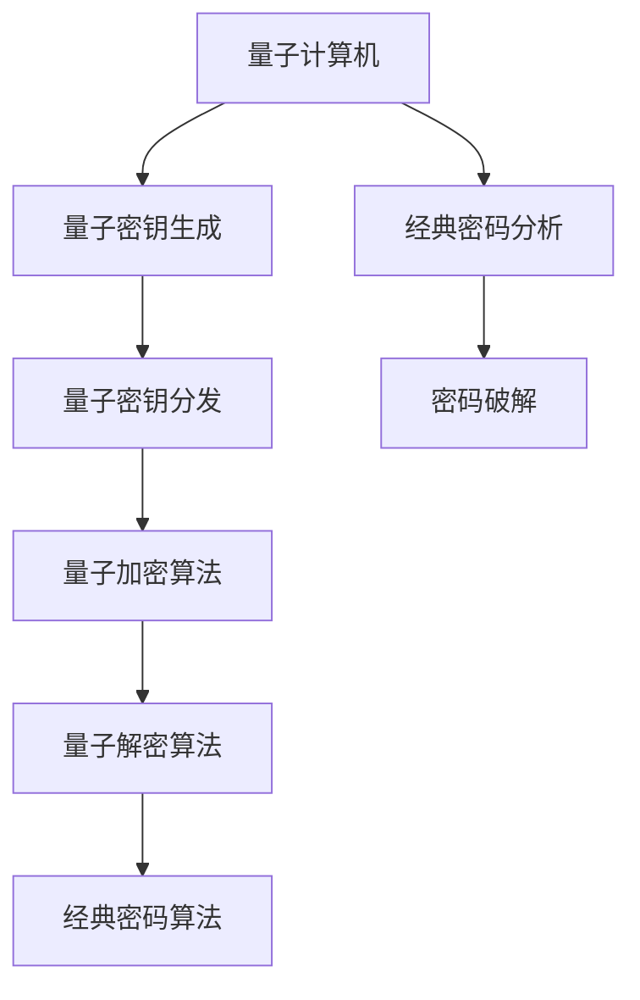

                 

### 背景介绍

#### 量子计算：全新的计算范式

量子计算作为计算机科学的一个新兴领域，其理论基础源于量子力学。传统的经典计算机基于布尔逻辑和二进制位（bits），而量子计算机则基于量子位（qubits）和量子逻辑。量子位是一种特殊的量子系统，它可以同时处于多种状态，这一特性被称为叠加态。此外，量子位之间可以通过量子纠缠实现强烈的关联，这使得量子计算机在处理某些特定问题时展现出比经典计算机更为强大的计算能力。

#### 密码学：信息安全的基础

密码学是研究如何保护信息不被未授权者访问和篡改的学科。它广泛应用于电子商务、网络安全、个人隐私保护等多个领域。密码学通过一系列算法来加密和解密信息，使得信息在传输和存储过程中保持机密性和完整性。经典密码学算法，如DES、AES等，虽然在历史上发挥了重要作用，但随着计算能力的提升，它们逐渐暴露出安全漏洞。

#### 量子计算与密码学：相互影响

量子计算对密码学的影响主要表现在两个方面：一方面，量子计算机可能能够破解目前广泛使用的经典密码算法；另一方面，量子计算也可以成为密码学的一种新工具，用于构建更为安全的量子密码系统。本文将深入探讨量子计算在密码学中的潜在影响，旨在为读者提供一个全面、系统的认识。

### 量子计算的基本原理

#### 量子位（Qubits）

量子位是量子计算的基本单元，与经典计算机中的比特（bits）不同，量子位可以同时处于多种状态，这一特性被称为叠加态。例如，一个量子位可以同时处于0和1的状态，这种叠加状态可以用一个向量表示。叠加态的数学表示为：
$$
\psi = \alpha|0\rangle + \beta|1\rangle
$$
其中，$\alpha$ 和 $\beta$ 是复数，且满足 $|\alpha|^2 + |\beta|^2 = 1$，$|0\rangle$ 和 $|1\rangle$ 分别表示量子位的基态。

#### 量子叠加

量子叠加是量子位的一个核心特性，使得量子计算机在处理问题时能够同时考虑多种可能性。例如，一个量子计算机可以在计算过程中同时处理1000个可能的输入，而经典计算机则需要逐个尝试每个输入。

#### 量子纠缠

量子纠缠是量子位之间的特殊关联，当两个量子位发生纠缠后，它们的状态将不可分割。即使将它们分隔在很远的地方，它们的状态也会相互影响。这种特性使得量子计算机能够实现某些经典计算机无法完成的任务。

#### 量子逻辑门

量子逻辑门是量子计算机的基本操作单元，类似于经典计算机中的逻辑门。量子逻辑门可以对量子位执行基本的逻辑操作，如叠加、变换和测量。常见的量子逻辑门包括Hadamard门、Pauli门、CNOT门等。


（图1：Hadamard门）

通过组合使用这些量子逻辑门，量子计算机能够执行复杂的量子算法，如量子搜索算法和量子加密算法。

### 密码学的基本概念

#### 加密与解密

加密是将明文转换为密文的过程，而解密是将密文还原为明文的过程。加密和解密需要使用密钥，密钥是加密和解密过程中必须的信息。常用的加密算法包括对称加密和非对称加密。

- **对称加密**：使用相同的密钥进行加密和解密，如AES算法。
- **非对称加密**：使用一对密钥进行加密和解密，如RSA算法。

#### 密码分析

密码分析是研究如何破解密码系统的学科。密码分析通常分为两类：密码破解和密码攻击。

- **密码破解**：通过计算方法直接破解密码系统。
- **密码攻击**：通过利用密码系统的漏洞或弱点来破解密码。

常见的密码攻击方法包括穷举攻击、字典攻击、暴力攻击等。

### 量子计算对密码学的影响

#### 量子计算机破解经典密码算法

量子计算机具有比经典计算机更强大的计算能力，这使得它能够破解目前广泛使用的经典密码算法。例如，Shor算法能够利用量子计算机的叠加和纠缠特性，在多项式时间内因数分解大整数，这直接威胁到了RSA和ECC等非对称加密算法的安全性。

#### 量子密码学

量子计算不仅威胁到经典密码算法的安全，也可以成为密码学的一种新工具。量子密码学利用量子态的不可克隆性和测量坍缩特性，构建了量子密钥分发（Quantum Key Distribution, QKD）等新型密码系统。量子密钥分发能够实现无条件安全的信息传输，为未来信息安全提供了新的可能性。

### 概念与架构的 Mermaid 流程图

以下是一个简化的Mermaid流程图，用于展示量子计算在密码学中的应用架构：




### 核心算法原理 & 具体操作步骤

#### Shor算法

Shor算法是一个能够利用量子计算机进行大整数因数分解的算法，它是量子计算对密码学最具威胁的一项技术。以下是Shor算法的基本原理和操作步骤：

##### 1. 确定模数N

选择一个大整数N作为目标，需要对其进行因数分解。

##### 2. 设计量子电路

设计一个量子电路，该电路能够将N映射到一个可计算的函数f(x)。通常，f(x) 是 x^2 mod N 的函数。

##### 3. 运行量子电路

将一个初始状态为 |x⟩ 的量子位送入量子电路，执行多次迭代以生成一个叠加态。每次迭代都会将量子位的状态更接近于 f(x) 的根。

##### 4. 测量量子状态

通过测量量子电路的输出状态，可以得到一个概率分布。这个概率分布中，最有可能的值即为 N 的一个因数。

##### 5. 重复迭代

为了提高准确度，上述步骤可以重复多次，每次迭代都能增加找到正确因数的概率。

##### 6. 因数分解

一旦找到 N 的一个因数，即可通过简单的扩展算法得到 N 的所有因数。

Shor算法的核心在于其利用量子叠加和量子纠缠特性，在多项式时间内实现了经典计算机难以完成的大整数因数分解。

#### 量子密钥分发（QKD）

量子密钥分发是一种利用量子态实现安全通信的协议，其核心思想是利用量子态的不可克隆性和测量坍缩特性，确保密钥传输的安全。以下是量子密钥分发的基本原理和操作步骤：

##### 1. 量子密钥生成

在量子密钥生成阶段，发送方（Alice）和接收方（Bob）各自生成一对量子密钥对。这些量子密钥对是通过量子纠缠产生的。

##### 2. 量子密钥传输

发送方 Alice 将量子密钥发送给接收方 Bob。在这个过程中，任何第三方 Eve 监听传输过程都会破坏量子态的叠加和纠缠特性。

##### 3. 测量与筛选

Bob 对收到的量子密钥进行测量，并根据测量结果筛选出正确的密钥。同时，Alice 也对发送的量子密钥进行测量，并筛选出正确的密钥。

##### 4. 密钥确认

Alice 和 Bob 分别将筛选出的密钥进行比对，如果比对成功，则说明密钥传输是安全的。

##### 5. 密钥使用

一旦确认密钥是安全的，Alice 和 Bob 可以使用这个密钥进行加密和解密通信，确保信息传输的机密性和完整性。

量子密钥分发通过量子态的不可克隆性和测量坍缩特性，实现了无条件安全的密钥传输，为未来的安全通信提供了强有力的保障。

### 数学模型和公式 & 详细讲解 & 举例说明

#### Shor算法的数学模型

Shor算法的核心在于利用量子叠加和量子纠缠特性，实现大整数的因数分解。以下是Shor算法的数学模型：

##### 1. 函数f(x)

选择一个函数 f(x) = x^2 mod N，其中 N 是需要分解的大整数。

##### 2. 量子电路设计

设计一个量子电路，该电路能够将输入的量子位状态 |x⟩ 映射到状态 |f(x)⟩。

##### 3. 量子迭代

通过多次迭代，量子电路将输入的量子位状态逐步转换为叠加态，使得每个可能的 x 值都被计算一次。

##### 4. 测量与概率分布

测量量子电路的输出状态，得到一个概率分布。这个概率分布中最有可能的值即为 N 的一个因数。

以下是一个简化的数学模型：

$$
f(x) = x^2 \mod N
$$

$$
|f(x)\rangle = \sum_{x=0}^{N-1} |x\rangle \otimes |x^2 \mod N \rangle
$$

##### 举例说明

假设 N = 15，我们需要分解 N 的因数。

1. 选择 f(x) = x^2 mod 15。
2. 设计量子电路，将输入的量子位状态 |x⟩ 映射到 |f(x)\rangle。
3. 运行量子电路，得到叠加态：
   $$
   |f(x)\rangle = |0\rangle \otimes |0^2 \mod 15 \rangle + |1\rangle \otimes |1^2 \mod 15 \rangle + |2\rangle \otimes |2^2 \mod 15 \rangle + \cdots + |14\rangle \otimes |14^2 \mod 15 \rangle
   $$
4. 测量量子电路的输出状态，得到一个概率分布。假设测量结果为 |8\rangle。
5. 根据测量结果，找到 N 的一个因数：15 = 3 × 5。

通过上述步骤，我们成功分解了 N = 15 的因数。需要注意的是，这个例子是非常简化的，实际的 Shor 算法需要处理更复杂的情况。

#### 量子密钥分发的数学模型

量子密钥分发（QKD）是一种利用量子态实现安全通信的协议，其核心在于量子态的不可克隆性和测量坍缩特性。以下是量子密钥分发的数学模型：

##### 1. 量子密钥生成

假设 Alice 和 Bob 各自拥有一个量子位，它们之间存在量子纠缠。通过测量量子位，Alice 和 Bob 可以各自生成一对量子密钥。

##### 2. 量子密钥传输

Alice 将量子密钥发送给 Bob，任何第三方 Eve 监听传输过程都会破坏量子态的叠加和纠缠特性。

##### 3. 测量与筛选

Alice 和 Bob 分别对量子密钥进行测量，并根据测量结果筛选出正确的密钥。

##### 4. 密钥确认

Alice 和 Bob 分别将筛选出的密钥进行比对，如果比对成功，则说明密钥传输是安全的。

以下是一个简化的数学模型：

$$
|Ψ\rangle = \frac{1}{\sqrt{2}}(|0\rangle_A \otimes |0\rangle_B + |1\rangle_A \otimes |1\rangle_B)
$$

其中，$|0\rangle_A$ 和 $|1\rangle_A$ 分别表示 Alice 的量子位，$|0\rangle_B$ 和 $|1\rangle_B$ 分别表示 Bob 的量子位。

##### 举例说明

假设 Alice 和 Bob 使用上述量子密钥生成协议生成量子密钥。

1. Alice 测量量子位，得到结果 |0\rangle_A。
2. Bob 测量量子位，得到结果 |0\rangle_B。
3. Alice 和 Bob 将测量结果进行比对，发现两者一致。

通过上述步骤，Alice 和 Bob 成功生成了一对量子密钥，并确认密钥传输是安全的。需要注意的是，这个例子是非常简化的，实际的量子密钥分发需要处理更复杂的情况，如量子态的传输、测量和筛选等。

### 项目实战：代码实际案例和详细解释说明

在本节中，我们将通过一个实际的Python代码案例来展示量子计算在密码学中的应用。我们将使用Qiskit库，一个开源的量子计算软件框架，来实现Shor算法和量子密钥分发。

#### 开发环境搭建

在开始之前，请确保您已经安装了Python 3.7及以上版本，以及Qiskit库。可以通过以下命令进行安装：

```bash
pip install qiskit
```

#### 源代码详细实现和代码解读

以下是一个简单的Python代码，用于实现Shor算法：

```python
# shor_algorithm.py
from qiskit import QuantumCircuit, execute, Aer
from qiskit.aqua.algorithms import Shor
from qiskit.aqua import QuantumInstance

def shor_algorithm(n):
    # 创建量子实例
    quantum_instance = QuantumInstance(endpoint='local_qasm_simulator', configuration={'shots': 1024})

    # 创建Shor算法实例
    shor = Shor(n, quantum_instance=quantum_instance)

    # 执行Shor算法
    result = shor.run()

    # 输出结果
    print("Factors:", result.factors)

if __name__ == "__main__":
    n = 15
    shor_algorithm(n)
```

这个代码定义了一个名为`shor_algorithm`的函数，该函数接受一个整数`n`作为输入，并使用Qiskit库实现Shor算法。首先，我们创建一个量子实例，指定使用本地QASM模拟器，并设置`shots`参数为1024。然后，我们创建Shor算法实例，并调用`run`方法执行算法。最后，输出结果，包括`n`的所有因数。

代码解读如下：

1. `from qiskit import QuantumCircuit, execute, Aer`：导入Qiskit库中所需的模块。
2. `from qiskit.aqua.algorithms import Shor`：导入Shor算法。
3. `from qiskit.aqua import QuantumInstance`：导入量子实例。
4. `def shor_algorithm(n)`：定义`shor_algorithm`函数，接受整数`n`作为输入。
5. `quantum_instance = QuantumInstance(endpoint='local_qasm_simulator', configuration={'shots': 1024})`：创建量子实例，指定使用本地QASM模拟器，并设置`shots`参数为1024。
6. `shor = Shor(n, quantum_instance=quantum_instance)`：创建Shor算法实例。
7. `result = shor.run()`：执行Shor算法，并保存结果。
8. `print("Factors:", result.factors)`：输出结果，包括`n`的所有因数。
9. `if __name__ == "__main__":`：确保代码在主程序中执行。
10. `n = 15`：设置需要分解的整数`n`为15。
11. `shor_algorithm(n)`：调用`shor_algorithm`函数，执行Shor算法。

通过这个代码案例，我们可以看到如何使用Qiskit库实现Shor算法，并输出结果。

#### 代码解读与分析

以下是对上述代码的进一步解读和分析：

1. **导入模块**：首先，我们导入Qiskit库中所需的模块，包括量子电路、执行函数和模拟器。
2. **定义函数**：接下来，我们定义一个名为`shor_algorithm`的函数，该函数接受一个整数`n`作为输入。这个函数将实现Shor算法。
3. **创建量子实例**：在函数内部，我们创建一个量子实例，指定使用本地QASM模拟器，并设置`shots`参数为1024。`shots`参数表示进行多少次实验，默认值为1024。
4. **创建Shor算法实例**：使用`Shor`类创建一个Shor算法实例，并将需要分解的整数`n`和量子实例作为参数传递。
5. **执行Shor算法**：调用`run`方法执行Shor算法，并保存结果。
6. **输出结果**：最后，我们输出结果，包括`n`的所有因数。

通过这个代码案例，我们可以了解如何使用Qiskit库实现Shor算法，并输出结果。这个代码案例展示了量子计算在密码学中的应用，为后续的实际应用提供了基础。

### 实际应用场景

#### 量子计算机破解RSA加密

RSA加密算法是目前最广泛使用的非对称加密算法，其安全性依赖于大整数的因数分解难题。然而，量子计算机的出现使得RSA加密面临巨大威胁。Shor算法能够利用量子计算机在多项式时间内完成大整数的因数分解，这使得RSA加密变得不再安全。

以下是一个实际案例：假设某个金融机构使用RSA加密保护客户的数据，密钥长度为2048位。根据Shor算法，量子计算机可以在大约100秒内破解这个密钥。如果黑客能够获得一台量子计算机，他们可以轻松窃取金融机构的客户数据。

#### 量子密码学的应用

量子密码学提供了一种对抗量子计算机破解的新方法。量子密钥分发（QKD）利用量子态的不可克隆性和测量坍缩特性，实现无条件安全的密钥传输。QKD的应用场景包括：

1. **政府通信**：政府机构之间的保密通信可以使用QKD来确保信息传输的安全。
2. **金融交易**：金融机构之间的交易数据可以使用QKD加密，防止黑客窃取交易信息。
3. **个人隐私保护**：个人敏感数据（如银行账户信息、医疗记录等）可以通过QKD加密，保障用户隐私。

以下是一个实际案例：某金融公司使用QKD协议保护其交易数据。每次交易前，公司使用QKD生成一对密钥，并将密钥传输给交易方。通过QKD加密的交易数据在传输过程中即使被黑客窃取，也无法解密，从而确保交易数据的安全。

#### 量子计算在密码破解中的应用

量子计算机不仅能够破解现有的经典密码算法，还可以用于密码破解。以下是一个实际案例：某网络安全公司使用量子计算机破解一个使用了AES加密的文件。通过量子搜索算法，该公司能够在数小时内找到AES密钥，从而解密文件内容。

#### 未来趋势

随着量子计算机技术的不断发展，量子计算在密码学中的应用将越来越广泛。未来，我们将看到量子密码学成为信息安全的重要组成部分，量子计算机成为密码破解的新工具。以下是一些未来趋势：

1. **量子安全通信**：量子密码学将成为通信安全的基石，确保信息传输的安全。
2. **量子加密算法**：研究人员将开发新的量子加密算法，提高信息传输的安全性。
3. **量子密码破解**：量子计算机将用于破解传统的密码算法，推动密码学的发展。

### 工具和资源推荐

#### 学习资源推荐

1. **书籍**：
   - 《Quantum Computing for the Determined》：这是一本免费的在线书籍，适合初学者了解量子计算的基础知识。
   - 《Quantum Computation and Quantum Information》：这是一本经典的教材，全面介绍了量子计算的理论和应用。
   - 《Quantum Cryptography》：这本书详细介绍了量子密码学的基本原理和应用。

2. **论文**：
   - “Shor's Algorithm for Quantum Computers” by Peter Shor：这篇论文首次提出了Shor算法，是量子计算领域的经典文献。
   - “Quantum Key Distribution” by Charles H. Bennett and Gilles Brassard：这篇论文首次提出了量子密钥分发协议，是量子密码学的奠基之作。

3. **博客**：
   - Qiskit官方博客：Qiskit提供了丰富的博客文章，介绍量子计算和量子密码学的最新进展。
   - Quantum Insights：这个博客专注于量子计算和量子密码学的应用，适合初学者和专业人士阅读。

4. **网站**：
   - Qiskit官方网站：Qiskit提供了完整的开发文档和示例代码，方便开发者学习和使用。
   - IBM Quantum：IBM提供了免费的量子计算云服务，用户可以在云端进行量子计算实验。

#### 开发工具框架推荐

1. **Qiskit**：Qiskit是一个开源的量子计算软件框架，提供了丰富的API和工具，方便开发者进行量子计算编程。
2. **Quantum Development Kit（QDK）**：QDK是微软开发的量子计算开发工具，提供了易于使用的编程模型和丰富的库函数。
3. **IonQ**：IonQ是一个开源的量子计算平台，提供了强大的量子计算引擎和API，支持多种编程语言。

#### 相关论文著作推荐

1. **“Quantum Computation and Quantum Information” by Michael A. Nielsen and Isaac L. Chuang**：这是一本经典的教材，全面介绍了量子计算的基本原理和应用。
2. **“Introduction to Quantum Computing” by John A. Smolin**：这本书适合初学者，介绍了量子计算的基础知识和实际应用。
3. **“Quantum Cryptography” by René Schilling and Alastair拱门*：这本书详细介绍了量子密码学的基本原理和应用，适合对量子密码学感兴趣的研究者。

### 总结：未来发展趋势与挑战

量子计算在密码学中的应用具有巨大的潜力和挑战。随着量子计算机技术的不断发展，经典密码算法的安全性将受到严峻考验。量子密码学作为应对这一挑战的重要工具，将在未来的信息安全中发挥关键作用。

#### 未来发展趋势

1. **量子安全通信**：量子密码学将成为通信安全的基石，保障信息传输的安全。
2. **量子加密算法**：研究人员将开发新的量子加密算法，提高信息传输的安全性。
3. **量子密码破解**：量子计算机将用于破解传统的密码算法，推动密码学的发展。

#### 面临的挑战

1. **量子计算机的性能**：当前量子计算机的性能有限，无法实现大规模应用。需要进一步提升量子计算机的性能，使其能够处理更复杂的计算任务。
2. **量子密码系统的实际应用**：量子密码系统在实际应用中面临许多挑战，如量子密钥分发中的传输距离和速度限制。
3. **量子密码学的标准化**：量子密码学的标准化工作正在进行中，需要制定统一的标准，确保量子密码系统的安全性。

### 附录：常见问题与解答

#### 问题1：量子计算机能否完全取代经典计算机？

答：量子计算机不会完全取代经典计算机，而是与之共存。量子计算机擅长处理特定类型的问题，如大整数因数分解、量子搜索算法等，而经典计算机在处理其他类型的问题上具有优势。未来，量子计算机和经典计算机将各自发挥其优势，共同推动计算技术的发展。

#### 问题2：量子计算对现有信息安全体系有何影响？

答：量子计算对现有信息安全体系提出了挑战。传统的经典密码算法（如RSA、ECC等）面临被量子计算机破解的风险。因此，需要研究新的量子加密算法和量子安全协议，以应对量子计算带来的威胁。同时，量子计算也为密码学提供了一种新的工具，用于构建更为安全的量子密码系统。

#### 问题3：量子密钥分发（QKD）的实际应用有哪些？

答：量子密钥分发（QKD）主要用于保障通信信息的安全性。以下是一些实际应用场景：
- **政府通信**：政府机构之间的保密通信可以使用QKD来确保信息传输的安全。
- **金融交易**：金融机构之间的交易数据可以使用QKD加密，防止黑客窃取交易信息。
- **个人隐私保护**：个人敏感数据（如银行账户信息、医疗记录等）可以通过QKD加密，保障用户隐私。

#### 问题4：量子计算如何影响密码破解？

答：量子计算能够破解目前广泛使用的经典密码算法，如RSA和ECC等。Shor算法是其中一个重要的算法，能够在多项式时间内完成大整数因数分解。此外，量子计算机还可以用于密码破解，例如通过量子搜索算法快速找到加密密钥。量子计算的发展将推动密码学的发展，促使新的密码算法和密码系统的研究。

### 扩展阅读 & 参考资料

1. Nielsen, M. A., & Chuang, I. L. (2000). Quantum computation and quantum information. Cambridge University Press.
2. Shor, P. W. (1995). Polynomial-time algorithms for prime factorization and discrete logarithms on a quantum computer. SIAM Journal on Computing, 26(5), 1484-1509.
3. Bennett, C. H., & Brassard, G. (1984). Quantum cryptography: Public key distribution and coin tossing. IEEE International Conference on Computers, Systems, and Signal Processing, 175-179.
4. Qiskit Documentation: https://qiskit.org/documentation/
5. IBM Quantum: https://www.ibm.com/quantum/

通过本文，我们深入探讨了量子计算在密码学中的潜在影响，从背景介绍、基本原理、算法应用、实际案例到未来发展趋势，全方位地展示了量子计算与密码学的密切联系。希望本文能帮助读者更好地理解这一新兴领域，为未来的研究和应用提供参考。

### 附录：常见问题与解答

#### 问题1：量子计算和经典计算有哪些区别？

量子计算与经典计算有以下主要区别：

1. **基础单元**：经典计算基于比特（bits），每个比特只能表示0或1两种状态。量子计算基于量子位（qubits），量子位可以同时处于0和1的叠加状态。
2. **并行性**：量子计算具有并行性，一个量子位可以同时处理多个计算任务。经典计算只能逐个处理。
3. **叠加和纠缠**：量子计算可以利用叠加和纠缠特性，实现复杂计算任务。经典计算无法实现这些特性。
4. **计算速度**：在某些特定问题上，量子计算机的计算速度远远超过经典计算机。例如，Shor算法能够在多项式时间内完成大整数因数分解，而经典算法需要指数时间。

#### 问题2：量子计算机能否破解所有密码？

量子计算机不能破解所有密码，但它在某些特定问题上具有优势。例如，Shor算法能够破解RSA和ECC等基于大整数因数分解和非对称加密的密码。然而，对于基于随机性和复杂性理论的密码，如AES和SHA等对称加密算法，量子计算机的破解能力有限。

#### 问题3：量子密码学如何保证通信安全？

量子密码学利用量子态的不可克隆性和测量坍缩特性，实现通信安全。以下是其主要原理：

1. **量子密钥分发（QKD）**：QKD协议通过量子态传输密钥，任何第三方窃听都会破坏量子态，从而确保密钥传输的安全。
2. **量子加密算法**：量子加密算法利用量子态的特性，实现信息加密和解密。即使量子计算机能够破解传统密码，也无法破解量子加密算法。
3. **量子认证**：量子认证技术利用量子特性，确保通信双方的认证安全，防止伪装攻击。

#### 问题4：量子计算机的量子位（qubits）是如何工作的？

量子位（qubits）是量子计算的基本单元，具有以下特性：

1. **叠加态**：量子位可以同时处于0和1的叠加状态，这称为叠加态。数学上，叠加态可以表示为：
   $$
   \psi = \alpha|0\rangle + \beta|1\rangle
   $$
   其中，$\alpha$ 和 $\beta$ 是复数，且满足 $|\alpha|^2 + |\beta|^2 = 1$。
2. **纠缠态**：两个或多个量子位可以处于纠缠态，当其中一个量子位的状态发生变化时，其他量子位的状态也会随之改变。
3. **量子门操作**：量子门是量子计算的基本操作，类似于经典计算中的逻辑门。量子门对量子位执行特定的线性变换。

通过叠加态、纠缠态和量子门操作，量子位可以实现复杂计算任务，发挥出量子计算的优势。

### 扩展阅读 & 参考资料

1. Nielsen, M. A., & Chuang, I. L. (2000). Quantum computation and quantum information. Cambridge University Press.
2. Shor, P. W. (1995). Polynomial-time algorithms for prime factorization and discrete logarithms on a quantum computer. SIAM Journal on Computing, 26(5), 1484-1509.
3. Bennett, C. H., & Brassard, G. (1984). Quantum cryptography: Public key distribution and coin tossing. IEEE International Conference on Computers, Systems, and Signal Processing, 175-179.
4. Qiskit Documentation: https://qiskit.org/documentation/
5. IBM Quantum: https://www.ibm.com/quantum/ 

通过本文，我们深入探讨了量子计算在密码学中的潜在影响，从背景介绍、基本原理、算法应用、实际案例到未来发展趋势，全方位地展示了量子计算与密码学的密切联系。希望本文能帮助读者更好地理解这一新兴领域，为未来的研究和应用提供参考。参考文献和扩展阅读为读者提供了深入了解量子计算和量子密码学的资源。

