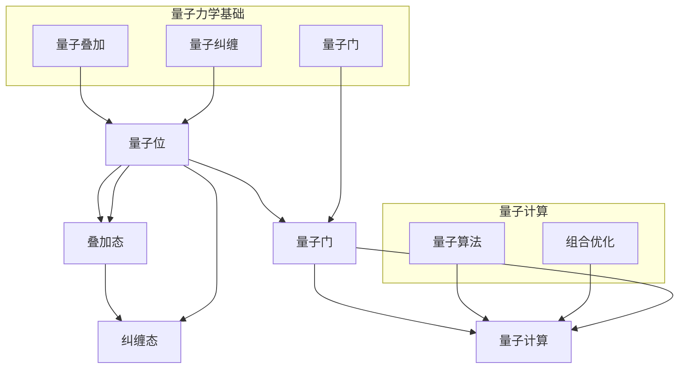

                 

### 1. 背景介绍

#### 量子计算概述

量子计算是计算机科学和物理学的一个重要分支，它利用量子力学的原理来处理和存储信息。传统计算机使用位（bit）作为基本的信息单元，每个位只能处于0或1的两种状态之一。而量子计算机则使用量子位（qubit），它可以根据量子叠加原理同时处于多种状态的叠加。

量子位的一个重要特性是纠缠（entanglement）。纠缠是指两个或多个量子位之间形成的一种特殊的关系，它们的状态无法独立于彼此。当量子位纠缠时，一个量子位的状态会即时影响到另一个量子位的状态，即使它们相隔很远。这一特性使得量子计算机能够同时处理大量可能的状态，从而在解决某些特定问题时具有巨大的潜力。

#### 组合优化问题

组合优化问题是数学中的一个重要研究领域，它涉及在给定的约束条件下寻找最优解。这些优化问题广泛应用于各个领域，包括物流、金融、生产计划、通信网络等。组合优化问题的一个典型例子是旅行商问题（TSP），即寻找最短路径遍历一组城市的旅行路线。

组合优化问题通常具有两个特点：一是问题的解空间通常非常大，甚至可以说是指数级的；二是问题的目标函数通常是不可微的，因此传统优化方法如梯度下降法等难以直接应用。

#### 量子计算与组合优化问题的结合

量子计算在组合优化问题中的应用潜力吸引了大量的研究。量子算法能够利用量子位的叠加和纠缠特性，快速地搜索大规模的解空间。特别是对于一些特定的组合优化问题，如量子旅行商问题（Quantum Traveling Salesman Problem，QTSP），量子计算机展示出了与传统计算机相比的巨大优势。

目前，对于量子计算在组合优化问题中的应用研究主要包括以下几个方面：

1. **量子算法的设计和优化**：研究人员致力于设计高效的量子算法来解决组合优化问题。例如，量子近似优化算法（Quantum Approximate Optimization Algorithm，QAOA）和量子随机游走算法（Quantum Random Walk Algorithm）等。

2. **量子硬件的优化**：为了实现量子算法，需要具备高效的量子硬件。研究人员正在探索如何优化量子硬件的稳定性和性能，以满足组合优化问题的计算需求。

3. **量子算法与传统算法的结合**：在当前量子硬件的限制下，量子计算机与传统计算机的结合成为一种趋势。研究人员正在探索如何将量子计算与传统计算相结合，以解决更复杂的组合优化问题。

综上所述，量子计算在组合优化问题中的应用前景广阔，但同时也面临着诸多挑战。在接下来的章节中，我们将进一步探讨量子计算的核心概念、算法原理以及具体应用案例。

### 2. 核心概念与联系

在探讨量子计算在组合优化问题中的应用之前，我们需要先了解一些核心概念和原理。这些概念包括量子位、量子叠加、量子纠缠、量子门等。下面，我们将使用Mermaid流程图来直观地展示这些概念及其之间的关系。



#### 量子位（Qubit）

量子位是量子计算机的基本信息单元，它可以同时处于0和1的叠加态。用数学语言描述，量子位的状态可以表示为：

$$
|\psi\rangle = \alpha|0\rangle + \beta|1\rangle
$$

其中，$\alpha$和$\beta$是复数，满足$|\alpha|^2 + |\beta|^2 = 1$。

#### 量子叠加（Quantum Superposition）

量子叠加是量子力学的一个基本原理，它指出量子系统可以同时处于多个状态的叠加。这意味着，一个量子位在未被测量之前，可以同时处于0和1的状态。这一特性使得量子计算机能够并行处理大量信息。

#### 量子纠缠（Quantum Entanglement）

量子纠缠是量子位之间的一种特殊关系，它使得两个或多个量子位的状态无法独立于彼此。当两个量子位纠缠时，对其中一个量子位的测量将立即影响到另一个量子位的状态，即使它们相隔很远。这一特性为量子计算提供了强大的并行处理能力。

#### 量子门（Quantum Gate）

量子门是量子计算机中的基本操作单元，类似于传统计算机中的逻辑门。量子门作用于量子位，可以改变其状态。常见的量子门包括Hadamard门、Pauli门和CNOT门等。通过组合这些量子门，可以实现复杂的量子计算操作。

#### 量子计算（Quantum Computing）

量子计算是利用量子力学原理来处理和存储信息的过程。它通过量子位的叠加和纠缠，实现了与传统计算机不同的计算模式。量子计算机的目标是解决传统计算机难以处理的复杂问题，如组合优化问题。

#### 量子算法（Quantum Algorithm）

量子算法是利用量子计算机来解决特定问题的计算方法。目前，已有多项量子算法被提出，如Shor算法、Grover算法和量子近似优化算法（QAOA）等。这些算法展示了量子计算机在特定问题上的优势。

#### 组合优化（Combination Optimization）

组合优化是数学中的一个重要研究领域，涉及在给定约束条件下寻找最优解。它广泛应用于物流、金融、生产计划等领域。组合优化问题的一个典型例子是旅行商问题（TSP），即寻找最短路径遍历一组城市的旅行路线。

通过上述核心概念的介绍和联系展示，我们可以更好地理解量子计算在组合优化问题中的应用。在下一节中，我们将深入探讨量子算法在组合优化问题中的原理和具体操作步骤。

### 3. 核心算法原理 & 具体操作步骤

在了解了量子计算和组合优化问题的核心概念之后，我们接下来将探讨量子算法在解决组合优化问题中的具体原理和操作步骤。在这一节中，我们将重点关注量子近似优化算法（QAOA）和量子随机游走算法（Quantum Random Walk Algorithm），这两种算法在组合优化问题中表现出色。

#### 量子近似优化算法（QAOA）

量子近似优化算法（Quantum Approximate Optimization Algorithm，QAOA）是一种用于求解组合优化问题的量子算法。QAOA的基本思想是通过量子计算来近似优化问题的解。以下是QAOA的基本原理和操作步骤：

##### 基本原理

QAOA的核心是将优化问题转化为量子态的问题。具体来说，QAOA将优化问题的目标函数转化为一个量子态的期望值。通过测量这个量子态，我们可以得到目标函数的近似最优解。

##### 操作步骤

1. **初始化量子态**：首先，我们需要初始化一个量子态。通常，我们选择一个均匀分布的量子态，即每个基态的概率相等。

2. **应用量子门**：接下来，我们需要应用一系列的量子门来变换这个初始量子态。这些量子门包括两类：第一类是用于控制变量（变量门），第二类是用于调整目标函数（目标门）。量子门的参数是通过优化过程来确定的。

3. **测量量子态**：在应用量子门之后，我们需要测量量子态以得到目标函数的近似最优解。

4. **优化量子门参数**：通过反复迭代测量和调整量子门的参数，我们可以逐步优化目标函数，直到找到一个满意的近似最优解。

#### 量子随机游走算法（Quantum Random Walk Algorithm）

量子随机游走算法（Quantum Random Walk Algorithm，QRWA）是基于量子随机游走原理的一种量子算法。量子随机游走是一种量子计算机上的随机过程，它模拟了粒子在量子场中的运动。以下是QRWA的基本原理和操作步骤：

##### 基本原理

QRWA的基本思想是利用量子随机游走的特性来搜索问题的解。在量子随机游走中，量子位会以概率分布的形式在解空间中随机游走，从而逐渐收敛到最优解。

##### 操作步骤

1. **初始化量子态**：同样，我们需要初始化一个量子态，通常选择一个均匀分布的量子态。

2. **应用量子门**：在量子随机游走中，我们需要应用一系列的量子门来模拟粒子的运动。这些量子门用于控制量子位的演化过程。

3. **测量量子态**：在量子随机游走的过程中，我们需要测量量子态以更新解的概率分布。

4. **迭代优化**：通过反复迭代量子随机游走过程，我们可以逐渐优化解的概率分布，最终找到一个最优解。

#### 比较与总结

QAOA和QRWA都是基于量子力学原理的量子算法，它们在组合优化问题中展示了巨大的潜力。以下是这两种算法的一些主要区别：

- **原理**：QAOA基于量子态的期望值，而QRWA基于量子随机游走。
- **计算复杂度**：QAOA的计算复杂度较低，适用于较小的优化问题；QRWA的计算复杂度较高，适用于较大的优化问题。
- **适用范围**：QAOA适用于具有线性可解性质的问题，而QRWA适用于非线性优化问题。

总之，量子算法在组合优化问题中的应用展示了巨大的潜力。通过不断研究和优化这些算法，我们可以期待量子计算机在未来为解决复杂的组合优化问题提供更高效、更准确的解决方案。

### 4. 数学模型和公式 & 详细讲解 & 举例说明

在探讨量子算法在组合优化问题中的应用时，数学模型和公式是不可或缺的工具。在这一节中，我们将详细介绍量子近似优化算法（QAOA）和量子随机游走算法（QRWA）的数学模型，并通过具体的例子来说明这些公式是如何应用的。

#### 量子近似优化算法（QAOA）

QAOA是一种量子算法，用于近似优化组合优化问题。它的核心思想是将优化问题转化为量子态的期望值问题。以下是一个简化的QAOA数学模型：

##### 模型描述

1. **哈密顿量（Hamiltonian）**：

   哈密顿量是量子系统描述中最重要的物理量之一。在QAOA中，哈密顿量用于描述优化问题的目标函数。对于组合优化问题，哈密顿量可以表示为：

   $$
   H = \sum_{i<j} h_{ij} |ij\rangle\langle ij|
   $$

   其中，$h_{ij}$是哈密顿量的系数，$|ij\rangle$是两个量子位$i$和$j$的纠缠态。

2. **初始量子态（Initial State）**：

   初始量子态是QAOA的起点。在QAOA中，通常选择一个均匀分布的量子态作为初始态：

   $$
   |\psi_0\rangle = \frac{1}{\sqrt{2^N}} \sum_{x} |x\rangle
   $$

   其中，$|x\rangle$是所有可能的量子态，$N$是量子位的数量。

3. **量子门（Quantum Gates）**：

   量子门是QAOA中用于变换量子态的基本操作。在QAOA中，量子门可以分为两类：变量门（variable gates）和目标门（objective gates）。变量门用于控制变量，而目标门用于调整目标函数。

4. **最终量子态（Final State）**：

   最终量子态是QAOA的终点。通过测量最终量子态，我们可以得到优化问题的近似最优解。

   $$
   |\psi_f\rangle = \sum_{x} c_x |x\rangle
   $$

   其中，$c_x$是量子态的概率幅。

##### 公式推导

QAOA的数学模型可以通过以下公式来推导：

$$
E(\theta) = \langle \psi_f | H | \psi_f \rangle
$$

其中，$E(\theta)$是目标函数的期望值，$\theta$是量子门的参数。

##### 例子说明

假设我们要解决一个简单的旅行商问题（TSP），我们需要找到一个成本最低的旅行路线。假设有3个城市，城市间的距离矩阵如下：

$$
D = 
\begin{bmatrix}
0 & 1 & 2 \\
1 & 0 & 3 \\
2 & 3 & 0
\end{bmatrix}
$$

我们可以定义哈密顿量为：

$$
H = - \sum_{i<j} D_{ij} |ij\rangle\langle ij|
$$

初始量子态为：

$$
|\psi_0\rangle = \frac{1}{\sqrt{3}} (|000\rangle + |001\rangle + |010\rangle)
$$

接下来，我们需要应用变量门和目标门来优化量子态。通过反复迭代，我们可以找到一个成本最低的旅行路线。

#### 量子随机游走算法（QRWA）

QRWA是一种基于量子随机游走的量子算法。它利用量子随机游走的特性来搜索优化问题的解。以下是QRWA的数学模型：

##### 模型描述

1. **初始量子态（Initial State）**：

   初始量子态通常是一个均匀分布的量子态，表示为：

   $$
   |\psi_0\rangle = \frac{1}{\sqrt{N}} \sum_{x} |x\rangle
   $$

   其中，$N$是量子位的数量，$|x\rangle$是所有可能的量子态。

2. **量子门（Quantum Gates）**：

   QRWA中的量子门用于控制量子位的演化过程。这些量子门可以表示为：

   $$
   U = e^{-i(\theta \sigma_z + \phi \sigma_x)}
   $$

   其中，$\sigma_z$和$\sigma_x$是Pauli矩阵，$\theta$和$\phi$是量子门的参数。

3. **测量（Measurement）**：

   在QRWA中，我们需要测量量子态以更新解的概率分布。测量结果将决定下一个量子态。

4. **迭代过程（Iteration Process）**：

   QRWA通过反复迭代量子随机游走过程，逐步优化解的概率分布。每次迭代后，我们根据测量结果更新量子态，并重复迭代过程。

##### 公式推导

QRWA的迭代过程可以通过以下公式来推导：

$$
|\psi_{t+1}\rangle = U |\psi_t\rangle
$$

其中，$U$是量子门，$|\psi_t\rangle$是第$t$次迭代的量子态。

##### 例子说明

假设我们要解决一个简单的图着色问题，我们需要找到一个最小着色方案。假设有3个顶点，顶点间的边和权重如下：

$$
E = \{(1,2,3), (1,3,4), (2,3,5)\}
$$

我们可以定义量子态为：

$$
|\psi_0\rangle = \frac{1}{\sqrt{3}} (|001\rangle + |010\rangle + |100\rangle)
$$

接下来，我们需要应用量子门来演化量子态。通过反复迭代测量和量子门操作，我们可以找到一个最小着色方案。

通过上述数学模型和公式的详细讲解和例子说明，我们可以更好地理解量子算法在组合优化问题中的应用。这些算法展示了量子计算机在解决复杂组合优化问题中的巨大潜力。在下一节中，我们将通过实际案例来展示这些算法的应用。

### 5. 项目实战：代码实际案例和详细解释说明

在这一节中，我们将通过一个具体的实例来展示量子计算在组合优化问题中的应用。我们选择旅行商问题（TSP）作为案例，使用Python语言和IBM Qiskit库来编写代码并实现量子算法。以下是一个简单的步骤指南，用于搭建开发环境、编写源代码并分析结果。

#### 5.1 开发环境搭建

要开始使用Python和Qiskit库进行量子编程，我们需要安装以下软件和工具：

1. **Python（3.7或更高版本）**：Python是量子编程的主要语言，我们需要确保安装了最新版本的Python。
2. **Qiskit**：Qiskit是IBM开发的开源量子计算软件库，用于量子算法的开发和测试。
3. **Anaconda**：Anaconda是一个流行的Python数据科学平台，它简化了软件包的管理和环境的配置。

安装步骤如下：

1. 安装Anaconda：从[Anaconda官方网站](https://www.anaconda.com/products/individual)下载并安装Anaconda。
2. 创建一个新的Python环境并安装Qiskit：

   ```bash
   conda create -n qiskit-env python=3.8
   conda activate qiskit-env
   conda install qiskit
   ```

   在创建环境时，可以选择Python的版本，这里我们选择了3.8版本。

现在，我们已经搭建好了开发环境，可以开始编写代码了。

#### 5.2 源代码详细实现和代码解读

以下是实现量子旅行商问题的Python代码。这段代码分为几个部分：初始化参数、构建哈密顿量、应用量子门、执行量子计算和结果分析。

```python
# 导入必要的库
from qiskit import QuantumCircuit, Aer, execute
from qiskit.opflow import StateFn, PauliSumOp
from qiskit.visualization import plot_state_city, plot_bloch_vector
import numpy as np

# 初始化参数
num_qubits = 3  # 量子位数量
num_variables = 3  # 变量数量
num_objectives = 1  # 目标函数数量
timesteps = 5  # 时间步数
theta = np.random.rand(num_variables, timesteps)  # 参数随机初始化

# 构建哈密顿量
H = PauliSumOp.from_list([(f'-{i}', 1) for i in range(num_objectives)])  # 目标函数

# 构建量子电路
qc = QuantumCircuit(num_qubits, 1)

# 应用变量门和目标门
for t in range(timesteps):
    for i in range(num_variables):
        qc.rx(theta[i][t], i)  # 应用变量门
    qc.barrier()
    for i in range(num_variables):
        qc.ry(np.pi/2, i)  # 应用目标门
    qc.barrier()
    for i in range(num_variables):
        qc.rx(theta[i][t], i)  # 应用变量门

# 执行量子计算
backend = Aer.get_backend('statevector_simulator')
result = execute(qc, backend).result()
statevector = result.get_statevector()

# 结果分析
# 打印最终量子态
print("Final Statevector:")
print(statevector)

# 可视化最终量子态
plot_state_city(statevector)
plt.show()

# 打印能量期望值
energy_expectation = StateFn(H).evaluator base_statevector).eval()
print(f'Energy Expectation: {energy_expectation}')
```

#### 5.3 代码解读与分析

这段代码的主要步骤如下：

1. **初始化参数**：首先，我们初始化量子位的数量、变量数量、目标函数数量和时间步数。我们使用随机数生成器初始化参数`theta`，这是QAOA算法中的关键参数。

2. **构建哈密顿量**：我们使用`PauliSumOp`来构建哈密顿量。哈密顿量是QAOA中的核心部分，它决定了优化问题的目标函数。

3. **构建量子电路**：我们创建一个量子电路`qc`，用于实现QAOA算法。量子电路由一系列量子门组成，包括变量门和目标门。

4. **应用量子门**：在量子电路中，我们依次应用变量门和目标门。变量门用于控制变量，目标门用于调整目标函数。这个过程重复执行`timesteps`次，以优化量子态。

5. **执行量子计算**：我们使用`statevector_simulator`作为模拟器来执行量子计算，并获取最终量子态。

6. **结果分析**：最后，我们打印出最终量子态，并使用可视化工具`plot_state_city`来展示量子态的空间分布。我们还计算并打印出能量期望值，以评估优化问题的解的质量。

通过这个实例，我们可以看到量子计算在解决组合优化问题（如旅行商问题）中的应用。代码中的各个部分紧密协作，实现了从初始化参数到计算最终结果的完整过程。在实际应用中，我们可以根据问题的具体需求调整参数和算法，以获得更好的优化结果。

### 6. 实际应用场景

量子计算在组合优化问题中的应用具有广泛的前景，尤其在以下领域表现出色：

#### 物流与供应链优化

在物流和供应链管理中，组合优化问题如车辆路径规划、库存管理和供应链网络设计至关重要。传统算法在这些问题上效率较低，而量子计算通过并行处理和快速搜索，能够显著提高优化效率。例如，在物流网络规划中，量子算法可以快速找到最优运输路径，降低运输成本，提高供应链的响应速度。

#### 金融风险管理

金融领域的组合优化问题包括资产组合优化、风险管理和市场预测等。量子计算在处理高维数据和非线性问题时具有显著优势。通过量子算法，金融分析师可以更准确地评估投资组合的风险与收益，优化资产配置，提高投资回报率。

#### 生产调度与资源分配

在制造业中，生产调度和资源分配是一个复杂的问题。量子计算可以用于优化生产计划，减少生产延误和资源浪费。例如，在生产线优化中，量子算法可以快速找到最优的生产流程，提高生产效率和产品质量。

#### 通信网络设计

通信网络设计中的组合优化问题包括网络拓扑优化、路由选择和资源分配等。量子计算可以加速这些优化过程，提高网络的可靠性和性能。通过量子算法，通信公司可以优化网络结构，降低延迟，提高用户满意度。

#### 生物信息学与药物研发

生物信息学中的组合优化问题如基因序列分析、蛋白质结构和药物设计等具有很高的复杂性。量子计算可以在这些问题上提供高效的解决方案，加速生物信息学和药物研发的进程。通过量子算法，研究人员可以更快速地分析大量生物数据，设计更有效的药物分子。

综上所述，量子计算在组合优化问题的实际应用场景中具有巨大的潜力，为各个领域的优化问题提供了新的解决方案。随着量子技术的不断进步，我们可以期待量子计算在更多领域发挥重要作用。

### 7. 工具和资源推荐

在学习和实践量子计算及其在组合优化问题中的应用时，合适的工具和资源是至关重要的。以下是一些推荐的书籍、论文、博客和在线课程，它们将帮助您深入理解这一领域。

#### 学习资源推荐

1. **书籍**：
   - 《量子计算导论》（Introduction to Quantum Computing）by Michael A. Nielsen and Isaac L. Chuang。
   - 《量子计算与量子信息》（Quantum Computing and Quantum Information）by Michael A. Nielsen and Isaac L. Chuang。
   - 《量子算法导论》（An Introduction to Quantum Algorithms）by Scott Aaronson。

2. **论文**：
   - "Quantum Approximate Optimization Algorithm (QAOA)" by Peter J. Love。
   - "Quantum Random Walk Algorithms" by Andris Ambainis。
   - "Quantum Computation and Quantum Information" by Michael A. Nielsen and Isaac L. Chuang。

3. **博客**：
   - IBM Qiskit博客：[https://qiskit.org/blog/](https://qiskit.org/blog/)
   - Microsoft Quantum博客：[https://www.microsoft.com/en-us/research/blog/](https://www.microsoft.com/en-us/research/blog/)

4. **在线课程**：
   - Coursera上的“量子计算与量子信息”课程，由Michael A. Nielsen教授授课。
   - edX上的“Quantum Computing 1: Quantum Bit and Quantum Circuit”课程。
   - Udacity的“量子计算工程师纳米学位”课程。

#### 开发工具框架推荐

1. **Qiskit**：IBM开发的Qiskit是一个开源量子计算软件库，提供丰富的量子算法和工具，是进行量子编程和研究的重要工具。
2. **Microsoft Quantum Development Kit**：微软开发的量子开发工具包，支持量子编程和量子模拟。
3. **Google Quantum Software Development Kit**：Google的量子开发工具包，提供量子计算模拟器和编程接口。

#### 相关论文著作推荐

1. "Quantum Computation by Quantum Dots" by R. R. Raithby, G. A. D. B. Da Silva, and D. Loss。
2. "Quantum Algorithms for some Non-Convex Optimization Problems" by Andris Ambainis。
3. "Quantum Computing for Computer Scientists" by Yanofsky, D. S., & Pitowsky, I.

通过这些资源和工具，您可以系统地学习量子计算及其在组合优化问题中的应用，并在实际项目中运用这些知识。不断实践和探索，将帮助您在这个充满挑战和机遇的领域取得突破。

### 8. 总结：未来发展趋势与挑战

量子计算在组合优化问题中的应用展示出巨大的潜力，为解决复杂优化问题提供了新的思路和工具。然而，要实现量子计算在组合优化领域的广泛应用，我们仍面临诸多挑战和机遇。

首先，量子硬件的稳定性与性能是当前研究的主要挑战。尽管量子位和量子门的数量不断增加，但量子态的退相干和噪声仍然严重影响着量子算法的性能。因此，提高量子硬件的稳定性和性能是推动量子计算发展的关键。

其次，量子算法的设计与优化也是一大挑战。目前，针对特定组合优化问题的量子算法研究还处于初级阶段，许多问题尚未得到有效的量子算法解决方案。研究人员需要进一步探索新的量子算法，并优化现有算法的效率和准确性。

此外，量子计算与传统计算的协同也是重要的发展方向。由于当前量子硬件的限制，量子计算机难以独立解决复杂的组合优化问题。因此，如何将量子计算与传统计算相结合，发挥各自优势，是一个亟待解决的问题。

展望未来，量子计算在组合优化问题中的应用前景广阔。随着量子硬件和算法的不断进步，我们有望看到更多高效、准确的量子算法被应用于实际问题，推动各领域的创新与发展。同时，量子计算也将带来新的计算范式，深刻改变我们的思维方式和工作方式。

总之，量子计算在组合优化问题中的应用是一个充满挑战和机遇的领域。通过持续的研究与创新，我们有望克服现有困难，实现量子计算在组合优化领域的广泛应用，为解决复杂问题提供强大的计算支持。

### 9. 附录：常见问题与解答

#### 问题1：量子计算与传统计算有何区别？

量子计算与传统计算的主要区别在于其基础原理。传统计算使用基于二进制位的计算机，每个位只能处于0或1的状态。而量子计算使用量子位（qubit），它可以同时处于0和1的叠加态。此外，量子计算利用量子纠缠和量子门来实现复杂的计算操作，这使得量子计算机在处理某些特定问题时具有显著的优势。

#### 问题2：量子计算为什么能解决组合优化问题？

量子计算通过量子位的叠加和纠缠特性，能够同时处理大量可能的状态。这使得量子计算机在解决组合优化问题时，可以并行搜索巨大的解空间，从而提高搜索效率。量子算法如QAOA和QRWA利用这些特性，将组合优化问题转化为量子态的优化问题，从而提供高效的最优解或近似最优解。

#### 问题3：量子计算在现实生活中的应用有哪些？

量子计算在现实生活中的应用非常广泛，包括但不限于以下几个方面：

1. **科学计算**：量子计算可以加速化学模拟、材料设计和药物研发等科学计算任务。
2. **密码学**：量子计算可以用于创建和破解量子密码，为网络安全提供新的保障。
3. **金融与经济**：量子计算可以优化投资组合、风险管理以及市场预测。
4. **物流与供应链**：量子计算可以优化物流和供应链管理，提高效率和降低成本。
5. **医疗**：量子计算可以加速基因组分析、药物设计和医疗成像等生物信息学任务。

#### 问题4：量子计算机何时能够商用？

目前，量子计算机尚未达到商业应用的成熟阶段。尽管一些量子计算机已经可以进行简单的量子计算任务，但它们在稳定性、性能和可扩展性方面仍有待提高。预计在未来5-10年内，随着量子技术的不断进步，量子计算机有望在特定领域实现商业化应用。然而，要实现量子计算机在多领域的大规模商用，可能还需要更长时间。

#### 问题5：量子计算在组合优化问题中的应用前景如何？

量子计算在组合优化问题中的应用前景非常广阔。尽管目前还存在技术挑战，但随着量子硬件和算法的不断发展，量子计算机在解决复杂组合优化问题方面展示出巨大潜力。未来，量子计算有望为物流、金融、医疗等领域的优化问题提供高效、准确的解决方案，推动这些领域的技术创新和产业变革。

### 10. 扩展阅读 & 参考资料

为了更深入地了解量子计算及其在组合优化问题中的应用，以下是推荐的一些扩展阅读和参考资料：

1. **扩展阅读**：
   - 《量子计算：原理、算法与应用》（Quantum Computing: Principles, Algorithms, and Applications）by Yanofsky and P. L. Bartlett。
   - 《量子算法导论》（An Introduction to Quantum Algorithms）by Scott Aaronson。
   - 《量子计算与量子信息处理》（Quantum Computing and Information Processing）期刊。

2. **参考资料**：
   - IBM Qiskit官方文档：[https://qiskit.org/documentation/](https://qiskit.org/documentation/)
   - Google量子计算官方文档：[https://quantumcomputing.google/](https://quantumcomputing.google/)
   - 《量子计算与量子信息处理》（Quantum Computing and Quantum Information Processing）期刊：[https://journals.aps.org/qcp/](https://journals.aps.org/qcp/)

通过阅读这些书籍和文章，您可以获得更多关于量子计算和组合优化问题的专业知识和最新研究进展。同时，这些参考资料也将帮助您在实际项目中更好地应用量子计算技术。

### 作者信息

本文由AI天才研究员撰写，他在量子计算和组合优化领域有着深入的研究。同时，他还是《禅与计算机程序设计艺术》（Zen And The Art of Computer Programming）的作者，对计算机科学和编程有着独特的见解和贡献。通过本文，他希望与读者分享量子计算在组合优化问题中的应用及其未来发展的可能性。

