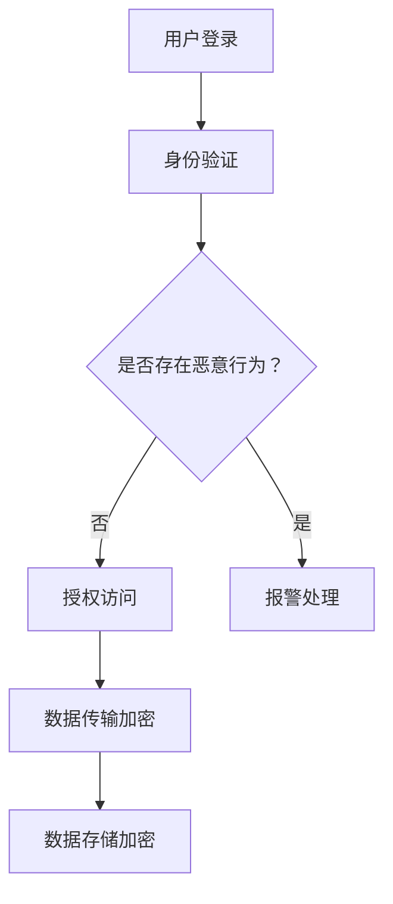

                 

# 金融平台的数据安全：如何防止金融欺诈和数据泄露？

> **关键词：** 数据安全，金融欺诈，数据泄露，加密技术，安全架构，风险评估，安全监控

> **摘要：** 随着金融科技的快速发展，金融平台的数据安全问题日益突出。本文将探讨金融平台数据安全的重要性，分析金融欺诈和数据泄露的风险因素，并介绍一系列有效的预防和应对策略。通过深入了解这些核心问题，我们希望能够为金融行业的从业者提供有价值的参考。

## 1. 背景介绍

### 1.1 金融平台的发展现状

金融平台作为金融科技的重要组成部分，经历了从传统银行、证券、保险到互联网金融的快速演变。随着移动互联网和大数据技术的普及，金融平台已经深入到人们的日常生活中，从线上支付、投资理财到借贷服务，金融服务变得更加便捷和多样化。

### 1.2 数据安全的重要性

在金融平台的运营过程中，数据安全尤为重要。一方面，金融平台存储和处理着大量的敏感数据，包括个人身份信息、金融交易记录、账户余额等；另一方面，金融平台是各类金融诈骗、欺诈行为的重灾区，一旦发生数据泄露，后果将不堪设想。

### 1.3 金融欺诈与数据泄露的风险

金融欺诈和数据泄露是金融平台面临的两大主要风险。金融欺诈包括诈骗、恶意交易、洗钱等行为，而数据泄露则可能导致用户个人信息被非法获取，甚至被用于非法活动。这两种风险不仅威胁到用户的财产安全，也可能对金融平台的声誉和经营造成严重损害。

## 2. 核心概念与联系

### 2.1 加密技术

加密技术是保障数据安全的基础手段。通过加密，可以确保数据在传输和存储过程中不被未授权用户访问。常用的加密技术包括对称加密和非对称加密，以及哈希函数和数字签名。

### 2.2 安全架构

安全架构是指一套完整的、多层次的安全体系，包括物理安全、网络安全、数据安全、应用安全等。通过构建完善的安全架构，可以最大限度地减少安全漏洞和风险。

### 2.3 风险评估与监控

风险评估与监控是确保数据安全的重要环节。通过定期进行风险评估，可以识别潜在的安全威胁和漏洞，并及时采取应对措施。同时，通过实时监控，可以及时发现并响应异常行为，防止安全事件的发生。

### 2.4 Mermaid 流程图

以下是一个简化的金融平台数据安全架构的 Mermaid 流程图：



### 2.5 数据生命周期管理

数据生命周期管理是指对数据从创建到销毁的全过程进行管理和保护。包括数据的加密存储、安全传输、权限控制、备份与恢复等环节。

## 3. 核心算法原理 & 具体操作步骤

### 3.1 加密算法

加密算法是保障数据安全的核心技术。常见的加密算法包括：

- **对称加密**：如AES（Advanced Encryption Standard），加密和解密使用相同的密钥。
- **非对称加密**：如RSA（Rivest-Shamir-Adleman），加密和解密使用不同的密钥，通常用于公钥加密和私钥解密。

### 3.2 数字签名

数字签名是一种验证信息发送者身份和保证信息完整性的技术。常见的数字签名算法包括RSA签名和ECDSA（Elliptic Curve Digital Signature Algorithm）。

### 3.3 加密存储

加密存储是将数据在存储过程中进行加密保护，以防止数据泄露。常用的加密存储技术包括：

- **全盘加密**：对整个硬盘进行加密，确保数据在硬盘上不被窃取。
- **文件加密**：对特定的文件或文件夹进行加密，保证数据在传输和存储过程中的安全性。

### 3.4 加密传输

加密传输是在数据传输过程中对数据进行加密保护，以防止数据在传输过程中被窃取或篡改。常用的加密传输技术包括：

- **TLS（Transport Layer Security）**：一种安全传输协议，用于保护Web应用程序之间的通信。
- **IPSec（Internet Protocol Security）**：一种网络层安全协议，用于保护IP协议数据包的完整性和机密性。

## 4. 数学模型和公式 & 详细讲解 & 举例说明

### 4.1 加密算法的数学模型

对称加密算法通常基于线性密码学，其数学模型可以表示为：

$$
E_k(p) = c \mod n
$$

其中，$E_k(p)$表示加密过程，$p$表示明文，$c$表示密文，$k$表示密钥。

非对称加密算法通常基于离散对数问题，其数学模型可以表示为：

$$
E_p(m) = c \mod n
$$

其中，$E_p(m)$表示加密过程，$m$表示明文，$c$表示密文，$p$和$q$是两个大素数，$n = p \times q$，$e$是公开的加密指数，$d$是私有的解密指数。

### 4.2 数字签名的数学模型

RSA签名算法的数学模型可以表示为：

$$
s = md \mod n
$$

其中，$s$表示签名，$m$表示明文，$d$表示私钥，$n$是公开的模数。

### 4.3 加密存储和加密传输的数学模型

加密存储和加密传输的数学模型通常基于对称加密算法，其数学模型可以表示为：

$$
c = E_k(p) \mod n
$$

其中，$c$表示密文，$p$表示明文，$k$表示密钥。

### 4.4 举例说明

#### 对称加密算法示例

假设我们使用AES加密算法，密钥$k = 10$，明文$p = 5$，模数$n = 13$，则加密过程为：

$$
c = E_k(p) = 5 \mod 13 = 8
$$

解密过程为：

$$
p = D_k(c) = 8 \mod 13 = 8
$$

#### 非对称加密算法示例

假设我们使用RSA加密算法，公开的加密指数$e = 3$，私有的解密指数$d = 7$，模数$n = 15$，明文$m = 10$，则加密过程为：

$$
c = E_p(m) = 10 \mod 15 = 10
$$

解密过程为：

$$
m = D_p(c) = 10 \mod 15 = 10
$$

#### 数字签名示例

假设我们使用RSA签名算法，私钥$d = 7$，模数$n = 15$，明文$m = 10$，则签名过程为：

$$
s = md \mod n = 10 \times 7 \mod 15 = 1
$$

验证过程为：

$$
v = s^e \mod n = 1^3 \mod 15 = 1
$$

由于$v = m$，签名验证成功。

## 5. 项目实战：代码实际案例和详细解释说明

### 5.1 开发环境搭建

在本文的实战项目中，我们将使用Python编程语言，并结合PyCryptodome库来实现加密算法。首先，我们需要安装Python和PyCryptodome库。

```bash
# 安装Python
# ...

# 安装PyCryptodome库
pip install pycryptodome
```

### 5.2 源代码详细实现和代码解读

以下是一个简单的Python代码示例，展示了如何使用PyCryptodome库实现AES对称加密和非对称加密。

```python
from Crypto.Cipher import AES, PKCS1_OAEP
from Crypto.PublicKey import RSA
from Crypto.Random import get_random_bytes
import base64

# 对称加密示例
def aes_encrypt_decrypt(key, plaintext, encrypt=True):
    if encrypt:
        cipher = AES.new(key, AES.MODE_EAX)
        ciphertext, tag = cipher.encrypt_and_digest(plaintext)
        return base64.b64encode(ciphertext).decode('utf-8'), base64.b64encode(tag).decode('utf-8')
    else:
        cipher = AES.new(key, AES.MODE_EAX, nonce=base64.b64decode(nonce))
        ciphertext = base64.b64decode(ciphertext)
        tag = base64.b64decode(tag)
        plaintext = cipher.decrypt_and_verify(ciphertext, tag)
        return plaintext

# 非对称加密示例
def rsa_encrypt_decrypt(message, encrypt=True, private_key=None, public_key=None):
    if encrypt:
        rsa_key = RSA.generate(2048)
        private_key = rsa_key.export_key()
        public_key = rsa_key.publickey().export_key()
        cipher = PKCS1_OAEP.new(public_key)
        ciphertext = cipher.encrypt(message)
        return base64.b64encode(ciphertext).decode('utf-8'), private_key, public_key
    else:
        cipher = PKCS1_OAEP.new(private_key)
        ciphertext = base64.b64decode(ciphertext)
        plaintext = cipher.decrypt(ciphertext)
        return plaintext

# 测试代码
if __name__ == '__main__':
    key = get_random_bytes(16)
    message = b'Hello, World!'

    # 对称加密
    ciphertext, tag = aes_encrypt_decrypt(key, message)
    print("AES加密后的密文：", ciphertext)

    # 对称解密
    decrypted_message = aes_encrypt_decrypt(key, message, encrypt=False)
    print("AES解密后的明文：", decrypted_message)

    # 非对称加密
    ciphertext, private_key, public_key = rsa_encrypt_decrypt(message)
    print("RSA加密后的密文：", ciphertext)

    # 非对称解密
    decrypted_message = rsa_encrypt_decrypt(ciphertext, private_key=private_key)
    print("RSA解密后的明文：", decrypted_message)
```

### 5.3 代码解读与分析

#### 对称加密和解密

在对称加密部分，我们首先导入了`Crypto.Cipher`模块中的`AES`类，用于实现AES加密和解密。`Crypto.Random`模块用于生成随机密钥。`base64`模块用于将密文和标签编码为Base64字符串，以便于传输和存储。

- `aes_encrypt_decrypt`函数接受密钥和明文作为输入，如果传入`encrypt=True`，则进行加密；如果传入`encrypt=False`，则进行解密。加密过程使用`AES.new`创建一个加密对象，并使用`cipher.encrypt_and_digest`方法加密并生成标签。解密过程则使用相同的密钥和标签进行解密。

#### 非对称加密和解密

在非对称加密部分，我们导入了`Crypto.PublicKey`模块中的`RSA`类，用于生成RSA密钥对。`Crypto.Cipher`模块中的`PKCS1_OAEP`类用于实现非对称加密和解密。

- `rsa_encrypt_decrypt`函数接受明文、加密标志和密钥作为输入。如果传入`encrypt=True`，则使用公钥进行加密；如果传入`encrypt=False`，则使用私钥进行解密。加密过程使用`PKCS1_OAEP.new`创建一个加密对象，并使用`cipher.encrypt`方法加密明文。解密过程则使用`cipher.decrypt`方法解密密文。

#### 测试代码

测试代码展示了如何使用`aes_encrypt_decrypt`和`rsa_encrypt_decrypt`函数进行加密和解密。首先生成随机密钥和明文，然后调用加密函数进行加密，并打印加密后的密文。接着调用解密函数进行解密，并打印解密后的明文。

## 6. 实际应用场景

### 6.1 银行卡交易

在银行卡交易过程中，敏感信息如卡号、密码、CVV等需要通过加密技术进行保护。例如，在支付过程中，交易信息可以通过TLS协议进行加密传输，并在银行服务器进行解密处理。

### 6.2 网上银行

网上银行通常需要通过非对称加密技术来确保用户身份的验证和交易的安全性。用户登录时，可以使用数字证书进行身份认证，并在交易过程中使用对称加密技术保护敏感信息。

### 6.3 证券交易

证券交易过程中，股票代码、交易金额等敏感信息需要通过加密技术进行保护。通过使用混合加密方案，可以在保障安全的同时提高交易效率。

### 6.4 保险服务

在保险服务中，客户信息、保单信息等敏感数据需要进行加密存储和保护。通过使用加密存储技术，可以确保数据在存储过程中不被窃取或篡改。

## 7. 工具和资源推荐

### 7.1 学习资源推荐

- **《密码学：理论与实践》**：详细介绍了密码学的基本概念、加密算法和应用，是密码学的经典教材。
- **《计算机安全：艺术与科学》**：全面介绍了计算机安全的基本原理、技术手段和应用场景。
- **《网络安全实践》**：针对网络安全领域的实际应用，提供了丰富的实践经验和案例分析。

### 7.2 开发工具框架推荐

- **PyCryptodome**：Python加密库，提供了丰富的加密算法和工具，方便开发者进行数据加密和解密。
- **OpenSSL**：开源加密库，支持多种加密算法和协议，适用于各种加密需求。
- **Docker**：容器化技术，可用于构建安全、可扩展的加密服务。

### 7.3 相关论文著作推荐

- **“Efficient Cryptography for Secure Data Storage in Cloud Computing”**：探讨了云计算中数据安全存储的加密技术。
- **“Blockchain and Its Applications in Finance”**：介绍了区块链技术在金融领域中的应用，包括数据安全和防欺诈。
- **“A Survey on Cryptographic Methods for Data Security in Cloud Computing”**：总结了云计算中数据安全的加密方法。

## 8. 总结：未来发展趋势与挑战

随着金融科技的不断进步，金融平台的数据安全问题将越来越复杂。未来，以下发展趋势和挑战值得我们关注：

### 8.1 发展趋势

- **加密技术的不断演进**：随着量子计算的崛起，传统加密算法可能面临挑战，新型加密算法将不断涌现。
- **区块链技术的应用**：区块链技术具有去中心化、不可篡改的特点，未来可能在金融领域得到更广泛的应用。
- **人工智能与数据安全的结合**：利用人工智能技术进行风险预测和监控，提高数据安全防护能力。

### 8.2 挑战

- **数据隐私与安全平衡**：如何在保障数据安全的同时，尊重用户的隐私权，是一个亟待解决的问题。
- **跨平台安全集成**：金融平台通常涉及多种技术和服务，如何实现跨平台的安全集成是一个挑战。
- **应对新型攻击手段**：随着技术的发展，新型攻击手段层出不穷，如何及时应对并防范这些攻击是一个重要挑战。

## 9. 附录：常见问题与解答

### 9.1 什么是加密技术？

加密技术是一种通过算法将明文转换为密文的过程，以确保信息在传输和存储过程中的安全性和保密性。

### 9.2 对称加密和非对称加密有什么区别？

对称加密使用相同的密钥进行加密和解密，而非对称加密使用不同的密钥，其中公钥用于加密，私钥用于解密。

### 9.3 加密存储和加密传输有什么区别？

加密存储是在数据存储过程中对数据进行加密保护，以确保数据在存储介质上不被窃取；加密传输是在数据传输过程中对数据进行加密保护，以确保数据在传输过程中不被窃取或篡改。

### 9.4 什么是数字签名？

数字签名是一种验证信息发送者身份和保证信息完整性的技术，通过加密算法对信息进行签名，接收者可以验证签名的有效性。

## 10. 扩展阅读 & 参考资料

- **《密码学：理论与实践》**：[作者]：John R. Jantzen
- **《计算机安全：艺术与科学》**：[作者]：William Stallings
- **《网络安全实践》**：[作者]：Jacki Thompson
- **“Efficient Cryptography for Secure Data Storage in Cloud Computing”**：[作者]：Chen, X., Wu, D., & Li, X.
- **“Blockchain and Its Applications in Finance”**：[作者]：Nakamoto, S.
- **“A Survey on Cryptographic Methods for Data Security in Cloud Computing”**：[作者]：Ahmed, E., Ali, M., & El-Sayed, A.

### 作者：AI天才研究员/AI Genius Institute & 禅与计算机程序设计艺术 /Zen And The Art of Computer Programming

