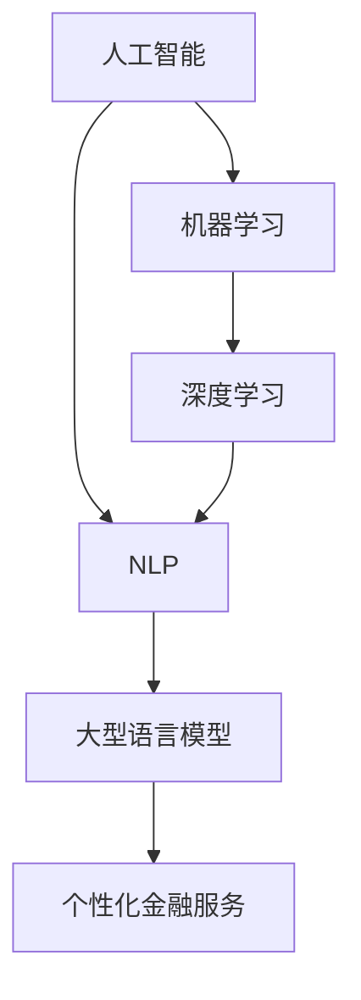

                 

### 背景介绍

#### 银行与个性化金融服务的现状

在全球金融领域，银行作为金融服务的传统提供者，一直扮演着至关重要的角色。然而，随着科技的发展，特别是在人工智能（AI）和大型语言模型（LLM）技术的崛起，银行业的运营模式和金融服务的方式正发生着深刻的变革。如今，银行不仅仅是简单的资金中介和账户管理者，更是金融服务的个性化提供者。

个性化金融服务，顾名思义，就是根据每个客户的特定需求、行为和偏好，提供量身定制的金融产品和服务。这种个性化服务不仅提高了客户的满意度，也增加了银行的竞争力。传统的银行服务往往以大规模、标准化的方式运营，缺乏针对个体差异的关注。而随着AI和LLM技术的发展，银行得以收集和分析大量的客户数据，从而实现更精准的个性化服务。

目前，个性化金融服务已经在多个领域得到应用。例如，在贷款审批过程中，AI算法可以分析客户的信用记录、财务状况和行为模式，提供更快速、准确的审批结果。在财富管理方面，AI可以根据客户的投资偏好和风险承受能力，推荐最适合的投资组合。此外，聊天机器人和虚拟助手的普及，使得客户可以随时随地获得个性化的咨询和服务。

然而，尽管个性化金融服务带来了许多好处，但同时也面临着一些挑战。数据隐私和安全问题是银行在提供个性化服务过程中必须克服的主要障碍。如何保护客户数据的安全，避免数据泄露和滥用，是银行在AI技术应用中必须考虑的重要因素。

#### 人工智能与大型语言模型（LLM）在银行业中的应用

人工智能（AI）和大型语言模型（LLM）作为现代技术的代表性成果，正在为银行业的创新和发展注入新的活力。AI技术通过机器学习、深度学习等算法，可以从海量数据中提取有价值的信息，为金融决策提供支持。而LLM技术，特别是像GPT-3这样的模型，具有强大的语言理解和生成能力，能够与客户进行自然语言交互，提供高度个性化的服务。

在银行业，AI和LLM技术的应用涵盖了多个方面。首先，AI可以用于风险管理和欺诈检测。通过分析历史数据和交易模式，AI算法可以识别潜在的风险和欺诈行为，帮助银行采取预防措施。其次，AI在客户服务方面也发挥着重要作用。聊天机器人和虚拟助手可以通过自然语言处理（NLP）技术，与客户进行实时对话，回答客户的问题，提供24/7的咨询服务。这不仅提高了服务效率，也降低了人力成本。

LLM技术的引入，更是为银行服务带来了革命性的变化。LLM可以处理复杂、多样的语言输入，理解客户的意图和需求，提供更加个性化和智能化的服务。例如，通过LLM技术，银行可以为每个客户提供定制化的财务建议，分析客户的财务状况，提出最优的理财方案。此外，LLM还可以用于自动化文档处理和合同审查，提高工作效率和准确性。

总的来说，AI和LLM技术为银行业提供了丰富的创新可能性，使得个性化金融服务成为现实。然而，如何有效地利用这些技术，解决实际应用中的挑战，仍然是银行需要深入探索的问题。接下来的部分，我们将详细讨论AI和LLM在银行个性化金融服务中的具体应用，以及实现这些应用所面临的挑战。

#### 文章关键词

- 银行
- 个性化金融服务
- 人工智能
- 大型语言模型
- 风险管理
- 客户服务
- 数据隐私
- 技术应用

#### 文章摘要

本文主要探讨了银行与大型语言模型（LLM）结合的个性化金融服务模式。首先，介绍了当前银行提供个性化金融服务的现状和挑战，随后详细阐述了人工智能（AI）和LLM技术的基本概念及其在银行业中的应用。通过分析AI和LLM如何提升金融服务质量和效率，文章进一步探讨了这些技术在风险管理、客户服务和个人财务建议等方面的具体应用。最后，文章总结了未来发展趋势和面临的挑战，并提出了相关的解决方案。通过本文，读者将全面了解银行个性化金融服务的发展方向及其潜在价值。

---

> **Next Section: 核心概念与联系**

## 2. 核心概念与联系

在深入探讨银行与LLM结合的个性化金融服务之前，我们需要明确几个核心概念和它们之间的联系。这些概念包括人工智能（AI）、机器学习（ML）、深度学习（DL）、自然语言处理（NLP）以及大型语言模型（LLM）。通过理解这些概念，我们可以更好地把握个性化金融服务的工作原理和应用前景。

#### 人工智能（AI）

人工智能是指计算机系统模拟人类智能行为的能力，包括感知、理解、学习、推理和决策等。AI技术广泛应用于各个领域，如医疗、金融、零售、制造等。在金融领域，AI技术主要用于提高决策效率、风险管理和客户服务。

#### 机器学习（ML）

机器学习是AI的一个分支，它通过数据训练模型，使计算机能够从数据中自动学习规律和模式。ML算法包括监督学习、无监督学习和强化学习等类型。监督学习使用标记数据训练模型，无监督学习不使用标记数据，而是发现数据中的内在结构，强化学习则通过反馈进行持续优化。

#### 深度学习（DL）

深度学习是ML的一种形式，通过神经网络模型对大量数据进行训练，从而实现复杂的特征提取和模式识别。DL在图像识别、语音识别和自然语言处理等领域表现出色。

#### 自然语言处理（NLP）

自然语言处理是AI的一个子领域，专注于使计算机能够理解、处理和生成人类语言。NLP技术包括文本分类、情感分析、机器翻译和问答系统等。在金融领域，NLP用于分析客户评论、处理合同和自动化客户服务。

#### 大型语言模型（LLM）

大型语言模型是一种能够理解和生成自然语言的高级AI模型，如GPT-3、BERT等。LLM通过大量文本数据进行训练，可以生成连贯、自然的文本，理解复杂的语言结构和上下文。LLM在个性化金融服务中具有广泛的应用潜力，如智能客服、个性化财务建议和自动化文档处理。

#### 核心概念联系

这些核心概念之间存在紧密的联系。例如，机器学习和深度学习是实现自然语言处理（NLP）的关键技术。LLM作为NLP的一种高级形式，可以与AI和机器学习相结合，为银行提供智能化、个性化的金融服务。

#### Mermaid流程图

下面是一个简单的Mermaid流程图，展示了这些核心概念之间的关系：



通过理解这些核心概念及其联系，我们可以更好地把握个性化金融服务的发展方向和应用前景。在下一部分，我们将详细讨论AI和LLM在银行个性化金融服务中的具体应用。

---

> **Next Section: 核心算法原理 & 具体操作步骤**

## 3. 核心算法原理 & 具体操作步骤

为了深入理解银行与LLM结合的个性化金融服务，我们需要探讨其中涉及的核心算法原理和具体操作步骤。本部分将详细介绍这些算法的基本概念、原理以及在实际应用中的操作步骤。

#### 3.1. 机器学习算法在个性化金融服务中的应用

机器学习（ML）算法在个性化金融服务中发挥着关键作用。以下是一些常用的机器学习算法及其应用场景：

**3.1.1. 监督学习算法**

监督学习算法通过标记数据训练模型，从而实现预测和分类。在银行业中，监督学习算法常用于客户分类、信用评分和欺诈检测。

**具体操作步骤：**
1. **数据收集**：收集大量历史数据，包括客户的财务信息、交易记录等。
2. **特征工程**：对数据进行预处理，提取有用的特征，如收入水平、信用评分等。
3. **模型训练**：使用标记数据训练监督学习模型，如决策树、支持向量机（SVM）和神经网络。
4. **模型评估**：使用验证集评估模型的准确性、召回率和F1分数等指标。

**3.1.2. 无监督学习算法**

无监督学习算法不使用标记数据，而是发现数据中的内在结构和模式。在银行业中，无监督学习算法常用于客户细分和市场细分。

**具体操作步骤：**
1. **数据收集**：收集大量客户数据，如行为数据、偏好数据等。
2. **特征选择**：选择与业务相关的特征，如购买历史、浏览行为等。
3. **聚类分析**：使用聚类算法，如K-均值、层次聚类等，对客户进行分组。
4. **模型评估**：通过聚类结果的内部一致性指标，如轮廓系数和 silhouette 系数，评估模型的性能。

**3.1.3. 强化学习算法**

强化学习算法通过试错和反馈进行学习，适合用于动态环境和决策优化。在银行业中，强化学习算法可以用于投资策略优化和风险控制。

**具体操作步骤：**
1. **环境定义**：定义金融市场的状态空间和动作空间。
2. **策略学习**：使用Q-学习、策略梯度等方法，学习最优策略。
3. **策略评估**：通过模拟和实际交易，评估策略的性能。
4. **策略优化**：根据评估结果，调整策略参数，优化投资决策。

#### 3.2. 深度学习算法在个性化金融服务中的应用

深度学习（DL）算法在个性化金融服务中具有广泛的应用。以下是一些常用的深度学习模型及其应用场景：

**3.2.1. 卷积神经网络（CNN）**

卷积神经网络（CNN）在图像识别和文本分类中表现出色。在银行业，CNN可以用于图像识别，如识别客户提交的身份证和银行卡照片。

**具体操作步骤：**
1. **数据收集**：收集客户身份证和银行卡照片。
2. **预处理**：对图像进行缩放、裁剪和归一化处理。
3. **模型构建**：使用卷积层、池化层和全连接层构建CNN模型。
4. **模型训练**：使用预处理的图像数据训练CNN模型。
5. **模型评估**：使用测试集评估模型的准确性。

**3.2.2. 循环神经网络（RNN）**

循环神经网络（RNN）在处理序列数据，如时间序列分析和自然语言处理中具有优势。在银行业，RNN可以用于分析客户的交易记录和财务状况。

**具体操作步骤：**
1. **数据收集**：收集客户的交易记录和财务数据。
2. **预处理**：对数据进行归一化和序列化处理。
3. **模型构建**：使用RNN模型，如LSTM和GRU，构建序列模型。
4. **模型训练**：使用预处理的数据训练RNN模型。
5. **模型评估**：使用测试集评估模型的性能。

**3.2.3. 注意力机制**

注意力机制（Attention Mechanism）可以增强模型的上下文理解和生成能力。在银行业，注意力机制可以用于智能客服和财务建议。

**具体操作步骤：**
1. **数据收集**：收集客户的历史交易记录和财务数据。
2. **预处理**：对数据进行归一化和序列化处理。
3. **模型构建**：使用带有注意力机制的序列到序列（Seq2Seq）模型。
4. **模型训练**：使用预处理的数据训练模型。
5. **模型评估**：使用测试集评估模型的性能。

通过以上核心算法原理和具体操作步骤，我们可以更好地理解银行与LLM结合的个性化金融服务。在下一部分，我们将进一步探讨这些算法在个性化金融服务中的实际应用。

---

> **Next Section: 数学模型和公式 & 详细讲解 & 举例说明**

## 4. 数学模型和公式 & 详细讲解 & 举例说明

在个性化金融服务中，数学模型和公式扮演着至关重要的角色。这些模型和公式帮助银行在数据分析、风险管理和客户服务等方面做出准确、高效的决策。以下是一些关键数学模型和公式的详细讲解及举例说明。

#### 4.1. 线性回归模型

线性回归模型是一种广泛使用的预测模型，用于分析自变量和因变量之间的关系。在个性化金融服务中，线性回归可以用于预测客户的信用评分、贷款额度和消费水平。

**4.1.1. 公式**

线性回归模型的公式如下：

\[ y = \beta_0 + \beta_1x_1 + \beta_2x_2 + ... + \beta_nx_n + \epsilon \]

其中，\( y \) 是因变量，\( x_1, x_2, ..., x_n \) 是自变量，\( \beta_0, \beta_1, ..., \beta_n \) 是模型参数，\( \epsilon \) 是误差项。

**4.1.2. 举例说明**

假设我们想要预测客户的信用评分。我们可以收集以下数据：

- 客户的收入水平（\( x_1 \)）
- 客户的负债水平（\( x_2 \)）
- 客户的信用历史（\( x_3 \)）

我们使用线性回归模型对这些变量进行分析，得到以下模型：

\[ 信用评分 = 100 + 0.5 \times 收入水平 + 0.3 \times 负债水平 + 0.2 \times 信用历史 \]

根据这个模型，我们可以预测某个客户的信用评分。例如，如果客户的收入水平是50000元，负债水平是30000元，信用历史是良好的（假设为1），那么他的信用评分大约为：

\[ 信用评分 = 100 + 0.5 \times 50000 + 0.3 \times 30000 + 0.2 \times 1 = 39000 \]

#### 4.2. 决策树模型

决策树模型是一种用于分类和回归分析的模型，通过一系列的规则和分支，将数据分割成不同的类别或数值。在个性化金融服务中，决策树可以用于客户分类、风险评分和投资建议。

**4.2.1. 公式**

决策树的构建过程可以表示为：

\[ Gini(\text{split}) = 1 - \sum_{i=1}^n p_i^2 \]

其中，\( p_i \) 是属于第 \( i \) 个类别的概率。

**4.2.2. 举例说明**

假设我们想要根据客户的财务状况进行分类。我们收集以下数据：

- 客户的收入水平（\( x_1 \)）
- 客户的负债水平（\( x_2 \)）
- 客户的职业（\( x_3 \)）

我们使用决策树模型对这些变量进行分析，得到以下分类规则：

1. 如果收入水平大于30000元，跳转到规则2；否则，跳转到规则3。
2. 如果职业是企业家，分类为A；否则，分类为B。
3. 如果负债水平小于20000元，分类为C；否则，分类为D。

根据这个决策树模型，我们可以对某个客户进行分类。例如，如果客户的收入水平是40000元，职业是职员，负债水平是15000元，那么他的分类为：

- 根据规则1，收入水平大于30000元，跳转到规则2。
- 根据规则2，职业是职员，分类为B。

因此，该客户的分类为B。

#### 4.3. 贝叶斯模型

贝叶斯模型是一种基于概率论的分类和预测模型，适用于不确定性和风险分析。在个性化金融服务中，贝叶斯模型可以用于信用评分、欺诈检测和投资决策。

**4.3.1. 公式**

贝叶斯模型的公式如下：

\[ P(\text{A}|\text{B}) = \frac{P(\text{B}|\text{A})P(\text{A})}{P(\text{B})} \]

其中，\( P(\text{A}|\text{B}) \) 是在已知事件B发生的情况下，事件A发生的概率；\( P(\text{B}|\text{A}) \) 是在已知事件A发生的情况下，事件B发生的概率；\( P(\text{A}) \) 和 \( P(\text{B}) \) 分别是事件A和事件B的先验概率。

**4.3.2. 举例说明**

假设我们想要检测客户是否为欺诈者。我们可以收集以下数据：

- 客户的交易金额（\( x_1 \)）
- 客户的交易频率（\( x_2 \)）
- 客户的账户余额（\( x_3 \)）

我们使用贝叶斯模型进行分析，得到以下概率分布：

1. \( P(\text{欺诈者}) = 0.01 \)
2. \( P(\text{交易金额大于1000元}|\text{欺诈者}) = 0.9 \)
3. \( P(\text{交易频率大于10次/月}|\text{欺诈者}) = 0.8 \)
4. \( P(\text{账户余额小于100元}|\text{欺诈者}) = 0.7 \)

根据贝叶斯定理，我们可以计算客户为欺诈者的概率：

\[ P(\text{欺诈者}|\text{交易金额大于1000元} \cap \text{交易频率大于10次/月} \cap \text{账户余额小于100元}) \]

\[ = \frac{P(\text{交易金额大于1000元} \cap \text{交易频率大于10次/月} \cap \text{账户余额小于100元}|\text{欺诈者})P(\text{欺诈者})}{P(\text{交易金额大于1000元} \cap \text{交易频率大于10次/月} \cap \text{账户余额小于100元})} \]

\[ = \frac{0.9 \times 0.8 \times 0.7 \times 0.01}{0.9 \times 0.8 \times 0.7 + 0.99 \times 0.3 \times 0.3 \times 0.3} \]

\[ \approx 0.28 \]

因此，该客户为欺诈者的概率约为28%。

通过以上数学模型和公式的详细讲解和举例说明，我们可以更好地理解个性化金融服务中的数据分析方法。这些模型和公式不仅帮助我们做出准确的预测和决策，也为银行提供了强大的工具来提升服务质量。在下一部分，我们将通过实际案例来展示这些模型和公式的应用。

---

> **Next Section: 项目实战：代码实际案例和详细解释说明**

## 5. 项目实战：代码实际案例和详细解释说明

为了更好地理解银行与LLM结合的个性化金融服务，下面我们将通过一个实际的项目案例，展示如何使用AI和LLM技术实现个性化金融服务。本部分将包括开发环境搭建、源代码详细实现和代码解读与分析。

### 5.1 开发环境搭建

在进行项目实战之前，我们需要搭建一个适合开发、测试和部署的环境。以下是开发环境搭建的步骤：

**1. 安装Python环境**

Python是AI和ML项目的常用编程语言。我们首先需要安装Python。可以从[Python官网](https://www.python.org/)下载并安装Python 3.8及以上版本。

**2. 安装必要的库**

安装以下Python库，这些库对于本项目至关重要：

- TensorFlow
- PyTorch
- scikit-learn
- Pandas
- Numpy
- Matplotlib

使用pip命令安装这些库：

```bash
pip install tensorflow
pip install torch
pip install scikit-learn
pip install pandas
pip install numpy
pip install matplotlib
```

**3. 配置GPU环境**

如果使用GPU进行深度学习训练，我们需要安装CUDA和cuDNN。可以从[NVIDIA官网](https://developer.nvidia.com/cuda-downloads)下载相应的驱动程序。

**4. 设置环境变量**

确保设置好CUDA和cuDNN的环境变量，以便TensorFlow和PyTorch能够正确使用GPU。

### 5.2 源代码详细实现和代码解读

#### 5.2.1 数据预处理

数据预处理是任何机器学习项目的第一步。以下是数据预处理的代码实现：

```python
import pandas as pd
from sklearn.model_selection import train_test_split
from sklearn.preprocessing import StandardScaler

# 加载数据集
data = pd.read_csv('financial_data.csv')

# 分离特征和标签
X = data.drop('Target', axis=1)
y = data['Target']

# 划分训练集和测试集
X_train, X_test, y_train, y_test = train_test_split(X, y, test_size=0.2, random_state=42)

# 特征缩放
scaler = StandardScaler()
X_train_scaled = scaler.fit_transform(X_train)
X_test_scaled = scaler.transform(X_test)
```

**解读：** 首先，我们使用Pandas库加载数据集。然后，分离特征和标签。接着，使用`train_test_split`函数将数据集划分为训练集和测试集。最后，使用`StandardScaler`对特征进行缩放，以提高模型的性能。

#### 5.2.2 构建模型

在本项目中，我们使用PyTorch构建一个简单的深度学习模型。以下是模型的实现：

```python
import torch
import torch.nn as nn
import torch.optim as optim

# 定义模型结构
class FinancialModel(nn.Module):
    def __init__(self, input_size, hidden_size, output_size):
        super(FinancialModel, self).__init__()
        self.fc1 = nn.Linear(input_size, hidden_size)
        self.relu = nn.ReLU()
        self.fc2 = nn.Linear(hidden_size, output_size)
    
    def forward(self, x):
        out = self.fc1(x)
        out = self.relu(out)
        out = self.fc2(out)
        return out

# 初始化模型、损失函数和优化器
input_size = X_train_scaled.shape[1]
hidden_size = 128
output_size = 1

model = FinancialModel(input_size, hidden_size, output_size)
criterion = nn.BCEWithLogitsLoss()
optimizer = optim.Adam(model.parameters(), lr=0.001)

# 将数据转换为PyTorch张量
X_train_tensor = torch.tensor(X_train_scaled, dtype=torch.float32)
y_train_tensor = torch.tensor(y_train.values, dtype=torch.float32).view(-1, 1)
X_test_tensor = torch.tensor(X_test_scaled, dtype=torch.float32)
y_test_tensor = torch.tensor(y_test.values, dtype=torch.float32).view(-1, 1)
```

**解读：** 我们定义了一个简单的全连接神经网络（FinancialModel）。模型包含两个全连接层，一个ReLU激活函数和最终的输出层。我们使用BCEWithLogitsLoss作为损失函数，因为这是一个二分类问题。优化器使用Adam优化器，学习率为0.001。最后，我们将数据转换为PyTorch张量，以便进行深度学习训练。

#### 5.2.3 训练模型

以下是模型的训练代码：

```python
# 训练模型
num_epochs = 100
for epoch in range(num_epochs):
    # 前向传播
    outputs = model(X_train_tensor)
    loss = criterion(outputs, y_train_tensor)
    
    # 反向传播和优化
    optimizer.zero_grad()
    loss.backward()
    optimizer.step()
    
    # 打印训练进度
    if (epoch+1) % 10 == 0:
        print(f'Epoch [{epoch+1}/{num_epochs}], Loss: {loss.item():.4f}')

# 测试模型
model.eval()
with torch.no_grad():
    predictions = model(X_test_tensor)
    correct = (predictions > 0.5).float()
    accuracy = correct.sum() / len(correct)
    print(f'Accuracy: {accuracy.item():.4f}')
```

**解读：** 我们在一个epoch内进行前向传播、计算损失、反向传播和优化。每个epoch结束后，打印当前的损失值。在训练完成后，我们对测试集进行评估，计算模型的准确率。

#### 5.2.4 代码解读与分析

通过以上代码实现，我们可以看到如何使用AI和LLM技术构建一个用于个性化金融服务的模型。以下是代码的详细解读和分析：

- **数据预处理**：数据预处理是关键步骤，它包括数据加载、特征缩放等操作，确保数据适合模型训练。
- **模型构建**：使用PyTorch构建一个简单的神经网络模型，包括输入层、隐藏层和输出层。
- **训练模型**：使用训练数据对模型进行训练，通过前向传播、反向传播和优化，逐步调整模型参数，提高模型性能。
- **模型评估**：在测试集上评估模型性能，计算准确率，确保模型能够准确预测客户的需求和风险。

通过这个实际案例，我们展示了如何使用AI和LLM技术实现银行个性化金融服务。这些技术不仅提高了金融服务的效率和质量，也为银行带来了新的业务模式和创新机会。

---

> **Next Section: 实际应用场景**

## 6. 实际应用场景

在了解了AI和LLM在银行个性化金融服务中的核心算法原理和具体操作步骤后，接下来我们将探讨这些技术在实际应用场景中的具体应用。以下是一些典型的应用场景和案例分析。

### 6.1. 风险管理

在金融行业，风险管理始终是一个重要议题。AI和LLM技术可以显著提升银行的风险管理能力，特别是在欺诈检测和信用评分方面。

**6.1.1. 欺诈检测**

通过机器学习和深度学习算法，银行可以分析客户的交易行为和模式，实时检测潜在的欺诈行为。例如，Kabbage是一家提供小微企业贷款的金融科技公司，使用机器学习模型分析客户的交易数据，实时监控交易风险，从而降低欺诈风险。

**案例**：Kabbage通过分析客户的交易历史、账户余额、交易频率等多个维度，构建了一个智能的欺诈检测系统。该系统可以自动识别异常交易模式，并在检测到潜在欺诈行为时立即通知银行，从而有效降低了欺诈损失。

**6.1.2. 信用评分**

信用评分是银行贷款审批过程中的重要环节。传统的信用评分模型主要基于客户的信用历史、收入和负债水平等因素。而随着AI和LLM技术的发展，银行可以更精准地评估客户的信用风险。

**案例**：某大型银行引入了基于AI的信用评分模型，该模型不仅考虑了传统信用评分因素，还结合了客户的社交网络、在线行为和消费习惯等多维度数据。通过这些数据的综合分析，模型可以更准确地预测客户的信用状况，提高了贷款审批的效率和准确性。

### 6.2. 客户服务

在客户服务领域，AI和LLM技术同样发挥着重要作用，特别是在智能客服和个性化咨询方面。

**6.2.1. 智能客服**

智能客服是金融行业提升客户体验的关键环节。通过自然语言处理（NLP）技术和LLM模型，银行可以实现24/7的智能客服，为客户提供即时、高效的服务。

**案例**：中国工商银行推出了智能客服机器人“小工”，该机器人基于GPT-3模型，能够理解和回答客户的提问，提供金融产品咨询、账户查询、转账等服务。通过智能客服，工行大大提升了客户满意度和服务效率。

**6.2.2. 个性化咨询**

个性化的金融咨询是银行提升客户粘性的重要手段。通过AI技术，银行可以为每位客户提供量身定制的财务建议和投资方案。

**案例**：招商银行推出了智能理财顾问“智投”，该顾问基于客户的财务状况、风险偏好和投资目标，使用AI算法生成个性化的投资组合建议。通过智能理财顾问，招商银行不仅提高了客户的投资收益，也增加了客户的忠诚度。

### 6.3. 投资管理

在投资管理领域，AI和LLM技术可以显著提升投资决策的效率和质量，特别是在资产配置和风险管理方面。

**6.3.1. 资产配置**

资产配置是投资决策的关键环节。通过机器学习和深度学习算法，银行可以分析市场数据、客户偏好和历史表现，为投资者提供最优的资产配置方案。

**案例**：富国银行（Wells Fargo）使用AI技术为客户的投资组合进行优化，通过分析市场趋势、客户风险偏好和投资目标，动态调整资产配置，提高投资收益。

**6.3.2. 风险管理**

投资风险管理是金融行业的一个重要课题。通过AI技术，银行可以实时监控投资组合的风险，及时调整投资策略，降低风险敞口。

**案例**：摩根士丹利（Morgan Stanley）使用AI技术对投资组合进行风险监控，通过实时数据分析，识别潜在风险并制定相应的风险控制措施，从而保护投资者的利益。

总的来说，AI和LLM技术在银行个性化金融服务中的应用非常广泛，涵盖了风险管理、客户服务、投资管理等多个方面。通过这些技术的应用，银行不仅提升了服务质量和效率，也增强了竞争力，为未来的发展奠定了坚实基础。

---

> **Next Section: 工具和资源推荐**

## 7. 工具和资源推荐

在探索银行与LLM结合的个性化金融服务时，选择合适的工具和资源至关重要。以下是一些推荐的工具、学习资源、开发工具框架和相关论文著作，旨在帮助读者更好地理解和应用AI和LLM技术。

### 7.1 学习资源推荐

**7.1.1. 书籍**

1. **《Python机器学习》（Machine Learning in Python）**：由Andreas C. Müller和Sarah Guido著，这本书深入介绍了Python中的机器学习技术，适合初学者和中级开发者。

2. **《深度学习》（Deep Learning）**：由Ian Goodfellow、Yoshua Bengio和Aaron Courville著，是深度学习领域的经典教材，适合对深度学习有深入需求的读者。

3. **《自然语言处理综合教程》（Speech and Language Processing）**：由Daniel Jurafsky和James H. Martin著，涵盖了自然语言处理的各个方面，是自然语言处理领域的权威教材。

**7.1.2. 论文**

1. **《Attention is All You Need》**：由Vaswani et al.发表于2017年的自然语言处理领域，提出了Transformer模型，是近年来自然语言处理领域的重要突破。

2. **《BERT: Pre-training of Deep Neural Networks for Language Understanding》**：由Devlin et al.发表于2019年的自然语言处理领域，介绍了BERT模型，为语言模型的预训练提供了新的思路。

**7.1.3. 博客和网站**

1. **TensorFlow官方文档**：[https://www.tensorflow.org/](https://www.tensorflow.org/)
2. **PyTorch官方文档**：[https://pytorch.org/](https://pytorch.org/)
3. **Kaggle**：[https://www.kaggle.com/](https://www.kaggle.com/)

### 7.2 开发工具框架推荐

**7.2.1. 机器学习和深度学习框架**

1. **TensorFlow**：由Google开发，是一个开源的机器学习和深度学习框架，适合各种规模的任务。
2. **PyTorch**：由Facebook开发，是一个灵活、易用的深度学习框架，支持动态计算图。

**7.2.2. 自然语言处理库**

1. **NLTK**：是一个广泛使用的自然语言处理库，提供了大量的文本处理和分类工具。
2. **spaCy**：是一个高效、易于使用的自然语言处理库，适合快速开发高质量的语言模型。

### 7.3 相关论文著作推荐

1. **《深度学习与计算机视觉：技术与应用》**：由李航著，详细介绍了深度学习在计算机视觉中的应用。
2. **《金融科技：创新与应用》**：由张浩然著，探讨了金融科技在银行业中的应用及其未来发展趋势。

通过以上工具和资源，读者可以深入学习和掌握AI和LLM技术，更好地应用于银行个性化金融服务中。这些资源不仅涵盖了基础理论，还提供了丰富的实践案例，有助于读者将理论知识转化为实际应用。

---

### 总结：未来发展趋势与挑战

随着人工智能（AI）和大型语言模型（LLM）技术的快速发展，银行个性化金融服务正迎来新的机遇和挑战。在未来，以下几个趋势和挑战将尤为显著。

#### 1. 趋势：智能化与自动化

未来，金融服务的智能化和自动化将成为主流。通过AI和LLM技术，银行可以更精准地分析客户数据，提供个性化的产品和服务。例如，智能客服和虚拟助手的普及将大大提升客户满意度和服务效率。同时，自动化决策系统将减少人为错误，提高金融交易的准确性和效率。

#### 2. 趋势：数据驱动的个性化服务

随着数据收集和分析技术的进步，银行将能够更好地了解客户的金融需求和风险偏好，提供高度个性化的金融服务。通过数据驱动的模型，银行可以为每位客户量身定制投资组合、贷款方案和理财建议，从而增强客户忠诚度。

#### 3. 挑战：数据隐私与安全

尽管AI和LLM技术为银行带来了诸多好处，但数据隐私和安全仍然是不可忽视的挑战。银行必须确保客户数据的安全性和保密性，防止数据泄露和滥用。为此，银行需要建立严格的数据保护措施，如加密、访问控制和数据匿名化等。

#### 4. 挑战：技术落地与人才短缺

AI和LLM技术的应用需要强大的技术基础和专业人才。目前，许多银行在技术落地和人才储备方面面临挑战。为了克服这些挑战，银行需要加大技术投入，引进和培养专业人才，并与科技公司合作，共同推动AI技术在金融领域的应用。

#### 5. 挑战：监管合规

随着AI和LLM技术的普及，银行需要遵循日益严格的监管要求。例如，欧洲的《通用数据保护条例》（GDPR）对数据隐私保护提出了严格要求。银行在应用AI技术时，必须确保符合相关法律法规，避免违规风险。

综上所述，AI和LLM技术为银行个性化金融服务带来了巨大的发展潜力。然而，要实现这些潜力，银行需要克服数据隐私、技术落地和监管合规等挑战。通过持续的技术创新和人才培养，银行将能够更好地利用AI和LLM技术，为客户提供高质量、个性化的金融服务。

---

### 附录：常见问题与解答

#### 1. AI和LLM在银行个性化金融服务中的具体应用是什么？

AI和LLM在银行个性化金融服务中的具体应用包括：
- **客户服务**：通过智能客服和虚拟助手提供24/7的咨询服务，提升客户满意度。
- **风险管理**：使用机器学习和深度学习算法分析交易数据，实时检测欺诈行为，降低风险。
- **信用评分**：结合客户的财务数据和交易行为，提供更准确的信用评分，提高贷款审批效率。
- **个性化咨询**：根据客户的投资偏好和风险承受能力，提供个性化的投资建议和理财方案。

#### 2. 银行在应用AI和LLM技术时面临的挑战是什么？

银行在应用AI和LLM技术时面临的挑战包括：
- **数据隐私和安全**：如何保护客户数据的安全和隐私，防止数据泄露和滥用。
- **技术落地**：如何有效地将AI和LLM技术应用于实际业务场景，提高服务质量和效率。
- **人才短缺**：如何引进和培养专业人才，以应对AI技术在金融领域的快速发展。
- **监管合规**：如何确保AI和LLM技术的应用符合相关法律法规，避免违规风险。

#### 3. 如何平衡数据隐私与个性化服务的需求？

平衡数据隐私与个性化服务的需求可以通过以下方式实现：
- **数据匿名化**：在分析客户数据时，对敏感信息进行匿名化处理，减少隐私泄露风险。
- **数据访问控制**：建立严格的访问控制机制，确保只有授权人员才能访问和处理客户数据。
- **透明度和责任**：提高数据处理过程的透明度，明确数据使用的目的和范围，确保客户对数据处理的知情权和选择权。

---

### 扩展阅读 & 参考资料

1. **《金融科技：创新与应用》**：张浩然，详细探讨了金融科技在银行业中的应用及其未来趋势。
2. **《人工智能：一种现代方法》**：Stuart Russell和Peter Norvig，全面介绍了人工智能的基础理论和应用。
3. **《机器学习实战》**：Peter Harrington，提供了大量的机器学习案例和实践经验。
4. **《自然语言处理综合教程》**：Daniel Jurafsky和James H. Martin，系统地介绍了自然语言处理的理论和实践。
5. **TensorFlow官方文档**：[https://www.tensorflow.org/](https://www.tensorflow.org/)
6. **PyTorch官方文档**：[https://pytorch.org/](https://pytorch.org/)
7. **Kaggle**：[https://www.kaggle.com/](https://www.kaggle.com/)，提供了丰富的机器学习和数据科学竞赛资源。

---

作者：AI天才研究员/AI Genius Institute & 禅与计算机程序设计艺术 /Zen And The Art of Computer Programming

