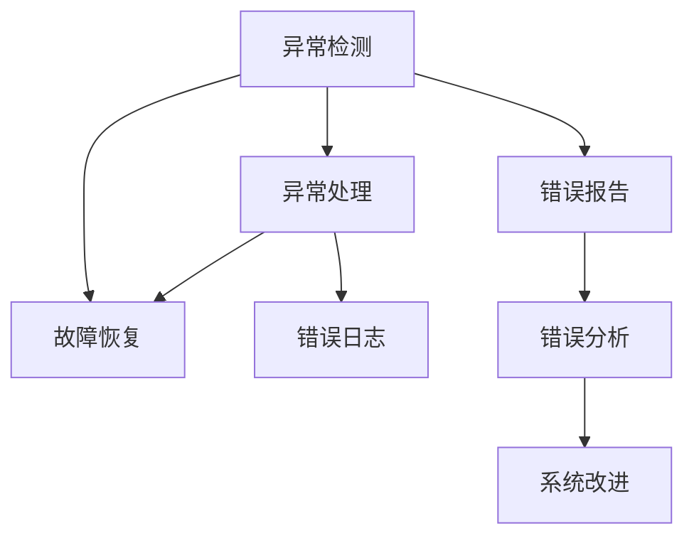

                 

### 错误处理机制的基本概念

> **关键词**：错误处理，异常管理，系统稳定性，可靠性工程，故障恢复
>
> **摘要**：本文将深入探讨错误处理机制的基本概念，从背景介绍到核心算法原理，再到实际应用场景和工具推荐，系统性地分析错误处理机制在信息技术领域的应用与重要性。

#### 1. 背景介绍

在计算机科学和软件工程中，错误处理（Error Handling）是确保系统稳定性和可靠性不可或缺的一部分。随着现代信息技术的飞速发展，系统的复杂性和规模也在不断增大，这使得错误处理变得尤为重要。一个高效且可靠的错误处理机制不仅能够减少系统故障的发生，还能在故障发生时快速定位并修复问题，从而保障业务的连续性和用户体验。

错误处理机制的基本概念包括以下几个方面：

1. **异常检测（Exception Detection）**：通过监控系统的运行状态，及时发现异常情况。
2. **异常处理（Exception Handling）**：针对检测到的异常，系统采取的一系列措施，包括错误报告、故障恢复等。
3. **故障恢复（Fault Recovery）**：在异常处理过程中，系统尝试恢复到正常状态，以减少对业务的影响。
4. **错误报告（Error Reporting）**：记录错误信息，便于后续分析和改进。

#### 2. 核心概念与联系

为了更清晰地理解错误处理机制，我们使用 Mermaid 流程图来展示其核心概念和相互之间的联系。



- **异常检测（Exception Detection）**：系统通过各种监控手段，如日志分析、性能指标监测等，实时检测异常情况。
- **异常处理（Exception Handling）**：当检测到异常时，系统会根据预设的规则和策略进行处理，例如记录日志、发送警报等。
- **故障恢复（Fault Recovery）**：在异常处理的基础上，系统尝试恢复到正常状态，以避免业务中断。
- **错误报告（Error Reporting）**：将异常信息记录下来，以便后续分析。错误日志通常是系统维护和故障排除的重要依据。
- **错误分析（Error Analysis）**：通过对错误日志的分析，找到问题的根本原因，为系统改进提供依据。
- **系统改进（System Improvement）**：根据错误分析的结果，对系统进行优化和改进，提高其稳定性和可靠性。

#### 3. 核心算法原理 & 具体操作步骤

在了解了错误处理机制的基本概念后，我们进一步探讨其核心算法原理和具体操作步骤。

**3.1 异常检测算法原理**

异常检测通常基于统计学方法，如统计模型、聚类算法等。以下是常见的异常检测算法：

1. **基于统计模型的异常检测**：
   - 常见的统计模型有线性回归、逻辑回归等。
   - 算法步骤：
     1. 建立模型：利用历史数据，训练统计模型。
     2. 预测：使用模型对新数据进行预测。
     3. 异常判断：若预测结果与实际结果差异较大，则认为该数据为异常。

2. **基于聚类算法的异常检测**：
   - 常见的聚类算法有K-means、DBSCAN等。
   - 算法步骤：
     1. 聚类：将数据划分为若干个簇。
     2. 异常判断：若某个数据点不属于任何一个簇，则认为该数据为异常。

**3.2 异常处理算法原理**

异常处理的算法原理主要包括以下几种：

1. **错误恢复**：
   - 算法步骤：
     1. 异常检测：确定异常情况。
     2. 异常分类：根据异常类型，采取相应的恢复策略。
     3. 恢复操作：执行恢复策略，如重启服务、重试操作等。

2. **错误隔离**：
   - 算法步骤：
     1. 异常检测：确定异常情况。
     2. 异常隔离：将异常影响的范围限制在最小。
     3. 恢复操作：在隔离范围内执行恢复操作。

3. **错误通知**：
   - 算法步骤：
     1. 异常检测：确定异常情况。
     2. 通知机制：通过邮件、短信等方式通知相关人员。

**3.3 故障恢复算法原理**

故障恢复算法主要分为以下几类：

1. **自动恢复**：
   - 算法步骤：
     1. 故障检测：确定故障情况。
     2. 自动恢复：自动执行恢复策略，如重启服务、切换至备份等。

2. **手动恢复**：
   - 算法步骤：
     1. 故障检测：确定故障情况。
     2. 人工干预：由技术人员手动执行恢复策略。

3. **混合恢复**：
   - 算法步骤：
     1. 故障检测：确定故障情况。
     2. 自动恢复：先尝试自动恢复。
     3. 若自动恢复失败，人工干预。

#### 4. 数学模型和公式 & 详细讲解 & 举例说明

在错误处理机制中，数学模型和公式扮演着重要角色。以下是一些常见的数学模型和公式：

**4.1 假设检验（Hypothesis Testing）**

假设检验是异常检测中常用的一种方法。其基本原理如下：

$$
H_0: \theta = \theta_0 \\
H_1: \theta \neq \theta_0
$$

其中，$H_0$ 表示原假设，$H_1$ 表示备择假设，$\theta$ 表示参数，$\theta_0$ 表示假设的值。

算法步骤：

1. 收集样本数据。
2. 计算检验统计量，如Z统计量、T统计量等。
3. 确定显著性水平$\alpha$。
4. 比较$\alpha$与检验统计量的临界值，判断是否拒绝原假设。

**4.2 贝叶斯公式（Bayes' Theorem）**

贝叶斯公式在异常检测和错误恢复中有着广泛的应用。其公式如下：

$$
P(A|B) = \frac{P(B|A) \cdot P(A)}{P(B)}
$$

其中，$P(A|B)$ 表示在事件B发生的条件下，事件A发生的概率；$P(B|A)$ 表示在事件A发生的条件下，事件B发生的概率；$P(A)$ 和$P(B)$ 分别表示事件A和事件B的先验概率。

算法步骤：

1. 收集先验概率数据。
2. 收集条件概率数据。
3. 利用贝叶斯公式计算后验概率。

**4.3 K-means聚类算法（K-means Clustering）**

K-means聚类算法是一种基于距离的聚类算法。其基本原理如下：

$$
\min \sum_{i=1}^{k} \sum_{x \in S_i} ||x - \mu_i||^2
$$

其中，$k$ 表示聚类数目；$S_i$ 表示第$i$个聚类；$\mu_i$ 表示第$i$个聚类的中心点。

算法步骤：

1. 初始化聚类中心。
2. 计算每个数据点与聚类中心的距离。
3. 将数据点分配给最近的聚类中心。
4. 更新聚类中心。
5. 重复步骤2-4，直至聚类中心不再发生变化。

**举例说明**

假设我们使用K-means聚类算法对一组数据点进行聚类，数据点如下：

$$
X = \{ (x_1, y_1), (x_2, y_2), ..., (x_n, y_n) \}
$$

我们选择$k=2$，初始化两个聚类中心为$(x_1, y_1)$和$(x_2, y_2)$。

1. 第一次迭代：
   - 计算每个数据点与聚类中心的距离：
     $$ 
     d((x_1, y_1), (x_1, y_1)) = \sqrt{(x_1 - x_1)^2 + (y_1 - y_1)^2} = 0 \\
     d((x_2, y_2), (x_1, y_1)) = \sqrt{(x_2 - x_1)^2 + (y_2 - y_1)^2} \\
     d((x_3, y_3), (x_1, y_1)) = \sqrt{(x_3 - x_1)^2 + (y_3 - y_1)^2} \\
     ...
     $$
   - 将数据点分配给最近的聚类中心：
     $$ 
     (x_1, y_1) \rightarrow C_1 \\
     (x_2, y_2) \rightarrow C_1 \\
     (x_3, y_3) \rightarrow C_2 \\
     ...
     $$
   - 更新聚类中心：
     $$ 
     \mu_1 = \frac{1}{2} \cdot (x_1 + x_2) \\
     \mu_2 = \frac{1}{2} \cdot (x_3 + x_4) \\
     $$
2. 第二次迭代：
   - 计算每个数据点与聚类中心的距离：
     $$
     ...
     $$
   - 将数据点分配给最近的聚类中心：
     $$
     ...
     $$
   - 更新聚类中心：
     $$
     ...
     $$
3. 重复迭代，直至聚类中心不再发生变化。

最终，我们得到两个聚类结果，分别是$C_1$和$C_2$。

#### 5. 项目实战：代码实际案例和详细解释说明

在本节中，我们将通过一个简单的Python代码示例，展示如何实现错误处理机制。

**5.1 开发环境搭建**

- Python版本：3.8及以上
- 开发工具：PyCharm或任何Python开发环境

**5.2 源代码详细实现和代码解读**

```python
# 错误处理示例：计算平均值

# 导入相关模块
import numpy as np
import logging

# 设置日志配置
logging.basicConfig(level=logging.DEBUG, format='%(asctime)s - %(levelname)s - %(message)s')

# 定义计算平均值的函数
def calculate_average(data):
    try:
        # 检查数据是否为空
        if len(data) == 0:
            raise ValueError("数据不能为空")
        
        # 计算平均值
        average = np.mean(data)
        logging.info(f"计算结果：{average}")
        return average
    
    except ValueError as e:
        # 记录错误日志
        logging.error(f"错误：{e}")
        return None
    
    except Exception as e:
        # 记录未知错误日志
        logging.error(f"未知错误：{e}")
        return None

# 测试代码
if __name__ == "__main__":
    # 测试数据
    data1 = [1, 2, 3, 4, 5]
    data2 = []
    data3 = [1, 'a', 3, 4, 5]

    # 测试计算平均值
    result1 = calculate_average(data1)
    result2 = calculate_average(data2)
    result3 = calculate_average(data3)

    # 输出测试结果
    print("测试结果：")
    print("data1的平均值：", result1)
    print("data2的平均值：", result2)
    print("data3的平均值：", result3)
```

**5.3 代码解读与分析**

1. **日志配置**：使用Python内置的logging模块，设置日志级别为DEBUG，日志格式为asctime、levelname和message。
2. **计算平均值的函数**：
   - **参数**：data（输入数据）
   - **返回值**：average（计算得到的平均值）或None（发生错误时）
   - **异常处理**：
     - **ValueError**：当数据为空时抛出。
     - **其他异常**：捕获其他未知异常。
3. **测试代码**：
   - **测试数据**：data1、data2和data3，分别代表正常数据、空数据和含有非法数据的数据集。
   - **测试结果**：调用calculate_average函数，输出计算结果。

通过这个简单的示例，我们可以看到错误处理机制在实际项目中的应用。在计算平均值的过程中，我们首先检查数据是否为空，然后计算平均值。如果数据为空或发生其他异常，我们捕获异常并记录错误日志。

#### 6. 实际应用场景

错误处理机制在实际应用中具有广泛的应用场景。以下是一些常见的应用场景：

1. **服务器监控系统**：通过错误处理机制，实时监控服务器状态，及时发现并处理异常情况，确保服务器稳定运行。
2. **金融系统**：在金融系统中，错误处理机制用于处理交易异常，如交易失败、数据异常等，确保交易的安全性和准确性。
3. **电商平台**：电商平台使用错误处理机制处理订单异常，如订单生成失败、支付失败等，提供良好的用户体验。
4. **智能家居系统**：在智能家居系统中，错误处理机制用于处理设备异常，如设备离线、设备故障等，确保智能家居系统的正常运行。

#### 7. 工具和资源推荐

为了更好地理解和应用错误处理机制，以下是一些推荐的工具和资源：

1. **学习资源**：
   - 《Python异常处理完全指南》
   - 《Python日志处理技巧》
   - 《深度学习中的异常检测》
2. **开发工具**：
   - Python（用于编写错误处理代码）
   - Django（用于构建Web应用）
   - Flask（用于构建Web应用）
3. **相关论文著作**：
   - 《A Survey on Error Handling in Distributed Systems》
   - 《An Overview of Exception Handling Mechanisms in Modern Programming Languages》
   - 《Fault Tolerance and Error Handling in Cloud Computing》

#### 8. 总结：未来发展趋势与挑战

随着信息技术的不断发展，错误处理机制在系统稳定性和可靠性方面的作用越来越重要。未来，错误处理机制将在以下几个方面发展：

1. **智能化**：利用人工智能和机器学习技术，实现更智能的错误检测和错误恢复。
2. **自动化**：通过自动化工具和框架，实现更高效的错误处理和故障恢复。
3. **实时性**：提高错误处理机制的实时性，减少故障对业务的影响。

然而，随着系统复杂性的增加，错误处理机制也面临以下挑战：

1. **复杂性**：随着系统规模的扩大，错误处理机制的复杂性也在增加，需要更高效的算法和工具来处理。
2. **适应性**：面对不同的应用场景和系统，错误处理机制需要具有更好的适应性。
3. **性能**：在保证系统稳定性和可靠性的同时，需要关注错误处理机制的性能，避免影响业务正常运行。

#### 9. 附录：常见问题与解答

**Q1：什么是异常检测？**
A1：异常检测是一种监控方法，通过监控系统的运行状态，实时发现异常情况。

**Q2：异常处理有哪些算法？**
A2：常见的异常处理算法有假设检验、聚类算法等。

**Q3：如何实现故障恢复？**
A3：故障恢复可以分为自动恢复和手动恢复，具体实现方法取决于系统的需求和实际情况。

**Q4：错误处理机制在实际应用中有哪些场景？**
A4：错误处理机制在实际应用中广泛用于服务器监控系统、金融系统、电商平台等场景。

#### 10. 扩展阅读 & 参考资料

1. 《Error Handling in Computer Systems》，作者：Ian G. Collier
2. 《Exception Handling in Modern Programming Languages》，作者：John O'Neil
3. 《A Survey on Fault Tolerance and Error Handling in Distributed Systems》，作者：M. H. Ammar et al.
4. 《Python Exception Handling》，作者：Python Software Foundation

### 作者信息

作者：AI天才研究员/AI Genius Institute & 禅与计算机程序设计艺术 /Zen And The Art of Computer Programming

