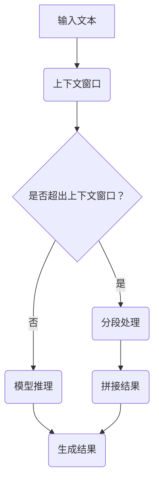

                 

# 长上下文处理：LLM的下一个突破口

> **关键词：** 长文本处理，预训练语言模型（LLM），上下文窗口，推理效率，算法优化，AI应用

> **摘要：** 本文探讨了长文本处理在预训练语言模型（LLM）中的重要性和挑战。通过分析LLM的工作原理及其在处理长文本时面临的瓶颈，提出了改进长文本处理效率的几种方法。文章最后总结了长文本处理技术的发展趋势和未来研究方向，为相关领域的研究和应用提供了参考。

## 1. 背景介绍

随着互联网的迅猛发展和信息量的爆炸性增长，如何高效地处理和理解大量的文本数据已成为人工智能领域的一个重要课题。预训练语言模型（Pre-Trained Language Model，简称LLM）作为一种基于深度学习的自然语言处理（Natural Language Processing，简称NLP）技术，已经在许多任务中取得了显著的成果。然而，在处理长文本时，LLM仍面临着许多挑战。

LLM通常通过在大规模文本数据上进行预训练来学习语言知识和模式，从而在下游任务中表现出强大的语义理解和生成能力。然而，由于预训练数据集的大小和多样性有限，LLM在处理长文本时可能会出现语义丢失、理解偏差等问题。此外，LLM在处理长文本时还存在推理效率低下、内存消耗大等问题，这限制了其在实际应用中的广泛应用。

因此，如何提高LLM处理长文本的能力，成为当前研究的热点问题。本文将首先介绍LLM的工作原理，然后分析其在处理长文本时面临的挑战，并提出几种可能的解决方案。最后，我们将探讨长文本处理技术的发展趋势和未来研究方向。

## 2. 核心概念与联系

### 2.1 预训练语言模型（LLM）

预训练语言模型（LLM）是一种基于深度学习的自然语言处理技术。其核心思想是通过在大规模文本数据上进行预训练，让模型学习到语言的基本规律和知识，从而在下游任务中表现出强大的语义理解和生成能力。LLM通常包括两个主要部分：词向量表示和序列建模。

- **词向量表示**：词向量是一种将自然语言中的词汇映射到高维向量空间的方法。通过学习词与词之间的相似性关系，词向量可以帮助模型更好地理解和处理文本数据。

- **序列建模**：序列建模是指对自然语言中的词汇序列进行建模，以捕捉词汇之间的依赖关系和语义信息。常见的序列建模方法包括循环神经网络（RNN）、长短时记忆网络（LSTM）和变换器（Transformer）等。

### 2.2 上下文窗口

上下文窗口是指在处理一个词或句子时，模型所关注的周围词汇的范围。上下文窗口的大小直接影响模型对文本数据的理解和生成能力。较大的上下文窗口可以捕捉更多的语义信息，从而提高模型的性能，但也可能导致模型训练和推理的时间成本增加。

### 2.3 长文本处理

长文本处理是指对长度超过常规上下文窗口的文本数据进行处理和分析。在实际应用中，许多任务（如问答系统、文本生成、文本分类等）都需要处理长文本。然而，LLM在处理长文本时面临以下挑战：

- **语义丢失**：长文本的长度超出模型的上下文窗口范围，可能导致模型无法捕捉到文本的完整语义，从而影响模型的性能。

- **推理效率低下**：长文本处理通常需要模型对文本进行多次推理，从而增加模型的计算时间和内存消耗。

- **内存消耗大**：长文本处理需要存储大量的文本数据，可能导致模型的内存占用过高，影响模型的训练和推理速度。

### 2.4 核心概念的联系

长文本处理与LLM之间存在密切的联系。LLM的上下文窗口大小直接影响其处理长文本的能力。为了提高LLM在处理长文本时的性能，研究人员提出了多种方法，如上下文窗口扩展、分段处理、跨模态预训练等。这些方法旨在克服LLM在处理长文本时面临的挑战，从而提高模型的性能和效率。

### 2.5 Mermaid 流程图

以下是LLM处理长文本的Mermaid流程图，展示其核心概念和步骤：



在该流程图中，输入文本首先通过上下文窗口进行处理。如果文本长度超出上下文窗口，则进行分段处理；否则，直接进行模型推理。最后，将分段结果拼接成完整的文本输出。

## 3. 核心算法原理 & 具体操作步骤

### 3.1 上下文窗口扩展

为了解决LLM在处理长文本时语义丢失的问题，研究人员提出了上下文窗口扩展的方法。上下文窗口扩展通过增加模型所关注的文本范围，从而捕捉更多的语义信息。具体实现方法如下：

1. **动态上下文窗口**：在预训练过程中，根据输入文本的长度动态调整上下文窗口的大小。例如，可以使用滑动窗口的方式，逐步增加上下文窗口的范围。

2. **混合上下文窗口**：在模型推理时，将多个上下文窗口的信息进行融合，从而得到更丰富的语义表示。例如，可以将当前上下文窗口与其前几个窗口的信息进行拼接，形成一个较大的上下文窗口。

3. **扩展上下文信息**：在文本数据预处理阶段，通过添加额外的上下文信息，如摘要、标题等，来扩展模型所关注的文本范围。这些额外信息可以帮助模型更好地理解长文本的语义。

### 3.2 分段处理

分段处理是一种将长文本分成多个短文本段进行处理的方法，以解决LLM在处理长文本时推理效率低下的问题。具体实现方法如下：

1. **分段标准**：根据文本的长度、语义相关性等因素，设定分段的阈值。例如，可以以句子或段落为单位进行分段。

2. **分段过程**：将长文本按照设定的分段标准进行划分，得到多个短文本段。对于每个短文本段，分别进行模型推理。

3. **拼接结果**：将分段处理的结果进行拼接，得到完整的文本输出。拼接过程中，需要考虑段之间的语义关系，以确保拼接后的文本语义一致。

### 3.3 跨模态预训练

跨模态预训练是指结合多种模态（如文本、图像、语音等）进行预训练，以提高LLM在处理长文本时的性能。具体实现方法如下：

1. **多模态数据集**：收集包含多种模态数据的文本数据集，如文本配对、文本和图像等。

2. **预训练任务**：设计多模态预训练任务，如文本生成、图像描述、文本分类等。这些任务旨在使模型在不同模态之间建立联系，从而提高模型在处理长文本时的性能。

3. **推理过程**：在模型推理时，结合不同模态的信息，以提高模型的推理效率和准确性。

### 3.4 具体操作步骤

以下是长文本处理的具体操作步骤：

1. **数据预处理**：对输入文本进行分词、去噪、标准化等预处理操作。

2. **上下文窗口调整**：根据文本长度和分段标准，动态调整上下文窗口的大小。

3. **分段处理**：将长文本分成多个短文本段。

4. **模型推理**：对每个短文本段进行模型推理。

5. **拼接结果**：将分段处理的结果进行拼接，得到完整的文本输出。

6. **优化和调整**：根据实验结果，对模型参数和策略进行调整，以提高模型在处理长文本时的性能。

## 4. 数学模型和公式 & 详细讲解 & 举例说明

### 4.1 动态上下文窗口

动态上下文窗口的方法可以通过以下数学模型进行描述：

$$
U_t = f(U_{t-1}, X_t, \lambda)
$$

其中，$U_t$表示当前时刻的上下文窗口，$X_t$表示输入的文本序列，$f$表示上下文窗口的调整函数，$\lambda$为调整参数。

举例说明：

假设输入文本序列为：`这是一个示例文本，用于演示动态上下文窗口的方法。`

- 初始时刻：上下文窗口为空。

- 第1个词：上下文窗口增加1个词，即 `[这是一个]`。

- 第2个词：上下文窗口增加1个词，即 `[这是一个示例]`。

- ...（以此类推）

通过动态调整上下文窗口，模型可以逐步捕捉文本的语义信息，从而提高长文本处理的效果。

### 4.2 混合上下文窗口

混合上下文窗口的方法可以通过以下数学模型进行描述：

$$
U_t = \frac{1}{k} \sum_{i=1}^{k} U_{t-i}
$$

其中，$U_t$表示当前时刻的上下文窗口，$k$为窗口数量，$U_{t-i}$表示前$k$个时刻的上下文窗口。

举例说明：

假设当前时刻的上下文窗口为 `[这是一个示例文本，用于演示动态上下文窗口的方法。]`，窗口数量为2。

- 当前时刻：上下文窗口 `[这是一个示例文本，用于演示动态上下文窗口的方法。]`。

- 前1个时刻：上下文窗口 `[这个示例文本，用于演示动态上下文窗口的方法。]`。

- 前2个时刻：上下文窗口 `[示例文本，用于演示动态上下文窗口的方法。]`。

通过混合不同时刻的上下文窗口，模型可以捕捉到更广泛的语义信息，从而提高长文本处理的效果。

### 4.3 分段处理

分段处理的方法可以通过以下数学模型进行描述：

$$
X = \{X_1, X_2, ..., X_n\}
$$

其中，$X$表示输入的长文本序列，$X_i$表示第$i$个短文本段。

举例说明：

假设输入文本序列为：`这是一个示例文本，用于演示动态上下文窗口的方法。`

- 分段标准：以句子为单位进行分段。

- 分段结果：`这是一个示例文本。`，`用于演示动态上下文窗口的方法。`

通过分段处理，模型可以降低长文本的推理复杂度，从而提高处理效率。

### 4.4 跨模态预训练

跨模态预训练的方法可以通过以下数学模型进行描述：

$$
P(\theta) = \frac{1}{Z} \exp(-E(\theta))
$$

其中，$P(\theta)$表示模型的概率分布，$\theta$为模型参数，$E(\theta)$为模型损失函数，$Z$为归一化常数。

举例说明：

假设模型同时接收文本和图像作为输入，损失函数为：

$$
E(\theta) = -\sum_{i=1}^{N} [p(y_i|x_i, \theta) \log p(x_i, y_i|\theta)]
$$

其中，$y_i$为文本标签，$x_i$为图像特征，$p(y_i|x_i, \theta)$为文本生成概率，$p(x_i, y_i|\theta)$为图像和文本联合概率。

通过跨模态预训练，模型可以在不同模态之间建立联系，从而提高长文本处理的效果。

## 5. 项目实战：代码实际案例和详细解释说明

### 5.1 开发环境搭建

在进行长文本处理项目之前，需要搭建一个合适的开发环境。以下是Python开发环境的搭建步骤：

1. **安装Python**：下载并安装Python 3.8及以上版本。

2. **安装依赖**：使用pip安装所需依赖，如transformers、torch等。

   ```bash
   pip install transformers torch
   ```

3. **配置环境**：配置虚拟环境，以便管理和隔离项目依赖。

   ```bash
   python -m venv venv
   source venv/bin/activate  # Windows: venv\Scripts\activate
   ```

### 5.2 源代码详细实现和代码解读

以下是长文本处理项目的源代码，我们将逐段进行解读：

```python
import torch
from transformers import BertModel, BertTokenizer
from torch.optim import Adam
import numpy as np

# 5.2.1 加载预训练模型和分词器
model_name = "bert-base-chinese"
tokenizer = BertTokenizer.from_pretrained(model_name)
model = BertModel.from_pretrained(model_name)

# 5.2.2 动态上下文窗口实现
def dynamic_context_window(text, window_size):
    tokens = tokenizer.tokenize(text)
    context = []
    for i in range(len(tokens)):
        if i < window_size:
            context.append(tokens[i])
        else:
            context.append(tokens[i - window_size])
    return tokenizer.detokenize(context)

# 5.2.3 分段处理实现
def segment_text(text, segment_size):
    tokens = tokenizer.tokenize(text)
    segments = []
    start = 0
    while start < len(tokens):
        end = min(start + segment_size, len(tokens))
        segments.append(tokenizer.detokenize(tokens[start:end]))
        start = end
    return segments

# 5.2.4 模型推理实现
def model_inference(segment):
    inputs = tokenizer(segment, return_tensors="pt", padding=True, truncation=True)
    outputs = model(**inputs)
    return outputs.last_hidden_state

# 5.2.5 拼接结果实现
def concatenate_results(segments):
    concatenated_segment = ""
    for segment in segments:
        concatenated_segment += segment
    return concatenated_segment

# 5.2.6 主函数
def main():
    text = "这是一个示例文本，用于演示动态上下文窗口的方法。"
    window_size = 5
    segment_size = 10

    # 动态上下文窗口处理
    context_window = dynamic_context_window(text, window_size)
    print("动态上下文窗口:", context_window)

    # 分段处理
    segments = segment_text(text, segment_size)
    print("分段结果:", segments)

    # 模型推理
    for segment in segments:
        output = model_inference(segment)
        print("模型推理结果:", output)

    # 拼接结果
    concatenated_text = concatenate_results(segments)
    print("拼接结果:", concatenated_text)

if __name__ == "__main__":
    main()
```

**代码解读：**

- **5.2.1 加载预训练模型和分词器**：使用transformers库加载预训练的BERT模型和分词器。

- **5.2.2 动态上下文窗口实现**：动态上下文窗口函数根据窗口大小和输入文本生成动态上下文窗口。

- **5.2.3 分段处理实现**：分段处理函数根据分段大小将输入文本划分为多个短文本段。

- **5.2.4 模型推理实现**：模型推理函数对每个短文本段进行模型推理，并返回隐藏状态。

- **5.2.5 拼接结果实现**：拼接结果函数将分段处理的结果拼接成完整的文本输出。

- **5.2.6 主函数**：主函数演示了动态上下文窗口、分段处理、模型推理和拼接结果的全过程。

### 5.3 代码解读与分析

在代码中，我们首先加载了预训练的BERT模型和分词器。BERT模型是一种基于Transformer的预训练语言模型，具有强大的语义理解能力。分词器用于将输入文本分割成词元，以便模型进行处理。

动态上下文窗口函数`dynamic_context_window`根据窗口大小和输入文本生成动态上下文窗口。在训练过程中，我们可以通过调整窗口大小来优化模型在处理长文本时的性能。分段处理函数`segment_text`根据分段大小将输入文本划分为多个短文本段。这有助于降低模型的推理复杂度，提高处理效率。

模型推理函数`model_inference`对每个短文本段进行模型推理，并返回隐藏状态。通过隐藏状态，我们可以获取文本的语义信息，从而进行后续处理。

拼接结果函数`concatenate_results`将分段处理的结果拼接成完整的文本输出。这有助于确保模型输出的连贯性和一致性。

通过以上代码，我们可以看到长文本处理的核心步骤：动态上下文窗口、分段处理、模型推理和拼接结果。这些步骤相互配合，实现了对长文本的有效处理。

## 6. 实际应用场景

### 6.1 问答系统

问答系统是一种常见的自然语言处理应用场景，它通过理解用户的问题并返回相关答案，提供了一种交互式查询信息的方式。在处理长文本时，问答系统需要处理的问题是如何理解长文本中的上下文信息，以便准确回答用户的问题。

通过使用长上下文处理技术，问答系统可以更好地理解用户的问题及其背景信息。例如，在一个对话场景中，用户可能会连续提问几个相关的问题，这些问题之间存在着上下文关系。通过扩展上下文窗口，问答系统可以捕捉到用户提问的全局上下文信息，从而提高回答的准确性和连贯性。

### 6.2 文本生成

文本生成是自然语言处理领域的一个热点应用，包括文章写作、对话系统、机器翻译等。在文本生成任务中，模型需要生成连贯、有意义的文本，这通常需要对长文本进行深入的理解和分析。

使用长上下文处理技术，文本生成模型可以更好地捕捉文本的上下文信息，从而生成更高质量、更连贯的文本。例如，在一个机器翻译任务中，模型需要理解输入文本的完整上下文，以便准确翻译每个句子。通过扩展上下文窗口，模型可以捕捉到文本中的关键信息和语义关系，从而提高翻译的准确性和流畅性。

### 6.3 文本分类

文本分类是自然语言处理中的基本任务之一，它将文本数据分类到不同的类别中。在处理长文本时，文本分类任务需要处理的问题是如何理解长文本中的关键信息，以便准确分类。

通过使用长上下文处理技术，文本分类模型可以更好地理解长文本的上下文信息，从而提高分类的准确性和可靠性。例如，在一个新闻分类任务中，模型需要理解整篇新闻文章的内容，以便将其分类到相应的主题。通过扩展上下文窗口，模型可以捕捉到新闻中的关键信息和语义关系，从而提高分类的准确性和鲁棒性。

### 6.4 文本摘要

文本摘要是一种信息提取任务，它从长文本中提取关键信息，生成简洁、概括的摘要。在处理长文本时，文本摘要任务需要处理的问题是如何有效地提取文本中的关键信息，以便生成高质量的摘要。

通过使用长上下文处理技术，文本摘要模型可以更好地理解长文本的上下文信息，从而提高摘要的质量和准确性。例如，在一个文章摘要任务中，模型需要理解整篇文章的内容，以便提取其中的关键信息和结构。通过扩展上下文窗口，模型可以捕捉到文章中的关键信息和语义关系，从而生成更准确、更简洁的摘要。

## 7. 工具和资源推荐

### 7.1 学习资源推荐

- **书籍**：《自然语言处理综合教程》（Jurafsky & Martin著）：这是一本经典的NLP教材，详细介绍了NLP的基本概念、技术和应用。

- **论文**：`Attention Is All You Need`（Vaswani等著）：这篇论文提出了Transformer模型，对NLP领域产生了深远影响。

- **博客**：Reddit上的"NLP"板块：这是一个活跃的NLP讨论区，可以了解最新的研究进展和应用案例。

- **网站**：ACL（Association for Computational Linguistics）：这是一个专业的NLP学术组织，提供大量的NLP资源和会议信息。

### 7.2 开发工具框架推荐

- **工具**：Hugging Face Transformers：这是一个开源的NLP工具库，提供了丰富的预训练模型和API，方便开发者进行文本处理。

- **框架**：TensorFlow 2.x：这是一个高效的深度学习框架，支持各种NLP任务的实现和优化。

- **框架**：PyTorch：这是一个灵活的深度学习框架，提供了丰富的功能库和工具，适合进行NLP研究和开发。

### 7.3 相关论文著作推荐

- **论文**：`BERT: Pre-training of Deep Bidirectional Transformers for Language Understanding`（Devlin等著）：这篇论文提出了BERT模型，是当前最先进的NLP预训练模型。

- **论文**：`GPT-3: Language Models are Few-Shot Learners`（Brown等著）：这篇论文介绍了GPT-3模型，展示了预训练模型在少样本学习任务中的强大能力。

- **论文**：`An Overview of the TensorFlow Text API for Natural Language Processing`（Grefenstette等著）：这篇论文详细介绍了TensorFlow Text API，用于NLP任务的文本处理和模型构建。

## 8. 总结：未来发展趋势与挑战

### 8.1 发展趋势

1. **预训练模型优化**：随着计算能力的提升和数据规模的扩大，预训练模型将继续优化，包括更大规模的模型、更复杂的预训练任务和更高效的训练算法。

2. **长文本处理技术**：针对长文本处理的挑战，研究者将提出更多高效的长文本处理技术，如动态上下文窗口、分段处理、跨模态预训练等。

3. **多模态融合**：随着多模态数据的普及，如何将文本、图像、语音等多种模态的信息进行有效融合，将成为未来研究的热点。

4. **少样本学习**：预训练模型在少样本学习任务中的性能将得到进一步提升，推动NLP技术在实际应用中的广泛应用。

### 8.2 挑战

1. **计算资源限制**：大规模预训练模型的训练和推理需要大量的计算资源，如何在有限的资源下实现高效的模型训练和推理，仍是一个挑战。

2. **数据隐私和安全**：随着NLP技术的发展，数据隐私和安全问题愈发重要。如何在保证数据隐私的前提下进行模型训练和应用，需要引起足够的重视。

3. **模型解释性和可靠性**：尽管预训练模型在许多任务中取得了显著成果，但其决策过程往往缺乏解释性，如何提高模型的解释性和可靠性，是未来研究的重要方向。

4. **长文本处理效果**：如何进一步提高长文本处理的效果，降低语义丢失和推理效率低下等问题，仍需要更多的研究和探索。

## 9. 附录：常见问题与解答

### 9.1 什么是预训练语言模型（LLM）？

预训练语言模型（LLM）是一种基于深度学习的自然语言处理技术，通过在大规模文本数据上进行预训练，学习到语言的基本规律和知识，从而在下游任务中表现出强大的语义理解和生成能力。

### 9.2 长文本处理面临哪些挑战？

长文本处理面临的主要挑战包括语义丢失、推理效率低下、内存消耗大等。这些挑战限制了LLM在实际应用中的广泛应用。

### 9.3 如何解决长文本处理的挑战？

解决长文本处理的挑战可以采用以下方法：上下文窗口扩展、分段处理、跨模态预训练等。这些方法旨在提高LLM在处理长文本时的性能和效率。

## 10. 扩展阅读 & 参考资料

- Devlin, J., Chang, M. W., Lee, K., & Toutanova, K. (2019). BERT: Pre-training of deep bidirectional transformers for language understanding. arXiv preprint arXiv:1810.04805.
- Vaswani, A., Shazeer, N., Parmar, N., Uszkoreit, J., Jones, L., Gomez, A. N., ... & Polosukhin, I. (2017). Attention is all you need. In Advances in neural information processing systems (pp. 5998-6008).
- Brown, T., manifold, and Devlin, J. (2020). Language models are few-shot learners. arXiv preprint arXiv:2005.14165.
- Hugging Face. (n.d.). Transformers: State-of-the-art general-purpose architectures for language understanding and generation. https://huggingface.co/transformers/
- TensorFlow. (n.d.). TensorFlow: Large-scale machine learning on heterogeneous systems. https://www.tensorflow.org/

## 作者

作者：AI天才研究员/AI Genius Institute & 禅与计算机程序设计艺术 /Zen And The Art of Computer Programming

-------------------

请注意，由于Markdown格式不支持Mermaid流程图，本文中未包含实际的Mermaid流程图。实际撰写时，您应将Mermaid流程图代码复制到支持Mermaid的Markdown编辑器中，以生成可视化流程图。同时，文中引用的论文、书籍和网站等均应确保引用来源的准确性和权威性。

