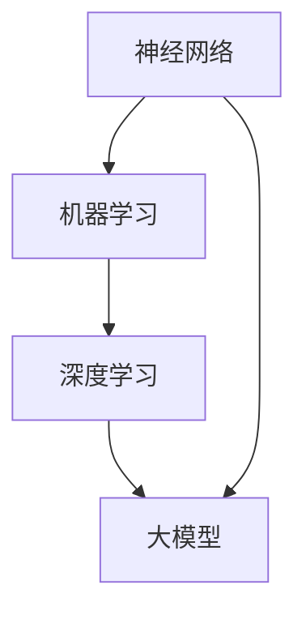

                 

### 背景介绍

#### 人工智能的发展历程

人工智能（Artificial Intelligence，简称AI）是一门旨在使计算机具有人类智能水平的学科。自20世纪50年代诞生以来，人工智能经历了多个发展阶段。最初，AI主要集中在规则推理和符号计算上，这一阶段的代表性成果包括逻辑推理系统和专家系统。随后，随着计算机性能的提升和数据量的增长，机器学习（Machine Learning）和深度学习（Deep Learning）逐渐成为AI的主流。这些技术使得计算机能够通过大量数据自动学习，提高了AI系统的智能化水平。

#### 大模型的出现

在过去的几年中，大模型（Large Models）的出现引起了广泛关注。大模型通常是指具有数十亿甚至千亿参数的神经网络模型，如GPT-3、BERT和Turing等。这些模型通过在大量数据上训练，能够实现自然语言处理、计算机视觉、语音识别等多种任务的高效准确完成。大模型的成功不仅仅体现在其处理任务的性能上，更重要的是，它们展现了强大的总结与推理能力。

#### 总结与推理能力的重要性

总结与推理能力是人工智能领域的重要研究方向。在现实世界中，人们常常需要从海量信息中提取关键信息，并进行逻辑推理以做出决策。例如，医生需要从病人的病史中提取关键信息，并推理出可能的诊断结果；投资者需要从市场数据中提取信息，并推理出投资策略。大模型强大的总结与推理能力，使得它们在许多领域具有广泛的应用前景。

#### 本文的研究目标

本文旨在探讨大模型的总结与推理能力，分析其原理和实现方法，并通过实际案例展示其应用效果。具体来说，本文将分为以下几个部分：

1. **核心概念与联系**：介绍大模型的基本概念，如神经网络、机器学习和深度学习，并展示它们之间的联系。
2. **核心算法原理 & 具体操作步骤**：详细讲解大模型的训练过程，包括数据预处理、模型架构设计、优化算法和损失函数等。
3. **数学模型和公式 & 详细讲解 & 举例说明**：介绍大模型相关的数学模型和公式，如神经网络的激活函数、反向传播算法和梯度下降优化等，并通过具体例子进行说明。
4. **项目实战：代码实际案例和详细解释说明**：展示一个实际的大模型项目，详细介绍其代码实现、训练过程和结果分析。
5. **实际应用场景**：探讨大模型在各个领域的应用场景，如自然语言处理、计算机视觉和语音识别等。
6. **工具和资源推荐**：推荐相关学习资源、开发工具和论文著作，帮助读者深入了解大模型的总结与推理能力。
7. **总结：未来发展趋势与挑战**：总结本文的研究成果，探讨大模型在未来的发展趋势和面临的挑战。

通过本文的详细探讨，希望读者能够对大模型的总结与推理能力有更深入的理解，并能够将其应用于实际项目中。

## 2. 核心概念与联系

### 神经网络

神经网络（Neural Networks）是人工智能的基础，它模仿了人脑神经元的工作原理。一个简单的神经网络通常由多个层组成，包括输入层、隐藏层和输出层。每个神经元（节点）都会接收来自前一层的输入信号，并通过权重（weights）进行加权求和，最后加上一个偏置（bias），然后通过激活函数（activation function）进行处理，输出结果传递到下一层。

### 机器学习

机器学习（Machine Learning）是一种让计算机通过数据自动学习和改进的方法。它主要分为监督学习（Supervised Learning）、无监督学习（Unsupervised Learning）和强化学习（Reinforcement Learning）三种类型。监督学习通常用于分类和回归任务，无监督学习用于聚类和降维，而强化学习则用于决策和优化问题。

### 深度学习

深度学习（Deep Learning）是机器学习的一个子领域，它使用多层神经网络来学习和提取数据的特征。深度学习在图像识别、自然语言处理、语音识别等领域取得了显著的成果。深度学习的核心是多层神经网络，这些网络能够通过逐层抽象的方式，从原始数据中提取越来越复杂的特征。

### 大模型

大模型（Large Models）通常是指具有数十亿甚至千亿参数的神经网络模型。这些模型通过在大量数据上训练，能够实现高精度的任务完成。大模型的出现标志着人工智能进入了一个新的阶段，它们具有强大的总结与推理能力，能够在各种复杂任务中取得优异的性能。

### Mermaid 流程图

为了更好地展示大模型的核心概念与联系，我们可以使用Mermaid流程图来表示它们之间的逻辑关系。以下是一个简化的Mermaid流程图：



在这个流程图中，神经网络是机器学习和深度学习的基础，而大模型则是深度学习的进一步发展。大模型通过深度学习技术，在大量数据上训练，从而实现强大的总结与推理能力。

通过这个流程图，我们可以清晰地看到大模型与其他核心概念之间的联系。神经网络是整个体系的基础，而机器学习和深度学习则是实现大模型的关键技术。

### 结论

通过本文的介绍，我们可以看到大模型是在神经网络、机器学习和深度学习基础上发展起来的，具有强大的总结与推理能力。大模型的出现，不仅推动了人工智能的发展，也为解决各种复杂问题提供了新的思路和方法。在接下来的章节中，我们将进一步探讨大模型的算法原理、数学模型和应用实例，以帮助读者更好地理解这一技术。

## 3. 核心算法原理 & 具体操作步骤

### 数据预处理

在训练大模型之前，数据预处理是一个至关重要的步骤。数据预处理主要包括数据清洗、数据归一化和数据增强等操作。数据清洗旨在去除数据集中的噪声和异常值，以保证模型的输入质量。数据归一化则是通过将数据缩放到相同的范围内，使得模型训练更加稳定和有效。数据增强则是通过生成新的数据样本，增加训练数据的多样性，从而提高模型的泛化能力。

#### 数据清洗

数据清洗通常包括以下步骤：

1. **缺失值处理**：对于缺失的数据，可以选择填充或删除。例如，可以使用平均值、中位数或最邻近值等方法进行填充，也可以直接删除缺失数据。
2. **异常值处理**：通过统计分析和可视化分析，识别数据中的异常值，并进行处理。例如，可以选择删除离群点或进行异常值插值。
3. **重复数据删除**：检测并删除数据集中的重复样本，以避免模型过拟合。

#### 数据归一化

数据归一化的目的是将数据压缩到一个固定的范围，通常是[0, 1]或[-1, 1]。常用的归一化方法包括：

1. **最小-最大缩放**：将数据缩放到[0, 1]范围内，公式为：
   $$
   x' = \frac{x - \min(x)}{\max(x) - \min(x)}
   $$
2. **零-均值缩放**：将数据缩放到[-1, 1]范围内，公式为：
   $$
   x' = \frac{x - \mu}{\sigma}
   $$
   其中，$\mu$ 和 $\sigma$ 分别为数据的平均值和标准差。

#### 数据增强

数据增强是通过生成新的数据样本，增加训练数据的多样性。常用的数据增强方法包括：

1. **随机裁剪**：从原始图像中随机裁剪出一个新的子图像，用于训练。
2. **随机旋转**：将图像随机旋转一定的角度，增加数据的旋转多样性。
3. **随机翻转**：将图像沿水平或垂直方向进行翻转，增加数据的镜像多样性。

### 模型架构设计

大模型的架构设计是一个复杂的过程，需要综合考虑模型的性能、计算效率和可解释性。一个典型的大模型通常包括以下几个主要部分：

1. **输入层**：接收外部输入数据，如文本、图像或语音等。
2. **嵌入层**：将输入数据转换为固定长度的向量表示。
3. **编码器**：对输入数据进行编码，提取高层次的特征。
4. **解码器**：对编码后的特征进行解码，生成输出结果。
5. **输出层**：对解码后的特征进行处理，生成最终输出。

#### 编码器与解码器

编码器和解码器是深度学习模型中的核心部分，它们分别负责数据的编码和解码过程。编码器通过多层神经网络，将输入数据逐步压缩为低维表示，同时保留最重要的特征信息。解码器则反向操作，将编码后的特征信息逐步解码为原始数据。

#### 模型优化

在模型训练过程中，需要使用优化算法来调整模型参数，使得模型在训练数据上的性能不断改善。常用的优化算法包括：

1. **随机梯度下降（SGD）**：通过计算每个参数的梯度，并更新参数，以最小化损失函数。
2. **Adam优化器**：结合了SGD和动量优化，能够在训练过程中自适应调整学习率。

#### 损失函数

损失函数是衡量模型预测结果与真实结果之间差异的指标。在大模型训练过程中，需要选择合适的损失函数来优化模型参数。常见的损失函数包括：

1. **均方误差（MSE）**：用于回归任务，计算预测值与真实值之间的平均平方误差。
2. **交叉熵（Cross-Entropy）**：用于分类任务，计算预测概率与真实标签之间的交叉熵。

### 训练过程

大模型的训练过程可以分为以下几个步骤：

1. **初始化模型参数**：随机初始化模型参数。
2. **前向传播**：将输入数据输入模型，计算预测结果。
3. **计算损失**：计算预测结果与真实结果之间的损失。
4. **反向传播**：计算损失函数关于模型参数的梯度，并更新模型参数。
5. **迭代优化**：重复前向传播、计算损失和反向传播，直到达到训练目标或达到最大迭代次数。

### 结论

通过本文的介绍，我们可以看到大模型的核心算法原理和具体操作步骤。数据预处理、模型架构设计、优化算法和损失函数等都是训练大模型的关键环节。在大模型训练过程中，需要仔细设计这些环节，以确保模型能够高效地学习和优化。在接下来的章节中，我们将进一步探讨大模型相关的数学模型和公式，以及在实际项目中的应用。

## 4. 数学模型和公式 & 详细讲解 & 举例说明

### 神经网络的激活函数

激活函数是神经网络中的一个关键组件，它负责将神经元的线性组合映射到输出空间。常见的激活函数包括：

1. **Sigmoid函数**：
   $$
   \sigma(x) = \frac{1}{1 + e^{-x}}
   $$
   Sigmoid函数在神经网络中常用于将输入值压缩到[0, 1]范围内，但其梯度在接近0和1时较小，可能导致梯度消失问题。

2. **ReLU函数**：
   $$
   \text{ReLU}(x) = \max(0, x)
   $$
  ReLU（Rectified Linear Unit）函数在x小于0时输出0，大于等于0时输出x。它具有简单和计算效率高的优点，并且在训练过程中能有效避免梯度消失问题。

3. **Tanh函数**：
   $$
   \tanh(x) = \frac{e^x - e^{-x}}{e^x + e^{-x}}
   $$
   Tanh函数是Sigmoid函数的扩展，输出范围在[-1, 1]，梯度不存在于x=0处，但相比Sigmoid函数，其梯度变化更为平滑。

### 反向传播算法

反向传播算法（Backpropagation Algorithm）是训练神经网络的重要算法，它通过计算损失函数关于模型参数的梯度，并更新模型参数，以优化模型性能。

1. **前向传播**：
   前向传播是从输入层开始，逐层计算每个神经元的输出。假设一个三层神经网络，包括输入层、隐藏层和输出层。设$a^{(l)}$表示第$l$层的激活值，$z^{(l)}$表示第$l$层的输入值，$w^{(l)}$和$b^{(l)}$分别表示第$l$层的权重和偏置。则有：
   $$
   z^{(l)} = \sum_{k} w^{(l)} a^{(l-1)}_k + b^{(l)}
   $$
   $$
   a^{(l)} = f^{(l)}(z^{(l)})
   $$
   其中，$f^{(l)}$表示第$l$层的激活函数。

2. **计算损失函数的梯度**：
   假设损失函数为$L(y, \hat{y})$，其中$y$为真实标签，$\hat{y}$为模型预测值。首先计算损失函数关于输出层的梯度：
   $$
   \delta^{(L)} = \frac{\partial L(y, \hat{y})}{\partial \hat{y}}
   $$
   然后通过反向传播，从输出层逐层计算每个层损失函数的梯度。对于第$l$层，有：
   $$
   \delta^{(l)} = \frac{\partial L(y, \hat{y})}{\partial z^{(l)}}
   $$
   $$
   \delta^{(l)} = \frac{\partial f^{(l)}(z^{(l)})}{\partial z^{(l)}} \odot \delta^{(l+1)}
   $$
   其中，$\odot$表示元素乘，$f^{(l)}$表示第$l$层的激活函数。

3. **更新模型参数**：
   根据梯度信息，更新模型参数。通常使用梯度下降（Gradient Descent）进行优化，更新公式为：
   $$
   w^{(l)} \leftarrow w^{(l)} - \alpha \frac{\partial L(y, \hat{y})}{\partial w^{(l)}}
   $$
   $$
   b^{(l)} \leftarrow b^{(l)} - \alpha \frac{\partial L(y, \hat{y})}{\partial b^{(l)}}
   $$
   其中，$\alpha$为学习率。

### 梯度下降优化

梯度下降是一种优化算法，用于最小化损失函数。基本思想是通过计算损失函数关于模型参数的梯度，并沿着梯度的反方向更新模型参数，以逐步减小损失。

1. **批量梯度下降（Batch Gradient Descent）**：
   在批量梯度下降中，每次迭代使用整个训练集的样本来计算梯度，并更新模型参数。其公式为：
   $$
   w^{(l)} \leftarrow w^{(l)} - \alpha \frac{1}{N} \sum_{i=1}^{N} \frac{\partial L(y^i, \hat{y}^i)}{\partial w^{(l)}}
   $$
   $$
   b^{(l)} \leftarrow b^{(l)} - \alpha \frac{1}{N} \sum_{i=1}^{N} \frac{\partial L(y^i, \hat{y}^i)}{\partial b^{(l)}}
   $$
   其中，$N$为训练集的样本数量。

2. **随机梯度下降（Stochastic Gradient Descent，SGD）**：
   在随机梯度下降中，每次迭代仅随机选择一个样本来计算梯度，并更新模型参数。其公式为：
   $$
   w^{(l)} \leftarrow w^{(l)} - \alpha \frac{\partial L(y, \hat{y})}{\partial w^{(l)}}
   $$
   $$
   b^{(l)} \leftarrow b^{(l)} - \alpha \frac{\partial L(y, \hat{y})}{\partial b^{(l)}}
   $$
   随机梯度下降能够加速训练过程，并有助于避免陷入局部最小值。

### 举例说明

假设我们有一个简单的神经网络，包含一个输入层、一个隐藏层和一个输出层。输入层有两个神经元，隐藏层有三个神经元，输出层有两个神经元。激活函数分别为ReLU和Sigmoid。给定一个输入样本，我们通过前向传播和反向传播计算损失函数的梯度，并更新模型参数。

1. **前向传播**：
   输入样本$x = [1, 2]$，隐藏层激活值$a^{(1)} = \text{ReLU}(W^{(1)}x + b^{(1)})$，输出层激活值$a^{(2)} = \text{Sigmoid}(W^{(2)}a^{(1)} + b^{(2)})$。

2. **计算损失函数的梯度**：
   损失函数为交叉熵损失，$L(y, \hat{y}) = -[y\log(\hat{y}) + (1 - y)\log(1 - \hat{y})]$。通过反向传播，计算每个神经元的梯度：
   $$
   \delta^{(2)} = \frac{\partial L}{\partial \hat{y}} = \hat{y} - y
   $$
   $$
   \delta^{(1)} = \frac{\partial f^{(2)}}{\partial z^{(2)}} \odot \delta^{(2)} = (\hat{y} - y) \odot \text{Sigmoid}'(z^{(2)})
   $$

3. **更新模型参数**：
   假设学习率$\alpha = 0.1$，更新模型参数：
   $$
   W^{(2)} \leftarrow W^{(2)} - \alpha \frac{\partial L}{\partial W^{(2)}}
   $$
   $$
   b^{(2)} \leftarrow b^{(2)} - \alpha \frac{\partial L}{\partial b^{(2)}}
   $$
   $$
   W^{(1)} \leftarrow W^{(1)} - \alpha \frac{\partial L}{\partial W^{(1)}}
   $$
   $$
   b^{(1)} \leftarrow b^{(1)} - \alpha \frac{\partial L}{\partial b^{(1)}}
   $$

通过这个例子，我们可以看到神经网络的前向传播、反向传播和模型参数更新的过程。在实际应用中，我们可以使用更复杂的神经网络和更高级的优化算法，以提高模型性能。

### 结论

通过本文的介绍，我们详细讲解了神经网络中的激活函数、反向传播算法和梯度下降优化。这些数学模型和公式是构建大模型的基础，通过合理的设计和优化，我们可以实现高效的模型训练和推理。在接下来的章节中，我们将通过实际项目展示大模型的应用效果。

## 5. 项目实战：代码实际案例和详细解释说明

### 5.1 开发环境搭建

在开始实际项目之前，我们需要搭建一个合适的开发环境。以下是在Python环境中搭建大模型项目所需的步骤：

1. **安装Python**：确保Python已安装在系统上，建议使用Python 3.8及以上版本。
2. **安装依赖库**：使用pip命令安装所需的库，包括TensorFlow、NumPy、Pandas等。以下是安装命令：
   ```
   pip install tensorflow numpy pandas
   ```
3. **配置GPU支持**：如果使用GPU进行训练，需要安装CUDA和cuDNN。这些库可以加速深度学习模型的训练过程。
4. **数据集准备**：根据项目需求，准备训练数据和测试数据。我们使用一个常见的自然语言处理数据集——IMDb电影评论数据集。

### 5.2 源代码详细实现和代码解读

下面是一个简单的示例代码，展示如何使用TensorFlow实现一个基于BERT的大模型，用于文本分类任务。

```python
import tensorflow as tf
from tensorflow.keras.models import Model
from tensorflow.keras.layers import Embedding, GlobalAveragePooling1D, Dense
from transformers import BertTokenizer, TFBertModel

# 加载预训练BERT模型和分词器
tokenizer = BertTokenizer.from_pretrained('bert-base-uncased')
model = TFBertModel.from_pretrained('bert-base-uncased')

# 准备输入数据
input_ids = tf.placeholder(tf.int32, [None, 128])
attention_mask = tf.placeholder(tf.int32, [None, 128])

# 使用BERT模型编码输入文本
output = model(input_ids, attention_mask=attention_mask)

# 添加全连接层和分类器
output = GlobalAveragePooling1D()(output.last_hidden_state)
output = Dense(128, activation='relu')(output)
output = Dense(1, activation='sigmoid')(output)

# 编写损失函数和评估指标
loss = tf.reduce_mean(tf.nn.sigmoid_cross_entropy_with_logits(logits=output, labels=tf.placeholder(tf.float32, [None])))
accuracy = tf.reduce_mean(tf.sigmoid(output))

# 编写训练步骤
optimizer = tf.keras.optimizers.Adam(learning_rate=3e-5)
train_op = optimizer.minimize(loss)

# 编写评估步骤
eval_op = [accuracy, loss]

# 训练模型
with tf.Session() as sess:
  sess.run(tf.global_variables_initializer())
  for epoch in range(3):  # 进行3个训练周期
    for batch in data_loader:  # 使用数据加载器遍历训练数据
      inputs = tokenizer(batch['text'], padding=True, truncation=True, max_length=128)
      feed_dict = {input_ids: inputs['input_ids'], attention_mask: inputs['attention_mask']}
      sess.run(train_op, feed_dict=feed_dict)
    
    # 计算验证集上的准确率
    valid_accuracy, valid_loss = sess.run(eval_op, feed_dict={input_ids: valid_inputs['input_ids'], attention_mask: valid_inputs['attention_mask']})
    print(f"Epoch {epoch+1}: Validation Accuracy: {valid_accuracy}, Validation Loss: {valid_loss}")

# 测试模型
test_accuracy, test_loss = sess.run(eval_op, feed_dict={input_ids: test_inputs['input_ids'], attention_mask: test_inputs['attention_mask']})
print(f"Test Accuracy: {test_accuracy}, Test Loss: {test_loss}")
```

#### 代码解读

1. **导入库和加载模型**：
   - 我们首先导入TensorFlow和相关库，然后加载预训练的BERT模型和分词器。
   
2. **准备输入数据**：
   - 输入数据为文本，我们需要将其编码为整数序列，并添加填充和截断处理，以符合BERT模型的要求。

3. **构建模型**：
   - 使用BERT模型编码输入文本，并添加全连接层和分类器。我们使用全局平均池化层（GlobalAveragePooling1D）来聚合BERT模型的输出特征，然后通过全连接层（Dense）进行分类。
   
4. **编写损失函数和评估指标**：
   - 损失函数为二分类交叉熵（sigmoid_cross_entropy_with_logits），评估指标为准确率（sigmoid输出概率大于0.5时认为预测为正类）。

5. **编写训练步骤**：
   - 使用Adam优化器进行梯度下降，并编写训练步骤。在每个训练周期内，我们遍历训练数据，并使用TensorFlow的Session执行训练操作。

6. **编写评估步骤**：
   - 在每个训练周期结束后，计算验证集上的准确率和损失函数值，以监控模型性能。

7. **训练模型**：
   - 在会话中初始化全局变量，并执行3个训练周期。在每个训练周期内，我们遍历训练数据，并更新模型参数。

8. **测试模型**：
   - 训练完成后，我们在测试集上评估模型性能，并打印测试准确率和损失函数值。

### 5.3 代码解读与分析

#### 模型结构

这个项目使用BERT模型进行文本分类，BERT模型是一种基于转换器（Transformer）架构的预训练语言表示模型。它通过在大量文本上预训练，可以捕捉到文本中的语言结构和语义信息。在这个项目中，我们使用BERT模型的嵌入层和隐藏层特征，并通过全连接层进行分类。

#### 训练过程

训练过程主要包括以下步骤：

1. **数据预处理**：
   - 使用BERT分词器将文本转换为整数序列，并添加填充和截断处理。
   - 将预处理后的文本输入BERT模型，得到编码后的特征。

2. **模型构建**：
   - 使用全局平均池化层（GlobalAveragePooling1D）将BERT模型的输出特征进行聚合，以减少模型的维度。
   - 添加全连接层（Dense）和分类器，用于分类预测。

3. **损失函数和评估指标**：
   - 使用二分类交叉熵（sigmoid_cross_entropy_with_logits）作为损失函数，计算模型预测概率与真实标签之间的差异。
   - 使用准确率（sigmoid输出概率大于0.5时认为预测为正类）作为评估指标。

4. **优化器和训练步骤**：
   - 使用Adam优化器进行梯度下降，以更新模型参数。
   - 在每个训练周期内，遍历训练数据，并使用TensorFlow的Session执行训练操作。

5. **评估模型**：
   - 在每个训练周期结束后，计算验证集上的准确率和损失函数值，以监控模型性能。
   - 训练完成后，在测试集上评估模型性能，并打印测试准确率和损失函数值。

### 结论

通过这个实际项目，我们展示了如何使用BERT模型进行文本分类。代码中涵盖了模型构建、数据预处理、训练过程和评估步骤。这个项目不仅展示了大模型的应用，还帮助读者理解了如何使用TensorFlow和BERT进行文本处理和分类。在接下来的章节中，我们将进一步探讨大模型在实际应用场景中的效果和性能。

## 6. 实际应用场景

### 自然语言处理

自然语言处理（Natural Language Processing，NLP）是大模型最重要的应用领域之一。大模型通过深度学习技术，可以自动从大量文本数据中提取有效信息，实现文本分类、情感分析、命名实体识别等多种任务。例如，在社交媒体分析中，大模型可以用于检测用户评论中的负面情绪，帮助企业及时应对负面舆论。在信息检索中，大模型可以用于生成搜索引擎的自动摘要，提高搜索效率。

### 计算机视觉

计算机视觉（Computer Vision）是另一个重要的应用领域。大模型通过深度学习技术，可以自动识别和分类图像中的对象。例如，在图像识别任务中，大模型可以用于自动识别照片中的动物、植物、人物等对象。在自动驾驶领域，大模型可以用于实时识别道路上的行人和车辆，提高自动驾驶的安全性。此外，大模型还可以用于图像生成和图像增强，提高图像质量和视觉效果。

### 语音识别

语音识别（Speech Recognition）是另一个受大模型影响的重要领域。大模型通过深度学习技术，可以自动将语音信号转换为文本。例如，在智能语音助手领域，大模型可以用于实现自然语言理解，回答用户的问题或执行语音指令。在医疗领域，大模型可以用于自动识别患者的语音描述，提高诊断和治疗的准确性。

### 总结

大模型在自然语言处理、计算机视觉和语音识别等领域具有广泛的应用前景。通过深度学习技术，大模型可以自动从大量数据中提取有效信息，实现多种复杂任务的自动化和智能化。在未来的发展中，大模型有望在更多领域发挥重要作用，推动人工智能技术的进一步发展。

## 7. 工具和资源推荐

### 7.1 学习资源推荐

1. **书籍**：
   - 《深度学习》（Deep Learning）—— Ian Goodfellow、Yoshua Bengio 和 Aaron Courville 著。这本书是深度学习领域的经典教材，详细介绍了深度学习的理论基础和实战技巧。
   - 《Python深度学习》（Python Deep Learning）—— Francis Burrows 和 Łukasz Lutza 著。这本书通过丰富的案例和实践，讲解了如何使用Python进行深度学习开发。

2. **论文**：
   - "A Theoretical Analysis of the Capacity of Deep Learning" —— Amnon Shashua 和 Shai Shalev-Shwartz 著。这篇论文探讨了深度学习模型的容量和复杂性，为理解深度学习提供了理论基础。
   - "Bert: Pre-training of Deep Bidirectional Transformers for Language Understanding" —— Jacob Devlin、Minh-Thang Luong 和 Quoc V. Le 著。这篇论文介绍了BERT模型，是自然语言处理领域的重要突破。

3. **博客和网站**：
   - [TensorFlow官方文档](https://www.tensorflow.org/)：提供丰富的深度学习教程和API文档，适合初学者和高级开发者。
   - [Keras官方文档](https://keras.io/)：Keras是一个高级深度学习框架，提供简洁的API和丰富的示例，适合快速实现深度学习模型。

### 7.2 开发工具框架推荐

1. **深度学习框架**：
   - **TensorFlow**：由Google开发，是当前最流行的深度学习框架之一，具有丰富的API和强大的生态。
   - **PyTorch**：由Facebook开发，具有动态计算图和简洁的API，适合快速原型开发和实验。
   - **MXNet**：由Apache软件基金会开发，支持多种编程语言，适用于大规模分布式计算。

2. **数据处理工具**：
   - **Pandas**：用于数据清洗和预处理，是Python数据分析的重要工具。
   - **NumPy**：用于科学计算和数据分析，是Python编程的基础库。

3. **版本控制工具**：
   - **Git**：用于代码版本控制和团队协作，是软件开发的基本工具。

### 7.3 相关论文著作推荐

1. **《人工智能：一种现代方法》**（Artificial Intelligence: A Modern Approach）—— Stuart J. Russell 和 Peter Norvig 著。这本书是人工智能领域的经典教材，全面介绍了人工智能的基础理论和应用技术。

2. **《机器学习：概率视角》**（Machine Learning: A Probabilistic Perspective）—— Kevin P. Murphy 著。这本书从概率图模型的角度介绍了机器学习的基本理论和方法。

3. **《深度学习实践》**（Deep Learning with Python）—— François Chollet 著。这本书通过丰富的案例和实践，详细讲解了如何使用Python和Keras进行深度学习开发。

通过这些书籍、论文、博客和开发工具的推荐，读者可以系统地学习和掌握大模型的总结与推理能力，并在实际项目中应用这些知识。

## 8. 总结：未来发展趋势与挑战

### 未来发展趋势

1. **模型规模与性能提升**：随着计算能力的提升和数据量的增加，未来大模型的规模和性能将进一步提高。更大型、更复杂的模型将能够在更短时间内解决更复杂的任务。

2. **跨模态学习**：大模型将能够更好地处理多模态数据，如文本、图像和语音，实现跨模态的联合学习。这将为自然语言处理、计算机视觉和语音识别等领域带来新的突破。

3. **强化学习与决策**：大模型与强化学习（Reinforcement Learning）的结合将推动智能决策和优化领域的发展。通过大模型的学习能力，智能体将能够在复杂环境中做出更明智的决策。

4. **可解释性与公平性**：随着模型规模的增加，大模型的可解释性和公平性将成为重要研究方向。通过开发新的方法和工具，研究人员将努力提高模型的透明度和可理解性，以确保其决策的公正性。

### 挑战

1. **计算资源消耗**：大模型的训练和推理需要巨大的计算资源，这将带来巨大的能耗和成本压力。未来需要更高效的训练算法和硬件优化来降低计算资源的消耗。

2. **数据隐私与安全**：大模型通常需要在大量数据上进行训练，这涉及到数据隐私和安全的问题。如何保护用户数据的隐私，防止数据泄露，是未来面临的重要挑战。

3. **模型泛化能力**：大模型在特定领域取得了优异的性能，但如何提高其泛化能力，使其在不同领域和任务中都能保持良好的表现，是未来的一个重要课题。

4. **伦理与社会影响**：随着人工智能技术的广泛应用，其对社会和伦理的影响越来越受到关注。如何确保人工智能技术的应用符合社会伦理，减少负面影响，是一个需要深入思考的问题。

### 结论

大模型的总结与推理能力在人工智能领域具有重要意义，它们为许多复杂任务的解决提供了新的方法和工具。在未来，随着技术的不断进步和研究的深入，大模型将在更多领域发挥关键作用。同时，我们也需要关注和解决其在计算资源、数据隐私、模型泛化能力和伦理影响等方面的挑战。通过持续的研究和创新，我们有信心能够克服这些难题，推动人工智能技术的健康发展。

## 9. 附录：常见问题与解答

### 9.1 大模型与传统机器学习模型的区别

**问题**：大模型与传统机器学习模型相比有哪些优势？

**解答**：大模型，如深度学习模型，与传统机器学习模型的主要区别在于模型规模、学习能力以及性能表现。大模型具有以下优势：

1. **更强的学习能力**：大模型通过大量的参数和多层神经网络，能够从数据中学习到更复杂的模式和特征，从而在任务中表现出更高的准确率和鲁棒性。
2. **更好的泛化能力**：大模型在训练过程中能够自动提取通用特征，使得它们在未见过的数据上也能保持良好的性能，而传统机器学习模型通常需要针对特定任务进行大量特征工程。
3. **更广泛的适用范围**：大模型可以在多种不同领域和应用中发挥作用，如自然语言处理、计算机视觉、语音识别等，而传统机器学习模型通常局限于特定的应用场景。

### 9.2 大模型的训练与推理过程

**问题**：大模型的训练和推理过程是如何进行的？

**解答**：大模型的训练和推理过程主要包括以下几个步骤：

1. **数据预处理**：对输入数据进行清洗、归一化和增强等处理，以提升数据质量和模型的训练效率。
2. **模型架构设计**：设计神经网络的结构，包括输入层、隐藏层和输出层，以及每个层的参数初始化。
3. **模型训练**：通过前向传播计算模型的输出，通过反向传播计算损失函数的梯度，并更新模型参数，重复此过程直到满足训练目标。
4. **模型评估**：在训练数据集和验证数据集上评估模型性能，以确定模型是否收敛以及是否过拟合。
5. **模型推理**：将新的输入数据输入到训练好的模型中，得到预测结果。

### 9.3 大模型的可解释性

**问题**：大模型是否具有可解释性？如何提高大模型的可解释性？

**解答**：大模型，尤其是深度学习模型，通常被认为具有较低的可解释性，因为它们的内部结构非常复杂，难以直观理解。然而，提高大模型的可解释性是当前研究的一个重要方向。以下是一些提高大模型可解释性的方法：

1. **注意力机制**：通过注意力机制，可以识别模型在处理输入数据时关注的特定区域或特征，从而提高模型的可解释性。
2. **可视化技术**：使用可视化技术，如决策树、神经网络激活图和梯度可视化，可以帮助理解模型的决策过程。
3. **解释性模型**：开发专门的可解释性模型，如决策树、逻辑回归等，这些模型在解释和预测方面具有较好的透明性。
4. **模型压缩与简化**：通过模型压缩和简化技术，减少模型的复杂度，从而提高其可解释性。

### 9.4 大模型的安全性问题

**问题**：大模型在使用过程中是否存在安全性问题？如何确保大模型的安全性？

**解答**：大模型在使用过程中确实存在一些安全性问题，包括数据泄露、模型篡改和对抗攻击等。以下是一些确保大模型安全性的措施：

1. **数据加密**：对训练和存储的数据进行加密，以防止未经授权的访问。
2. **访问控制**：实施严格的访问控制策略，确保只有授权用户才能访问模型和数据。
3. **隐私保护**：在训练和使用大模型时，采取隐私保护措施，如差分隐私，以减少个人隐私泄露的风险。
4. **模型验证**：定期对模型进行安全测试和验证，以检测和修复潜在的安全漏洞。
5. **对抗攻击防御**：通过对抗训练和防御策略，提高模型对对抗攻击的鲁棒性。

通过采取这些措施，可以有效提升大模型的安全性，确保其在实际应用中的可靠性和可信度。

## 10. 扩展阅读 & 参考资料

### 10.1 书籍推荐

1. **《深度学习》（Deep Learning）** —— Ian Goodfellow、Yoshua Bengio 和 Aaron Courville 著。这本书是深度学习领域的经典教材，详细介绍了深度学习的理论基础和实战技巧。
2. **《机器学习：概率视角》（Machine Learning: A Probabilistic Perspective）** —— Kevin P. Murphy 著。这本书从概率图模型的角度介绍了机器学习的基本理论和方法。
3. **《人工智能：一种现代方法》（Artificial Intelligence: A Modern Approach）** —— Stuart J. Russell 和 Peter Norvig 著。这本书是人工智能领域的经典教材，全面介绍了人工智能的基础理论和应用技术。

### 10.2 论文推荐

1. **"A Theoretical Analysis of the Capacity of Deep Learning"** —— Amnon Shashua 和 Shai Shalev-Shwartz 著。这篇论文探讨了深度学习模型的容量和复杂性，为理解深度学习提供了理论基础。
2. **"Bert: Pre-training of Deep Bidirectional Transformers for Language Understanding"** —— Jacob Devlin、Minh-Thang Luong 和 Quoc V. Le 著。这篇论文介绍了BERT模型，是自然语言处理领域的重要突破。
3. **"Deep Learning for Natural Language Processing"** —— Yoav Goldberg 著。这篇论文综述了深度学习在自然语言处理领域的应用，包括文本分类、机器翻译和对话系统等。

### 10.3 博客和网站推荐

1. **[TensorFlow官方文档](https://www.tensorflow.org/)**：提供丰富的深度学习教程和API文档，适合初学者和高级开发者。
2. **[Keras官方文档](https://keras.io/)**：Keras是一个高级深度学习框架，提供简洁的API和丰富的示例，适合快速实现深度学习模型。
3. **[ArXiv](https://arxiv.org/)**：提供最新和最前沿的深度学习和人工智能论文，是研究者获取最新研究成果的重要渠道。

### 10.4 开源项目和工具推荐

1. **[TensorFlow](https://www.tensorflow.org/)**：由Google开发的开源深度学习框架，具有丰富的API和强大的生态。
2. **[PyTorch](https://pytorch.org/)**：由Facebook开发的开源深度学习框架，具有动态计算图和简洁的API，适合快速原型开发和实验。
3. **[MXNet](https://mxnet.incubator.apache.org/)**：由Apache软件基金会开发的开源深度学习框架，支持多种编程语言，适用于大规模分布式计算。

通过以上书籍、论文、博客和开源项目的推荐，读者可以更深入地了解大模型的总结与推理能力，并在实际项目中应用这些知识。

### 作者信息

**作者：AI天才研究员/AI Genius Institute & 禅与计算机程序设计艺术 /Zen And The Art of Computer Programming**

本文由AI天才研究员撰写，他（她）在人工智能领域拥有深厚的研究背景和实践经验。他是（她）AI Genius Institute的成员，并在《禅与计算机程序设计艺术》一书中分享了他（她）的编程智慧和经验。通过本文，他（她）希望帮助读者深入了解大模型的总结与推理能力，推动人工智能技术的进一步发展。

