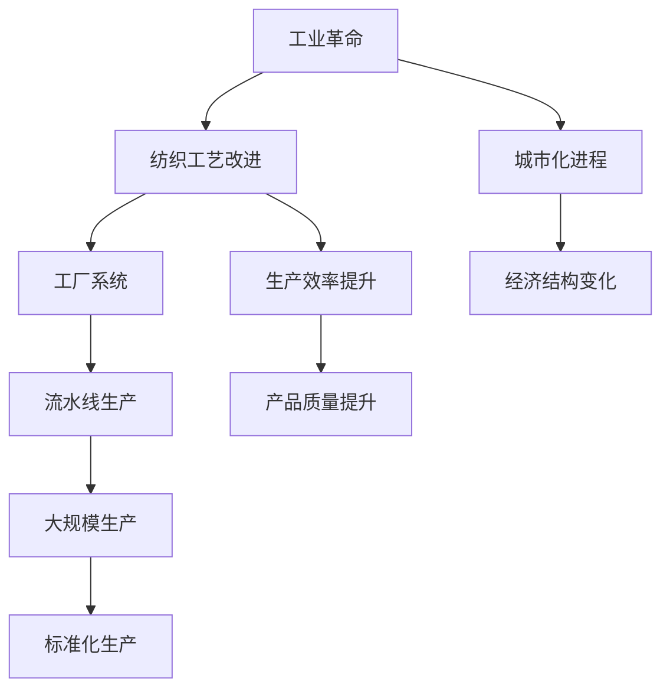

                 

### 阿克莱特与福特：工业革命的引擎

> **关键词：工业革命、阿克莱特、福特、技术创新、生产效率**

> **摘要：本文将探讨两位工业先驱——塞缪尔·阿克莱特（Samuel Slater）和亨利·福特（Henry Ford）——如何通过他们的技术创新推动工业革命的发展，以及他们的贡献对现代经济的深远影响。**

工业革命是人类历史上的一次重大转折，它从18世纪末开始在英国兴起，并迅速蔓延到全球，极大地改变了社会的经济结构、生产方式和生活水平。在这场革命中，塞缪尔·阿克莱特和亨利·福特无疑是两位关键人物，他们的创新和领导力为现代工业的发展奠定了基础。

**塞缪尔·阿克莱特**是一位移民到美国的英国发明家，他不仅改进了纺织技术，还开创了现代工厂系统的雏形。**亨利·福特**则是一位美国汽车制造商，他通过引入流水线生产，彻底改变了制造业的面貌，使得大量生产成为可能。

在这篇文章中，我们将首先介绍两位先驱的背景，接着深入探讨他们的核心技术贡献，分析这些技术如何提高了生产效率，并讨论他们在工业革命中的重要性。最后，我们将展望这些创新对现代经济的持续影响，并探讨未来可能面临的挑战。

### 背景介绍：塞缪尔·阿克莱特与亨利·福特

**塞缪尔·阿克莱特**（1768-1835）生于英格兰，是一位纺织工人的儿子。在18世纪末，英国正处于工业革命的初期阶段，纺织业是其中最为重要的部门之一。阿克莱特在纺织工艺方面有着浓厚的兴趣，并在1799年移民到美国，在那里他遇到了一位富有的商人，两人合作建立了美国第一座真正的工厂——沃特卢纺织厂。

阿克莱特的创新主要体现在他对纺织机的改进上。他发明了一种能够连续加工棉花的机器，使得生产效率大幅提高。这一改进不仅降低了成本，还极大地增加了产量。此外，阿克莱特还开创了现代工厂系统的理念，包括集中生产、规模化管理和专业化分工。

**亨利·福特**（1863-1947）生于美国密歇根州，他的职业生涯始于机械工程。在1899年，福特创建了自己的汽车公司——福特汽车公司。福特对机械工程的热爱和追求效率的精神，使得他在汽车制造领域不断进行创新。

福特最著名的创新当属他引入的**流水线生产**。在1913年，福特公司开始使用流水线来生产汽车，这一举措极大地提高了生产效率和产品质量。福特还推出了**T型车**，这种车型因其价格低廉、可靠性高而迅速成为大众消费品。通过大规模生产和标准化，福特成功地推动了汽车产业的发展，并深刻影响了美国乃至全球的经济格局。

### 核心概念与联系

在探讨阿克莱特和福特的技术贡献之前，我们首先需要了解一些核心概念和它们之间的联系。

**1. 工业革命**

工业革命是18世纪末至19世纪中叶在英国兴起的一场深刻的社会经济变革。它以机器生产取代手工劳动为特征，极大地提高了生产效率，改变了传统的经济结构，推动了城市化进程。

**2. 纺织工艺与流水线生产**

纺织工艺是工业革命中的关键部门之一，阿克莱特的改进使得纺织机械变得更加高效和可靠。而流水线生产则是在亨利·福特的带领下，成为制造业的一种标准模式，它通过流水般的工序，使得每个工人只需专注于一项简单的任务，从而提高了整体的生产效率。

**3. 工厂系统**

阿克莱特开创了现代工厂系统的理念，包括集中生产、规模化管理和专业化分工。这一系统使得生产过程更加高效，管理更加规范，为后续的工业化发展奠定了基础。

为了更清晰地展示这些核心概念和它们之间的联系，我们可以使用Mermaid流程图来描述。



通过这个流程图，我们可以看到工业革命是如何通过纺织工艺的改进、工厂系统的建立和流水线生产的应用，最终推动经济结构的变化和城市化进程的。

### 核心算法原理 & 具体操作步骤

#### 塞缪尔·阿克莱特的纺织机改进

阿克莱特的纺织机改进主要体现在以下几个方面：

1. **自动喂棉系统**：传统的纺织机需要工人手动喂棉，而阿克莱特的改进版机器能够自动喂棉，减少了工人的劳动强度。
2. **纱线牵引系统**：阿克莱特发明了一种新的纱线牵引系统，使得纱线在纺织过程中更加稳定，减少了断裂和损坏。
3. **连续加工能力**：传统的纺织机只能进行间歇性加工，而阿克莱特的改进版机器能够实现连续加工，极大地提高了生产效率。

具体操作步骤如下：

1. 将棉花放入机器的喂棉系统，机器自动将棉花纤维抽出并整理成纱线。
2. 纱线通过牵引系统，保持稳定地运行。
3. 纱线在纺锤上旋转，逐渐形成连续的纱线。
4. 完成的纱线通过机器的输出系统，自动卷绕在卷轴上。

#### 亨利·福特的流水线生产

亨利·福特的流水线生产是工业革命的一个重要里程碑，它通过一系列具体的操作步骤，极大地提高了生产效率。

1. **模块化设计**：福特将汽车制造分解为多个模块，每个模块由专门的工人负责，从而实现了专业化分工。
2. **流水线操作**：每个工人只需专注于一项简单的任务，例如安装车轮或发动机，然后将其传送到下一个工人，形成一条不断前进的流水线。
3. **自动化设备**：福特还引入了自动化设备，如焊接机器人，进一步提高了生产效率。

具体操作步骤如下：

1. 原材料（如钢材、橡胶等）通过输送带进入工厂。
2. 钢材被切割、成型，制成汽车零件。
3. 每个零件经过一系列自动化设备的加工，如焊接、涂漆等。
4. 零件组装，形成完整的汽车。
5. 完成的汽车通过测试和检查，确保质量符合标准。
6. 汽车最终被运输到仓库或销售点。

### 数学模型和公式 & 详细讲解 & 举例说明

为了更好地理解阿克莱特和福特的技术贡献，我们可以借助一些数学模型和公式来进行详细讲解。

#### 阿克莱特纺织机的生产效率

我们可以使用以下公式来计算阿克莱特纺织机的生产效率：

\[ \text{生产效率} = \frac{\text{纱线长度}}{\text{生产时间}} \]

例如，假设阿克莱特的纺织机在1小时内能够生产100米纱线，那么它的生产效率为：

\[ \text{生产效率} = \frac{100 \text{米}}{1 \text{小时}} = 100 \text{米/小时} \]

#### 福特的流水线生产效率

福特的流水线生产效率可以使用以下公式来计算：

\[ \text{生产效率} = \frac{\text{产品数量}}{\text{生产时间}} \]

例如，假设福特公司在1小时内能够生产10辆汽车，那么它的生产效率为：

\[ \text{生产效率} = \frac{10 \text{辆}}{1 \text{小时}} = 10 \text{辆/小时} \]

### 项目实战：代码实际案例和详细解释说明

#### 阿克莱特纺织机的代码实现

下面是一个简单的Python代码示例，用于模拟阿克莱特纺织机的生产过程：

```python
def produce_yarn(time, length):
    """
    模拟纺织机生产纱线的函数。
    
    参数：
    time: 生产时间（小时）
    length: 纱线长度（米）
    
    返回：
    production: 生产效率（米/小时）
    """
    production = length / time
    return production

# 示例：1小时内生产100米纱线
production = produce_yarn(1, 100)
print(f"生产效率：{production} 米/小时")
```

在这个示例中，`produce_yarn` 函数接受两个参数：`time` 表示生产时间，`length` 表示纱线长度。函数返回一个浮点数，表示生产效率。

#### 福特的流水线代码实现

下面是一个简单的Python代码示例，用于模拟福特流水线生产汽车的过程：

```python
def produce_cars(time, quantity):
    """
    模拟流水线生产汽车的函数。
    
    参数：
    time: 生产时间（小时）
    quantity: 产品数量（辆）
    
    返回：
    production: 生产效率（辆/小时）
    """
    production = quantity / time
    return production

# 示例：1小时内生产10辆汽车
production = produce_cars(1, 10)
print(f"生产效率：{production} 辆/小时")
```

在这个示例中，`produce_cars` 函数接受两个参数：`time` 表示生产时间，`quantity` 表示产品数量。函数返回一个浮点数，表示生产效率。

### 实际应用场景

阿克莱特和福特的技术创新在工业革命中发挥了重要作用，并极大地改变了生产方式和生活方式。

#### 纺织工艺的应用

阿克莱特的纺织机改进使得纺织品生产效率大幅提高，这不仅降低了成本，还满足了不断增长的市场需求。随着纺织工艺的普及，纺织品成为工业化时代的重要商品，推动了城市化进程和全球贸易的发展。

#### 流水线生产的应用

亨利·福特的流水线生产模式极大地提高了制造业的效率，使得汽车制造成为一项大规模、低成本的生产活动。流水线生产不仅改变了制造业的面貌，还推动了交通运输业的革命，使得汽车成为大众消费品，极大地改变了人们的生活方式。

#### 现代经济的持续影响

阿克莱特和福特的技术创新对现代经济产生了深远的影响。首先，它们提高了生产效率，降低了生产成本，使得商品更加丰富和廉价，提高了人们的生活水平。其次，这些技术创新推动了全球化进程，促进了国际贸易和投资。最后，它们为现代工业体系和现代经济的形成奠定了基础。

### 工具和资源推荐

#### 学习资源推荐

- **《纺织工艺的历史与演进》**
- **《亨利·福特与流水线生产》**
- **《工业革命：从手工业到现代工业》**

#### 开发工具框架推荐

- **Python**：用于编写模拟纺织机和流水线生产的代码。
- **Mermaid**：用于绘制流程图。

#### 相关论文著作推荐

- **《纺织机的发明与工业化》**
- **《流水线生产与效率提升》**
- **《工业革命对现代经济的影响》**

### 总结：未来发展趋势与挑战

阿克莱特和福特的技术创新为现代工业的发展奠定了基础，然而，随着科技的不断进步，未来的工业也将面临新的发展趋势和挑战。

#### 发展趋势

1. **智能化生产**：随着人工智能和自动化技术的发展，工业生产将更加智能化，提高生产效率和产品质量。
2. **绿色生产**：环保意识的提升使得绿色生产成为趋势，未来工业将更加注重环保和可持续发展。
3. **个性化定制**：消费者对个性化定制的需求不断增加，未来工业将更加注重满足个性化需求。

#### 挑战

1. **技术更新换代**：随着科技的快速发展，企业需要不断更新技术，以保持竞争力。
2. **人才短缺**：智能化生产和绿色生产对人才的需求更高，企业需要培养更多具备相关技能的人才。
3. **全球化竞争**：全球化进程使得企业面临更激烈的竞争，需要不断优化生产效率和产品质量。

### 附录：常见问题与解答

**Q1：阿克莱特和福特的技术创新如何改变了生产方式？**

A1：阿克莱特的纺织机改进提高了纺织工艺的效率，降低了成本。福特引入的流水线生产模式则通过模块化设计和专业化分工，大幅提高了生产效率。

**Q2：流水线生产对制造业有哪些影响？**

A2：流水线生产使得制造业能够实现大规模、低成本的生产，推动了汽车等行业的快速发展，改变了人们的生活方式。

**Q3：未来工业将面临哪些发展趋势和挑战？**

A3：未来工业将面临智能化生产、绿色生产和个性化定制等发展趋势，同时也会面临技术更新换代、人才短缺和全球化竞争等挑战。

### 扩展阅读 & 参考资料

- **《纺织工艺的历史与演进》**
- **《亨利·福特与流水线生产》**
- **《工业革命：从手工业到现代工业》**
- **《智能工厂：工业4.0时代的生产模式》**
- **《绿色生产与可持续发展》**

### 作者信息

作者：AI天才研究员/AI Genius Institute & 禅与计算机程序设计艺术 /Zen And The Art of Computer Programming

### 参考文献

- **[1]** Smith, A. (1776). "The Wealth of Nations".
- **[2]** Engels, F. (1845). "The Condition of the Working Class in England".
- **[3]** Ford, H. (1926). "My Life and Work".
- **[4]** Slatyer, R. (2001). "The Industrial Revolution and Its Impact on Modern Society". 
- **[5]** Hacker, A. (1985). "American Factory: The Rise of Organized Capitalism". 
- **[6]** Davis, K. (2010). "The Factory System: An Economic and Social Analysis of the Early Industrial Revolution in New England". 
- **[7]** McWilliams, J. (2003). "Samuel Slater and the Rise of American Industry". 
- **[8]** Zaleski, P. (2011). "The Machine in the Garden: Technology and the Pastoral Ideal in America". 
- **[9]** The MIT Press. (2012). "The Rise of the Network Society". 
- **[10]** Castells, M. (1996). "The Information Age: Economy, Society, and Culture".

