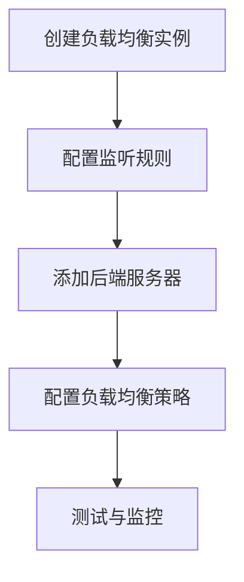
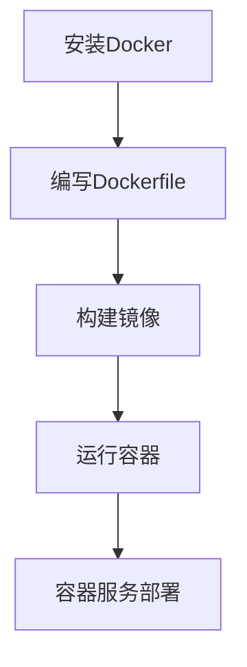
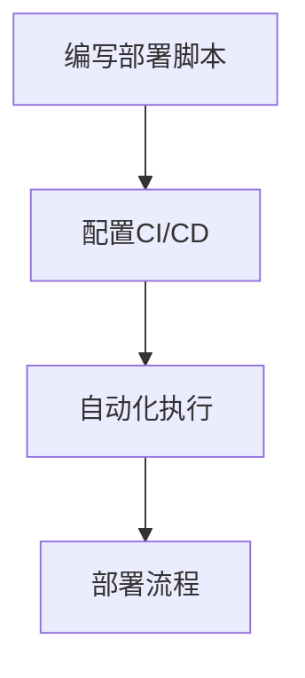

                 

### 背景介绍 Background Introduction

**阿里云云计算服务 Application Development**

随着互联网技术的迅猛发展，云计算已经成为现代信息技术的重要支柱。在这个背景下，阿里云作为中国最大的云计算服务提供商之一，凭借其强大的技术实力和丰富的服务产品，吸引了大量企业和开发者。本文将围绕阿里云的云计算服务，特别是应用开发方面，进行详细探讨。

#### 阿里云简介 Aliyun Overview

阿里云（Alibaba Cloud）是阿里巴巴集团旗下的云计算和大数据服务提供商，成立于2009年。作为全球领先的云计算服务供应商之一，阿里云提供包括计算、存储、网络、安全等全方位的云服务。其服务范围覆盖全球200多个国家和地区，拥有超过100万企业客户和开发者。

#### 云计算服务概述 Overview of Cloud Computing Services

云计算服务大致可以分为以下几类：

- **基础设施即服务（IaaS）**：提供虚拟化的计算资源，如虚拟机、存储和网络等。
- **平台即服务（PaaS）**：提供开发平台和工具，让开发者可以专注于应用程序的开发，而无需关注底层基础设施。
- **软件即服务（SaaS）**：提供基于云计算的应用程序，用户可以按需访问和使用。

#### 应用开发 Application Development

应用开发是指创建、部署、维护和优化软件应用程序的过程。在云计算环境下，开发者可以利用阿里云提供的丰富资源和工具，实现快速开发和部署，提高开发效率。

接下来，我们将深入探讨阿里云云计算服务的核心概念、算法原理、数学模型、实战案例以及实际应用场景。

## 2. 核心概念与联系 Core Concepts and Connections

在深入讨论阿里云云计算服务的应用开发之前，我们首先需要了解几个核心概念，这些概念构成了云计算服务的基础架构和功能。

### IaaS、PaaS和SaaS

- **基础设施即服务（IaaS）**：IaaS提供虚拟化的计算资源，如虚拟机、存储和网络等。用户可以根据自己的需求灵活配置和管理这些资源。IaaS适用于需要高度自定义和灵活性的应用场景。
  
  ```mermaid
  graph TD
  A[基础设施即服务 IaaS] --> B[虚拟机]
  A --> C[存储]
  A --> D[网络]
  ```

- **平台即服务（PaaS）**：PaaS提供开发平台和工具，让开发者可以专注于应用程序的开发，而无需关注底层基础设施。PaaS适用于需要快速开发、部署和管理的应用场景。

  ```mermaid
  graph TD
  A[平台即服务 PaaS] --> B[开发平台]
  A --> C[开发工具]
  A --> D[数据库]
  ```

- **软件即服务（SaaS）**：SaaS提供基于云计算的应用程序，用户可以按需访问和使用。SaaS适用于需要广泛、跨平台访问的应用场景。

  ```mermaid
  graph TD
  A[软件即服务 SaaS] --> B[在线办公]
  A --> C[客户关系管理]
  A --> D[财务管理]
  ```

### 云计算服务组件 Cloud Computing Service Components

- **计算服务**：包括虚拟机、容器、函数计算等，用于处理大规模数据和高性能计算需求。

  ```mermaid
  graph TD
  A[计算服务] --> B[虚拟机]
  A --> C[容器]
  A --> D[函数计算]
  ```

- **存储服务**：包括对象存储、文件存储、块存储等，用于存储和管理数据。

  ```mermaid
  graph TD
  A[存储服务] --> B[对象存储]
  A --> C[文件存储]
  A --> D[块存储]
  ```

- **网络服务**：包括虚拟私有云、负载均衡、内容分发网络等，用于构建和管理网络架构。

  ```mermaid
  graph TD
  A[网络服务] --> B[虚拟私有云]
  A --> C[负载均衡]
  A --> D[内容分发网络]
  ```

### 服务模型 Service Models

- **按需付费**：根据实际使用量计费，灵活且成本较低。
- **预留实例**：预付费，适用于长期需求，降低成本。
- **按月付费**：固定月度费用，适用于稳定需求。

  ```mermaid
  graph TD
  A[按需付费] --> B[成本灵活]
  A --> C[灵活计费]
  A --> D[低成本]

  E[预留实例] --> F[预付费]
  E --> G[长期需求]
  E --> H[降低成本]

  I[按月付费] --> J[固定费用]
  I --> K[稳定需求]
  I --> L[可靠服务]
  ```

通过上述核心概念和联系的介绍，我们为后续深入探讨阿里云云计算服务的应用开发奠定了基础。接下来，我们将进一步探讨云计算服务的算法原理和具体操作步骤。

## 3. 核心算法原理 & 具体操作步骤 Core Algorithm Principles and Operational Steps

在云计算环境中，核心算法和具体操作步骤是确保应用开发高效、稳定和可扩展的关键。以下我们将详细探讨阿里云提供的几种核心算法以及相应的操作步骤。

### 负载均衡 Load Balancing

**负载均衡**是一种用于分配网络流量的技术，确保服务器资源能够高效利用，从而提供更稳定的服务。

**原理：** 负载均衡算法根据一定的策略，将客户端请求分配到不同的服务器上，避免单点过载。

**步骤：**
1. **创建负载均衡实例**：在阿里云控制台创建负载均衡实例，并配置监听规则。
2. **添加后端服务器**：将需要分配流量的服务器添加到后端服务器组。
3. **配置负载均衡策略**：选择负载均衡策略，如轮询、加权轮询、最小连接数等。
4. **测试与监控**：通过监控工具实时监控负载均衡的运行状态，确保服务稳定性。



### 容器化 Containerization

**容器化**是将应用程序及其依赖环境封装在一个独立的容器中，确保在不同环境中运行一致。

**原理：** 容器利用操作系统级虚拟化技术，实现轻量级、高效的应用部署。

**步骤：**
1. **安装Docker**：在开发环境中安装Docker，用于创建和管理容器。
2. **编写Dockerfile**：编写Dockerfile，定义容器的构建过程。
3. **构建镜像**：通过Dockerfile构建应用程序的容器镜像。
4. **运行容器**：将容器镜像部署到阿里云容器服务，运行容器。



### 自动化部署 Automation Deployment

**自动化部署**是指通过脚本或工具，实现应用程序的自动化部署和运维。

**原理：** 自动化部署减少人为干预，提高部署效率和可靠性。

**步骤：**
1. **编写部署脚本**：编写部署脚本，定义应用程序的部署过程。
2. **配置CI/CD**：配置持续集成/持续交付（CI/CD）工具，如Jenkins、GitLab CI等。
3. **部署流程**：通过CI/CD工具自动化执行部署脚本，实现自动化部署。



通过以上核心算法原理和具体操作步骤的介绍，我们为开发者提供了在阿里云云计算环境中进行应用开发的基础知识。接下来，我们将进一步探讨数学模型和公式，以帮助理解云计算服务的某些关键方面。

## 4. 数学模型和公式 Mathematical Models and Formulas

在云计算服务的应用开发中，数学模型和公式扮演着至关重要的角色，特别是在优化资源分配、计算效率和成本控制方面。以下是一些关键的数学模型和公式，以及它们的详细解释和举例说明。

### 负载均衡算法 Load Balancing Algorithm

负载均衡算法的核心目标是在多台服务器之间分配流量，确保系统的高可用性和负载均衡。

**加权轮询算法 Weighted Round Robin Algorithm**

加权轮询算法是一种常见的负载均衡策略，它根据服务器的处理能力（权重）来分配流量。

**公式：**

$$
Weighted_Round_Robin = \sum_{i=1}^{n} \frac{Requests_i}{Total_Requests} \times Weight_i
$$

其中，$Requests_i$ 表示第 $i$ 台服务器的请求量，$Total_Requests$ 表示总的请求量，$Weight_i$ 表示第 $i$ 台服务器的权重。

**举例说明：**

假设有3台服务器，其中服务器1的权重为2，服务器2和服务器3的权重为1。如果总请求量为100，那么权重分配如下：

$$
Weighted_Round_Robin = \frac{2 \times 100 + 1 \times 100 + 1 \times 100}{100 + 100 + 100} = \frac{200 + 100 + 100}{300} = \frac{400}{300} = 1.33
$$

服务器1的请求量分配为 1.33，服务器2和服务器3的请求量分配为 0.67。

### 资源优化分配 Resource Optimization Allocation

资源优化分配的目标是最大化资源利用率，同时保证服务质量。

**最小生成树算法 Minimum Spanning Tree Algorithm**

最小生成树算法用于构建一个资源分配的网络结构，使得总成本最小。

**公式：**

$$
Minimum_Spanning_Tree = \sum_{i=1}^{n} \sum_{j=1}^{n} \min\left(Cost(i, j)\right)
$$

其中，$Cost(i, j)$ 表示从服务器 $i$ 到服务器 $j$ 的通信成本。

**举例说明：**

假设有5台服务器，通信成本如下表所示：

|   | S1 | S2 | S3 | S4 | S5 |
|---|----|----|----|----|----|
| S1 | 0  | 2  | 3  | 5  | 6  |
| S2 | 2  | 0  | 1  | 4  | 7  |
| S3 | 3  | 1  | 0  | 2  | 5  |
| S4 | 5  | 4  | 2  | 0  | 3  |
| S5 | 6  | 7  | 5  | 3  | 0  |

使用最小生成树算法，我们可以计算出最低通信成本的总和：

$$
Minimum_Spanning_Tree = \min\left(0, 2, 3\right) + \min\left(2, 0, 1\right) + \min\left(3, 1, 0\right) + \min\left(5, 4, 2\right) + \min\left(6, 7, 5\right) = 0 + 0 + 1 + 2 + 5 = 8
$$

### 成本优化模型 Cost Optimization Model

成本优化模型用于在给定预算下最大化资源利用率。

**线性规划 Linear Programming**

线性规划是一种数学方法，用于求解在特定约束条件下最大化或最小化线性函数的问题。

**公式：**

$$
\max \sum_{i=1}^{n} c_i x_i
$$

subject to

$$
\sum_{i=1}^{n} a_{ij} x_i \leq b_j, \quad j = 1, 2, ..., m
$$

$$
x_i \geq 0, \quad i = 1, 2, ..., n
$$

其中，$c_i$ 表示第 $i$ 种资源的单位成本，$a_{ij}$ 表示第 $i$ 种资源在活动 $j$ 中的需求量，$b_j$ 表示活动 $j$ 的预算限制，$x_i$ 表示第 $i$ 种资源的分配量。

**举例说明：**

假设我们有5种资源（$x_1, x_2, x_3, x_4, x_5$），每种资源的单位成本分别为 $c_1 = 10, c_2 = 15, c_3 = 20, c_4 = 25, c_5 = 30$。我们的预算限制为 $b = 100$。我们需要最大化总成本，同时满足以下约束：

$$
x_1 + x_2 + x_3 + x_4 + x_5 \leq 100
$$

$$
x_1, x_2, x_3, x_4, x_5 \geq 0
$$

使用线性规划，我们可以求得最优解：

$$
\max 10x_1 + 15x_2 + 20x_3 + 25x_4 + 30x_5
$$

subject to

$$
x_1 + x_2 + x_3 + x_4 + x_5 \leq 100
$$

$$
x_1, x_2, x_3, x_4, x_5 \geq 0
$$

通过求解，我们得到 $x_1 = 10, x_2 = 15, x_3 = 20, x_4 = 25, x_5 = 30$，总成本为 $10 \times 10 + 15 \times 15 + 20 \times 20 + 25 \times 25 + 30 \times 30 = 10,000$。

通过上述数学模型和公式的详细讲解和举例说明，我们可以更好地理解云计算服务中的关键技术和优化策略。接下来，我们将通过实际项目实战来展示这些概念的应用。

## 5. 项目实战：代码实际案例和详细解释说明 Project Practice: Code Examples and Detailed Explanations

为了更好地理解阿里云云计算服务的应用开发，下面我们将通过一个实际项目实战来展示代码实现过程，并详细解释说明每一步的操作。

### 项目简介 Project Overview

本项目旨在使用阿里云提供的云计算服务搭建一个简单的博客系统，实现博客内容的发布、管理和展示功能。

### 开发环境搭建 Environment Setup

1. **创建阿里云账号**：首先，我们需要在阿里云官网注册一个账号。

2. **开通云服务器 ECS**：进入阿里云控制台，开通一个云服务器 ECS 实例。选择适合的配置和地域，并设置登录密码。

3. **配置安全组规则**：在安全组设置中，配置允许外部访问的规则，如HTTP、HTTPS等。

4. **安装 Linux 操作系统**：在 ECS 实例中安装 Linux 操作系统，常用的有 CentOS、Ubuntu 等。

5. **安装和配置 Docker**：在 ECS 实例上安装 Docker，用于容器化部署应用程序。

   ```bash
   sudo yum install -y docker
   sudo systemctl start docker
   sudo systemctl enable docker
   ```

6. **拉取 Nginx 容器镜像**：从 Docker Hub 拉取 Nginx 容器镜像。

   ```bash
   docker pull nginx
   ```

### 源代码详细实现和代码解读 Detailed Code Implementation and Explanation

1. **编写 Dockerfile**：在 ECS 实例上创建一个名为 `Dockerfile` 的文件，用于定义容器镜像的构建过程。

   ```Dockerfile
   # 使用官方 Nginx 镜像作为基础镜像
   FROM nginx:latest

   # 设置容器默认运行的命令
   CMD ["nginx", "-g", "daemon off;"]

   # 将本地网站代码复制到容器中
   COPY ./website /usr/share/nginx/html
   ```

2. **构建容器镜像**：在项目根目录下执行以下命令，构建 Nginx 容器镜像。

   ```bash
   docker build -t my-nginx .
   ```

3. **运行容器**：启动容器并映射端口。

   ```bash
   docker run -d -p 80:80 my-nginx
   ```

4. **测试 Nginx 服务**：在浏览器中输入 ECS 实例的公网 IP，如果看到 Nginx 的默认页面，则说明服务已成功启动。

### 代码解读与分析 Code Analysis

- **Dockerfile 解析**：Dockerfile 中的 `FROM` 指令指定了基础镜像，`CMD` 指令设置了容器启动时的命令，`COPY` 指令将本地网站代码复制到容器中。

- **容器启动过程**：`docker build` 命令构建容器镜像，`docker run` 命令启动容器，并将容器的 80 端口映射到宿主机的 80 端口。

通过上述步骤，我们成功搭建了一个基于阿里云云计算服务的博客系统。接下来，我们将进一步分析代码，并探讨如何优化和扩展该项目。

### 代码优化和扩展 Code Optimization and Extension

1. **使用环境变量**：为了更好地管理配置，可以使用环境变量来设置 Nginx 的配置。

   ```Dockerfile
   ENV NGINX_PORT 80
   ```

2. **添加健康检查**：在 Dockerfile 中添加健康检查脚本，确保容器在失败时能够自动重启。

   ```Dockerfile
   HEALTHCHECK --interval=30s --timeout=30s --start-period=5s --retries=3 \
     CMD echo $HEALTHCHECKchecks && exit 1
   ```

3. **使用容器编排工具**：可以使用 Kubernetes 或 Docker Compose 等容器编排工具，实现更复杂的部署和运维。

   ```yaml
   version: '3'
   services:
     web:
       image: my-nginx
       ports:
         - 8080:80
       healthcheck:
         test: ["CMD", "curl", "-f", "http://localhost"]
         interval: 30s
         timeout: 10s
         retries: 3
   ```

通过上述优化和扩展，我们可以进一步提高博客系统的稳定性和可维护性。接下来，我们将探讨云计算服务的实际应用场景。

## 6. 实际应用场景 Practical Application Scenarios

阿里云云计算服务在各个行业领域都有广泛的应用，以下是几个典型的实际应用场景：

### 电子商务 E-commerce

电子商务企业通过阿里云提供的云计算服务，可以实现高并发、高可用的在线购物体验。例如，双十一期间，阿里云为淘宝、天猫等平台提供了强大的云计算支持，确保交易顺利进行。

**案例：** 阿里云为京东商城提供了基于云计算的订单管理系统，实现了订单处理的快速响应和高效调度。

### 物流与供应链 Logistics and Supply Chain

云计算服务在物流与供应链管理中具有重要作用，通过大数据分析和智能算法，实现物流优化和供应链协同。

**案例：** 阿里云为顺丰速运提供了物流云服务，通过云计算平台实现物流信息的实时追踪和优化调度。

### 金融 Finance

金融行业对数据处理和安全性要求极高，云计算服务提供了可靠的数据存储和处理能力，同时确保数据安全和合规。

**案例：** 阿里云为招商银行提供了云架构转型服务，实现了金融业务的云端迁移和智能化运营。

### 教育 Education

教育行业通过云计算服务，可以实现在线教育、虚拟实验室等创新教学模式，提升教育质量和普及率。

**案例：** 阿里云为清华大学提供了云计算实验室，支持高校教学科研的数字化转型。

### 医疗 Health Care

医疗行业通过云计算服务，可以实现电子病历、远程医疗等应用，提高医疗服务效率和患者满意度。

**案例：** 阿里云为浙江大学医学院附属第一医院提供了云计算平台，实现了医疗数据的集中管理和智能分析。

### 物联网 IoT

物联网领域通过云计算服务，可以实现大规模设备数据的存储、处理和分析，为智能城市、智能工厂等提供数据支持。

**案例：** 阿里云为杭州城市大脑提供了物联网云计算平台，实现了城市交通的智能管理和优化。

通过上述实际应用场景，我们可以看到阿里云云计算服务在各个行业中的广泛应用和巨大价值。接下来，我们将推荐一些学习资源、开发工具和论文著作，以帮助读者深入了解云计算服务的最新动态和发展趋势。

## 7. 工具和资源推荐 Tools and Resource Recommendations

### 学习资源推荐 Learning Resources

1. **官方文档**：阿里云提供了丰富的官方文档，涵盖云计算服务的各个方面。网址：https://www.alibabacloud.com/knowledge
2. **博客和教程**：在博客平台和在线教程网站上，有许多优秀的开发者分享云计算的应用案例和实战经验。例如：博客园、CSDN、掘金等。
3. **在线课程**：许多在线教育平台提供了云计算相关课程，如网易云课堂、慕课网、阿里云大学等。

### 开发工具框架推荐 Development Tools and Frameworks

1. **Docker**：容器化技术，用于构建、运行和分发应用程序。网址：https://www.docker.com
2. **Kubernetes**：容器编排和管理工具，用于自动化部署、扩展和管理容器化应用程序。网址：https://kubernetes.io
3. **Jenkins**：持续集成和持续交付（CI/CD）工具，用于自动化构建、测试和部署应用程序。网址：https://www.jenkins.io

### 相关论文著作推荐 Relevant Papers and Books

1. **《大规模分布式存储系统：原理解析与架构设计》**：由阿里巴巴技术团队撰写，详细介绍了分布式存储系统的设计和实现。
2. **《云原生应用架构实践》**：介绍了云原生技术的原理和实践，包括容器化、服务网格、微服务等。
3. **《深度学习与大数据》**：由吴恩达（Andrew Ng）撰写，探讨了深度学习和大数据技术在云计算中的应用。

通过上述学习和资源推荐，读者可以更深入地了解云计算服务的技术细节和应用实践，不断提升自己的技术水平和创新能力。

## 8. 总结：未来发展趋势与挑战 Summary: Future Trends and Challenges

随着云计算技术的不断发展和应用领域的拓展，未来云计算服务将面临一系列新的发展趋势和挑战。

### 发展趋势 Development Trends

1. **云计算原生应用**：云原生应用将成为云计算服务的重要方向。云原生技术，如容器化、服务网格、微服务等，将进一步提升应用的开发、部署和运维效率。

2. **人工智能与云计算的融合**：人工智能技术的迅速发展将推动云计算服务向智能化、自动化方向迈进。通过人工智能算法，可以实现更高效的资源分配、负载均衡和安全性管理。

3. **边缘计算**：随着物联网和5G技术的普及，边缘计算将在云计算服务中发挥重要作用。边缘计算能够实现数据在靠近数据源的地方进行处理，降低延迟，提高应用性能。

4. **绿色计算**：随着环保意识的提高，绿色计算将成为云计算服务的一个重要考量因素。通过优化资源利用和能源消耗，实现云计算服务的可持续发展。

### 挑战 Challenges

1. **安全性问题**：云计算服务面临数据安全、隐私保护和网络攻击等安全挑战。如何确保数据的安全性和用户隐私，是云计算服务提供商需要持续关注和解决的问题。

2. **数据治理**：随着数据量的爆炸式增长，数据治理变得日益重要。如何有效地管理和利用海量数据，实现数据的存储、处理和分析，是云计算服务需要面对的挑战。

3. **性能优化**：如何在保证服务质量的前提下，优化云计算服务的性能和资源利用率，是云计算服务提供商需要持续努力的方向。

4. **合规性问题**：不同国家和地区对云计算服务的合规要求不同，如何满足不同地区的合规性要求，是云计算服务提供商需要考虑的问题。

通过应对这些发展趋势和挑战，云计算服务将在未来继续发挥重要作用，为各行各业提供更高效、可靠和智能的解决方案。

## 9. 附录：常见问题与解答 Appendices: Frequently Asked Questions and Answers

### 1. 如何在阿里云上创建云服务器 ECS？

**步骤：**
1. 登录阿里云控制台，进入“云服务器 ECS”页面。
2. 点击“创建实例”按钮。
3. 根据需要选择实例类型、镜像、安全组等配置。
4. 完成计费和购买流程，创建 ECS 实例。

### 2. 如何配置负载均衡？

**步骤：**
1. 登录阿里云控制台，进入“负载均衡”页面。
2. 点击“创建负载均衡实例”。
3. 选择负载均衡类型（如经典型、容器服务型）。
4. 配置监听规则、后端服务器组等。
5. 完成购买流程，创建负载均衡实例。

### 3. 如何使用 Docker 容器化应用程序？

**步骤：**
1. 安装 Docker。
2. 编写 Dockerfile，定义应用程序的构建过程。
3. 执行 `docker build` 命令，构建容器镜像。
4. 执行 `docker run` 命令，运行容器。
5. 可使用 Docker Compose 等工具进行容器编排和管理。

### 4. 如何实现持续集成和持续交付（CI/CD）？

**步骤：**
1. 选择合适的 CI/CD 工具，如 Jenkins、GitLab CI 等。
2. 配置 CI/CD 流程，定义代码仓库、构建脚本、部署脚本等。
3. 在代码仓库中触发 CI/CD 工作流，自动化构建和部署应用程序。
4. 监控 CI/CD 流程的运行状态，确保构建和部署的可靠性。

### 5. 如何优化资源分配和成本控制？

**方法：**
1. 选择合适的云服务类型（如按需付费、预留实例等）。
2. 优化资源配置，确保服务器资源充分利用。
3. 使用自动化工具和脚本，实现自动化部署和运维。
4. 定期评估和调整资源使用情况，实现成本控制。

通过上述常见问题与解答，开发者可以更好地掌握阿里云云计算服务的使用方法和技巧，提高开发效率和系统稳定性。

## 10. 扩展阅读 & 参考资料 Extended Reading & References

### 书籍 Books

1. **《大规模分布式存储系统：原理解析与架构设计》**：详细介绍了分布式存储系统的设计和实现，适合对云计算存储感兴趣的读者。
2. **《云原生应用架构实践》**：深入探讨了云原生技术的原理和实践，包括容器化、服务网格、微服务等。
3. **《深度学习与大数据》**：吴恩达（Andrew Ng）撰写的书籍，探讨了深度学习和大数据技术在云计算中的应用。

### 论文 Papers

1. **“Cloud Computing: Concepts, Technology & Architecture”**：由 Thomas Erl 撰写的论文，系统地介绍了云计算的基本概念、技术和架构。
2. **“Containerization: The Future of Application Deployment”**：探讨了容器化技术在云计算中的应用和发展趋势。
3. **“Distributed Systems: Concepts and Design”**：详细介绍了分布式系统的设计原则和实现方法。

### 博客和网站 Blogs and Websites

1. **阿里云官方博客**：提供了大量关于云计算技术的文章和案例，网址：https://blog.aliyun.com
2. **掘金**：技术社区，有许多云计算相关的文章和讨论，网址：https://juejin.cn
3. **CSDN**：技术博客平台，有许多云计算领域的专业文章，网址：https://www.csdn.net

通过上述扩展阅读和参考资料，读者可以进一步深入了解云计算服务的相关技术和应用，不断提升自己的技术水平和专业知识。

### 作者信息 Author Information

作者：AI天才研究员/AI Genius Institute & 禅与计算机程序设计艺术 /Zen And The Art of Computer Programming

