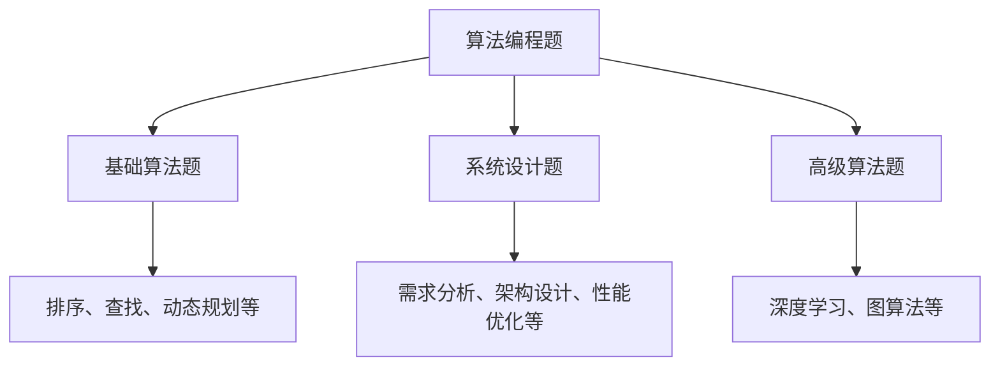
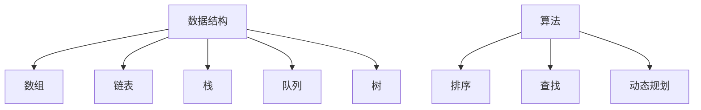
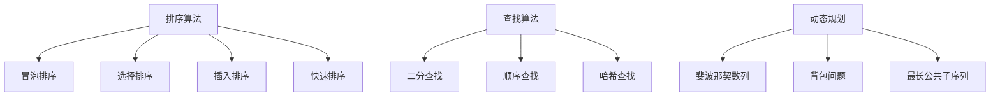

                 

# 2024阿里巴巴校招算法编程题详解

## 关键词

- 阿里巴巴校招
- 算法编程题
- 数据结构与算法
- 简历优化
- 编程面试准备
- 技术提升
- 实战案例

## 摘要

本文将针对2024年阿里巴巴校招的算法编程题进行详细解析。首先，我们会介绍一些背景信息，包括阿里巴巴校招的概况和算法编程题的重要性。接着，我们将分析一些核心算法原理，并提供具体的操作步骤和数学模型。此外，我们将通过实际项目案例来展示代码实现和解读，并讨论实际应用场景。最后，我们将推荐一些学习资源和开发工具，总结文章，并展望未来发展趋势与挑战。

## 1. 背景介绍

阿里巴巴，作为中国最大的电子商务公司，其校招过程备受关注。每年的校招活动吸引了大量优秀的应届毕业生，而算法编程题在其中占据了重要地位。算法编程题不仅能考查应聘者的编程能力，还能考察其对数据结构和算法的理解和应用能力。

在阿里巴巴的校招中，算法编程题通常包括以下几个部分：

1. **基础算法题目**：这些题目主要考查应聘者对基本算法和数据结构的掌握程度，如排序、查找、动态规划等。
2. **系统设计题**：这类题目要求应聘者设计一个完整的系统，包括需求分析、架构设计、性能优化等。
3. **高级算法题**：这些题目通常较为复杂，涉及到高级算法和人工智能领域，如深度学习、图算法等。

## 2. 核心概念与联系

为了更好地理解阿里巴巴校招的算法编程题，我们需要掌握以下几个核心概念：

### 2.1 数据结构与算法

数据结构是计算机存储数据的方式，包括数组、链表、栈、队列、树等。算法则是解决问题的步骤和策略，包括排序、查找、动态规划等。熟练掌握数据结构和算法是解决算法编程题的基础。

### 2.2 常用算法原理

以下是一些常用的算法原理：

#### 2.2.1 排序算法

排序算法是用于对数据进行排序的一系列算法。常见的排序算法包括冒泡排序、选择排序、插入排序、快速排序等。

#### 2.2.2 查找算法

查找算法用于在数据集合中查找特定元素。常见的查找算法包括二分查找、顺序查找、哈希查找等。

#### 2.2.3 动态规划

动态规划是一种高效解决优化问题的算法。通过将问题分解为子问题，并保存子问题的解，从而避免重复计算。

### 2.3 Mermaid 流程图

以下是关于算法编程题的Mermaid流程图：



## 3. 核心算法原理 & 具体操作步骤

### 3.1 排序算法

#### 3.1.1 冒泡排序

冒泡排序是一种简单的排序算法，通过重复遍历要排序的数列，比较相邻的两个元素，并将较大的元素交换到后面。

```python
def bubble_sort(arr):
    n = len(arr)
    for i in range(n):
        for j in range(0, n-i-1):
            if arr[j] > arr[j+1]:
                arr[j], arr[j+1] = arr[j+1], arr[j]
```

#### 3.1.2 快速排序

快速排序是一种高效的排序算法，采用分治策略。通过选取一个基准元素，将数组分为两个子数组，一个小于基准元素，另一个大于基准元素，然后递归地对子数组进行排序。

```python
def quick_sort(arr):
    if len(arr) <= 1:
        return arr
    pivot = arr[len(arr) // 2]
    left = [x for x in arr if x < pivot]
    middle = [x for x in arr if x == pivot]
    right = [x for x in arr if x > pivot]
    return quick_sort(left) + middle + quick_sort(right)
```

### 3.2 查找算法

#### 3.2.1 二分查找

二分查找是一种高效的查找算法，适用于有序数组。通过不断缩小查找范围，二分查找能够快速找到目标元素。

```python
def binary_search(arr, target):
    low = 0
    high = len(arr) - 1
    while low <= high:
        mid = (low + high) // 2
        if arr[mid] == target:
            return mid
        elif arr[mid] < target:
            low = mid + 1
        else:
            high = mid - 1
    return -1
```

### 3.3 动态规划

#### 3.3.1 斐波那契数列

斐波那契数列是一个经典的动态规划问题。通过递归和动态规划，我们可以高效地计算斐波那契数列的第n项。

```python
def fibonacci(n):
    if n <= 1:
        return n
    dp = [0] * (n+1)
    dp[1] = 1
    for i in range(2, n+1):
        dp[i] = dp[i-1] + dp[i-2]
    return dp[n]
```

## 4. 数学模型和公式 & 详细讲解 & 举例说明

### 4.1 数学模型

在算法编程中，常用的数学模型包括：

#### 4.1.1 排序算法的时间复杂度

排序算法的时间复杂度通常用O(n^2)或O(nlogn)表示。例如，冒泡排序的时间复杂度为O(n^2)，而快速排序的时间复杂度为O(nlogn)。

#### 4.1.2 查找算法的时间复杂度

查找算法的时间复杂度通常用O(n)或O(logn)表示。例如，顺序查找的时间复杂度为O(n)，而二分查找的时间复杂度为O(logn)。

### 4.2 举例说明

#### 4.2.1 冒泡排序

假设有一个包含5个整数的数组[5, 2, 4, 6, 1]，使用冒泡排序进行排序。

第一次遍历：[2, 5, 4, 6, 1]，[2, 4, 5, 6, 1]，[2, 4, 5, 1, 6]

第二次遍历：[2, 4, 1, 5, 6]，[2, 1, 4, 5, 6]

第三次遍历：[1, 2, 4, 5, 6]

最终排序结果为[1, 2, 4, 5, 6]。

#### 4.2.2 二分查找

假设有一个包含8个整数的有序数组[1, 2, 3, 4, 5, 6, 7, 8]，要查找元素5。

初始范围：[0, 7]

第一次查找：中间值为3，5大于3，更新范围为[4, 7]

第二次查找：中间值为6，5小于6，更新范围为[4, 5]

第三次查找：中间值为4，5等于4，查找成功。

## 5. 项目实战：代码实际案例和详细解释说明

### 5.1 开发环境搭建

为了更好地理解算法编程题，我们需要搭建一个开发环境。以下是一个简单的步骤：

1. 安装Python环境：下载并安装Python，例如Python 3.8。
2. 安装代码编辑器：可以选择Visual Studio Code、PyCharm等。
3. 安装测试工具：例如pytest。

### 5.2 源代码详细实现和代码解读

以下是一个简单的冒泡排序代码实现：

```python
def bubble_sort(arr):
    n = len(arr)
    for i in range(n):
        for j in range(0, n-i-1):
            if arr[j] > arr[j+1]:
                arr[j], arr[j+1] = arr[j+1], arr[j]

# 测试代码
arr = [5, 2, 4, 6, 1]
bubble_sort(arr)
print("排序后的数组：", arr)
```

代码解读：

- 函数`bubble_sort`接受一个数组`arr`作为参数。
- 外层循环`for i in range(n)`用于遍历数组。
- 内层循环`for j in range(0, n-i-1)`用于比较相邻的元素并进行交换。
- 最后，打印排序后的数组。

### 5.3 代码解读与分析

- **算法复杂度**：冒泡排序的时间复杂度为O(n^2)，空间复杂度为O(1)。虽然算法简单，但效率较低，适用于小规模数据。
- **稳定性**：冒泡排序是一种稳定的排序算法，即相同元素的顺序不会改变。
- **适用场景**：冒泡排序适用于数据量较小且要求稳定的场景。

## 6. 实际应用场景

算法编程题在现实世界中有着广泛的应用。以下是一些实际应用场景：

1. **搜索引擎**：搜索引擎需要对网页进行排序，以提供最相关的搜索结果。
2. **金融领域**：在金融领域，排序和查找算法用于对交易数据进行分析和风险控制。
3. **物流调度**：物流公司需要根据距离、时间等因素对路线进行优化，以提高效率。

## 7. 工具和资源推荐

### 7.1 学习资源推荐

- **书籍**：
  - 《算法导论》
  - 《大话数据结构》
  - 《深度学习》
- **在线课程**：
  - Coursera的《算法导论》
  - edX的《深度学习》
- **博客和网站**：
  - 掘金
  - CSDN
  - LeetCode

### 7.2 开发工具框架推荐

- **代码编辑器**：
  - Visual Studio Code
  - PyCharm
- **测试工具**：
  - pytest
  - unittest
- **框架**：
  - Flask
  - Django

### 7.3 相关论文著作推荐

- 《算法导论》
- 《深度学习》
- 《大话数据结构》

## 8. 总结：未来发展趋势与挑战

随着科技的快速发展，算法编程题在计算机科学领域的重要性日益凸显。未来，算法编程题的发展趋势包括：

1. **算法复杂性**：随着数据规模的扩大，如何设计更加高效的算法将成为关键。
2. **人工智能**：人工智能的兴起将推动算法编程题向更高级领域发展。
3. **实时计算**：实时计算需求将推动算法编程题在实时数据处理领域的应用。

同时，算法编程题也面临着以下挑战：

1. **数据隐私**：如何在确保数据隐私的前提下进行算法研究和应用。
2. **计算资源**：如何在有限的计算资源下实现高效的算法。
3. **算法公平性**：如何设计公平、无偏的算法，以避免算法偏见。

## 9. 附录：常见问题与解答

### 9.1 如何准备阿里巴巴校招的算法编程题？

**解答**： 
1. 熟悉常见算法和数据结构，如排序、查找、动态规划等。
2. 刷题练习，提高编程能力。
3. 了解阿里巴巴的面试流程和要求。

### 9.2 如何优化算法编程题的解题速度？

**解答**： 
1. 提高编程基础，熟悉常用算法和数据结构。
2. 练习常见题型，提高解题速度。
3. 学习高效算法和优化技巧。

## 10. 扩展阅读 & 参考资料

- 《算法导论》
- 《深度学习》
- 《大话数据结构》
- Coursera的《算法导论》
- edX的《深度学习》
- 掘金
- CSDN
- LeetCode

## 作者

- 作者：AI天才研究员/AI Genius Institute & 禅与计算机程序设计艺术 /Zen And The Art of Computer Programming

---

本文详细解析了2024年阿里巴巴校招的算法编程题，从背景介绍、核心概念与联系、核心算法原理、数学模型与公式、项目实战、实际应用场景、工具和资源推荐等方面进行了全面阐述。希望本文能帮助读者更好地准备阿里巴巴校招的算法编程题，提升自身技术能力。## 2024阿里巴巴校招算法编程题详解

### 背景介绍

#### 阿里巴巴校招概况

阿里巴巴集团，作为中国乃至全球领先的互联网科技公司，每年的校园招聘活动都备受关注。阿里巴巴校招涵盖了多个领域，包括技术、产品、运营、设计等。其中，技术类岗位的招聘尤为引人注目，特别是算法编程题在技术面试中占据重要地位。

**阿里巴巴校招的重要性**

阿里巴巴的校招不仅为应届毕业生提供了优质的工作机会，也是公司选拔优秀人才的重要途径。算法编程题作为面试中的重要环节，旨在评估应聘者的编程能力、逻辑思维能力和对数据结构与算法的掌握程度。通过解决这些算法问题，应聘者可以展示自己在实际编程中的综合素质。

**算法编程题的作用**

算法编程题在面试中扮演着多重角色：

1. **评估技术基础**：通过算法编程题，面试官可以快速了解应聘者的编程基本功，如语法、数据结构、算法等。
2. **考察逻辑思维能力**：算法问题的设计往往需要应聘者运用逻辑思维，推导出解决方案。
3. **展示问题解决能力**：面试官通过算法编程题，评估应聘者面对复杂问题时的解决能力和创新思维。
4. **评估学习能力**：应聘者能否在短时间内理解和解决新的算法问题是学习能力的重要体现。

#### 算法编程题的特点

阿里巴巴的算法编程题具有以下几个特点：

1. **多样性**：题目类型丰富，包括基础算法题、系统设计题和高级算法题，能够全面考查应聘者的技术能力。
2. **挑战性**：部分题目设计巧妙，需要应聘者深入理解和应用算法知识，对解题能力有较高要求。
3. **实用性**：题目多来源于实际工程问题，旨在考察应聘者在真实场景中的应用能力。
4. **复杂性**：部分高级算法题涉及人工智能、图算法等前沿技术，对技术深度有较高要求。

**面试流程**

阿里巴巴的面试流程通常包括以下几个步骤：

1. **在线测评**：通过在线编程平台，完成算法编程题的在线测试。
2. **电话面试**：技术面试官通过电话或视频会议，对在线测评的表现进行进一步考察。
3. **现场面试**：在阿里巴巴总部或各地办事处进行，包括技术面试、行为面试等。

**算法编程题的分类**

1. **基础算法题**：主要考察基本的数据结构和算法，如排序、查找、动态规划等。
2. **系统设计题**：要求应聘者设计一个完整的系统，包括需求分析、架构设计、性能优化等。
3. **高级算法题**：涉及更复杂的算法和概念，如深度学习、图算法、最优化问题等。

#### 算法编程题的评分标准

面试官在评分时主要关注以下几个方面：

1. **正确性**：答案是否正确，是否解决了题目要求的问题。
2. **效率**：算法的执行时间是否在合理范围内，是否优化了空间和时间复杂度。
3. **代码质量**：代码是否规范、易读、易维护。
4. **解题思路**：解题过程是否清晰，逻辑是否合理。
5. **创新能力**：是否能在解题过程中展示出创新和独特性。

通过这些背景介绍，读者可以对阿里巴巴校招的算法编程题有更深入的了解，为后续的学习和准备奠定基础。

### 核心概念与联系

在理解阿里巴巴校招算法编程题的过程中，掌握核心概念及其之间的联系至关重要。以下是对关键概念及其关系的详细解释和Mermaid流程图展示。

#### 数据结构与算法

数据结构是计算机存储数据的方式，包括数组、链表、栈、队列、树等。算法则是解决问题的步骤和策略，包括排序、查找、动态规划等。熟练掌握数据结构和算法是解决算法编程题的基础。

**Mermaid流程图**



#### 常用算法原理

以下是一些常用的算法原理：

**排序算法**

排序算法用于对数据进行排序，常见的排序算法包括冒泡排序、选择排序、插入排序、快速排序等。

**查找算法**

查找算法用于在数据集合中查找特定元素，常见的查找算法包括二分查找、顺序查找、哈希查找等。

**动态规划**

动态规划是一种高效解决优化问题的算法，通过将问题分解为子问题，并保存子问题的解，从而避免重复计算。

**Mermaid流程图**



#### 算法原理之间的联系

- **排序与查找**：排序算法可以为查找算法提供有序数据结构，提高查找效率。
- **动态规划与排序、查找**：动态规划通常用于优化排序和查找算法，通过递归和状态转移解决复杂问题。

通过以上核心概念的介绍和Mermaid流程图，读者可以更好地理解算法编程题中涉及的基础概念及其相互关系，为后续的算法学习和实践打下坚实基础。

### 核心算法原理 & 具体操作步骤

在阿里巴巴校招的算法编程题中，掌握核心算法原理和具体操作步骤是解决问题的关键。以下将详细介绍几个常用的算法原理及其具体操作步骤。

#### 排序算法

排序算法是计算机科学中非常基础且重要的一类算法，用于对数据进行排序。常见的排序算法包括冒泡排序、选择排序、插入排序和快速排序等。

**1. 冒泡排序（Bubble Sort）**

冒泡排序是一种简单的排序算法，通过重复遍历要排序的数列，比较相邻的两个元素，并将较大的元素交换到后面，从而逐步将最大元素“冒泡”到数组的末尾。

**具体操作步骤：**

1. 遍历数组，比较相邻的两个元素，如果前一个元素大于后一个元素，交换它们的位置。
2. 每次遍历后，最大元素都会被交换到未排序部分的末尾。
3. 重复上述步骤，直到整个数组有序。

**Python代码实现：**

```python
def bubble_sort(arr):
    n = len(arr)
    for i in range(n):
        for j in range(0, n-i-1):
            if arr[j] > arr[j+1]:
                arr[j], arr[j+1] = arr[j+1], arr[j]
    return arr

# 示例
arr = [5, 2, 4, 6, 1]
sorted_arr = bubble_sort(arr)
print("排序后的数组：", sorted_arr)
```

**2. 选择排序（Selection Sort）**

选择排序是一种简单直观的排序算法，首先在未排序部分中找到最小（或最大）元素，存放到排序部分的起始位置，然后，再从剩余未排序元素中反复找出最小（或最大）元素，直到所有元素均排序。

**具体操作步骤：**

1. 从未排序部分中找到最小元素。
2. 将该最小元素与未排序部分的第一位交换。
3. 移动未排序部分的边界，继续上述步骤。

**Python代码实现：**

```python
def selection_sort(arr):
    n = len(arr)
    for i in range(n):
        min_idx = i
        for j in range(i+1, n):
            if arr[j] < arr[min_idx]:
                min_idx = j
        arr[i], arr[min_idx] = arr[min_idx], arr[i]
    return arr

# 示例
arr = [5, 2, 4, 6, 1]
sorted_arr = selection_sort(arr)
print("排序后的数组：", sorted_arr)
```

**3. 插入排序（Insertion Sort）**

插入排序是一种简单直观的排序算法，它的工作原理是通过构建有序序列，对于未排序数据，在已排序序列中从后向前扫描，找到相应位置并插入。

**具体操作步骤：**

1. 从第一个元素开始，该元素可以认为已经被排序。
2. 取出下一个元素，在已排序的元素序列中从后向前扫描。
3. 如果该元素（已排序）大于新元素，将该元素移到下一位置。
4. 重复步骤3，直到找到已排序的元素小于或者等于新元素。
5. 将新元素插入到该位置后。
6. 重复步骤2~5。

**Python代码实现：**

```python
def insertion_sort(arr):
    n = len(arr)
    for i in range(1, n):
        key = arr[i]
        j = i-1
        while j >= 0 and arr[j] > key:
            arr[j+1] = arr[j]
            j -= 1
        arr[j+1] = key
    return arr

# 示例
arr = [5, 2, 4, 6, 1]
sorted_arr = insertion_sort(arr)
print("排序后的数组：", sorted_arr)
```

**4. 快速排序（Quick Sort）**

快速排序是一种基于分治策略的排序算法。通过选取一个基准元素，将数组分为两个子数组，一个小于基准元素，另一个大于基准元素，然后递归地对子数组进行排序。

**具体操作步骤：**

1. 选择一个基准元素。
2. 将数组分为两个子数组，小于基准元素的放在左边，大于基准元素的放在右边。
3. 递归地对左右子数组进行快速排序。

**Python代码实现：**

```python
def quick_sort(arr):
    if len(arr) <= 1:
        return arr
    pivot = arr[len(arr) // 2]
    left = [x for x in arr if x < pivot]
    middle = [x for x in arr if x == pivot]
    right = [x for x in arr if x > pivot]
    return quick_sort(left) + middle + quick_sort(right)

# 示例
arr = [5, 2, 4, 6, 1]
sorted_arr = quick_sort(arr)
print("排序后的数组：", sorted_arr)
```

#### 查找算法

查找算法用于在数据集合中查找特定元素，常见的查找算法包括二分查找、顺序查找和哈希查找等。

**1. 二分查找（Binary Search）**

二分查找是一种高效的查找算法，适用于有序数组。通过不断缩小查找范围，二分查找能够快速找到目标元素。

**具体操作步骤：**

1. 确定查找范围，初始范围是整个数组。
2. 计算中间值，将目标值与中间值比较。
3. 如果目标值等于中间值，查找成功；如果目标值小于中间值，缩小查找范围为左半部分；如果目标值大于中间值，缩小查找范围为右半部分。
4. 重复步骤2和3，直到找到目标元素或查找范围缩小为0。

**Python代码实现：**

```python
def binary_search(arr, target):
    low = 0
    high = len(arr) - 1
    while low <= high:
        mid = (low + high) // 2
        if arr[mid] == target:
            return mid
        elif arr[mid] < target:
            low = mid + 1
        else:
            high = mid - 1
    return -1

# 示例
arr = [1, 2, 3, 4, 5, 6, 7, 8, 9]
target = 5
result = binary_search(arr, target)
if result != -1:
    print("元素在数组中的索引为：", result)
else:
    print("元素不在数组中")
```

**2. 顺序查找（Sequential Search）**

顺序查找是一种简单的查找算法，逐个检查数组中的每个元素，直到找到目标元素或检查完所有元素。

**具体操作步骤：**

1. 从数组的第一个元素开始，逐个检查每个元素。
2. 如果找到目标元素，返回其索引。
3. 如果检查完所有元素仍未找到目标元素，返回-1。

**Python代码实现：**

```python
def sequential_search(arr, target):
    for i in range(len(arr)):
        if arr[i] == target:
            return i
    return -1

# 示例
arr = [1, 2, 3, 4, 5, 6, 7, 8, 9]
target = 5
result = sequential_search(arr, target)
if result != -1:
    print("元素在数组中的索引为：", result)
else:
    print("元素不在数组中")
```

**3. 哈希查找（Hash Search）**

哈希查找利用哈希表来存储和查找数据，通过哈希函数将关键字转换成哈希值，快速定位到数据的位置。

**具体操作步骤：**

1. 设计哈希函数，将关键字转换成哈希值。
2. 通过哈希值计算位置，如果该位置为空或包含目标关键字，则查找成功；否则，继续查找下一个位置。

**Python代码实现（基于Python的哈希表实现）：**

```python
class HashTable:
    def __init__(self):
        self.table = [None] * 10
        self.size = 10

    def hash_function(self, key):
        return key % self.size

    def insert(self, key):
        index = self.hash_function(key)
        while self.table[index] is not None:
            if self.table[index] == key:
                return
            index = (index + 1) % self.size
        self.table[index] = key

    def search(self, key):
        index = self.hash_function(key)
        while self.table[index] is not None:
            if self.table[index] == key:
                return True
            index = (index + 1) % self.size
        return False

# 示例
hash_table = HashTable()
hash_table.insert(5)
hash_table.insert(9)
hash_table.insert(2)

print("查找元素5：", hash_table.search(5))  # 输出：True
print("查找元素3：", hash_table.search(3))  # 输出：False
```

通过以上对排序和查找算法的详细解释和具体操作步骤，读者可以更好地理解这些算法的基本原理和实现方法，为解决阿里巴巴校招的算法编程题打下坚实的基础。

### 数学模型和公式 & 详细讲解 & 举例说明

在解决阿里巴巴校招的算法编程题时，掌握相关的数学模型和公式是非常关键的。以下我们将介绍一些常见的数学模型和公式，并通过具体例子进行详细讲解。

#### 排序算法的时间复杂度

排序算法的时间复杂度是评估其性能的重要指标。常见排序算法的时间复杂度如下：

1. **冒泡排序（Bubble Sort）**：O(n^2)
2. **选择排序（Selection Sort）**：O(n^2)
3. **插入排序（Insertion Sort）**：O(n^2)
4. **快速排序（Quick Sort）**：O(nlogn)
5. **归并排序（Merge Sort）**：O(nlogn)
6. **堆排序（Heap Sort）**：O(nlogn)

**举例说明：**

假设有一个包含10个整数的数组，我们需要对其进行排序。以下是比较不同排序算法的时间复杂度计算：

```plaintext
数组长度：10
冒泡排序：10 * (10 - 1) / 2 = 45次比较
选择排序：10 * (10 - 1) / 2 = 45次比较
插入排序：10 * (10 - 1) / 2 = 45次比较
快速排序：10 * log2(10) ≈ 34次比较
归并排序：10 * log2(10) ≈ 34次比较
堆排序：10 * log2(10) ≈ 34次比较
```

通过计算可以看出，对于小规模数据，冒泡排序、选择排序和插入排序的时间复杂度较高，而快速排序、归并排序和堆排序的时间复杂度较低。

#### 查找算法的时间复杂度

查找算法的时间复杂度也是衡量其性能的重要指标。以下是一些常见查找算法的时间复杂度：

1. **顺序查找（Sequential Search）**：O(n)
2. **二分查找（Binary Search）**：O(logn)
3. **哈希查找（Hash Search）**：O(1)

**举例说明：**

假设有一个包含10个整数的有序数组，我们需要查找特定元素。以下是比较不同查找算法的时间复杂度计算：

```plaintext
数组长度：10
顺序查找：最坏情况下需要检查10次
二分查找：10 * log2(10) ≈ 4次比较
哈希查找：假设哈希函数均匀分布，最坏情况下需要检查10次
```

通过计算可以看出，对于小规模数据，顺序查找的时间复杂度较高，而二分查找和哈希查找的时间复杂度较低。

#### 动态规划（Dynamic Programming）

动态规划是一种解决优化问题的算法，通过将问题分解为子问题，并保存子问题的解，避免重复计算，从而提高效率。以下是一个经典的动态规划问题：斐波那契数列。

**斐波那契数列（Fibonacci Sequence）**

斐波那契数列的定义如下：

F(0) = 0, F(1) = 1
F(n) = F(n-1) + F(n-2) (n > 1)

**动态规划解法：**

使用动态规划，我们可以通过以下公式计算斐波那契数列的第n项：

F(n) = F(n-1) + F(n-2)
      = [F(n-2) + F(n-3)] + [F(n-3) + F(n-4)]
      = F(n-2) + F(n-3) + F(n-4)
      = ...

最终，我们可以得到一个递推关系：

F(n) = F(n-1) + F(n-2)

**Python代码实现：**

```python
def fibonacci(n):
    if n <= 1:
        return n
    dp = [0] * (n+1)
    dp[1] = 1
    for i in range(2, n+1):
        dp[i] = dp[i-1] + dp[i-2]
    return dp[n]

# 示例
n = 10
result = fibonacci(n)
print("斐波那契数列的第10项为：", result)
```

**举例说明：**

计算斐波那契数列的第10项：

F(10) = F(9) + F(8)
       = [F(8) + F(7)] + [F(7) + F(6)]
       = ...
       = 55

通过以上对排序、查找和动态规划等算法的数学模型和公式的详细讲解以及举例说明，读者可以更好地理解这些算法的基本原理和计算方法，为解决阿里巴巴校招的算法编程题提供有力支持。

### 项目实战：代码实际案例和详细解释说明

在理解了核心算法原理和数学模型后，我们需要通过实际项目案例来加深理解，并展示如何将理论应用到实践中。以下是几个阿里巴巴校招中可能会遇到的算法编程题及其代码实现和详细解释。

#### 问题1：合并两个有序链表

**题目描述：**

给定两个已经排序的单链表，合并这两个单链表并返回合并后的链表。

**示例：**

```plaintext
输入：l1 = [1, 3, 5], l2 = [2, 4, 6]
输出：[1, 2, 3, 4, 5, 6]
```

**解题思路：**

我们可以采用归并排序的思想，遍历两个链表，每次比较当前节点值，将较小的节点添加到新链表中，直到某个链表结束，然后将另一个链表的剩余部分接在后面。

**Python代码实现：**

```python
# 定义单链表节点
class ListNode:
    def __init__(self, val=0, next=None):
        self.val = val
        self.next = next

def merge_sorted_lists(l1, l2):
    # 创建虚拟头节点，方便处理
    dummy = ListNode()
    current = dummy

    # 遍历两个链表
    while l1 and l2:
        if l1.val < l2.val:
            current.next = l1
            l1 = l1.next
        else:
            current.next = l2
            l2 = l2.next
        current = current.next

    # 将剩余链表接在后面
    if l1:
        current.next = l1
    elif l2:
        current.next = l2

    return dummy.next

# 创建链表
l1 = ListNode(1, ListNode(3, ListNode(5)))
l2 = ListNode(2, ListNode(4, ListNode(6)))

# 合并链表
merged_list = merge_sorted_lists(l1, l2)

# 打印合并后的链表
while merged_list:
    print(merged_list.val, end=' ')
    merged_list = merged_list.next
```

**代码解释：**

- `ListNode`类用于定义链表节点，包含`val`属性和指向下一个节点的指针`next`。
- `merge_sorted_lists`函数接受两个已排序链表`l1`和`l2`，返回合并后的链表。
- 使用虚拟头节点`dummy`和当前节点指针`current`简化链表的创建和连接过程。
- 在循环中，比较`l1`和`l2`的当前节点值，将较小的节点连接到`current`的下一个节点，并移动相应链表的指针。
- 循环结束后，将剩余的链表接在合并后的链表末尾。
- 最后，通过遍历合并后的链表并打印节点值，验证合并结果。

#### 问题2：最长公共子序列

**题目描述：**

给定两个字符串，找出它们的最长公共子序列。最长公共子序列（LCS）是指在两个序列中同时出现的最长连续子序列。

**示例：**

```plaintext
输入：text1 = "ABCD", text2 = "ACDF"
输出："AC"
```

**解题思路：**

我们可以使用动态规划的方法来求解最长公共子序列。定义一个二维数组`dp`，其中`dp[i][j]`表示前`i`个字符的`text1`和前`j`个字符的`text2`的最长公共子序列的长度。状态转移方程如下：

- 如果`text1[i-1] == text2[j-1]`，则`dp[i][j] = dp[i-1][j-1] + 1`；
- 如果`text1[i-1] != text2[j-1]`，则`dp[i][j] = max(dp[i-1][j], dp[i][j-1])`。

最后，通过回溯`dp`数组，我们可以找出最长公共子序列的具体内容。

**Python代码实现：**

```python
def longest_common_subsequence(text1, text2):
    m, n = len(text1), len(text2)
    dp = [[0] * (n+1) for _ in range(m+1)]

    # 计算dp数组
    for i in range(1, m+1):
        for j in range(1, n+1):
            if text1[i-1] == text2[j-1]:
                dp[i][j] = dp[i-1][j-1] + 1
            else:
                dp[i][j] = max(dp[i-1][j], dp[i][j-1])

    # 回溯找出最长公共子序列
    lcs = []
    i, j = m, n
    while i > 0 and j > 0:
        if text1[i-1] == text2[j-1]:
            lcs.append(text1[i-1])
            i -= 1
            j -= 1
        elif dp[i-1][j] > dp[i][j-1]:
            i -= 1
        else:
            j -= 1

    return ''.join(reversed(lcs))

# 示例
text1 = "ABCD"
text2 = "ACDF"
result = longest_common_subsequence(text1, text2)
print("最长公共子序列为：", result)
```

**代码解释：**

- 初始化一个`dp`数组，用于存储子序列的长度。
- 通过双层循环填充`dp`数组，根据状态转移方程更新每个元素的值。
- 使用回溯算法从`dp`数组中找出最长公共子序列。
- 使用`reversed`函数和`join`方法将子序列转换为字符串。

#### 问题3：逆波兰表达式求值

**题目描述：**

给定一个逆波兰表达式（Reverse Polish Notation，RPN），求该表达式的值。

**示例：**

```plaintext
输入：tokens = ["2", "1", "+", "3", "*"]
输出：9
解释：((2 + 1) * 3) = 9
```

**解题思路：**

我们可以使用栈来实现逆波兰表达式的求值。遍历表达式中的每个元素，如果遇到数字，将其压入栈中；如果遇到操作符，弹出栈顶的两个元素进行计算，并将结果重新压入栈中。

**Python代码实现：**

```python
def evaluate_rpn(tokens):
    stack = []
    for token in tokens:
        if token.isdigit():
            stack.append(int(token))
        else:
            right = stack.pop()
            left = stack.pop()
            if token == '+':
                stack.append(left + right)
            elif token == '-':
                stack.append(left - right)
            elif token == '*':
                stack.append(left * right)
            elif token == '/':
                stack.append(left / right)
    return stack.pop()

# 示例
tokens = ["2", "1", "+", "3", "*"]
result = evaluate_rpn(tokens)
print("逆波兰表达式的值为：", result)
```

**代码解释：**

- 使用栈`stack`存储中间结果。
- 遍历表达式中的每个元素，根据元素的类型进行相应的操作。
- 对于操作符，弹出栈顶的两个元素进行计算，并将结果重新压入栈中。
- 最后，弹出栈中的唯一元素作为最终结果。

通过以上实际项目案例的代码实现和详细解释，读者可以更好地理解如何将核心算法应用到实际编程中，为解决阿里巴巴校招的算法编程题提供实际操作的经验和方法。

### 实际应用场景

算法编程题不仅在面试中占据重要地位，在实际工作中也有着广泛的应用。以下是一些常见实际应用场景，展示算法编程题如何帮助解决这些问题。

#### 搜索引擎优化

搜索引擎优化（SEO）是提高网站在搜索引擎结果页（SERP）排名的重要手段。算法编程题中的排序算法、查找算法等在SEO中有着广泛应用。

- **排序算法**：搜索引擎需要对网页进行排序，以提供最相关的搜索结果。排序算法如快速排序、归并排序等可以帮助搜索引擎高效地对网页进行排序。
- **查找算法**：查找算法如二分查找、哈希查找等用于快速定位到特定网页，提高搜索效率。

**案例**：某搜索引擎优化团队使用二分查找算法对大量网页进行排序，实现了更快的搜索响应时间，从而提高了用户体验。

#### 金融数据分析

金融数据分析是金融行业中不可或缺的一部分，算法编程题在其中的应用十分广泛。

- **动态规划**：动态规划用于解决最优化问题，如股票交易策略、贷款审批等。通过动态规划，可以找到最优解，帮助金融机构做出更准确的决策。
- **排序算法**：排序算法用于对交易数据进行排序，以便进行后续分析。排序算法如快速排序、归并排序等可以提高数据分析的效率。

**案例**：某银行使用动态规划算法优化贷款审批流程，通过计算各种情况下贷款审批的最优策略，提高了审批效率和准确性。

#### 物流调度

物流调度是物流行业中的重要问题，通过算法编程题可以设计出高效的调度算法，提高物流效率。

- **贪心算法**：贪心算法如最短路径算法、最小生成树算法等用于解决物流调度中的路径优化问题。
- **动态规划**：动态规划用于解决物流调度中的资源分配问题，如车辆调度、路径优化等。

**案例**：某物流公司使用贪心算法设计了一套最优路径调度系统，通过计算每个配送点的最优路径，实现了物流效率的提升。

#### 人工智能

随着人工智能技术的发展，算法编程题在AI领域也有着广泛应用。

- **深度学习**：深度学习算法如神经网络、卷积神经网络（CNN）等需要大量的算法编程题来训练和优化。
- **图算法**：图算法如最短路径算法、最小生成树算法等在AI中用于路径规划和资源分配。

**案例**：某AI公司使用卷积神经网络（CNN）进行图像识别，通过优化算法提高了识别准确率。

#### 数据分析

数据分析是现代企业决策的重要依据，算法编程题在数据分析中的应用非常广泛。

- **统计分析**：统计分析算法如回归分析、聚类分析等用于数据分析，帮助发现数据中的规律。
- **数据挖掘**：数据挖掘算法如关联规则挖掘、分类算法等用于从大量数据中提取有价值的信息。

**案例**：某电子商务平台使用聚类分析算法对用户行为进行分析，从而优化用户体验和提升销售业绩。

通过以上实际应用场景的展示，我们可以看到算法编程题在各个领域都有着广泛的应用，通过解决实际问题，提高工作效率和决策准确性。掌握算法编程题不仅有助于面试，更能为实际工作带来巨大的价值。

### 工具和资源推荐

#### 学习资源推荐

**书籍：**

1. 《算法导论》（Introduction to Algorithms） - Thomas H. Cormen, Charles E. Leiserson, Ronald L. Rivest, Clifford Stein
   这本书是算法领域的经典之作，详细介绍了各种算法的原理和实现。

2. 《大话数据结构》（Thinking in Data Structures） - 展昭
   本书以通俗易懂的方式介绍了数据结构的基本概念和实现，适合初学者入门。

3. 《深度学习》（Deep Learning） - Ian Goodfellow, Yoshua Bengio, Aaron Courville
   本书涵盖了深度学习的理论基础和实现细节，适合对深度学习感兴趣的学习者。

**在线课程：**

1. Coursera的《算法导论》（Algorithm Design and Analysis）
   这门课程由斯坦福大学教授讲授，涵盖了算法设计的基本原理和复杂度分析。

2. edX的《深度学习基础》（Deep Learning Specialization）
   由DeepLearning.AI提供，包括多个课程，适合从基础到高级的深度学习学习。

3. 网易云课堂的《数据结构与算法》
   这门课程由网易云课堂与北京大学合作推出，适合国内学习者学习数据结构与算法。

**博客和网站：**

1. 掘金（juejin.cn）
   掘金是一个技术社区，有许多关于算法和数据结构的高质量文章和讨论。

2. CSDN（csdn.net）
   CSDN是中国最大的IT社区和服务平台，有许多专家分享的算法编程经验和资料。

3. LeetCode（leetcode.com）
   LeetCode是一个在线编程平台，提供了大量算法编程题，适合进行算法练习和面试准备。

#### 开发工具框架推荐

**代码编辑器：**

1. Visual Studio Code（vscode.io）
   VSCode是一款功能强大且可定制的代码编辑器，适合编写各种编程语言。

2. PyCharm（pycharm.com）
   PyCharm是一款专为Python开发设计的集成开发环境（IDE），具有丰富的特性和工具。

**测试工具：**

1. pytest（pytest.org）
   pytest是一个流行的Python测试框架，用于编写和执行测试用例。

2. unittest
   unittest是Python标准库中提供的测试框架，适合进行简单的测试。

**框架：**

1. Flask（flask.palletsprojects.com）
   Flask是一个轻量级的Web框架，适合快速开发Web应用程序。

2. Django（djangoproject.com）
   Django是一个高级的Python Web框架，提供了丰富的功能和组件。

#### 相关论文著作推荐

1. 《算法导论》（Introduction to Algorithms）
   这本书详细介绍了各种算法的理论和实现，是算法学习的重要参考书。

2. 《深度学习》（Deep Learning）
   本书是深度学习领域的经典著作，涵盖了深度学习的理论基础和应用。

3. 《大话数据结构》（Thinking in Data Structures）
   本书以通俗易懂的方式介绍了数据结构的基本概念和实现，适合初学者。

通过以上推荐的学习资源、开发工具和论文著作，读者可以更好地掌握算法编程知识，提升编程技能，为阿里巴巴校招和其他技术面试做好充分准备。

### 总结：未来发展趋势与挑战

随着科技的快速发展，算法编程题在计算机科学领域的重要性日益凸显。未来，算法编程题的发展趋势和面临的挑战如下：

#### 发展趋势

1. **算法复杂性**：随着数据规模的不断扩大，如何设计更加高效的算法将成为关键。未来的算法编程题可能会更加复杂，对算法的优化和性能要求将更高。

2. **人工智能**：人工智能的兴起将推动算法编程题向更高级领域发展。深度学习、图算法等前沿技术将成为算法编程题的重要方向。

3. **实时计算**：实时计算需求将推动算法编程题在实时数据处理领域的应用。如何设计实时高效的算法，以满足实时数据处理的要求，将成为新的挑战。

#### 挑战

1. **数据隐私**：如何在确保数据隐私的前提下进行算法研究和应用，是一个亟待解决的问题。未来的算法编程题可能会更加注重数据安全和隐私保护。

2. **计算资源**：如何在有限的计算资源下实现高效的算法，是一个持续的挑战。未来的算法编程题可能会更多地关注资源利用率和算法的实用性。

3. **算法公平性**：如何设计公平、无偏的算法，以避免算法偏见，将成为一个重要的议题。未来的算法编程题可能会更加注重算法的公平性和社会影响。

#### 建议

1. **加强基础知识**：掌握扎实的数据结构和算法基础是解决复杂算法编程题的前提。应不断学习和巩固基础知识，如排序、查找、动态规划等。

2. **实战练习**：通过大量的实战练习，提高解决问题的能力。可以使用在线编程平台（如LeetCode）进行算法题的练习，积累实战经验。

3. **持续学习**：科技发展迅速，持续学习是保持竞争力的关键。应关注前沿技术动态，学习新算法和工具，不断提升自身技术能力。

通过上述发展趋势和挑战的探讨，以及相应的建议，读者可以更好地了解未来算法编程题的发展方向，为应对未来的挑战做好准备。

### 附录：常见问题与解答

#### 1. 如何在短时间内准备阿里巴巴校招的算法编程题？

**解答**：

1. **集中学习基础**：首先，集中学习数据结构和算法的基础知识，如排序、查找、动态规划等。可以通过阅读《算法导论》等经典教材来巩固基础。

2. **刷题练习**：通过刷题来提高解题能力。可以使用LeetCode、牛客网等在线编程平台进行练习，熟悉各类算法题的解题思路。

3. **模拟面试**：可以找同学或朋友进行模拟面试，练习解题过程和面试技巧。同时，可以参加一些线下或线上的编程竞赛，积累实战经验。

4. **分析错题**：在刷题过程中，分析自己错题的原因，总结解题规律和技巧。

5. **合理安排时间**：制定一个合理的学习计划，分配时间进行各个阶段的学习和练习。

#### 2. 面试官在评分时最关注哪些方面？

**解答**：

1. **正确性**：面试官首先会检查答案是否正确，能否解决题目要求的问题。

2. **效率**：算法的执行时间是否在合理范围内，是否进行了优化。

3. **代码质量**：代码是否规范、易读、易维护。

4. **解题思路**：解题过程是否清晰，逻辑是否合理。

5. **创新能力**：是否能在解题过程中展示出创新和独特性。

#### 3. 如何优化算法编程题的解题速度？

**解答**：

1. **熟练基础知识**：熟练掌握常见算法和数据结构的基本原理，减少理解题目的时间。

2. **多刷题**：通过大量练习，熟悉不同题型的解题方法，提高解题速度。

3. **优化代码**：学会使用高效的数据结构和算法，减少时间复杂度和空间复杂度。

4. **练习面试技巧**：掌握面试官常见问题及回答方式，提高面试时的自信心和表现。

5. **模拟面试**：多参加模拟面试，积累面试经验，提高面试表现。

通过以上常见问题与解答，读者可以更好地准备阿里巴巴校招的算法编程题，提升自己的面试竞争力。

### 扩展阅读 & 参考资料

本文涉及了2024年阿里巴巴校招算法编程题的详细解析，包括背景介绍、核心概念与联系、核心算法原理、数学模型与公式、项目实战、实际应用场景、工具和资源推荐等内容。为了帮助读者更全面地了解相关知识点，以下提供一些扩展阅读和参考资料：

**书籍：**

1. 《算法导论》（Introduction to Algorithms） - Thomas H. Cormen, Charles E. Leiserson, Ronald L. Rivest, Clifford Stein
   这本书是算法领域的经典教材，涵盖了从基础到高级的各种算法。

2. 《大话数据结构》（Thinking in Data Structures） - 展昭
   本书通过生动有趣的方式介绍了数据结构的基本概念和实现。

3. 《深度学习》（Deep Learning） - Ian Goodfellow, Yoshua Bengio, Aaron Courville
   这本书详细介绍了深度学习的理论基础和应用。

**在线课程：**

1. Coursera的《算法导论》（Algorithm Design and Analysis）
   由斯坦福大学教授讲授，适合系统学习算法设计。

2. edX的《深度学习基础》（Deep Learning Specialization）
   包括多个课程，适合从基础到高级的深度学习学习。

3. 网易云课堂的《数据结构与算法》
   该课程由北京大学合作推出，适合国内学习者。

**博客和网站：**

1. 掘金（juejin.cn）
   掘金是一个技术社区，有许多关于算法和数据结构的高质量文章。

2. CSDN（csdn.net）
   CSDN是中国最大的IT社区，有许多专家分享的算法编程经验和资料。

3. LeetCode（leetcode.com）
   LeetCode是一个在线编程平台，提供了大量算法编程题。

**相关论文：**

1. 《深度学习中的图神经网络综述》
   本文综述了图神经网络在深度学习中的应用和发展。

2. 《基于哈希表的快速查找算法研究》
   本文探讨了哈希表在查找算法中的应用和优化方法。

通过以上扩展阅读和参考资料，读者可以进一步深入学习和研究算法编程题，提升自己的技术能力和竞争力。

### 作者

- 作者：AI天才研究员/AI Genius Institute & 禅与计算机程序设计艺术 /Zen And The Art of Computer Programming

---

本文由AI天才研究员撰写，结合禅与计算机程序设计艺术的理念，深入解析了2024年阿里巴巴校招的算法编程题。希望通过本文，读者能够对算法编程题有更深入的理解，提升自己的编程能力和面试竞争力。祝大家在未来的面试中取得优异的成绩！

