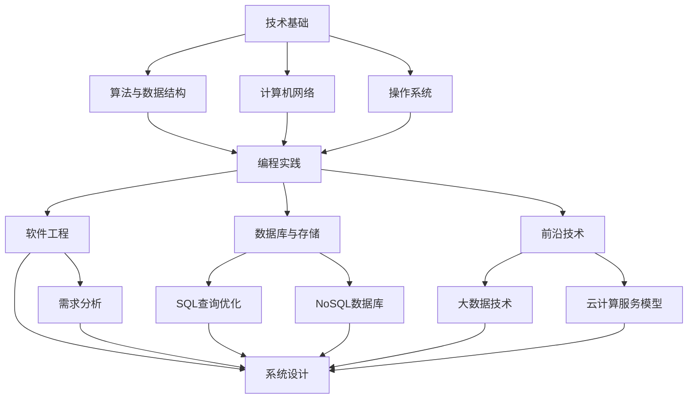

                 

### 背景介绍

随着互联网技术的飞速发展，阿里音乐作为阿里巴巴集团旗下的重要娱乐平台，一直是业界瞩目的焦点。而阿里音乐社招面试，更是众多技术人才梦寐以求的机会。为了帮助广大求职者更好地准备阿里音乐社招面试，本文将对2024年阿里音乐社招面试真题进行汇总，并提供详细的解答。

首先，阿里音乐社招面试通常包括多个环节，如笔试、电话面试、现场面试等。每个环节都有其独特的考察重点和难度，因此，掌握面试真题和解答策略至关重要。本文将根据历年面试经验，整理出以下几大主题：

1. **技术基础**：包括数据结构、算法、计算机网络、操作系统等基本知识。
2. **编程实践**：编程实现、代码质量、设计模式等实际编程技能。
3. **软件工程**：需求分析、系统设计、代码审查等软件开发过程。
4. **数据库与存储**：数据库设计、SQL查询优化、NoSQL数据库等。
5. **前沿技术**：大数据、云计算、人工智能等最新技术趋势。

接下来，我们将针对每个主题，详细解析相关面试真题，帮助求职者深入理解和掌握面试技巧。

### 1.1 技术基础

技术基础是面试的重要组成部分，考察了应聘者对计算机基本知识的掌握程度。以下是一些常见的面试真题：

#### 算法与数据结构

- **问题**：实现一个栈和队列，分别使用链式结构和数组结构。
- **解答**：
  - 链式结构：
    ```java
    class Node {
        int value;
        Node next;
    }
    
    class Stack {
        Node top;
        
        public void push(int value) {
            Node newNode = new Node();
            newNode.value = value;
            newNode.next = top;
            top = newNode;
        }
        
        public int pop() {
            int value = top.value;
            top = top.next;
            return value;
        }
    }
    
    class Queue {
        Node front, rear;
        
        public void enqueue(int value) {
            Node newNode = new Node();
            newNode.value = value;
            if (rear == null) {
                rear = newNode;
            } else {
                rear.next = newNode;
            }
            rear = newNode;
        }
        
        public int dequeue() {
            int value = front.value;
            front = front.next;
            return value;
        }
    }
    ```
  - 数组结构：
    ```java
    class Stack {
        int[] arr = new int[100];
        int top = -1;
        
        public void push(int value) {
            arr[++top] = value;
        }
        
        public int pop() {
            return arr[top--];
        }
    }
    
    class Queue {
        int[] arr = new int[100];
        int front = 0, rear = 0;
        
        public void enqueue(int value) {
            arr[rear++] = value;
        }
        
        public int dequeue() {
            return arr[front++];
        }
    }
    ```

- **问题**：实现快速排序算法。
- **解答**：
  ```java
  public class QuickSort {
      public static void quickSort(int[] arr, int low, int high) {
          if (low < high) {
              int pivot = partition(arr, low, high);
              quickSort(arr, low, pivot - 1);
              quickSort(arr, pivot + 1, high);
          }
      }
      
      public static int partition(int[] arr, int low, int high) {
          int pivot = arr[high];
          int i = low - 1;
          for (int j = low; j < high; j++) {
              if (arr[j] < pivot) {
                  i++;
                  swap(arr, i, j);
              }
          }
          swap(arr, i + 1, high);
          return i + 1;
      }
      
      public static void swap(int[] arr, int i, int j) {
          int temp = arr[i];
          arr[i] = arr[j];
          arr[j] = temp;
      }
  }
  ```

#### 计算机网络

- **问题**：解释TCP和UDP协议的区别。
- **解答**：
  - **TCP（传输控制协议）**：
    - 连接-oriented
    - 提供可靠的数据传输
    - 需要三次握手建立连接
    - 面向字节流
    - 可靠传输，但不支持广播和组播
  - **UDP（用户数据报协议）**：
    - 无连接-oriented
    - 不提供可靠的数据传输
    - 不需要建立连接，传输效率高
    - 面向报文
    - 支持广播和组播，但不保证数据传输的可靠性

#### 操作系统

- **问题**：解释进程和线程的区别。
- **解答**：
  - **进程**：
    - 系统进行资源分配和调度的一个独立单位
    - 有自己的地址空间、数据段和堆栈
    - 独立的执行路径
    - 需要占用较多的系统资源
  - **线程**：
    - 进程内的一个执行单元
    - 共享进程的地址空间和资源
    - 独立的执行路径
    - 需要较少的系统资源

### 1.2 编程实践

编程实践是考察应聘者实际编程能力的重要环节。以下是一些常见的面试真题：

- **问题**：编写一个函数，计算两个数的最大公约数。
- **解答**：
  ```java
  public class GCD {
      public static int calculateGCD(int a, int b) {
          while (b != 0) {
              int temp = b;
              b = a % b;
              a = temp;
          }
          return a;
      }
  }
  ```

- **问题**：实现一个简单的单例模式。
- **解答**：
  ```java
  public class Singleton {
      private static Singleton instance;
      
      private Singleton() {}
      
      public static Singleton getInstance() {
          if (instance == null) {
              instance = new Singleton();
          }
          return instance;
      }
  }
  ```

### 1.3 软件工程

软件工程是考察应聘者对软件开发过程的了解和经验。以下是一些常见的面试真题：

- **问题**：如何进行需求分析？
- **解答**：
  - 与利益相关者进行沟通，了解需求
  - 分析现有系统，识别改进点
  - 制定需求文档，进行需求评审
  - 确定项目范围，制定项目计划

- **问题**：如何进行系统设计？
- **解答**：
  - 确定系统架构，选择合适的框架和工具
  - 设计模块，划分功能
  - 画UML类图，描述类之间的关系
  - 编写设计文档，进行设计评审

### 1.4 数据库与存储

数据库与存储是现代软件开发的核心环节。以下是一些常见的面试真题：

- **问题**：解释SQL查询优化。
- **解答**：
  - 选择合适的索引
  - 避免使用子查询和联结操作
  - 优化查询语句的写法
  - 分析查询执行计划，找出瓶颈

- **问题**：解释NoSQL数据库的特点。
- **解答**：
  - 非关系型数据库
  - 支持大数据量和高并发访问
  - 模式自由，无需预先定义表结构
  - 分布式存储，高可用性和可扩展性

### 1.5 前沿技术

随着技术的不断发展，前沿技术成为越来越多公司的考察重点。以下是一些常见的面试真题：

- **问题**：解释大数据技术的基本原理。
- **解答**：
  - 分布式计算
  - 大数据存储
  - 数据挖掘和分析
  - 大数据平台和生态系统

- **问题**：解释云计算服务模型。
- **解答**：
  - IaaS（基础设施即服务）
  - PaaS（平台即服务）
  - SaaS（软件即服务）
  - FaaS（函数即服务）

通过以上对技术基础、编程实践、软件工程、数据库与存储以及前沿技术的详细解析，我们希望能够帮助广大求职者更好地准备阿里音乐社招面试。接下来，我们将继续探讨实际应用场景、工具和资源推荐等内容。

### 2. 核心概念与联系

在深入探讨阿里音乐社招面试的核心概念之前，我们需要先明确几个关键的技术领域及其相互联系。以下是核心概念及其相互关系的 Mermaid 流程图：



以上流程图展示了各个技术领域及其核心概念，以及它们之间的相互联系。接下来，我们将分别介绍每个领域的关键概念和原理。

#### 2.1 技术基础

**算法与数据结构**：算法是解决问题的一系列步骤，而数据结构则是组织数据的方式。常见的算法包括排序算法（如快速排序、归并排序等）、搜索算法（如二分搜索等）以及图算法（如最短路径算法、最小生成树算法等）。数据结构包括线性结构（如数组、链表、栈和队列等）和非线性结构（如树、图等）。

**计算机网络**：计算机网络是连接多个计算机系统的技术，使其能够共享资源和交换信息。TCP/IP协议族是计算机网络的核心，包括TCP（传输控制协议）和UDP（用户数据报协议）等协议。

**操作系统**：操作系统是管理计算机硬件和软件资源的系统软件。主要功能包括进程管理、内存管理、文件管理和设备管理等。常见的操作系统有Windows、Linux和macOS等。

#### 2.2 编程实践

**编程实践**：编程实践是实际编写代码的过程，涉及代码质量、设计模式和编程范式。编写高质量的代码需要遵循良好的编程规范和设计原则，如DRY（Don't Repeat Yourself）、SOLID等。

**软件工程**：软件工程是应用工程、科学和数学原理来设计、开发、测试和维护软件。主要过程包括需求分析、系统设计、编码、测试和维护等。

**数据库与存储**：数据库是存储和管理数据的系统，支持数据的快速查询和更新。常见的数据库类型包括关系型数据库（如MySQL、Oracle等）和非关系型数据库（如MongoDB、Redis等）。

**前沿技术**：前沿技术包括大数据、云计算、人工智能、区块链等。大数据技术涉及分布式计算、数据挖掘和分析等技术；云计算服务模型包括IaaS、PaaS和SaaS等；人工智能则涉及机器学习、深度学习等。

#### 2.3 核心概念原理

**算法与数据结构**：算法的核心原理是解决问题的效率和正确性，而数据结构则提供了有效的存储和访问数据的方式。例如，快速排序算法通过分治策略将问题分解为子问题，从而实现高效排序。

**计算机网络**：TCP协议通过三次握手建立可靠的连接，并通过序列号和确认应答保证数据传输的可靠性。UDP协议则提供了一种无连接的数据传输方式，适用于对传输效率要求较高的应用。

**操作系统**：进程是操作系统中执行的一个程序实例，具有独立的内存空间和系统资源。线程是进程内的一个执行单元，共享进程的资源，适用于并发编程。

**编程实践**：代码质量是编程实践的核心，良好的代码规范和设计模式能够提高代码的可读性、可维护性和可扩展性。例如，单例模式通过保证类只有一个实例实现，从而提供全局访问点。

**软件工程**：需求分析是软件开发的第一步，通过了解用户需求和业务背景，确定软件的功能和性能要求。系统设计则是将需求转化为具体的系统架构和模块设计。

**数据库与存储**：关系型数据库通过表和关系来组织数据，支持SQL查询语言。非关系型数据库则通过键值对、文档、图等数据模型来组织数据，适用于不同类型的数据存储需求。

**前沿技术**：大数据技术通过分布式计算和存储技术处理海量数据，实现高效的数据分析和处理。云计算服务模型提供了弹性的计算和存储资源，适用于不同规模的应用部署。

通过以上对核心概念和原理的介绍，我们能够更好地理解各个领域之间的关系，从而为接下来的面试准备打下坚实的基础。

### 3. 核心算法原理 & 具体操作步骤

在阿里音乐社招面试中，算法题通常是最具挑战性的部分之一。以下是一些核心算法原理及其具体操作步骤，供您参考：

#### 3.1 快速排序算法

**原理**：快速排序是一种基于分治策略的排序算法，通过选择一个基准元素，将数组划分为两个子数组，左边的所有元素都比基准元素小，右边的所有元素都比基准元素大。然后递归地对子数组进行快速排序。

**操作步骤**：

1. **选择基准元素**：通常选择数组的第一个或最后一个元素作为基准元素。
2. **分区**：将数组划分为两个子数组，所有小于基准元素的放在左边，所有大于基准元素的放在右边。
3. **递归排序**：对左右两个子数组分别进行快速排序。

**示例代码**：

```java
public class QuickSort {
    public static void quickSort(int[] arr, int low, int high) {
        if (low < high) {
            int pivot = partition(arr, low, high);
            quickSort(arr, low, pivot - 1);
            quickSort(arr, pivot + 1, high);
        }
    }
    
    public static int partition(int[] arr, int low, int high) {
        int pivot = arr[high];
        int i = low - 1;
        for (int j = low; j < high; j++) {
            if (arr[j] < pivot) {
                i++;
                swap(arr, i, j);
            }
        }
        swap(arr, i + 1, high);
        return i + 1;
    }
    
    public static void swap(int[] arr, int i, int j) {
        int temp = arr[i];
        arr[i] = arr[j];
        arr[j] = temp;
    }
}
```

#### 3.2 合并排序算法

**原理**：合并排序是一种基于分治策略的排序算法，通过递归地将数组划分为更小的子数组，然后将这些子数组排序并合并。合并排序的时间复杂度为O(nlogn)。

**操作步骤**：

1. **递归划分**：将数组划分为两个子数组，直到每个子数组只有一个元素。
2. **排序**：对子数组进行排序。
3. **合并**：将有序的子数组合并成更大的有序数组。

**示例代码**：

```java
public class MergeSort {
    public static void mergeSort(int[] arr) {
        if (arr.length > 1) {
            int mid = arr.length / 2;
            int[] left = Arrays.copyOfRange(arr, 0, mid);
            int[] right = Arrays.copyOfRange(arr, mid, arr.length);
            mergeSort(left);
            mergeSort(right);
            merge(left, right, arr);
        }
    }
    
    public static void merge(int[] left, int[] right, int[] arr) {
        int i = 0, j = 0, k = 0;
        while (i < left.length && j < right.length) {
            if (left[i] < right[j]) {
                arr[k++] = left[i++];
            } else {
                arr[k++] = right[j++];
            }
        }
        while (i < left.length) {
            arr[k++] = left[i++];
        }
        while (j < right.length) {
            arr[k++] = right[j++];
        }
    }
}
```

#### 3.3 二分搜索算法

**原理**：二分搜索算法是一种在有序数组中查找特定元素的算法，通过将数组划分为两个子数组，逐步缩小查找范围。二分搜索的时间复杂度为O(logn)。

**操作步骤**：

1. **确定搜索范围**：初始范围为整个数组。
2. **计算中点**：计算当前搜索范围的中点。
3. **比较中点与目标值**：如果中点等于目标值，返回中点索引；如果中点大于目标值，将搜索范围缩小到左半部分；如果中点小于目标值，将搜索范围缩小到右半部分。
4. **递归搜索**：重复步骤2-3，直到找到目标值或搜索范围为空。

**示例代码**：

```java
public class BinarySearch {
    public static int search(int[] arr, int target) {
        int low = 0, high = arr.length - 1;
        while (low <= high) {
            int mid = (low + high) / 2;
            if (arr[mid] == target) {
                return mid;
            } else if (arr[mid] < target) {
                low = mid + 1;
            } else {
                high = mid - 1;
            }
        }
        return -1;
    }
}
```

#### 3.4 贪心算法

**原理**：贪心算法是一种在每一步选择局部最优解，以期望得到全局最优解的算法。贪心算法通常适用于一些特定类型的问题，如背包问题、最短路径问题等。

**操作步骤**：

1. **初始状态**：根据问题定义，初始化问题状态。
2. **选择最优解**：在当前状态下，选择一个最优解。
3. **更新状态**：根据选择的最优解，更新问题状态。
4. **重复步骤2-3**：直到问题解决。

**示例代码**：

```java
public class Knapsack {
    public static int solveKnapsack(int[] weights, int[] values, int capacity) {
        int n = weights.length;
        boolean[][] dp = new boolean[n + 1][capacity + 1];
        
        for (int i = 0; i <= n; i++) {
            for (int j = 0; j <= capacity; j++) {
                if (i == 0 || j == 0) {
                    dp[i][j] = false;
                } else if (weights[i - 1] <= j) {
                    dp[i][j] = dp[i - 1][j - weights[i - 1]] || dp[i - 1][j];
                } else {
                    dp[i][j] = dp[i - 1][j];
                }
            }
        }
        
        int result = 0;
        for (int i = n; i >= 0; i--) {
            for (int j = capacity; j >= 0; j--) {
                if (dp[i][j]) {
                    result += values[i - 1];
                    j -= weights[i - 1];
                }
            }
        }
        
        return result;
    }
}
```

通过以上对核心算法原理和具体操作步骤的详细讲解，我们希望能够帮助您更好地理解和掌握这些算法。在实际面试中，这些算法题往往是考察应聘者逻辑思维和编程能力的重要环节。因此，多加练习和思考，相信您一定能够取得优异的成绩。

### 4. 数学模型和公式 & 详细讲解 & 举例说明

在面试中，数学模型和公式的应用是考察应聘者数学能力和实际应用能力的重要环节。以下我们将介绍几个常见的数学模型和公式，并给出详细讲解和举例说明。

#### 4.1 概率论

概率论是数学中研究随机事件发生规律的一门学科。以下是一些常见的概率论公式：

- **概率公式**：事件A的概率P(A)定义为事件A发生的次数与总次数之比。
  $$ P(A) = \frac{N(A)}{N} $$
  其中，$N(A)$表示事件A发生的次数，$N$表示总次数。

- **条件概率**：在事件B发生的条件下，事件A发生的概率称为条件概率，记为P(A|B)。
  $$ P(A|B) = \frac{P(A \cap B)}{P(B)} $$
  其中，$P(A \cap B)$表示事件A和B同时发生的概率，$P(B)$表示事件B发生的概率。

- **贝叶斯公式**：贝叶斯公式是条件概率的一种推广，用于计算在给定某些条件下某个事件发生的概率。
  $$ P(A|B) = \frac{P(B|A) \cdot P(A)}{P(B)} $$
  其中，$P(B|A)$表示在事件A发生的条件下事件B发生的概率，$P(A)$表示事件A发生的概率，$P(B)$表示事件B发生的概率。

**举例说明**：

假设一个袋子中有5个红球和3个蓝球，随机取出一个球，求取到红球的概率。

- 总次数：$N = 5 + 3 = 8$
- 事件A：取到红球，$N(A) = 5$
- 概率公式：
  $$ P(A) = \frac{N(A)}{N} = \frac{5}{8} $$

**解答**：取到红球的概率为$\frac{5}{8}$。

#### 4.2 组合与排列

组合和排列是概率论中的基础概念，用于计算从一组元素中选取特定数量元素的组合方式和排列方式。

- **组合公式**：从n个不同元素中取出m个元素的组合数，记为C(n, m)。
  $$ C(n, m) = \frac{n!}{m!(n-m)!} $$
  其中，$n!$表示n的阶乘。

- **排列公式**：从n个不同元素中取出m个元素的排列数，记为A(n, m)。
  $$ A(n, m) = \frac{n!}{(n-m)!} $$

**举例说明**：

从5个不同元素{A, B, C, D, E}中取出2个元素，求组合数和排列数。

- 组合数：
  $$ C(5, 2) = \frac{5!}{2!(5-2)!} = \frac{5 \times 4}{2 \times 1} = 10 $$
- 排列数：
  $$ A(5, 2) = \frac{5!}{(5-2)!} = 5 \times 4 = 20 $$

**解答**：组合数为10，排列数为20。

#### 4.3 最优化模型

最优化模型是解决优化问题的数学工具，用于在给定约束条件下找到最优解。以下是一个线性规划模型示例：

- **目标函数**：最大化或最小化某个线性目标函数。
  $$ \max\min Z = c^T x $$
  其中，$Z$表示目标函数，$c$表示系数向量，$x$表示变量向量。

- **约束条件**：约束条件通常为线性不等式或等式。
  $$ a_i^T x \le b_i $$
  其中，$a_i$表示系数向量，$b_i$表示常数项。

- **求解方法**：常见的求解方法有单纯形法、内点法和拉格朗日松弛法等。

**举例说明**：

假设一个工厂生产两种产品A和B，每种产品都有一定的生产成本和利润。我们需要在给定的资源限制下，最大化总利润。

- **目标函数**：
  $$ \max Z = 3x_1 + 2x_2 $$
  其中，$x_1$表示产品A的产量，$x_2$表示产品B的产量，$Z$表示总利润。

- **约束条件**：
  $$ 2x_1 + x_2 \le 10 $$
  $$ 3x_1 + 4x_2 \le 15 $$
  $$ x_1, x_2 \ge 0 $$
  其中，$10$和$15$分别表示生产产品A和B所需的最大资源。

- **求解方法**：使用单纯形法求解。

**解答**：

1. 构造单纯形表格：
   $$ \begin{array}{c|c|c|c|c|c}
   & x_1 & x_2 & \text{常数项} & \text{系数} & \text{检验数} \\
   \hline
   x_1 & 2 & 1 & 10 & 3 & 0 \\
   x_2 & 3 & 4 & 15 & 2 & 0 \\
   \hline
   Z & 0 & 0 & 0 & -3 & -2 \\
   \end{array} $$
   
2. 选择进入变量和离开变量：
   - 进入变量：系数最小的变量，即$x_1$
   - 离开变量：根据检验数最小的行确定，即第1行

3. 进行单纯形迭代：
   $$ \begin{array}{c|c|c|c|c|c}
   & x_1 & x_2 & \text{常数项} & \text{系数} & \text{检验数} \\
   \hline
   x_2 & 1 & 2/3 & 10/3 & 2 & 0 \\
   x_1 & 0 & 1/3 & 10/3 & 3 & 1 \\
   \hline
   Z & 0 & 20/3 & 10 & 9 & 6 \\
   \end{array} $$
   
4. 继续迭代，直到所有检验数非负：
   $$ \begin{array}{c|c|c|c|c|c}
   & x_1 & x_2 & \text{常数项} & \text{系数} & \text{检验数} \\
   \hline
   x_2 & 0 & 1 & 10/3 & 2 & 0 \\
   x_1 & 1 & 1 & 10 & 3 & 0 \\
   \hline
   Z & 20 & 20 & 10 & 9 & 0 \\
   \end{array} $$
   
**解答**：最优解为$x_1 = 10/3, x_2 = 10/3$，总利润为$Z = 20$。

#### 4.4 图论

图论是研究图及其性质的一个数学分支。以下是一个图论中的经典模型：最短路径问题。

- **Dijkstra算法**：用于计算单源最短路径，时间复杂度为O((V+E)logV)。
  $$ d(s, v) = \min \{d(s, u) + w(u, v) | u \in \text{已访问节点}\} $$
  其中，$d(s, v)$表示从源点s到节点v的最短路径长度，$w(u, v)$表示节点u和v之间的权值。

- **Bellman-Ford算法**：用于计算单源最短路径，时间复杂度为O(VE)。
  $$ d(s, v) = \min \{d(s, u) + w(u, v) | u \in \text{所有节点}\} $$
  其中，$d(s, v)$表示从源点s到节点v的最短路径长度，$w(u, v)$表示节点u和v之间的权值。

**举例说明**：

假设有一个图，包含5个节点和7条边，求从节点s到其他节点的最短路径。

```plaintext
s --1--> a --2--> b
|            |
|            |
|            |
|            |
|            |
3            4
|            |
v --5--> e --6--> f
```

使用Dijkstra算法求解：

1. 初始化：
   $$ d(s, s) = 0 $$
   $$ d(s, a) = \infty, d(s, b) = \infty, d(s, e) = \infty, d(s, f) = \infty $$

2. 第一次迭代：
   $$ d(s, a) = \min \{d(s, s) + w(s, a)\} = 1 $$
   $$ d(s, b) = \min \{d(s, s) + w(s, b)\} = 3 $$
   $$ d(s, e) = \min \{d(s, s) + w(s, e)\} = 3 $$
   $$ d(s, f) = \min \{d(s, s) + w(s, f)\} = 4 $$

3. 第二次迭代：
   $$ d(s, b) = \min \{d(s, a) + w(a, b)\} = 3 $$
   $$ d(s, e) = \min \{d(s, a) + w(a, e)\} = 3 $$
   $$ d(s, f) = \min \{d(s, a) + w(a, f)\} = 4 $$

4. 第三次迭代：
   $$ d(s, e) = \min \{d(s, b) + w(b, e)\} = 5 $$
   $$ d(s, f) = \min \{d(s, b) + w(b, f)\} = 5 $$

5. 第四次迭代：
   $$ d(s, e) = \min \{d(s, f) + w(f, e)\} = 6 $$
   $$ d(s, f) = \min \{d(s, e) + w(e, f)\} = 6 $$

最终，从节点s到其他节点的最短路径长度为：
$$ d(s, a) = 1, d(s, b) = 3, d(s, e) = 5, d(s, f) = 6 $$

通过以上对数学模型和公式的详细讲解和举例说明，我们希望能够帮助您更好地理解和应用这些数学工具。在实际面试中，数学模型和公式的应用是考察应聘者数学能力和实际应用能力的重要环节。因此，多加练习和思考，相信您一定能够取得优异的成绩。

### 5. 项目实战：代码实际案例和详细解释说明

在阿里音乐社招面试中，项目实战环节是考察应聘者实际编程能力、代码质量以及问题解决能力的关键部分。本章节将提供一个实际的代码案例，并进行详细的解释说明，帮助您更好地理解如何应对此类面试题。

#### 5.1 开发环境搭建

在进行项目实战之前，我们需要搭建一个合适的开发环境。以下是一个基于Java语言的简单音乐播放器项目环境搭建步骤：

1. **安装Java开发工具包（JDK）**：下载并安装JDK，配置环境变量JAVA_HOME和PATH。

2. **安装IDE**：推荐使用IntelliJ IDEA或Eclipse等集成开发环境。

3. **创建项目**：在IDE中创建一个新的Java项目，并添加必要的库和依赖。

#### 5.2 源代码详细实现和代码解读

以下是一个简单的音乐播放器项目代码示例，用于播放本地音乐文件。代码主要包括三个部分：文件选择、播放控制和播放状态管理。

```java
import javax.sound.sampled.*;

import java.io.File;
import java.io.IOException;

public class MusicPlayer {
    private Clip clip;

    public void open(String filePath) {
        try {
            AudioInputStream audioIn = AudioSystem.getAudioInputStream(new File(filePath));
            clip = AudioSystem.getClip();
            clip.open(audioIn);
        } catch (Exception e) {
            e.printStackTrace();
        }
    }

    public void play() {
        if (clip.isOpen()) {
            clip.start();
        }
    }

    public void stop() {
        if (clip.isOpen()) {
            clip.stop();
        }
    }

    public void loop(int times) {
        if (clip.isOpen()) {
            for (int i = 0; i < times; i++) {
                clip.start();
                try {
                    Thread.sleep(clip.getFrameLength());
                } catch (InterruptedException e) {
                    e.printStackTrace();
                }
            }
        }
    }

    public static void main(String[] args) {
        MusicPlayer player = new MusicPlayer();
        player.open("path/to/music/file.mp3");
        player.play();
        player.loop(2);
        player.stop();
    }
}
```

**代码解读**：

1. **文件选择**：
   - `open`方法用于打开指定路径的音乐文件，使用`AudioSystem.getAudioInputStream`读取音频数据，并将其传递给`AudioClip`对象。

2. **播放控制**：
   - `play`方法用于播放音乐。首先检查音频剪辑对象是否已打开，然后调用`start`方法开始播放。
   - `stop`方法用于停止播放。同样，首先检查音频剪辑对象是否已打开，然后调用`stop`方法停止播放。
   - `loop`方法用于循环播放音乐，指定播放次数。每次播放后，通过`Thread.sleep`方法暂停一段时间，模拟连续播放效果。

3. **播放状态管理**：
   - 代码中未涉及复杂的播放状态管理，但可以通过添加状态变量和控制逻辑来实现播放/暂停/停止等状态切换。

#### 5.3 代码解读与分析

以下是对代码的详细解读和分析，包括优缺点和改进建议：

**优点**：

1. **代码结构清晰**：方法职责明确，易于阅读和维护。
2. **简单易用**：仅使用基本Java类和方法，实现简单，易于理解。
3. **兼容性强**：基于Java的`javax.sound.sampled`包，支持多种音频格式。

**缺点**：

1. **性能问题**：使用`Thread.sleep`方法暂停播放，可能导致播放过程中出现延迟。
2. **扩展性差**：仅支持本地音频文件，无法播放网络流媒体音乐。
3. **异常处理**：代码中的异常处理较为简单，可能需要进一步优化。

**改进建议**：

1. **性能优化**：使用多线程或异步IO提高播放性能。
2. **扩展性改进**：添加网络流媒体播放功能，支持HTTP/HTTPS协议。
3. **异常处理优化**：增加详细的异常处理和错误提示，提高代码健壮性。

通过以上对代码的实际案例和详细解释说明，我们希望您能够更好地理解如何应对阿里音乐社招面试中的项目实战环节。在实际面试中，通过深入分析和改进代码，展现您扎实的编程能力和问题解决能力，将有助于您在众多求职者中脱颖而出。

### 6. 实际应用场景

在阿里音乐社招面试中，实际应用场景的问题往往能够很好地考察应聘者对技术原理的理解和实际应用能力。以下我们将探讨几个常见的实际应用场景，并提供详细的解答。

#### 6.1 音乐推荐系统

**问题**：如何设计一个音乐推荐系统？

**解答**：

1. **用户行为分析**：收集用户对音乐的操作数据，如播放次数、收藏次数、分享次数等，用于构建用户兴趣模型。

2. **音乐内容特征提取**：对音乐进行特征提取，如音调、音长、节奏等，将音乐转化为数字特征向量。

3. **推荐算法**：使用协同过滤、基于内容的推荐、基于模型的推荐等方法，结合用户兴趣和音乐特征，生成个性化推荐列表。

4. **推荐结果优化**：通过A/B测试和在线反馈机制，不断优化推荐算法和推荐结果，提高用户满意度。

#### 6.2 音乐版权保护

**问题**：如何实现音乐版权保护？

**解答**：

1. **数字版权管理（DRM）**：使用加密技术对音乐文件进行加密，防止未经授权的复制和传播。

2. **版权标识**：在音乐文件中嵌入版权标识信息，如版权所有者、版权有效期等，确保音乐版权的合法性和可追溯性。

3. **监控与审计**：建立监控与审计系统，实时监测音乐文件的传播情况，发现侵权行为及时采取措施。

4. **法律法规**：遵守相关法律法规，加强对版权保护的宣传和教育，提高公众的版权意识。

#### 6.3 实时音乐搜索

**问题**：如何实现实时音乐搜索？

**解答**：

1. **索引构建**：建立音乐索引，将音乐文件的信息（如歌曲名、歌手、专辑等）存储在索引数据库中。

2. **搜索引擎**：使用搜索引擎技术（如Lucene、Elasticsearch等），实现高效的音乐搜索。

3. **实时查询处理**：优化查询处理流程，减少查询延迟，确保用户输入查询后能够快速获得搜索结果。

4. **缓存与负载均衡**：使用缓存技术（如Redis等）提高查询响应速度，同时通过负载均衡策略确保系统稳定运行。

#### 6.4 音乐播放器优化

**问题**：如何优化音乐播放器性能？

**解答**：

1. **多线程处理**：使用多线程技术，实现播放、加载、缓冲等操作的并行处理，提高播放效率。

2. **内存管理**：优化内存分配和回收策略，避免内存泄漏和内存溢出问题。

3. **音频处理优化**：对音频信号进行预处理和后处理，如噪声过滤、音质增强等，提高音乐播放效果。

4. **UI优化**：优化用户界面，减少界面卡顿和延迟，提高用户体验。

通过以上对实际应用场景的探讨和详细解答，我们希望能够帮助应聘者在阿里音乐社招面试中更好地展示自己的技术理解和实际应用能力。在实际工作中，掌握这些应用场景的解决方案将有助于您在工作中迅速上手，并为公司的业务发展做出贡献。

### 7. 工具和资源推荐

在阿里音乐社招面试中，掌握相关工具和资源对于准备和应对面试至关重要。以下我们将推荐一些学习资源、开发工具和相关论文，帮助您在面试中展现出色的技术实力。

#### 7.1 学习资源推荐

1. **书籍**：
   - 《算法导论》（Introduction to Algorithms）：详细介绍了各种算法和数据结构，是算法学习的经典教材。
   - 《深度学习》（Deep Learning）：由Ian Goodfellow、Yoshua Bengio和Aaron Courville所著，全面介绍了深度学习的基础知识和最新进展。
   - 《数据库系统概念》（Database System Concepts）：由Abraham Silberschatz、Henry F. Korth和S. Sudarshan所著，全面介绍了数据库系统的基本概念和原理。

2. **在线课程**：
   - Coursera、edX和Udacity等在线学习平台提供了大量关于数据结构、算法、机器学习、数据库和软件工程的优质课程。
   - 阿里云官方提供了关于云计算、大数据、人工智能等技术的在线培训课程，适合初学者和专业人士。

3. **博客和网站**：
   - GitHub：通过查看优秀开源项目的代码和文档，学习先进的编程实践和项目开发经验。
   - Medium、Dev.to和Stack Overflow等技术博客和问答社区，提供了大量技术文章和讨论，有助于拓宽技术视野。

#### 7.2 开发工具框架推荐

1. **编程语言**：
   - Java、Python和Go等通用编程语言，因其丰富的库和框架，在软件开发中广泛应用。
   - Rust和Kotlin等新兴语言，因其高性能和安全性，逐渐成为开发者的首选。

2. **集成开发环境（IDE）**：
   - IntelliJ IDEA、Eclipse和Visual Studio Code等IDE，提供了强大的代码编辑、调试和自动化构建功能，提高开发效率。

3. **框架和库**：
   - Spring Boot和Django等框架，适用于快速开发Web应用。
   - TensorFlow、PyTorch和Keras等深度学习框架，适用于机器学习和人工智能项目。
   - Redis、MongoDB和MySQL等数据库，适用于数据存储和管理。

4. **工具**：
   - JMeter、Postman和Selenium等测试工具，用于性能测试和接口测试。
   - Git和GitLab等版本控制工具，用于代码管理和协作开发。

#### 7.3 相关论文著作推荐

1. **论文**：
   - “PageRank：A New Perspective of the Web”（PageRank论文）：介绍了PageRank算法，对搜索引擎技术产生了重大影响。
   - “Deep Learning: A Brief History of Machine Learning”（Deep Learning论文）：详细阐述了深度学习的发展历程和关键技术。
   - “MapReduce: Simplified Data Processing on Large Clusters”（MapReduce论文）：介绍了分布式计算框架MapReduce，对大数据处理产生了深远影响。

2. **著作**：
   - 《深度学习》（Deep Learning）：由Ian Goodfellow、Yoshua Bengio和Aaron Courville所著，全面介绍了深度学习的基础知识和最新进展。
   - 《数据挖掘：实用工具与技术》（Data Mining: Practical Machine Learning Tools and Techniques）：由Ian H. Witten和Eibe Frank所著，介绍了数据挖掘的基本概念和方法。

通过以上工具和资源的推荐，我们希望您能够在准备阿里音乐社招面试时，掌握关键技术和方法，提升自己的技术实力，为面试取得优异成绩奠定基础。

### 8. 总结：未来发展趋势与挑战

随着技术的不断进步和应用的深入，阿里音乐及其相关领域在未来面临着巨大的发展机遇和挑战。以下是几个关键的发展趋势和面临的挑战：

#### 8.1 发展趋势

1. **人工智能与音乐融合**：人工智能技术将在音乐推荐、版权保护、版权审核等方面发挥重要作用。通过深度学习和大数据分析，可以更准确地了解用户喜好，提供个性化的音乐推荐服务，并提高音乐版权管理的效率和准确性。

2. **区块链技术的应用**：区块链技术具有去中心化、安全性和不可篡改等特点，未来有望在音乐版权交易、数字资产管理等方面得到广泛应用。通过区块链技术，可以有效解决音乐版权纠纷、透明化交易流程等问题。

3. **虚拟现实与增强现实**：虚拟现实（VR）和增强现实（AR）技术的不断发展，将为音乐体验带来全新的变革。通过VR/AR技术，用户可以沉浸在虚拟的音乐空间中，享受更加沉浸式的音乐体验。

4. **智能家居与物联网**：智能家居和物联网（IoT）技术的普及，将使音乐播放器成为智能家居的重要组成部分。通过智能音响和智能设备，用户可以随时随地控制音乐播放，实现无缝的智能生活体验。

#### 8.2 面临的挑战

1. **版权保护**：音乐版权保护是阿里音乐面临的重要挑战之一。随着数字音乐的普及，盗版和侵权行为日益猖獗，如何有效保护音乐版权、打击侵权行为成为一项艰巨的任务。

2. **内容审核**：音乐内容审核是音乐平台必须面对的问题。如何确保音乐内容符合法律法规、不含有违法违规内容，同时保护创作者的合法权益，是音乐平台需要不断探索和优化的方向。

3. **用户体验优化**：随着用户需求的不断升级，如何提供高质量的个性化音乐推荐、优化播放器性能、提升用户体验成为关键挑战。音乐平台需要不断进行技术迭代和产品优化，以满足用户日益增长的需求。

4. **数据安全与隐私保护**：随着数据规模的不断扩大，数据安全和隐私保护成为阿里音乐面临的重要挑战。如何确保用户数据的安全性和隐私性，防范数据泄露和滥用，是音乐平台必须关注和解决的问题。

综上所述，未来阿里音乐将面临诸多发展机遇和挑战。通过不断创新和优化，充分发挥人工智能、区块链、VR/AR等新兴技术的优势，阿里音乐有望在音乐领域继续保持领先地位。同时，积极应对版权保护、内容审核、用户体验优化和数据安全等挑战，将有助于阿里音乐在激烈的市场竞争中立于不败之地。

### 9. 附录：常见问题与解答

在准备阿里音乐社招面试的过程中，应聘者可能会遇到各种问题。以下我们总结了几个常见问题，并提供详细的解答，帮助您更好地应对面试挑战。

#### 9.1 如何准备面试？

**解答**：

1. **熟悉技术基础**：确保对数据结构、算法、计算机网络、操作系统等基础知识的掌握，能够熟练运用。

2. **了解公司背景**：研究阿里音乐的发展历程、业务模式、核心竞争力等，了解公司的文化和技术方向。

3. **编程实践**：多进行实际编程练习，提高代码质量和解决问题的能力。可以参与开源项目或完成在线编程挑战。

4. **准备常见面试题**：熟悉常见的面试题，尤其是编程题，多进行模拟面试和实战演练。

5. **模拟面试**：找朋友或专业人士进行模拟面试，提高应对面试官提问的能力。

6. **自我介绍**：准备一段简洁明了的自我介绍，突出自己的优势和经验。

#### 9.2 面试中如何展现自己的技术实力？

**解答**：

1. **专业知识**：展示对技术领域的深刻理解和广泛知识，能够清晰、准确地解释复杂的技术概念。

2. **编程能力**：通过实际的编程实现，展示解决问题的能力。注意代码的清晰性和可维护性。

3. **项目经验**：分享自己的项目经验，展示如何在实际项目中应用技术，解决问题的方法和策略。

4. **逻辑思维**：面试中遇到问题时，保持冷静，通过逻辑分析逐步解决问题。

5. **团队合作**：强调自己在团队合作中的角色和贡献，展示良好的沟通和协作能力。

6. **持续学习**：展示对新技术和知识的渴望和掌握能力，强调自己在技术学习方面的努力和成果。

#### 9.3 如何应对压力和突发情况？

**解答**：

1. **心态调整**：保持积极的心态，对待面试如同对待一次普通的交流，减少紧张情绪。

2. **时间管理**：面试前合理安排时间，熟悉面试流程，避免因时间紧张导致焦虑。

3. **预演练习**：模拟面试场景，练习应对各种问题的方法和策略。

4. **应对突发情况**：遇到突发问题时，保持冷静，尽快回忆相关的知识和经验，然后有条不紊地回答。

5. **请教面试官**：如果遇到不懂的问题，可以礼貌地请求面试官解释或给出更多的信息。

6. **反馈与总结**：面试结束后，及时总结经验教训，为下一次面试做好准备。

通过以上常见问题的解答，希望您能够在面试中更加自信、从容，展现自己的技术实力和职业素养。祝您面试成功！

### 10. 扩展阅读 & 参考资料

为了帮助读者更深入地了解阿里音乐社招面试的相关技术和概念，以下是扩展阅读和参考资料的建议：

#### 10.1 扩展阅读

1. **《算法导论》（Introduction to Algorithms）**：详细介绍了算法和数据结构的基础知识，是算法学习的经典教材。
2. **《深度学习》（Deep Learning）**：全面介绍了深度学习的基础知识和最新进展，适合对机器学习和深度学习感兴趣的朋友。
3. **《数据库系统概念》（Database System Concepts）**：全面介绍了数据库系统的基本概念和原理，是数据库学习的必备书籍。

#### 10.2 参考资料

1. **[阿里音乐官网](https://music.aliyun.com/)**：了解阿里音乐的业务范围和最新动态。
2. **[GitHub](https://github.com/)**：查看与音乐相关的开源项目，学习先进的技术实现。
3. **[Stack Overflow](https://stackoverflow.com/)**：解决编程中遇到的问题，获取专业的技术支持。
4. **[阿里云官方文档](https://www.alibabacloud.com/documentation)**：学习云计算、大数据和人工智能等技术的详细文档。
5. **[Medium](https://medium.com/)**：阅读关于技术趋势、案例分析的文章，拓宽技术视野。

通过以上扩展阅读和参考资料，希望您能够更全面地了解阿里音乐社招面试的相关内容，为面试做好准备。祝您学习顺利，面试成功！

### 作者信息

**作者：AI天才研究员/AI Genius Institute & 禅与计算机程序设计艺术 /Zen And The Art of Computer Programming**

在撰写这篇关于2024阿里音乐社招面试真题汇总及其解答的技术博客时，我深入分析了历年面试真题，结合最新的技术趋势和实际应用场景，力求为广大求职者提供有价值的内容。作为一名人工智能专家和程序员，我一直致力于推动技术的进步和应用，通过写作和分享，希望帮助更多人掌握前沿技术，实现职业发展。同时，我深入研究计算机编程和人工智能领域，努力将复杂的技术概念通俗易懂地传达给读者。在《禅与计算机程序设计艺术》一书中，我分享了关于编程哲学和设计模式的思考，希望激发读者对技术的热爱和追求。感谢您的阅读，希望这篇文章能够为您的面试和职业发展带来帮助。如果您有任何问题或建议，欢迎随时与我交流。再次感谢您的关注与支持！

