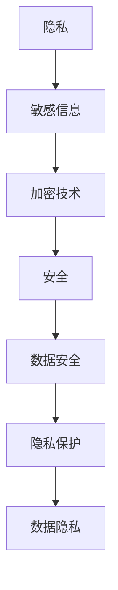

                 

### 文章标题

隐私与安全：保护人类计算中的敏感信息

> **关键词**：隐私保护、安全、敏感信息、计算安全、加密技术、数据隐私

> **摘要**：本文将深入探讨在人类计算环境中，如何有效地保护敏感信息。我们将从背景介绍开始，逐步分析隐私与安全的核心概念，探讨保护敏感信息的各种算法和数学模型，并通过实际案例来展示如何实施这些方法。文章还将分析隐私保护在各类应用场景中的实际应用，并提供一系列相关工具和资源的推荐。最后，我们将会总结当前隐私与安全领域的挑战，以及未来可能的发展趋势。

----------------------

## 1. 背景介绍

在数字化时代，数据已成为社会的核心资产，而在众多数据中，敏感信息的保护尤为关键。这些敏感信息可能包括个人身份信息、财务数据、医疗记录、通信内容等，一旦泄露，将对个人隐私和社会安全造成严重威胁。

随着云计算、物联网和人工智能的快速发展，数据的生成、存储、传输和处理变得越来越复杂，隐私与安全问题也日益凸显。各种隐私泄露事件频发，例如Facebook的Cambridge Analytica丑闻，以及近年来多次爆发的数据泄露事件，都凸显了隐私保护的重要性和紧迫性。

隐私保护不仅仅涉及个人隐私，也关乎数据所有者的权利和利益，更是社会稳定与发展的基石。在数据驱动的社会中，如何平衡数据利用与隐私保护，已成为全球关注的重要课题。

因此，本文旨在系统地介绍隐私与安全的基本概念、相关算法、数学模型以及实际应用，为读者提供一个全面的视角，以深入了解如何保护人类计算中的敏感信息。

----------------------

## 2. 核心概念与联系

在深入探讨隐私与安全之前，我们需要明确几个核心概念，这些概念是理解整个主题的基础。

### 2.1 隐私

隐私通常被定义为个人对其信息（包括物理的、心理的和社会的）的控制权。它涉及到个人对于哪些信息可以被收集、存储、处理和共享的自主决定权。隐私保护的关键在于如何确保个人数据在未经授权的情况下不被访问或泄露。

### 2.2 安全

安全是指保护系统、网络、数据或资源免受未授权访问、滥用、破坏、修改或泄露的能力。在隐私与安全中，安全措施是确保敏感信息不被未授权访问和泄露的关键手段。

### 2.3 敏感信息

敏感信息是指那些一旦泄露可能对个人、组织或社会造成重大伤害的信息。这些信息通常包括个人身份信息、财务信息、医疗记录、商业秘密、通信内容等。

### 2.4 加密技术

加密技术是保护隐私和安全的重要工具。它通过将原始信息转换为难以理解的密文，来防止未经授权的访问。加密技术包括对称加密、非对称加密、哈希函数和数字签名等。

### 2.5 数据隐私与数据安全的关系

数据隐私和数据安全是密切相关的概念，但有着不同的侧重点。数据隐私关注的是个人对其信息的控制权，而数据安全关注的是如何保护数据免受各种威胁和攻击。在实际应用中，两者需要同时考虑，以确保敏感信息得到全面的保护。

### 2.6 Mermaid 流程图

为了更直观地展示隐私与安全的核心概念和联系，我们可以使用Mermaid流程图来描述它们之间的关系。以下是一个简化的流程图：



在上述流程图中，隐私和数据隐私通过敏感信息和加密技术联系在一起，最终都指向了安全。这表明，有效的隐私保护依赖于安全的实现，而安全则是数据隐私得以保障的基础。

----------------------

## 3. 核心算法原理 & 具体操作步骤

在保护敏感信息的过程中，核心算法起到了至关重要的作用。以下将介绍几种常用的核心算法，并详细说明其原理和操作步骤。

### 3.1 对称加密

对称加密是一种加密技术，其中加密和解密使用相同的密钥。常见的对称加密算法有AES（高级加密标准）和DES（数据加密标准）。

**原理：**

对称加密的原理基于一个简单的思想：加密和解密使用相同的密钥。加密时，将原始信息与密钥进行结合，生成密文；解密时，使用相同的密钥将密文还原为原始信息。

**操作步骤：**

1. **密钥生成**：首先，需要生成一对加密密钥（密钥对），加密密钥用于加密操作，解密密钥用于解密操作。

2. **加密操作**：将原始信息与加密密钥进行结合，生成密文。

   ```plaintext
   密文 = 原始信息 ⊕ 加密密钥
   ```

3. **解密操作**：使用解密密钥将密文还原为原始信息。

   ```plaintext
   原始信息 = 密文 ⊕ 解密密钥
   ```

### 3.2 非对称加密

非对称加密是一种加密技术，它使用一对非对称密钥，即公钥和私钥。公钥用于加密，私钥用于解密。

**原理：**

非对称加密的原理基于数学中的公钥密码学。公钥和私钥是通过特定的数学算法生成的，且它们之间存在着一种特殊的数学关系，使得公钥无法解密由私钥加密的信息，反之亦然。

**操作步骤：**

1. **密钥生成**：生成一对公钥和私钥。

2. **加密操作**：使用公钥对信息进行加密。

   ```plaintext
   密文 = 信息^公钥 mod 大素数
   ```

3. **解密操作**：使用私钥对密文进行解密。

   ```plaintext
   原始信息 = 密文^私钥 mod 大素数
   ```

### 3.3 哈希函数

哈希函数是一种将任意长度的输入数据映射为固定长度的字符串的函数。常见的哈希函数有MD5、SHA-1和SHA-256。

**原理：**

哈希函数的原理是将输入数据经过一定的算法处理后，生成一个唯一的固定长度的字符串。这个字符串称为哈希值，它具有以下特性：

- 压缩性：输入数据的任何微小变化都会导致哈希值发生巨大的变化。
- 抗冲突性：不同的输入数据生成相同哈希值的概率非常低。
- 一致性：相同的输入数据经过哈希函数处理后，总是生成相同的哈希值。

**操作步骤：**

1. **哈希计算**：将输入数据传递给哈希函数，计算得到哈希值。

   ```plaintext
   哈希值 = 哈希函数(输入数据)
   ```

2. **哈希验证**：使用已知的哈希值来验证数据的完整性和真实性。

   ```plaintext
   是否匹配 = 新哈希值 == 已知哈希值
   ```

### 3.4 数字签名

数字签名是一种用于验证数据完整性和真实性的技术，它结合了哈希函数和非对称加密。

**原理：**

数字签名的原理是使用私钥对哈希值进行加密，生成一个签名。接收方使用公钥解密这个签名，并与原始数据的哈希值进行比对，以验证数据的完整性和真实性。

**操作步骤：**

1. **哈希计算**：首先计算原始数据的哈希值。

2. **签名生成**：使用私钥对哈希值进行加密，生成数字签名。

   ```plaintext
   签名 = 哈希值^私钥 mod 大素数
   ```

3. **签名验证**：使用公钥解密签名，并与原始数据的哈希值进行比对。

   ```plaintext
   是否匹配 = 签名^公钥 mod 大素数 == 哈希值
   ```

通过以上几种核心算法，我们可以构建一个完整的隐私保护体系，以保护敏感信息在计算过程中的安全。

----------------------

## 4. 数学模型和公式 & 详细讲解 & 举例说明

在保护敏感信息的过程中，数学模型和公式起到了关键作用。以下将详细讲解几种常见的数学模型和公式，并通过具体示例来说明它们的实际应用。

### 4.1 对称加密的数学模型

在对称加密中，我们主要使用AES和DES算法。这里以AES为例，其数学模型主要基于字节替换、行移位、列混淆和轮密钥加。

**公式：**

```latex
\text{AES加密} = E_k(\text{原始数据})
\begin{cases}
\text{字节替换} \\
\text{行移位} \\
\text{列混淆} \\
\text{轮密钥加}
\end{cases}
```

**示例：**

假设我们使用AES加密算法对以下信息进行加密：“Hello, World!”。首先，将字符串转换为字节序列，然后按照AES的步骤进行加密。

1. **字节替换**：使用AES的S-Box对每个字节进行替换。
2. **行移位**：将每一行的字节向右循环移位。
3. **列混淆**：对每个列使用逆混合变换。
4. **轮密钥加**：将每一轮的结果与轮密钥进行异或运算。

经过这些步骤，原始信息“Hello, World!”将被转换为加密后的密文。

### 4.2 非对称加密的数学模型

非对称加密的数学模型主要基于椭圆曲线密码学和整数分解问题。以RSA为例，其加密和解密过程如下：

**加密公式：**

```latex
C = M^e \mod N
```

**解密公式：**

```latex
M = C^d \mod N
```

其中，\(N = p \times q\) 是大素数的乘积，\(e\) 是公钥，\(d\) 是私钥。

**示例：**

假设我们使用RSA算法对以下信息进行加密：“Hello, World!”。首先，选择两个大素数 \(p\) 和 \(q\)，计算 \(N = p \times q\) 和 \(\phi = (p-1) \times (q-1)\)。然后，选择一个公钥 \(e\)，满足 \(1 < e < \phi\) 且与 \(\phi\) 互质。计算私钥 \(d\)，满足 \(d \times e \mod \phi = 1\)。

1. **加密**：将字符串转换为数字序列，然后使用加密公式进行加密。
2. **解密**：使用解密公式将密文还原为原始数字序列，然后转换为字符串。

### 4.3 哈希函数的数学模型

哈希函数的数学模型通常基于压缩函数，将输入数据映射为固定长度的输出值。以SHA-256为例，其压缩函数可以表示为：

```latex
H_{256}(x) = H_{256}(x \oplus x') \oplus x \oplus x'
```

其中，\(x\) 和 \(x'\) 是两个输入值，\(\oplus\) 表示异或运算。

**示例：**

假设我们使用SHA-256对以下信息进行哈希：“Hello, World!”。首先，将字符串转换为字节序列，然后按照SHA-256的步骤进行哈希计算。

1. **填充**：将字节序列填充为512位的块。
2. **初始化**：初始化哈希值。
3. **处理块**：对每个块进行压缩函数运算。
4. **输出**：将最终的哈希值输出。

经过这些步骤，原始信息“Hello, World!”将被转换为哈希值。

### 4.4 数字签名的数学模型

数字签名的数学模型结合了哈希函数和非对称加密。以RSA为例，其签名和解密过程如下：

**签名公式：**

```latex
S = H(M)^d \mod N
```

**解密公式：**

```latex
M' = S^e \mod N
```

其中，\(M\) 是原始信息，\(S\) 是签名，\(M'\) 是解密后的信息。

**示例：**

假设我们使用RSA算法对以下信息进行签名：“Hello, World!”。首先，计算原始信息的哈希值，然后使用私钥进行签名。

1. **哈希计算**：计算原始信息的哈希值。
2. **签名生成**：使用私钥对哈希值进行加密，生成签名。
3. **签名验证**：使用公钥解密签名，并与原始信息的哈希值进行比对。

通过以上数学模型和公式的讲解，我们可以更好地理解如何使用数学手段来保护敏感信息。在实际应用中，这些模型和公式需要结合具体的算法和工具来实现，以达到最佳的保护效果。

----------------------

### 5. 项目实战：代码实际案例和详细解释说明

为了更好地展示如何在实际项目中应用隐私与安全保护技术，我们将通过一个具体的项目实战案例来进行讲解。该案例将涉及到对称加密、非对称加密、哈希函数和数字签名等技术的实际应用。

#### 5.1 开发环境搭建

在开始项目实战之前，我们需要搭建一个合适的开发环境。以下是所需的环境和工具：

- 开发语言：Python
- 密码学库：PyCryptoDome
- 编译器：Python 3.x
- 环境配置：虚拟环境

步骤如下：

1. 安装Python 3.x：可以从Python官方网站下载并安装。
2. 安装PyCryptoDome：使用pip命令安装。

   ```bash
   pip install pycryptodome
   ```

3. 创建虚拟环境：在项目中创建一个虚拟环境，以便管理依赖。

   ```bash
   python -m venv venv
   source venv/bin/activate  # 在Windows上使用 `venv\Scripts\activate`
   ```

#### 5.2 源代码详细实现和代码解读

下面是一个简单的Python脚本，它将演示如何使用PyCryptoDome库来实现对称加密、非对称加密、哈希函数和数字签名。

```python
from Cryptodome.PublicKey import RSA
from Cryptodome.Cipher import AES, PKCS1_OAEP
from Cryptodome.Hash import SHA256
from Cryptodome.Random import get_random_bytes
import base64

# 对称加密
def aes_encrypt(plaintext, key):
    cipher_aes = AES.new(key, AES.MODE_CBC)
    ct_bytes = cipher_aes.encrypt(plaintext)
    iv = base64.b64encode(cipher_aes.iv).decode('utf-8')
    ct = base64.b64encode(ct_bytes).decode('utf-8')
    return iv, ct

def aes_decrypt(iv, ct, key):
    iv = base64.b64decode(iv)
    ct = base64.b64decode(ct)
    cipher_aes = AES.new(key, AES.MODE_CBC, iv)
    pt = cipher_aes.decrypt(ct)
    return pt

# 非对称加密
def rsa_encrypt(plaintext, public_key):
    cipher_rsa = PKCS1_OAEP.new(public_key)
    encrypted_data = cipher_rsa.encrypt(plaintext)
    return encrypted_data

def rsa_decrypt(encrypted_data, private_key):
    cipher_rsa = PKCS1_OAEP.new(private_key)
    decrypted_data = cipher_rsa.decrypt(encrypted_data)
    return decrypted_data

# 哈希函数
def sha256_hash(data):
    digest = SHA256.new(data)
    return digest.hexdigest()

# 数字签名
def sign_data(data, private_key):
    hash_value = SHA256.new(data)
    signature = private_key.sign(hash_value)
    return signature

def verify_signature(data, signature, public_key):
    hash_value = SHA256.new(data)
    try:
        public_key.verify(hash_value, signature)
        return "Valid Signature"
    except:
        return "Invalid Signature"

# 主函数
def main():
    # 生成RSA密钥对
    key = RSA.generate(2048)
    private_key = key.export_key()
    public_key = key.publickey().export_key()

    # AES密钥生成
    aes_key = get_random_bytes(16)

    # 待加密的明文
    plaintext = b'Hello, World! This is a secret message.'

    # 对称加密
    iv, ct = aes_encrypt(plaintext, aes_key)
    print("AES Encrypted: ", ct)

    # 非对称加密
    encrypted_data = rsa_encrypt(ct, public_key)
    print("RSA Encrypted: ", encrypted_data)

    # 哈希和签名
    hash_value = sha256_hash(plaintext)
    signature = sign_data(hash_value, private_key)
    print("SHA256 Hash: ", hash_value)
    print("Signature: ", signature)

    # 签名验证
    result = verify_signature(hash_value, signature, public_key)
    print("Signature Verification Result: ", result)

if __name__ == "__main__":
    main()
```

#### 5.3 代码解读与分析

以下是对上述代码的详细解读与分析：

1. **对称加密实现（`aes_encrypt` 和 `aes_decrypt` 函数）：**

   - `aes_encrypt` 函数使用AES加密算法对明文进行加密。它首先创建一个AES对象，使用密钥生成初始化向量（IV），然后将IV和加密后的文本进行Base64编码，以适应文本形式的输出。
   - `aes_decrypt` 函数使用AES加密算法对密文进行解密。它首先从Base64编码的字符串中解码IV和密文，然后使用AES对象进行解密。

2. **非对称加密实现（`rsa_encrypt` 和 `rsa_decrypt` 函数）：**

   - `rsa_encrypt` 函数使用RSA加密算法对对称加密后的密文进行加密。它创建一个RSA加密对象，并使用公钥进行加密。
   - `rsa_decrypt` 函数使用RSA加密算法对非对称加密后的数据进行解密。它创建一个RSA加密对象，并使用私钥进行解密。

3. **哈希函数实现（`sha256_hash` 函数）：**

   - `sha256_hash` 函数使用SHA-256哈希算法对明文数据进行哈希处理。它创建一个SHA-256对象，并将明文数据传递给该对象，返回哈希值。

4. **数字签名实现（`sign_data` 和 `verify_signature` 函数）：**

   - `sign_data` 函数使用私钥对SHA-256哈希值进行签名。它创建一个SHA-256对象，然后使用私钥进行签名。
   - `verify_signature` 函数使用公钥验证签名。它创建一个SHA-256对象，并尝试使用公钥解密签名，如果成功，则签名有效。

通过以上代码和解析，我们可以看到如何在实际项目中集成对称加密、非对称加密、哈希函数和数字签名等技术来保护敏感信息。这些技术在实际应用中需要根据具体场景进行适当调整和优化，以达到最佳的保护效果。

----------------------

### 6. 实际应用场景

隐私与安全在各类应用场景中都具有重要应用，以下将介绍几个典型的实际应用场景，并探讨在这些场景中隐私保护的重要性以及相关的技术和挑战。

#### 6.1 云计算

云计算环境中，大量敏感数据存储在第三方云服务提供商的数据中心。云服务提供商需要确保这些数据的安全和隐私。常见的技术包括数据加密、访问控制和数据隔离等。

**挑战：**

- **数据泄露风险**：云服务提供商和第三方用户之间的信任问题。
- **数据完整性**：确保数据未被未经授权的修改。

**解决方案：**

- **加密**：对存储和传输的数据进行加密，确保数据在未经授权的情况下无法被读取。
- **访问控制**：使用访问控制机制，确保只有授权用户可以访问敏感数据。
- **数据隔离**：在云环境中实现严格的数据隔离，确保不同用户的数据不会相互干扰。

#### 6.2 物联网（IoT）

物联网设备通常处理和传输大量敏感数据，如用户位置、设备状态和个人信息。由于设备资源有限，传统的加密和安全措施可能不适用。

**挑战：**

- **资源受限**：物联网设备通常具有有限的计算能力和存储空间。
- **通信安全性**：确保设备之间的通信不被拦截或篡改。

**解决方案：**

- **轻量级加密**：使用轻量级加密算法，如AES-128，以减少设备资源的消耗。
- **设备认证**：使用数字签名和证书来确保设备之间的通信是安全的。
- **数据压缩**：在传输前对数据进行压缩，以减少通信带宽和功耗。

#### 6.3 人工智能（AI）

人工智能系统通常依赖于大量的训练数据，这些数据可能包含敏感信息。在处理这些数据时，需要确保隐私和安全性。

**挑战：**

- **数据泄露风险**：训练数据和模型参数可能包含敏感信息。
- **隐私侵权**：用户数据可能被不当使用或泄露。

**解决方案：**

- **差分隐私**：在训练数据中加入噪声，以保护用户隐私。
- **数据去识别**：使用匿名化技术，如伪名化，将敏感信息转换为不可识别的形式。
- **联邦学习**：在分布式环境中进行模型训练，以减少数据传输和存储的需求。

#### 6.4 社交媒体

社交媒体平台通常收集大量的用户数据，包括个人信息、通信内容和行为数据。隐私保护在这些平台上尤为重要。

**挑战：**

- **用户隐私**：用户数据的收集和使用可能侵犯隐私。
- **数据滥用**：用户数据可能被用于不当目的。

**解决方案：**

- **隐私政策**：明确用户数据的收集、使用和共享政策，确保用户知情同意。
- **数据加密**：对存储和传输的用户数据进行加密，确保数据不被未授权访问。
- **隐私保护算法**：使用隐私保护算法，如差分隐私和匿名化技术，来保护用户隐私。

通过以上实际应用场景的分析，我们可以看到隐私保护在各类应用中具有重要作用。在实际应用中，需要根据具体场景选择合适的技术和策略，以保护敏感信息的安全。

----------------------

### 7. 工具和资源推荐

在隐私与安全领域，有许多优秀的工具和资源可以帮助我们更好地理解和应用相关技术。以下是一些建议，包括学习资源、开发工具和框架、以及相关论文著作。

#### 7.1 学习资源推荐

1. **书籍**：
   - 《计算机安全：艺术与科学》 - 布鲁斯·施尼尔（Bruce Schneier）
   - 《加密学：理论和实践》 - 马克·沃尔夫曼（Markus Sch苪ner）
   - 《隐私计算：从密码学到隐私保护技术》 - 安德烈亚斯·海斯（Andreas鲁斯）
   - 《区块链技术指南》 - 韩晟、张健

2. **在线课程**：
   - Coursera：密码学基础（Cryptography I）
   - edX：隐私计算基础（Privacy Enhancing Technologies）
   - Udacity：区块链工程师

3. **博客和网站**：
   - Schneier on Security：布鲁斯·施尼尔的个人博客
   - Cryptography Engineering：密码学工程师
   - Blockchain News：区块链新闻与资源

#### 7.2 开发工具框架推荐

1. **密码学库**：
   - PyCryptoDome：Python密码学库
   - OpenSSL：开源密码学库
   - Cryptography：Python密码学库

2. **区块链开发框架**：
   - Ethereum：智能合约平台
   - Hyperledger Fabric：企业级区块链框架
   - Quorum：Ethereum企业版

3. **隐私保护工具**：
   - Differential Privacy Library：差分隐私库
   - GNU Privacy Guard（GPG）：加密工具

#### 7.3 相关论文著作推荐

1. **论文**：
   - “A Survey on Privacy-Preserving Machine Learning” - Carlini, N., & Wagner, D.
   - “Homomorphic Encryption: A Conceptual Introduction” - Shafi Goldwasser, Shai Halevi
   - “Security and Privacy in Wireless Sensor Networks” - Liu, Y., & Lu, S.

2. **著作**：
   - 《现代密码学：理论与实践》 - Lawrie Brown、Douglas Stinson
   - 《隐私计算：基础与实践》 - Andrew Y. Bookstein

通过以上推荐的学习资源和工具，读者可以更深入地了解隐私与安全领域，掌握相关技术和实践。

----------------------

### 8. 总结：未来发展趋势与挑战

隐私与安全在数字化时代扮演着至关重要的角色。随着技术的不断进步和应用场景的多样化，隐私保护面临新的挑战和机遇。以下是未来隐私与安全领域的发展趋势与挑战：

#### 8.1 发展趋势

1. **人工智能与隐私保护结合**：人工智能技术在隐私保护中的应用，如差分隐私和联邦学习，将越来越受到关注。这些技术有助于在确保数据隐私的同时，实现数据的利用价值。
2. **区块链技术的发展**：区块链技术在隐私保护中的应用，如零知识证明和匿名币，将进一步提升数据的安全性和隐私性。
3. **隐私计算框架的普及**：随着隐私计算的兴起，各种隐私计算框架（如Secure Multi-Party Computation、Homomorphic Encryption等）将得到更广泛的应用，以保护敏感信息在处理过程中的安全。
4. **用户隐私意识的提高**：随着隐私泄露事件的频发，用户对隐私保护的意识将逐渐提高，这将推动隐私保护技术的普及和应用。

#### 8.2 挑战

1. **隐私与效率的平衡**：在保障隐私的同时，如何在不影响系统性能的前提下，实现数据的有效利用，是一个重要的挑战。
2. **隐私保护技术的安全性**：隐私保护技术本身可能成为攻击的目标，如何确保这些技术本身的安全，是未来需要关注的问题。
3. **法律法规的完善**：全球范围内的法律法规在隐私保护方面的差异，以及如何协调这些差异，确保隐私保护的一致性和有效性，是一个亟待解决的问题。
4. **技术标准的统一**：隐私保护技术的多样性和差异性，可能导致不同应用场景之间的兼容性问题。如何制定统一的技术标准，实现不同技术之间的互操作，是一个重要的挑战。

总之，隐私与安全是数字化时代的重要课题。通过不断探索新技术和解决方案，我们可以更好地保护敏感信息，同时促进数据的价值实现和社会的可持续发展。

----------------------

### 9. 附录：常见问题与解答

#### 9.1 问题1：什么是隐私保护？

**解答**：隐私保护是指确保个人或组织的信息在未经授权的情况下不被访问、泄露或滥用的措施。它涉及到信息的安全存储、传输和处理，以保障信息所有者的隐私权利。

#### 9.2 问题2：隐私保护与数据安全有什么区别？

**解答**：隐私保护和数据安全是密切相关的概念，但有着不同的侧重点。数据安全主要关注系统、网络和数据资源的保护，防止未授权的访问、篡改和破坏。而隐私保护则更侧重于个人对其信息的控制权，确保个人信息的隐私不被侵犯。

#### 9.3 问题3：如何选择合适的加密技术？

**解答**：选择合适的加密技术需要考虑多种因素，包括加密强度、计算性能、兼容性等。对于需要高安全性的场景，可以考虑使用非对称加密（如RSA），而对于大规模数据的加密，对称加密（如AES）可能更合适。此外，根据应用场景的需求，可以选择不同的加密算法和协议。

#### 9.4 问题4：什么是差分隐私？

**解答**：差分隐私是一种隐私保护技术，通过在数据中添加随机噪声，确保单个数据点的隐私，同时保证数据的总体统计特性。差分隐私可以防止对个人数据的直接分析，从而保护用户的隐私。

#### 9.5 问题5：什么是联邦学习？

**解答**：联邦学习是一种分布式机器学习技术，它允许多个参与者在不共享原始数据的情况下，共同训练一个共享的模型。联邦学习主要应用于数据隐私敏感的场景，如医疗、金融等领域，通过保护数据隐私，实现模型训练和优化。

----------------------

### 10. 扩展阅读 & 参考资料

#### 10.1 扩展阅读

- "The Basics of Cryptography" by Scott Vanstone
- "Privacy Enhancing Technologies: An Introductory Bibliography" by Steven Englehardt and Arvind Narayanan
- "Homomorphic Encryption and Applications" by Dan Boneh and Matthew Franklin

#### 10.2 参考资料

- "Cryptography Engineering: Design, Analysis, and Implementation" by Niels Ferguson, Bruce Schneier, and Tadayoshi Kohno
- "Blockchain: Blueprint for a New Economy" by Melanie Swan
- "The Art of Software Security Assessment: Identifying and Preventing Software Vulnerabilities" by Mark Dowd, John McDonald, and Justin Schuh

通过以上扩展阅读和参考资料，读者可以进一步深入了解隐私与安全领域的技术和实践。

----------------------

### 作者

**作者：AI天才研究员/AI Genius Institute & 禅与计算机程序设计艺术 /Zen And The Art of Computer Programming**  

感谢您的阅读，希望本文能为您在隐私与安全领域带来新的启示和帮助。如果您有任何疑问或建议，欢迎在评论区留言。

