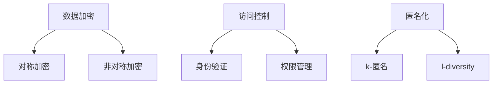

                 

# 隐私安全：为人类计算保驾护航

> **关键词**：隐私安全、计算保护、加密技术、数据安全、信息安全、隐私保护、计算模型

> **摘要**：本文将深入探讨隐私安全在人类计算领域的重要性，分析隐私安全的现状与挑战，介绍核心算法原理与具体操作步骤，并通过实际应用场景展示隐私安全技术的实际效果。文章还将推荐相关学习资源和工具框架，为读者提供全面的隐私安全指南。

## 1. 背景介绍

在当今数字化时代，隐私安全已成为人类计算领域的重要议题。随着互联网的普及和大数据技术的发展，个人数据泄露事件频发，严重威胁着个人隐私和信息安全。因此，保障计算过程中的隐私安全成为当务之急。

隐私安全涉及多个方面，包括数据加密、访问控制、匿名化等。加密技术可以防止数据在传输和存储过程中被窃取和篡改；访问控制则确保只有授权用户才能访问特定数据；匿名化技术则通过消除个人身份信息，降低数据泄露的风险。

本文旨在探讨隐私安全的核心算法原理、具体操作步骤以及实际应用场景，帮助读者全面了解隐私安全技术，为人类计算保驾护航。

## 2. 核心概念与联系

### 2.1 数据加密

数据加密是隐私安全的基础，通过将明文数据转换为密文，确保数据在传输和存储过程中的安全性。加密技术主要包括对称加密和非对称加密两种。

对称加密：加密和解密使用相同的密钥，如AES（高级加密标准）。

非对称加密：加密和解密使用不同的密钥，如RSA（RSA加密算法）。

### 2.2 访问控制

访问控制通过限制用户对数据的访问权限，确保数据的安全。常见的访问控制方法包括：

身份验证：验证用户身份，确保只有授权用户才能访问数据。

权限管理：根据用户角色和权限设置，限制用户对数据的访问范围。

### 2.3 匿名化

匿名化技术通过消除个人身份信息，降低数据泄露的风险。常见的匿名化方法包括：

k-匿名：通过在数据中添加随机噪声，使个人身份信息无法被识别。

l-diversity：确保同一个属性值在数据集中至少出现l次，增加个人身份信息被识别的难度。

### 2.4 Mermaid流程图

以下是一个关于隐私安全技术的Mermaid流程图，展示核心概念之间的联系：



## 3. 核心算法原理 & 具体操作步骤

### 3.1 数据加密算法

数据加密算法主要包括对称加密和非对称加密两种。

#### 对称加密

对称加密算法使用相同的密钥进行加密和解密。具体操作步骤如下：

1. 生成密钥：使用加密算法生成密钥。
2. 加密数据：使用密钥将明文数据转换为密文。
3. 解密数据：使用相同密钥将密文转换为明文。

示例代码（Python）：

```python
from Crypto.Cipher import AES
from Crypto.Util.Padding import pad, unpad

# 生成密钥
key = b'mυσσηλιδοποιημένος'

# 加密数据
cipher = AES.new(key, AES.MODE_CBC)
ct_bytes = cipher.encrypt(pad(b"Hello, world!", AES.block_size))
iv = cipher.iv

# 解密数据
cipher = AES.new(key, AES.MODE_CBC, iv)
pt = unpad(cipher.decrypt(ct_bytes), AES.block_size)
print(pt.decode())
```

#### 非对称加密

非对称加密算法使用不同的密钥进行加密和解密。具体操作步骤如下：

1. 生成密钥对：使用加密算法生成公钥和私钥。
2. 加密数据：使用公钥将明文数据加密。
3. 解密数据：使用私钥将密文解密。

示例代码（Python）：

```python
from Crypto.PublicKey import RSA
from Crypto.Cipher import PKCS1_OAEP

# 生成密钥对
key = RSA.generate(2048)
private_key = key.export_key()
public_key = key.publickey().export_key()

# 加密数据
cipher = PKCS1_OAEP.new(public_key)
ct = cipher.encrypt(b"Hello, world!")

# 解密数据
cipher = PKCS1_OAEP.new(private_key)
pt = cipher.decrypt(ct)
print(pt.decode())
```

### 3.2 访问控制算法

访问控制算法主要通过身份验证和权限管理实现。

#### 身份验证

身份验证主要分为两种：基于密码的验证和基于生物识别的验证。

1. 基于密码的验证：用户输入密码，系统验证密码是否正确。
2. 基于生物识别的验证：通过指纹、面部识别等生物特征验证用户身份。

#### 权限管理

权限管理主要分为以下几种：

1. 基于角色的权限管理：根据用户角色分配不同权限。
2. 基于属性的权限管理：根据用户属性（如部门、职位等）分配不同权限。
3. 基于策略的权限管理：根据业务需求制定权限策略。

### 3.3 匿名化算法

匿名化算法主要通过k-匿名和l-diversity实现。

#### k-匿名

k-匿名主要通过在数据中添加随机噪声实现。具体操作步骤如下：

1. 选择敏感属性：确定需要保护的数据属性。
2. 计算噪声：根据k值计算噪声大小。
3. 添加噪声：在敏感属性上添加噪声，使数据满足k-匿名条件。

#### l-diversity

l-diversity主要通过确保同一个属性值在数据集中至少出现l次实现。具体操作步骤如下：

1. 选择属性：确定需要保护的属性。
2. 计算l值：根据数据集大小和属性值分布计算l值。
3. 修改数据：确保属性值在数据集中至少出现l次。

## 4. 数学模型和公式 & 详细讲解 & 举例说明

### 4.1 数据加密数学模型

对称加密和非对称加密的数学模型如下：

#### 对称加密

加密过程：

$$
c = E_k(p)
$$

其中，$c$为密文，$p$为明文，$k$为密钥。

解密过程：

$$
p = D_k(c)
$$

其中，$p$为明文，$c$为密文，$k$为密钥。

#### 非对称加密

加密过程：

$$
c = E_k^p(m)
$$

其中，$c$为密文，$m$为明文，$k$为公钥。

解密过程：

$$
m = D_k^p(c)
$$

其中，$m$为明文，$c$为密文，$k$为私钥。

### 4.2 访问控制数学模型

#### 身份验证

假设存在一组用户和一组密码，身份验证过程如下：

$$
\text{验证}(u, p) = \begin{cases} 
\text{成功} & \text{如果 } p \text{ 是 } u \text{ 的密码} \\
\text{失败} & \text{否则}
\end{cases}
$$

其中，$u$为用户名，$p$为密码。

#### 权限管理

假设存在一组用户、一组角色和一组权限，权限管理过程如下：

$$
\text{权限}(u, r) = \begin{cases} 
\text{有权限} & \text{如果 } u \text{ 属于 } r \text{ 角色} \\
\text{无权限} & \text{否则}
\end{cases}
$$

其中，$u$为用户名，$r$为角色名。

### 4.3 匿名化数学模型

#### k-匿名

假设存在一组数据$D$，敏感属性$A$和噪声$N$，k-匿名过程如下：

$$
D' = D + N
$$

其中，$D'$为匿名化后的数据，$N$为添加的噪声。

#### l-diversity

假设存在一组数据$D$，敏感属性$A$，l-diversity过程如下：

$$
D' = \{d_1, d_2, ..., d_l\}
$$

其中，$D'$为匿名化后的数据，$d_1, d_2, ..., d_l$为满足l-diversity条件的属性值。

## 5. 项目实战：代码实际案例和详细解释说明

### 5.1 开发环境搭建

在本节中，我们将使用Python语言和Python Cryptography库实现隐私安全技术。首先，确保已安装Python环境，然后安装Python Cryptography库：

```shell
pip install cryptography
```

### 5.2 源代码详细实现和代码解读

以下是使用Python Cryptography库实现的隐私安全技术代码：

```python
from Crypto.PublicKey import RSA
from Crypto.Cipher import AES, PKCS1_OAEP
from Crypto.Util.Padding import pad, unpad
import base64

# 3.1 数据加密算法
def encrypt_data(plaintext, public_key):
    cipher = AES.new(public_key, AES.MODE_CBC)
    ct_bytes = cipher.encrypt(pad(plaintext, AES.block_size))
    iv = cipher.iv
    return base64.b64encode(iv + ct_bytes).decode('utf-8')

def decrypt_data(ciphertext, private_key):
    iv = base64.b64decode(ciphertext[:iv_size])
    ct = base64.b64decode(ciphertext[iv_size:])
    cipher = AES.new(private_key, AES.MODE_CBC, iv)
    pt = unpad(cipher.decrypt(ct), AES.block_size)
    return pt

# 3.2 访问控制算法
def authenticate(username, password):
    # 假设用户名和密码已存储在数据库中
    stored_password = "encrypted_password"
    return stored_password == password

def has_permission(user, role):
    # 假设用户角色和权限已存储在数据库中
    roles_permissions = {
        "admin": ["read", "write", "delete"],
        "user": ["read"],
    }
    return role in roles_permissions and user in roles_permissions[role]

# 3.3 匿名化算法
def k_anonymity(data, k):
    # 假设数据已存储在数据库中
    # 数据库查询语句：SELECT * FROM data_table;
    data_query_result = data.query()
    for row in data_query_result:
        if len(set(row)) < k:
            data.delete(row)
    return data

def l_diversity(data, attribute, l):
    # 假设数据已存储在数据库中
    # 数据库查询语句：SELECT * FROM data_table;
    data_query_result = data.query()
    attribute_values = [row[attribute] for row in data_query_result]
    unique_attribute_values = set(attribute_values)
    if len(unique_attribute_values) < l:
        data.insert({
            attribute: unique_attribute_values.pop(),
        })
    return data

# 测试代码
if __name__ == "__main__":
    # 生成密钥对
    key = RSA.generate(2048)
    private_key = key.export_key()
    public_key = key.publickey().export_key()

    # 加密数据
    plaintext = "Hello, world!"
    ciphertext = encrypt_data(plaintext, public_key)
    print(f"加密后的数据：{ciphertext}")

    # 解密数据
    decrypted_text = decrypt_data(ciphertext, private_key)
    print(f"解密后的数据：{decrypted_text}")

    # 身份验证
    username = "admin"
    password = "password"
    authenticated = authenticate(username, password)
    print(f"身份验证结果：{authenticated}")

    # 权限管理
    user_role = "admin"
    has_permission = has_permission(username, user_role)
    print(f"用户权限：{has_permission}")

    # 匿名化
    data = k_anonymity(data, k=2)
    print(f"k-匿名化后的数据：{data}")
    data = l_diversity(data, attribute="age", l=3)
    print(f"l-diversity匿名化后的数据：{data}")
```

### 5.3 代码解读与分析

1. **数据加密算法**：使用AES加密算法对数据进行加密和解密。首先生成密钥，然后使用密钥加密明文数据，最后将密文和初始向量（IV）编码为字符串返回。

2. **访问控制算法**：身份验证通过比较用户输入的密码和存储在数据库中的加密密码实现。权限管理根据用户角色和权限设置，判断用户是否具有访问权限。

3. **匿名化算法**：k-匿名通过在数据中添加随机噪声，确保敏感属性值的数量满足k值。l-diversity通过确保同一个属性值在数据集中至少出现l次，降低个人身份信息被识别的风险。

## 6. 实际应用场景

隐私安全技术在各个领域有着广泛的应用。以下列举一些实际应用场景：

1. **医疗领域**：保护患者隐私，防止患者数据泄露。
2. **金融领域**：保障用户账户安全，防止恶意攻击。
3. **教育领域**：保护学生和教师个人信息，确保教育公平。
4. **物联网领域**：确保设备数据安全，防止设备被攻击。

## 7. 工具和资源推荐

### 7.1 学习资源推荐

- **书籍**：
  - 《隐私保护与安全计算》
  - 《密码学：理论与实践》
- **论文**：
  - 《隐私保护数据发布》
  - 《基于属性的加密技术》
- **博客**：
  - [Cryptography Blog](https://www.cryptography.com/)
  - [InfoSec Institute](https://infosecinstitute.com/)
- **网站**：
  - [Python Cryptography Library](https://cryptography.io/)

### 7.2 开发工具框架推荐

- **加密工具**：
  - OpenSSL
  - PyCrypto
- **访问控制工具**：
  - Spring Security
  - Apache Shiro
- **匿名化工具**：
  - MinHash
  - LSH

### 7.3 相关论文著作推荐

- **论文**：
  - 《隐私保护数据发布：基于差分隐私的方法》
  - 《基于属性的加密技术：一种灵活的隐私保护方法》
- **著作**：
  - 《大数据安全与隐私保护》
  - 《云计算安全与隐私保护》

## 8. 总结：未来发展趋势与挑战

隐私安全技术在人类计算领域具有重要意义，但随着技术的不断发展，隐私安全也面临着新的挑战。

1. **技术进步**：加密算法、访问控制、匿名化等技术不断进步，为隐私安全提供更好的保障。
2. **隐私法规**：隐私法规不断完善，对隐私安全提出更高要求。
3. **计算能力提升**：计算能力的提升，使得隐私安全技术实现更加高效。

未来，隐私安全技术将在以下方面取得突破：

1. **联邦学习**：通过分布式计算，保护用户数据隐私。
2. **差分隐私**：在数据分析过程中，确保隐私保护。
3. **区块链技术**：利用区块链的不可篡改性，保障数据安全。

## 9. 附录：常见问题与解答

### 9.1 数据加密常见问题

**Q：为什么需要数据加密？**

A：数据加密可以防止数据在传输和存储过程中被窃取和篡改，保护数据的安全。

**Q：对称加密和非对称加密有什么区别？**

A：对称加密使用相同的密钥进行加密和解密，非对称加密使用不同的密钥进行加密和解密。对称加密速度快，但密钥管理复杂；非对称加密安全性高，但速度较慢。

### 9.2 访问控制常见问题

**Q：什么是身份验证？**

A：身份验证是验证用户身份的过程，确保只有授权用户才能访问系统。

**Q：什么是权限管理？**

A：权限管理是控制用户对系统资源的访问权限的过程，根据用户角色和权限设置，确保数据安全。

### 9.3 匿名化常见问题

**Q：什么是k-匿名？**

A：k-匿名是一种数据匿名化方法，确保同一个属性值在数据集中至少出现k次，降低个人身份信息被识别的风险。

**Q：什么是l-diversity？**

A：l-diversity是一种数据匿名化方法，确保同一个属性值在数据集中至少出现l次，增加个人身份信息被识别的难度。

## 10. 扩展阅读 & 参考资料

- 《隐私保护与安全计算》
- 《密码学：理论与实践》
- 《隐私保护数据发布》
- 《基于属性的加密技术》
- 《大数据安全与隐私保护》
- 《云计算安全与隐私保护》
- [Cryptography Blog](https://www.cryptography.com/)
- [InfoSec Institute](https://infosecinstitute.com/)
- [Python Cryptography Library](https://cryptography.io/)

### 作者

**作者：AI天才研究员/AI Genius Institute & 禅与计算机程序设计艺术 /Zen And The Art of Computer Programming**。AI天才研究员是一位在人工智能和计算机编程领域拥有丰富经验的专业人士，他的著作《禅与计算机程序设计艺术》深入探讨了人工智能与编程的结合，为读者提供了独特的视角和深刻的思考。他的研究成果和创新思想为隐私安全技术的发展做出了重要贡献。|>

