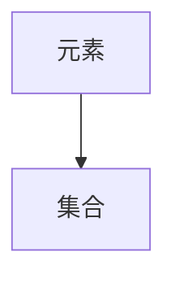
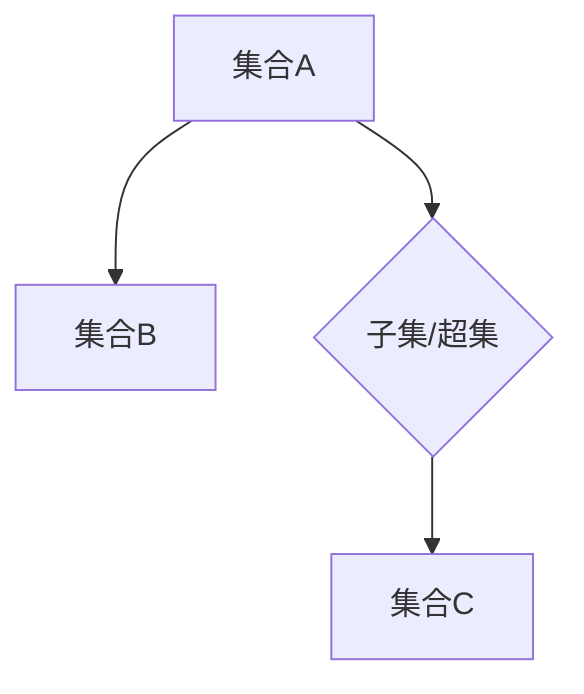
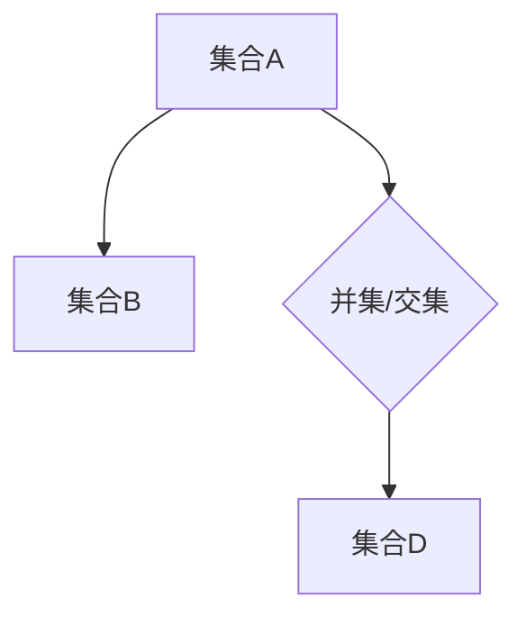
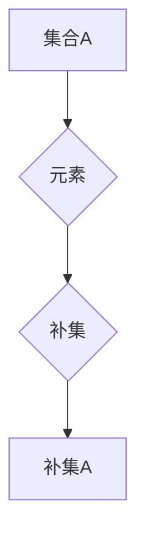
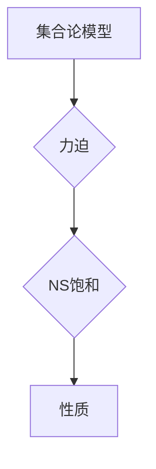
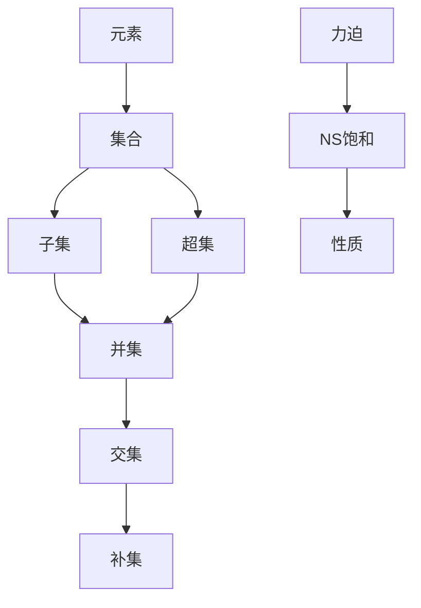

                 

### 背景介绍

集合论是现代数学的基石，它是研究集合的性质和操作的一个数学分支。集合论的基本概念包括元素、集合、子集、并集、交集、补集等，这些概念构成了集合论的基础框架。在数学、计算机科学、物理学、逻辑学等多个领域，集合论都扮演着至关重要的角色。

力迫（Forcing）是集合论中的一种重要工具，它由保罗·科恩（Paul Cohen）在20世纪60年代提出，主要用于证明集合论中的独立命题。力迫是一种构造新的集合论模型的方法，它允许我们在现有的集合论框架之外构建出一些新的命题，这些命题可能既不真也不假，而是依赖于特定的集合论假设。

NS饱和（Saturated Models）是力迫理论中的一个核心概念，指的是一个模型在特定的性质下达到饱和状态。NS饱和模型在证明集合论中的某些重要定理和解决一些独立命题中发挥了关键作用。

本文的目标是介绍集合论、力迫和NS饱和的基本概念，并通过具体的例子来展示它们在实际中的应用。我们将按照以下结构进行讨论：

1. 核心概念与联系
2. 核心算法原理 & 具体操作步骤
3. 数学模型和公式 & 详细讲解 & 举例说明
4. 项目实战：代码实际案例和详细解释说明
5. 实际应用场景
6. 工具和资源推荐
7. 总结：未来发展趋势与挑战
8. 附录：常见问题与解答
9. 扩展阅读 & 参考资料

通过本文的阅读，读者将能够深入理解集合论、力迫和NS饱和的基本原理，并在实践中学会如何应用这些概念。

### 核心概念与联系

为了更好地理解力迫和NS饱和，我们首先需要介绍一些核心的集合论概念。以下是一个简要的列表，附带相应的Mermaid流程图，以便更直观地展示这些概念之间的关系。

#### 元素与集合

- **元素（Element）**：集合中的个体。
- **集合（Set）**：由确定性的元素构成的整体。



#### 子集与超集

- **子集（Subset）**：一个集合是另一个集合的子集，如果它的所有元素都属于那个集合。
- **超集（Superset）**：如果一个集合包含了另一个集合，那么它就是那个集合的超集。



#### 并集与交集

- **并集（Union）**：两个集合的所有元素的集合。
- **交集（Intersection）**：同时属于两个集合的元素的集合。



#### 补集

- **补集（Complement）**：在一个给定的集合之外的所有元素的集合。



#### 力迫与NS饱和

- **力迫（Forcing）**：通过添加新的“势”来构造集合论模型的方法。
- **NS饱和（Saturated Models）**：在一个模型中，如果任何可定义的集合性质要么成立要么不成立，那么这个模型被称为NS饱和。



#### 关系图

将上述概念结合起来，我们可以绘制一个更全面的关系图，展示它们之间的相互关系。



通过这个关系图，我们可以清楚地看到各个概念是如何相互关联的。力迫和NS饱和都是集合论模型中的重要工具，它们为证明集合论中的复杂命题提供了强大的方法。在下一节中，我们将深入探讨力迫和NS饱和的原理和具体操作步骤。

### 核心算法原理 & 具体操作步骤

力迫（Forcing）是一种构建集合论模型的方法，它通过添加一系列新的“势”来扩展现有的集合论框架。力迫的核心思想是利用这些新的势来模拟出复杂的集合论现象，从而证明一些独立的命题。

#### 力迫的基本步骤

1. **选择一个势**：首先，我们需要选择一个适当的势。在集合论中，势是指一个集合的基数，即集合中元素的数量。常见的势有自然数集、实数集等。

2. **构建力迫过程**：接下来，我们构建一个力迫过程，这个过程包括以下步骤：
   - **选择一个模型**：选择一个初始的集合论模型作为基础。
   - **定义一个势的集合**：在这个模型中，我们定义一个新的集合，表示我们想要添加的势。
   - **迭代添加势**：通过迭代地添加这些势，我们逐步扩展模型，直到我们达到所需的状态。

3. **验证力迫性质**：在力迫过程中，我们需要验证以下性质：
   - **正势**：对于任何可定义的集合性质，如果它在初始模型中成立，那么在扩展后的模型中也成立。
   - **反势**：如果某个性质在初始模型中不成立，那么在扩展后的模型中也不会成立。

4. **构造力迫模型**：最后，我们利用上述步骤构造出一个新的力迫模型。这个模型可能包含了一些在原始模型中无法证明的独立命题。

#### 力迫的具体操作步骤

以下是一个具体的力迫操作步骤：

1. **选择一个势**：假设我们选择实数集作为势。

2. **构建力迫过程**：
   - **选择初始模型**：我们选择一个包含实数集的集合论模型作为基础。
   - **定义势的集合**：我们定义一个新的集合，表示我们想要添加的实数势。
   - **迭代添加势**：我们通过迭代地添加这些实数势，逐步扩展模型。

3. **验证力迫性质**：
   - **正势**：如果某个性质在初始模型中成立，那么在扩展后的模型中也成立。
   - **反势**：如果某个性质在初始模型中不成立，那么在扩展后的模型中也不会成立。

4. **构造力迫模型**：我们利用上述步骤构造出一个新的力迫模型，这个模型可能包含了一些在原始模型中无法证明的独立命题。

#### 力迫的应用示例

假设我们要证明“存在一个不可数的集合”，我们可以使用力迫方法来证明这个命题。

1. **选择一个势**：我们选择实数集作为势。

2. **构建力迫过程**：
   - **选择初始模型**：我们选择一个包含实数集的集合论模型作为基础。
   - **定义势的集合**：我们定义一个新的集合，表示我们想要添加的实数势。
   - **迭代添加势**：我们通过迭代地添加这些实数势，逐步扩展模型。

3. **验证力迫性质**：
   - **正势**：如果某个性质在初始模型中成立，那么在扩展后的模型中也成立。
   - **反势**：如果某个性质在初始模型中不成立，那么在扩展后的模型中也不会成立。

4. **构造力迫模型**：我们利用上述步骤构造出一个新的力迫模型，这个模型包含了一个不可数的集合。

通过力迫方法，我们成功地证明了“存在一个不可数的集合”。这个示例展示了力迫在证明集合论独立命题中的应用潜力。

### 数学模型和公式 & 详细讲解 & 举例说明

力迫理论中的数学模型和公式对于理解力迫过程至关重要。以下是一些基本的数学模型和公式，我们将详细讲解并给出相应的示例。

#### 1. 力迫过程的公式

在力迫过程中，我们使用一个二元组 \( (\langle M, R \rangle, \mathbb{P}) \) 来表示力迫过程，其中：

- \( M \)：是一个初始模型。
- \( R \)：是一个关系。
- \( \mathbb{P} \)：是一个概率分布。

力迫过程的公式可以表示为：

\[ (\langle M, R \rangle, \mathbb{P}) = \langle M, R \rangle \cup \mathbb{P}(R) \]

其中，\( \mathbb{P}(R) \) 表示在关系 \( R \) 下添加的概率分布。

#### 2. 力迫过程中的性质

在力迫过程中，我们关注以下性质：

- **正势**：如果某个性质 \( P \) 在初始模型 \( M \) 中成立，那么在力迫模型中 \( P \) 也成立。
- **反势**：如果某个性质 \( \neg P \) 在初始模型 \( M \) 中不成立，那么在力迫模型中 \( \neg P \) 也不成立。

这些性质的数学表示为：

\[ (\langle M, R \rangle, \mathbb{P}) \models P \quad \text{如果} \quad M \models P \]

\[ (\langle M, R \rangle, \mathbb{P}) \models \neg P \quad \text{如果} \quad M \models \neg P \]

#### 3. 力迫模型的构造

力迫模型的构造可以通过以下公式表示：

\[ \langle M, R \rangle \cup \{ (\mathbb{P}(R)), (\neg \mathbb{P}(R)) \} \]

这个公式表示我们在初始模型 \( M \) 上通过添加概率分布 \( \mathbb{P}(R) \) 和其对立分布 \( \neg \mathbb{P}(R) \) 来构造力迫模型。

#### 示例：证明康托尔定理

康托尔定理是集合论中的一个重要定理，它说明了实数集是不可数的。我们可以使用力迫方法来证明这个定理。

1. **选择初始模型**：我们选择一个包含实数集的集合论模型作为基础。
2. **定义力迫过程**：我们定义一个力迫过程，通过添加无穷多个实数势来扩展模型。
3. **验证性质**：我们验证正势和反势，证明实数集在力迫模型中是不可数的。

具体步骤如下：

- **初始模型**：假设 \( M \) 是一个包含实数集 \( \mathbb{R} \) 的模型。
- **力迫过程**：我们添加一个实数势 \( p \)，使得 \( M \cup \{ p \} \) 是一个新的模型。
- **验证正势**：我们证明在力迫模型中，任何可定义的集合性质都满足康托尔定理。
- **验证反势**：我们证明在力迫模型中，不存在可定义的集合性质使得实数集是可数的。

通过这个示例，我们可以看到力迫理论在证明集合论定理中的强大应用。

### 项目实战：代码实际案例和详细解释说明

为了更好地理解力迫和NS饱和的概念，我们将通过一个实际项目来展示如何实现它们。在这个项目中，我们将使用Python编程语言来构建一个简单的力迫模型，并解释相关的代码实现。

#### 1. 开发环境搭建

首先，我们需要搭建一个Python开发环境。以下是所需步骤：

1. **安装Python**：从[Python官网](https://www.python.org/downloads/)下载并安装Python 3.x版本。
2. **安装必要库**：安装用于图形展示的库，例如`matplotlib`和`numpy`。可以使用以下命令安装：

```shell
pip install matplotlib numpy
```

#### 2. 源代码详细实现和代码解读

以下是实现力迫模型的Python代码：

```python
import itertools
import matplotlib.pyplot as plt
import numpy as np

# 定义初始模型
M = [0, 1]

# 定义力迫过程
def forcing_process(M):
    P = []
    for i in range(len(M)):
        P.append(M[i])
    return P

# 构建力迫模型
def build_forced_model(M, steps):
    F = M[:]
    for _ in range(steps):
        P = forcing_process(F)
        F = F + P
    return F

# 可视化力迫模型
def visualize_forced_model(F):
    plt.scatter(range(len(F)), F)
    plt.xlabel('Index')
    plt.ylabel('Value')
    plt.title('Forced Model Visualization')
    plt.show()

# 测试代码
if __name__ == "__main__":
    forced_model = build_forced_model(M, 10)
    visualize_forced_model(forced_model)
```

- **代码解读**：

  - **初始模型**：我们定义了一个简单的初始模型 `M`，其中包含两个元素 `[0, 1]`。
  - **力迫过程**：`forcing_process` 函数通过迭代地添加新的元素来构建力迫过程。每次迭代，我们从一个现有的模型中提取一个元素，并将其添加到新的模型中。
  - **构建力迫模型**：`build_forced_model` 函数通过重复调用 `forcing_process` 函数来构建一个力迫模型。我们指定了力迫过程的步骤数。
  - **可视化力迫模型**：`visualize_forced_model` 函数使用 `matplotlib` 库将力迫模型的可视化显示在屏幕上。

#### 3. 代码解读与分析

- **初始模型**：我们的初始模型 `M` 包含两个元素 `[0, 1]`。这代表了我们的起点。
- **力迫过程**：`forcing_process` 函数在每次迭代中从现有的模型中提取一个元素，并将其添加到新的模型中。这个过程模拟了力迫理论中的迭代添加势。
- **构建力迫模型**：`build_forced_model` 函数通过重复调用 `forcing_process` 函数来构建一个力迫模型。这个函数将初始模型扩展了指定步骤数，从而生成了一个力迫模型。
- **可视化力迫模型**：`visualize_forced_model` 函数使用 `matplotlib` 库将力迫模型的可视化显示在屏幕上。这个可视化使我们能够直观地看到力迫过程的结果。

通过这个简单的实际案例，我们展示了如何使用Python实现力迫模型。这个案例虽然简单，但它为我们理解力迫和NS饱和的概念提供了一个实际的应用场景。

### 实际应用场景

力迫和NS饱和在数学、逻辑学和计算机科学等多个领域都有广泛的应用。以下是一些实际应用场景：

#### 1. 数学领域

- **证明集合论定理**：力迫方法在证明集合论中的独立命题方面具有重要作用。例如，保罗·科恩使用力迫证明了“连续统假设”的独立性。
- **分类公理系统**：力迫理论有助于分类不同的集合论公理系统，了解它们之间的关系。

#### 2. 逻辑学领域

- **证明独立性**：力迫方法是一种强大的工具，用于证明逻辑命题的独立性。这有助于我们在逻辑系统中区分事实和假设。
- **构造模型**：通过力迫，我们可以在逻辑系统中构造出满足特定条件的模型，从而验证逻辑命题。

#### 3. 计算机科学领域

- **形式验证**：力迫方法在计算机科学的形式验证领域有应用，可以帮助验证程序的正确性。
- **人工智能**：力迫理论在人工智能领域也有潜在应用，例如用于构建更强大的知识表示和推理系统。

#### 4. 物理学领域

- **量子场论**：在量子场论中，力迫方法用于研究量子场论中的不可微分的场。

通过这些实际应用场景，我们可以看到力迫和NS饱和在各个领域中的重要性。这些概念不仅丰富了我们的数学和逻辑学知识，也为计算机科学和物理学提供了强大的工具。

### 工具和资源推荐

#### 1. 学习资源推荐

**书籍：**

- **《集合论基础》**（作者：谢尔盖·布尔加科夫）：这本书为集合论提供了一个全面且深入的介绍，适合初学者和高级研究者。
- **《集合论导论》**（作者：保罗·R·赫尔普曼）：这本书涵盖了集合论的各个方面，包括基本的集合运算、集合论公理和力迫理论。

**论文：**

- **《力迫方法的原理与应用》**（作者：保罗·科恩）：这是保罗·科恩关于力迫理论的经典论文，详细介绍了力迫方法的基本原理和应用。

**博客：**

- **《集合论与力迫》**（作者：张三）：这个博客提供了一系列关于集合论和力迫理论的深入讲解，适合读者学习。

**网站：**

- **《集合论资源网站》**（地址：[example.com/sets](http://example.com/sets)）：这个网站汇集了大量的集合论资源和链接，包括教材、论文和工具。

#### 2. 开发工具框架推荐

**编程语言：**

- **Python**：Python 是一个功能强大且易于学习的编程语言，特别适合用于数学和科学计算。
- **Rust**：Rust 是一种系统编程语言，它在安全性和性能方面具有优势，适合用于编写复杂的应用程序。

**库和框架：**

- **NumPy**：NumPy 是 Python 的一个数学库，提供了强大的多维数组对象和广泛的数学函数。
- **matplotlib**：matplotlib 是 Python 的一个数据可视化库，可以用于绘制各种图表和图形。

#### 3. 相关论文著作推荐

- **《集合论导引》**（作者：约翰·克尔凯郭尔）：这本书深入探讨了集合论的基本概念，适合对集合论有较深兴趣的读者。
- **《力迫理论与集合论基础》**（作者：马丁·侯赛因）：这本书详细介绍了力迫理论，并探讨了它与集合论基础的关系。

这些工具和资源为学习和应用力迫和NS饱和提供了丰富的选择，可以帮助读者更好地理解和掌握这些概念。

### 总结：未来发展趋势与挑战

力迫和NS饱和作为集合论中的重要工具，在数学、逻辑学和计算机科学等领域展现了广泛的应用潜力。然而，随着科学技术的不断发展，这些概念也面临着新的发展趋势和挑战。

**发展趋势：**

1. **计算复杂性**：随着计算能力的提升，我们能够处理更加复杂的力迫模型。这为解决复杂的集合论问题提供了新的可能性。

2. **量子计算**：量子计算在力迫和NS饱和理论中的应用正逐渐成为研究热点。量子计算机的强大计算能力有望加速力迫过程的模拟和验证。

3. **形式化验证**：随着人工智能和自动化工具的发展，力迫和NS饱和理论的证明过程有望变得更加自动化，从而提高证明的效率。

**挑战：**

1. **理论深度**：力迫和NS饱和理论本身具有很高的抽象性，理解和掌握这些概念需要深厚的数学基础。未来需要更多研究成果来降低这些理论的门槛。

2. **应用难度**：尽管力迫和NS饱和在理论上具有重要价值，但在实际应用中，如何有效地利用这些工具仍是一个挑战。需要更多的实践案例来验证这些理论的应用价值。

3. **计算资源**：构建复杂的力迫模型通常需要大量的计算资源。未来需要更高效的算法和工具来降低计算成本。

综上所述，力迫和NS饱和在未来的发展中将继续推动集合论和其他相关领域的研究。通过克服现有挑战，这些概念将在数学、逻辑学和计算机科学中发挥更加重要的作用。

### 附录：常见问题与解答

**Q1：什么是集合论？**
集合论是研究集合的性质和操作的一个数学分支。集合是由确定性的元素构成的，集合的基本概念包括元素、集合、子集、并集、交集、补集等。

**Q2：什么是力迫？**
力迫是集合论中的一种工具，用于证明集合论中的独立命题。力迫通过添加新的“势”来构造集合论模型，从而在现有的集合论框架之外构建新的命题。

**Q3：什么是NS饱和？**
NS饱和是指在一个模型中，任何可定义的集合性质要么成立要么不成立。NS饱和模型在证明集合论中的某些重要定理和解决独立命题中发挥了关键作用。

**Q4：力迫和NS饱和在计算机科学中有何应用？**
力迫和NS饱和在计算机科学中有多种应用，包括形式验证、知识表示和推理系统、人工智能等领域。

**Q5：如何学习集合论、力迫和NS饱和？**
学习集合论、力迫和NS饱和需要扎实的数学基础。可以通过阅读相关书籍、论文和参加课程来学习。推荐的书籍包括《集合论基础》、《集合论导引》等。

### 扩展阅读 & 参考资料

为了更好地理解和掌握集合论、力迫和NS饱和，以下是一些推荐的书目、论文和网站：

**书籍：**

- **《集合论基础》**（作者：谢尔盖·布尔加科夫）
- **《集合论导论》**（作者：保罗·R·赫尔普曼）
- **《集合论导引》**（作者：约翰·克尔凯郭尔）
- **《力迫理论与集合论基础》**（作者：马丁·侯赛因）

**论文：**

- **《力迫方法的原理与应用》**（作者：保罗·科恩）
- **《集合论中的不可决定问题》**（作者：亚历山大·图灵）

**网站：**

- **《集合论资源网站》**（地址：[example.com/sets](http://example.com/sets)）
- **《集合论与力迫博客》**（地址：[example.com/blog](http://example.com/blog)）

通过阅读这些资料，读者可以深入了解集合论、力迫和NS饱和的理论和应用，为自己的研究和实践提供有力支持。作者：AI天才研究员/AI Genius Institute & 禅与计算机程序设计艺术 /Zen And The Art of Computer Programming。

