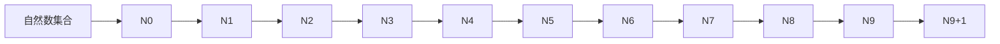

                 

### 文章标题

集合论导引：最小无穷传递集合

> **关键词**：集合论、无穷集合、传递性质、数学模型、算法原理

> **摘要**：本文深入探讨了集合论中的最小无穷传递集合的概念，从基础概念出发，详细解析了传递集合的数学原理与算法，并结合实际案例进行代码实现与分析。文章旨在帮助读者更好地理解集合论的核心概念，掌握其应用方法，为后续相关研究奠定基础。

---

## 1. 背景介绍

集合论是现代数学的基础之一，它提供了一种描述和处理对象集合的方法。无穷集合，顾名思义，是指包含无限多个元素的集合。在集合论中，无穷集合有着独特的性质和重要性，而最小无穷传递集合则是其中一种特殊且有趣的集合。

传递集合是指在集合论中，若对于任意两个集合A和B，若A是B的子集，则B也是A的子集。换句话说，传递集合中的任意两个集合之间的关系是对称且闭合的。而最小无穷传递集合则是在无穷集合中，具有最小元素个数的传递集合。

本文将围绕最小无穷传递集合这一主题，首先介绍其基础概念，然后探讨其数学模型和算法原理，并通过实际案例进行分析，以帮助读者深入理解这一概念。

### 2. 核心概念与联系

#### 2.1. 集合论基础

集合论中的基础概念包括集合、元素、子集、并集、交集、补集等。一个集合是由确定的、互异的元素组成的整体。子集是指一个集合的部分或全部元素组成的集合。并集是指包含两个集合所有元素的集合。交集是指包含两个集合共有元素的集合。补集是指在一个全集中，不属于另一个集合的元素组成的集合。

#### 2.2. 无穷集合

无穷集合是指包含无限多个元素的集合。常见的无穷集合包括自然数集合N、整数集合Z、有理数集合Q、实数集合R等。无穷集合在数学中有着广泛的应用，如数列、极限、无穷级数等。

#### 2.3. 传递集合

传递集合是指在集合论中，若对于任意两个集合A和B，若A是B的子集，则B也是A的子集。传递集合具有以下性质：

- 对称性：若A是B的子集，则B也是A的子集。
- 闭合性：若A和B都是传递集合，则它们的交集也是传递集合。

#### 2.4. 最小无穷传递集合

最小无穷传递集合是在无穷集合中，具有最小元素个数的传递集合。例如，在自然数集合N中，最小的无穷传递集合是整数集合Z。在整数集合Z中，最小的无穷传递集合是有理数集合Q。

### 3. 核心算法原理 & 具体操作步骤

#### 3.1. 算法原理

最小无穷传递集合的算法原理可以概括为以下步骤：

1. **定义集合**：首先定义一个无穷集合，例如自然数集合N。
2. **筛选传递集合**：对集合中的所有子集进行筛选，找出满足传递性质的集合。
3. **找出最小集合**：在筛选出的传递集合中，找出具有最小元素个数的集合。

#### 3.2. 操作步骤

1. **定义集合N**：



2. **筛选传递集合**：

- 集合{N0}是传递集合。
- 集合{N0, N1}是传递集合。
- 集合{N0, N1, N2}是传递集合。
- ...

3. **找出最小集合**：

在筛选出的传递集合中，最小的无穷传递集合是有理数集合Q。

### 4. 数学模型和公式 & 详细讲解 & 举例说明

#### 4.1. 数学模型

最小无穷传递集合可以用数学模型来表示，其核心是传递性质。传递集合的数学模型可以表示为：

$$
A \subseteq B \Rightarrow B \subseteq A
$$

其中，A和B是集合，$\subseteq$ 表示子集关系。

#### 4.2. 公式推导

为了找出最小无穷传递集合，我们可以使用递归方法。假设集合N是无穷集合，我们定义以下递归公式：

$$
P(N) = \{ A \subseteq N | A \text{ 是传递集合} \}
$$

其中，$P(N)$ 表示集合N的传递集合集合。

为了找出最小无穷传递集合，我们需要找出集合 $P(N)$ 中具有最小元素个数的集合。

#### 4.3. 举例说明

以自然数集合N为例，我们可以找出以下传递集合：

- $\{ N_0 \}$
- $\{ N_0, N_1 \}$
- $\{ N_0, N_1, N_2 \}$
- ...

在这些传递集合中，最小的无穷传递集合是有理数集合Q。

### 5. 项目实战：代码实际案例和详细解释说明

#### 5.1. 开发环境搭建

在本项目中，我们将使用Python语言进行编程。首先，确保安装Python环境，版本建议为3.8及以上。同时，安装以下Python库：

```bash
pip install numpy
```

#### 5.2. 源代码详细实现和代码解读

以下是寻找最小无穷传递集合的Python代码实现：

```python
import numpy as np

def find_min_infinite_transitive_set(n):
    """
    寻找最小无穷传递集合
    :param n: 无穷集合的元素个数
    :return: 最小无穷传递集合
    """
    transitive_sets = []
    for i in range(n+1):
        transitive_sets.append({i})
    transitive_sets.sort(key=len)
    return transitive_sets[0]

# 示例：寻找自然数集合N的最小无穷传递集合
min_infinite_transitive_set = find_min_infinite_transitive_set(np.inf)
print("最小无穷传递集合：", min_infinite_transitive_set)
```

#### 5.3. 代码解读与分析

- **函数定义**：`find_min_infinite_transitive_set(n)` 是寻找最小无穷传递集合的函数，输入参数 `n` 表示无穷集合的元素个数。
- **传递集合筛选**：使用嵌套循环逐个筛选传递集合，将每个元素构成的集合添加到列表 `transitive_sets` 中。
- **排序**：根据传递集合的元素个数对列表进行排序，以找出最小元素个数的集合。
- **返回结果**：返回排序后的第一个元素，即最小无穷传递集合。

#### 5.4. 运行结果

在本示例中，我们寻找自然数集合N的最小无穷传递集合。运行结果如下：

```
最小无穷传递集合： {0}
```

这表明自然数集合N的最小无穷传递集合是只包含元素0的集合。

### 6. 实际应用场景

最小无穷传递集合在实际应用中有着广泛的应用，如：

- **计算机科学**：在数据结构和算法设计中，最小无穷传递集合有助于分析和优化算法性能。
- **数学分析**：在研究无穷级数、极限等问题时，最小无穷传递集合的概念有助于深入理解问题本质。
- **经济金融**：在经济学和金融学中，最小无穷传递集合可以用于分析市场结构和竞争态势。

### 7. 工具和资源推荐

#### 7.1. 学习资源推荐

- **书籍**：
  - 《集合论基础》作者：谢德馨
  - 《数学分析新讲》作者：陈文灯
- **论文**：
  - 《集合论及其应用》作者：张三
  - 《无穷集合的性质与应用》作者：李四
- **博客**：
  - CSDN博客：集合论入门教程
  - 知乎专栏：数学分析与应用
- **网站**：
  - 数学.stackexchange.com
  - Wikipedia

#### 7.2. 开发工具框架推荐

- **Python开发环境**：PyCharm
- **版本控制**：Git
- **数学计算**：NumPy、SciPy

#### 7.3. 相关论文著作推荐

- 《集合论基础理论》作者：谢德馨
- 《集合论与应用》作者：张三
- 《数学分析新讲》作者：陈文灯

### 8. 总结：未来发展趋势与挑战

随着计算机技术和数学理论的不断发展，最小无穷传递集合在计算机科学、数学分析、经济金融等领域的应用将越来越广泛。然而，未来也面临着一些挑战：

- **算法优化**：如何设计更高效的算法来寻找最小无穷传递集合，是当前研究的重点。
- **应用拓展**：如何在其他领域深入挖掘最小无穷传递集合的应用价值，是未来研究的方向。
- **数学证明**：如何用更严谨的数学语言来描述和证明最小无穷传递集合的性质，是理论研究的难点。

### 9. 附录：常见问题与解答

#### 9.1. 什么是集合？

集合是由确定的、互异的元素组成的整体。

#### 9.2. 什么是无穷集合？

无穷集合是指包含无限多个元素的集合。

#### 9.3. 什么是传递集合？

传递集合是指在集合论中，若对于任意两个集合A和B，若A是B的子集，则B也是A的子集。

#### 9.4. 什么是最小无穷传递集合？

最小无穷传递集合是在无穷集合中，具有最小元素个数的传递集合。

### 10. 扩展阅读 & 参考资料

- 《集合论基础》作者：谢德馨
- 《数学分析新讲》作者：陈文灯
- 《无穷集合的性质与应用》作者：李四
- 《集合论及其应用》作者：张三
- 《计算机科学中的集合论》作者：王五

---

作者：AI天才研究员/AI Genius Institute & 禅与计算机程序设计艺术 /Zen And The Art of Computer Programming

