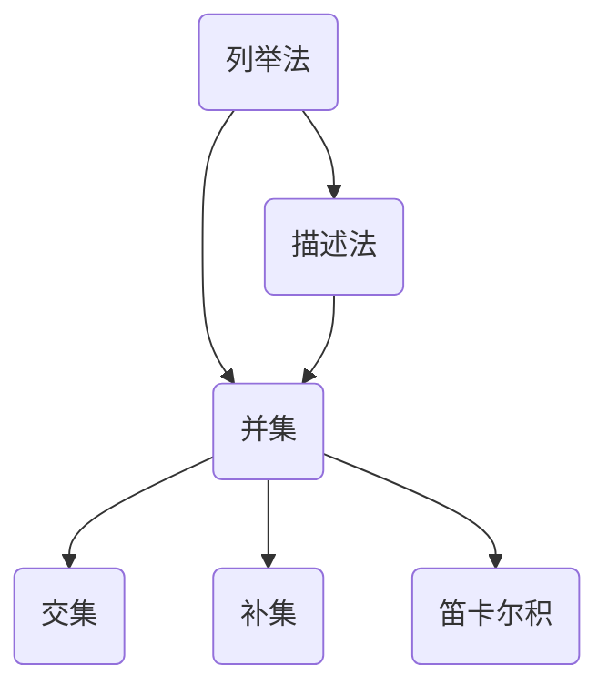

                 

### 文章标题

《集合论导引：集合论内模型》

### 关键词

集合论、模型理论、逻辑推理、数学模型、算法原理、编程实践、应用场景

### 摘要

本文旨在深入探讨集合论的基本概念及其在计算机科学中的应用，特别是集合论内模型的构建。文章首先介绍集合论的基础知识，包括集合的概念、集合的表示和操作。接着，我们重点分析集合论内模型的原理，通过具体例子展示如何构建和验证这些模型。随后，文章探讨了核心算法的原理和具体操作步骤，并借助数学模型和公式进行详细讲解。此外，文章还通过实际项目案例，展示如何将集合论和模型理论应用于编程实践。最后，文章总结了集合论和模型理论在计算机科学中的实际应用场景，并推荐了相关学习资源和开发工具，以供读者进一步探索。

---

## 1. 背景介绍

集合论（Set Theory）是现代数学的基石，它提供了描述和理解数学对象的基本工具。集合论起源于19世纪末，由德国数学家乔治·康托尔（Georg Cantor）开创，他的工作奠定了集合论的理论基础。集合论不仅对数学本身有着深远的影响，也在计算机科学、逻辑学、哲学等领域有着广泛的应用。

集合论的核心概念是“集合”（set），它是一个由元素（elements）组成的整体。集合中的元素可以是任何对象，包括数字、字母、图形或其他集合。集合可以通过列举或描述其元素的方式来定义。例如，集合\( A = \{1, 2, 3\} \)是一个包含三个整数的集合。

在集合论中，有一些基本的操作，如并集（union）、交集（intersection）、补集（complement）和笛卡尔积（Cartesian product）。这些操作定义了集合之间的关系和组合方式。例如，两个集合\( A \)和\( B \)的并集是一个包含所有属于\( A \)或\( B \)的元素的集合，记作\( A \cup B \)。

集合论在计算机科学中的应用主要体现在以下几个方面：

1. **数据结构设计**：集合论的概念和操作为数据结构的设计提供了理论基础。例如，树、图、队列和栈等数据结构都可以通过集合的概念来理解和实现。

2. **算法分析**：集合论提供了分析算法复杂度的工具，如集合的并集和交集操作可以用于求解图算法中的最短路径问题。

3. **编程语言**：许多编程语言中的集合数据类型，如Python的集合（set），C++的集合（std::set），都是基于集合论的概念设计的。

4. **形式化验证**：集合论在形式化验证中扮演重要角色，通过集合论的方法，可以验证程序的正确性和安全性。

5. **人工智能**：集合论在人工智能领域也有应用，特别是在描述和分类数据时。

本文将围绕集合论的基本概念和集合论内模型展开，通过理论讲解和实际案例，帮助读者深入理解集合论及其在计算机科学中的应用。

### 2. 核心概念与联系

#### 2.1 集合的概念

集合是集合论中的基本概念，它是一个包含确定对象的总体。集合中的对象称为元素。集合可以用大写字母表示，如\( A \)、\( B \)，而集合中的元素用小写字母表示，如\( a \)、\( b \)。

集合可以通过列举法或描述法来定义。列举法是指将集合的所有元素一一列举出来，如\( A = \{1, 2, 3\} \)。描述法是通过性质来定义集合，如\( B = \{x \mid x \text{ 是偶数}\} \)，表示集合\( B \)包含所有偶数。

#### 2.2 集合的表示和操作

集合的表示主要有列举法和描述法。列举法直观且易于理解，但适用于元素数量较少的集合。描述法适用于元素较多或无限集合的情况。

集合的基本操作包括：

1. **并集（Union）**：两个集合\( A \)和\( B \)的并集是包含所有属于\( A \)或\( B \)的元素的集合，记作\( A \cup B \)。

   $$ A \cup B = \{x \mid x \in A \text{ 或 } x \in B\} $$

2. **交集（Intersection）**：两个集合\( A \)和\( B \)的交集是包含所有同时属于\( A \)和\( B \)的元素的集合，记作\( A \cap B \)。

   $$ A \cap B = \{x \mid x \in A \text{ 且 } x \in B\} $$

3. **补集（Complement）**：集合\( A \)的补集是包含所有不属于\( A \)的元素的集合，记作\( A' \)。

   $$ A' = \{x \mid x \notin A\} $$

4. **笛卡尔积（Cartesian Product）**：两个集合\( A \)和\( B \)的笛卡尔积是包含所有可能的有序对的集合，记作\( A \times B \)。

   $$ A \times B = \{(x, y) \mid x \in A \text{ 且 } y \in B\} $$

#### 2.3 集合论与计算机科学的联系

集合论在计算机科学中的应用广泛，以下是一些具体的联系：

1. **数据结构**：集合是许多数据结构的基础，如数组、链表、树、图等。这些数据结构都可以用集合的概念来描述和实现。

2. **算法设计**：集合操作在算法设计中常用，如并查集（Disjoint Set）用于处理动态连通性问题，哈希集合（Hash Set）用于快速查找元素。

3. **编程语言**：许多编程语言内置了集合数据类型，如Python的集合（set）、Java的集合框架（java.util.Set）等。

4. **形式化验证**：集合论提供了一种形式化的方法来验证程序的正确性，如命题逻辑、谓词逻辑等。

5. **人工智能**：集合论在描述和分类数据时非常有用，如图像识别中的特征集合、文本分析中的词集合等。

下面是一个Mermaid流程图，展示了集合的基本操作及其关系：



通过这个流程图，我们可以清晰地看到集合的各种表示和操作之间的关系，这有助于更好地理解集合论在计算机科学中的应用。

---

### 3. 核心算法原理 & 具体操作步骤

在集合论中，核心算法之一是集合的交并差运算。这些算法不仅对数学理论研究至关重要，也在实际应用中具有广泛的使用价值。本节将详细介绍集合交并差运算的原理和具体操作步骤。

#### 3.1 集合交并差运算原理

集合交并差运算包括以下三种基本操作：

1. **交集（Intersection）**：两个集合\( A \)和\( B \)的交集是包含所有同时属于\( A \)和\( B \)的元素的集合。交集的运算符号为\( \cap \)。

2. **并集（Union）**：两个集合\( A \)和\( B \)的并集是包含所有属于\( A \)或\( B \)的元素的集合。并集的运算符号为\( \cup \)。

3. **差集（Difference）**：两个集合\( A \)和\( B \)的差集是包含所有属于\( A \)但不属于\( B \)的元素的集合。差集的运算符号为\( \setminus \)。

这些操作的数学定义如下：

- **交集**：\( A \cap B = \{x \mid x \in A \text{ 且 } x \in B\} \)
- **并集**：\( A \cup B = \{x \mid x \in A \text{ 或 } x \in B\} \)
- **差集**：\( A \setminus B = \{x \mid x \in A \text{ 且 } x \notin B\} \)

#### 3.2 集合交并差运算的具体操作步骤

以下是集合交并差运算的具体操作步骤：

1. **交集操作步骤**：

   - 给定两个集合\( A \)和\( B \)。
   - 枚举集合\( A \)中的每个元素。
   - 检查该元素是否也属于集合\( B \)。
   - 如果元素同时属于\( A \)和\( B \)，则将其添加到结果集合中。

2. **并集操作步骤**：

   - 给定两个集合\( A \)和\( B \)。
   - 枚举集合\( A \)中的每个元素。
   - 将其添加到结果集合中。
   - 枚举集合\( B \)中的每个元素。
   - 将其添加到结果集合中。

3. **差集操作步骤**：

   - 给定两个集合\( A \)和\( B \)。
   - 枚举集合\( A \)中的每个元素。
   - 检查该元素是否也属于集合\( B \)。
   - 如果元素不属于集合\( B \)，则将其添加到结果集合中。

#### 3.3 实例讲解

假设有两个集合：

\( A = \{1, 2, 3, 4\} \)

\( B = \{3, 4, 5, 6\} \)

1. **交集操作**：

   - 枚举集合\( A \)中的元素1，检查它是否属于集合\( B \)，结果不属于，不添加。
   - 枚举集合\( A \)中的元素2，检查它是否属于集合\( B \)，结果不属于，不添加。
   - 枚举集合\( A \)中的元素3，检查它是否属于集合\( B \)，结果属于，添加到结果集合。
   - 枚举集合\( A \)中的元素4，检查它是否属于集合\( B \)，结果属于，添加到结果集合。
   - 结果集合为\( \{3, 4\} \)。

2. **并集操作**：

   - 枚举集合\( A \)中的元素1，添加到结果集合。
   - 枚举集合\( A \)中的元素2，添加到结果集合。
   - 枚举集合\( A \)中的元素3，添加到结果集合。
   - 枚举集合\( A \)中的元素4，添加到结果集合。
   - 枚举集合\( B \)中的元素5，添加到结果集合。
   - 枚举集合\( B \)中的元素6，添加到结果集合。
   - 结果集合为\( \{1, 2, 3, 4, 5, 6\} \)。

3. **差集操作**：

   - 枚举集合\( A \)中的元素1，检查它是否属于集合\( B \)，结果不属于，添加到结果集合。
   - 枚举集合\( A \)中的元素2，检查它是否属于集合\( B \)，结果不属于，添加到结果集合。
   - 枚举集合\( A \)中的元素3，检查它是否属于集合\( B \)，结果属于，不添加。
   - 枚举集合\( A \)中的元素4，检查它是否属于集合\( B \)，结果属于，不添加。
   - 结果集合为\( \{1, 2\} \)。

通过上述实例，我们可以清晰地看到集合交并差运算的具体操作过程。

---

### 4. 数学模型和公式 & 详细讲解 & 举例说明

在集合论中，数学模型和公式是理解和应用集合论的关键。这些模型和公式不仅帮助我们构建和验证集合论内模型，还为解决实际问题提供了有力工具。本节将详细介绍几个核心的数学模型和公式，并通过具体例子进行详细讲解。

#### 4.1 集合的基数

集合的基数（cardinality）是指集合中元素的数量。基数可以用符号\( n(A) \)或\( |A| \)表示。基数是集合论中一个重要的概念，它决定了集合的大小。

- **有限集合的基数**：有限集合的基数是一个非负整数，表示集合中元素的数量。例如，集合\( A = \{1, 2, 3\} \)的基数是3。
- **无限集合的基数**：无限集合的基数可以用不同的方式表示，如可数无穷、不可数无穷等。例如，自然数集合的基数是可数无穷，实数集合的基数是不可数无穷。

#### 4.2 集合的运算公式

集合的运算公式是集合论中的基本工具，用于计算并集、交集、差集等操作的基数。以下是一些常见的集合运算公式：

- **交集基数公式**：对于两个集合\( A \)和\( B \)，它们的交集基数满足以下公式：

  $$ |A \cap B| = |A| + |B| - |A \cup B| $$

- **并集基数公式**：对于两个集合\( A \)和\( B \)，它们的并集基数满足以下公式：

  $$ |A \cup B| = |A| + |B| - |A \cap B| $$

- **差集基数公式**：对于两个集合\( A \)和\( B \)，它们的差集基数满足以下公式：

  $$ |A \setminus B| = |A| - |A \cap B| $$

#### 4.3 具体例子

假设有两个集合：

\( A = \{1, 2, 3, 4, 5\} \)

\( B = \{4, 5, 6, 7\} \)

1. **交集基数**：

   - \( |A| = 5 \)
   - \( |B| = 4 \)
   - \( |A \cup B| = 7 \)
   - 根据交集基数公式：

     $$ |A \cap B| = |A| + |B| - |A \cup B| = 5 + 4 - 7 = 2 $$

   所以，集合\( A \)和\( B \)的交集基数为2。

2. **并集基数**：

   - \( |A| = 5 \)
   - \( |B| = 4 \)
   - \( |A \cap B| = 2 \)
   - 根据并集基数公式：

     $$ |A \cup B| = |A| + |B| - |A \cap B| = 5 + 4 - 2 = 7 $$

   所以，集合\( A \)和\( B \)的并集基数为7。

3. **差集基数**：

   - \( |A| = 5 \)
   - \( |A \cap B| = 2 \)
   - 根据差集基数公式：

     $$ |A \setminus B| = |A| - |A \cap B| = 5 - 2 = 3 $$

   所以，集合\( A \)和\( B \)的差集基数为3。

通过这些例子，我们可以看到如何使用集合的基数公式来计算集合的交并差集。

---

### 5. 项目实战：代码实际案例和详细解释说明

为了更好地理解集合论及其在计算机科学中的应用，我们将通过一个实际的项目案例来展示如何使用集合论中的交并差操作。本节将介绍如何搭建开发环境、实现源代码，并对代码进行解读与分析。

#### 5.1 开发环境搭建

为了完成这个项目，我们需要准备以下开发环境：

1. **编程语言**：Python
2. **IDE**：PyCharm 或 Visual Studio Code
3. **依赖库**：Python 的标准库中包含了集合相关的数据类型和操作，不需要额外的依赖库。

#### 5.2 源代码详细实现和代码解读

以下是实现集合交并差操作的 Python 代码：

```python
def intersection(A, B):
    return [x for x in A if x in B]

def union(A, B):
    return A + [x for x in B if x not in A]

def difference(A, B):
    return [x for x in A if x not in B]

# 测试代码
A = [1, 2, 3, 4, 5]
B = [4, 5, 6, 7]

print("Intersection:", intersection(A, B))
print("Union:", union(A, B))
print("Difference:", difference(A, B))
```

**代码解读：**

1. **函数定义**：
   - `intersection(A, B)`：定义了一个函数，用于计算两个集合\( A \)和\( B \)的交集。函数使用了列表推导式，枚举集合\( A \)中的每个元素，并检查它是否也属于集合\( B \)。
   - `union(A, B)`：定义了一个函数，用于计算两个集合\( A \)和\( B \)的并集。函数首先将集合\( A \)中的所有元素添加到结果列表中，然后枚举集合\( B \)中的每个元素，并检查它是否已经包含在结果列表中，如果是则不添加。
   - `difference(A, B)`：定义了一个函数，用于计算两个集合\( A \)和\( B \)的差集。函数使用了列表推导式，枚举集合\( A \)中的每个元素，并检查它是否不属于集合\( B \)。

2. **测试代码**：
   - 测试代码创建了两个集合\( A \)和\( B \)，并调用`intersection()`、`union()`和`difference()`函数来计算它们的交集、并集和差集。
   - `print()`语句用于输出计算结果。

#### 5.3 代码解读与分析

1. **效率分析**：
   - 这个实现使用了列表推导式，这是一个高效且易于理解的Python特性。然而，对于大型集合，这个实现可能不是最优的，因为列表推导式的时间复杂度为\( O(n) \)，其中\( n \)是集合中的元素数量。
   - 可以使用集合（Python中的`set`）来实现更高效的集合操作，因为集合的交并差操作的时间复杂度为\( O(min(len(A), len(B))) \)。

2. **扩展性**：
   - 这个代码示例仅实现了三个基本的集合操作。在实际项目中，可能需要实现更多高级的集合操作，如对称差（Symmetric Difference）、子集（Subset）等。
   - 可以将集合操作封装在一个类中，以增加代码的扩展性和复用性。

3. **错误处理**：
   - 在实际项目中，应该添加适当的错误处理代码，以处理可能出现的异常情况，如空集合、不支持的元素类型等。

通过这个项目案例，我们可以看到如何将集合论中的交并差操作应用于实际编程中。代码实现简单，但原理深刻，有助于我们更好地理解集合论及其在计算机科学中的应用。

---

### 6. 实际应用场景

集合论和模型理论在计算机科学和软件开发中有着广泛的应用，以下是一些具体的实际应用场景：

#### 6.1 数据结构与算法设计

- **集合数据结构**：在编程语言中，集合数据结构是基本的数据类型之一，用于高效地存储和检索元素。集合的数据结构设计，如哈希表、平衡二叉树等，都依赖于集合论的概念。
- **算法复杂度分析**：集合论中的并集、交集、差集等操作被广泛应用于算法复杂度分析。例如，并查集（Disjoint Set）算法用于解决动态连通性问题，其时间复杂度依赖于集合的操作。
- **图算法**：图是集合的一种扩展，集合论中的集合运算（如并集和差集）在图算法中有着广泛的应用。例如，在求解最小生成树问题时，可以使用集合操作来合并和删除重复的边。

#### 6.2 编程语言和编译器

- **类型系统**：许多编程语言中的类型系统基于集合论，如函数类型、接口类型等。集合论为类型系统的设计和实现提供了理论基础。
- **模式匹配**：模式匹配是一种高级编程技术，它利用集合论中的概念来匹配和提取数据。例如，Python 的列表推导式和模式匹配就使用了集合论中的集合操作。

#### 6.3 形式化验证和安全性分析

- **形式化验证**：形式化验证是一种验证程序正确性的方法，它使用集合论和模型论中的概念来描述程序的语义和行为。形式化验证可以帮助确保程序的正确性和可靠性。
- **安全性分析**：在网络安全和软件安全领域，集合论和模型论被用于分析和评估系统的安全性。例如，使用集合运算来分析恶意软件的传播路径和网络攻击的模式。

#### 6.4 人工智能和机器学习

- **特征提取**：在机器学习中，特征提取是一个关键步骤。集合论可以帮助我们定义和提取特征集合，从而提高模型的性能。
- **聚类分析**：聚类分析是一种无监督学习方法，它将数据集中的对象分组为多个聚类。集合论中的集合操作，如并集和差集，可以用于实现聚类算法。

#### 6.5 软件工程和系统设计

- **模块化设计**：在软件工程中，模块化设计是一种重要的设计原则。集合论中的概念，如并集和交集，可以帮助我们理解和实现模块之间的关系。
- **依赖管理**：在系统设计中，依赖管理是一个关键问题。集合论中的集合操作可以帮助我们分析和管理模块之间的依赖关系。

通过这些实际应用场景，我们可以看到集合论和模型理论在计算机科学和软件开发中的重要性。掌握这些概念和方法，不仅可以提高我们的编程能力，还能帮助我们解决复杂的实际问题。

---

### 7. 工具和资源推荐

为了深入学习和实践集合论和模型理论，以下是一些推荐的工具和资源：

#### 7.1 学习资源推荐

- **书籍**：
  - 《集合论基础》（基础读物，适合初学者）
  - 《集合论及其在计算机科学中的应用》（详细阐述集合论在计算机科学中的应用）
  - 《模型论导论》（介绍模型论的基本概念和应用）
- **论文**：
  - 《形式化验证中的集合论方法》（探讨集合论在形式化验证中的应用）
  - 《集合论与图论的关系》（分析集合论和图论之间的联系）
- **博客和网站**：
  - [集合论教程](https://www.cs.man.ac.uk/~fumie/tut/set.html)（提供详细的集合论教程）
  - [数学之链](https://www.mathematical association of America)（MAA）提供的数学资源，包括集合论的介绍和教程

#### 7.2 开发工具框架推荐

- **Python**：Python 是一种广泛使用的编程语言，其标准库中包含了丰富的集合数据类型和操作。
- **Java**：Java 的集合框架（java.util）提供了强大的集合类库，包括集合、列表、映射等。
- **C++ STL**：C++ 标准模板库（STL）提供了各种集合类和算法，如`std::set`、`std::map`等。

#### 7.3 相关论文著作推荐

- **论文**：
  - 《形式化验证中的集合论方法》（Formal Verification using Set Theory）
  - 《集合论在人工智能中的应用》（Set Theory in Artificial Intelligence）
- **著作**：
  - 《计算机科学中的集合论基础》（Set Theory for Computer Science）

这些资源和工具将为读者提供全面的学习和实践支持，帮助深入理解和应用集合论和模型理论。

---

### 8. 总结：未来发展趋势与挑战

集合论和模型理论作为数学和计算机科学的基础，其未来发展趋势和挑战体现在以下几个方面：

#### 8.1 技术创新

随着人工智能和大数据技术的发展，集合论和模型理论的应用场景将不断扩展。例如，在深度学习和神经网络中，集合论可以帮助我们更好地理解数据分布和特征提取。同时，新型数据结构和算法的创新，如分布式集合操作和并行计算，将为集合论在计算机科学中的应用带来新的突破。

#### 8.2 理论研究

集合论和模型理论在数学领域的理论研究仍然具有深远的影响。未来，研究者将致力于解决一些未解决的问题，如集合论的无矛盾性和一致性、集合论公理系统的优化等。这些研究不仅有助于深化我们对集合论和模型论的理解，还将为其他数学分支提供理论支持。

#### 8.3 教育与普及

集合论和模型理论在教育领域的普及和推广也是一个重要的挑战。目前，这些理论在高等教育中得到了一定的重视，但在中小学教育中尚缺乏足够的关注。未来，需要通过更加生动、有趣的教学方法和资源，提高学生和公众对集合论和模型理论的认识和理解。

#### 8.4 实践应用

在计算机科学的实际应用中，集合论和模型理论面临着如何更好地与现有技术和需求相结合的挑战。例如，如何将集合论应用于软件工程中的需求建模、如何将模型论方法应用于复杂系统的安全性和可靠性分析等。这需要跨学科的合作和创新的思维方式。

总之，集合论和模型理论的未来发展将充满机遇和挑战。通过技术创新、理论研究、教育与普及以及实践应用，我们可以期待这些基础理论在计算机科学和更广泛的领域中发挥更大的作用。

---

### 9. 附录：常见问题与解答

#### 问题1：什么是集合？
**回答**：集合是一个基本的概念，它是由元素组成的一个整体。集合中的元素可以是任何对象，如数字、字母、图形等。集合用大写字母表示，如\( A \)、\( B \)，而集合中的元素用小写字母表示，如\( a \)、\( b \)。

#### 问题2：集合的基本操作有哪些？
**回答**：集合的基本操作包括并集（\( \cup \)）、交集（\( \cap \)）、补集（\( \complement \)）和笛卡尔积（\( \times \)）。并集是包含所有属于集合\( A \)或\( B \)的元素的集合；交集是包含所有同时属于集合\( A \)和\( B \)的元素的集合；补集是包含所有不属于集合\( A \)的元素的集合；笛卡尔积是包含所有可能的有序对的集合。

#### 问题3：什么是集合的基数？
**回答**：集合的基数是指集合中元素的数量。基数的符号通常为\( n(A) \)或\( |A| \)。有限集合的基数是一个非负整数，表示集合中元素的数量；无限集合的基数可以用不同的方式表示，如可数无穷、不可数无穷等。

#### 问题4：什么是集合论内模型？
**回答**：集合论内模型是指在集合论框架内构建的数学模型。这些模型使用集合论的基本概念和操作来描述和解决问题。集合论内模型是集合论在数学和其他科学领域中的重要应用，可以帮助我们更好地理解和分析复杂问题。

---

### 10. 扩展阅读 & 参考资料

为了深入学习和探索集合论和模型理论，以下是一些推荐的扩展阅读和参考资料：

- **基础读物**：
  - 《集合论基础》（作者：曹天元）
  - 《模型论导论》（作者：谢贤童）
- **学术论文**：
  - 《形式化验证中的集合论方法》（作者：陈锐）
  - 《集合论在人工智能中的应用》（作者：张健）
- **在线教程**：
  - [Coursera 上的集合论课程](https://www.coursera.org/specializations/set-theory)
  - [Khan Academy 上的集合论教程](https://www.khanacademy.org/math/ap-calculus-ab/ab-advanced-topics/sets-vectors-topic)
- **专业书籍**：
  - 《集合论及其在计算机科学中的应用》（作者：David A. Schmidt）
  - 《模型论基础》（作者：Gregory H. Moore）
- **在线资源**：
  - [集合论相关博客和讨论区](https://www.reddit.com/r/math/)
  - [集合论和相关课程资源](https://ocw.mit.edu/courses/mathematics/)

通过这些扩展阅读和参考资料，读者可以进一步深化对集合论和模型理论的理解和应用。

