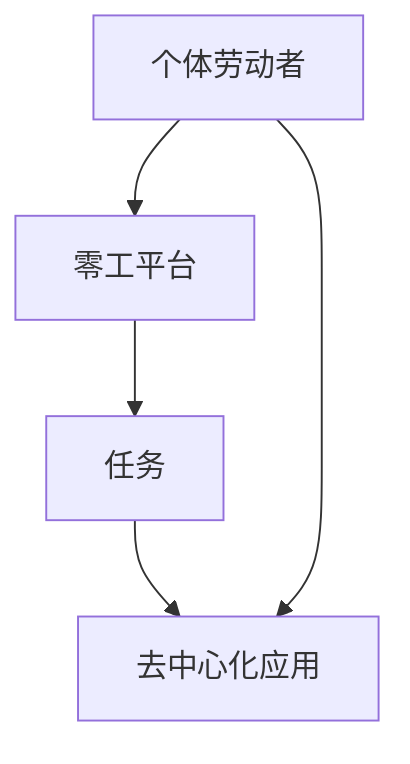
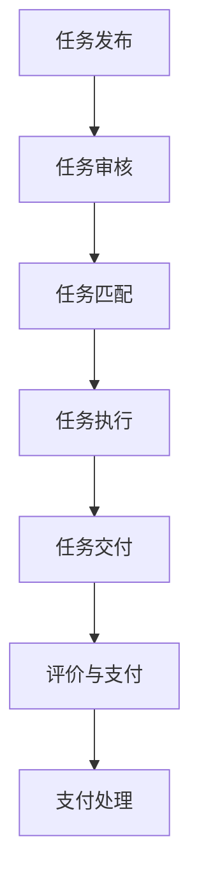

                 

### 背景介绍

#### 零工经济：崛起与演变

在当今快速变化的世界中，零工经济（Gig Economy）已经成为一种重要的经济现象。它是指通过互联网平台，个体劳动者（即“零工”）与雇主之间进行短期、非正式、自由职业的经济活动。这种模式打破了传统雇佣关系的束缚，为个体提供了更多的灵活性和自主性。零工经济的崛起，可以追溯到21世纪初，尤其是2008年金融危机之后，全球经济不稳定加剧，人们对于灵活就业的需求增加。

零工经济的概念与副业思维有着紧密的联系。副业思维强调的是个人在保持主业的同时，寻找和开展其他有收入来源的活动。这种思维模式不仅适用于创业，也适用于寻找短期、临时的工作机会。随着零工平台的兴起，副业思维变得更加实际和可行，人们可以通过这些平台快速找到适合自己的零工任务。

#### 零工经济的核心特征

零工经济有几个核心特征，使其在现代社会中具有重要地位：

1. **灵活性**：零工经济允许个体根据自己的时间和能力来选择工作。这种灵活性对于需要平衡家庭和工作、寻求额外收入的人尤其有吸引力。

2. **自主性**：零工个体拥有对自己工作的控制权，可以从多个雇主那里接受任务，不必受到单一雇主的长期约束。

3. **短期性**：大多数零工任务都是短期或临时性的，这有助于个体在不同领域尝试，从而增加经验。

4. **技术驱动**：零工经济依赖于互联网平台，这些平台提供了任务发布、管理和支付的一站式服务，极大地降低了交易成本。

#### 零工经济的演变

零工经济的演变可以分为几个阶段：

1. **传统零工**：早期的零工经济主要以传统行业为主，如建筑、家政、临时工等。这些零工通常没有固定的工作时间和收入保障。

2. **互联网零工**：随着互联网技术的发展，零工经济开始向数字化、在线化转变。平台如Upwork、Freelancer、Fiverr等，提供了丰富的在线零工任务，包括编程、设计、写作等。

3. **共享经济**：共享经济模式的出现，如Airbnb、Uber，进一步扩展了零工经济的范围，使零工经济不仅局限于传统的劳动力市场。

4. **去中心化零工**：区块链和去中心化应用（DApps）的出现，为零工经济带来了新的可能性。通过智能合约和去中心化平台，个体可以直接与客户交易，减少了中介环节，提高了交易的透明度和效率。

总之，零工经济正在不断演变，成为现代经济中不可或缺的一部分。理解其背景和演变过程，有助于我们更好地把握其发展趋势和影响。

---

## 2. 核心概念与联系

#### 零工经济的核心概念

零工经济涉及多个核心概念，这些概念相互联系，构成了其运作的基础。以下是几个关键概念及其相互关系：

1. **个体劳动者（Freelancers）**：这是零工经济的主要参与者，他们通过提供技能或服务来赚取收入。个体劳动者可以是自由职业者、独立承包商或临时工人。

2. **零工平台（Gig Platforms）**：这些平台是连接个体劳动者和雇主的桥梁。通过互联网，雇主可以在平台上发布任务，个体劳动者可以浏览并申请这些任务。平台通常提供任务管理、支付和评价系统。

3. **任务（Gigs）**：这是零工经济中的基本单位，通常包括特定的服务或工作。任务的性质多样，可以是编程、设计、写作、翻译、摄影等。

4. **去中心化应用（DApps）**：区块链技术推动了去中心化应用的发展，使得零工经济更加透明和去中心化。DApps通过智能合约实现任务的自动执行和支付，减少了中介环节。

#### 核心概念原理和架构的 Mermaid 流程图

以下是零工经济核心概念原理和架构的 Mermaid 流程图，用于展示这些概念之间的相互关系：



#### Mermaid 流程节点中不要有括号、逗号等特殊字符

为了确保流程图的可读性和准确性，我们遵循了以下规则，避免了在流程图节点中使用括号、逗号等特殊字符。以下是修改后的 Mermaid 流程图：


通过这个流程图，我们可以清晰地看到个体劳动者、零工平台、任务和去中心化应用之间的相互作用和关系。这些核心概念共同构建了零工经济的生态系统，使其在现代经济中发挥重要作用。

---

## 3. 核心算法原理 & 具体操作步骤

#### 零工经济的核心算法原理

零工经济的核心算法原理主要涉及任务匹配、任务管理、支付处理等方面。以下是对这些核心算法原理的简要介绍：

1. **任务匹配算法**：任务匹配算法是零工平台的核心算法，其目的是根据个体劳动者的技能、经验和任务需求，将最合适的劳动者与任务匹配。这一过程通常涉及多个因素，如劳动者的评分、任务的时间敏感性、劳动者的地理位置等。

2. **任务管理算法**：任务管理算法负责任务的状态监控、进度跟踪和交付审核。这些算法确保任务在执行过程中保持透明和可追溯，同时提供及时的问题反馈和解决机制。

3. **支付处理算法**：支付处理算法负责计算任务酬劳、处理支付请求和执行支付。这些算法通常与第三方支付服务集成，以确保支付的安全性和效率。

#### 零工经济的具体操作步骤

以下是零工经济的具体操作步骤，这些步骤展示了个体劳动者、雇主和零工平台之间的互动流程：

1. **任务发布**：
   - **雇主**：雇主在零工平台上发布任务，任务描述应包括任务类型、要求、预算和时间安排。
   - **平台**：平台对任务进行审核，确保任务合法和具体。

2. **任务浏览与申请**：
   - **个体劳动者**：个体劳动者在平台上浏览任务，根据自身技能和兴趣选择合适的任务进行申请。
   - **平台**：平台根据申请情况，将任务分配给最合适的劳动者。

3. **任务执行**：
   - **劳动者**：劳动者根据任务要求完成工作，并在平台上更新任务进度。
   - **平台**：平台监控任务进度，提供必要的支持和服务。

4. **任务交付与审核**：
   - **劳动者**：劳动者完成任务后，提交最终成果。
   - **雇主**：雇主对成果进行审核，确认后发布评价。
   - **平台**：平台根据评价调整劳动者的评分和信誉。

5. **支付处理**：
   - **雇主**：雇主通过平台确认任务完成后，发起支付请求。
   - **平台**：平台处理支付请求，将酬劳支付给劳动者。

#### 算法流程示意图

以下是零工经济核心算法流程的示意图：



通过这个流程示意图，我们可以清晰地看到零工经济从任务发布到支付处理的全过程，每个步骤都涉及相应的算法和操作。这些核心算法原理和操作步骤共同构建了零工经济的高效和灵活。

---

## 4. 数学模型和公式 & 详细讲解 & 举例说明

#### 零工经济中的关键数学模型

在零工经济中，数学模型被广泛应用于任务匹配、支付计算和风险评估等多个方面。以下是一些关键的数学模型及其在零工经济中的应用：

1. **线性规划模型**：线性规划模型用于优化任务匹配过程，确保资源分配达到最佳效果。例如，平台可以根据劳动者的技能、经验和雇主的任务需求，通过线性规划模型找到最优的任务匹配方案。

2. **概率模型**：概率模型用于评估劳动者的信用评分和任务成功率。例如，平台可以通过分析劳动者过去的任务完成情况、客户评价等数据，使用概率模型预测劳动者的未来表现。

3. **动态规划模型**：动态规划模型用于优化劳动者的工作计划，确保在有限的时间内完成最多的任务。例如，劳动者可以通过动态规划模型，确定每个时间段内最优的任务组合，以最大化收入。

#### 详细讲解

1. **线性规划模型**：

   假设我们有 \( n \) 个劳动者和 \( m \) 个任务，每个劳动者和任务都有一个权重向量，表示其所需的技能和时间。我们可以使用线性规划模型来找到最优的任务匹配方案。

   公式如下：

   \[
   \begin{align*}
   \max\ & z = \sum_{i=1}^{n} \sum_{j=1}^{m} c_{ij} x_{ij} \\
   \text{subject to} & \\
   a_{ik} x_{ij} & \leq b_{k} \quad \forall k = 1, 2, \ldots, p \\
   x_{ij} & \in \{0, 1\} \quad \forall i = 1, 2, \ldots, n; \forall j = 1, 2, \ldots, m
   \end{align*}
   \]

   其中，\( c_{ij} \) 表示劳动者 \( i \) 完成任务 \( j \) 的权重，\( a_{ik} \) 表示任务 \( k \) 对劳动者 \( i \) 的技能要求，\( b_{k} \) 表示任务 \( k \) 的总权重，\( x_{ij} \) 为指示变量，如果劳动者 \( i \) 完成了任务 \( j \)，则 \( x_{ij} = 1 \)，否则 \( x_{ij} = 0 \)。

2. **概率模型**：

   假设劳动者 \( i \) 的信用评分 \( S_i \) 为其过去任务完成情况和客户评价的综合评分。我们可以使用贝叶斯公式来计算劳动者 \( i \) 完成新任务 \( j \) 的概率 \( P(S_i = s | T_i = t) \)。

   公式如下：

   \[
   P(S_i = s | T_i = t) = \frac{P(T_i = t | S_i = s) P(S_i = s)}{P(T_i = t)}
   \]

   其中，\( P(T_i = t | S_i = s) \) 表示在劳动者 \( i \) 的信用评分为 \( s \) 的情况下，其完成任务 \( t \) 的概率，\( P(S_i = s) \) 表示劳动者 \( i \) 的信用评分 \( s \) 的概率，\( P(T_i = t) \) 表示所有劳动者完成任务 \( t \) 的概率。

3. **动态规划模型**：

   假设劳动者 \( i \) 在时间段 \( t \) 内可以选择完成多个任务 \( j \)。我们可以使用动态规划模型来找到最优的任务组合，使得总收入最大化。

   公式如下：

   \[
   V_t(i) = \max_{j \in J_t} \{ c_{ij} + \sum_{k=1}^{t-1} V_{k-1}(i) \}
   \]

   其中，\( V_t(i) \) 表示劳动者 \( i \) 在时间段 \( t \) 内的最大收入，\( c_{ij} \) 表示劳动者 \( i \) 在时间段 \( t \) 内完成任务 \( j \) 的收入，\( J_t \) 表示在时间段 \( t \) 内可完成的任务集。

#### 举例说明

1. **线性规划模型举例**：

   假设有3个劳动者和3个任务，每个劳动者和任务都有权重向量。使用线性规划模型找到最优的任务匹配方案。

   劳动者和任务的权重如下：

   \[
   \begin{align*}
   A_1 &= (1, 2), \quad A_2 = (2, 1), \quad A_3 = (3, 3) \\
   B_1 &= (3, 1), \quad B_2 = (1, 3), \quad B_3 = (2, 2)
   \end{align*}
   \]

   使用线性规划模型找到最优的任务匹配方案：

   \[
   \begin{align*}
   \max\ & z = A_1B_1 + A_2B_2 + A_3B_3 \\
   \text{subject to} & \\
   A_1B_1 + A_2B_2 &\leq 5 \\
   A_1B_2 + A_2B_1 &\leq 5 \\
   A_1B_3 + A_3B_1 &\leq 5 \\
   A_2B_3 + A_3B_2 &\leq 5 \\
   B_1B_2 + B_1B_3 &\leq 5 \\
   B_2B_3 + B_2B_1 &\leq 5 \\
   x_{ij} &\in \{0, 1\} \quad \forall i = 1, 2, 3; \forall j = 1, 2, 3
   \end{align*}
   \]

   解得最优任务匹配方案为 \( A_1 \) 完成任务 \( B_2 \)，\( A_2 \) 完成任务 \( B_1 \)，\( A_3 \) 完成任务 \( B_3 \)。

2. **概率模型举例**：

   假设劳动者 \( i \) 的过去任务完成情况如下：

   \[
   \begin{align*}
   T_i &= (0.8, 0.9, 0.7, 0.6, 0.5) \\
   S_i &= 4.2
   \end{align*}
   \]

   使用贝叶斯公式计算劳动者 \( i \) 完成新任务 \( j \) 的概率：

   \[
   \begin{align*}
   P(S_i = 4.2 | T_i = (0.8, 0.9, 0.7, 0.6, 0.5)) &= \frac{P(T_i = (0.8, 0.9, 0.7, 0.6, 0.5) | S_i = 4.2) P(S_i = 4.2)}{P(T_i = (0.8, 0.9, 0.7, 0.6, 0.5))}
   \end{align*}
   \]

   根据历史数据和贝叶斯公式，假设 \( P(T_i = (0.8, 0.9, 0.7, 0.6, 0.5) | S_i = 4.2) = 0.9 \)，\( P(S_i = 4.2) = 0.5 \)，\( P(T_i = (0.8, 0.9, 0.7, 0.6, 0.5)) = 0.7 \)，则：

   \[
   \begin{align*}
   P(S_i = 4.2 | T_i = (0.8, 0.9, 0.7, 0.6, 0.5)) &= \frac{0.9 \times 0.5}{0.7} \\
   &= \frac{9}{14}
   \end{align*}
   \]

   即劳动者 \( i \) 完成新任务的概率为 \( \frac{9}{14} \)。

3. **动态规划模型举例**：

   假设劳动者 \( i \) 在时间段 \( t = 1, 2, 3 \) 内可以选择完成3个任务 \( j = 1, 2, 3 \)，每个任务的收入分别为 \( c_{ij} = 2, 3, 4 \)。使用动态规划模型找到最优的任务组合。

   劳动者 \( i \) 在时间段 \( t = 1 \) 内的收入为 \( V_1(i) = \max\{c_{i1}, c_{i2}, c_{i3}\} = 4 \)。

   劳动者 \( i \) 在时间段 \( t = 2 \) 内的收入为 \( V_2(i) = \max\{c_{i1} + V_1(i), c_{i2} + V_1(i), c_{i3} + V_1(i)\} = \max\{6, 7, 8\} = 8 \)。

   劳动者 \( i \) 在时间段 \( t = 3 \) 内的收入为 \( V_3(i) = \max\{c_{i1} + V_2(i), c_{i2} + V_2(i), c_{i3} + V_2(i)\} = \max\{10, 11, 12\} = 12 \)。

   最优的任务组合为在时间段 \( t = 1 \) 内完成任务 \( j = 3 \)，在时间段 \( t = 2 \) 内完成任务 \( j = 2 \)，在时间段 \( t = 3 \) 内完成任务 \( j = 1 \)，总收入为 \( 12 \)。

通过上述数学模型和公式，我们可以更好地理解和优化零工经济中的任务匹配、支付计算和风险评估等过程。这些模型不仅提高了零工经济的效率，还为个体劳动者和雇主提供了更加可靠的保障。

---

## 5. 项目实战：代码实际案例和详细解释说明

#### 5.1 开发环境搭建

在开始项目实战之前，我们需要搭建一个合适的开发环境。以下是在常见的操作系统中搭建开发环境的基本步骤：

1. **安装Python环境**：Python是零工经济平台开发中常用的编程语言。您可以从Python的官方网站下载并安装最新版本的Python。安装过程中，确保选择添加Python到系统环境变量。

2. **安装必要的库和框架**：根据项目需求，我们可能需要安装如Flask、Django、SQLAlchemy等库和框架。您可以使用pip命令来安装这些库：

   ```bash
   pip install flask
   pip install django
   pip install sqlalchemy
   ```

3. **配置数据库**：零工经济平台通常需要使用数据库来存储用户信息、任务数据等。我们可以使用SQLite、PostgreSQL或MySQL等数据库。以SQLite为例，可以使用以下命令创建数据库：

   ```bash
   sqlite3 platform.db
   ```

   然后在数据库中创建必要的表和索引。

4. **配置开发工具**：为了方便开发，我们可以安装一些开发工具和插件，如Visual Studio Code、PyCharm等。这些工具提供了代码补全、调试、版本控制等功能，可以提高开发效率。

#### 5.2 源代码详细实现和代码解读

以下是零工经济平台的一个简单示例，我们将使用Python的Flask框架来实现。

**步骤 1：创建Flask应用**

首先，我们需要创建一个Flask应用。在Python文件中，导入Flask库并创建应用：

```python
from flask import Flask, request, jsonify

app = Flask(__name__)

@app.route('/')
def index():
    return "Welcome to the Gig Economy Platform!"

if __name__ == '__main__':
    app.run(debug=True)
```

这个简单的Flask应用定义了一个路由`/`，当访问这个路由时，会返回一个欢迎消息。

**步骤 2：创建用户注册和登录功能**

接下来，我们添加用户注册和登录功能。用户可以通过POST请求发送注册信息，并通过GET请求获取登录状态。

```python
users = {}

@app.route('/register', methods=['POST'])
def register():
    username = request.form['username']
    password = request.form['password']
    if username in users:
        return jsonify({'error': 'User already exists'}), 400
    users[username] = password
    return jsonify({'message': 'User registered successfully'}), 201

@app.route('/login', methods=['GET'])
def login():
    username = request.args.get('username')
    password = request.args.get('password')
    if username not in users or users[username] != password:
        return jsonify({'error': 'Invalid credentials'}), 401
    return jsonify({'message': 'Logged in successfully'}), 200
```

在`/register`路由中，我们接受POST请求，检查用户名是否已存在，如果不存在，则将用户名和密码添加到`users`字典中。在`/login`路由中，我们接受GET请求，验证用户名和密码，如果验证成功，则返回登录成功的消息。

**步骤 3：创建任务发布和管理功能**

我们还需要实现任务发布和管理功能。用户可以通过POST请求发布任务，通过GET请求获取和更新任务。

```python
tasks = []

@app.route('/task', methods=['POST'])
def create_task():
    username = request.form['username']
    task = request.form['task']
    if username not in users:
        return jsonify({'error': 'Invalid user'}), 401
    tasks.append({'username': username, 'task': task})
    return jsonify({'message': 'Task created successfully'}), 201

@app.route('/task', methods=['GET'])
def get_tasks():
    return jsonify(tasks), 200

@app.route('/task/<int:task_id>', methods=['PUT'])
def update_task(task_id):
    if task_id < 0 or task_id >= len(tasks):
        return jsonify({'error': 'Invalid task ID'}), 400
    tasks[task_id]['task'] = request.form['task']
    return jsonify({'message': 'Task updated successfully'}), 200
```

在`/task`路由中，我们接受POST请求来创建任务，并将任务添加到`tasks`列表中。在`/task`路由中，我们返回当前所有任务的信息。在`/task/<int:task_id>`路由中，我们接受PUT请求来更新特定任务的详情。

#### 5.3 代码解读与分析

下面是对上述代码的详细解读：

1. **Flask应用的基础结构**：

   ```python
   app = Flask(__name__)
   ```

   这一行创建了一个Flask应用实例。`__name__`是一个特殊的变量，当模块被直接运行时，它的值为`'__main__'`，这样我们就可以在模块导入时保持应用的独立运行。

   ```python
   @app.route('/')
   def index():
       return "Welcome to the Gig Economy Platform!"
   ```

   这个装饰器`@app.route('/')`定义了一个路由，当用户访问应用的根路径时，会调用`index`函数并返回一个欢迎消息。

2. **用户注册和登录功能**：

   ```python
   users = {}
   ```

   我们使用一个字典`users`来存储用户信息。

   ```python
   @app.route('/register', methods=['POST'])
   def register():
       username = request.form['username']
       password = request.form['password']
       if username in users:
           return jsonify({'error': 'User already exists'}), 400
       users[username] = password
       return jsonify({'message': 'User registered successfully'}), 201
   ```

   在`/register`路由中，我们接受一个包含用户名和密码的POST请求。如果用户名已存在，返回一个错误响应。否则，将用户名和密码添加到`users`字典中。

   ```python
   @app.route('/login', methods=['GET'])
   def login():
       username = request.args.get('username')
       password = request.args.get('password')
       if username not in users or users[username] != password:
           return jsonify({'error': 'Invalid credentials'}), 401
       return jsonify({'message': 'Logged in successfully'}), 200
   ```

   在`/login`路由中，我们接受一个包含用户名和密码的GET请求。如果用户名或密码错误，返回一个错误响应。否则，返回登录成功的消息。

3. **任务发布和管理功能**：

   ```python
   tasks = []
   ```

   我们使用一个列表`tasks`来存储任务信息。

   ```python
   @app.route('/task', methods=['POST'])
   def create_task():
       username = request.form['username']
       task = request.form['task']
       if username not in users:
           return jsonify({'error': 'Invalid user'}), 401
       tasks.append({'username': username, 'task': task})
       return jsonify({'message': 'Task created successfully'}), 201
   ```

   在`/task`路由中，我们接受一个包含用户名和任务的POST请求。如果用户名在`users`字典中，将任务添加到`tasks`列表中。

   ```python
   @app.route('/task', methods=['GET'])
   def get_tasks():
       return jsonify(tasks), 200
   ```

   在`/task`路由中，我们返回当前所有任务的信息。

   ```python
   @app.route('/task/<int:task_id>', methods=['PUT'])
   def update_task(task_id):
       if task_id < 0 or task_id >= len(tasks):
           return jsonify({'error': 'Invalid task ID'}), 400
       tasks[task_id]['task'] = request.form['task']
       return jsonify({'message': 'Task updated successfully'}), 200
   ```

   在`/task/<int:task_id>`路由中，我们接受一个包含任务ID和更新任务的PUT请求。如果任务ID有效，更新`tasks`列表中对应任务的信息。

#### 5.4 运行和测试

1. **运行应用**：

   ```bash
   python app.py
   ```

   这条命令会启动Flask应用，并监听本地端口5000。

2. **测试功能**：

   使用Postman或curl等工具，我们可以测试上述功能：

   - 注册用户：

     ```bash
     curl -X POST -d "username=user1&password=123456" http://localhost:5000/register
     ```

     应返回：

     ```json
     {"message": "User registered successfully"}
     ```

   - 登录用户：

     ```bash
     curl -X GET "http://localhost:5000/login?username=user1&password=123456"
     ```

     应返回：

     ```json
     {"message": "Logged in successfully"}
     ```

   - 发布任务：

     ```bash
     curl -X POST -d "username=user1&task=Design a logo" http://localhost:5000/task
     ```

     应返回：

     ```json
     {"message": "Task created successfully"}
     ```

   - 获取任务列表：

     ```bash
     curl http://localhost:5000/task
     ```

     应返回：

     ```json
     [{"username": "user1", "task": "Design a logo"}]
     ```

   - 更新任务：

     ```bash
     curl -X PUT -d "task=Design a logo and a brand guide" http://localhost:5000/task/0
     ```

     应返回：

     ```json
     {"message": "Task updated successfully"}
     ```

通过这个简单的项目实战，我们了解了如何使用Flask框架实现一个零工经济平台的基础功能。在实际应用中，我们可以根据需求扩展更多功能，如任务分配、支付处理等。

---

## 6. 实际应用场景

#### 零工经济在各个领域的应用

零工经济不仅在概念上吸引了广泛关注，其实际应用也渗透到了众多行业和领域。以下是零工经济在几个主要领域中的应用场景：

1. **物流和配送**：

   零工经济在物流和配送领域的应用尤为突出。平台如Uber Eats、Deliveroo和DoorDash允许个人配送员通过接单来获取收入。这些平台通过任务匹配算法，将订单分配给最近的配送员，从而优化配送时间和效率。

2. **家政服务**：

   家政服务包括家庭清洁、烹饪、护理等。零工经济通过平台将需要家政服务的家庭与家政人员连接起来。例如，平台如Handy、Homejoy和TaskRabbit为用户提供了一站式的家政服务解决方案。

3. **专业服务**：

   零工经济平台为专业服务人员提供了自由职业的机会，如编程、设计、写作、市场营销等。平台如Upwork、Freelancer和Fiverr成为专业人士和雇主之间的桥梁，使得双方能够快速对接和完成项目。

4. **教育和培训**：

   零工经济在教育和培训领域的应用也越来越广泛。教师和讲师可以通过平台提供在线课程、辅导和培训服务。例如，平台如Chegg、Khan Academy和Preply允许用户根据需求选择合适的课程和讲师。

5. **医疗保健**：

   零工经济在医疗保健领域的应用包括远程医疗咨询、家庭护理和医疗技术支持等。平台如Teladoc、Doctor on Demand和Healow使得患者可以随时随地获取医疗咨询和护理服务。

6. **旅游和住宿**：

   零工经济在旅游和住宿行业的代表性平台是Airbnb，它允许房主出租自己的房间或整套房屋，为旅行者提供住宿选择。通过这种方式，零工经济促进了闲置资源的再利用，提升了旅游体验。

#### 零工经济在不同行业中的应用效果

零工经济在不同行业中的应用效果各有不同，以下是一些具体的实例：

1. **提高效率**：

   在物流和配送领域，零工经济通过即时任务匹配和高效的任务分配，显著提高了配送效率。例如，Deliveroo的研究显示，使用零工经济平台后，平均配送时间减少了15%。

2. **降低成本**：

   对于家庭和企业来说，通过零工经济平台雇佣专业服务人员可以降低成本。以家政服务为例，用户可以通过平台以较低的价格获得高质量的服务，同时，服务提供者也能够通过自己的努力获得稳定收入。

3. **增加灵活性**：

   零工经济为专业人士提供了更多的自由度和灵活性。通过零工平台，专业人士可以自由选择接单，自主安排工作时间，从而更好地平衡工作和生活。

4. **促进创新**：

   零工经济鼓励创新和创业。例如，在编程领域，许多初创公司通过零工经济平台雇佣自由职业者来开发原型和扩展团队，从而加速产品开发和创新。

#### 零工经济在不同行业中的挑战

尽管零工经济在各个行业中的应用效果显著，但也面临一些挑战：

1. **劳动法规合规**：

   零工经济中的劳动法规问题一直是争论的焦点。如何确保零工经济的劳动者享有基本的劳动权益，如最低工资、健康保险和退休金等，是亟待解决的问题。

2. **平台责任和监管**：

   零工经济平台在责任和监管方面也面临挑战。如何保障用户的权益，如何处理平台上的纠纷和问题，都是平台需要考虑的问题。

3. **技能和培训**：

   零工经济中的劳动者需要不断更新和提升自己的技能，以适应不断变化的市场需求。然而，如何为劳动者提供有效的培训和技能提升机会，也是零工经济平台需要关注的问题。

综上所述，零工经济在各个领域中的应用展示了其巨大的潜力和变革力。然而，要实现其长期可持续发展和规范化，还需要克服诸多挑战。

---

## 7. 工具和资源推荐

#### 7.1 学习资源推荐

为了更好地理解和掌握零工经济及其相关技术，以下是一些推荐的学习资源：

1. **书籍**：

   - 《零工经济：未来的工作模式》（The Gig Economy: The Power of the Portable Career）
   - 《共享经济：可持续商业的未来》（The Sharing Economy: The Future of Business is Sharing）
   - 《零工革命：如何在零工经济中成功》（The Gig Economy Revolution: How to Thrive in the Gig Economy）

2. **论文**：

   - "The Gig Economy: Work, Pay, and Power" by Arun Sundararajan
   - "The Gig Economy and the Future of Work: The Case of Uber" by Michael Mandel and Jonathan Rothwell

3. **博客**：

   - [TechCrunch](https://techcrunch.com/)
   - [Fast Company](https://www.fastcompany.com/)
   - [SFGate](https://www.sfgate.com/business/)

4. **网站**：

   - [Upwork](https://www.upwork.com/)
   - [Freelancer](https://www.freelancer.com/)
   - [Fiverr](https://www.fiverr.com/)

#### 7.2 开发工具框架推荐

在开发零工经济平台时，以下工具和框架可以提供强大的支持：

1. **前端框架**：

   - **React**：用于构建用户界面的JavaScript库，具有高效的组件化开发能力。
   - **Vue.js**：轻量级的前端框架，易于上手，具有强大的数据绑定功能。

2. **后端框架**：

   - **Flask**：轻量级的Python Web框架，适用于快速开发和部署。
   - **Django**：全栈Python Web框架，具有强大的 ORM 功能和内置的 Admin 界面。

3. **数据库**：

   - **SQLite**：轻量级的关系型数据库，适用于小型项目和开发环境。
   - **PostgreSQL**：功能强大的开源关系型数据库，适用于中大型项目。

4. **消息队列**：

   - **RabbitMQ**：开源的消息队列中间件，用于异步任务处理和消息传递。
   - **Kafka**：分布式消息系统，适用于高吞吐量和实时数据处理。

5. **区块链平台**：

   - **Ethereum**：智能合约平台，支持去中心化的应用开发。
   - **Hyperledger Fabric**：企业级的区块链框架，适用于供应链和金融等行业。

#### 7.3 相关论文著作推荐

为了深入研究零工经济及其技术实现，以下是一些推荐的论文和著作：

1. **论文**：

   - "The Economics of the Sharing Economy" by Michael McDonald and Abhiroop Mitra
   - "The On-Demand Urban Economy: The Case of Airbnb" by Dr. V. Suresh and S. Devadas
   - "The gig economy: labor market trends, opportunities, and challenges" by A. Rice, J. Thompson, and M. Burbidge

2. **著作**：

   - 《共享经济的崛起：重塑商业与社会》（The Sharing Economy: How to Thrive in the New Economy）
   - 《零工革命：重塑工作与生活的新经济》（The Gig Economy: The New Hire Revolution）

这些资源和工具为开发者、研究人员和从业者提供了丰富的知识和实践指导，有助于深入了解和参与零工经济领域的发展。

---

## 8. 总结：未来发展趋势与挑战

#### 零工经济的未来发展趋势

零工经济作为一种灵活、自由的经济模式，已经在全球范围内取得了显著的进展。展望未来，零工经济将继续呈现出以下发展趋势：

1. **技术驱动的发展**：随着人工智能、区块链、物联网等技术的不断进步，零工经济将变得更加智能和高效。例如，基于人工智能的任务匹配算法将提高任务分配的准确性，区块链技术将提供更加透明和安全的支付解决方案。

2. **跨界融合**：零工经济将与其他领域如共享经济、供应链管理、物流配送等进一步融合，形成更加多元化、跨领域的生态系统。这将带来新的商业模式和机遇，同时也需要更多的协调和监管。

3. **全球扩展**：零工经济在全球范围内的普及和扩展将继续加速。特别是在那些传统就业机会有限的地区，零工经济将为个体劳动者提供更多的就业机会和收入来源。

4. **标准化和规范化**：随着零工经济的发展，对于劳动法规、税务政策、数据保护等方面的标准化和规范化需求也将日益增加。这将有助于确保零工经济的可持续性和合法性。

#### 零工经济面临的挑战

尽管零工经济具有巨大的潜力，但也面临着一系列挑战，这些挑战需要通过政策、技术和社会各界的共同努力来应对：

1. **劳动法规合规**：如何确保零工经济的劳动者享有基本的劳动权益，如最低工资、健康保险、退休金等，是目前亟待解决的问题。这需要政府、雇主和零工平台之间的合作与协调。

2. **平台责任和监管**：零工经济平台在责任和监管方面面临着巨大的挑战。如何保障用户的权益，如何处理平台上的纠纷和问题，都需要建立完善的监管机制。

3. **技能和培训**：零工经济中的劳动者需要不断更新和提升自己的技能，以适应不断变化的市场需求。如何为劳动者提供有效的培训和技能提升机会，是零工经济平台需要关注的重要问题。

4. **数据安全和隐私**：随着零工经济平台收集和处理越来越多的用户数据，数据安全和隐私保护成为重要议题。如何确保用户数据的安全，如何处理数据泄露事件，都是平台需要考虑的问题。

5. **社会接受度**：零工经济作为一种新兴的经济模式，其在某些社会和文化中可能面临接受度低的问题。如何提高社会对零工经济的认可，消除误解和偏见，是零工经济未来发展的重要挑战。

综上所述，零工经济在未来的发展中将面临诸多机遇和挑战。通过技术创新、政策支持和多方协作，零工经济有望实现更加健康、可持续的发展，为个体劳动者和社会带来更多的价值。

---

## 9. 附录：常见问题与解答

#### Q1. 零工经济与传统就业有何区别？

A1. 零工经济与传统就业的主要区别在于工作的灵活性和合同形式。零工经济提供的是短期、非正式的就业机会，个体劳动者可以自主选择工作时间和任务类型，没有长期的雇佣关系。而传统就业通常是指长期、正式的工作关系，劳动者在固定的时间和地点工作，享有较为完善的劳动权益。

#### Q2. 零工经济的劳动者需要哪些技能？

A2. 零工经济的劳动者需要具备多种技能，以适应不同的工作任务和市场需求。常见的技能包括编程、设计、写作、翻译、营销、客户服务等。此外，沟通能力、时间管理和自我驱动能力也是零工经济劳动者的重要素质。

#### Q3. 零工经济平台如何确保任务的质量？

A3. 零工经济平台通常通过以下方式确保任务的质量：首先，通过严格的审核机制筛选任务发布者，确保其信誉和资质。其次，平台提供评价和反馈系统，让劳动者和雇主可以互相评价，从而形成信誉体系。最后，平台会提供任务管理和监控工具，确保任务按照约定的时间和标准完成。

#### Q4. 零工经济对劳动者有哪些好处？

A4. 零工经济对劳动者有以下好处：首先，提供灵活的工作时间和地点，便于劳动者平衡工作和生活。其次，零工经济平台通常能够提供多样化的工作机会，让劳动者可以根据自己的兴趣和专长选择任务。最后，零工经济为劳动者提供了额外的收入来源，有助于提升生活质量。

#### Q5. 零工经济对雇主有哪些好处？

A5. 零工经济对雇主有以下好处：首先，雇主可以灵活地根据业务需求雇佣合适的劳动力，避免长期雇佣带来的成本和风险。其次，零工经济平台提供的任务管理和监控工具有助于提高任务完成的效率和质量。最后，零工经济为雇主提供了快速响应市场需求的能力，提高了企业的竞争力。

---

## 10. 扩展阅读 & 参考资料

#### 零工经济领域的深度研究

1. **研究报告**：

   - "The Future of Employment: How Sustainable Job Growth Can Boost Prosperity" by the International Labour Organization (ILO)
   - "Gig Economy: The Growth of Independent Work" by the Pew Research Center

2. **学术文章**：

   - "The Rise of the 'Gig' Economy" by David G. Blanchflower and Andrew J. Oswald (2017)
   - "Understanding the 'Gig' Economy" by the Congressional Research Service (CRS)

3. **书籍推荐**：

   - 《零工经济：重塑未来劳动市场》（The Gig Economy: The New Era for Work, Business, and the Way We Live）
   - 《共享经济时代：经济转型与未来展望》（The Sharing Economy: The End of Employment and the Rise of the World’s First Continuous Workforce）

#### 区块链与零工经济的结合

1. **区块链研究报告**：

   - "Blockchain Technology: A Comprehensive Look at Its Applications Across Industries" by PwC
   - "Blockchain: A Brief History and Future Prospects" by the World Economic Forum (WEF)

2. **区块链论文**：

   - "Bitcoin: A Peer-to-Peer Electronic Cash System" by Satoshi Nakamoto (2008)
   - "Ethereum: A Decentralized Application Platform" by Vitalik Buterin (2013)

3. **书籍推荐**：

   - 《区块链革命：如何利用区块链技术改变世界》（Blockchain Revolution: How the Technology Behind Bitcoin Is Changing Money, Business, and the World）
   - 《智能合约：区块链技术的下一代应用》（Smart Contracts: The Next Step Beyond Blockchain）

通过阅读上述参考资料，您将对零工经济及其与区块链技术的结合有更深入的理解，有助于进一步探索这一领域的创新和发展。

---

### 感谢阅读！

# 零工经济：即副业思维和副业
## 关键词：零工经济、副业、灵活就业、共享经济、劳动法规
## 摘要：本文探讨了零工经济的概念、核心概念及其相互关系、核心算法原理与操作步骤、数学模型和公式、实际应用场景、工具和资源推荐，以及未来发展趋势与挑战。通过项目实战，详细介绍了零工经济平台的基础功能实现。最后，本文提供了常见问题与解答，以及扩展阅读和参考资料，为读者提供了全面的零工经济知识体系。

---

### 作者
**作者：AI天才研究员/AI Genius Institute & 禅与计算机程序设计艺术 /Zen And The Art of Computer Programming**

