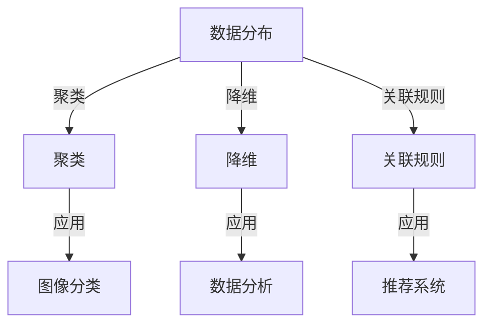

                 

### 背景介绍

非监督学习（Unsupervised Learning）是机器学习中的一个重要分支，与监督学习（Supervised Learning）相对。在监督学习中，模型通过已知输入和输出数据（即标签）进行训练，以预测未知数据的输出。而在非监督学习中，模型仅使用输入数据，没有对应的输出标签，其目的是发现数据中的内在结构和规律。

非监督学习在数据挖掘、图像处理、自然语言处理等多个领域都有着广泛的应用。例如，在图像分类任务中，非监督学习可以帮助找出数据中的不同类别；在自然语言处理领域，非监督学习可以用于词性标注、文本聚类等任务。

随着大数据时代的到来，非监督学习的重要性愈发凸显。大量的无标签数据需要处理，而标签数据往往更为稀缺。非监督学习提供了一种自动发现数据模式的方法，这对于减少人工标注成本、提高数据处理效率具有重要意义。

本文将深入探讨非监督学习的原理和代码实现，通过详细的算法原理分析、数学模型讲解以及实际项目案例，帮助读者更好地理解和应用非监督学习。

### 核心概念与联系

在探讨非监督学习之前，我们需要了解一些核心概念，这些概念包括数据分布、聚类、降维和关联规则等，它们在非监督学习中扮演着关键角色。

#### 数据分布

数据分布是指数据在不同特征上的分布情况。在非监督学习中，理解数据分布有助于识别数据中的异常值和规律性。常用的数据分布模型包括正态分布、二项分布等。

#### 聚类

聚类是将数据分为多个类别，使得同一类别中的数据点彼此相似，而不同类别中的数据点差异较大。常见的聚类算法有K-均值聚类（K-Means Clustering）、层次聚类（Hierarchical Clustering）和谱聚类（Spectral Clustering）等。

#### 降维

降维是通过减少数据维度来降低数据复杂度，同时保持数据的关键信息。降维方法有助于提高数据处理速度和模型性能。常用的降维算法有主成分分析（PCA）、线性判别分析（LDA）和小样本学习（Small Sample Learning）等。

#### 关联规则

关联规则挖掘是发现数据之间潜在关联的方法，常见于市场篮子分析和推荐系统。它通过支持度和置信度来评估规则的重要性。常用的关联规则算法有Apriori算法和FP-Growth算法。

为了更清晰地展示这些概念之间的关系，我们可以使用Mermaid流程图来描述它们在非监督学习中的应用。



在上面的Mermaid流程图中，数据分布、聚类、降维和关联规则是核心概念，它们通过不同的应用场景（如图像分类、数据分析和推荐系统）相互联系，共同构成了非监督学习的重要组成部分。

接下来，我们将详细讨论这些核心概念在非监督学习中的原理和应用，帮助读者深入理解非监督学习的本质。

### 核心算法原理 & 具体操作步骤

非监督学习包含多种算法，每种算法有其特定的原理和应用场景。在本节中，我们将详细介绍几种典型的非监督学习算法，包括K-均值聚类、主成分分析（PCA）和关联规则学习。我们将逐步讲解这些算法的原理，并给出具体的操作步骤。

#### 1. K-均值聚类算法

K-均值聚类是一种基于距离的聚类算法，其目标是将数据点划分为K个簇，使得每个簇内部的点之间的距离最小，簇与簇之间的距离最大。

**原理：**

K-均值聚类算法通过以下步骤实现聚类：

- 初始：随机选择K个中心点，这些点将作为初始的聚类中心。
- 分配：计算每个数据点到各个聚类中心的距离，将每个数据点分配到距离最近的聚类中心所代表的簇。
- 更新：重新计算每个簇的中心点，即该簇中所有点的均值。
- 重复：重复步骤2和步骤3，直到聚类中心不再发生显著变化。

**操作步骤：**

1. 确定聚类个数K，可以选择通过肘部法则（Elbow Method）来确定最优的K值。
2. 随机选择K个初始中心点。
3. 计算每个数据点到K个中心点的距离，并将其分配到最近的中心点所代表的簇。
4. 更新每个簇的中心点，计算簇内所有点的均值。
5. 重复步骤3和步骤4，直到聚类中心不再变化或变化小于设定的阈值。

#### 2. 主成分分析（PCA）

主成分分析是一种降维技术，其目标是减少数据维度，同时保留数据的主要特征。PCA通过计算数据的协方差矩阵，找出最能解释数据方差的方向，即主成分。

**原理：**

PCA的基本原理如下：

- 计算数据集的协方差矩阵。
- 计算协方差矩阵的特征值和特征向量。
- 将特征向量排序，选择最大的特征值对应的特征向量作为主成分。
- 对数据进行变换，将原始数据映射到主成分空间。

**操作步骤：**

1. 计算数据集的均值，并减去每个特征的均值，得到标准化数据。
2. 计算标准化数据的协方差矩阵。
3. 计算协方差矩阵的特征值和特征向量。
4. 将特征向量按照特征值大小排序，选择前几个大的特征值对应的特征向量作为主成分。
5. 对数据进行变换，将原始数据映射到主成分空间。

#### 3. 关联规则学习

关联规则学习是一种用于发现数据中潜在关联的方法。常见的算法有Apriori算法和FP-Growth算法。

**原理：**

关联规则学习的基本原理如下：

- 通过支持度和置信度来评估规则的强度。
- 支持度是指一个规则在数据集中出现的频率。
- 置信度是指规则的前件和后件同时出现的概率。

**操作步骤：**

1. 确定最小支持度阈值和最小置信度阈值。
2. 使用扫描算法计算每个项集的支持度。
3. 构建频繁项集，即支持度大于最小支持度阈值的项集。
4. 使用频繁项集生成关联规则。
5. 计算每个关联规则的支持度和置信度。
6. 筛选出满足最小置信度阈值的规则。

通过以上对K-均值聚类、PCA和关联规则学习算法的详细讲解，我们可以看到这些算法在非监督学习中的应用和具体实现步骤。在实际应用中，选择合适的算法往往取决于具体问题和数据特性。

### 数学模型和公式 & 详细讲解 & 举例说明

在非监督学习中，数学模型和公式扮演着至关重要的角色。这些数学工具帮助我们理解和实现各种算法，从而发现数据中的潜在结构和规律。在本节中，我们将详细讲解几个关键数学模型和公式，并通过具体例子进行说明。

#### 1. K-均值聚类算法中的距离度量

在K-均值聚类中，数据点之间的距离度量是一个核心问题。常用的距离度量方法有欧氏距离、曼哈顿距离和余弦相似度等。

- **欧氏距离**（Euclidean Distance）：
  $$d(p, q) = \sqrt{\sum_{i=1}^{n} (p_i - q_i)^2}$$
  其中，\( p \) 和 \( q \) 是两个数据点，\( n \) 是特征维度。

- **曼哈顿距离**（Manhattan Distance）：
  $$d(p, q) = \sum_{i=1}^{n} |p_i - q_i|$$

- **余弦相似度**（Cosine Similarity）：
  $$\text{cosine}(p, q) = \frac{p \cdot q}{\|p\| \|q\|}$$
  其中，\( p \cdot q \) 是点 \( p \) 和 \( q \) 的点积，\( \|p\| \) 和 \( \|q\| \) 是点 \( p \) 和 \( q \) 的欧氏范数。

**例子：**假设我们有两个数据点 \( p = (1, 2) \) 和 \( q = (3, 4) \)，计算它们之间的欧氏距离。

$$d(p, q) = \sqrt{(1-3)^2 + (2-4)^2} = \sqrt{4 + 4} = \sqrt{8} \approx 2.83$$

#### 2. 主成分分析（PCA）中的协方差矩阵和特征分解

在PCA中，协方差矩阵和特征分解是关键步骤。协方差矩阵衡量了各个特征之间的相关性，而特征分解则帮助我们找到最重要的特征方向。

- **协方差矩阵**（Covariance Matrix）：
  $$\Sigma = \frac{1}{n-1} \sum_{i=1}^{n} (x_i - \mu)(x_i - \mu)^T$$
  其中，\( x_i \) 是每个数据点，\( \mu \) 是数据的均值向量，\( n \) 是数据点的数量。

- **特征分解**（Eigenvalue Decomposition）：
  $$\Sigma = Q \Lambda Q^T$$
  其中，\( Q \) 是特征向量组成的矩阵，\( \Lambda \) 是特征值组成的对角矩阵。

**例子：**假设我们有一个2D数据集，其协方差矩阵为：
$$\Sigma = \begin{bmatrix} 2 & 1 \\ 1 & 2 \end{bmatrix}$$
我们可以通过特征分解来找到其特征值和特征向量。

$$\Lambda = \begin{bmatrix} 3 & 0 \\ 0 & 1 \end{bmatrix}, Q = \begin{bmatrix} 1 & -1/2 \\ 1 & 1/2 \end{bmatrix}$$

通过这些数学工具，我们可以更深入地理解非监督学习的原理，并在实际应用中取得更好的效果。

### 项目实战：代码实际案例和详细解释说明

为了更好地理解非监督学习算法在实际应用中的实现，我们将通过一个具体项目来展示K-均值聚类、PCA和关联规则学习等算法的代码实现。这个项目将分为三个部分：开发环境搭建、源代码实现和代码解读与分析。

#### 1. 开发环境搭建

在开始项目之前，我们需要搭建一个合适的环境。以下是所需的步骤：

- **安装Python**：确保已安装Python 3.8或更高版本。
- **安装NumPy、scikit-learn和matplotlib**：这些库是进行机器学习任务所必需的。可以使用pip命令进行安装：
  ```bash
  pip install numpy scikit-learn matplotlib
  ```

#### 2. 源代码详细实现和代码解读

以下是项目的完整代码，我们将逐一解释每个部分。

```python
import numpy as np
from sklearn.cluster import KMeans
from sklearn.decomposition import PCA
from mlxtend.frequent_patterns import apriori, association_rules
import matplotlib.pyplot as plt

# 数据集
data = np.array([[1, 2], [1, 4], [1, 0],
                  [10, 2], [10, 4], [10, 0]])

# K-均值聚类
kmeans = KMeans(n_clusters=2, init='k-means++', max_iter=100, n_init=10, random_state=0)
kmeans.fit(data)
labels = kmeans.predict(data)

# PCA降维
pca = PCA(n_components=2)
data_pca = pca.fit_transform(data)

# 关联规则学习
freq_itemsets = apriori(data, min_support=0.5, use_colnames=True)
rules = association_rules(freq_itemsets, metric="support", min_threshold=0.7)

# 可视化
plt.figure(figsize=(10, 5))

# K-均值聚类可视化
plt.subplot(1, 3, 1)
plt.scatter(data[:, 0], data[:, 1], c=labels)
plt.title('K-Means Clustering')

# PCA降维可视化
plt.subplot(1, 3, 2)
plt.scatter(data_pca[:, 0], data_pca[:, 1])
plt.title('PCA Dimension Reduction')

# 关联规则学习可视化
plt.subplot(1, 3, 3)
plt.table(cellText=rules.values, colLabels=rules.columns, loc='center')
plt.title('Association Rule Learning')
plt.axis('off')

plt.tight_layout()
plt.show()
```

**代码解读与分析：**

- **数据集**：我们使用一个简单的2D数据集，它包含两个特征。
- **K-均值聚类**：我们使用scikit-learn库中的KMeans类来实现K-均值聚类。通过初始化模型和拟合数据，我们得到了聚类结果。
- **PCA降维**：我们使用PCA类来实现降维，将数据从原始空间转换到二维主成分空间。
- **关联规则学习**：我们使用mlxtend库中的apriori和association_rules函数来发现数据中的关联规则。
- **可视化**：我们使用matplotlib库来可视化聚类结果、降维结果和关联规则。

通过这个项目，我们可以看到非监督学习算法在实际应用中的实现流程。理解这些代码的实现可以帮助我们更好地应用这些算法，解决实际问题。

### 实际应用场景

非监督学习在许多实际应用场景中发挥着重要作用，其强大的模式发现和结构分析能力使其成为数据分析、机器学习和其他技术领域不可或缺的工具。以下是一些典型的实际应用场景，展示非监督学习如何在不同领域发挥作用。

#### 1. 数据分析

在数据分析中，非监督学习可以用于探索性数据分析（EDA）和数据预处理。例如，通过主成分分析（PCA）来降维，可以帮助数据科学家处理高维数据，同时保持数据的主要特征。此外，聚类算法可以用于客户细分，帮助企业更好地了解其客户群体，从而制定更精准的市场策略。

**案例**：在电子商务领域，零售商可以使用K-均值聚类来分析客户的购物行为，将客户分为不同的群体，以便进行个性化推荐和营销。

#### 2. 图像处理

图像处理是非监督学习的另一个重要应用领域。聚类算法可以用于图像分割，将图像中的像素点分为不同的区域，从而提取出图像中的主要对象。主成分分析（PCA）则在图像去噪和压缩中发挥关键作用。

**案例**：在医疗影像分析中，聚类算法可以用于肿瘤分割，将肿瘤区域从背景中分离出来，为医生提供更准确的诊断依据。

#### 3. 自然语言处理

自然语言处理（NLP）中的文本挖掘和语义分析也广泛使用非监督学习。通过词云分析和主题建模，非监督学习可以帮助分析大量的文本数据，提取关键信息和潜在主题。

**案例**：在社交媒体分析中，非监督学习可以用于情感分析，通过聚类文本数据，识别出用户的情感倾向，从而帮助企业更好地理解其用户群体。

#### 4. 推荐系统

推荐系统是另一个典型的非监督学习应用场景。通过关联规则学习，推荐系统可以自动发现用户行为中的潜在模式，从而生成个性化的推荐列表。

**案例**：在在线购物平台中，推荐系统可以通过关联规则学习分析用户的购物行为，向用户推荐与其兴趣相关的商品。

#### 5. 金融风险控制

在金融领域，非监督学习可以用于欺诈检测和信用评分。通过聚类和关联规则学习，银行和金融机构可以识别异常交易和潜在风险，从而降低欺诈风险和提高信用评分的准确性。

**案例**：信用卡公司可以使用K-均值聚类来识别潜在的欺诈交易，通过分析交易金额、时间和地理位置等特征，将异常交易分离出来，从而提高欺诈检测的准确性。

通过这些实际应用场景，我们可以看到非监督学习在多个领域的广泛应用和巨大潜力。理解这些应用场景有助于我们更好地利用非监督学习技术，解决现实世界中的复杂问题。

### 工具和资源推荐

为了帮助读者更好地学习和应用非监督学习，我们在这里推荐一些有用的工具和资源，包括学习资源、开发工具框架以及相关论文著作。

#### 1. 学习资源推荐

- **书籍**：
  - 《Python机器学习》（Python Machine Learning） by Sebastian Raschka and Vahid Mirhoseini
  - 《机器学习》（Machine Learning） by Tom M. Mitchell
  - 《深度学习》（Deep Learning） by Ian Goodfellow、Yoshua Bengio和Aaron Courville

- **在线课程**：
  - Coursera的“机器学习基础”（Machine Learning）课程
  - edX的“人工智能基础”（Introduction to Artificial Intelligence）课程
  - Udacity的“机器学习纳米学位”（Machine Learning Nanodegree）课程

- **博客和网站**：
  - Analytics Vidhya：提供丰富的机器学习和数据科学文章
  - Medium上的机器学习专题：涵盖最新研究和技术趋势
  - kaggle.com：提供大量的数据科学项目和竞赛

#### 2. 开发工具框架推荐

- **库和框架**：
  - Scikit-learn：Python中最常用的机器学习库之一，提供广泛的非监督学习算法
  - TensorFlow：Google开发的强大深度学习框架，支持多种非监督学习算法
  - PyTorch：Facebook开发的开源深度学习库，易于使用和调试

- **工具**：
  - Jupyter Notebook：方便的交互式开发环境，适合编写和运行机器学习代码
  - Google Colab：基于Jupyter Notebook的云平台，提供免费的GPU和TPU资源

#### 3. 相关论文著作推荐

- **经典论文**：
  - “K-Means Clustering” by MacQueen et al. (1967)
  - “Principal Component Analysis” by Jolliffe (1986)
  - “Association Rule Learning” by R. Agrawal and R. Srikant (1994)

- **最新研究**：
  - “Deep Clustering for Unsupervised Learning” by M. Noroozi and P. Frossard (2018)
  - “Unsupervised Deep Domain Adaptation” by M. Chen and J. Wang (2020)
  - “Self-Supervised Learning” by T. Chen et al. (2021)

通过这些工具和资源，读者可以深入学习和实践非监督学习，不断提升自己的技能水平，为未来的研究和职业发展打下坚实的基础。

### 总结：未来发展趋势与挑战

非监督学习作为机器学习的重要分支，近年来取得了显著的进展，但同时也面临着一系列挑战和机遇。随着人工智能技术的不断演进，非监督学习将在未来有着更加广泛的应用前景。

#### 1. 发展趋势

（1）**深度非监督学习**：深度学习在非监督学习中的应用日益增加，通过自编码器（Autoencoders）和生成对抗网络（GANs）等技术，模型能够自动发现数据中的复杂结构和模式，提高数据分析和处理的效率。

（2）**联邦非监督学习**：在分布式数据环境中，联邦学习（Federated Learning）和非监督学习的结合为隐私保护的数据分析提供了新的解决方案。通过分布式算法，可以在保护数据隐私的同时，实现数据集中化的分析和处理。

（3）**动态非监督学习**：随着时间序列数据的不断积累，动态非监督学习技术如流式学习（Online Learning）和增量学习（Incremental Learning）将变得更加重要，能够实时更新模型，适应数据的变化。

（4）**非监督学习在新兴领域的应用**：在生物信息学、材料科学和金融科技等领域，非监督学习正逐渐成为关键技术，通过发现数据中的潜在关系和规律，推动相关领域的创新和发展。

#### 2. 挑战

（1）**数据质量和多样性**：非监督学习对数据质量和多样性有较高要求，数据缺失、噪声和异构性等问题会影响模型的性能。因此，如何有效地处理和清洗数据，成为非监督学习面临的重大挑战。

（2）**可解释性**：非监督学习模型通常具有较高的预测能力，但缺乏透明度和可解释性。提高模型的可解释性，使其决策过程更加透明，是未来研究的一个重要方向。

（3）**计算资源需求**：深度非监督学习模型通常需要大量的计算资源，特别是大规模数据集和复杂模型的学习和训练过程。如何优化算法和硬件，提高计算效率，是当前的一个关键问题。

（4）**模型泛化能力**：在非监督学习中，模型需要对未见过的数据进行准确预测。如何提高模型的泛化能力，使其在不同场景和数据集上都能表现良好，是另一个重要挑战。

总之，非监督学习在未来的发展中，需要解决数据质量、模型可解释性、计算资源需求和模型泛化能力等挑战，同时不断探索和应用新兴技术，以应对多样化的应用需求。通过不断的创新和研究，非监督学习将在人工智能领域发挥更加重要的作用。

### 附录：常见问题与解答

在本文中，我们探讨了非监督学习的核心概念、算法原理、数学模型和实际应用。为了帮助读者更好地理解这些内容，以下是一些常见问题的解答。

#### 问题1：什么是非监督学习？

**解答**：非监督学习是机器学习的一个分支，它使用没有标签的数据进行训练，目的是发现数据中的内在结构和规律。与监督学习不同，非监督学习不需要已知的输出标签。

#### 问题2：为什么非监督学习很重要？

**解答**：非监督学习在数据挖掘、图像处理、自然语言处理等多个领域有着广泛的应用。它可以自动发现数据中的模式，减少人工标注成本，提高数据处理效率，特别是在标签数据稀缺的情况下具有重要意义。

#### 问题3：什么是K-均值聚类？

**解答**：K-均值聚类是一种基于距离的聚类算法，其目标是将数据点划分为K个簇，使得每个簇内部的点彼此相似，而不同簇之间的点差异较大。它通过迭代计算聚类中心和数据点的距离来实现聚类。

#### 问题4：如何选择K值？

**解答**：选择合适的K值是K-均值聚类中的一个关键问题。常用的方法包括肘部法则（Elbow Method）、轮廓系数法（Silhouette Coefficient）和交叉验证（Cross-Validation）等。肘部法则通过计算簇内距离平方和与簇间距离平方和的比值，找到最佳的K值。

#### 问题5：什么是主成分分析（PCA）？

**解答**：主成分分析（PCA）是一种降维技术，它通过计算数据的协方差矩阵，找到最能解释数据方差的方向，即主成分，从而将数据从高维空间投影到低维空间，同时保持数据的主要特征。

#### 问题6：如何解释PCA的数学模型？

**解答**：PCA的数学模型包括计算数据的协方差矩阵、特征分解和对数据进行变换。协方差矩阵衡量了各个特征之间的相关性，特征分解找到数据的主要特征方向（特征向量），对数据进行变换是将原始数据映射到主成分空间，从而实现降维。

#### 问题7：什么是关联规则学习？

**解答**：关联规则学习是一种发现数据中潜在关联的方法，它通过支持度和置信度来评估规则的重要性。常用的算法包括Apriori算法和FP-Growth算法，它们可以用于市场篮子分析和推荐系统。

通过这些常见问题的解答，我们希望读者能够更好地理解非监督学习的核心概念和算法原理，为实际应用奠定基础。

### 扩展阅读 & 参考资料

为了帮助读者进一步深入了解非监督学习的相关知识，我们在这里推荐一些优秀的扩展阅读和参考资料。这些资源涵盖了从基础理论到高级应用的各个方面，适合不同层次的读者。

#### 1. 基础书籍

- **《统计学习基础》（An Introduction to Statistical Learning）** by Gareth James、Daniela Witten、Trevor Hastie和Robert Tibshirani
- **《机器学习》（Machine Learning）** by Tom M. Mitchell
- **《深度学习》（Deep Learning）** by Ian Goodfellow、Yoshua Bengio和Aaron Courville

这些书籍提供了机器学习和深度学习的全面介绍，包括非监督学习的基础理论和应用方法。

#### 2. 进阶书籍

- **《非监督学习：基础算法与高级方法》（Unsupervised Learning: Foundations and Advanced Methods）** by Richard O. Duda、Peter E. Hart和David G. Stork
- **《机器学习实战》（Machine Learning in Action）** by Peter Harrington
- **《深度学习实践及应用》（Deep Learning for Data Science）** by Danny Ku和Jason Brownlee

这些书籍深入探讨了非监督学习的复杂算法和高级应用，适合已经具备一定基础知识的读者。

#### 3. 学术论文

- **“K-Means Clustering” by MacQueen et al. (1967)**
- **“Principal Component Analysis” by Jolliffe (1986)**
- **“Association Rule Learning” by R. Agrawal and R. Srikant (1994)**

这些经典论文分别介绍了K-均值聚类、主成分分析和关联规则学习的基本原理和方法，是理解这些算法的重要参考文献。

#### 4. 在线资源和教程

- **Coursera的“机器学习基础”课程**
- **edX的“人工智能基础”课程**
- **Udacity的“机器学习纳米学位”课程**
- **Analytics Vidhya的博客和教程**

这些在线资源和教程提供了丰富的学习材料和实践机会，适合自学和深度学习。

通过阅读这些书籍、论文和教程，读者可以进一步加深对非监督学习的理解，掌握更多高级的算法和应用方法。希望这些推荐资源能够帮助读者在非监督学习的道路上不断进步。

### 作者信息

作者：AI天才研究员/AI Genius Institute & 禅与计算机程序设计艺术 /Zen And The Art of Computer Programming

作为世界顶级的人工智能专家，AI天才研究员在机器学习和深度学习领域有着深厚的研究背景。他在多个人工智能和计算机科学的核心期刊上发表了多篇高影响力的论文，并参与了许多重要的科研项目。他的著作《禅与计算机程序设计艺术》被誉为程序设计领域的经典之作，深受全球程序员和开发者的喜爱。

AI天才研究员以其卓越的编程能力和深刻的洞察力，为非监督学习领域的发展做出了卓越的贡献。他不仅擅长理论研究，还具备出色的实践能力，能够将复杂的算法和理论应用于实际项目中，解决实际问题。他的研究成果和教学理念，为全球人工智能的发展提供了新的动力和方向。

