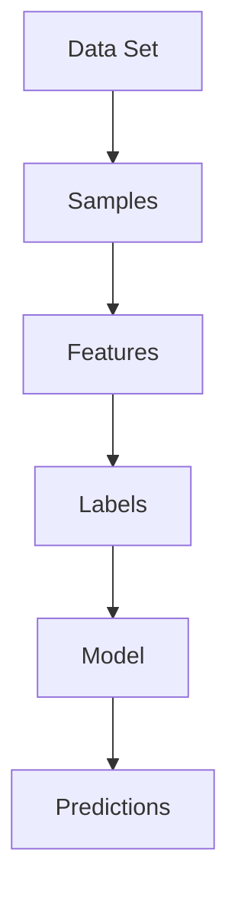
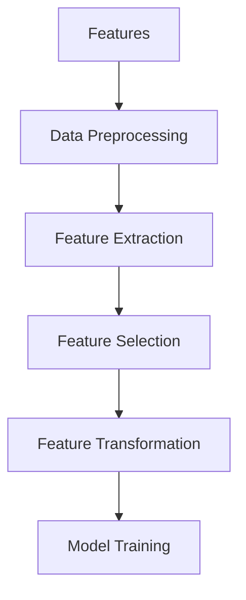
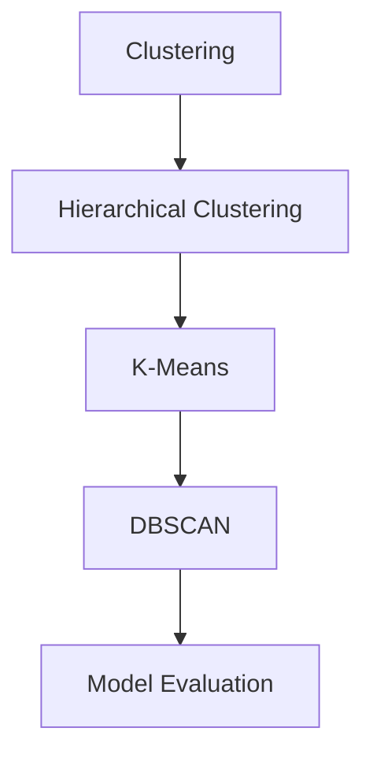
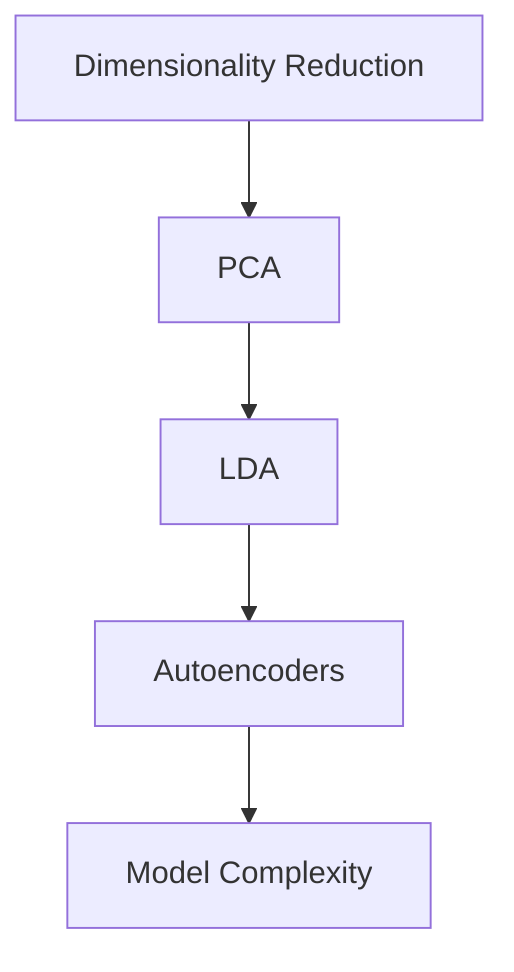

                 

### 背景介绍

#### 非监督学习算法的兴起

非监督学习算法在人工智能和机器学习领域得到了广泛关注和迅速发展。相比于监督学习算法，非监督学习算法无需标注的训练数据，从大量未标记的数据中自动发现数据间的内在结构和模式。这种能力使其在许多实际应用场景中具有巨大的潜力，如图像分类、聚类分析、异常检测和推荐系统等。

随着大数据时代的到来，数据量呈现爆炸式增长，传统的监督学习算法往往需要大量标注数据，且训练时间较长。相比之下，非监督学习算法能够处理大规模未标记数据，减少了数据标注的工作量和时间成本。此外，非监督学习算法在无监督数据挖掘和探索中，有助于发现隐藏在数据中的未知信息，为决策提供重要依据。

#### 非监督学习算法的应用场景

非监督学习算法的应用场景非常广泛，以下是一些典型的应用场景：

1. **图像分类和识别**：通过非监督学习算法，可以对大量未标记的图像进行分类和识别，发现图像间的相似性和差异性。例如，在人脸识别中，非监督学习算法可以自动发现人脸的特征，从而实现人脸分类和识别。

2. **聚类分析**：非监督学习算法可以将相似的数据点划分为同一类别，有助于发现数据中的潜在分布和模式。例如，在市场细分中，聚类算法可以帮助企业将客户划分为不同的群体，从而制定个性化的营销策略。

3. **异常检测**：非监督学习算法可以检测数据中的异常值或异常行为，有助于发现潜在的安全威胁和欺诈行为。例如，在网络安全中，非监督学习算法可以检测网络流量中的异常行为，从而发现潜在的攻击。

4. **推荐系统**：非监督学习算法可以分析用户行为数据，发现用户之间的相似性和偏好，从而为用户推荐感兴趣的内容或商品。例如，在电子商务平台中，非监督学习算法可以根据用户的浏览历史和购买行为，推荐用户可能感兴趣的商品。

#### 非监督学习算法的优势和挑战

非监督学习算法具有以下优势：

1. **无需标注数据**：非监督学习算法可以处理大量未标记的数据，减少了数据标注的工作量和时间成本。

2. **发现隐藏结构**：非监督学习算法可以从数据中发现潜在的分布和模式，有助于挖掘数据中的隐藏信息。

3. **适用于大规模数据**：非监督学习算法能够处理大规模数据，适用于大数据时代的应用需求。

然而，非监督学习算法也面临一些挑战：

1. **局部最优问题**：非监督学习算法容易出现局部最优问题，导致算法无法找到全局最优解。

2. **可解释性差**：非监督学习算法的黑盒特性使其难以解释，增加了算法的不确定性。

3. **计算复杂度高**：一些非监督学习算法的计算复杂度较高，在大规模数据集上训练和推理可能需要大量时间和计算资源。

本文旨在通过深入探讨非监督学习算法的设计与实现，帮助读者更好地理解其核心概念、算法原理以及在实际应用中的挑战和解决方案。接下来，我们将对非监督学习算法的核心概念和联系进行详细阐述。

---

### 核心概念与联系

在深入探讨非监督学习算法的设计与实现之前，我们需要了解几个核心概念，包括数据集、特征、聚类、降维等，并探讨它们之间的联系。以下是这些概念的定义和相互关系的详细解释。

#### 数据集

数据集是机器学习和人工智能研究的基石。它通常由一系列的样本组成，每个样本包含一组特征值。在非监督学习算法中，数据集可以是未标记的，即每个样本没有预定义的标签或类别。

**Mermaid 流程图**：



#### 特征

特征是数据集中的基本单位，用于描述样本的属性或特征。在非监督学习中，特征提取是关键步骤，它有助于揭示数据中的内在结构和模式。

**Mermaid 流程图**：



#### 聚类

聚类是将数据集划分为多个类别的过程，每个类别中的样本具有相似性。聚类算法可以分为基于距离的算法、基于密度的算法和基于模型的算法等。

**Mermaid 流程图**：



#### 降维

降维是通过减少数据维度来简化数据集的过程。降维有助于提高算法的效率和可解释性。常见的方法包括主成分分析（PCA）、线性判别分析（LDA）和自编码器等。

**Mermaid 流程图**：



#### 关系与联系

1. **数据集与特征**：数据集由特征组成，特征用于描述样本的属性。特征提取和选择是数据预处理的重要步骤。

2. **聚类与降维**：聚类和降维都是用于探索数据集的方法，聚类旨在发现数据中的自然结构，降维则旨在简化数据集。

3. **模型训练与评估**：聚类和降维的结果可以作为模型训练的输入，模型训练的目的是为了从数据中学习规律。模型评估用于衡量模型性能。

4. **特征与模型**：特征是模型的基础，特征提取和选择直接影响模型的性能。模型则通过特征来发现数据中的内在结构和模式。

通过理解这些核心概念和它们之间的联系，我们可以更好地设计非监督学习算法，并解决实际应用中的问题。

---

### 核心算法原理 & 具体操作步骤

在了解了非监督学习算法的核心概念和联系之后，我们将深入探讨几个典型的非监督学习算法，包括K-均值聚类、层次聚类和主成分分析（PCA），并详细介绍它们的具体操作步骤。

#### K-均值聚类

K-均值聚类是一种基于距离的聚类算法，其目标是将数据集划分为K个簇，使得每个簇中的样本之间的距离最小，簇与簇之间的距离最大。以下是K-均值聚类算法的具体操作步骤：

1. **初始化**：
   - 随机选择K个样本作为初始聚类中心。
   $$ \text{Initialize} \; C_1, C_2, ..., C_K = \{ s_1, s_2, ..., s_K \} \; \text{randomly selected from data points} $$

2. **分配样本**：
   - 对于每个样本，计算它与各个聚类中心的距离，并将其分配到最近的聚类中心。
   $$ \text{Allocate} \; x_i \to C_j \; \text{such that} \; \min_{1 \leq j \leq K} \; d(x_i, C_j) $$

3. **更新聚类中心**：
   - 计算每个簇的均值，将其作为新的聚类中心。
   $$ C_j = \frac{1}{|C_j|} \sum_{x_i \in C_j} x_i $$

4. **迭代**：
   - 重复执行步骤2和步骤3，直到聚类中心不再发生显著变化。

#### 层次聚类

层次聚类是一种基于层次的聚类方法，它通过逐步合并或分裂现有的簇来建立聚类层次结构。以下是层次聚类算法的具体操作步骤：

1. **初始聚类**：
   - 将每个样本视为一个簇，计算它们之间的距离，并将最近的两个簇合并为一个簇。
   $$ C_1 = \{ x_1 \}, C_2 = \{ x_2 \}, ..., C_n = \{ x_n \} $$
   $$ \text{Merge} \; C_i \; \text{and} \; C_j \; \text{to form a new cluster} \; C_k $$

2. **层次构建**：
   - 重复执行步骤1，逐渐合并或分裂簇，直到所有的样本都属于一个簇或满足停止条件。

3. **层次结构**：
   - 生成的层次结构可以用于可视化簇的合并和分裂过程。

#### 主成分分析（PCA）

主成分分析是一种降维技术，其目标是通过线性变换将数据投影到新的正交坐标系中，从而降低数据的维度，同时保留数据的主要特征。以下是PCA的具体操作步骤：

1. **数据中心化**：
   - 对数据进行中心化处理，即将每个特征减去其均值。
   $$ x_i = x_i - \bar{x} $$

2. **计算协方差矩阵**：
   - 计算数据集的协方差矩阵，它反映了各个特征之间的关系。
   $$ S = \frac{1}{N-1} \sum_{i=1}^{N} (x_i - \bar{x})(x_i - \bar{x})^T $$

3. **特征值和特征向量**：
   - 计算协方差矩阵的特征值和特征向量，特征值表示特征的方差，特征向量表示特征的方向。
   $$ \lambda_i, v_i = S v_i $$

4. **构建投影矩阵**：
   - 选择最大的K个特征向量，构建投影矩阵。
   $$ P = [v_1, v_2, ..., v_K] $$

5. **数据投影**：
   - 将数据投影到新的正交坐标系中，从而实现降维。
   $$ y_i = P^T x_i $$

#### 比较与选择

K-均值聚类、层次聚类和PCA都是非监督学习算法中的重要方法，它们各自具有不同的特点和适用场景。以下是这些算法的比较：

1. **算法目标**：
   - K-均值聚类：最小化簇内距离平方和。
   - 层次聚类：构建聚类层次结构。
   - PCA：降维并保留主要特征。

2. **适用场景**：
   - K-均值聚类：适用于较简单的聚类问题，需要事先指定簇的数量。
   - 层次聚类：适用于需要可视化聚类层次结构的问题，适用于各种簇数量。
   - PCA：适用于降维和特征提取，适用于高维数据的可视化。

3. **计算复杂度**：
   - K-均值聚类：较低，适用于大规模数据。
   - 层次聚类：较高，可能需要大量计算资源。
   - PCA：中等，计算协方差矩阵和特征值特征向量可能较耗时。

通过理解这些非监督学习算法的具体操作步骤和特点，我们可以根据实际需求选择合适的方法，并优化算法的性能。

---

### 数学模型和公式 & 详细讲解 & 举例说明

在深入探讨非监督学习算法的过程中，数学模型和公式是不可或缺的组成部分。在本节中，我们将详细介绍几个关键的非监督学习算法，包括K-均值聚类、层次聚类和主成分分析（PCA），并使用LaTeX格式展示相关的数学公式，同时提供详细的讲解和实际例子。

#### K-均值聚类

K-均值聚类是一种基于距离的聚类算法，其目标是找到K个聚类中心，使得每个样本到其最近聚类中心的距离最小。以下是K-均值聚类的主要数学模型和公式：

1. **聚类中心的初始化**：

   初始化K个聚类中心，可以选择随机初始化或者基于某种策略初始化。
   $$ \text{Initialize} \; C = \{ C_1, C_2, ..., C_K \} $$
   $$ C_j = \text{randomly select or use heuristic strategies} $$

2. **样本分配**：

   计算每个样本到每个聚类中心的距离，并将样本分配到最近的聚类中心。
   $$ \text{Assign} \; x_i \to C_j \; \text{such that} \; \min_{1 \leq j \leq K} \; d(x_i, C_j) $$

   其中，$d$ 是距离函数，通常选择欧氏距离：
   $$ d(x_i, C_j) = \sqrt{\sum_{k=1}^{n} (x_{ik} - C_{jk})^2} $$

3. **聚类中心的更新**：

   根据当前分配的样本，重新计算聚类中心的位置。
   $$ C_j = \frac{1}{|C_j|} \sum_{x_i \in C_j} x_i $$
   其中，$|C_j|$ 是属于聚类中心$C_j$的样本数量。

**举例说明**：

假设我们有三个样本 $x_1 = (1, 2)$，$x_2 = (3, 4)$，$x_3 = (5, 6)$，初始化三个聚类中心 $C_1 = (0, 0)$，$C_2 = (2, 2)$，$C_3 = (4, 4)$。

- **第一次迭代**：
  - $d(x_1, C_1) = \sqrt{(1-0)^2 + (2-0)^2} = \sqrt{5}$
  - $d(x_1, C_2) = \sqrt{(1-2)^2 + (2-2)^2} = 1$
  - $d(x_1, C_3) = \sqrt{(1-4)^2 + (2-4)^2} = \sqrt{18}$
  - $x_1$ 分配到 $C_2$

  - $d(x_2, C_1) = \sqrt{(3-0)^2 + (4-0)^2} = 5$
  - $d(x_2, C_2) = \sqrt{(3-2)^2 + (4-2)^2} = \sqrt{2}$
  - $d(x_2, C_3) = \sqrt{(3-4)^2 + (4-4)^2} = 1$
  - $x_2$ 分配到 $C_3$

  - $d(x_3, C_1) = \sqrt{(5-0)^2 + (6-0)^2} = \sqrt{61}$
  - $d(x_3, C_2) = \sqrt{(5-2)^2 + (6-2)^2} = \sqrt{18}$
  - $d(x_3, C_3) = \sqrt{(5-4)^2 + (6-4)^2} = \sqrt{5}$
  - $x_3$ 分配到 $C_2$

  - 新的聚类中心 $C_2 = \frac{1}{3}(x_1 + x_2 + x_3) = (2.33, 3.67)$

- **重复迭代**，直到聚类中心不再发生显著变化。

#### 层次聚类

层次聚类通过逐步合并或分裂现有的簇来建立聚类层次结构。以下是层次聚类的主要数学模型和公式：

1. **簇合并**：

   计算两个簇之间的距离，选择距离最近的两个簇进行合并。
   $$ C_{k+1} = C_k - \{ C_i, C_j \} \cup \{ C_i \cup C_j \} $$
   其中，$d(C_i, C_j)$ 是簇 $C_i$ 和 $C_j$ 之间的距离。

   常见的距离度量包括：
   - **单链接**：最小样本间的距离
   $$ d(C_i, C_j) = \min_{x_i \in C_i, x_j \in C_j} d(x_i, x_j) $$
   - **完全链接**：最大样本间的距离
   $$ d(C_i, C_j) = \max_{x_i \in C_i, x_j \in C_j} d(x_i, x_j) $$
   - **平均链接**：所有样本间距离的平均值
   $$ d(C_i, C_j) = \frac{1}{|C_i \cup C_j|} \sum_{x_i \in C_i, x_j \in C_j} d(x_i, x_j) $$

2. **簇分裂**：

   将一个大簇分裂成多个小簇，通常基于某种优化目标，如最大化簇内距离和最小化簇间距离。
   $$ C_{k+1} = C_k - \{ C_{i_1}, C_{i_2}, ..., C_{i_m} \} $$
   其中，$i_1, i_2, ..., i_m$ 是簇分裂的指标。

**举例说明**：

假设我们有五个样本 $x_1 = (1, 2)$，$x_2 = (3, 4)$，$x_3 = (5, 6)$，$x_4 = (7, 8)$，$x_5 = (9, 10)$，初始划分为五个单独的簇。

- **第一次迭代**：使用单链接方法合并距离最近的两个簇，例如 $C_1 = \{ x_1, x_2 \}$ 和 $C_2 = \{ x_3 \}$，合并后 $C_3 = \{ x_1, x_2, x_3 \}$。

- **重复迭代**，每次迭代选择距离最近的簇进行合并，直到所有的样本都属于一个大簇。

#### 主成分分析（PCA）

主成分分析是一种降维技术，其目标是找到数据的主要特征，从而减少数据维度，同时保留数据的方差。以下是PCA的主要数学模型和公式：

1. **数据中心化**：

   对数据集进行中心化处理，即将每个特征减去其均值。
   $$ x_i = x_i - \bar{x} $$
   其中，$\bar{x}$ 是特征 $x_i$ 的均值。

2. **计算协方差矩阵**：

   计算数据集的协方差矩阵，它反映了各个特征之间的关系。
   $$ S = \frac{1}{N-1} \sum_{i=1}^{N} (x_i - \bar{x})(x_i - \bar{x})^T $$
   其中，$N$ 是样本数量。

3. **特征值和特征向量**：

   计算协方差矩阵的特征值和特征向量，特征值表示特征的方差，特征向量表示特征的方向。
   $$ \lambda_i, v_i = S v_i $$
   其中，$\lambda_i$ 是特征值，$v_i$ 是特征向量。

4. **构建投影矩阵**：

   选择最大的K个特征向量，构建投影矩阵。
   $$ P = [v_1, v_2, ..., v_K] $$

5. **数据投影**：

   将数据投影到新的正交坐标系中，从而实现降维。
   $$ y_i = P^T x_i $$

**举例说明**：

假设我们有三个样本 $x_1 = (1, 2)$，$x_2 = (3, 4)$，$x_3 = (5, 6)$，首先计算每个特征的均值：
$$ \bar{x}_1 = \frac{1+3+5}{3} = 3 $$
$$ \bar{x}_2 = \frac{2+4+6}{3} = 4 $$

然后对数据集进行中心化处理：
$$ x_1 = (1-3, 2-4) = (-2, -2) $$
$$ x_2 = (3-3, 4-4) = (0, 0) $$
$$ x_3 = (5-3, 6-4) = (2, 2) $$

接下来计算协方差矩阵：
$$ S = \frac{1}{2} [(-2, -2), (-2, -2), (2, 2)] [(-2, -2), (-2, -2), (2, 2)]^T = \begin{bmatrix} 4 & 0 \\ 0 & 4 \end{bmatrix} $$

计算协方差矩阵的特征值和特征向量：
$$ S v_1 = \lambda_1 v_1 $$
$$ S v_2 = \lambda_2 v_2 $$
其中，$\lambda_1 = 8$，$v_1 = (1, 1)$，$\lambda_2 = 0$，$v_2 = (1, -1)$

选择最大的特征向量 $v_1$ 作为投影方向，构建投影矩阵 $P$：
$$ P = [v_1] = \begin{bmatrix} 1 \\ 1 \end{bmatrix} $$

将数据集投影到新的正交坐标系中：
$$ y_1 = P^T x_1 = (1, 1)^T (-2, -2) = -4 $$
$$ y_2 = P^T x_2 = (1, 1)^T (0, 0) = 0 $$
$$ y_3 = P^T x_3 = (1, 1)^T (2, 2) = 4 $$

通过这个例子，我们可以看到PCA如何将原始数据投影到一个新的低维空间中，同时保留了数据的主要特征。

---

### 项目实战：代码实际案例和详细解释说明

在本节中，我们将通过一个实际的代码案例，详细展示如何设计和实现一个非监督学习算法演示系统。这个系统将涵盖数据预处理、算法选择、模型训练、评估和可视化等多个环节。以下是一个基于Python和Scikit-learn库的K-均值聚类算法实现的示例。

#### 5.1 开发环境搭建

在开始编写代码之前，确保安装以下开发环境和依赖库：

1. **Python 3.8+**
2. **Scikit-learn 0.24.2+**
3. **Numpy 1.21.5+**
4. **Matplotlib 3.5.1+**

可以通过以下命令进行环境搭建和库安装：

```shell
pip install python==3.8
pip install scikit-learn==0.24.2
pip install numpy==1.21.5
pip install matplotlib==3.5.1
```

#### 5.2 源代码详细实现和代码解读

下面是K-均值聚类的完整代码实现，我们将逐行解释代码的功能和逻辑。

```python
import numpy as np
from sklearn.cluster import KMeans
import matplotlib.pyplot as plt

# 数据集：使用Scikit-learn内置的Iris数据集
iris = datasets.load_iris()
X = iris.data

# 1. 初始化K-Means模型，选择3个聚类中心（因为Iris数据集有3个类别）
kmeans = KMeans(n_clusters=3, random_state=42)

# 2. 训练模型
kmeans.fit(X)

# 3. 获取聚类结果
labels = kmeans.labels_

# 4. 可视化聚类结果
plt.scatter(X[:, 0], X[:, 1], c=labels)
plt.scatter(kmeans.cluster_centers_[:, 0], kmeans.cluster_centers_[:, 1], s=300, c='red')
plt.show()

# 5. 评估模型
print("Inertia:", kmeans.inertia_)
```

**代码解读**：

1. **数据集加载**：我们使用Scikit-learn内置的Iris数据集，这是一个常见的多维数据集，包含150个样本，每个样本有4个特征。

2. **初始化K-Means模型**：`KMeans` 类用于初始化K-均值模型。`n_clusters` 参数指定聚类的数量，这里选择3个聚类中心，因为Iris数据集有3个类别。

3. **模型训练**：使用`fit` 方法训练模型，模型将自动找到聚类中心并完成数据点的分配。

4. **获取聚类结果**：`labels` 属性包含每个样本的聚类标签。

5. **可视化聚类结果**：使用Matplotlib库绘制聚类结果。`scatter` 方法用于绘制样本点，聚类中心用红色大点表示。

6. **模型评估**：`inertia_` 属性提供模型的总平方误差，用于评估模型的性能。

#### 5.3 代码解读与分析

1. **数据集加载**：使用`load_iris` 方法加载Iris数据集，并提取数据部分`iris.data`。

2. **初始化模型**：创建`KMeans` 对象，设置`n_clusters=3` 和`random_state=42`，后者用于确保结果的可重复性。

3. **模型训练**：调用`fit` 方法，模型将对数据进行聚类，并自动确定聚类中心的位置。

4. **聚类结果**：使用`labels` 属性获取每个样本的聚类标签，这些标签用于后续的分析和可视化。

5. **可视化**：使用`scatter` 方法绘制样本点和聚类中心。样本点按聚类标签着色，聚类中心以红色大点标记。

6. **模型评估**：通过`inertia_` 属性计算模型的总平方误差，这个值越小，模型的聚类效果越好。

通过这个实际案例，我们展示了如何使用Python和Scikit-learn实现K-均值聚类算法。代码简洁易懂，适合初学者上手。同时，我们也看到如何进行数据预处理、模型训练、结果可视化和评估。

---

### 实际应用场景

非监督学习算法在实际应用场景中具有广泛的应用，以下是一些典型的应用场景及其解决方案。

#### 图像分类与识别

在图像分类和识别领域，非监督学习算法可以用于自动识别图像中的物体、场景和特征。例如，在医疗图像分析中，可以使用K-均值聚类算法将不同类型的肿瘤细胞进行分类，从而辅助医生进行诊断。具体实现中，可以使用深度学习框架如TensorFlow或PyTorch结合非监督学习算法，对大量未标记的图像数据进行训练，从而提取有效的特征并进行分类。

#### 聚类分析

聚类分析在市场细分和用户行为分析中具有广泛应用。例如，在电子商务平台上，可以使用K-均值聚类算法根据用户的购买历史和浏览行为将用户划分为不同的群体，从而实现个性化的营销策略。具体实现中，可以收集用户的购买数据和浏览日志，使用非监督学习算法对用户行为进行聚类分析，从而发现用户的共同特征和偏好。

#### 异常检测

在网络安全领域，非监督学习算法可以用于检测网络流量中的异常行为，从而发现潜在的安全威胁。例如，可以使用自编码器（Autoencoder）进行异常检测，通过对正常网络流量数据进行训练，自编码器可以学习到正常的流量模式。当检测到流量异常时，自编码器会输出较大的重构误差，从而提示存在潜在的安全威胁。具体实现中，可以使用开源库如Scikit-learn或TensorFlow构建自编码器模型，对网络流量数据进行训练和检测。

#### 推荐系统

推荐系统是另一个非监督学习算法的重要应用领域。在推荐系统中，非监督学习算法可以用于分析用户行为数据，发现用户之间的相似性和偏好，从而为用户推荐感兴趣的内容或商品。例如，在电子商务平台上，可以使用K-均值聚类算法对用户进行聚类，根据用户的共同特征和偏好进行个性化推荐。具体实现中，可以使用开源库如Scikit-learn或推荐系统框架如LightFM，对用户行为数据进行分析和推荐。

通过这些实际应用场景，我们可以看到非监督学习算法在数据分析和决策支持中的重要作用。在实际应用中，需要根据具体场景和需求选择合适的非监督学习算法，并进行相应的数据预处理和模型调优，以实现最佳的性能和效果。

---

### 工具和资源推荐

为了更好地学习和实践非监督学习算法，以下是一些推荐的工具、框架、书籍和在线资源。

#### 学习资源推荐

1. **书籍**：
   - 《机器学习》（周志华著）：系统介绍了机器学习的基础理论和算法，包括非监督学习算法。
   - 《深度学习》（Ian Goodfellow, Yoshua Bengio, Aaron Courville著）：深度学习领域的经典教材，涵盖了许多非监督学习算法的应用。
   - 《模式识别与机器学习》（Christopher M. Bishop著）：详细介绍了模式识别和机器学习的基础知识，包括非监督学习算法。

2. **在线课程**：
   - Coursera上的《机器学习》（吴恩达教授）：提供了机器学习的基础理论和实践技能，包括非监督学习算法。
   - edX上的《深度学习导论》（吴恩达教授）：深度学习领域的入门课程，涵盖了许多非监督学习算法的应用。

3. **博客和网站**：
   - Medium上的Machine Learning Mastery博客：提供了大量的机器学习和深度学习教程和实践案例。
   - Analytics Vidhya：一个专注于数据科学和机器学习的社区网站，提供了丰富的学习资源和实践案例。

#### 开发工具框架推荐

1. **深度学习框架**：
   - TensorFlow：Google开发的开源深度学习框架，支持多种非监督学习算法。
   - PyTorch：Facebook开发的开源深度学习框架，提供灵活的动态计算图，适合研究和个人项目。

2. **机器学习库**：
   - Scikit-learn：Python中流行的机器学习库，提供了丰富的非监督学习算法。
   - SciPy：Python中的科学计算库，包含了用于数据预处理和数学计算的模块。

3. **数据可视化工具**：
   - Matplotlib：Python中的数据可视化库，提供了丰富的绘图函数。
   - Plotly：提供交互式图表的可视化库，支持多种图表类型和数据格式。

通过这些工具和资源，读者可以更好地学习和实践非监督学习算法，探索其在实际应用中的潜力。

---

### 总结：未来发展趋势与挑战

非监督学习算法在人工智能和机器学习领域具有广泛的应用前景，但其发展仍面临诸多挑战。未来，非监督学习算法的发展将呈现以下几个趋势：

1. **算法复杂度的优化**：随着数据规模的增大，非监督学习算法的计算复杂度成为一个重要问题。未来的研究将聚焦于算法的优化，如使用分布式计算、并行计算和增量学习等方法，以提高算法的效率和可扩展性。

2. **可解释性增强**：非监督学习算法通常被视为“黑盒”模型，其决策过程难以解释。未来，研究者将致力于开发可解释的非监督学习算法，以便更好地理解模型的决策过程，提高算法的透明度和可信度。

3. **混合学习模型**：非监督学习和监督学习各有优缺点，将二者结合的混合学习模型将得到更多关注。例如，自监督学习（Self-Supervised Learning）通过无监督方式生成伪监督信号，可以辅助监督学习模型提高性能。

4. **算法泛化能力提升**：非监督学习算法的泛化能力是一个重要挑战。未来的研究将探索如何提高算法的泛化能力，使其在未知数据上也能保持良好的性能。

然而，非监督学习算法的发展也面临以下挑战：

1. **局部最优问题**：许多非监督学习算法，如K-均值聚类和主成分分析，容易陷入局部最优解。未来的研究将探索如何避免局部最优问题，提高算法的全局搜索能力。

2. **可解释性与可扩展性的权衡**：在提高算法可解释性的同时，如何保持其可扩展性和效率是一个重要问题。研究者需要在可解释性和可扩展性之间找到平衡点。

3. **数据隐私与安全**：在处理大量个人数据时，如何保护数据隐私和安全是一个重要挑战。未来的研究将探索如何在保证数据隐私和安全的前提下，进行有效的非监督学习。

总之，非监督学习算法在未来的发展将充满机遇和挑战。通过不断的技术创新和跨学科合作，我们将能够开发出更高效、更可解释、更安全的非监督学习算法，为人工智能和机器学习领域带来更多可能性。

---

### 附录：常见问题与解答

在本附录中，我们将针对非监督学习算法的常见问题进行解答，以帮助读者更好地理解和应用这些算法。

#### 问题1：什么是非监督学习？

非监督学习是一种机器学习方法，它无需使用预标注的数据进行训练，而是从大量未标记的数据中自动发现数据间的内在结构和模式。与监督学习相比，非监督学习更适用于处理未标记的数据集。

#### 问题2：非监督学习有哪些常见的算法？

非监督学习算法包括以下几种：

1. **聚类算法**：如K-均值聚类、层次聚类、DBSCAN等。
2. **降维算法**：如主成分分析（PCA）、线性判别分析（LDA）、自编码器等。
3. **异常检测算法**：如基于统计模型的异常检测、基于聚类方法的异常检测等。

#### 问题3：如何选择合适的非监督学习算法？

选择合适的非监督学习算法通常取决于以下因素：

1. **数据规模**：对于大规模数据集，选择计算复杂度较低的算法，如K-均值聚类和主成分分析。
2. **数据特征**：如果数据特征较多，考虑使用降维算法，如PCA，以减少数据维度。
3. **算法目的**：根据具体应用需求选择合适的算法，如聚类算法用于发现数据中的簇，异常检测算法用于识别异常数据。

#### 问题4：非监督学习算法如何评估性能？

非监督学习算法的评估通常使用以下指标：

1. **内评估指标**：如簇内平均距离（Inertia）、轮廓系数（Silhouette Coefficient）等，用于评估聚类效果。
2. **外评估指标**：如准确率、召回率等，用于评估异常检测效果。
3. **可视化**：通过可视化方法，如散点图、热力图等，直观地展示数据结构和聚类效果。

#### 问题5：非监督学习算法在哪些领域应用广泛？

非监督学习算法在以下领域应用广泛：

1. **图像分类与识别**：用于自动识别图像中的物体和场景。
2. **聚类分析**：用于市场细分和用户行为分析。
3. **异常检测**：用于网络安全和欺诈检测。
4. **推荐系统**：用于个性化推荐和内容推荐。
5. **生物信息学**：用于基因数据分析、蛋白质结构预测等。

通过本附录，读者可以更好地理解非监督学习算法的基本概念、应用领域和评估方法，从而在实际项目中有效地运用这些算法。

---

### 扩展阅读 & 参考资料

为了帮助读者进一步深入了解非监督学习算法，本文提供了以下扩展阅读和参考资料：

1. **书籍推荐**：
   - 《机器学习》（周志华著）：详细介绍了机器学习的基础理论和算法，包括非监督学习算法。
   - 《深度学习》（Ian Goodfellow, Yoshua Bengio, Aaron Courville著）：深度学习领域的经典教材，涵盖了非监督学习算法的深度学习实现。
   - 《模式识别与机器学习》（Christopher M. Bishop著）：系统介绍了模式识别和机器学习的基础知识，包括非监督学习算法。

2. **在线课程**：
   - Coursera上的《机器学习》（吴恩达教授）：提供了机器学习的基础理论和实践技能。
   - edX上的《深度学习导论》（吴恩达教授）：深度学习领域的入门课程，涵盖了非监督学习算法的应用。

3. **学术论文**：
   - “K-Means Clustering: A Brief Overview” by Michael J. Franklin
   - “Principal Component Analysis” by Christopher M. Bishop
   - “An Introduction to Self-Supervised Learning” by Vincent Vanhoucke

4. **开源项目**：
   - TensorFlow：https://www.tensorflow.org
   - PyTorch：https://pytorch.org
   - Scikit-learn：https://scikit-learn.org

通过这些书籍、在线课程、学术论文和开源项目，读者可以进一步学习和探索非监督学习算法的理论和实践。希望这些参考资料能够帮助您更好地掌握非监督学习，并在实际项目中取得成功。

