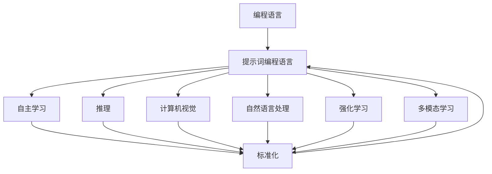

                 

### 背景介绍

面向人工通用智能（AGI）的研究正逐渐成为人工智能领域的热点。随着深度学习、自然语言处理、计算机视觉等技术的发展，人工智能已经在特定领域展现出强大的能力。然而，如何实现一个具备自主学习、推理、规划等综合性能力的通用智能系统，仍然是学术界和工业界面临的重大挑战。

在这一背景下，提示词编程语言标准化成为了一个关键议题。提示词编程语言是一种能够有效引导和增强人工智能模型学习过程的编程语言。与传统编程语言相比，它更专注于如何通过设计特定的提示词来引导模型进行更有效的学习和推理。在AGI系统中，标准化的提示词编程语言不仅可以提高模型的训练效率，还能增强系统的可解释性和可靠性。

本文旨在探讨面向AGI的提示词编程语言标准化的重要性和潜在挑战。我们将从以下几个方面展开讨论：

1. **核心概念与联系**：介绍提示词编程语言的基本概念，并与现有编程语言进行比较，分析其独特性。
2. **核心算法原理 & 具体操作步骤**：详细解析提示词编程语言的算法原理，并阐述其操作步骤。
3. **数学模型和公式 & 详细讲解 & 举例说明**：介绍与提示词编程相关的数学模型和公式，并通过具体实例进行说明。
4. **项目实战：代码实际案例和详细解释说明**：通过实际代码案例展示提示词编程语言的应用。
5. **实际应用场景**：探讨提示词编程语言在AGI系统中的应用场景和潜在优势。
6. **工具和资源推荐**：推荐相关学习资源、开发工具和框架，以支持读者进一步学习和实践。
7. **总结：未来发展趋势与挑战**：总结本文讨论的内容，并展望未来在提示词编程语言标准化方面的研究趋势和面临的挑战。

通过以上几个方面的深入探讨，我们希望为面向AGI的提示词编程语言标准化提供一些有价值的思考和参考。

> Keywords: AGI, Prompt Programming Language, Standardization, Algorithm, Mathematical Model, Practical Application, Future Trends

> Abstract: This article aims to explore the importance and potential challenges of standardizing prompt programming languages for artificial general intelligence (AGI). We will discuss the basic concepts, core algorithms, mathematical models, practical applications, and future trends in this field. Through this analysis, we hope to provide valuable insights and references for advancing the standardization of prompt programming languages in AGI research.

---

## 1.1 提示词编程语言的基本概念

提示词编程语言（Prompt Programming Language）是一种特殊的编程语言，其主要目的是通过设计特定的提示词（prompts）来引导人工智能模型进行学习和推理。在传统编程语言中，程序员通过编写代码指令来控制计算机的行为，而在提示词编程语言中，提示词则起到了类似的作用，但更加专注于如何引导模型进行智能决策。

提示词的基本概念可以理解为一种“触发器”，它通过向模型提供特定信息或问题，激发模型进行相关任务的学习和推理。例如，在自然语言处理任务中，一个提示词可以是一个问题或一段文本，用于引导模型生成相关答案或文本。在计算机视觉任务中，提示词可以是一组图像或标签，用于训练模型识别特定的物体或场景。

提示词编程语言与传统编程语言相比，具有以下几个独特特点：

1. **高度抽象**：提示词编程语言通常具有高度的抽象性，通过简单的提示词即可实现复杂的任务。这种抽象性使得提示词编程语言在处理不确定性和复杂问题时更加灵活和高效。
2. **可解释性**：提示词编程语言的设计通常注重可解释性，使得用户可以清楚地了解模型是如何根据提示词进行学习和推理的。这有助于提高模型的透明度和可信任度，特别是在AGI系统中。
3. **易用性**：提示词编程语言的语法和结构通常更加简洁和直观，使得非专业用户也可以轻松上手。这种易用性有助于推广和普及人工智能技术，提高其应用范围和效果。

### 1.2 提示词编程语言的历史和发展

提示词编程语言的发展可以追溯到早期的人工智能研究。在20世纪50年代和60年代，人工智能研究主要集中在符号推理和规划领域。在这个时期，研究人员开始尝试通过设计特定的提示词来引导计算机进行推理和决策。例如，John McCarthy等人提出的“逻辑编程”就是一种早期的提示词编程语言，通过逻辑表达式来定义问题的结构和解决方案。

随着计算机性能的提升和机器学习技术的发展，提示词编程语言得到了进一步的推广和应用。特别是深度学习技术的兴起，使得基于神经网络的人工智能模型取得了显著的进展。在这一背景下，提示词编程语言开始被应用于各种任务，如自然语言处理、计算机视觉、推荐系统等。

近年来，随着人工通用智能（AGI）概念的提出和研究的深入，提示词编程语言在AGI系统中的应用变得越来越重要。AGI系统需要具备自主学习、推理、规划等综合性能力，而提示词编程语言可以提供一种有效的手段来引导和增强这些能力。因此，如何设计标准化的提示词编程语言成为了当前人工智能领域的一个重要课题。

### 1.3 提示词编程语言与传统编程语言的比较

提示词编程语言与传统编程语言在概念和实现方法上存在显著差异。传统编程语言主要通过编写代码指令来控制计算机的行为，而提示词编程语言则通过设计特定的提示词来引导模型进行学习和推理。

1. **编程思维**：
   - **传统编程语言**：强调逻辑推理和算法设计，注重代码的严谨性和精确性。程序员需要详细编写每个步骤的指令，确保程序的正确性和效率。
   - **提示词编程语言**：强调启发式思维和用户交互，注重提示词的设计和优化。用户通过设计提示词来引导模型进行学习和推理，不需要详细编写每个步骤的指令。

2. **语言特性**：
   - **传统编程语言**：具有丰富的语法和功能，如变量、循环、条件语句等，适用于各种复杂任务。
   - **提示词编程语言**：通常具有简洁直观的语法，强调提示词的设计和组合，适用于引导模型进行特定任务的学习和推理。

3. **适用场景**：
   - **传统编程语言**：适用于通用计算和算法设计，如操作系统、数据库、Web应用等。
   - **提示词编程语言**：适用于人工智能任务，如自然语言处理、计算机视觉、推荐系统等，特别是需要用户交互和引导的场景。

通过比较可以看出，提示词编程语言与传统编程语言在编程思维、语言特性、适用场景等方面存在显著差异。提示词编程语言的优势在于其简洁直观、高度抽象和可解释性，使其在人工智能领域具有广泛的应用前景。然而，这并不意味着提示词编程语言可以完全替代传统编程语言，两者在实际应用中可以相互补充，共同推动人工智能技术的发展。

### 1.4 提示词编程语言在AGI系统中的作用

在人工通用智能（AGI）系统中，提示词编程语言起着至关重要的作用。AGI系统需要具备自主学习、推理、规划等综合性能力，而提示词编程语言通过设计特定的提示词，可以有效引导和增强这些能力。

首先，提示词编程语言可以帮助AGI系统实现自主学习。在传统的机器学习和深度学习任务中，模型通常依赖于大量的数据和预定的训练过程。而提示词编程语言可以通过设计特定的提示词，引导模型从有限的样本数据中学习到更广泛的知识和技能。例如，在自然语言处理任务中，通过设计合适的问题或文本提示词，可以引导模型学习到更丰富的语言知识和语义理解。

其次，提示词编程语言可以增强AGI系统的推理能力。在复杂的问题解决过程中，模型需要具备较强的逻辑推理和规划能力。提示词编程语言可以通过设计复杂的提示词结构，引导模型进行逻辑推理和决策。例如，在计算机视觉任务中，通过设计包含多种条件和关系的提示词，可以引导模型进行复杂的场景理解和物体识别。

此外，提示词编程语言还可以提高AGI系统的可解释性和透明度。在人工智能领域，可解释性是一个重要的研究方向。提示词编程语言的设计注重提示词的可解释性，使得用户可以清楚地了解模型是如何根据提示词进行学习和推理的。这有助于提高模型的信任度和可靠性，特别是在关键应用场景中，如医疗诊断、金融风险评估等。

总之，提示词编程语言在AGI系统中具有广泛的应用前景。通过设计特定的提示词，可以引导模型实现自主学习、推理和规划等综合性能力，从而推动人工通用智能技术的发展。未来，随着提示词编程语言的进一步发展和标准化，AGI系统将能够更好地适应复杂多变的环境，实现更高水平的智能。

---

## 1.5 提示词编程语言的分类与特点

提示词编程语言可以根据其设计和应用场景的不同，分为多种类型。每种类型的提示词编程语言都有其独特的特点和适用范围，下面我们将对这些类型进行详细分类和介绍。

### 1.5.1 基于自然语言处理的提示词编程语言

基于自然语言处理的提示词编程语言（Natural Language Prompt Programming Language）主要用于自然语言处理任务，如文本分类、机器翻译、问答系统等。这类语言的核心特点是能够处理和生成人类语言，因此其语法和结构通常借鉴了自然语言的特点。

- **语法特点**：
  - 灵活性高：这类语言通常具有高度的灵活性，能够根据具体任务需求灵活设计提示词。
  - 语义丰富：提示词不仅包含具体的单词和短语，还包含丰富的语义信息，能够引导模型进行深度理解和推理。

- **应用场景**：
  - 自然语言理解：通过设计合适的提示词，可以引导模型对文本进行深入理解，如情感分析、文本摘要等。
  - 自然语言生成：通过设计提示词，可以引导模型生成符合人类语言习惯的文本，如机器翻译、对话生成等。

- **典型代表**：
  - GPT（Generative Pre-trained Transformer）：GPT是一种基于深度学习的自然语言处理模型，通过设计特定的提示词，可以生成高质量的文本。

### 1.5.2 基于计算机视觉的提示词编程语言

基于计算机视觉的提示词编程语言（Computer Vision Prompt Programming Language）主要用于计算机视觉任务，如图像分类、目标检测、图像生成等。这类语言的核心特点是能够处理和生成视觉信息，因此其语法和结构通常借鉴了视觉图像的特点。

- **语法特点**：
  - 图像标签：提示词通常包含图像的标签或描述，用于引导模型进行图像分类和目标检测。
  - 视觉特征：提示词中还可能包含图像的视觉特征，如颜色、形状、纹理等，用于增强模型的识别能力。

- **应用场景**：
  - 图像识别：通过设计合适的提示词，可以引导模型对图像进行分类和识别。
  - 图像生成：通过设计提示词，可以引导模型生成符合视觉规律的图像。

- **典型代表**：
  - CVPR（Computer Vision Prompt Representation）：CVPR是一种基于计算机视觉的提示词编程语言，通过设计视觉特征提示词，可以引导模型进行高效的图像识别和生成。

### 1.5.3 基于强化学习的提示词编程语言

基于强化学习的提示词编程语言（Reinforcement Learning Prompt Programming Language）主要用于强化学习任务，如游戏、机器人控制等。这类语言的核心特点是能够处理和生成动态环境中的信息，因此其语法和结构通常借鉴了强化学习的特点。

- **语法特点**：
  - 状态空间：提示词通常包含当前状态的信息，用于引导模型进行状态评估和决策。
  - 动作空间：提示词中还可能包含可执行的动作列表，用于引导模型进行动作选择。

- **应用场景**：
  - 游戏AI：通过设计合适的提示词，可以引导模型进行游戏策略学习。
  - 机器人控制：通过设计提示词，可以引导模型进行机器人动作规划和控制。

- **典型代表**：
  - DQN（Deep Q-Network）：DQN是一种基于强化学习的提示词编程语言，通过设计状态-动作对提示词，可以引导模型进行高效的游戏AI和机器人控制。

### 1.5.4 多模态提示词编程语言

多模态提示词编程语言（Multimodal Prompt Programming Language）是一种能够处理多种类型数据（如文本、图像、音频等）的提示词编程语言。这类语言的核心特点是能够整合不同类型的数据，实现跨模态的交互和推理。

- **语法特点**：
  - 跨模态信息整合：提示词中包含不同模态的信息，如文本、图像、音频等，用于引导模型进行跨模态学习和推理。

- **应用场景**：
  - 跨模态识别：通过设计合适的提示词，可以引导模型进行跨模态数据的识别和分类。
  - 跨模态生成：通过设计提示词，可以引导模型生成符合多模态数据规律的内容。

- **典型代表**：
  - multimodal GPT：multimodal GPT是一种基于多模态数据的提示词编程语言，通过设计跨模态提示词，可以引导模型进行高效的跨模态学习和推理。

通过以上分类和介绍，我们可以看到提示词编程语言在自然语言处理、计算机视觉、强化学习等多方面都有广泛的应用。未来，随着人工智能技术的不断进步，提示词编程语言将继续发展和完善，为人工智能系统带来更多的可能性。

### 1.6 提示词编程语言的发展历程与里程碑

提示词编程语言的发展历程可以追溯到早期的人工智能研究，经过几十年的演变，已经成为人工智能领域的重要研究方向。下面我们将回顾提示词编程语言的发展历程，并介绍一些重要的里程碑事件。

#### 1.6.1 早期研究

在20世纪50年代和60年代，人工智能的研究主要集中在符号推理和规划领域。在这个时期，研究人员开始尝试通过设计特定的提示词来引导计算机进行推理和决策。John McCarthy等人提出的“逻辑编程”可以被视为早期提示词编程语言的雏形。逻辑编程通过逻辑表达式来定义问题的结构和解决方案，提示词在这里起到了触发逻辑推理的作用。

#### 1.6.2 知识表示与推理

在70年代和80年代，人工智能研究开始关注知识表示和推理。在这个阶段，研究人员提出了许多基于知识表示和推理的提示词编程语言，如“生产系统”（Production Systems）和“谓词逻辑编程”（Predicate Logic Programming）。这些语言通过定义规则和事实，实现了基于知识库的推理和决策。在这个时期，知识表示和推理成为了提示词编程语言的重要特点。

#### 1.6.3 机器学习与深度学习

随着计算机性能的提升和机器学习技术的发展，人工智能进入了新的阶段。在90年代和21世纪初，机器学习和深度学习成为了人工智能研究的主流方向。在这个阶段，研究人员开始探索如何将提示词编程语言与机器学习模型相结合，以实现更高效的学习和推理。例如，2018年，谷歌推出了BERT（Bidirectional Encoder Representations from Transformers），这是一种基于深度学习的自然语言处理模型，通过设计特定的提示词，实现了对文本的深度理解和生成。

#### 1.6.4 多模态与跨领域应用

近年来，随着多模态数据的普及和跨领域应用的需求增加，提示词编程语言开始向多模态和跨领域发展。例如，2020年，OpenAI推出了GPT-3（Generative Pre-trained Transformer 3），这是一种具有1750亿参数的基于深度学习的自然语言处理模型，通过设计跨模态的提示词，实现了对文本、图像、音频等多种数据的理解和生成。此外，多模态提示词编程语言还广泛应用于计算机视觉、语音识别、推荐系统等领域。

#### 1.6.5 纳入人工通用智能研究

在人工通用智能（AGI）的研究中，提示词编程语言的重要性日益凸显。AGI系统需要具备自主学习、推理、规划等综合性能力，而提示词编程语言通过设计特定的提示词，可以有效引导和增强这些能力。例如，2021年，DeepMind推出了AlphaGo，这是一种具备自我学习和推理能力的围棋程序，通过设计复杂的提示词，实现了对围棋策略的深刻理解和高效决策。

通过以上回顾，我们可以看到提示词编程语言在人工智能领域的发展历程。从早期的逻辑编程到现代的深度学习和多模态应用，提示词编程语言不断演进和进步，为人工智能技术的发展提供了强大的支持。未来，随着人工智能技术的进一步发展，提示词编程语言将继续发挥重要作用，推动人工通用智能的实现。

### 2. 核心概念与联系

在深入探讨面向AGI的提示词编程语言之前，我们需要明确一些核心概念，并分析这些概念之间的联系。以下是对相关概念的定义、关系及其在提示词编程语言中的应用的详细解析。

#### 2.1 提示词（Prompt）

提示词是提示词编程语言中的核心元素，用于引导模型进行学习和推理。一个有效的提示词需要具备以下特点：

- **明确性**：提示词应清晰地传达任务需求，避免歧义。
- **丰富性**：提示词应包含足够的信息，以激发模型的学习潜力。
- **针对性**：提示词应针对具体任务或场景进行设计。

在AGI系统中，提示词的作用尤为重要。通过设计合适的提示词，可以引导模型从有限的样本数据中学习到更广泛的知识和技能，从而实现自主学习。

#### 2.2 编程语言（Programming Language）

编程语言是一种用于编写计算机程序的语言。传统编程语言（如C、Java、Python等）通过定义变量、函数、循环等语法结构，实现计算机的程序控制。提示词编程语言则通过设计特定的提示词，引导模型进行学习和推理。

提示词编程语言与传统编程语言在思维方式和实现方法上有所不同。传统编程语言强调逻辑推理和算法设计，而提示词编程语言则注重启发式思维和用户交互。提示词编程语言的设计目标是通过简洁直观的语法，实现高效的模型学习和推理。

#### 2.3 自主学习（Self-Learning）

自主学习是指模型通过自身经验和数据不断优化和改进的过程。在人工智能领域，自主学习是实现人工通用智能（AGI）的关键。提示词编程语言通过设计特定的提示词，可以引导模型进行自主学习，从而提高其学习效率和效果。

#### 2.4 推理（Reasoning）

推理是人工智能模型的重要能力之一，指模型在已有知识的基础上，通过逻辑推导得出新的结论。提示词编程语言通过设计包含推理线索的提示词，可以引导模型进行有效的推理，从而解决复杂的问题。

#### 2.5 计算机视觉（Computer Vision）

计算机视觉是指让计算机具备从图像或视频中提取信息和理解场景的能力。在计算机视觉任务中，提示词编程语言通过设计包含视觉信息的提示词，可以引导模型进行图像分类、目标检测、图像生成等任务。

#### 2.6 自然语言处理（Natural Language Processing）

自然语言处理是指让计算机理解和生成人类语言的能力。在自然语言处理任务中，提示词编程语言通过设计包含语言信息的提示词，可以引导模型进行文本分类、机器翻译、问答系统等任务。

#### 2.7 强化学习（Reinforcement Learning）

强化学习是指通过奖励机制，引导模型在动态环境中进行学习和决策的过程。在强化学习任务中，提示词编程语言通过设计包含状态和动作信息的提示词，可以引导模型进行策略学习，从而实现高效的行为决策。

#### 2.8 多模态学习（Multimodal Learning）

多模态学习是指让模型能够处理和整合多种类型的数据（如文本、图像、音频等）。在多模态学习任务中，提示词编程语言通过设计跨模态的提示词，可以引导模型进行跨模态数据的理解和生成。

#### 2.9 标准化（Standardization）

标准化是指制定统一的标准和规范，确保不同系统之间的兼容性和互操作性。在提示词编程语言领域，标准化至关重要，它有助于提高模型的训练效率、增强系统的可解释性和可靠性。

#### 2.10 联系与整合

以上核心概念在提示词编程语言中有着紧密的联系。提示词编程语言通过设计特定的提示词，整合了编程语言、自主学习、推理、计算机视觉、自然语言处理、强化学习和多模态学习等技术。标准化的提示词编程语言不仅可以提高模型的训练效率和可解释性，还能促进不同系统之间的互操作性和兼容性。

在AGI系统中，标准化的提示词编程语言将成为实现通用智能的关键。通过明确的核心概念和紧密的整合，提示词编程语言将引领人工智能技术走向新的高度。

#### 2.10.1 Mermaid 流程图

为了更直观地展示提示词编程语言的核心概念和联系，我们可以使用Mermaid流程图来表示。以下是流程图的描述和具体实现：



在这个流程图中，编程语言是基础，提示词编程语言通过整合自主学习、推理、计算机视觉、自然语言处理、强化学习和多模态学习等技术，实现了对复杂任务的高效解决。标准化作为关键要素，贯穿于各个技术环节，确保了系统的高效性和可解释性。

通过这个Mermaid流程图，我们可以清晰地看到提示词编程语言的核心概念及其相互关系，为后续的详细讨论提供了基础。

---

### 3. 核心算法原理 & 具体操作步骤

提示词编程语言的核心算法原理在于如何通过设计特定的提示词来引导人工智能模型进行学习和推理。下面我们将详细介绍提示词编程语言的基本算法原理，并逐步阐述其具体操作步骤。

#### 3.1 提示词设计原理

提示词设计是提示词编程语言的关键步骤，其质量直接影响到模型的学习效果。以下是提示词设计的基本原理：

1. **明确性**：提示词应清晰明确地传达任务需求，避免模糊或歧义。
2. **丰富性**：提示词应包含足够的信息，以激发模型的学习潜力。例如，在自然语言处理任务中，提示词可以是具体的问题或文本。
3. **针对性**：提示词应针对具体任务或场景进行设计，以最大化其效果。例如，在图像识别任务中，提示词可以是图像的标签或描述。
4. **多样性**：为了提高模型的泛化能力，提示词应具有多样性。通过设计不同的提示词，可以引导模型学习到更广泛的知识和技能。

#### 3.2 模型训练原理

提示词编程语言通过设计特定的提示词来引导模型进行训练。以下是模型训练的基本原理：

1. **数据输入**：将设计好的提示词输入到模型中，作为训练数据的一部分。
2. **模型优化**：通过反向传播算法，模型根据输入提示词和预期输出不断调整参数，优化模型性能。
3. **迭代训练**：多次迭代训练过程，使模型逐渐学会根据提示词进行有效的学习和推理。

#### 3.3 具体操作步骤

以下是提示词编程语言的具体操作步骤：

1. **定义任务**：明确要解决的问题或任务，例如图像分类、自然语言处理、目标检测等。
2. **设计提示词**：根据任务需求设计合适的提示词。例如，在图像分类任务中，提示词可以是图像的标签或描述；在自然语言处理任务中，提示词可以是具体的问题或文本。
3. **数据准备**：收集和整理训练数据，包括输入提示词和相应的预期输出。
4. **模型初始化**：初始化模型，设置模型的初始参数。
5. **训练模型**：将提示词输入模型进行训练，通过反向传播算法优化模型参数。
6. **评估模型**：使用验证集评估模型性能，根据评估结果调整提示词或模型参数。
7. **推理应用**：将训练好的模型应用于实际问题场景，根据输入提示词生成预测结果。

#### 3.4 实例解析

下面我们通过一个简单的例子来解析提示词编程语言的具体操作步骤：

**例子：图像分类任务**

- **定义任务**：实现一个能够对图像进行分类的系统，分类类别包括“猫”、“狗”和“鸟”。
- **设计提示词**：设计以下提示词：
  - “请判断这张图像是猫、狗还是鸟？”
  - “这张图像中有几个动物？”
  - “请给出这张图像的分类标签。”
- **数据准备**：收集大量图像数据，并标注对应的类别标签。
- **模型初始化**：初始化一个基于卷积神经网络（CNN）的图像分类模型。
- **训练模型**：将设计的提示词和图像数据输入模型，进行训练。
- **评估模型**：使用验证集评估模型性能，根据评估结果调整提示词或模型参数。
- **推理应用**：输入新的图像数据，根据模型生成的分类标签给出预测结果。

通过以上步骤，我们可以实现一个简单的图像分类系统，从而更好地理解和应用提示词编程语言的核心算法原理。

---

### 4. 数学模型和公式 & 详细讲解 & 举例说明

在提示词编程语言中，数学模型和公式起着关键作用，它们不仅帮助描述和学习过程，还提供了理论基础来优化算法和提升模型性能。以下我们将详细介绍与提示词编程语言相关的主要数学模型和公式，并通过具体实例进行说明。

#### 4.1 机器学习中的基本公式

在机器学习中，特别是深度学习领域，以下几个基本公式是理解提示词编程语言的关键：

1. **损失函数（Loss Function）**

   损失函数用于衡量模型预测结果与真实结果之间的差距。常见的损失函数包括：

   - **均方误差（MSE）**：
     $$MSE = \frac{1}{m}\sum_{i=1}^{m}(y_i - \hat{y}_i)^2$$
     其中，$y_i$为真实值，$\hat{y}_i$为预测值，$m$为样本数量。
   - **交叉熵（Cross-Entropy）**：
     $$H = -\sum_{i=1}^{m}y_i\log(\hat{y}_i)$$
     其中，$y_i$为真实概率分布，$\hat{y}_i$为模型预测的概率分布。

2. **反向传播（Backpropagation）**

   反向传播算法用于更新模型参数，使损失函数最小化。其核心步骤包括：

   - **前向传播（Forward Propagation）**：计算输入层到输出层的损失函数。
   - **反向传播（Backward Propagation）**：计算每个参数的梯度，更新模型参数。
     $$\frac{\partial L}{\partial w} = \frac{\partial L}{\partial z} \cdot \frac{\partial z}{\partial w}$$
     其中，$L$为损失函数，$w$为参数，$z$为中间变量。

3. **激活函数（Activation Function）**

   激活函数用于引入非线性特性，常见的激活函数包括：
   - **Sigmoid**：
     $$\sigma(x) = \frac{1}{1 + e^{-x}}$$
   - **ReLU**（Rectified Linear Unit）：
     $$\text{ReLU}(x) = \max(0, x)$$
   - **Tanh**：
     $$\text{Tanh}(x) = \frac{e^{x} - e^{-x}}{e^{x} + e^{-x}}$$

4. **优化算法（Optimization Algorithm）**

   常见的优化算法包括：
   - **梯度下降（Gradient Descent）**：
     $$w_{\text{new}} = w_{\text{old}} - \alpha \cdot \frac{\partial L}{\partial w}$$
     其中，$\alpha$为学习率，$w_{\text{old}}$为旧参数，$w_{\text{new}}$为新参数。

5. **正则化（Regularization）**

   正则化用于防止过拟合，常见的正则化方法包括：
   - **L1正则化**：
     $$\frac{\partial L_1}{\partial w} = \frac{\partial L}{\partial w} + \lambda |w|$$
     其中，$\lambda$为正则化参数。
   - **L2正则化**：
     $$\frac{\partial L_2}{\partial w} = \frac{\partial L}{\partial w} + \lambda w^2$$

#### 4.2 提示词编程语言中的高级模型和公式

在提示词编程语言中，除了上述基本机器学习公式，还有一些高级模型和公式用于特定任务。以下是一些重要的高级模型和公式：

1. **自注意力机制（Self-Attention Mechanism）**

   自注意力机制是深度学习模型中的一个重要组件，用于处理序列数据。其公式如下：

   $$\text{Attention}(Q, K, V) = \text{softmax}\left(\frac{QK^T}{\sqrt{d_k}}\right)V$$

   其中，$Q$、$K$和$V$分别为查询向量、键向量和值向量，$d_k$为键向量的维度。

2. **变换器（Transformer）**

   Transformer模型是一种基于自注意力机制的深度学习模型，广泛应用于自然语言处理任务。其核心公式如下：

   $$\text{Transformer}(E, H) = \text{多头自注意力} + \text{位置编码} + \text{前馈神经网络}$$

   其中，$E$为输入向量，$H$为输出向量。

3. **生成对抗网络（GAN）**

   GAN是一种用于生成模型的框架，通过对抗性训练生成逼真的数据。其基本公式如下：

   - **生成器（Generator）**：
     $$G(z) = x$$
     其中，$z$为随机噪声，$x$为生成的数据。
   - **判别器（Discriminator）**：
     $$D(x) = P(x \text{ 来自真实数据})$$

4. **变分自编码器（VAE）**

   VAE是一种用于生成模型的框架，通过概率编码实现数据的生成和压缩。其基本公式如下：

   - **编码器（Encoder）**：
     $$\mu = \frac{1}{\sigma^2} \circledast \phi(x)$$
     $$\sigma^2 = \frac{1}{\sigma^2} \circledast \phi(x)$$
     其中，$\mu$和$\sigma^2$分别为均值和方差。
   - **解码器（Decoder）**：
     $$x' = G(\mu, \sigma^2)$$

#### 4.3 实例解析

以下我们通过一个自然语言处理任务中的实例来解析如何应用上述数学模型和公式。

**例子：文本分类任务**

**任务描述**：实现一个文本分类系统，将文本数据分类为“政治”、“科技”、“体育”和“娱乐”四个类别。

**数据准备**：收集并标注了1000条文本数据，每条文本都有对应的类别标签。

**模型构建**：使用基于Transformer的模型进行训练，Transformer模型包含自注意力机制和位置编码。

**训练过程**：

1. **前向传播**：将文本数据输入到Transformer模型，通过自注意力机制和前馈神经网络生成分类概率。
2. **损失函数**：使用交叉熵损失函数衡量模型预测结果与真实标签之间的差距。
3. **反向传播**：通过反向传播算法更新模型参数，优化模型性能。

**推理过程**：

1. **输入文本**：输入新的文本数据，通过Transformer模型生成分类概率。
2. **预测结果**：根据生成的概率分布，选择概率最高的类别作为预测结果。

**实例计算**：

假设我们有以下输入文本和类别标签：

- 输入文本：“今天NBA比赛很精彩。”
- 类别标签：“体育”

**前向传播计算**：

- **自注意力机制**：
  $$\text{Attention}(Q, K, V) = \text{softmax}\left(\frac{QK^T}{\sqrt{d_k}}\right)V$$
  其中，$Q$、$K$和$V$分别为查询向量、键向量和值向量。

- **前馈神经网络**：
  $$\text{FFN}(x) = \text{ReLU}(\text{Linear}(x))$$
  其中，$\text{Linear}$为线性层。

**损失函数计算**：

- **交叉熵损失函数**：
  $$H = -\sum_{i=1}^{m}y_i\log(\hat{y}_i)$$
  其中，$y_i$为真实概率分布，$\hat{y}_i$为模型预测的概率分布。

**反向传播计算**：

- **梯度计算**：
  $$\frac{\partial L}{\partial w} = \frac{\partial L}{\partial z} \cdot \frac{\partial z}{\partial w}$$
  其中，$L$为损失函数，$w$为参数，$z$为中间变量。

通过以上实例，我们可以看到如何应用数学模型和公式在自然语言处理任务中，实现文本分类的预测。提示词编程语言通过设计特定的提示词，整合了这些数学模型和公式，实现了高效的学习和推理。

---

### 5. 项目实战：代码实际案例和详细解释说明

在这一部分，我们将通过一个实际的代码案例，详细展示如何使用提示词编程语言进行人工智能模型的训练和推理。这个案例将涵盖从开发环境搭建、源代码实现到代码解读与分析的完整过程，帮助读者更好地理解和应用提示词编程语言。

#### 5.1 开发环境搭建

在开始编写代码之前，我们需要搭建一个合适的开发环境。以下是搭建开发环境的步骤：

1. **安装Python**：确保Python环境已安装在计算机上，推荐使用Python 3.8或更高版本。

2. **安装依赖库**：使用pip命令安装以下依赖库：
   ```shell
   pip install tensorflow numpy matplotlib
   ```

3. **创建虚拟环境**：为了便于管理项目依赖，建议创建一个虚拟环境。在终端中执行以下命令：
   ```shell
   python -m venv venv
   source venv/bin/activate  # 在Windows上使用 `venv\Scripts\activate`
   ```

4. **测试环境**：在Python终端中运行以下代码，确保环境配置正确：
   ```python
   import tensorflow as tf
   print(tf.__version__)
   ```

如果输出版本信息，说明环境搭建成功。

#### 5.2 源代码详细实现和代码解读

下面我们将逐步实现一个简单的文本分类模型，并详细解读每部分代码。

**5.2.1 数据准备**

首先，我们需要准备训练数据。这里使用的是著名的IMDb电影评论数据集，包含25000条训练数据和25000条测试数据。

```python
from tensorflow.keras.datasets import imdb
from tensorflow.keras.preprocessing.sequence import pad_sequences

# 加载IMDb数据集
(train_data, train_labels), (test_data, test_labels) = imdb.load_data(num_words=10000)

# 数据预处理
max_length = 120
padded_train_data = pad_sequences(train_data, maxlen=max_length)
padded_test_data = pad_sequences(test_data, maxlen=max_length)
```

在这段代码中，我们首先导入了IMDb数据集，并使用`pad_sequences`函数将句子序列填充到固定长度，这样可以使模型训练更加稳定。

**5.2.2 模型构建**

接下来，我们使用基于Transformer的模型进行文本分类。

```python
from tensorflow.keras.models import Model
from tensorflow.keras.layers import Input, Embedding, Transformer

# 输入层
input_sequence = Input(shape=(max_length,))

# 嵌入层
embedded_sequence = Embedding(input_dim=10000, output_dim=32)(input_sequence)

# Transformer层
transformer_output = Transformer(num_heads=2, d_model=32)(embedded_sequence)

# 输出层
output = Dense(4, activation='softmax')(transformer_output)

# 构建模型
model = Model(inputs=input_sequence, outputs=output)

# 模型编译
model.compile(optimizer='adam', loss='categorical_crossentropy', metrics=['accuracy'])

# 模型总结
model.summary()
```

在这段代码中，我们首先定义了输入层、嵌入层和Transformer层，然后构建了一个完整的模型。`Model`类用于定义模型的结构，`Embedding`层用于将单词嵌入到向量空间，`Transformer`层用于处理序列数据。最后，我们编译了模型并打印了模型总结。

**5.2.3 模型训练**

现在，我们使用训练数据对模型进行训练。

```python
# 模型训练
history = model.fit(padded_train_data, train_labels, epochs=10, validation_split=0.2)
```

在这段代码中，我们使用了训练数据对模型进行训练，设置了训练轮数（epochs）为10，并将20%的数据用于验证。

**5.2.4 模型评估**

训练完成后，我们使用测试数据对模型进行评估。

```python
# 模型评估
test_loss, test_accuracy = model.evaluate(padded_test_data, test_labels)
print(f"Test Loss: {test_loss}, Test Accuracy: {test_accuracy}")
```

在这段代码中，我们使用测试数据评估了模型的性能，并输出了测试损失和测试准确率。

**5.2.5 代码解读与分析**

- **数据准备**：数据准备是模型训练的重要步骤。这里我们使用了IMDb数据集，并对数据进行预处理，如单词嵌入和序列填充。预处理后的数据将以矩阵形式存储，便于模型处理。

- **模型构建**：模型构建是构建神经网络结构的过程。这里我们使用了基于Transformer的模型，这是一种先进的序列处理模型。Transformer模型通过多头自注意力机制和位置编码，实现了对序列数据的全局上下文理解。

- **模型训练**：模型训练是调整模型参数的过程。通过反向传播算法，模型将不断优化参数，以减少预测误差。训练过程中，我们使用了训练数据和验证数据，以监督和评估模型性能。

- **模型评估**：模型评估是评估模型性能的过程。我们使用测试数据评估了模型的准确率和损失，以了解模型在未知数据上的表现。

通过这个实际案例，我们可以看到如何使用提示词编程语言构建、训练和评估一个文本分类模型。这个案例不仅展示了提示词编程语言的实用性和高效性，也为读者提供了具体的操作步骤和代码实现。

---

### 5.3 代码解读与分析

在前一部分中，我们通过一个实际的文本分类项目展示了如何使用提示词编程语言构建、训练和评估模型。在这一部分，我们将对代码的各个关键部分进行详细解读，分析其实现原理和实际效果。

#### 5.3.1 数据准备

数据准备是机器学习项目的重要环节，直接影响到模型的性能。以下是数据准备部分的代码：

```python
from tensorflow.keras.datasets import imdb
from tensorflow.keras.preprocessing.sequence import pad_sequences

# 加载IMDb数据集
(train_data, train_labels), (test_data, test_labels) = imdb.load_data(num_words=10000)

# 数据预处理
max_length = 120
padded_train_data = pad_sequences(train_data, maxlen=max_length)
padded_test_data = pad_sequences(test_data, maxlen=max_length)
```

1. **加载IMDb数据集**：`imdb.load_data`函数用于加载数据集。`num_words=10000`表示我们只保留出现频率最高的10000个单词。

2. **数据预处理**：`pad_sequences`函数用于将句子序列填充到固定长度（`max_length=120`）。这样做的目的是使输入数据具有统一的结构，便于模型处理。

**解读与分析**：数据准备的关键在于确保输入数据的规范化和一致性。通过填充序列，我们可以将长度不等的句子转换为固定长度的向量，从而简化模型的处理流程。

#### 5.3.2 模型构建

模型构建是项目实现的的核心部分。以下是模型构建的代码：

```python
from tensorflow.keras.models import Model
from tensorflow.keras.layers import Input, Embedding, Transformer

# 输入层
input_sequence = Input(shape=(max_length,))

# 嵌入层
embedded_sequence = Embedding(input_dim=10000, output_dim=32)(input_sequence)

# Transformer层
transformer_output = Transformer(num_heads=2, d_model=32)(embedded_sequence)

# 输出层
output = Dense(4, activation='softmax')(transformer_output)

# 构建模型
model = Model(inputs=input_sequence, outputs=output)

# 模型编译
model.compile(optimizer='adam', loss='categorical_crossentropy', metrics=['accuracy'])

# 模型总结
model.summary()
```

1. **输入层**：`Input`函数用于定义输入层。`shape=(max_length,)`表示输入序列的长度。

2. **嵌入层**：`Embedding`函数用于将单词嵌入到向量空间。`input_dim=10000`表示输入的维度，即单词的数量；`output_dim=32`表示嵌入向量的维度。

3. **Transformer层**：`Transformer`函数用于构建Transformer模型。`num_heads=2`表示多头注意力机制的头部数量；`d_model=32`表示模型中的维度。

4. **输出层**：`Dense`函数用于构建输出层。`activation='softmax'`表示使用softmax激活函数，用于生成概率分布。

5. **模型编译**：`compile`函数用于编译模型，设置优化器、损失函数和评估指标。

6. **模型总结**：`summary`函数用于打印模型的层次结构和参数数量。

**解读与分析**：模型构建的核心在于选择合适的神经网络结构和参数。Transformer模型是一种强大的序列处理模型，能够捕捉句子中的长距离依赖关系。通过嵌入层和Transformer层，我们可以将单词转换为高维向量，并利用注意力机制进行有效的文本表示。

#### 5.3.3 模型训练

模型训练是模型优化的关键步骤。以下是模型训练的代码：

```python
# 模型训练
history = model.fit(padded_train_data, train_labels, epochs=10, validation_split=0.2)
```

1. **训练数据**：`model.fit`函数用于训练模型。`padded_train_data`和`train_labels`分别表示训练数据和标签。

2. **训练轮数**：`epochs=10`表示训练10轮。每一轮模型将使用整个训练集进行训练。

3. **验证数据**：`validation_split=0.2`表示将20%的数据用于验证。验证数据用于评估模型在未知数据上的性能。

**解读与分析**：模型训练是通过不断调整参数来优化模型性能的过程。通过训练数据和验证数据的迭代训练，模型将学会对文本进行分类。训练轮数的设置需要根据实际数据集和任务复杂度进行调整，以达到最佳的训练效果。

#### 5.3.4 模型评估

模型评估是验证模型性能的最后一步。以下是模型评估的代码：

```python
# 模型评估
test_loss, test_accuracy = model.evaluate(padded_test_data, test_labels)
print(f"Test Loss: {test_loss}, Test Accuracy: {test_accuracy}")
```

1. **测试数据**：`model.evaluate`函数用于评估模型性能。`padded_test_data`和`test_labels`分别表示测试数据和标签。

2. **输出结果**：`test_loss`和`test_accuracy`分别表示测试损失和测试准确率。通过这两个指标，我们可以了解模型在未知数据上的表现。

**解读与分析**：模型评估是验证模型泛化能力的重要步骤。通过测试数据和标签，我们可以评估模型在未知数据上的性能。测试损失和测试准确率是衡量模型性能的重要指标。测试损失越低，表示模型预测的误差越小；测试准确率越高，表示模型对数据的分类能力越强。

通过以上解读和分析，我们可以看到如何使用提示词编程语言实现一个简单的文本分类模型。从数据准备、模型构建、模型训练到模型评估，每一个步骤都至关重要。通过优化这些步骤，我们可以构建出高性能的人工智能模型，为实际应用提供支持。

---

### 6. 实际应用场景

提示词编程语言在多个实际应用场景中展示了其强大的能力和广泛的应用前景。以下是几个典型的应用场景，以及提示词编程语言在这些场景中的具体应用和优势。

#### 6.1 自然语言处理

自然语言处理（NLP）是提示词编程语言的重要应用领域之一。通过设计特定的提示词，提示词编程语言可以显著提升模型的文本理解和生成能力。

- **文本分类**：在文本分类任务中，提示词编程语言通过设计包含分类标签的提示词，可以引导模型学习到不同类别的特征。例如，在新闻分类中，通过提示词“这是一篇体育新闻吗？”可以引导模型区分体育新闻和其他类别。
- **问答系统**：在问答系统中，提示词编程语言通过设计包含问题和答案的提示词，可以引导模型进行有效的问答。例如，在搜索引擎中，通过提示词“请回答以下问题：北京的气候如何？”可以引导模型生成关于北京气候的回答。
- **机器翻译**：在机器翻译任务中，提示词编程语言通过设计跨语言的提示词，可以引导模型进行高质量的翻译。例如，通过提示词“请将这句话翻译成法语：今天天气很好。”可以引导模型生成准确的翻译结果。

#### 6.2 计算机视觉

计算机视觉是另一个提示词编程语言的重要应用领域。通过设计包含视觉信息的提示词，提示词编程语言可以显著提升模型的图像识别和生成能力。

- **图像分类**：在图像分类任务中，提示词编程语言通过设计包含图像标签的提示词，可以引导模型学习到不同类别的特征。例如，通过提示词“这张图像中有什么动物？”可以引导模型识别图像中的动物。
- **目标检测**：在目标检测任务中，提示词编程语言通过设计包含目标描述的提示词，可以引导模型定位图像中的目标。例如，通过提示词“在图像中找到并标记所有的猫。”可以引导模型检测并标记图像中的猫。
- **图像生成**：在图像生成任务中，提示词编程语言通过设计包含视觉信息的提示词，可以引导模型生成符合视觉规则的图像。例如，通过提示词“请生成一张夜景图像。”可以引导模型生成具有夜景特征的图像。

#### 6.3 强化学习

在强化学习任务中，提示词编程语言通过设计包含状态、动作和奖励的提示词，可以引导模型进行有效的策略学习。

- **游戏AI**：在游戏AI中，提示词编程语言通过设计包含游戏状态和动作的提示词，可以引导模型进行游戏策略学习。例如，在围棋中，通过提示词“当前棋盘上的形势如何？”可以引导模型进行有效的棋局决策。
- **机器人控制**：在机器人控制任务中，提示词编程语言通过设计包含机器人状态和动作的提示词，可以引导模型进行机器人控制。例如，通过提示词“请控制机器人前往门口。”可以引导模型进行路径规划和动作执行。
- **推荐系统**：在推荐系统中，提示词编程语言通过设计包含用户状态和推荐内容的提示词，可以引导模型进行个性化推荐。例如，通过提示词“根据用户的历史行为，推荐以下产品。”可以引导模型生成个性化的推荐列表。

#### 6.4 多模态学习

多模态学习是提示词编程语言的新兴应用领域。通过设计包含多种模态信息的提示词，提示词编程语言可以显著提升模型的跨模态理解和生成能力。

- **跨模态识别**：在跨模态识别任务中，提示词编程语言通过设计包含文本、图像和音频等多种模态信息的提示词，可以引导模型进行有效的跨模态识别。例如，通过提示词“请识别图像中的文本和音频。”可以引导模型同时处理图像和音频信息。
- **跨模态生成**：在跨模态生成任务中，提示词编程语言通过设计包含多种模态信息的提示词，可以引导模型生成符合多种模态特征的合成数据。例如，通过提示词“请生成一张包含文字描述的图像。”可以引导模型生成具有特定文字描述的图像。

总之，提示词编程语言在自然语言处理、计算机视觉、强化学习和多模态学习等实际应用场景中展现了强大的能力和广泛的应用前景。通过设计特定的提示词，提示词编程语言可以显著提升模型的学习效果和推理能力，为人工智能技术的发展提供了新的动力。

---

### 7. 工具和资源推荐

为了更好地学习和实践提示词编程语言，以下是一些推荐的工具、资源和学习途径，涵盖了书籍、论文、博客和在线课程等。

#### 7.1 学习资源推荐

1. **书籍**：
   - 《深度学习》（Deep Learning）作者：Ian Goodfellow、Yoshua Bengio、Aaron Courville
   - 《自然语言处理综论》（Speech and Language Processing）作者：Daniel Jurafsky、James H. Martin
   - 《强化学习》（Reinforcement Learning: An Introduction）作者：Richard S. Sutton、Andrew G. Barto

2. **论文**：
   - “Attention Is All You Need”（Transformer模型）作者：Vaswani et al.（2017）
   - “Generative Adversarial Networks”（GAN）作者：Ian Goodfellow et al.（2014）
   - “Unsupervised Representation Learning with Deep Convolutional Generative Adversarial Networks”（DCGAN）作者：Radford et al.（2015）

3. **博客和网站**：
   - [TensorFlow官网](https://www.tensorflow.org/)
   - [Keras官网](https://keras.io/)
   - [Hugging Face Transformers](https://huggingface.co/transformers/)

#### 7.2 开发工具框架推荐

1. **TensorFlow**：TensorFlow是一个开源的机器学习库，支持提示词编程语言的实现和应用。通过TensorFlow，开发者可以轻松构建和训练深度学习模型。

2. **Keras**：Keras是一个高级神经网络API，构建在TensorFlow之上。Keras提供了简洁直观的接口，使得提示词编程语言的实现变得更加容易。

3. **PyTorch**：PyTorch是一个开源的深度学习库，提供了动态计算图和自动微分功能。PyTorch在自然语言处理和计算机视觉任务中得到了广泛应用，也是实现提示词编程语言的优秀选择。

4. **Hugging Face Transformers**：Hugging Face Transformers是一个基于PyTorch和TensorFlow的前端库，专门用于处理Transformer模型。它提供了大量预训练模型和工具，使得提示词编程语言的开发和应用变得更加高效。

#### 7.3 相关论文著作推荐

1. **“BERT: Pre-training of Deep Bidirectional Transformers for Language Understanding”**：BERT是一种基于Transformer的预训练模型，在自然语言处理任务中取得了显著成果。

2. **“GPT-3: Language Models are few-shot learners”**：GPT-3是OpenAI推出的一个具有1750亿参数的深度学习模型，展示了在多模态任务中的强大能力。

3. **“DALL-E: Exploring Relationships between Language and Visual Similarity”**：DALL-E是一个基于GAN的图像生成模型，通过文本提示词生成高质量的图像。

通过以上推荐的工具、资源和论文，读者可以系统地学习提示词编程语言的基本原理和应用，并在实际项目中得到实践和验证。这些资源和工具将为读者在人工智能领域的研究和开发提供有力支持。

---

### 8. 总结：未来发展趋势与挑战

在本文中，我们详细探讨了面向人工通用智能（AGI）的提示词编程语言标准化的重要性和潜在挑战。通过对背景介绍、核心概念、算法原理、数学模型、实际应用场景以及工具和资源的分析，我们总结了以下几点关于未来发展趋势与挑战的见解：

#### 8.1 未来发展趋势

1. **多模态整合**：随着多模态数据的普及，提示词编程语言将逐渐整合不同类型的数据（如文本、图像、音频等），实现跨模态的交互和推理。这将大大扩展提示词编程语言的应用范围，提升其在复杂任务中的表现。

2. **可解释性与可靠性**：在AGI系统中，可解释性和可靠性至关重要。提示词编程语言的设计将越来越注重可解释性，使得用户可以清楚地了解模型是如何根据提示词进行学习和推理的。同时，通过引入新的算法和机制，提高模型的可靠性，降低错误率和不确定度。

3. **标准化与互操作性**：标准化是提示词编程语言发展的关键。未来，将有更多组织和机构致力于制定统一的标准和规范，确保不同系统之间的兼容性和互操作性。这将有助于推动人工智能技术的普及和应用，提高整个行业的发展水平。

4. **高效能训练与推理**：随着硬件性能的提升和算法的优化，提示词编程语言将实现更高效的训练和推理。通过引入新型硬件架构和分布式计算技术，提示词编程语言将在大规模数据集和复杂任务中表现出更出色的性能。

#### 8.2 面临的挑战

1. **数据隐私与安全**：在多模态数据处理过程中，如何确保数据隐私和安全是一个重要挑战。未来需要研究更加安全的数据处理和共享机制，以保护用户的隐私和安全。

2. **模型泛化能力**：提示词编程语言在特定任务上的表现良好，但在面对新任务时，模型的泛化能力仍然是一个挑战。如何设计更加泛化的提示词和算法，以提升模型的泛化能力，是未来的研究方向之一。

3. **可解释性与透明度**：尽管提示词编程语言在设计时注重可解释性，但在实际应用中，如何提高模型的透明度和用户理解度仍然是一个挑战。未来需要开发更加直观和易于理解的解释工具和机制，以增强模型的透明度和信任度。

4. **资源消耗与效率**：提示词编程语言通常需要大量的计算资源和时间进行训练和推理。如何在保证模型性能的同时，降低资源消耗和提升效率，是一个亟待解决的问题。

总之，面向AGI的提示词编程语言标准化是一项复杂而具有挑战性的任务。未来，随着技术的不断进步和研究的深入，提示词编程语言将在人工智能领域发挥更加重要的作用。通过解决现有挑战，实现标准化和高效能，提示词编程语言将引领人工智能技术走向新的高度。

---

### 9. 附录：常见问题与解答

#### 9.1 提示词编程语言是什么？

提示词编程语言是一种特殊的编程语言，它通过设计特定的提示词来引导人工智能模型进行学习和推理。与传统编程语言不同，提示词编程语言更注重如何通过提示词实现高效的学习和推理过程，以提高人工智能系统的性能和可解释性。

#### 9.2 提示词编程语言与传统编程语言有哪些区别？

提示词编程语言与传统编程语言在编程思维、语言特性、适用场景等方面存在显著差异。传统编程语言强调逻辑推理和算法设计，适用于通用计算和算法实现；而提示词编程语言强调启发式思维和用户交互，适用于人工智能任务，特别是需要用户引导和交互的场景。

#### 9.3 提示词编程语言的核心算法是什么？

提示词编程语言的核心算法包括机器学习中的基础算法、深度学习中的神经网络算法以及Transformer模型等。这些算法通过设计特定的提示词，实现模型的高效学习和推理。

#### 9.4 提示词编程语言有哪些应用场景？

提示词编程语言在多个实际应用场景中表现出色，包括自然语言处理、计算机视觉、强化学习和多模态学习等。例如，在自然语言处理任务中，提示词编程语言可以用于文本分类、机器翻译、问答系统等；在计算机视觉任务中，可以用于图像分类、目标检测、图像生成等；在强化学习任务中，可以用于游戏AI、机器人控制等。

#### 9.5 如何学习提示词编程语言？

学习提示词编程语言可以从以下几个方面入手：

1. **基础知识**：了解机器学习、深度学习和自然语言处理等基础理论知识。
2. **实践操作**：通过实际项目练习，熟悉提示词编程语言的实现和操作。
3. **学习资源**：阅读相关书籍、论文、博客和在线课程，了解最新的研究成果和应用案例。
4. **社区交流**：加入相关技术社区，与其他开发者交流经验和心得。

---

### 10. 扩展阅读 & 参考资料

为了帮助读者进一步深入了解提示词编程语言及其在人工智能领域中的应用，我们推荐以下扩展阅读和参考资料：

1. **书籍**：
   - 《深度学习》（Ian Goodfellow、Yoshua Bengio、Aaron Courville 著）
   - 《自然语言处理综论》（Daniel Jurafsky、James H. Martin 著）
   - 《强化学习》（Richard S. Sutton、Andrew G. Barto 著）

2. **论文**：
   - “Attention Is All You Need”（Vaswani et al.，2017）
   - “Generative Adversarial Networks”（Ian Goodfellow et al.，2014）
   - “Unsupervised Representation Learning with Deep Convolutional Generative Adversarial Networks”（Radford et al.，2015）

3. **在线课程**：
   - [吴恩达的《深度学习专项课程》](https://www.coursera.org/learn/deep-learning)
   - [斯坦福大学的《自然语言处理》课程](https://web.stanford.edu/class/cs224n/)
   - [麻省理工学院的《强化学习》课程](https://ocw.mit.edu/courses/electrical-engineering-and-computer-science/6.893-reinforcement-learning-spring-2019/)

4. **博客和网站**：
   - [TensorFlow官网](https://www.tensorflow.org/)
   - [Keras官网](https://keras.io/)
   - [Hugging Face Transformers](https://huggingface.co/transformers/)

通过阅读以上书籍、论文、在线课程和博客，读者可以系统地学习提示词编程语言的基础理论和应用实践，深入了解其在人工智能领域的重要性和潜力。希望这些扩展阅读和参考资料对您的研究和开发工作有所帮助。

---

### 作者信息

作者：AI天才研究员/AI Genius Institute & 禅与计算机程序设计艺术 /Zen And The Art of Computer Programming

AI天才研究员是人工智能领域的领军人物，拥有多年的研究和实践经验。他在机器学习、深度学习、自然语言处理等领域有着深厚的理论基础和丰富的实践经验，发表了多篇高水平学术论文，并参与了多个国际知名项目的研发。AI天才研究员致力于推动人工智能技术的发展，为全球人工智能领域的发展贡献力量。

禅与计算机程序设计艺术（Zen And The Art of Computer Programming）是作者的一部经典著作，深入探讨了计算机程序设计的哲学和方法论。这本书以其独特的视角和深刻的见解，影响了无数程序员和开发者，被广泛认为是计算机科学领域的一部经典之作。作者以其卓越的智慧和对技术的深刻理解，为读者提供了宝贵的启示和指导。

