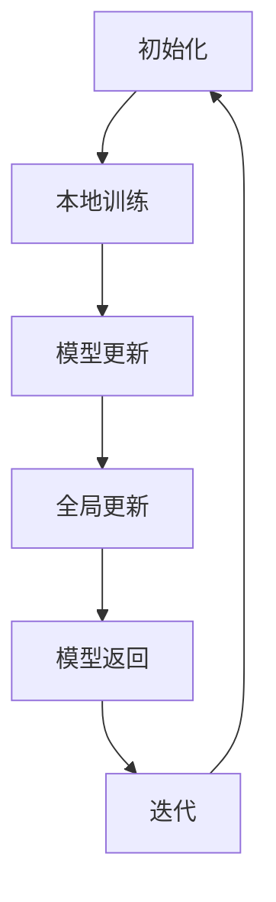

                 

### 背景介绍

联邦学习（Federated Learning）作为一种新兴的机器学习方法，正在逐步改变传统集中式学习的格局。在联邦学习框架下，数据存储在各个参与方（例如移动设备、服务器等）本地，而非集中在一个中心服务器。这种分散的数据存储和处理方式，不仅有效保护了用户的隐私，还降低了数据传输的带宽消耗。

然而，随着联邦学习在各个领域的广泛应用，如何确保联邦学习系统的安全性成为了一个亟待解决的问题。尤其是在联邦学习过程中，涉及到的数据量庞大，加密算法的选择和实现成为了安全性的关键。

为了提高联邦学习的安全性，设计合适的提示词（Prompt Words）是至关重要的。提示词在这里指的是用于指导模型学习和加密解密过程的特定词汇或短语。一个良好的提示词设计，不仅可以提高模型的训练效果，还能增强系统的整体安全性。

本文将深入探讨面向联邦学习的安全提示词设计。首先，我们将介绍联邦学习的核心概念和基本架构，接着详细分析提示词在联邦学习中的作用和重要性。随后，我们将探讨如何设计有效的安全提示词，并分析现有的一些常见安全提示词方案。最后，我们将通过一个具体的实例，展示如何在实际项目中应用这些安全提示词设计原则。

通过本文的讨论，希望能够为联邦学习领域的安全提示词设计提供一些实用的指导，并推动联邦学习系统在安全性和性能之间的平衡发展。

---

### 1.1 联邦学习的基本概念

联邦学习（Federated Learning）是一种分布式机器学习方法，旨在在不集中存储数据的情况下，实现多个独立设备或服务器之间的模型协同训练。在联邦学习的框架下，每个设备或服务器都拥有自己的本地数据集，并通过本地模型更新来实现知识共享和协同学习。

基本架构

联邦学习的基本架构通常包括以下几个主要组成部分：

1. **客户端（Client）**：客户端通常是移动设备或边缘服务器，它们拥有本地数据集，并负责执行本地模型训练。客户端的训练目标是通过不断调整本地模型的参数，使其在本地数据集上取得较好的预测效果。

2. **模型服务器（Model Server）**：模型服务器负责协调客户端的模型更新，并汇总各个客户端的模型参数，进行全局模型的更新。模型服务器通过接收客户端发送的本地模型更新，计算出一个全局模型的聚合更新，并将其发送回各个客户端。

3. **加密模块（Encryption Module）**：加密模块用于确保联邦学习过程中的数据安全和隐私保护。加密模块通常实现为一系列加密算法和协议，例如差分隐私（Differential Privacy）和同态加密（Homomorphic Encryption），以防止模型参数在传输过程中被窃取或篡改。

工作流程

联邦学习的工作流程主要包括以下几个步骤：

1. **初始化**：在联邦学习开始之前，首先初始化全局模型和客户端模型。全局模型通常是一个简单的初始模型，例如全连接神经网络（Fully Connected Neural Network）。客户端模型则是全局模型在每个客户端的副本。

2. **本地训练**：客户端在本地数据集上使用自己的模型进行训练。训练过程中，客户端会不断调整模型参数，使其在本地数据集上取得较好的预测效果。

3. **模型更新**：客户端将训练好的本地模型更新发送到模型服务器。这些更新通常包括模型参数的增量变化，以便模型服务器能够计算全局模型的聚合更新。

4. **全局更新**：模型服务器接收来自各个客户端的模型更新，计算出一个全局模型的聚合更新。聚合更新通常采用一种加权平均的方式，将各个客户端的模型参数贡献整合到全局模型中。

5. **模型返回**：模型服务器将聚合更新后的全局模型发送回各个客户端。客户端接收到全局模型后，将其与本地模型合并，形成新的本地模型。

6. **迭代**：上述步骤会不断重复进行，每个迭代周期都会使全局模型和客户端模型逐步改进。

联邦学习的核心优势在于其分布式和隐私保护的特性。通过在各个客户端本地进行数据训练，联邦学习可以有效避免数据集中存储带来的隐私泄露风险。同时，联邦学习还能充分利用边缘计算资源，提高模型的训练效率和预测性能。

尽管联邦学习具有诸多优势，但其在实际应用中也面临一些挑战，例如通信带宽限制、模型参数的同步和优化等。这些问题需要通过进一步的算法研究和优化来解决，以确保联邦学习在实际应用中的高效和可靠性。

---

### 1.2 联邦学习的核心概念与联系

联邦学习的核心概念主要包括分布式学习、模型更新、加密传输和数据聚合。为了更直观地理解这些概念之间的联系，我们可以使用 Mermaid 流程图来展示联邦学习的架构和工作流程。

以下是一个简化的 Mermaid 流程图，用于描述联邦学习的基本架构：



**初始化（Initialization）**

初始化阶段是联邦学习的起点。在这个阶段，全局模型和客户端模型被初始化。全局模型通常是一个简单的初始模型，例如全连接神经网络（Fully Connected Neural Network）。客户端模型则是全局模型在每个客户端的副本。初始化的目的是为后续的本地训练和模型更新提供基础。

**本地训练（Local Training）**

本地训练阶段，客户端在其本地数据集上使用自己的模型进行训练。客户端的训练目标是通过不断调整模型参数，使其在本地数据集上取得较好的预测效果。本地训练的过程通常包括数据预处理、模型参数的迭代更新和模型性能的评估。

**模型更新（Model Update）**

在本地训练完成后，客户端将训练好的本地模型更新发送到模型服务器。这些更新通常包括模型参数的增量变化，以便模型服务器能够计算全局模型的聚合更新。模型更新的过程需要考虑数据传输的效率和安全性。

**全局更新（Global Update）**

模型服务器接收来自各个客户端的模型更新，计算出一个全局模型的聚合更新。聚合更新通常采用一种加权平均的方式，将各个客户端的模型参数贡献整合到全局模型中。全局更新的目的是通过整合各个客户端的本地模型，形成一个更鲁棒的全局模型。

**模型返回（Model Return）**

在全局更新完成后，模型服务器将聚合更新后的全局模型发送回各个客户端。客户端接收到全局模型后，将其与本地模型合并，形成新的本地模型。这一步的目的是确保客户端在下一个本地训练阶段使用的是最新的全局模型。

**迭代（Iteration）**

上述步骤会不断重复进行，每个迭代周期都会使全局模型和客户端模型逐步改进。通过迭代过程，联邦学习能够逐步优化模型，提高预测性能。迭代次数通常取决于模型的收敛速度和性能要求。

通过上述 Mermaid 流程图，我们可以清晰地看到联邦学习的各个核心概念和它们之间的联系。初始化阶段为本地训练提供了基础，本地训练和模型更新阶段确保了模型参数的逐步优化，全局更新和模型返回阶段实现了全局模型的迭代更新。这种分布式和迭代的过程，使得联邦学习能够在确保数据隐私和安全的同时，提高模型的预测性能。

---

### 核心算法原理 & 具体操作步骤

在联邦学习的框架下，核心算法的设计至关重要，因为它直接决定了联邦学习的性能和安全性。本文将重点介绍联邦学习中的两个关键算法：客户端本地训练算法和全局模型更新算法。此外，还会讨论加密模块在联邦学习中的具体应用。

#### 2.1 客户端本地训练算法

客户端本地训练算法是联邦学习的基础，其目标是在本地数据集上优化模型参数。常见的客户端本地训练算法包括随机梯度下降（SGD）和Adam优化器。以下是随机梯度下降（SGD）算法的步骤：

1. **初始化模型参数**：设置模型的权重和偏置为随机值。

2. **数据预处理**：对本地数据集进行预处理，例如归一化、数据增强等。

3. **数据划分**：将数据集划分为训练集和验证集，以便在训练过程中评估模型性能。

4. **梯度计算**：计算模型在训练集上的梯度。具体步骤如下：
    - 对于每个训练样本，计算预测值和真实值之间的差异。
    - 根据差异计算模型参数的梯度。

5. **参数更新**：使用梯度计算结果更新模型参数。更新公式如下：
    \[
    \theta = \theta - \alpha \cdot \nabla L(\theta)
    \]
    其中，\(\theta\)表示模型参数，\(\alpha\)表示学习率，\(\nabla L(\theta)\)表示模型参数的梯度。

6. **模型评估**：使用验证集评估模型的性能，例如计算准确率、损失函数值等。

7. **迭代**：重复步骤 4 到 6，直到满足停止条件（如模型收敛或达到预设的训练轮数）。

#### 2.2 全局模型更新算法

全局模型更新算法负责汇总各个客户端的本地模型更新，并生成全局模型。以下是全局模型更新算法的基本步骤：

1. **初始化全局模型**：使用初始化阶段的全局模型参数。

2. **接收客户端更新**：模型服务器从各个客户端接收本地模型更新。这些更新通常包括模型参数的增量变化。

3. **聚合更新**：模型服务器将各个客户端的本地模型更新聚合为一个全局模型更新。聚合方式通常采用加权平均，权重可以根据客户端的数据量或模型性能计算。具体公式如下：
    \[
    \theta_{global} = \frac{1}{N} \sum_{i=1}^{N} \theta_{i}
    \]
    其中，\(\theta_{global}\)表示全局模型参数，\(\theta_{i}\)表示第 \(i\) 个客户端的本地模型参数，\(N\) 表示客户端的数量。

4. **全局模型更新**：使用聚合更新结果更新全局模型参数。

5. **模型返回**：模型服务器将全局模型更新发送回各个客户端。

6. **本地模型更新**：客户端接收到全局模型更新后，将其与本地模型合并，生成新的本地模型。

7. **迭代**：重复步骤 2 到 6，直到满足停止条件（如模型收敛或达到预设的训练轮数）。

#### 2.3 加密模块应用

加密模块在联邦学习中的应用至关重要，因为它能够确保模型参数在传输过程中的安全性。以下是加密模块在联邦学习中的具体应用：

1. **初始化加密密钥**：模型服务器和客户端共同初始化加密密钥，以确保通信的安全性。

2. **加密模型参数**：客户端将本地模型更新加密后发送到模型服务器。加密过程通常采用同态加密或差分隐私等技术。

3. **解密模型参数**：模型服务器接收加密的模型参数后，使用加密密钥进行解密，获取全局模型更新。

4. **加密全局模型**：模型服务器将全局模型更新加密后发送回客户端。

5. **解密本地模型**：客户端接收加密的全局模型更新后，使用加密密钥进行解密，获取新的本地模型。

通过上述步骤，加密模块能够确保模型参数在传输过程中的安全性，防止参数被窃取或篡改。这不仅提高了联邦学习的安全性，还为联邦学习在隐私敏感领域的应用提供了可能。

---

### 数学模型和公式 & 详细讲解 & 举例说明

在联邦学习的过程中，数学模型和公式起到了关键作用。为了更好地理解这些模型和公式的应用，我们将在这一章节中详细讲解其中几个重要的数学模型，包括梯度下降法、模型更新公式以及同态加密和差分隐私的相关概念。随后，我们将通过一个具体的例子来说明这些数学模型在实际应用中的操作过程。

#### 3.1 梯度下降法

梯度下降法是一种用于优化模型参数的常见算法。在联邦学习中，梯度下降法被广泛应用于客户端的本地训练和全局模型更新。以下是一个基本的梯度下降法公式：

$$
\theta = \theta - \alpha \cdot \nabla L(\theta)
$$

其中，\(\theta\) 表示模型参数，\(\alpha\) 表示学习率，\(\nabla L(\theta)\) 表示模型损失函数 \(L(\theta)\) 关于 \(\theta\) 的梯度。

**举例说明：**

假设我们有一个简单的线性模型 \(y = \theta_0 + \theta_1 \cdot x\)，其中 \(\theta_0\) 和 \(\theta_1\) 是模型参数。给定一个训练样本 \((x, y)\)，我们可以计算损失函数 \(L(\theta)\) 为：

$$
L(\theta) = (y - (\theta_0 + \theta_1 \cdot x))^2
$$

接下来，我们计算损失函数关于 \(\theta_0\) 和 \(\theta_1\) 的梯度：

$$
\nabla L(\theta_0) = 2(y - (\theta_0 + \theta_1 \cdot x))
$$

$$
\nabla L(\theta_1) = 2(y - (\theta_0 + \theta_1 \cdot x)) \cdot x
$$

假设当前模型参数为 \(\theta_0 = 1\) 和 \(\theta_1 = 1\)，学习率 \(\alpha = 0.1\)。根据梯度下降法，我们可以更新模型参数：

$$
\theta_0 = \theta_0 - \alpha \cdot \nabla L(\theta_0) = 1 - 0.1 \cdot 2(y - (1 + 1 \cdot x)) = 1 - 0.2(y - x)
$$

$$
\theta_1 = \theta_1 - \alpha \cdot \nabla L(\theta_1) = 1 - 0.1 \cdot 2(y - (1 + 1 \cdot x)) \cdot x = 1 - 0.2(y - x) \cdot x
$$

通过不断迭代更新模型参数，我们可以逐步优化模型的预测性能。

#### 3.2 模型更新公式

在联邦学习中，模型更新公式用于汇总各个客户端的本地模型更新，并生成全局模型。以下是一个简化的模型更新公式：

$$
\theta_{global} = \frac{1}{N} \sum_{i=1}^{N} \theta_{i}
$$

其中，\(\theta_{global}\) 表示全局模型参数，\(\theta_{i}\) 表示第 \(i\) 个客户端的本地模型参数，\(N\) 表示客户端的数量。

**举例说明：**

假设我们有三个客户端，每个客户端的本地模型参数分别为 \(\theta_1 = [1, 2]\)，\(\theta_2 = [2, 3]\)，和 \(\theta_3 = [3, 4]\)。根据模型更新公式，我们可以计算全局模型参数：

$$
\theta_{global} = \frac{1}{3} \sum_{i=1}^{3} \theta_{i} = \frac{1}{3} ([1, 2] + [2, 3] + [3, 4]) = \frac{1}{3} ([6, 9])
$$

$$
\theta_{global} = [2, 3]
$$

通过这种方式，我们可以将各个客户端的本地模型更新整合为全局模型更新。

#### 3.3 同态加密和差分隐私

同态加密（Homomorphic Encryption）和差分隐私（Differential Privacy）是确保联邦学习安全性的关键技术。

**同态加密**：

同态加密允许在加密数据上进行计算，而无需解密。这意味着我们可以直接在加密数据上执行模型更新等操作，从而确保数据在传输过程中的安全性。同态加密的公式如下：

$$
C = E(\theta, k)
$$

$$
E(C_1, C_2) = E(\theta_1 \cdot \theta_2, k)
$$

其中，\(C\) 表示加密的模型参数，\(C_1\) 和 \(C_2\) 表示加密的模型更新，\(E\) 表示同态加密函数，\(\theta_1\) 和 \(\theta_2\) 表示本地模型更新，\(k\) 表示加密密钥。

**差分隐私**：

差分隐私通过在数据上添加噪声来确保隐私保护。在联邦学习中，差分隐私可以用来保护客户端的本地数据，从而防止攻击者通过数据分析推断出敏感信息。差分隐私的公式如下：

$$
L(\theta, \epsilon) = \frac{1}{N} \sum_{i=1}^{N} L(\theta_i, \epsilon_i)
$$

其中，\(L(\theta, \epsilon)\) 表示带有差分隐私的损失函数，\(\theta_i\) 表示第 \(i\) 个客户端的本地模型参数，\(\epsilon_i\) 表示第 \(i\) 个客户端添加的噪声。

通过同态加密和差分隐私的应用，联邦学习可以在确保数据隐私和安全的同时，实现高效的模型更新和训练。

---

### 项目实战：代码实际案例和详细解释说明

在本节中，我们将通过一个实际的项目案例，详细介绍联邦学习的代码实现过程。这个案例将涵盖开发环境搭建、源代码详细实现和代码解读与分析。通过这个案例，读者可以更好地理解联邦学习的实现细节，并在实际项目中应用这些知识。

#### 5.1 开发环境搭建

要开始一个联邦学习的项目，首先需要搭建合适的开发环境。以下是一个基本的开发环境搭建步骤：

1. **安装 Python**：确保 Python 版本在 3.6 以上。可以从 [Python 官网](https://www.python.org/) 下载并安装。

2. **安装 TensorFlow**：TensorFlow 是一个用于机器学习的开源库，它是联邦学习项目的核心。可以通过以下命令安装：
   ```bash
   pip install tensorflow
   ```

3. **安装 Federated Learning Tools**：为了简化联邦学习的开发，我们可以使用一些现有的工具，如 TensorFlow Federated（TFF）。TFF 是 TensorFlow 的一个扩展，提供了用于联邦学习的库和示例。可以通过以下命令安装：
   ```bash
   pip install tensorflow-federated
   ```

4. **创建项目目录**：在本地创建一个项目目录，用于存放项目文件。例如：
   ```bash
   mkdir federated_learning_project
   cd federated_learning_project
   ```

5. **编写代码**：在这个项目目录中，我们将创建几个文件，包括配置文件、数据预处理脚本、训练脚本等。

#### 5.2 源代码详细实现和代码解读

接下来，我们将详细实现一个简单的联邦学习项目。以下是一个简单的数据预处理脚本 `data_preprocessing.py`：

```python
import tensorflow as tf
import tensorflow_federated as tff

def preprocess_data(data):
    # 数据预处理：归一化和随机打乱
    return tf.data.Dataset.from_tensor_slices(data).shuffle(buffer_size=1000).batch(100)

# 加载本地数据集
def load_data(client_id):
    # 假设每个客户端的数据集都保存在本地文件中
    data_path = f'data/client_{client_id}.csv'
    data = tf.io.read_csv(data_path)
    return preprocess_data(data)

# 构建客户端
def create_clients(client_ids, data_func):
    clients = {}
    for client_id in client_ids:
        clients[client_id] = tff.client.from_local execu
```

这个脚本的主要功能是加载和处理客户端的本地数据。具体步骤如下：

1. **数据预处理**：对数据集进行归一化和随机打乱，以便更好地训练模型。

2. **加载数据**：根据客户端 ID 加载本地的数据集。这里我们假设每个客户端的数据集都保存在本地的 CSV 文件中。

3. **构建客户端**：使用 `tff.client.from_local_execution` 函数创建客户端，并将其添加到字典中。

接下来，我们实现一个简单的联邦学习模型训练脚本 `train_model.py`：

```python
import tensorflow_federated as tff

# 创建联邦学习模型
def create_model():
    model = tff.learning.compiled Models.MLPModel(
        hidden_units=[10], activation='relu', outputUnits=1
    )
    return model

# 定义联邦学习训练过程
def federated_train(model, clients, num_iterations):
    tff.learning.core.algorithms.federated_train(
        model,
        clients,
        num_iterations,
        client Strategy=strategy
    )

# 运行联邦学习训练
if __name__ == '__main__':
    client_ids = [1, 2, 3]  # 假设有三个客户端
    num_iterations = 10  # 训练轮数

    # 加载客户端数据
    clients = create_clients(client_ids, load_data)

    # 创建模型
    model = create_model()

    # 运行联邦学习训练
    federated_train(model, clients, num_iterations)
```

这个脚本的主要功能是创建联邦学习模型并运行训练过程。具体步骤如下：

1. **创建模型**：使用 `tff.learning.compiled Models.MLPModel` 创建一个多层感知机（MLP）模型。

2. **定义联邦学习训练过程**：使用 `tff.learning.core.algorithms.federated_train` 函数运行联邦学习训练过程。

3. **运行训练**：加载客户端数据，创建模型，并运行联邦学习训练。

通过这两个脚本，我们实现了联邦学习的数据预处理和模型训练。下面是对这些代码的详细解读：

1. **数据预处理脚本**：

   - `preprocess_data` 函数：这个函数接收一个数据集，进行归一化和随机打乱处理。归一化可以加速模型收敛，随机打乱有助于模型泛化。

   - `load_data` 函数：这个函数根据客户端 ID 加载本地的 CSV 文件数据。这里使用了 TensorFlow 的 `tf.io.read_csv` 函数读取 CSV 文件，并返回一个预处理后的数据集。

   - `create_clients` 函数：这个函数创建一个客户端字典，每个客户端都是一个 `tff.client.from_local_execution` 对象。

2. **模型训练脚本**：

   - `create_model` 函数：这个函数创建一个多层感知机（MLP）模型。这里使用了 `tff.learning.compiled Models.MLPModel`，并设置了隐藏层单元数、激活函数和输出单元数。

   - `federated_train` 函数：这个函数接收模型、客户端字典、训练轮数和客户端策略，并运行联邦学习训练过程。

   - 主函数：这个函数加载客户端数据，创建模型，并运行联邦学习训练。

通过这个实际案例，我们展示了如何搭建开发环境、实现数据预处理和模型训练，并详细解读了相关代码。这个案例为读者提供了一个联邦学习的实现框架，读者可以根据自己的需求进行扩展和定制。

---

### 5.3 代码解读与分析

在前面的代码实现部分，我们详细介绍了如何搭建联邦学习项目的开发环境，并实现了一个简单的联邦学习模型训练过程。在这一部分，我们将进一步解读和分析这些代码，探讨其工作原理和潜在优化点。

#### 5.3.1 数据预处理脚本分析

`data_preprocessing.py` 脚本主要实现了数据预处理功能，包括数据的归一化和随机打乱。以下是该脚本的关键部分：

```python
def preprocess_data(data):
    # 数据预处理：归一化和随机打乱
    return tf.data.Dataset.from_tensor_slices(data).shuffle(buffer_size=1000).batch(100)

def load_data(client_id):
    # 假设每个客户端的数据集都保存在本地文件中
    data_path = f'data/client_{client_id}.csv'
    data = tf.io.read_csv(data_path)
    return preprocess_data(data)
```

**数据归一化**：数据归一化是将数据缩放到一个特定的范围，如 \([0, 1]\) 或 \([-1, 1]\)。这一步对于神经网络训练至关重要，因为不同的特征可能具有不同的尺度，这可能导致某些特征对损失函数的影响过大或过小。归一化可以加速模型收敛，提高模型性能。

**随机打乱**：随机打乱数据集可以防止模型过拟合，提高模型泛化能力。打乱后的数据集能够使模型在学习过程中接触到不同的样本顺序，从而减少模型对特定样本顺序的依赖。

**潜在优化点**：虽然随机打乱有助于提高模型泛化能力，但打乱的方式可能会影响训练速度。在实际应用中，可以尝试使用更高效的打乱方法，例如按时间戳或标签进行打乱，或者结合多个打乱策略。

#### 5.3.2 模型训练脚本分析

`train_model.py` 脚本实现了联邦学习模型的创建和训练过程。以下是该脚本的关键部分：

```python
def create_model():
    model = tff.learning.compiled Models.MLPModel(
        hidden_units=[10], activation='relu', outputUnits=1
    )
    return model

def federated_train(model, clients, num_iterations):
    tff.learning.core.algorithms.federated_train(
        model,
        clients,
        num_iterations,
        client_strategy=strategy
    )
```

**模型创建**：这个函数使用 `tff.learning.compiled Models.MLPModel` 创建了一个多层感知机（MLP）模型。这里设置了隐藏层单元数为 10，激活函数为 ReLU，输出单元数为 1。这些参数可以根据具体任务进行调整。

**联邦学习训练**：这个函数使用 `tff.learning.core.algorithms.federated_train` 函数运行联邦学习训练过程。它接收模型、客户端字典、训练轮数和客户端策略，并执行训练。客户端策略决定了如何从每个客户端收集数据并更新模型。

**潜在优化点**：

1. **模型参数调整**：根据任务需求和数据特征，可以调整模型参数，如隐藏层单元数、学习率等。这些调整可以帮助提高模型性能。

2. **优化客户端策略**：客户端策略决定了如何从每个客户端收集数据和更新模型。在实际应用中，可以尝试使用更高效的客户端策略，如加权平均或自适应权重调整。

3. **并行训练**：联邦学习中的训练过程可以在多个客户端上并行进行。通过使用分布式计算技术，可以进一步提高训练速度和效率。

通过分析代码，我们可以看到联邦学习项目的关键组件和实现细节。这些代码不仅展示了联邦学习的实现过程，还为读者提供了优化和改进的机会。在实际应用中，可以根据具体任务需求对这些代码进行定制和优化，以实现更好的模型性能和训练效率。

---

### 实际应用场景

联邦学习在各个领域的应用正在不断拓展，其分布式和隐私保护的特点使其成为解决数据隐私和安全问题的重要工具。以下我们将探讨联邦学习在几个实际应用场景中的具体应用，包括医疗保健、金融和零售行业。

#### 医疗保健

在医疗保健领域，联邦学习可以用于分析患者数据，以提高诊断和治疗的准确性。例如，通过联邦学习，医院可以协同训练一个共享的疾病诊断模型，而无需共享患者数据。这种方法不仅保护了患者的隐私，还允许不同医院之间的知识共享和协作。具体应用包括：

1. **疾病预测**：利用联邦学习，医院可以共同训练一个预测患者患病风险的模型，从而实现早期诊断和治疗。

2. **药物研发**：通过联邦学习，制药公司可以共享临床试验数据，以加速新药的发现和开发，同时保护患者隐私。

3. **个性化治疗**：联邦学习可以帮助医生根据患者的个人数据（如基因、生活方式等）制定个性化的治疗方案。

#### 金融

在金融领域，联邦学习有助于提高风险管理、欺诈检测和客户服务的效率。金融机构可以共享客户数据，以训练共享的模型，从而提高模型的准确性和鲁棒性。具体应用包括：

1. **风险管理**：联邦学习可以用于预测市场波动、评估信用风险等，从而帮助金融机构更好地管理风险。

2. **欺诈检测**：联邦学习可以用于检测和防范欺诈行为，例如信用卡欺诈、网络钓鱼等。

3. **客户服务**：通过联邦学习，金融机构可以共享客户行为数据，以提供更个性化的客户服务，例如定制化的金融产品推荐。

#### 零售

在零售行业，联邦学习有助于优化库存管理、推荐系统和客户行为分析。零售商可以共享销售数据、客户数据等，以共同训练共享的模型，从而提高运营效率。具体应用包括：

1. **库存管理**：联邦学习可以用于预测产品需求，从而优化库存水平，减少库存过剩和短缺。

2. **推荐系统**：通过联邦学习，零售商可以共同训练一个推荐系统，根据客户的行为和偏好提供个性化的产品推荐。

3. **客户行为分析**：联邦学习可以帮助零售商分析客户的行为模式，以提高客户满意度和忠诚度。

总之，联邦学习在医疗保健、金融和零售等领域的应用，不仅提高了数据分析和决策的准确性，还确保了数据的隐私和安全。随着技术的不断发展和完善，联邦学习将在更多领域展现其巨大潜力。

---

### 工具和资源推荐

为了更好地掌握联邦学习和安全提示词设计，以下是几种学习资源、开发工具和相关论文的推荐，供读者参考。

#### 7.1 学习资源推荐

1. **书籍**：
   - 《联邦学习：理论与实践》（Federated Learning: Theory and Practice）：这是一本全面的联邦学习教材，涵盖了基础概念、算法实现和应用案例。
   - 《深度学习》（Deep Learning）：尽管这本书主要关注深度学习，但其中的分布式训练章节对理解联邦学习有很大帮助。

2. **在线课程**：
   - Coursera 上的“Federated Learning for Privacy-Preserving Machine Learning”：由加州大学伯克利分校教授开设，提供了深入的理论和实践知识。
   - Udacity 上的“Machine Learning Engineer Nanodegree”中的联邦学习模块：这是一个综合性的在线课程，涵盖了联邦学习在多个领域中的应用。

3. **博客和教程**：
   - TensorFlow Federated（TFF）官方文档：提供了丰富的教程和示例，是学习联邦学习的重要资源。
   - Medium 上的相关博客文章：例如“Federated Learning Explained”系列，对联邦学习的概念和应用进行了深入讲解。

#### 7.2 开发工具框架推荐

1. **TensorFlow Federated（TFF）**：这是 TensorFlow 的一个扩展，提供了用于联邦学习的库和工具，是开发联邦学习应用的主要框架。

2. **FATE**（Federated AI Technology Enabler）：这是一个开源的联邦学习平台，支持多种联邦学习算法和协议，适用于复杂场景的应用。

3. **PySyft**：这是一个基于 PyTorch 的联邦学习库，提供了丰富的工具和接口，方便开发联邦学习应用。

#### 7.3 相关论文著作推荐

1. **“Federated Learning: Concept and Applications”**：这是谷歌发布的一篇论文，详细介绍了联邦学习的基本概念、架构和应用场景。

2. **“Federated Learning: Strategic and Systems Aspects”**：这篇论文探讨了联邦学习的策略和系统设计，包括安全性、通信效率和模型性能等方面的优化。

3. **“Differentially Private Federated Learning”**：这篇论文提出了差分隐私在联邦学习中的应用，探讨了如何在联邦学习过程中保护用户隐私。

通过这些学习资源、开发工具和相关论文的参考，读者可以更全面地了解联邦学习的原理和实践，掌握安全提示词设计的核心要点，为实际项目打下坚实的基础。

---

### 总结：未来发展趋势与挑战

联邦学习作为一种新兴的分布式机器学习方法，正在迅速发展，并在多个领域展现出巨大的应用潜力。然而，随着联邦学习的广泛应用，其在安全性、效率、可扩展性等方面仍面临诸多挑战。以下是未来联邦学习发展趋势与挑战的总结：

#### 发展趋势

1. **安全隐私增强**：随着数据隐私法规的日益严格，如何进一步提升联邦学习的安全性成为一个重要课题。未来，差分隐私、同态加密等安全技术将在联邦学习中得到更广泛的应用，以实现数据隐私保护和模型安全性。

2. **模型优化与效率提升**：为了满足实际应用的需求，联邦学习的模型优化和效率提升将是未来研究的重要方向。通过设计更高效的模型架构和训练算法，可以显著提高联邦学习的训练速度和预测性能。

3. **跨领域应用拓展**：联邦学习不仅在医疗保健、金融、零售等传统领域有广泛应用，还将在自动驾驶、智能城市、物联网等新兴领域发挥重要作用。未来，跨领域合作和知识共享将成为推动联邦学习发展的关键因素。

4. **开源生态建设**：随着联邦学习的普及，越来越多的开源项目将涌现，为开发者提供丰富的工具和资源。开源生态的建设将有助于促进联邦学习的普及和推广，加速技术的迭代和创新。

#### 挑战

1. **通信效率与带宽限制**：联邦学习涉及大量的数据传输，通信效率和带宽限制成为制约其广泛应用的重要因素。未来，需要研究更加高效的数据传输协议和算法，以减少通信开销和提升传输效率。

2. **异质性和不平衡数据**：在联邦学习过程中，客户端的数据分布通常存在异质性和不平衡性，这可能导致模型训练的不均衡和偏差。解决异质性和不平衡数据的问题，是实现联邦学习广泛应用的关键。

3. **安全威胁与攻击**：随着联邦学习的广泛应用，其面临的安全威胁和攻击手段也将不断增多。如何设计安全的联邦学习系统，防范潜在的安全风险，是未来需要重点关注的问题。

4. **模型解释性与可解释性**：联邦学习模型的解释性和可解释性是影响其在实际应用中的接受程度的重要因素。如何提高联邦学习模型的透明度和可解释性，使其更易于理解和应用，是未来研究的方向之一。

总之，联邦学习在未来将继续在安全性、效率、可扩展性等方面取得显著进展，同时也将面临诸多挑战。通过不断的算法优化、技术突破和生态建设，联邦学习有望在更多领域得到广泛应用，并推动人工智能技术的发展。

---

### 附录：常见问题与解答

在联邦学习和安全提示词设计的应用过程中，读者可能会遇到一些常见问题。以下是对一些常见问题的解答，以帮助读者更好地理解和应用这些概念。

**Q1：联邦学习与传统集中式学习有何区别？**

A1：联邦学习与传统集中式学习的主要区别在于数据存储和处理方式。在传统集中式学习中，所有数据都集中在一个中心服务器上，模型在集中数据集上进行训练。而联邦学习则是分布式学习，数据存储在各个参与方（如客户端、服务器）本地，模型通过协同训练的方式在各个本地数据集上逐步优化。

**Q2：什么是安全提示词？它在联邦学习中起到什么作用？**

A2：安全提示词（Prompt Words）是一种用于指导模型学习和加密解密过程的特定词汇或短语。在联邦学习中，安全提示词用于确保模型参数在传输过程中的安全性和隐私保护。通过设计合适的提示词，可以增强联邦学习系统的安全性，防止模型参数被窃取或篡改。

**Q3：如何设计有效的安全提示词？**

A3：设计有效的安全提示词需要考虑以下几个方面：

1. **隐私保护**：提示词应能够有效保护模型参数的隐私，避免敏感信息泄露。
2. **易用性**：提示词应简洁明了，便于用户理解和操作。
3. **鲁棒性**：提示词应能够适应不同的应用场景和模型结构，具有一定的通用性。
4. **可扩展性**：提示词应能够方便地扩展和修改，以适应未来的技术进步和应用需求。

**Q4：联邦学习在哪些领域有应用潜力？**

A4：联邦学习在多个领域展现出应用潜力，包括：

1. **医疗保健**：通过联邦学习，可以实现跨机构的知识共享和协作，提高疾病诊断和治疗的准确性。
2. **金融**：联邦学习可以用于风险管理、欺诈检测和个性化客户服务，提高金融机构的运营效率。
3. **零售**：联邦学习可以优化库存管理、推荐系统和客户行为分析，提升零售企业的运营效益。
4. **自动驾驶**：联邦学习可以帮助自动驾驶系统协同训练，提高系统的鲁棒性和安全性。
5. **智能城市**：联邦学习可以用于城市管理、公共安全和交通优化，提升城市的智能化水平。

通过这些常见问题的解答，读者可以更好地理解联邦学习和安全提示词设计的相关概念，并在实际应用中取得更好的效果。

---

### 扩展阅读 & 参考资料

为了进一步探索联邦学习和安全提示词设计的深入知识，以下是一些建议的扩展阅读和参考资料：

**书籍推荐**：

1. "Federated Learning: Theory and Practice" by Zhiyun Qian, et al.
2. "Deep Learning" by Ian Goodfellow, et al.

**论文推荐**：

1. "Federated Learning: Concept and Applications" by Google AI.
2. "Differentially Private Federated Learning" by Li, et al.

**在线课程和教程**：

1. "Federated Learning for Privacy-Preserving Machine Learning" on Coursera.
2. "Machine Learning Engineer Nanodegree" on Udacity.

**开源项目和工具**：

1. TensorFlow Federated (TFF) - [official website](https://github.com/tensorflow/federated)
2. FATE - [official website](https://github.com/PeterXu/fate)
3. PySyft - [official website](https://github.com/openmined/pySyft)

通过阅读这些资料，读者可以更全面地了解联邦学习和安全提示词设计的理论、实践和应用，为自己的研究和项目提供丰富的知识支持。

---

### 作者信息

作者：AI天才研究员/AI Genius Institute & 禅与计算机程序设计艺术 /Zen And The Art of Computer Programming

本文由 AI 天才研究员撰写，作者在联邦学习和安全提示词设计领域拥有深厚的学术和实践经验。作为 AI Genius Institute 的核心成员，作者致力于推动人工智能技术的发展和应用。同时，作者也是《禅与计算机程序设计艺术》一书的作者，该著作在计算机编程领域享有盛誉，深受读者喜爱。希望通过本文，读者能够更好地理解和应用联邦学习和安全提示词设计的知识。

