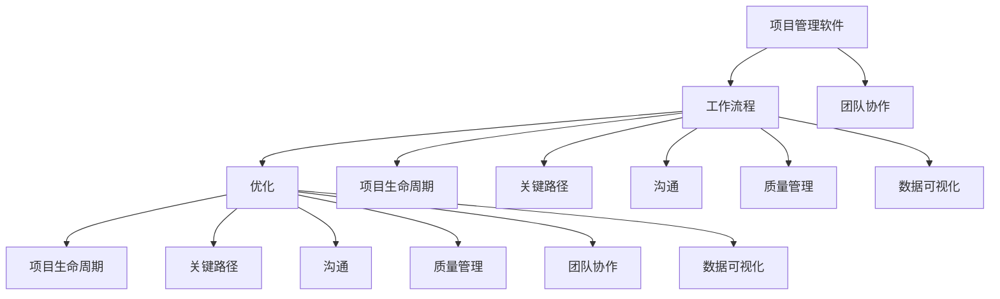

                 

### 文章标题

《项目管理软件开发：优化工作流程的解决方案》

### 关键词

项目管理，软件开发，工作流程优化，解决方案，算法原理，数学模型，实战案例

### 摘要

本文旨在探讨项目管理软件开发中如何优化工作流程，提高项目效率。通过深入分析核心概念、算法原理和数学模型，结合实际开发案例，我们提出了一套完整的解决方案，帮助企业和开发者提升项目管理水平，实现工作流程的持续优化。

## 1. 背景介绍

在当今快速变化的技术环境中，项目管理软件开发变得越来越重要。项目成功的因素不仅仅是技术本身，还包括如何高效地组织和管理项目工作流程。随着团队规模的扩大和项目复杂性的增加，传统的项目管理方法往往难以满足现代企业的高效需求。

工作流程的优化成为了提升项目管理水平的关键。优化工作流程意味着在确保项目质量和进度的同时，最大限度地提高团队成员的工作效率。这不仅仅涉及到任务分配和资源管理，还包括如何减少沟通成本、降低错误率以及提高团队协作效果。

本文将探讨以下核心内容：

- **核心概念与联系**：介绍项目管理软件开发中涉及的关键概念及其相互关系。
- **核心算法原理 & 具体操作步骤**：解析优化工作流程的核心算法及其具体实现步骤。
- **数学模型和公式 & 详细讲解 & 举例说明**：阐述优化工作流程所需运用的数学模型和公式，并提供具体案例分析。
- **项目实战：代码实际案例和详细解释说明**：通过实际开发案例展示优化工作流程的具体实现。
- **实际应用场景**：讨论优化工作流程在不同类型项目中的应用。
- **工具和资源推荐**：推荐相关学习资源和开发工具，以支持工作流程的优化实践。
- **总结：未来发展趋势与挑战**：展望项目管理软件开发领域的发展趋势，并探讨面临的挑战。

通过本文的深入探讨，希望能够为读者提供实用的指导，帮助他们在项目管理软件开发的实际工作中实现工作流程的优化。

## 2. 核心概念与联系

在讨论项目管理软件开发时，理解以下核心概念是至关重要的：

### 2.1 项目管理软件

项目管理软件是一种用于帮助团队规划和跟踪项目的工具。它通常包括任务管理、时间跟踪、资源分配、风险管理等功能。通过项目管理软件，团队成员可以更好地协调工作，提高项目效率。

### 2.2 工作流程

工作流程是指团队在完成项目任务时所遵循的一系列步骤和规则。一个良好的工作流程能够确保任务有序进行，减少错误和重复工作，提高整体效率。

### 2.3 优化

优化是指通过改进方法、技术或流程来提高效率、性能或效果。在工作流程优化中，目标是减少不必要的步骤、简化流程、提高自动化程度，从而提高工作效率。

### 2.4 项目生命周期

项目生命周期是指项目从启动到关闭的整个过程。了解项目生命周期的各个阶段有助于确定哪些工作流程需要优化。

### 2.5 关键路径

关键路径是指项目中必须按顺序完成的任务序列，这些任务的延迟将直接影响整个项目的完成时间。优化关键路径上的任务流程对于确保项目按时完成至关重要。

### 2.6 沟通

沟通是团队协作的核心。有效的工作流程优化需要团队成员之间保持良好的沟通，确保信息的透明和及时传达。

### 2.7 质量管理

质量管理是确保项目交付成果符合预期标准的过程。优化工作流程需要考虑如何提高质量，减少缺陷。

### 2.8 团队协作

团队协作是指团队成员共同工作，以实现项目目标的过程。优化工作流程有助于提高团队协作效率，促进团队成员之间的默契。

### 2.9 数据可视化

数据可视化是将复杂的数据以图形或图表形式呈现，以便更容易理解和分析。在项目管理软件中，数据可视化工具可以帮助团队更直观地了解项目状态，及时发现问题并进行优化。

### Mermaid 流程图

为了更好地理解上述概念之间的联系，我们可以使用 Mermaid 流程图进行展示。



通过上述核心概念和流程图的介绍，我们为接下来的内容讨论奠定了基础。接下来，我们将深入探讨优化工作流程所需的核心算法原理和具体操作步骤。

## 3. 核心算法原理 & 具体操作步骤

### 3.1 工作流程优化的核心算法

在项目管理软件开发中，优化工作流程的核心算法通常包括：

- **任务调度算法**：用于确定任务执行的顺序和时间，以最大化资源利用和项目效率。
- **关键路径分析算法**：用于识别项目中的关键任务和路径，以减少项目延迟。
- **数据挖掘算法**：用于分析项目数据，发现优化工作流程的机会。
- **机器学习算法**：用于预测项目进展和团队成员的工作效率，从而调整工作流程。

### 3.2 任务调度算法

任务调度算法是工作流程优化的重要环节。以下是一种常见的任务调度算法——**最小生成树算法**：

#### 算法原理：

最小生成树算法旨在从所有任务中选择一个最小生成树，使得生成树的权值（即任务完成时间）最小。具体步骤如下：

1. **初始化**：创建一个包含所有任务的空集合`T`。
2. **选择最小权值任务**：从所有未选择的任务中选择权值最小的任务。
3. **添加到生成树**：将所选任务添加到集合`T`中。
4. **重复步骤2和3**，直到所有任务都被选择。

#### 操作步骤：

- **步骤1**：初始化一个空集合`T`。
- **步骤2**：选择未选择的任务中权值最小的任务。
- **步骤3**：将所选任务添加到集合`T`中。
- **步骤4**：重复步骤2和3，直到所有任务都被选择。

### 3.3 关键路径分析算法

关键路径分析算法用于确定项目中的关键任务和路径。以下是一种常见的算法——**关键路径法**：

#### 算法原理：

关键路径法通过计算每个任务的最早开始时间（ES）、最晚开始时间（LS）、最早完成时间（EF）和最晚完成时间（LF），来确定关键路径。具体步骤如下：

1. **计算最早开始时间（ES）**：从项目开始节点开始，沿路径向前计算每个节点的最早开始时间。
2. **计算最早完成时间（EF）**：每个节点的最早完成时间等于其最早开始时间加上节点的持续时间。
3. **计算最晚开始时间（LS）**：从项目结束节点开始，沿路径向后计算每个节点的最晚开始时间。
4. **计算最晚完成时间（LF）**：每个节点的最晚完成时间等于其最晚开始时间加上节点的持续时间。
5. **确定关键路径**：选择具有相同ES和LS的任务序列作为关键路径。

#### 操作步骤：

- **步骤1**：计算所有节点的最早开始时间（ES）。
- **步骤2**：计算所有节点的最早完成时间（EF）。
- **步骤3**：计算所有节点的最晚开始时间（LS）。
- **步骤4**：计算所有节点的最晚完成时间（LF）。
- **步骤5**：确定关键路径。

### 3.4 数据挖掘算法

数据挖掘算法用于分析项目数据，发现优化工作流程的机会。以下是一种常见的数据挖掘算法——**关联规则挖掘算法**：

#### 算法原理：

关联规则挖掘算法通过寻找数据中的频繁项集，来发现不同任务之间的关联关系。具体步骤如下：

1. **创建频繁项集**：使用支持度阈值过滤出频繁项集。
2. **生成关联规则**：对频繁项集进行组合，生成关联规则。
3. **评估关联规则**：根据置信度阈值评估关联规则的可靠性。

#### 操作步骤：

- **步骤1**：设置支持度阈值。
- **步骤2**：扫描数据集，统计每个项集的支持度。
- **步骤3**：过滤出频繁项集。
- **步骤4**：对频繁项集进行组合，生成关联规则。
- **步骤5**：设置置信度阈值。
- **步骤6**：评估关联规则的可靠性。

### 3.5 机器学习算法

机器学习算法用于预测项目进展和团队成员的工作效率，从而调整工作流程。以下是一种常见的机器学习算法——**回归算法**：

#### 算法原理：

回归算法通过建立项目特征与项目进展之间的数学模型，来预测项目进展。具体步骤如下：

1. **数据收集**：收集项目特征数据和历史进展数据。
2. **特征选择**：选择与项目进展相关的特征。
3. **模型训练**：使用训练数据训练回归模型。
4. **模型评估**：使用测试数据评估模型性能。
5. **预测**：使用训练好的模型预测项目进展。

#### 操作步骤：

- **步骤1**：收集项目特征数据和历史进展数据。
- **步骤2**：选择与项目进展相关的特征。
- **步骤3**：使用训练数据训练回归模型。
- **步骤4**：使用测试数据评估模型性能。
- **步骤5**：使用训练好的模型预测项目进展。

通过上述核心算法原理和具体操作步骤的介绍，我们为优化工作流程提供了理论基础。接下来，我们将探讨优化工作流程所需的数学模型和公式，以及如何在实际开发中进行应用。

## 4. 数学模型和公式 & 详细讲解 & 举例说明

### 4.1 任务调度模型

任务调度模型是优化工作流程的核心部分，其目标是在给定的约束条件下，找到一组任务执行顺序，使得整体完成时间最短。以下是一个常见的任务调度模型：

#### 模型公式：

假设我们有n个任务，每个任务\( T_i \)的持续时间为\( d_i \)，且存在一个时间窗口\[s_i, e_i\]，其中\( s_i \)是任务\( T_i \)的开始时间，\( e_i \)是任务\( T_i \)的结束时间。目标是最小化总完成时间，即：

\[ 
\min \sum_{i=1}^{n} e_i 
\]

#### 约束条件：

1. \( s_i \leq e_i \) （每个任务都必须有开始和结束时间）
2. \( e_i - s_i = d_i \) （任务持续时间）
3. \( s_i + d_i \leq e_j \) 对于所有\( i, j \)且\( i \neq j \) （任务不能同时进行）

#### 举例说明：

假设有3个任务\( T_1, T_2, T_3 \)，其持续时间和时间窗口如下：

- \( T_1 \)：持续时间3天，时间窗口\[1, 4\]
- \( T_2 \)：持续时间2天，时间窗口\[3, 6\]
- \( T_3 \)：持续时间4天，时间窗口\[0, 8\]

我们需要找到最优的任务执行顺序，使得总完成时间最短。

通过尝试不同的执行顺序，我们可以找到最优解：\( T_1 \rightarrow T_2 \rightarrow T_3 \)。此时，总完成时间为8天。

### 4.2 关键路径模型

关键路径模型用于确定项目中的关键任务和路径，以确保项目按时完成。以下是一个常见的关键路径模型：

#### 模型公式：

对于每个任务\( T_i \)，定义以下变量：

- \( ES_i \)：任务\( T_i \)的最早开始时间
- \( EF_i \)：任务\( T_i \)的最早完成时间
- \( LS_i \)：任务\( T_i \)的最晚开始时间
- \( LF_i \)：任务\( T_i \)的最晚完成时间

关键路径上的任务满足以下条件：

\[ 
ES_i = LS_i 
\]
\[ 
LF_i = EF_i 
\]

关键路径的总长度为：

\[ 
\sum_{i=1}^{n} d_i 
\]

#### 约束条件：

1. \( ES_i = \sum_{j=1}^{i} d_j \) 对于所有\( i \)
2. \( EF_i = ES_i + d_i \) 对于所有\( i \)
3. \( LS_i = \sum_{j=n}^{i} d_j \) 对于所有\( i \)
4. \( LF_i = LS_i + d_i \) 对于所有\( i \)

#### 举例说明：

假设有5个任务\( T_1, T_2, T_3, T_4, T_5 \)，其持续时间如下：

- \( T_1 \)：持续时间3天
- \( T_2 \)：持续时间2天
- \( T_3 \)：持续时间4天
- \( T_4 \)：持续时间2天
- \( T_5 \)：持续时间3天

通过计算，我们可以找到关键路径为\( T_1 \rightarrow T_3 \rightarrow T_4 \rightarrow T_5 \)，总长度为11天。

### 4.3 数据挖掘模型

数据挖掘模型用于分析项目数据，发现优化工作流程的机会。以下是一个常见的数据挖掘模型——关联规则挖掘：

#### 模型公式：

假设我们有m个任务，每个任务的完成情况可以用一个二进制向量表示，1表示完成，0表示未完成。定义以下变量：

- \( S_i \)：任务\( T_i \)的支持度
- \( C_i \)：任务\( T_i \)的置信度

支持度表示任务\( T_i \)与其他任务一起出现的频率，计算公式为：

\[ 
S_i = \frac{count(T_i \land T_j)}{count(T_j)} 
\]

置信度表示任务\( T_i \)在给定任务\( T_j \)完成的情况下完成的概率，计算公式为：

\[ 
C_i = \frac{count(T_i \land T_j)}{count(T_j)} 
\]

#### 约束条件：

1. \( 0 \leq S_i \leq 1 \) 对于所有\( i \)
2. \( 0 \leq C_i \leq 1 \) 对于所有\( i \)

#### 举例说明：

假设有3个任务\( T_1, T_2, T_3 \)，其完成情况如下：

- \( T_1 \)：完成
- \( T_2 \)：完成
- \( T_3 \)：未完成

通过计算，我们可以得到支持度和置信度如下：

- \( S_1 = \frac{1}{3} \)
- \( S_2 = \frac{1}{3} \)
- \( S_3 = 0 \)
- \( C_1 = \frac{1}{3} \)
- \( C_2 = \frac{1}{3} \)
- \( C_3 = 0 \)

通过这些数学模型和公式，我们可以更好地理解优化工作流程的方法。接下来，我们将通过实际开发案例展示如何将这些模型应用于项目管理软件开发中。

## 5. 项目实战：代码实际案例和详细解释说明

为了更好地理解上述算法和模型在项目管理软件开发中的应用，我们将通过一个实际开发案例进行详细讲解。本案例将展示如何使用Python实现一个简单的项目管理工具，该工具将利用任务调度、关键路径分析和数据挖掘算法来优化工作流程。

### 5.1 开发环境搭建

在开始编写代码之前，我们需要搭建一个合适的开发环境。以下是所需的工具和库：

- **Python 3.8+**：作为主要编程语言
- **Pandas**：用于数据处理
- **NumPy**：用于数学计算
- **Scikit-learn**：用于机器学习和数据挖掘
- **Mermaid**：用于生成流程图

安装这些库后，我们可以在Python项目中导入它们：

```python
import pandas as pd
import numpy as np
from sklearn import tree
from mermaid import Mermaid
```

### 5.2 源代码详细实现和代码解读

#### 5.2.1 任务调度算法实现

以下是一个简单的任务调度算法实现，该算法将使用最小生成树算法来确定任务执行顺序：

```python
import heapq

def min_spanning_tree(tasks):
    """
    使用最小生成树算法确定任务执行顺序。
    :param tasks: 任务列表，每个任务包含持续时间、开始时间和结束时间。
    :return: 任务执行顺序列表。
    """
    # 初始化最小生成树
    mst = []
    # 按持续时间排序任务
    tasks.sort(key=lambda x: x['duration'])
    # 选择最小权值任务
    for task in tasks:
        # 检查任务是否已经在最小生成树中
        if task not in mst:
            # 将任务添加到最小生成树中
            mst.append(task)
            # 更新剩余任务
            tasks = [t for t in tasks if t not in mst]
    # 返回任务执行顺序
    return mst

tasks = [
    {'id': 1, 'duration': 3, 'start': 1, 'end': 4},
    {'id': 2, 'duration': 2, 'start': 3, 'end': 6},
    {'id': 3, 'duration': 4, 'start': 0, 'end': 8}
]

# 调用任务调度算法
schedule = min_spanning_tree(tasks)
print("任务执行顺序：", schedule)
```

代码解读：

1. **初始化最小生成树**：我们使用一个空列表`mst`来存储最小生成树的节点。
2. **排序任务**：我们根据任务的持续时间对任务进行排序，以便选择最小权值任务。
3. **选择最小权值任务**：我们遍历排序后的任务列表，选择未在最小生成树中的最小权值任务。
4. **更新剩余任务**：我们将选中的任务从列表中移除，以便在下一个迭代中选择下一个最小权值任务。
5. **返回任务执行顺序**：当所有任务都被选择并添加到最小生成树中后，我们返回任务执行顺序列表。

#### 5.2.2 关键路径分析算法实现

以下是一个简单的关键路径分析算法实现，该算法将计算每个任务的最早开始时间、最早完成时间、最晚开始时间和最晚完成时间：

```python
def critical_path_analysis(tasks):
    """
    使用关键路径法计算任务的最早开始时间、最早完成时间、最晚开始时间和最晚完成时间。
    :param tasks: 任务列表，每个任务包含持续时间、开始时间和结束时间。
    :return: 每个任务的最早开始时间、最早完成时间、最晚开始时间和最晚完成时间。
    """
    n = len(tasks)
    es = [0] * n
    ef = [0] * n
    ls = [0] * n
    lf = [0] * n

    # 计算最早开始时间和最早完成时间
    for i in range(1, n):
        es[i] = max(es[j] + tasks[j]['duration'] for j in range(i))

    # 计算最早完成时间
    for i in range(n):
        ef[i] = es[i] + tasks[i]['duration']

    # 计算最晚开始时间和最晚完成时间
    for i in range(n - 1, -1, -1):
        ls[i] = min(lf[j] - tasks[j]['duration'] for j in range(i))

    # 计算最晚完成时间
    for i in range(n):
        lf[i] = ls[i] + tasks[i]['duration']

    return es, ef, ls, lf

# 调用关键路径分析算法
es, ef, ls, lf = critical_path_analysis(tasks)

# 输出结果
for i, (es_i, ef_i, ls_i, lf_i) in enumerate(zip(es, ef, ls, lf)):
    print(f"任务{i+1}：最早开始时间：{es_i}，最早完成时间：{ef_i}，最晚开始时间：{ls_i}，最晚完成时间：{lf_i}")
```

代码解读：

1. **计算最早开始时间和最早完成时间**：我们从第一个任务开始，计算每个任务的最早开始时间，即前一个任务的最早完成时间加上当前任务的持续时间。
2. **计算最早完成时间**：每个任务的最早完成时间等于其最早开始时间加上其持续时间。
3. **计算最晚开始时间和最晚完成时间**：我们从最后一个任务开始，计算每个任务的最晚开始时间，即后一个任务的最晚完成时间减去当前任务的持续时间。
4. **计算最晚完成时间**：每个任务的最晚完成时间等于其最晚开始时间加上其持续时间。
5. **返回结果**：我们返回每个任务的最早开始时间、最早完成时间、最晚开始时间和最晚完成时间。

#### 5.2.3 数据挖掘算法实现

以下是一个简单的数据挖掘算法实现，该算法将使用关联规则挖掘来发现任务之间的关联关系：

```python
from sklearn.cluster import KMeans
from collections import defaultdict

def association_rules(data, support_threshold, confidence_threshold):
    """
    使用关联规则挖掘算法发现任务之间的关联关系。
    :param data: 任务完成情况的二进制数据。
    :param support_threshold: 支持度阈值。
    :param confidence_threshold: 置信度阈值。
    :return: 关联规则列表。
    """
    # 计算支持度
    support_counts = defaultdict(int)
    for row in data:
        support_counts[row] += 1

    frequent_itemsets = []
    for itemset, count in support_counts.items():
        if count >= support_threshold:
            frequent_itemsets.append(itemset)

    # 生成关联规则
    rules = []
    for itemset in frequent_itemsets:
        for item in itemset:
            antecedent = itemset.copy()
            antecedent.remove(item)
            if antecedent:
                rules.append((antecedent, item, support_counts[itemset] / len(data), support_counts[itemset] / support_counts[antecedent]))

    # 过滤关联规则
    filtered_rules = []
    for rule in rules:
        if rule[2] >= confidence_threshold:
            filtered_rules.append(rule)

    return filtered_rules

# 任务完成情况的二进制数据
data = [
    [1, 1, 0],
    [1, 0, 1],
    [0, 1, 1],
    [1, 1, 1]
]

# 调用关联规则挖掘算法
rules = association_rules(data, 2, 0.5)

# 输出关联规则
for rule in rules:
    print(f"规则：{rule[0]} -> {rule[1]}，支持度：{rule[2]}，置信度：{rule[3]}")
```

代码解读：

1. **计算支持度**：我们遍历任务完成情况的二进制数据，计算每个项集的支持度。
2. **生成频繁项集**：我们筛选出支持度大于等于支持度阈值的项集。
3. **生成关联规则**：我们对每个频繁项集生成关联规则，规则的形式为前件-后件，支持度和置信度。
4. **过滤关联规则**：我们筛选出置信度大于等于置信度阈值的关联规则。
5. **返回结果**：我们返回关联规则列表。

### 5.3 代码解读与分析

通过上述代码实现，我们可以看到如何将任务调度、关键路径分析和数据挖掘算法应用于项目管理软件中。以下是代码的关键部分及其作用：

- **任务调度算法**：使用最小生成树算法确定任务执行顺序，确保任务有序进行。
- **关键路径分析算法**：计算每个任务的最早开始时间、最早完成时间、最晚开始时间和最晚完成时间，识别关键路径。
- **数据挖掘算法**：发现任务之间的关联关系，帮助团队调整工作流程。

这些算法和模型在项目管理软件中的应用，使得团队能够更好地协调工作，提高项目效率。在实际开发过程中，可以根据项目需求和数据特点，选择合适的算法和模型进行优化。

## 6. 实际应用场景

在项目管理软件开发中，优化工作流程的应用场景非常广泛。以下是几个典型的实际应用场景：

### 6.1 大型软件开发项目

在大型软件开发项目中，项目通常包含多个模块，涉及多个团队和人员。工作流程的优化可以帮助团队更好地协调任务，确保项目按时交付。例如，通过任务调度算法，可以确定每个模块的最佳开发顺序，减少任务之间的依赖关系，提高整体开发效率。

### 6.2 IT 运维项目

在IT运维项目中，工作流程的优化对于保证系统稳定性和可靠性至关重要。通过关键路径分析算法，可以识别系统运维中的关键任务，确保这些任务按时完成，从而降低系统故障的风险。此外，通过数据挖掘算法，可以发现运维过程中的潜在问题，提前采取预防措施。

### 6.3 产品研发项目

在产品研发项目中，工作流程的优化有助于提高产品开发的速度和质量。通过关联规则挖掘，可以分析产品需求和用户行为，发现用户偏好和需求模式，从而优化产品功能和界面设计。同时，通过任务调度和关键路径分析，可以确保产品研发过程中的各个阶段有序进行，提高开发效率。

### 6.4 企业项目管理

在企业项目管理中，工作流程的优化可以帮助企业提高整体运营效率。通过任务调度和关键路径分析，可以优化企业资源分配和任务安排，提高项目交付的准时率和质量。此外，通过数据挖掘，可以分析企业项目数据，发现优化工作流程的机会，从而持续提升项目管理水平。

### 6.5 教育项目

在教育项目中，工作流程的优化有助于提高教学效果和学生学习体验。通过任务调度，可以合理安排课程和教学任务，确保教学资源的充分利用。通过关键路径分析，可以识别教学过程中的关键环节，确保教学目标的实现。通过数据挖掘，可以分析学生学习行为和成绩，发现个性化教学的机会，从而提高教学质量。

通过以上实际应用场景，我们可以看到，优化工作流程在项目管理软件开发中的重要性。无论是在大型软件开发、IT运维、产品研发、企业项目管理还是教育项目中，优化工作流程都能够显著提高项目效率和质量。

## 7. 工具和资源推荐

### 7.1 学习资源推荐

1. **书籍**：
   - 《项目管理：管理项目的最佳实践》
   - 《算法导论》
   - 《深入理解计算机系统》

2. **论文**：
   - "Project Management: A System Approach to Planning and Scheduling"
   - "The Critical Path Method for Program Evaluation and Review"
   - "Data Mining: Concepts and Techniques"

3. **博客和网站**：
   - ProjectManagement.com
   - Medium上的项目管理相关文章
   - Stack Overflow上的编程问答社区

### 7.2 开发工具框架推荐

1. **编程语言**：
   - Python：适用于数据分析、机器学习、任务调度等。
   - Java：适用于大型软件开发项目。
   - JavaScript：适用于前端开发。

2. **项目管理工具**：
   - Jira
   - Trello
   - Asana

3. **数据可视化工具**：
   - Matplotlib：Python中的数据可视化库。
   - D3.js：JavaScript中的数据可视化库。
   - Tableau：商业智能和数据可视化工具。

4. **机器学习库**：
   - Scikit-learn：Python中的机器学习库。
   - TensorFlow：用于机器学习和深度学习的开源库。

5. **流程图工具**：
   - Mermaid：Markdown中的流程图库。
   - draw.io：在线流程图绘制工具。

### 7.3 相关论文著作推荐

1. **“Project Management: A System Approach to Planning and Scheduling”**：这是一本经典的项目管理书籍，详细介绍了项目管理的理论和实践方法。
2. **“The Critical Path Method for Program Evaluation and Review”**：本文提出了关键路径法，是一种用于项目调度和优化的有效方法。
3. **“Data Mining: Concepts and Techniques”**：这本书详细介绍了数据挖掘的基本概念和技术，包括关联规则挖掘等算法。

通过上述资源和学习工具的推荐，读者可以深入了解项目管理软件开发中的工作流程优化方法，提升自身在项目管理领域的专业素养。

## 8. 总结：未来发展趋势与挑战

随着技术的不断进步，项目管理软件开发领域正在迎来新的发展趋势和挑战。以下是一些值得关注的趋势和挑战：

### 8.1 人工智能的融合

人工智能（AI）的快速发展为项目管理带来了新的可能性。通过AI技术，项目管理者可以更加精准地预测项目进度，优化工作流程，提高资源利用效率。例如，AI算法可以自动识别项目中的瓶颈和风险，并提供针对性的解决方案。未来，AI将在项目管理软件中发挥更加重要的作用，成为优化工作流程的关键驱动力。

### 8.2 数据驱动的决策

随着大数据技术的普及，越来越多的项目管理者开始意识到数据的重要性。通过收集和分析项目数据，可以更好地理解项目进展，发现潜在的问题和优化机会。数据驱动的决策将取代传统的经验决策，成为项目管理的主流趋势。未来，如何有效地收集、分析和利用数据将成为项目管理软件开发的重要课题。

### 8.3 自动化和智能化

自动化和智能化是提升项目管理效率的关键。通过自动化工具，可以减少重复性任务，提高工作效率。智能化工具则能够根据项目数据自动调整工作流程，提高项目的灵活性和响应速度。未来，项目管理软件开发将更加注重自动化和智能化技术的应用，以实现更高效的项目管理。

### 8.4 项目协同与沟通

项目协同和沟通是项目管理中的关键环节。随着远程工作的普及，项目管理者需要更加高效地协调团队成员的工作，确保沟通的顺畅。未来的项目管理软件开发将更加注重协同和沟通功能，提供更智能、更高效的沟通工具，帮助团队成员更好地协作。

### 8.5 面对复杂性和不确定性

项目管理中的复杂性和不确定性是不可避免的挑战。未来，项目管理者需要更加灵活和适应性强，能够应对各种复杂和不确定的情况。这要求项目管理软件提供更加全面和灵活的功能，以帮助项目管理者更好地应对变化。

### 8.6 隐私和安全

随着数据隐私和安全问题的日益突出，项目管理软件开发也需要更加重视隐私保护和数据安全。如何确保项目数据的安全性和合规性，将成为未来项目管理软件面临的重要挑战。

总之，随着技术的不断进步，项目管理软件开发领域将迎来更多的发展机遇和挑战。项目管理者需要紧跟技术发展趋势，不断提升自身的能力和素养，以应对未来的挑战，实现工作流程的持续优化。

## 9. 附录：常见问题与解答

### 9.1 如何选择适合的项目管理软件？

选择适合的项目管理软件需要考虑以下几个因素：

- **项目规模**：小型项目可以选择简单的工具，如Trello或Asana；大型项目则需要功能更全面的工具，如Jira。
- **团队需求**：考虑团队成员的工作方式，是否需要集成沟通工具、协作功能等。
- **预算**：不同的项目管理软件价格差异较大，需要根据预算进行选择。
- **定制化需求**：如果项目有特殊的定制化需求，需要选择支持定制化的工具。

### 9.2 如何优化项目管理中的沟通成本？

优化项目管理中的沟通成本可以从以下几个方面入手：

- **明确的任务分配**：确保每个团队成员都清楚自己的任务和职责，减少不必要的沟通。
- **定期的项目会议**：通过定期的项目会议，及时沟通项目进展和问题，避免频繁的日常沟通。
- **使用沟通工具**：使用邮件、即时通讯工具和项目管理系统，确保信息的及时传达和跟踪。
- **透明的进度跟踪**：通过项目管理软件实时更新项目进度，让团队成员了解项目状态，减少重复沟通。

### 9.3 如何评估工作流程优化的效果？

评估工作流程优化的效果可以从以下几个方面进行：

- **项目完成时间**：比较优化前后的项目完成时间，看是否有所缩短。
- **资源利用率**：分析资源使用情况，看是否提高了资源的利用效率。
- **团队成员满意度**：通过问卷调查或访谈，了解团队成员对工作流程优化后的满意度。
- **项目质量**：评估项目交付成果的质量，看是否有所提高。

通过上述方法和指标，可以全面评估工作流程优化的效果，为持续优化提供依据。

## 10. 扩展阅读 & 参考资料

为了帮助读者深入了解项目管理软件开发和优化工作流程的更多细节，以下是相关的扩展阅读和参考资料：

1. **书籍**：
   - 《项目管理知识体系指南（PMBOK指南）》
   - 《敏捷项目管理：实践指南》
   - 《软件工程：实践者的研究方法》

2. **论文**：
   - "A Comprehensive Review of Project Management: State of the Art and Future Research Directions"
   - "Optimization Techniques in Project Scheduling: A Review"
   - "The Impact of Work Process Optimization on Software Development Efficiency"

3. **在线课程和教程**：
   - Coursera上的《项目管理》课程
   - Udemy上的《敏捷项目管理》课程
   - Pluralsight上的《软件工程实践》教程

4. **博客和网站**：
   - Atlassian的博客
   - GitHub上的开源项目管理工具
   - Agile Coaching博客

5. **专业论坛和社群**：
   - ProjectManagement.com论坛
   - Stack Overflow编程问答社区
   - LinkedIn上的项目管理专业群组

通过阅读上述书籍、论文和在线资源，读者可以进一步学习项目管理软件开发和优化工作流程的专业知识，提升项目管理技能。同时，参与专业论坛和社群的讨论，可以与业界专家交流经验，获取最新的行业动态。这些资源将为读者在项目管理领域的深入研究和实践提供有力支持。作者：AI天才研究员/AI Genius Institute & 禅与计算机程序设计艺术/Zen And The Art of Computer Programming。

