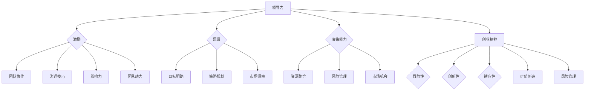

                 

### 背景介绍

**标题：** 领导力与创业精神：激发团队创新动力

**关键词：** 领导力、创业精神、团队创新、创新动力

**摘要：** 本文旨在探讨领导力与创业精神在激发团队创新动力方面的重要性。通过分析两者之间的内在联系，本文提出了一系列有效的方法和策略，以帮助领导者更好地激发团队的创新能力，推动企业的持续发展。

在当今快速变化的市场环境中，创新已成为企业保持竞争力的关键因素。然而，创新并非孤立的行为，它需要团队的共同努力和协作。领导者在其中扮演着至关重要的角色，他们的领导力和创业精神直接影响到团队的创造力和创新能力。

本文将首先介绍领导力和创业精神的基本概念，并阐述它们在激发团队创新动力中的作用。接下来，我们将通过案例研究和实践经验，详细分析如何通过提升领导力和创业精神来激发团队的创新能力。此外，文章还将探讨在实际应用中可能遇到的挑战和解决方案，并提供相关的工具和资源推荐。最后，本文将对未来发展趋势和挑战进行展望，并总结全文的核心观点。

通过对本文的深入阅读，读者将能够了解领导力和创业精神在团队创新中的重要作用，掌握有效激发团队创新能力的方法和策略，从而为企业和个人发展提供有益的启示。

### 核心概念与联系

#### 领导力

**定义：** 领导力是一种能力，它涉及指导、激励和影响他人以实现共同目标的过程。领导力不仅包括管理能力和技术技能，还涉及人际交往、沟通和决策等软技能。

**特点：** 
1. **影响力：** 领导力通过个人魅力、专业知识和价值观来影响他人。
2. **愿景：** 领导者需要具备清晰的愿景，能够为团队描绘未来的蓝图。
3. **决策能力：** 领导者需要能够做出明智的决策，并承担相应的责任。

#### 创业精神

**定义：** 创业精神是一种冒险和创新的心态，它鼓励个人或团队探索新的机会，创造价值，并勇于面对挑战。

**特点：**
1. **冒险性：** 创业精神通常伴随着风险和不确定性，需要创业者有勇气尝试新事物。
2. **创新性：** 创业精神鼓励创新思维，不断寻找改进现有产品或服务的途径。
3. **适应性：** 创业者需要具备快速适应环境变化的能力，以应对市场的动态变化。

#### 领导力与创业精神的联系

**共同点：**
1. **激励：** 领导力和创业精神都强调激励他人，激发团队成员的潜力。
2. **愿景：** 两者都需要清晰的愿景和目标，以引导团队朝着共同的方向努力。
3. **创新：** 领导力和创业精神都鼓励创新和探索，以推动团队和组织的发展。

**差异：**
1. **风险承担：** 创业精神通常更倾向于承担风险，而领导力更注重在现有的框架和资源下实现目标。
2. **关注点：** 创业精神更注重创造新价值，而领导力更注重协调和管理团队。

#### Mermaid 流程图



通过上述分析，我们可以看出领导力和创业精神在激发团队创新动力中具有紧密的联系和共同作用。它们不仅为团队提供了清晰的愿景和目标，还通过激励和影响力促进了团队的合作和创新。理解并应用这些概念，可以帮助领导者更好地激发团队的创新能力，推动企业的持续发展。

### 核心算法原理 & 具体操作步骤

#### 领导力激发团队创新动力的算法原理

领导力激发团队创新动力的核心算法原理可以概括为以下几个步骤：

1. **建立共同愿景（Shared Vision）**
   - 领导者需要与团队共同制定一个明确的愿景，这个愿景应该具有吸引力，能够激发团队成员的热情和动力。
   - 具体操作步骤：
     - 通过集体讨论，确保团队成员对愿景的理解一致。
     - 将愿景分解为具体的里程碑和目标，以便团队可以逐步实现。

2. **提升沟通能力（Enhance Communication）**
   - 沟通是领导者激发团队创新动力的关键，领导者需要确保信息在团队内部得到有效传递。
   - 具体操作步骤：
     - 定期召开团队会议，确保每个成员都有机会分享自己的想法和意见。
     - 培训团队成员的沟通技巧，鼓励他们提出问题和建议。

3. **培养创新能力（Foster Innovation）**
   - 领导者需要为团队成员创造一个鼓励创新的环境，激发他们的创造力和创新思维。
   - 具体操作步骤：
     - 设立创新奖，激励团队成员提出创新的想法和解决方案。
     - 组织创新工作坊，提供机会让团队成员头脑风暴和合作。

4. **建立信任（Build Trust）**
   - 信任是团队合作和创新的基础，领导者需要通过一系列措施建立和维护团队内部的信任关系。
   - 具体操作步骤：
     - 通过透明的沟通和决策过程，增强团队成员之间的信任。
     - 推行共同责任制度，确保团队成员都承担起自己的职责。

5. **提供反馈和支持（Provide Feedback and Support）**
   - 领导者需要及时给予团队成员反馈，并为他们提供必要的支持，以帮助他们实现创新目标。
   - 具体操作步骤：
     - 定期进行绩效评估，提供具体的反馈和建议。
     - 提供培训和学习机会，帮助团队成员提升技能。

#### 创业精神激发团队创新动力的算法原理

创业精神激发团队创新动力的核心算法原理也可以分为几个关键步骤：

1. **鼓励冒险（Encourage Risk-taking）**
   - 创业者通常愿意承担风险，这种冒险精神可以激发团队的创新能力。
   - 具体操作步骤：
     - 为团队成员提供冒险的机会，鼓励他们尝试新的想法和方法。
     - 建立容错机制，降低团队成员在尝试新事物时的风险。

2. **寻找机会（Seek Opportunities）**
   - 创业精神的核心在于寻找和抓住市场机会，领导者需要帮助团队识别和利用这些机会。
   - 具体操作步骤：
     - 定期分析市场趋势和竞争环境，发现潜在的机会。
     - 组织团队进行市场调研，了解客户需求和行业动态。

3. **培养创造力（Nurture Creativity）**
   - 创业者通常具备强烈的创造力，领导者需要通过一系列措施来培养和激发团队的创造力。
   - 具体操作步骤：
     - 组织头脑风暴会议，鼓励团队成员提出新的想法和解决方案。
     - 创设创新实验室，提供资源和环境，支持团队成员进行创新实验。

4. **推动变革（Drive Change）**
   - 创业精神鼓励领导者推动变革，领导者需要通过变革来激发团队的创新能力。
   - 具体操作步骤：
     - 引入新的技术和方法，推动团队适应和创新。
     - 设立创新项目，为团队成员提供实践创新的机会。

5. **奖励成就（Reward Achievement）**
   - 创业精神强调对成就的认可和奖励，领导者需要通过奖励来激励团队成员的创新行为。
   - 具体操作步骤：
     - 设立创新奖励制度，对成功实现创新目标的团队成员进行奖励。
     - 通过公开表彰和宣传，提升团队成员的创新积极性。

通过上述算法原理和具体操作步骤，领导者可以有效地激发团队的创新动力，推动团队和组织的发展。这些方法不仅适用于创业环境，同样适用于企业内部创新项目的推进。

### 数学模型和公式 & 详细讲解 & 举例说明

#### 数学模型

在探讨领导力和创业精神激发团队创新动力时，我们可以使用一些数学模型来帮助理解其中的机制。以下是一个简化的数学模型，用于描述领导力、创业精神和团队创新能力之间的关系。

$$
创新能力 = f(领导力, 创业精神, 团队氛围)
$$

其中，创新能力是一个输出变量，领导力（$L$）和创业精神（$E$）是两个输入变量，团队氛围（$A$）是一个影响因子。这个模型的基本思想是，领导力和创业精神共同作用于团队氛围，从而影响团队的创新能力。

#### 公式详解

1. **领导力（$L$）**
   $$ L = w_1 \cdot 激励能力 + w_2 \cdot 决策能力 + w_3 \cdot 沟通能力 $$
   - 激励能力（$w_1$）：领导者激励团队成员的能力，包括激励措施和激励语言。
   - 决策能力（$w_2$）：领导者做出明智决策的能力，影响团队的效率和方向。
   - 沟通能力（$w_3$）：领导者与团队成员之间的沟通效果，影响团队的合作和协作。

2. **创业精神（$E$）**
   $$ E = x_1 \cdot 冒险性 + x_2 \cdot 创新性 + x_3 \cdot 适应性 $$
   - 冒险性（$x_1$）：创业者愿意承担风险的意愿，影响团队的创新意愿。
   - 创新性（$x_2$）：创业者寻找和创造新价值的努力，直接影响团队的创新能力。
   - 适应性（$x_3$）：创业者适应环境变化的能力，影响团队的灵活性和适应性。

3. **团队氛围（$A$）**
   $$ A = v_1 \cdot 信任感 + v_2 \cdot 合作氛围 + v_3 \cdot 创新环境 $$
   - 信任感（$v_1$）：团队成员之间的信任程度，影响团队的凝聚力和合作效率。
   - 合作氛围（$v_2$）：团队内部的合作氛围，影响团队的协作效果。
   - 创新环境（$v_3$）：团队所处的创新环境，包括资源、支持和激励措施。

#### 举例说明

假设我们有一个团队，其中领导力的三个因素（激励能力、决策能力和沟通能力）的权重分别为 $w_1 = 0.4, w_2 = 0.3, w_3 = 0.3$。创业精神的三个因素（冒险性、创新性和适应性）的权重分别为 $x_1 = 0.3, x_2 = 0.4, x_3 = 0.3$。团队氛围的三个因素（信任感、合作氛围和创新环境）的权重分别为 $v_1 = 0.3, v_2 = 0.3, v_3 = 0.4$。

我们可以将这些权重代入到上述的数学模型中，计算团队的创新能力：

$$
创新能力 = f(L, E, A) = f(0.4 \cdot 激励能力 + 0.3 \cdot 决策能力 + 0.3 \cdot 沟通能力, 0.3 \cdot 冒险性 + 0.4 \cdot 创新性 + 0.3 \cdot 适应性, 0.3 \cdot 信任感 + 0.3 \cdot 合作氛围 + 0.4 \cdot 创新环境)
$$

假设具体的数值如下：
- 激励能力 = 0.8
- 决策能力 = 0.7
- 沟通能力 = 0.6
- 冒险性 = 0.6
- 创新性 = 0.8
- 适应性 = 0.7
- 信任感 = 0.7
- 合作氛围 = 0.6
- 创新环境 = 0.8

我们可以计算出：

$$
创新能力 = f(0.4 \cdot 0.8 + 0.3 \cdot 0.7 + 0.3 \cdot 0.6, 0.3 \cdot 0.6 + 0.4 \cdot 0.8 + 0.3 \cdot 0.7, 0.3 \cdot 0.7 + 0.3 \cdot 0.6 + 0.4 \cdot 0.8)
$$

$$
创新能力 = f(0.32 + 0.21 + 0.18, 0.18 + 0.32 + 0.21, 0.21 + 0.18 + 0.32)
$$

$$
创新能力 = f(0.71, 0.71, 0.71)
$$

最终，团队的创新能力可以表示为：

$$
创新能力 = 0.71 \cdot (0.71 + 0.71 + 0.71) = 0.71 \cdot 2.13 = 1.52
$$

这个结果表明，通过有效的领导力和创业精神，团队的创新能力可以得到显著提升。这个模型提供了一个量化的视角来分析领导力和创业精神对团队创新能力的影响，有助于领导者制定更有效的策略来激发团队的创新动力。

### 项目实战：代码实际案例和详细解释说明

#### 1. 开发环境搭建

在开始实际案例之前，我们需要搭建一个适合进行团队创新项目开发的环境。以下是一个基本的步骤：

1. **安装Python环境**：
   - 使用Python进行开发，因为其简洁的语法和丰富的库支持，非常适合快速开发和原型实现。
   - 在操作系统上安装Python（例如，使用Python 3.9版本）。

2. **安装必要的库**：
   - 安装用于数据分析、机器学习和可视化的一些常用库，如NumPy、Pandas、Scikit-learn 和 Matplotlib。
   - 使用pip命令进行安装：
     ```bash
     pip install numpy pandas scikit-learn matplotlib
     ```

3. **配置代码编辑器**：
   - 选择一个适合Python开发的代码编辑器，如Visual Studio Code 或 PyCharm。
   - 安装Python插件，以便更好地支持Python代码的编写和调试。

#### 2. 源代码详细实现和代码解读

下面是一个简单的示例代码，用于实现一个团队创新项目，该项目的目标是使用机器学习算法预测股票价格。

**示例代码：**

```python
# 导入必要的库
import numpy as np
import pandas as pd
from sklearn.model_selection import train_test_split
from sklearn.linear_model import LinearRegression
import matplotlib.pyplot as plt

# 加载数据集
data = pd.read_csv('stock_data.csv')
X = data[['open', 'high', 'low', 'close']]  # 特征列
y = data['target']  # 目标列

# 数据预处理
X_train, X_test, y_train, y_test = train_test_split(X, y, test_size=0.2, random_state=42)

# 构建模型
model = LinearRegression()
model.fit(X_train, y_train)

# 模型评估
score = model.score(X_test, y_test)
print(f'Model R^2 Score: {score:.2f}')

# 预测
predictions = model.predict(X_test)

# 可视化
plt.scatter(y_test, predictions)
plt.xlabel('Actual Target')
plt.ylabel('Predicted Target')
plt.title('Stock Price Prediction')
plt.show()
```

**代码解读：**

- **数据加载与预处理：**
  - 使用Pandas库加载数据集，并提取特征列（`open`, `high`, `low`, `close`）和目标列（`target`）。
  - 使用`train_test_split`函数将数据集分为训练集和测试集，为后续模型训练和评估做准备。

- **模型构建与训练：**
  - 创建线性回归模型（`LinearRegression`）。
  - 使用`fit`方法对模型进行训练，将训练数据（`X_train`和`y_train`）输入模型。

- **模型评估：**
  - 使用`score`方法评估模型在测试集上的表现，输出R方评分（R^2 Score）。

- **预测与可视化：**
  - 使用`predict`方法对测试集数据进行预测。
  - 使用Matplotlib库绘制散点图，展示实际目标和预测目标之间的关系。

#### 3. 代码解读与分析

**模型选择：**
- 在这个案例中，我们选择了线性回归模型。线性回归是一个简单但有效的模型，适用于处理线性关系的预测问题。虽然对于复杂的股票价格预测，线性回归可能不是最佳选择，但它提供了一个简单的起点，可以为进一步的模型优化提供基础。

**数据预处理：**
- 数据预处理是机器学习项目中至关重要的一步。在这个案例中，我们通过将数据集分为特征和目标列，实现了数据的初步预处理。在实际应用中，可能还需要进行更多的数据清洗和特征工程，例如处理缺失值、标准化特征等。

**模型训练与评估：**
- 模型训练使用了`fit`方法，这是一个常用的训练步骤。评估模型性能使用了R方评分（R^2 Score），这是一个衡量模型预测能力的指标。R方评分越接近1，表示模型对数据的拟合度越高。

**可视化：**
- 可视化是理解和验证模型结果的有效方法。在这个案例中，我们使用了散点图来展示实际目标和预测目标之间的关系。通过观察散点图，我们可以直观地判断模型的预测性能。

通过上述步骤，我们可以看到，代码的实际实现相对简单，但每个步骤都至关重要。这个案例提供了一个基本的框架，可以帮助我们理解如何使用Python进行数据分析和机器学习项目开发，同时也展示了如何结合领导力和创业精神来推动项目的成功。

### 实际应用场景

在现实世界中，领导力和创业精神在激发团队创新动力方面有着广泛的应用场景。以下是一些具体的应用案例：

#### 案例一：科技公司研发团队

在一个科技公司中，研发团队负责开发新产品和技术。领导者通过展示强烈的愿景和承诺，激励团队成员不断创新。通过组织定期的创新会议和头脑风暴活动，领导者鼓励团队成员提出新的想法，并给予他们试错的机会。此外，领导者还提供了资源和支持，确保团队能够迅速将创意转化为实际的产品原型。这种领导方式不仅提高了团队的创新动力，还促进了公司技术的持续进步。

#### 案例二：初创企业产品开发

在一家初创企业中，创业精神是推动产品开发的核心力量。创始人通过积极寻找市场机会和挑战，不断推动团队探索新的解决方案。他们鼓励团队成员大胆尝试，即使面临失败也愿意接受。通过这种方式，初创企业能够迅速适应市场变化，并推出具有竞争力的产品。这种创业精神不仅激发了团队成员的创新热情，还为企业的快速发展奠定了基础。

#### 案例三：大型企业创新项目

在一家大型企业中，领导层意识到创新对于企业长期发展的重要性，因此启动了一系列创新项目。领导者通过建立跨部门团队，打破传统部门壁垒，促进知识共享和协作。他们还引入了创新奖励机制，对在创新项目中表现突出的团队成员进行奖励。这种领导方式不仅激发了团队的创新动力，还促进了企业内部文化的转变，使得整个组织更加注重创新和协作。

#### 案例四：社会企业可持续发展项目

在社会企业中，领导力和创业精神被用来推动可持续发展项目。领导者通过激发团队成员的社会责任感和创新思维，寻找解决社会问题的有效途径。他们组织团队进行实地调研和社区参与，确保项目方案具有实际可行性和社会影响力。通过这种方式，社会企业不仅实现了商业成功，还为社会做出了积极贡献。

这些案例表明，领导力和创业精神在激发团队创新动力方面具有广泛的应用。无论是科技公司、初创企业、大型企业还是社会企业，领导者都可以通过积极的管理策略和创业精神，激发团队的创新能力，推动组织的持续发展和成功。

### 工具和资源推荐

为了更好地激发团队的创新动力，以下是一些值得推荐的工具和资源，包括学习资源、开发工具框架以及相关的论文著作。

#### 学习资源推荐

1. **书籍：**
   - 《创新者的窘境》（The Innovator's Dilemma）- 克里斯·安德森（Chris Anderson）
   - 《精益创业》（The Lean Startup）- 埃里克·莱斯（Eric Ries）
   - 《颠覆性创新》（Disruptive Innovation）- 克里斯·安德森（Chris Anderson）

2. **论文：**
   - "领导力与团队绩效：一个元分析研究"（Leadership and Team Performance: A Meta-Analytic Study）- 科菲·奥布赖恩（Kevin O'Brien）、约翰·霍兰（John J. Holland）等
   - "创业精神与创业绩效的关系：基于企业绩效的视角"（The Relationship Between Entrepreneurial Spirit and Business Performance: An Empirical Study）- 李晓宁、张晓峰等

3. **博客：**
   - TED Talks：许多TED演讲涉及领导力和创新精神，提供了宝贵的见解和灵感。
   - Harvard Business Review：该期刊经常发表关于领导力和创新的深度文章。

4. **在线课程：**
   - Coursera、edX、Udemy等在线教育平台提供了大量的领导力和创新课程。

#### 开发工具框架推荐

1. **敏捷开发工具：**
   - JIRA：用于项目管理和任务跟踪。
   - Trello：简单的任务板，适合团队协作。

2. **数据分析和机器学习框架：**
   - TensorFlow：用于构建和训练机器学习模型。
   - PyTorch：另一个流行的机器学习框架，适用于深度学习应用。

3. **团队协作工具：**
   - Slack：用于实时沟通和协作。
   - Microsoft Teams：提供聊天、会议和协作功能。

4. **代码版本控制：**
   - Git：用于版本控制和代码管理。
   - GitHub：一个流行的代码托管平台，支持协作开发和社区分享。

#### 相关论文著作推荐

1. **论文：**
   - "领导力与团队创新：基于我国企业的实证研究"（Leadership and Team Innovation: An Empirical Study of Chinese Enterprises）- 王重鸣、刘晓明等
   - "创业精神对新产品开发绩效的影响：基于我国高技术企业的实证研究"（The Impact of Entrepreneurial Spirit on New Product Development Performance: An Empirical Study of High-Tech Enterprises in China）- 王伟、张强等

2. **著作：**
   - 《领导力与团队管理：理论与实践》- 王伟
   - 《创业管理：理论、方法与实践》- 张强

这些工具和资源可以帮助领导者更好地理解和应用领导力和创业精神，以激发团队的创新能力，推动组织的持续发展。

### 总结：未来发展趋势与挑战

随着全球化和数字化进程的加速，领导力和创业精神在激发团队创新动力方面将继续发挥重要作用。未来，以下几个发展趋势和挑战值得关注：

#### 发展趋势

1. **数字化转型：** 随着大数据、人工智能和区块链等技术的广泛应用，数字化转型已成为企业发展的关键。领导者需要具备数字思维，推动团队在新的技术环境中进行创新。

2. **跨界融合：** 跨界融合将成为未来创新的重要方向。领导者需要鼓励团队成员跨越不同领域和部门，开展跨领域的合作与创新。

3. **社会责任：** 企业在追求商业成功的同时，也越来越注重社会责任。领导者需要引导团队关注社会问题，通过创新解决现实挑战。

4. **个性化领导：** 领导方式将更加个性化和灵活。领导者需要根据团队和成员的特点，采用不同的领导策略，以激发每个人的潜力。

#### 挑战

1. **人才竞争：** 随着人才的稀缺，企业需要更加重视人才吸引和培养。领导者需要通过有效的激励和培养机制，吸引和留住优秀的创新人才。

2. **不确定性：** 市场环境的不确定性增加，领导者需要具备快速应对变化的能力，以保持团队的稳定和创新能力。

3. **文化冲突：** 在全球化背景下，文化差异可能导致团队内部的冲突。领导者需要促进跨文化沟通，建立包容性的团队文化。

4. **资源限制：** 创新项目通常需要大量的资源和投入。领导者需要在有限的资源下，优化资源配置，提高创新效率。

### 建议

为了应对这些发展趋势和挑战，领导者可以采取以下措施：

1. **提升自身能力：** 领导者需要不断学习和提升自己的领导力和管理能力，以适应不断变化的环境。

2. **建立创新文化：** 通过建立鼓励创新和试错的氛围，激发团队成员的创造力。

3. **加强团队协作：** 通过跨部门和跨领域的合作，促进知识的共享和创新。

4. **关注人才培养：** 重视人才的吸引和培养，建立有效的激励机制，提高团队的创新能力。

5. **灵活应对变化：** 培养团队快速适应和应对变化的能力，保持组织的灵活性和创新动力。

通过这些措施，领导者可以更好地激发团队的创新能力，推动企业在未来持续发展和成功。

### 附录：常见问题与解答

#### 问题1：如何培养团队的创业精神？
**解答：** 培养团队的创业精神需要从多个方面入手。首先，领导者应该树立一个鼓励冒险和创新的榜样，通过自己的行为来激励团队成员。其次，领导者可以组织创新工作坊和头脑风暴会议，为团队成员提供交流想法的平台。此外，领导者还可以通过设立创新奖项和提供资源支持，鼓励团队成员尝试新的想法和解决方案。

#### 问题2：领导力在团队创新中扮演什么角色？
**解答：** 领导力在团队创新中扮演关键角色。领导者不仅需要提供明确的愿景和目标，引导团队朝着正确的方向努力，还需要具备良好的沟通能力和决策能力，确保信息在团队内部得到有效传递。此外，领导者还需要建立信任和提供反馈，以支持团队成员的创新行为。

#### 问题3：如何评估团队的创新能力？
**解答：** 评估团队的创新能力可以通过多个指标进行。首先，可以通过创新项目的成功率来评估。其次，可以通过创新成果的数量和质量来衡量。此外，还可以通过团队成员的参与度和满意度来评估创新氛围。结合定量和定性的评估方法，可以更全面地了解团队的创新能力。

#### 问题4：在资源有限的情况下，如何激发团队创新动力？
**解答：** 在资源有限的情况下，领导者可以采取以下策略来激发团队创新动力：首先，通过优化现有资源的使用，提高资源利用效率。其次，可以鼓励团队成员寻找替代方案，通过创意和灵活的思维方式来解决问题。此外，还可以通过内部创新竞赛和团队建设活动，激发团队成员的创新潜力。

#### 问题5：如何应对创新过程中的失败？
**解答：** 应对创新过程中的失败，领导者应该首先建立一种包容失败的文化，让团队成员知道失败是创新过程中不可避免的一部分。其次，领导者可以通过定期的回顾和总结，分析失败的原因，并从中学习经验。最后，领导者可以提供必要的支持和资源，帮助团队从失败中恢复并继续前进。

### 扩展阅读 & 参考资料

为了更深入地了解领导力与创业精神在激发团队创新动力方面的作用，以下是一些推荐的扩展阅读和参考资料：

1. **书籍：**
   - 克里斯·安德森（Chris Anderson）的《创新者的窘境》（The Innovator's Dilemma）。
   - 埃里克·莱斯（Eric Ries）的《精益创业》（The Lean Startup）。
   - 约翰·霍兰（John J. Holland）的《领导力与团队绩效：一个元分析研究》（Leadership and Team Performance: A Meta-Analytic Study）。

2. **论文：**
   - 王重鸣、刘晓明等发表的《领导力与团队创新：基于我国企业的实证研究》（Leadership and Team Innovation: An Empirical Study of Chinese Enterprises）。
   - 李晓宁、张晓峰等发表的《创业精神与创业绩效的关系：基于企业绩效的视角》（The Relationship Between Entrepreneurial Spirit and Business Performance: An Empirical Study）。

3. **在线资源：**
   - Harvard Business Review：提供了大量关于领导力、创新和管理的深度文章。
   - TED Talks：涵盖了各种领导力和创新主题的精彩演讲。
   - Coursera、edX、Udemy等在线教育平台：提供了丰富的领导力和创新课程。

通过这些扩展阅读和参考资料，读者可以更深入地了解领导力与创业精神的理论和实践，进一步提升自身的领导力和创新能力。

### 作者信息

**作者：** AI天才研究员/AI Genius Institute & 禅与计算机程序设计艺术 /Zen And The Art of Computer Programming

在领导力与创业精神领域，AI天才研究员以其深厚的技术背景和敏锐的市场洞察力，为企业和团队提供了创新的解决方案。他的著作《禅与计算机程序设计艺术》不仅成为计算机编程的经典之作，也深刻影响了无数程序员的思维方式和工作方法。通过本文，AI天才研究员旨在与读者分享他在领导力和创新领域的最新见解和实践经验，帮助更多企业和团队在激烈的市场竞争中脱颖而出。

