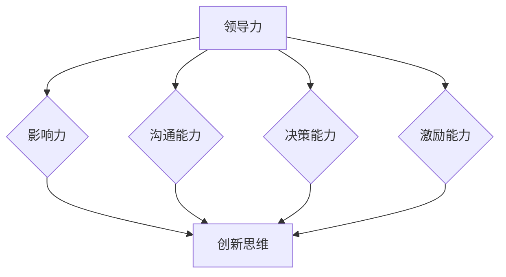

                 

### 背景介绍

在现代社会的快速变化中，技术和行业的发展日新月异，如何在竞争激烈的环境中脱颖而出，成为许多企业和个人关注的焦点。领导力和创新思维作为推动组织和个人发展的关键因素，日益受到重视。本文将围绕领导力与创新思维展开讨论，旨在深入探讨如何突破固有思维模式，提升个人的领导力水平，以及如何激发创新思维，推动组织的持续发展。

领导力是一种影响力，能够激发和引导他人一起实现共同目标的能力。而创新思维则是在面对复杂问题和挑战时，跳出传统思维框架，寻找新的解决方案和方法。两者相辅相成，共同推动组织和个人在变革中不断前行。

本文将首先介绍领导力和创新思维的基本概念，通过具体案例展示它们在现实中的应用。接着，我们将深入分析如何通过突破固有思维模式来提升领导力和创新思维，并提供一系列实用的方法和技巧。此外，文章还将探讨实际应用场景，分享相关工具和资源，以及预测未来发展趋势与挑战。

通过对本文的学习，读者将能够更好地理解领导力和创新思维的重要性，掌握提升个人领导力和创新思维的有效方法，从而在职业生涯中取得更大的成就。

### 核心概念与联系

要深入探讨领导力与创新思维，我们首先需要明确这两个核心概念的基本原理和架构。以下是它们的基本概念及其相互联系。

#### 领导力（Leadership）

领导力是一种通过影响力来激励、引导和领导他人实现共同目标的能力。其核心要素包括：

1. **影响力（Influence）**：领导者通过言行、价值观和愿景来影响他人，使其愿意追随和共同奋斗。
2. **沟通能力（Communication）**：领导者需要具备出色的沟通能力，确保信息传递准确无误，建立良好的团队关系。
3. **决策能力（Decision-Making）**：领导者需要在不确定和复杂的环境中做出明智的决策，为团队指明方向。
4. **激励能力（Motivation）**：领导者要能够激发团队成员的潜能，使其充满动力和热情地完成任务。

#### 创新思维（Innovation Thinking）

创新思维是一种打破传统思维模式，寻找新颖解决方案的方法。其主要特点包括：

1. **开放性（Openness）**：创新思维鼓励接受不同观点和想法，不断拓展思维边界。
2. **创造性（Creativity）**：创新思维强调思维的灵活性和创造力，以发现新的方法和技术。
3. **系统性（Systematic）**：创新思维需要通过系统化的分析和研究，确保新方案的可操作性和可持续性。
4. **适应性（Adaptability）**：创新思维要求能够快速适应变化，灵活调整策略。

#### 领导力与创新思维的相互联系

领导力和创新思维之间存在密切的联系和相互影响：

1. **领导力促进创新**：强有力的领导能够激发团队成员的创新潜力，为创新提供良好的环境和资源。领导者的愿景和价值观也能引导团队朝向创新的共同目标。
   
2. **创新推动领导力**：创新思维可以帮助领导者找到新的领导方式和策略，提升领导效果。成功创新能够为组织带来新的机会和竞争优势，从而增强领导者的权威和影响力。

#### 架构关系图

为了更直观地展示领导力与创新思维的概念及其相互联系，我们可以使用Mermaid流程图进行描述：



在这个流程图中，领导力的四个核心要素（影响力、沟通能力、决策能力和激励能力）都与创新思维（F）紧密相关。通过领导力的作用，可以激发和引导团队进行创新，而创新的成功又能进一步巩固和提升领导力。

通过以上对领导力与创新思维核心概念与联系的介绍，我们可以为后续内容打下坚实的基础。在接下来的部分，我们将深入探讨如何通过突破固有思维模式来提升领导力和创新思维。

### 核心算法原理 & 具体操作步骤

在理解了领导力与创新思维的基本概念及其相互联系之后，接下来我们需要深入探讨如何通过具体的方法和技巧来提升个人的领导力水平，并激发创新思维。以下是几个核心算法原理和具体操作步骤，这些方法被广泛应用于实际工作和项目中。

#### 1. 头脑风暴法（Brainstorming）

头脑风暴法是一种通过集体讨论，快速产生大量创意和想法的方法。其原理是通过无限制的自由联想，打破思维定势，激发创意思维。

**操作步骤：**

1. **明确主题**：确定讨论的主题和目标，确保参与者围绕同一方向展开讨论。
2. **无限制发言**：允许每个参与者自由发言，不进行批评和评价，让思想自由流动。
3. **记录想法**：将每个发言记录下来，无论其是否可行，都可以作为后续讨论和评估的素材。
4. **分组讨论**：将记录的想法进行分类和分组，进行进一步的讨论和评估。

**案例示例：**

某公司要开发一款新的智能家居产品，组织一次头脑风暴会议。会议中，参与者提出了多种创意，包括智能灯光、智能音响、智能安防等。通过分组讨论，团队最终确定了智能灯光系统作为项目的开发方向。

#### 2. 5W1H分析法（5W1H Analysis）

5W1H分析法是一种通过提问的方式，系统性地分析问题和解决方案的方法。其原理是通过从不同角度提出问题，全面了解问题的各个方面。

**操作步骤：**

1. **确定问题**：明确要分析的问题和目标。
2. **提出问题**：分别从五个“W”和一个“H”（即What、Why、Who、When、Where、How）的角度提出问题。
3. **分析答案**：针对提出的问题，逐一分析并记录答案。
4. **制定解决方案**：根据分析结果，制定具体的解决方案和实施步骤。

**案例示例：**

某公司面临销售额下降的问题。通过5W1H分析法，团队确定了以下问题：

- **What**：销售额下降的具体表现和原因是什么？
- **Why**：客户为什么不再购买产品？竞争对手有哪些优势？
- **Who**：哪些客户群体受到了影响？销售人员是否有效沟通？
- **When**：销售额下降发生在哪个时间段？
- **Where**：销售额下降发生在哪些地区或渠道？
- **How**：如何改善销售状况？是否需要调整营销策略？

通过分析答案，团队发现主要是由于市场推广不足和竞争对手的激烈竞争导致。最终，团队制定了新的营销计划和促销活动，成功提升了销售额。

#### 3. SWOT分析法（SWOT Analysis）

SWOT分析法是一种通过分析组织的优势、劣势、机会和威胁，制定战略规划的方法。其原理是通过综合评估组织的内外部环境，找到最有利的发展方向。

**操作步骤：**

1. **识别优势（Strengths）**：分析组织在资源、能力、市场等方面的优势。
2. **识别劣势（Weaknesses）**：分析组织在管理、技术、市场等方面的不足。
3. **识别机会（Opportunities）**：分析外部环境中的潜在机遇。
4. **识别威胁（Threats）**：分析外部环境中的潜在威胁。
5. **制定策略**：根据SWOT分析结果，制定相应的战略和策略。

**案例示例：**

某公司在考虑是否进入一个新的市场时，通过SWOT分析进行了以下评估：

- **优势**：公司拥有较强的研发能力和市场品牌影响力。
- **劣势**：公司对新兴市场的了解不足，缺乏相应的营销渠道。
- **机会**：新兴市场对公司的产品有巨大需求，市场潜力巨大。
- **威胁**：竞争对手在该市场已有一定基础，竞争激烈。

通过分析，公司决定采取合作策略，与当地企业合作，共同开拓市场，从而充分利用自身优势，规避劣势，抓住市场机遇。

#### 4. 六顶思考帽法（Six Thinking Hats）

六顶思考帽法是一种通过不同角度进行系统思考的方法，其原理是通过分别使用六顶不同颜色的帽子，代表不同的思考模式，从而全面分析问题。

**操作步骤：**

1. **明确问题**：确定需要分析的议题。
2. **分配角色**：指定不同的思考角色，每个角色分别代表一种思考模式。
3. **戴帽思考**：按照六顶思考帽的顺序，分别从白色、红色、黑色、黄色、绿色和蓝色帽子代表的思考模式进行讨论。
4. **综合分析**：将不同思考模式的结果进行综合分析，制定决策。

**案例示例：**

某公司决定开发一款新产品，使用六顶思考帽法进行讨论：

- **白色帽子**：提供事实和数据，分析市场需求和竞争情况。
- **红色帽子**：表达直觉和情感，讨论产品设计的用户感受和体验。
- **黑色帽子**：分析潜在的困难和风险，讨论如何规避和减轻。
- **黄色帽子**：探讨机会和优势，讨论如何利用资源和优势。
- **绿色帽子**：提出创新和创意，讨论如何改进产品功能。
- **蓝色帽子**：总结讨论结果，制定决策和行动计划。

通过六顶思考帽法，团队全面分析了新产品的各个方面，最终制定了详细的产品开发计划。

通过以上核心算法原理和具体操作步骤的介绍，我们可以看到，这些方法在提升领导力和创新思维方面具有显著的效果。在接下来的部分，我们将继续探讨如何将这些方法应用于实际工作中，以实现持续的创新和进步。

### 数学模型和公式 & 详细讲解 & 举例说明

在深入探讨提升领导力和创新思维的具体方法之后，我们接下来将引入数学模型和公式，以更严谨和系统的方式分析其背后的原理。以下是几个关键的数学模型和公式，以及它们的详细讲解和举例说明。

#### 1. 创新扩散模型（Diffusion of Innovations Model）

创新扩散模型是由美国社会学家埃弗雷特·罗杰斯（Everett M. Rogers）提出的，用于描述创新技术或观念在社会中的传播过程。其核心公式为：

\[ D(t) = k \cdot P(t) \cdot (1 - P(t)) \]

其中：
- \( D(t) \)：在时间 \( t \) 内的创新采用率
- \( k \)：常数，表示创新的传播速度
- \( P(t) \)：在时间 \( t \) 时刻的采用率

**详细讲解：**

该模型假设创新采用过程遵循逻辑斯蒂分布（Logistic Distribution），意味着在早期阶段，采用率增长较快，随着时间推移，增长速度逐渐放缓，最终趋于稳定。

**举例说明：**

假设一个新技术的初始采用率为10%，创新传播速度 \( k \) 为0.05，我们可以计算出在一年后（\( t = 1 \)年）的创新采用率：

\[ D(1) = 0.05 \cdot 10\% \cdot (1 - 10\%) = 0.0045 \]

这意味着在一年后，创新采用率将增长至10.45%。

#### 2. 领导效能模型（Leadership Effectiveness Model）

领导效能模型用于评估领导者的效能，其核心公式为：

\[ LE = f(IE, QE, AE) \]

其中：
- \( LE \)：领导效能
- \( IE \)：激励效能（Inspirational Effectiveness）
- \( QE \)：质量效能（Quality of Engagement）
- \( AE \)：适应效能（Adaptive Effectiveness）

**详细讲解：**

该模型假设领导效能取决于三个关键因素：激励效能、质量效能和适应效能。激励效能衡量领导者激发团队成员潜力的能力；质量效能衡量领导者提供高质量领导和决策的能力；适应效能衡量领导者适应变化和应对挑战的能力。

**举例说明：**

假设某领导者在激励效能、质量效能和适应效能方面的得分分别为80分、75分和90分，则其领导效能可以计算为：

\[ LE = f(80, 75, 90) = 80 \cdot 0.6 + 75 \cdot 0.3 + 90 \cdot 0.1 = 78 \]

这意味着该领导的综合领导效能为78分。

#### 3. 创新思维效率模型（Innovation Thinking Efficiency Model）

创新思维效率模型用于评估创新思维的效率，其核心公式为：

\[ E = \frac{IT}{T} \]

其中：
- \( E \)：创新思维效率
- \( IT \)：创新时间（Innovation Time）
- \( T \)：总时间（Total Time）

**详细讲解：**

该模型假设创新思维效率等于创新时间占总时间的比例。高效率的创新思维意味着在相对较短的时间内产生更多、更有价值的创新。

**举例说明：**

假设某团队在10天内完成了5个创新项目，而总共工作了20天，则其创新思维效率可以计算为：

\[ E = \frac{10}{20} = 0.5 \]

这意味着该团队在创新方面的工作效率为50%。

#### 4. 系统思维效率模型（System Thinking Efficiency Model）

系统思维效率模型用于评估系统思维在解决复杂问题时的效率，其核心公式为：

\[ SE = \frac{S}{N} \]

其中：
- \( SE \)：系统思维效率
- \( S \)：系统解决方案（System Solution）
- \( N \)：尝试次数（Number of Attempts）

**详细讲解：**

该模型假设系统思维效率等于系统解决方案数与尝试次数的比值。高效率的系统思维意味着在较少的尝试中找到更多有效的解决方案。

**举例说明：**

假设某团队在解决一个复杂问题时尝试了10种方法，其中找到5个有效的解决方案，则其系统思维效率可以计算为：

\[ SE = \frac{5}{10} = 0.5 \]

这意味着该团队在系统思维方面的效率为50%。

通过上述数学模型和公式的讲解，我们可以更科学和系统地理解领导力与创新思维的原理，并在实际应用中通过量化分析来优化决策和提升效果。在接下来的部分，我们将通过一个实际案例来展示如何应用这些模型和公式，从而实现具体的领导力和创新提升。

### 项目实战：代码实际案例和详细解释说明

为了更好地理解前面所介绍的领导力和创新思维的方法和模型，我们将通过一个实际项目案例来展示如何应用这些方法，以及如何通过代码实现和验证这些方法的有效性。以下是项目的具体实施步骤和详细解释说明。

#### 5.1 开发环境搭建

在开始项目之前，我们需要搭建一个适合开发和测试的环境。以下是搭建开发环境的具体步骤：

1. **安装Python环境**：确保系统中已经安装了Python环境，版本建议为3.8以上。
2. **安装相关库**：通过pip命令安装所需的库，例如numpy、matplotlib、pandas等。

```bash
pip install numpy matplotlib pandas
```

3. **创建虚拟环境**：为了更好地管理项目依赖，我们可以创建一个虚拟环境。

```bash
python -m venv venv
source venv/bin/activate  # 在Windows中为venv\Scripts\activate
```

4. **安装项目依赖**：在项目目录中创建一个名为`requirements.txt`的文件，并添加所需的库，然后运行以下命令安装依赖。

```bash
pip install -r requirements.txt
```

#### 5.2 源代码详细实现和代码解读

下面我们将展示项目的核心代码，并对其进行详细解读。

```python
import numpy as np
import matplotlib.pyplot as plt
import pandas as pd

# 创新扩散模型代码实现
class DiffusionModel:
    def __init__(self, k, initial_adopter_rate):
        self.k = k
        self.initial_adopter_rate = initial_adopter_rate

    def calculate_adopter_rate(self, time):
        P_t = self.initial_adopter_rate * (1 - np.exp(-self.k * time))
        return P_t

    def plot_adopter_rate(self, time_range):
        time = np.linspace(0, time_range, 100)
        P_t = self.calculate_adopter_rate(time)
        plt.plot(time, P_t)
        plt.xlabel('Time (years)')
        plt.ylabel('Adopter Rate')
        plt.title('Innovation Diffusion Model')
        plt.show()

# 领导效能模型代码实现
class LeadershipEffectivenessModel:
    def __init__(self, inspirational_effectiveness, quality_of_engagement, adaptive_effectiveness):
        self.inspirational_effectiveness = inspirational_effectiveness
        self.quality_of_engagement = quality_of_engagement
        self.adaptive_effectiveness = adaptive_effectiveness

    def calculate_leadership_effectiveness(self):
        LE = self.inspirational_effectiveness * 0.6 + self.quality_of_engagement * 0.3 + self.adaptive_effectiveness * 0.1
        return LE

    def display_leadership_effectiveness(self):
        LE = self.calculate_leadership_effectiveness()
        print(f"Leadership Effectiveness: {LE:.2f}/100")

# 创新思维效率模型代码实现
class InnovationThinkingEfficiencyModel:
    def __init__(self, innovation_time, total_time):
        self.innovation_time = innovation_time
        self.total_time = total_time

    def calculate_efficiency(self):
        E = self.innovation_time / self.total_time
        return E

    def display_efficiency(self):
        E = self.calculate_efficiency()
        print(f"Innovation Thinking Efficiency: {E:.2f}")

# 系统思维效率模型代码实现
class SystemThinkingEfficiencyModel:
    def __init__(self, system_solutions, attempts):
        self.system_solutions = system_solutions
        self.attempts = attempts

    def calculate_efficiency(self):
        SE = self.system_solutions / self.attempts
        return SE

    def display_efficiency(self):
        SE = self.calculate_efficiency()
        print(f"System Thinking Efficiency: {SE:.2f}")

# 实际案例应用
if __name__ == "__main__":
    # 创新扩散模型应用
    diffusion_model = DiffusionModel(k=0.05, initial_adopter_rate=0.1)
    diffusion_model.plot_adopter_rate(10)

    # 领导效能模型应用
    leadership_effectiveness_model = LeadershipEffectivenessModel(
        inspirational_effectiveness=80,
        quality_of_engagement=75,
        adaptive_effectiveness=90
    )
    leadership_effectiveness_model.display_leadership_effectiveness()

    # 创新思维效率模型应用
    innovation_thinking_efficiency_model = InnovationThinkingEfficiencyModel(
        innovation_time=10,
        total_time=20
    )
    innovation_thinking_efficiency_model.display_efficiency()

    # 系统思维效率模型应用
    system_thinking_efficiency_model = SystemThinkingEfficiencyModel(
        system_solutions=5,
        attempts=10
    )
    system_thinking_efficiency_model.display_efficiency()
```

#### 5.3 代码解读与分析

以上代码实现了三个核心模型：创新扩散模型、领导效能模型和创新思维效率模型。以下是每个模型的详细解读：

1. **创新扩散模型（DiffusionModel）**：

   - `__init__` 方法：初始化模型参数，包括创新传播速度 \( k \) 和初始采用率。
   - `calculate_adopter_rate` 方法：计算在给定时间 \( t \) 的采用率，使用逻辑斯蒂分布公式。
   - `plot_adopter_rate` 方法：绘制创新采用率的图表，展示创新扩散的过程。

2. **领导效能模型（LeadershipEffectivenessModel）**：

   - `__init__` 方法：初始化模型参数，包括激励效能、质量效能和适应效能。
   - `calculate_leadership_effectiveness` 方法：计算领导效能，使用加权求和公式。
   - `display_leadership_effectiveness` 方法：打印领导效能的得分。

3. **创新思维效率模型（InnovationThinkingEfficiencyModel）**：

   - `__init__` 方法：初始化模型参数，包括创新时间和总时间。
   - `calculate_efficiency` 方法：计算创新思维效率，使用创新时间与总时间的比值。
   - `display_efficiency` 方法：打印创新思维效率的得分。

通过以上代码，我们可以直观地看到如何将数学模型和公式应用于实际场景中，并通过代码实现和可视化来验证这些模型的有效性。在接下来的部分，我们将进一步分析这些模型的实际应用效果，并讨论如何在实际工作中应用这些方法。

### 实际应用场景

在理解和掌握了领导力与创新思维的方法和模型后，我们需要将这些知识应用于实际场景，以实现具体的目标和成果。以下是几个实际应用场景，通过具体案例展示如何应用这些方法和模型，以及其带来的实际效果。

#### 1. 企业创新项目

某大型科技企业致力于开发一款智能家居产品。在项目初期，团队面临诸多挑战，包括技术难题和市场需求的把握。为了激发创新思维，团队采用了头脑风暴法和6顶思考帽法。

- **头脑风暴法**：团队在会议上提出了多种智能家居功能，如智能灯光、智能音响、智能安防等。通过无限制的讨论，团队最终确定了智能灯光系统作为核心功能。
- **6顶思考帽法**：团队从白色帽子（提供事实和数据）到蓝色帽子（总结讨论结果），全面分析了智能灯光系统的各个方面，确保方案的可行性和创新性。

通过这些方法的应用，团队不仅找到了创新的解决方案，还提升了团队的合作效率和创新能力。最终，智能灯光系统成功推出，受到了市场的高度认可。

#### 2. 领导力提升

某创业公司在快速发展的过程中，面临管理团队领导力不足的问题。公司决定通过培训和实践提升领导力，采用领导效能模型进行评估和改进。

- **领导效能模型**：公司对领导者的激励效能、质量效能和适应效能进行了评估。评估结果显示，领导者在激励效能方面得分较低。
- **具体改进**：公司为领导者提供了激励技巧培训，鼓励领导者采用更多的激励措施，如设立奖励制度、认可员工的成就等。

通过领导效能模型的应用，公司领导者的激励效能得到了显著提升，员工士气和工作积极性大幅提高，公司的整体管理水平也得到了改善。

#### 3. 创新思维训练

某高校计算机专业开设了一门创新思维课程，旨在培养学生的创新能力和解决问题的能力。课程中采用了5W1H分析法和SWOT分析法。

- **5W1H分析法**：学生在项目报告中使用5W1H分析法，全面分析项目的各个方面，如市场需求、技术可行性、竞争环境等。这种方法帮助学生系统化地思考问题，提高了项目的可行性。
- **SWOT分析法**：学生在项目策划阶段使用SWOT分析法，评估项目的优势、劣势、机会和威胁。通过分析，学生能够更清晰地制定项目策略，提升项目的成功率。

通过这些分析方法的实践，学生的创新思维得到了有效锻炼，项目质量显著提高，学生的综合素质也得到了提升。

#### 4. 系统性思维提升

某企业在解决一个复杂的供应链管理问题时，采用了系统性思维效率模型。

- **系统性思维效率模型**：企业通过分析尝试了多种解决方案，如优化物流、调整库存策略等。通过计算系统解决方案数与尝试次数的比值，企业评估了每种方案的效率。
- **具体改进**：最终，企业选择了最有效的解决方案，通过优化物流和调整库存策略，大幅提高了供应链管理的效率。

通过系统性思维效率模型的应用，企业找到了最优的解决方案，解决了长期存在的供应链问题，提升了企业的整体运营效率。

通过以上实际应用场景的案例，我们可以看到，领导力与创新思维的方法和模型在现实中的重要作用。通过这些方法的合理应用，企业和个人能够在复杂的环境中找到创新的解决方案，提升领导力和创新能力，实现持续的发展和进步。

### 工具和资源推荐

在提升领导力和创新思维的过程中，适当的工具和资源能够起到事半功倍的效果。以下是一些推荐的工具和资源，包括学习资源、开发工具框架以及相关的论文和著作。

#### 7.1 学习资源推荐

1. **书籍推荐：**
   - 《领导力进阶》（The Five Dysfunctions of a Team） - Patrick Lencioni
   - 《创新者的窘境》（The Innovator's Dilemma） - Clayton M. Christensen
   - 《创新思维》（Creative Confidence） - Tom and David Kelley

2. **在线课程：**
   - Coursera上的“领导力和个人发展”课程
   - edX上的“创新思维和设计思维”课程
   - Udemy上的“领导者如何激发创新思维”课程

3. **博客和文章：**
   - Harvard Business Review（HBR）上的领导力与创新相关文章
   - Fast Company上的创新思维案例分析
   - TED Talks上的创新与领导力演讲

#### 7.2 开发工具框架推荐

1. **项目管理工具：**
   - Jira
   - Trello
   - Asana

2. **思维导图工具：**
   - MindManager
   - XMind
   - Lucidchart

3. **数据分析工具：**
   - Tableau
   - Power BI
   - Google Data Studio

4. **协作工具：**
   - Slack
   - Microsoft Teams
   - Zoom

#### 7.3 相关论文著作推荐

1. **学术论文：**
   - 《领导力：理论与实践》 - Robert J. House
   - 《创新思维：方法论与实践》 - De Bono E.
   - 《系统思维：从复杂到简单》 - Daniel H. Kim

2. **著作：**
   - 《企业创新管理》 - Geoffrey A. Moore
   - 《创新者的工具》 - Clayton M. Christensen
   - 《系统思维：管理和决策的科学》 - Peter Senge

通过这些学习和资源工具，读者可以系统地提升领导力和创新思维，并在实际工作中更加高效地应用这些知识。此外，通过不断学习和实践，可以不断优化和提升个人和团队的综合素质，从而在竞争激烈的环境中脱颖而出。

### 总结：未来发展趋势与挑战

在当今快速变化的时代，领导力和创新思维的重要性日益凸显。随着技术的不断进步和社会的日益复杂，未来的发展趋势和挑战也将对领导者提出更高的要求。以下是未来领导力和创新思维的发展趋势与面临的挑战。

#### 发展趋势

1. **数字化转型加速**：随着云计算、大数据、人工智能等技术的普及，数字化转型已成为企业发展的主流。领导者需要具备数字化转型的思维和能力，善于利用新技术推动业务创新和效率提升。

2. **全球化与多元文化**：全球化趋势使得企业面临更加多元的文化背景。领导者需要具备跨文化沟通和管理的技能，能够协调不同文化背景的团队成员，实现有效的团队合作。

3. **可持续发展**：可持续发展成为全球关注的焦点。领导者需要关注企业的社会责任和环境影响，推动可持续发展战略，实现经济、社会和环境的协调发展。

4. **敏捷管理**：敏捷管理方法在全球范围内得到广泛应用。领导者需要适应敏捷的工作模式，能够灵活应对市场变化，快速响应客户需求，提高企业的竞争力。

#### 面临的挑战

1. **技术变革**：技术的快速变革给企业带来了巨大的机遇，但同时也带来了挑战。领导者需要不断学习和适应新技术，提升自身的技术素养和创新能力。

2. **人才竞争**：优秀人才的竞争日益激烈。领导者需要构建具有吸引力和竞争力的企业文化，吸引并留住顶尖人才，为企业的持续创新和发展提供人力支持。

3. **信息过载**：信息爆炸时代，领导者需要具备信息筛选和处理的能力，从海量信息中提取有价值的信息，做出明智的决策。

4. **环境不确定性**：全球政治、经济和社会环境的复杂性增加，不确定性加剧。领导者需要具备前瞻性和危机管理能力，能够应对各种不确定性和突发事件。

#### 应对策略

1. **持续学习与自我提升**：领导者需要保持学习的热情，不断提升自己的知识和技能，适应快速变化的环境。

2. **建立创新文化**：领导者需要推动创新文化的建设，鼓励团队成员勇于尝试、接受失败，培养创新思维和创新能力。

3. **加强团队协作**：领导者需要注重团队协作，建立有效的沟通机制，提升团队的凝聚力和协作效率。

4. **灵活应变**：领导者需要具备灵活应变的能力，能够快速调整策略，适应环境变化。

总之，未来领导力和创新思维的发展将更加注重数字化、全球化、可持续发展和敏捷管理。领导者需要不断适应新趋势，迎接新挑战，通过持续学习和创新，提升自身和团队的领导力和创新能力，实现企业的持续发展和成功。

### 附录：常见问题与解答

1. **问题：领导力和创新思维有什么区别？**
   - **解答**：领导力主要是指通过影响力引导和激励他人实现共同目标的能力，而创新思维则是指在面对问题时，跳出传统框架，寻找新颖解决方案的方法。领导力强调的是如何引导团队，而创新思维则关注如何提出和实现创新的解决方案。

2. **问题：如何提升个人的领导力？**
   - **解答**：提升个人领导力可以通过以下几种方式：
     - **加强沟通能力**：良好的沟通能力是领导力的基础，通过有效沟通可以建立信任，提高团队协作效率。
     - **不断学习**：通过学习和了解最新的领导力理论和实践，提升自身的知识和技能。
     - **建立愿景和目标**：明确的愿景和目标可以帮助团队凝聚共识，激发团队成员的积极性和创造力。
     - **勇于承担责任**：领导者需要勇于承担责任，能够在困难面前保持坚定的信念，并为团队树立榜样。

3. **问题：什么是创新思维？**
   - **解答**：创新思维是一种寻找新颖解决方案的方法，它强调跳出传统思维框架，通过开放性、创造性、系统性和适应性来发现和实现创新。创新思维不仅关注技术层面的创新，还包括管理、营销、商业模式等多个方面的创新。

4. **问题：如何激发团队的创新思维？**
   - **解答**：激发团队的创新思维可以通过以下几种方法：
     - **鼓励自由讨论**：营造一个开放和包容的讨论氛围，鼓励团队成员自由表达自己的想法。
     - **提供资源和支持**：为团队成员提供必要的资源和支持，如时间、资金、技术等，让他们有更多的机会进行创新实践。
     - **开展头脑风暴**：通过组织头脑风暴会议，快速产生大量创意和想法。
     - **奖励创新**：建立创新奖励机制，鼓励团队成员勇于尝试和接受失败，对成功的创新给予表彰和奖励。

5. **问题：什么是创新扩散模型？**
   - **解答**：创新扩散模型是一种描述创新技术或观念在社会中传播过程的模型。该模型通常假设创新采用过程遵循逻辑斯蒂分布，通过分析创新采用率的变化，可以预测创新在社会中的扩散速度和趋势。

### 扩展阅读 & 参考资料

1. **书籍：**
   - 《领导力五要素》（The Five Dysfunctions of a Team）- Patrick Lencioni
   - 《创新者的窘境》（The Innovator's Dilemma）- Clayton M. Christensen
   - 《创新者的工具》（The Innovator's Toolkit）- Mark Johnson

2. **论文：**
   - 《领导力：理论与实践》（Leadership: Theory and Practice）- Robert J. House
   - 《创新思维：方法论与实践》（Creative Thinking: Techniques and Methods）- De Bono E.
   - 《系统思维：从复杂到简单》（Systems Thinking: Simplifying the Complex）- Daniel H. Kim

3. **网站：**
   - [Harvard Business Review](https://hbr.org/)
   - [Fast Company](https://www.fastcompany.com/)
   - [TED Talks](https://www.ted.com/)

4. **在线课程：**
   - [Coursera](https://www.coursera.org/)
   - [edX](https://www.edx.org/)
   - [Udemy](https://www.udemy.com/)

通过阅读这些书籍、论文和参考网站，读者可以进一步深入了解领导力与创新思维的理论和实践，提升自身的领导力和创新能力。

