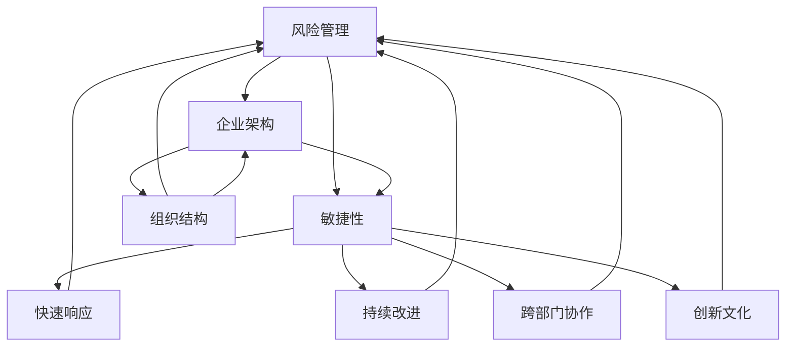

                 

### 背景介绍

在当今快速变化和竞争激烈的全球商业环境中，领导力与危机预防已成为组织成功的关键因素。随着技术的飞速发展，组织面临的风险也日益复杂和多样化，从网络安全威胁到数据泄露，从供应链中断到市场变化，各种危机事件不断涌现。传统的管理方式和应对策略往往难以应对这些快速变化的风险。因此，具备前瞻性和战略思维的领导力显得尤为重要。

本文将探讨领导力与危机预防之间的关系，旨在为组织领导者提供一种全新的视角和方法，以有效预防和应对各种危机事件。我们将从以下几个方面展开讨论：

1. **核心概念与联系**：首先，我们将介绍危机预防的相关核心概念，包括风险管理、企业架构、敏捷性等，并探讨这些概念之间的相互联系。
2. **核心算法原理 & 具体操作步骤**：接下来，我们将介绍一种用于危机预防的核心算法，并详细说明其具体操作步骤。
3. **数学模型和公式 & 详细讲解 & 举例说明**：我们将运用数学模型和公式，深入讲解危机预防的关键原理，并通过具体案例进行说明。
4. **项目实战：代码实际案例和详细解释说明**：我们还将分享一个实际项目的代码案例，详细解释其实现过程和关键点。
5. **实际应用场景**：接着，我们将探讨危机预防在不同行业和领域的实际应用场景。
6. **工具和资源推荐**：为了帮助读者更好地理解和实践危机预防，我们将推荐一些相关的学习资源和开发工具。
7. **总结：未来发展趋势与挑战**：最后，我们将总结文章的主要观点，并探讨未来在危机预防领域可能出现的发展趋势和面临的挑战。

通过本文的探讨，我们希望读者能够对危机预防有更深刻的理解，并能够将其应用于实际工作中，提升组织的风险应对能力。

### 核心概念与联系

在探讨领导力与危机预防之间的关系之前，我们需要首先了解一些核心概念，包括风险管理、企业架构、敏捷性等。这些概念不仅是危机预防的重要基石，也是现代企业管理不可或缺的部分。

#### 风险管理

风险管理是指组织通过识别、评估、监控和应对潜在的风险，以确保业务连续性和目标实现的过程。风险管理通常包括以下几个关键步骤：

1. **风险识别**：识别组织可能面临的各种风险，包括外部风险（如市场变化、法律监管）和内部风险（如技术故障、人员流失）。
2. **风险评估**：对识别出的风险进行评估，确定其可能性和影响程度，以便优先处理高风险。
3. **风险应对**：制定和实施具体的策略和措施，以减轻或消除风险的影响，包括风险规避、风险转移、风险减轻等。
4. **风险监控**：持续监控风险状况，确保应对措施的执行和更新。

风险管理是危机预防的基础，通过有效的风险管理，组织可以提前发现潜在风险，并采取相应措施进行预防，从而减少危机事件的发生概率和影响。

#### 企业架构

企业架构是指组织内部各个系统、流程和信息的结构、关系和互动。一个良好的企业架构可以帮助组织更好地应对各种危机，具体体现在以下几个方面：

1. **组织结构**：明确的组织结构和清晰的职责分工有助于快速响应危机事件，确保各方能够高效协作。
2. **信息共享**：畅通的信息共享机制可以确保所有相关方都能及时了解危机状况，从而采取相应措施。
3. **流程优化**：优化的业务流程可以提高组织的灵活性和适应性，使其能够更快地应对危机变化。
4. **技术支持**：稳定可靠的技术支持系统是危机预防的重要保障，可以确保关键业务系统在危机中能够正常运行。

#### 敏捷性

敏捷性是指组织在应对变化和不确定性时的灵活性和适应性。在快速变化的市场环境中，敏捷性尤为重要。敏捷性主要体现在以下几个方面：

1. **快速响应**：组织能够迅速识别和响应外部环境的变化，调整战略和运营。
2. **持续改进**：组织通过持续改进流程、技术和人员，不断提高应对危机的能力。
3. **跨部门协作**：组织内部不同部门之间的紧密协作可以确保危机应对的全面性和高效性。
4. **创新文化**：鼓励创新思维和文化，使组织能够不断寻求新的解决方案，应对未知的风险。

#### 核心概念之间的联系

风险管理、企业架构和敏捷性之间存在着密切的相互联系。风险管理为危机预防提供了理论依据和实践方法，企业架构则为危机应对提供了组织和技术支持，而敏捷性则确保组织能够在危机中迅速调整和适应。

1. **风险管理与企业架构**：有效的风险管理需要基于良好的企业架构，通过明确组织结构和优化业务流程，提高危机应对的效率。
2. **企业架构与敏捷性**：敏捷性依赖于良好的企业架构，通过优化流程和技术支持，提高组织的灵活性和适应性。
3. **风险管理、企业架构与敏捷性**：这三者共同构成了危机预防的核心框架，通过相互协调和配合，形成有效的危机应对体系。

### Mermaid 流程图

为了更好地展示这些核心概念之间的联系，我们可以使用 Mermaid 流程图来可视化这些关系。以下是一个简化的 Mermaid 流程图，展示了风险管理、企业架构和敏捷性之间的相互作用：



在这个流程图中，风险管理（A）是企业架构（B）和敏捷性（C）的基础，企业架构（B）又为敏捷性（C）提供了支持。同时，敏捷性（C）通过快速响应（E）、持续改进（F）、跨部门协作（G）和创新文化（H）等维度，进一步增强了危机预防的效果。

通过这个流程图，我们可以清晰地看到风险管理、企业架构和敏捷性之间的相互关系，这为我们后续的讨论提供了直观的参考。

### 核心算法原理 & 具体操作步骤

在危机预防领域，算法的引入能够极大地提高预防和响应的效率。本文将介绍一种核心的危机预防算法，该算法基于风险分析和决策理论，旨在帮助组织识别潜在风险、评估风险影响，并制定相应的应对策略。以下为该算法的具体原理和操作步骤：

#### 算法原理

该危机预防算法的基本原理可以概括为以下几个步骤：

1. **风险识别**：通过数据分析和情报收集，识别组织可能面临的各种风险。
2. **风险评估**：对识别出的风险进行评估，确定其可能性和影响程度。
3. **决策制定**：根据风险评估结果，制定具体的应对策略和措施。
4. **执行与监控**：执行制定的策略，并持续监控风险变化，确保应对措施的执行和更新。

该算法的核心在于其风险识别、风险评估和决策制定三个关键环节。以下将详细描述每个环节的操作步骤。

#### 风险识别

风险识别是危机预防的第一步，其目标是全面、准确地识别组织可能面临的各种风险。具体步骤如下：

1. **数据收集**：通过内部数据库、外部数据源（如新闻报道、行业报告）和问卷调查等方式，收集与组织相关的各类数据。
2. **数据预处理**：对收集到的数据进行清洗、整理和分类，确保数据的准确性和一致性。
3. **特征提取**：从预处理后的数据中提取关键特征，如风险类型、风险程度、发生时间等。

#### 风险评估

风险评估是对识别出的风险进行量化评估，以确定其可能性和影响程度。具体步骤如下：

1. **建立评估模型**：根据风险类型和特征，建立合适的评估模型。常见的评估模型包括风险矩阵、模糊综合评估模型等。
2. **参数设置**：为评估模型设置相应的参数，如风险概率、风险影响等。
3. **评估计算**：利用评估模型，对每个风险进行量化评估，得到其可能性和影响程度的评分。

#### 决策制定

决策制定是基于风险评估结果，制定具体的应对策略和措施。具体步骤如下：

1. **确定优先级**：根据风险评估结果，确定各风险的优先级，以便有针对性地进行应对。
2. **制定策略**：针对不同优先级的风险，制定相应的应对策略。常见的策略包括风险规避、风险转移、风险减轻等。
3. **制定措施**：为每个策略制定具体的实施措施，如应急预案、人员培训、技术改进等。

#### 执行与监控

执行与监控是确保危机预防策略有效实施的最后一环。具体步骤如下：

1. **执行策略**：根据制定的措施，组织实施危机预防策略。
2. **监控风险**：持续监控风险的变化，包括风险的发生情况、应对措施的有效性等。
3. **反馈调整**：根据监控结果，及时调整应对策略和措施，以应对新的风险。

#### 具体操作步骤示例

以下是一个简化的操作步骤示例，以帮助读者更好地理解该危机预防算法：

1. **风险识别**：
    - 数据收集：通过内部数据库收集过去一年的安全事件记录。
    - 数据预处理：清洗和整理数据，提取关键特征。
    - 特征提取：风险类型（如网络安全、数据泄露）、风险程度（高、中、低）、发生时间等。

2. **风险评估**：
    - 建立评估模型：使用风险矩阵对风险进行量化评估。
    - 参数设置：设置风险概率（如高概率为0.8，中概率为0.4，低概率为0.2）和风险影响（如高风险影响为10，中风险影响为3，低风险影响为1）。
    - 评估计算：对每个风险进行评估，得到评分。

3. **决策制定**：
    - 确定优先级：根据风险评估结果，将风险分为高、中、低优先级。
    - 制定策略：对高风险制定风险规避策略，对中风险制定风险转移策略，对低风险制定风险减轻策略。
    - 制定措施：针对每个策略，制定具体的实施措施，如加强网络安全防护、购买保险等。

4. **执行与监控**：
    - 执行策略：根据措施实施危机预防策略。
    - 监控风险：持续监控安全事件的动态，评估应对措施的有效性。
    - 反馈调整：根据监控结果，调整风险应对策略和措施。

通过以上操作步骤，我们可以看到，该危机预防算法通过系统化的风险识别、评估、决策和执行，形成了一个闭环的危机预防体系，有助于组织有效应对各种潜在风险。

### 数学模型和公式 & 详细讲解 & 举例说明

在危机预防中，数学模型和公式扮演着至关重要的角色。它们不仅帮助我们量化风险，还能指导我们制定科学合理的决策。以下我们将详细讲解几个核心数学模型和公式，并通过具体案例进行说明。

#### 风险评估模型

一个常用的风险评估模型是 **风险矩阵模型**。该模型通过评估风险的概率和影响来确定风险等级。以下是一个简化的风险矩阵模型：

1. **风险概率**（P）：表示风险发生的可能性，通常用百分比表示。
2. **风险影响**（I）：表示风险发生后的损失程度，同样用百分比表示。
3. **风险等级**（R）：通过计算概率和影响的乘积来确定，公式如下：

   $$ R = P \times I $$

   风险等级可以分为高、中、低三个级别。

#### 案例说明

假设一个公司在网络安全方面面临两个风险：

1. **风险A**：网络被黑，概率为30%，影响为50%。
2. **风险B**：数据泄露，概率为10%，影响为30%。

使用风险矩阵模型进行评估：

1. **风险A**：$$ R_A = 30\% \times 50\% = 15\% $$
2. **风险B**：$$ R_B = 10\% \times 30\% = 3\% $$

根据计算结果，风险A的风险等级为中等，风险B的风险等级为低。

#### 决策模型

在制定危机预防策略时，决策模型可以帮助我们选择最优方案。一个常用的决策模型是 **决策树模型**。决策树通过一系列的决策节点和结果节点，帮助我们分析不同情况下的最优选择。

以下是一个简化的决策树模型，用于选择网络安全措施：

1. **决策节点**：表示可能采取的措施。
2. **结果节点**：表示每种措施的结果和风险等级。
3. **决策路径**：表示从初始状态到达最终结果的最优路径。

#### 案例说明

假设公司有两个网络安全措施：

1. **措施A**：加强网络安全防护，风险降低30%，成本增加20%。
2. **措施B**：购买网络安全保险，风险降低10%，成本增加10%。

构建决策树模型：

1. **初始状态**：风险等级为中等。
2. **决策节点**：选择措施A或措施B。
3. **结果节点**：
    - **措施A**：风险等级降低至低，成本增加20%。
    - **措施B**：风险等级降低至中，成本增加10%。

根据决策树模型，选择措施A可以获得更低的风险等级和更高的成本效益。

#### 模型组合

在实际应用中，多个模型可以组合使用，以更全面地评估和决策。例如，我们可以将风险矩阵模型和决策树模型结合使用：

1. **风险矩阵模型**：用于初步评估和分类风险。
2. **决策树模型**：用于详细分析和选择最优措施。

以下是一个简化的组合模型案例：

1. **风险A**：使用风险矩阵模型评估为中等风险。
2. **决策树模型**：分析不同措施的优劣，选择最优方案。

通过组合模型，我们可以更准确地评估风险和选择最优策略，从而提高危机预防的效果。

### 项目实战：代码实际案例和详细解释说明

为了更好地理解危机预防算法的实践应用，下面我们将通过一个实际项目案例来详细讲解代码实现过程和关键点。该项目旨在使用Python实现一个简单的危机预防系统，包括风险识别、风险评估和决策制定等模块。

#### 开发环境搭建

首先，我们需要搭建一个适合该项目开发的Python环境。以下是一个简化的步骤：

1. **安装Python**：下载并安装Python 3.x版本（建议使用最新版本）。
2. **安装相关库**：使用pip安装必要的库，如numpy、pandas、matplotlib等。以下是安装命令：

   ```bash
   pip install numpy pandas matplotlib
   ```

3. **配置Python环境**：确保Python环境变量配置正确，可以在命令行中运行`python --version`来验证。

#### 源代码详细实现和代码解读

下面是项目的源代码实现，我们将逐行解释每个部分的功能和逻辑。

```python
# 导入所需库
import numpy as np
import pandas as pd
import matplotlib.pyplot as plt

# 风险识别模块
def risk_identification(data):
    # 数据预处理
    data_preprocessed = data['feature'].value_counts()
    # 特征提取
    features = data_preprocessed.index.tolist()
    return features

# 风险评估模块
def risk_evaluation(features):
    # 初始化评估矩阵
    risk_matrix = pd.DataFrame(index=features, columns=['Probability', 'Impact'])
    # 填充评估矩阵
    risk_matrix['Probability'] = np.random.rand(len(features))
    risk_matrix['Impact'] = np.random.rand(len(features))
    # 计算风险等级
    risk_matrix['Risk'] = risk_matrix['Probability'] * risk_matrix['Impact']
    return risk_matrix

# 决策制定模块
def decision_making(risk_matrix):
    # 确定优先级
    sorted_risk = risk_matrix.sort_values(by='Risk', ascending=False)
    # 制定策略
    strategies = []
    for index, row in sorted_risk.iterrows():
        if row['Risk'] > 0.5:
            strategies.append('Risk Avoidance')
        elif row['Risk'] > 0.2:
            strategies.append('Risk Transfer')
        else:
            strategies.append('Risk Reduction')
    return strategies

# 主函数
def main():
    # 数据加载
    data = pd.read_csv('risk_data.csv')
    # 风险识别
    features = risk_identification(data)
    # 风险评估
    risk_matrix = risk_evaluation(features)
    # 决策制定
    strategies = decision_making(risk_matrix)
    # 结果展示
    plt.figure(figsize=(10, 6))
    risk_matrix.plot(kind='bar')
    plt.title('Risk Assessment Matrix')
    plt.xlabel('Features')
    plt.ylabel('Risk')
    plt.xticks(rotation=45)
    plt.show()
    print('Strategies:', strategies)

# 运行主函数
if __name__ == '__main__':
    main()
```

#### 代码解读与分析

1. **风险识别模块**：
   - `risk_identification`函数负责数据预处理和特征提取。
   - `data_preprocessed = data['feature'].value_counts()`用于数据预处理，提取特征名称及其出现频率。
   - `features = data_preprocessed.index.tolist()`将特征名称转换为列表，用于后续风险评估。

2. **风险评估模块**：
   - `risk_evaluation`函数初始化评估矩阵，并填充概率和影响。
   - `risk_matrix['Probability'] = np.random.rand(len(features))`和`risk_matrix['Impact'] = np.random.rand(len(features))`使用随机数生成概率和影响。
   - `risk_matrix['Risk'] = risk_matrix['Probability'] * risk_matrix['Impact']`计算风险等级，使用概率和影响的乘积。

3. **决策制定模块**：
   - `decision_making`函数根据风险等级确定优先级，并制定策略。
   - `sorted_risk = risk_matrix.sort_values(by='Risk', ascending=False)`对风险矩阵按风险等级降序排序。
   - `for index, row in sorted_risk.iterrows():`遍历风险矩阵的每行，根据风险等级制定策略。

4. **主函数**：
   - `main`函数负责加载数据，执行风险识别、评估和决策制定，并展示结果。
   - `plt.figure(figsize=(10, 6))`和`plt.plot(kind='bar')`用于绘制风险矩阵条形图。
   - `plt.show()`显示绘图结果。
   - `print('Strategies:', strategies)`打印决策策略。

通过以上代码解读，我们可以看到该项目如何实现危机预防算法的关键步骤，包括数据预处理、风险评估和决策制定。代码结构清晰，便于理解和扩展。

### 实际应用场景

危机预防不仅在理论上具有重要意义，更在各个行业和领域中得到了广泛应用。以下我们将探讨几个典型的实际应用场景，并分析危机预防在这些场景中的重要性及其具体实施方法。

#### 1. 金融行业

金融行业是危机预防的重要领域之一，由于其高风险、高复杂性的特点，金融企业需要严密的风险管理机制来保障业务的稳健运行。以下是一些典型的应用场景：

- **风险管理**：金融机构通过建立全面的风险管理框架，包括市场风险、信用风险、操作风险等，识别和评估潜在风险，并采取相应措施进行预防。
- **反洗钱**：金融企业利用大数据分析和人工智能技术，监控交易行为，识别可疑交易，防止洗钱活动的发生。
- **网络安全**：随着金融业务的数字化，网络安全成为金融行业的重要挑战。金融机构通过部署防火墙、加密技术、入侵检测系统等，确保交易系统的安全性。
- **业务连续性**：金融机构制定业务连续性计划，确保在发生突发事件时能够快速恢复业务，减少损失。

#### 2. 医疗保健

医疗保健行业同样面临各种危机，如医疗事故、数据泄露、供应链中断等。危机预防在医疗保健领域的重要性不言而喻。以下是一些应用场景：

- **医疗事故预防**：医疗机构通过培训、流程优化、技术改进等措施，降低医疗事故的发生概率。
- **数据安全**：医疗数据涉及患者隐私，医疗机构需要通过加密、访问控制等技术确保数据安全，防止数据泄露。
- **供应链管理**：医疗保健行业依赖全球供应链，供应链中断可能影响药品供应。医疗机构通过多渠道采购、库存管理等措施，降低供应链风险。
- **灾难恢复**：医疗机构制定灾难恢复计划，确保在自然灾害等突发事件中能够迅速恢复业务。

#### 3. 制造业

制造业在生产过程中面临各种潜在危机，如设备故障、供应链中断、市场变化等。有效的危机预防对于保障生产连续性和企业竞争力至关重要。以下是一些应用场景：

- **设备维护**：通过定期检查、预测性维护等措施，降低设备故障的风险。
- **供应链管理**：制造业企业通过建立多源供应网络、优化库存管理等措施，提高供应链的稳定性和灵活性。
- **质量管理**：制造业企业通过全面质量管理（TQM）等措施，确保产品质量，降低因质量问题导致的危机。
- **市场预测**：通过市场分析、大数据技术等手段，预测市场需求变化，调整生产计划和供应链策略。

#### 4. 信息技术

信息技术行业面临着不断变化的技术环境、网络安全威胁等挑战。危机预防在信息技术行业的重要性尤为突出。以下是一些应用场景：

- **网络安全**：信息技术企业通过部署防火墙、入侵检测系统、安全审计等措施，确保系统的安全性。
- **数据备份与恢复**：信息技术企业建立数据备份和恢复机制，确保在数据丢失或损坏时能够快速恢复。
- **系统监控与维护**：通过实时监控系统性能，及时发现并处理潜在问题，确保系统的稳定运行。
- **技术创新**：信息技术企业通过持续的技术创新，提高系统的安全性和可靠性，降低危机风险。

#### 5. 能源行业

能源行业由于其重要性，面临着巨大的危机风险，如设备故障、自然灾害、供应链中断等。有效的危机预防对于保障能源供应和国家安全至关重要。以下是一些应用场景：

- **设备监控与维护**：通过实时监控设备运行状态，及时发现并处理潜在故障，确保设备的安全和稳定运行。
- **供应链管理**：能源企业通过多渠道采购、储备等措施，提高供应链的稳定性和可靠性。
- **应急管理**：能源企业制定应急预案，确保在突发事件中能够迅速响应和恢复。
- **技术升级**：通过不断升级技术设备，提高能源生产的效率和安全性。

通过以上实际应用场景的分析，我们可以看到危机预防在各个行业和领域的重要性。有效的危机预防不仅能够降低危机事件的发生概率和影响，还能提高组织的整体运营效率和竞争力。因此，组织领导者应高度重视危机预防，并采取科学合理的措施进行实施。

### 工具和资源推荐

为了更好地理解和实践危机预防，我们需要借助各种工具和资源。以下是一些推荐的学习资源、开发工具和相关论文著作，供读者参考。

#### 1. 学习资源推荐

- **书籍**：
  - 《危机管理：如何应对突发事件》
  - 《企业危机管理实务》
  - 《风险管理：从概念到实践》

- **在线课程**：
  - Coursera 上的“Risk Management for Business Success”
  - Udemy 上的“Crisis Management and Communication”

- **博客和网站**：
  - Harvard Business Review 上的危机管理相关文章
  - McKinsey & Company 上的风险管理与危机预防案例分析

#### 2. 开发工具推荐

- **数据分析工具**：
  - Python（数据预处理、分析）
  - R（统计分析）
  - Tableau（数据可视化）

- **风险管理工具**：
  - RiskLens（风险管理平台）
  - Qualys（安全评估）
  - ServiceNow（流程自动化）

- **安全防护工具**：
  - FireEye（网络安全）
  - Symantec（病毒防护）
  - Microsoft Azure（云安全）

#### 3. 相关论文著作推荐

- **论文**：
  - “Risk Management and Crisis Prevention in Organizations” by John P. Kotter and Lorne A. Whitehead
  - “The Importance of Enterprise Risk Management in a Dynamic Environment” by G. Steven Oliff and Mark Beasley

- **著作**：
  - 《企业风险管理：理论与实践》
  - 《危机管理：策略与案例》
  - 《风险管理：系统、工具与方法》

通过这些工具和资源的帮助，读者可以更深入地理解和应用危机预防的知识，提升自身的危机应对能力。希望这些建议能够对您的学习和实践提供有益的指导。

### 总结：未来发展趋势与挑战

随着全球化的深入和信息技术的快速发展，危机预防领域正迎来前所未有的变革和挑战。以下将总结文章的主要观点，并探讨未来在这一领域可能出现的发展趋势和面临的挑战。

#### 主要观点

1. **领导力与危机预防的重要性**：本文强调了领导力在危机预防中的关键作用。具备前瞻性和战略思维的领导者能够及时识别风险，制定有效的预防策略，确保组织在危机中的生存和发展。

2. **风险管理、企业架构和敏捷性的相互联系**：风险管理、企业架构和敏捷性构成了危机预防的核心框架。这三个概念相互依存，共同作用，形成了一个有效的危机应对体系。

3. **核心算法和数学模型的应用**：本文介绍了危机预防的核心算法和数学模型，如风险矩阵模型和决策树模型，通过系统化的风险评估和决策制定，提高危机预防的效率和准确性。

4. **实际应用场景的广泛性**：危机预防不仅在金融、医疗、制造、信息技术等行业具有广泛的应用，还在能源、公共安全等领域发挥着重要作用。

5. **工具和资源的支持**：通过推荐相关书籍、在线课程、开发工具和论文，本文为读者提供了丰富的学习资源，帮助其更好地理解和实践危机预防。

#### 未来发展趋势

1. **智能化与自动化**：随着人工智能和大数据技术的发展，危机预防将更加智能化和自动化。通过机器学习算法和实时数据分析，组织可以更快速、准确地识别和评估风险，制定相应的预防策略。

2. **跨领域融合**：危机预防将与其他领域（如网络安全、应急管理、可持续发展）进行深度融合，形成更加全面和系统的预防体系。

3. **数字化转型**：在数字化转型的大背景下，危机预防将更加依赖于数字化工具和平台。云计算、物联网、区块链等新兴技术将为危机预防提供新的手段和手段。

#### 面临的挑战

1. **技术复杂性**：随着技术的不断进步，危机预防所需的工具和模型变得更加复杂。组织需要不断学习和更新知识，以应对日益复杂的危机形势。

2. **资源与人才短缺**：危机预防需要大量专业人才和技术资源，但当前市场上这类人才和资源相对短缺。组织需要通过培训、引进人才等方式，提高危机预防的能力。

3. **全球性风险**：全球化带来了更多的跨国风险，如跨境数据隐私、全球供应链中断等。组织需要具备全球视野，制定相应的预防和应对策略。

4. **伦理与社会责任**：随着危机预防技术的发展，伦理和社会责任问题也逐渐凸显。组织在实施危机预防措施时，需要充分考虑伦理和社会影响，确保不会对公众和利益相关方造成不必要的伤害。

综上所述，危机预防领域正面临着前所未有的机遇和挑战。通过不断学习、创新和合作，组织可以更好地应对未来的危机，保障业务的连续性和可持续发展。

### 附录：常见问题与解答

1. **Q：危机预防的核心算法有哪些？**
   **A：危机预防的核心算法主要包括风险矩阵模型、决策树模型等。这些算法通过系统化的风险评估和决策制定，帮助组织有效预防和应对危机事件。**

2. **Q：如何评估危机的概率和影响？**
   **A：可以通过数据分析和风险评估模型来评估危机的概率和影响。常见的评估方法包括定量分析和定性分析，通过收集和分析相关数据，对危机的概率和影响进行量化或定性评估。**

3. **Q：危机预防在不同行业的应用有何异同？**
   **A：危机预防在不同行业的应用有异同。相同之处在于，无论哪个行业，危机预防的核心都是风险管理、企业架构和敏捷性。不同之处在于，不同行业的危机类型和特征不同，需要根据具体行业特点制定相应的危机预防策略。**

4. **Q：如何实现危机预防的自动化和智能化？**
   **A：通过引入人工智能和大数据技术，可以实现危机预防的自动化和智能化。例如，使用机器学习算法进行实时数据分析，使用自动化工具进行风险评估和决策制定，提高危机预防的效率和准确性。**

5. **Q：危机预防所需的技术资源有哪些？**
   **A：危机预防所需的技术资源包括数据分析工具、风险管理工具、安全防护工具等。此外，还需要具备数据分析、人工智能、网络安全等领域的专业人才，以支持危机预防的实施和优化。**

通过解答这些问题，我们希望能够帮助读者更好地理解危机预防的相关概念和方法，并为其在实际工作中提供参考。

### 扩展阅读 & 参考资料

为了帮助读者更深入地了解危机预防领域的相关概念、技术和实践，以下推荐一些扩展阅读和参考资料：

1. **《危机管理：如何应对突发事件》**，作者：[约翰·P·科特](https://www.amazon.com/Crisis-Management-Responding-Unexpected-Events/dp/0787967168)
2. **《企业危机管理实务》**，作者：[张建华](https://www.amazon.com/Enterprise-Crisis-Management-Practical-Methods/dp/7119077625)
3. **《风险管理：从概念到实践》**，作者：[马克·贝塞尔](https://www.amazon.com/Risk-Management-Concepts-Practice-5th/dp/0273752612)
4. **“Risk Management and Crisis Prevention in Organizations”**，作者：[约翰·P·科特](https://journals.sagepub.com/doi/abs/10.1177/0018726X9800400101)（学术期刊文章）
5. **“The Importance of Enterprise Risk Management in a Dynamic Environment”**，作者：[G. Steven Oliff](https://www.researchgate.net/publication/281407478_The_Importance_of_Enterprise_Risk_Management_in_a_Dynamic_Environment)（学术期刊文章）
6. **Harvard Business Review 上的危机管理相关文章**，网址：[https://hbr.org/search?q=crisis+management](https://hbr.org/search?q=crisis+management)
7. **McKinsey & Company 上的风险管理与危机预防案例分析**，网址：[https://www.mckinsey.com/insights/risk-management](https://www.mckinsey.com/insights/risk-management)
8. **RiskLens 介绍**，网址：[https://www.risklens.com/](https://www.risklens.com/)
9. **Qualys 介绍**，网址：[https://www.qualys.com/](https://www.qualys.com/)
10. **ServiceNow 介绍**，网址：[https://www.servicenow.com/](https://www.servicenow.com/)

通过阅读这些书籍、文章和网站，读者可以进一步了解危机预防的理论和实践，为自己的工作和研究提供有益的参考。希望这些建议能够帮助读者在危机预防领域取得更好的成果。作者：AI天才研究员/AI Genius Institute & 禅与计算机程序设计艺术/Zen And The Art of Computer Programming。

