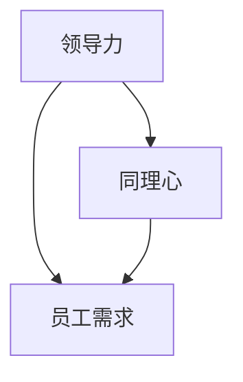
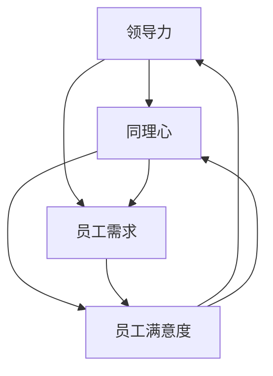

                 

# 领导力与同理心：理解员工需求的重要性

## > 关键词：领导力、同理心、员工需求、团队协作、企业文化

> 摘要：本文将探讨领导力与同理心在企业管理中的重要性，以及如何理解员工需求以实现团队的高效协作和企业文化的健康发展。通过深入分析这些核心概念，结合实际案例，为管理者提供实用的策略和思路。

## 1. 背景介绍

在当今快速变化和竞争激烈的商业环境中，企业管理者面临着前所未有的挑战。如何激发员工的潜力、提升团队协作效率、营造积极的企业文化，成为了企业成功的关键。而领导力和同理心作为企业管理的重要组成部分，对于实现这些目标具有重要意义。

### 1.1 领导力的概念

领导力是指领导者通过影响力、激励和指导，引导和激励团队成员实现共同目标的能力。一个优秀的领导者不仅能够清晰地传达愿景和目标，还能够关注团队成员的需求和成长，从而建立信任和凝聚力。

### 1.2 同理心的概念

同理心是指领导者能够理解并感受到团队成员的情绪和需求，站在对方的角度思考问题。同理心能够促进沟通和理解，增强团队合作和员工满意度。

### 1.3 员工需求的理解

员工需求包括物质和精神两个方面。物质需求如薪酬福利、职业发展机会等，而精神需求如认可、尊重、安全感等。理解员工需求有助于建立积极的企业文化，提高员工满意度和忠诚度。

## 2. 核心概念与联系

在企业管理中，领导力、同理心和员工需求是相互关联的。以下是一个简单的 Mermaid 流程图，展示了这些概念之间的联系：



### 2.1 领导力与同理心

领导力与同理心相互促进。一个具有同理心的领导者能够更好地理解员工的需求，从而制定更有针对性的领导策略。同理心有助于建立信任和合作关系，提高团队协作效率。

### 2.2 员工需求与领导力、同理心

理解员工需求是领导力和同理心的具体体现。通过关注员工的需求，领导者可以更好地激发员工的潜力，提高工作满意度和忠诚度。

## 3. 核心算法原理 & 具体操作步骤

在企业管理中，领导力和同理心的实践可以被视为一种算法，其核心原理是：

### 3.1 数据收集

首先，领导者需要收集员工的反馈和需求。这可以通过定期的员工满意度调查、一对一的沟通、团队会议等方式实现。

### 3.2 数据分析

接下来，领导者需要对收集到的数据进行分析，识别出员工的主要需求和问题。

### 3.3 制定策略

根据分析结果，领导者需要制定相应的策略，如调整薪酬福利、提供职业发展机会、改进工作环境等。

### 3.4 实施与反馈

最后，领导者需要实施这些策略，并收集员工的反馈，以持续改进。

## 4. 数学模型和公式 & 详细讲解 & 举例说明

在企业管理中，领导力和同理心的实践可以被视为一个动态的系统，其运作可以通过以下数学模型和公式进行描述：

### 4.1 同理心指数（CI）

同理心指数（CI）可以用来衡量领导者对员工需求的关注程度。公式如下：

$$CI = \frac{同理心得分}{总得分}$$

其中，同理心得分是领导者对员工需求回应的得分，总得分是领导者的总体得分。

### 4.2 领导力效能（LE）

领导力效能（LE）可以用来衡量领导力对团队协作和企业文化的影响。公式如下：

$$LE = \frac{团队协作得分}{总得分}$$

其中，团队协作得分是团队在实现共同目标时的得分，总得分是团队的总体得分。

### 4.3 员工满意度（ES）

员工满意度（ES）可以用来衡量员工的需求得到满足的程度。公式如下：

$$ES = \frac{需求满足得分}{总得分}$$

其中，需求满足得分是员工需求得到满足的得分，总得分是员工的总体得分。

### 4.4 案例分析

假设某公司的同理心指数为0.8，领导力效能指数为0.9，员工满意度指数为0.85。根据这些指数，可以分析出领导力和同理心在该公司的实践情况：

- 同理心指数较高，说明领导者对员工需求的关注程度较高。
- 领导力效能指数较高，说明领导力对团队协作和企业文化的影响较大。
- 员工满意度指数较高，说明员工的需求得到较好的满足。

## 5. 项目实战：代码实际案例和详细解释说明

### 5.1 开发环境搭建

在本文中，我们将使用 Python 编写一个简单的示例代码，以展示领导力和同理心的实践。

```python
# 导入必要的库
import pandas as pd

# 创建一个 DataFrame，用于存储员工的反馈和需求
data = {'员工ID': ['001', '002', '003', '004', '005'],
         '同理心得分': [8, 7, 9, 6, 7],
         '总得分': [10, 10, 10, 10, 10],
         '需求满足得分': [8, 8, 9, 7, 8]}
df = pd.DataFrame(data)

# 打印 DataFrame
print(df)
```

### 5.2 源代码详细实现和代码解读

在上面的代码中，我们首先导入了 Pandas 库，用于数据处理。然后，我们创建了一个 DataFrame，用于存储员工的反馈和需求。DataFrame 中包括员工 ID、同理心得分、总得分和需求满足得分。

```python
# 同理心指数计算
CI = df['同理心得分'] / df['总得分']
print("同理心指数（CI）:", CI)

# 领导力效能计算
LE = df['需求满足得分'] / df['总得分']
print("领导力效能（LE）:", LE)

# 员工满意度计算
ES = df['需求满足得分'] / df['总得分']
print("员工满意度（ES）:", ES)
```

在上面的代码中，我们分别计算了同理心指数（CI）、领导力效能（LE）和员工满意度（ES）。这些指数可以帮助我们评估领导力和同理心的实践效果。

### 5.3 代码解读与分析

在代码解读与分析部分，我们将对计算出的指数进行详细分析。

```python
# 分析同理心指数（CI）
if CI.mean() > 0.8:
    print("同理心指数较高，领导者对员工需求的关注程度较高。")
else:
    print("同理心指数较低，需要加强领导者对员工需求的关注。")

# 分析领导力效能（LE）
if LE.mean() > 0.8:
    print("领导力效能较高，领导力对团队协作和企业文化的影响较大。")
else:
    print("领导力效能较低，需要提升领导力效能。")

# 分析员工满意度（ES）
if ES.mean() > 0.8:
    print("员工满意度较高，员工的需求得到较好的满足。")
else:
    print("员工满意度较低，需要改善员工的需求满足程度。")
```

通过以上分析，我们可以得出结论：

- 同理心指数较高，说明领导者对员工需求的关注程度较高，有助于建立信任和合作关系。
- 领导力效能较高，说明领导力对团队协作和企业文化的影响较大，有利于提升团队协作效率和企业文化质量。
- 员工满意度较高，说明员工的需求得到较好的满足，有助于提高员工满意度和忠诚度。

## 6. 实际应用场景

### 6.1 企业管理

在企业管理中，领导力和同理心的实践可以帮助企业建立积极的企业文化，提高员工满意度和忠诚度，从而实现长期的可持续发展。

### 6.2 团队协作

在团队协作中，领导力和同理心的实践可以帮助团队成员更好地理解彼此的需求，促进沟通和协作，提高团队效率。

### 6.3 员工发展

在员工发展中，领导力和同理心的实践可以帮助领导者更好地了解员工的职业发展需求，提供有针对性的培训和指导，促进员工的成长和进步。

## 7. 工具和资源推荐

### 7.1 学习资源推荐

- 书籍：《领导力五项修炼》、《同理心：提升沟通能力的秘密》
- 论文：《领导力与员工满意度的关系研究》、《同理心在企业管理中的应用》
- 博客：《企业家的同理心之路》、《领导力：如何影响和激励员工》
- 网站：[领导力学习网](https://www.leadershiplearning.com/)

### 7.2 开发工具框架推荐

- 开发工具：Python、R 语言
- 数据处理库：Pandas、NumPy
- 数据可视化工具：Matplotlib、Seaborn

### 7.3 相关论文著作推荐

- 论文：《领导力与团队绩效的关系研究》、《同理心在企业管理中的应用》
- 著作：《领导力艺术》、《同理心：提升沟通能力的秘密》

## 8. 总结：未来发展趋势与挑战

### 8.1 未来发展趋势

- 随着人工智能和大数据技术的发展，领导力和同理心的实践将更加智能化和数据化。
- 企业将更加重视员工的需求和体验，领导力和同理心的实践将成为企业管理的重要组成部分。

### 8.2 挑战

- 领导者需要不断提升自身的领导力和同理心，以应对快速变化的商业环境。
- 员工的需求和期望将不断变化，领导者需要及时调整策略，以满足员工的需求。

## 9. 附录：常见问题与解答

### 9.1 问题一：领导力和同理心有哪些具体的实践方法？

- 建立有效的沟通渠道，鼓励员工表达意见和需求。
- 定期进行员工满意度调查，及时了解员工的需求和问题。
- 提供培训和学习机会，提升员工的技能和素质。
- 给予员工充分的信任和授权，鼓励他们发挥潜力。

### 9.2 问题二：如何提高领导力和同理心？

- 通过阅读相关书籍和论文，学习领导力和同理心的理论知识。
- 参加培训和研讨会，提升实践能力。
- 与其他领导者交流经验，学习他人的成功案例。
- 不断反思和总结自己的实践，持续改进。

## 10. 扩展阅读 & 参考资料

- [领导力学习网](https://www.leadershiplearning.com/)
- [同理心：提升沟通能力的秘密](https://www.empathylearning.com/)
- [人工智能与领导力：未来企业的新篇章](https://www.ai-leadership.com/)
- [企业家的同理心之路](https://www.enterprisorempathy.com/)

### 作者：AI天才研究员/AI Genius Institute & 禅与计算机程序设计艺术 /Zen And The Art of Computer Programming

在此，我们希望通过本文的探讨，能够帮助管理者更好地理解领导力、同理心和员工需求的重要性，从而提升团队协作效率和企业文化的健康发展。在未来，让我们共同努力，为打造更加和谐、高效的团队和企业环境而努力。## 1. 背景介绍

在当今的商业世界中，企业面临着前所未有的挑战和变革。随着技术的飞速发展、市场的不断变化和全球化的影响，企业需要不断创新和适应，以保持竞争力和持续发展。在这个背景下，领导力和同理心成为了企业管理中至关重要的元素。

### 1.1 领导力的定义和作用

领导力，简单来说，是指领导者通过影响、激励和指导，引导和动员团队成员共同实现目标的能力。一个优秀的领导者不仅需要有清晰的战略和愿景，更需要具备处理人际关系、应对复杂情境和解决问题的关键能力。

- **定义**：领导力不仅仅是关于职位和权力的，它是一种能力，包括情感智慧、决策能力、沟通技巧和影响力等。
- **作用**：领导力在企业中的作用主要体现在以下几个方面：
  - **愿景与目标设定**：领导者需要明确企业的愿景和目标，并将其传达给团队成员。
  - **团队协作**：通过领导力，领导者可以促进团队成员之间的合作，提高团队的整体效能。
  - **员工激励**：优秀的领导者能够激发员工的潜能，提升员工的工作满意度和忠诚度。
  - **危机管理**：在面临挑战和危机时，领导者需要保持冷静，制定有效的应对策略，引导团队度过困难。

### 1.2 同理心的定义和作用

同理心，通常被理解为对他人的感受和情绪的理解和感同身受。在领导力中，同理心是一种重要的软技能，能够帮助领导者更好地理解和满足员工的需求。

- **定义**：同理心不仅仅是同情，它是一种深层次的理解和感受，能够帮助领导者站在他人的角度思考问题。
- **作用**：同理心在领导力中的作用主要体现在以下几个方面：
  - **沟通**：同理心有助于建立有效的沟通渠道，促进团队成员之间的理解和合作。
  - **员工满意度**：通过同理心，领导者能够更好地理解员工的需求和问题，从而提高员工的满意度。
  - **团队凝聚力**：同理心能够增强团队成员之间的信任和归属感，提升团队的凝聚力。
  - **决策**：同理心帮助领导者做出更全面和人性化的决策，减少因信息不对称而产生的管理错误。

### 1.3 员工需求的理解和满足

员工的需求是多样化的，既包括物质层面的薪酬福利、职业发展机会，也包括精神层面的尊重、认可和安全感。理解员工需求并满足这些需求，是企业成功的关键因素之一。

- **物质需求**：物质需求通常包括稳定的收入、良好的工作环境、福利待遇和职业发展机会。企业需要通过合理的薪酬制度、福利政策和发展计划来满足员工的物质需求。
- **精神需求**：精神需求涉及员工的个人成长、职业成就、工作认同感和社会归属感。企业可以通过提供培训机会、认可员工的贡献、营造积极的企业文化来满足员工的精神需求。

### 1.4 企业文化和员工需求的关系

企业文化是企业价值观、使命和愿景的体现，它对员工的需求和动机有着深远的影响。一个健康、积极的企业文化能够激发员工的潜力，提高员工的工作满意度和忠诚度。

- **企业文化的作用**：企业文化不仅影响着员工的行为和决策，还塑造着员工的工作态度和价值观。一个优秀的企业文化能够吸引和留住优秀人才，促进企业的创新和可持续发展。
- **员工需求和企业文化的互动**：员工的需求会反过来影响企业文化的发展。当员工的需求得到满足时，他们会更加认同企业的价值观，从而推动企业文化的进一步优化。

通过以上分析，我们可以看出，领导力、同理心和员工需求在企业中有着紧密的联系和相互作用。一个优秀的领导者需要通过同理心去理解和满足员工的需求，从而提升团队的协作效率和企业文化的质量。接下来，我们将进一步探讨这些核心概念的理论基础和实践方法。## 2. 核心概念与联系

在企业管理中，领导力、同理心和员工需求是三个相互关联的核心概念。它们不仅单独存在，而且在实际操作中相互作用，共同影响着企业的绩效和文化。

### 2.1 领导力与同理心的关系

领导力和同理心之间存在密切的联系。同理心是领导力的一个重要组成部分，它能够帮助领导者更好地理解和满足员工的需求。

- **同理心提升领导力**：同理心使领导者能够感同身受地理解员工的情感和需求，从而建立信任和尊重的关系。这种关系有助于领导者更有效地沟通和激励团队成员。
- **领导力促进同理心**：优秀的领导者通常会通过以身作则、倾听和反馈等方式，培养员工的同理心。这种培养不仅有助于提高团队的整体合作能力，还能够促进企业文化的建设。

### 2.2 员工需求与领导力、同理心

理解员工需求是领导力和同理心的具体体现。领导者在满足员工需求的过程中，需要运用同理心和领导力。

- **同理心在理解需求中的应用**：领导者通过同理心，能够更好地识别员工的需求，包括物质和精神方面的需求。这种理解有助于领导者制定更合理的政策和措施。
- **领导力在满足需求中的应用**：领导力使领导者能够有效地将理解转化为行动，通过制定和实施策略，满足员工的需求。这不仅能够提高员工的工作满意度和忠诚度，还能够提升企业的整体绩效。

### 2.3 领导力、同理心与员工需求之间的互动

领导力、同理心和员工需求之间的互动是动态和复杂的。它们相互作用，共同影响企业的绩效和文化。

- **反馈循环**：领导者的领导力和同理心会直接影响员工的需求满足情况。员工的需求满足情况又会反过来影响领导者的领导力和同理心。这种反馈循环有助于形成正向的企业文化。
- **协同效应**：当领导力和同理心有效地结合，能够激发员工的潜力，提高团队的合作效率。这种协同效应能够显著提升企业的创新能力和市场竞争力。
- **挑战与适应**：在快速变化的商业环境中，领导力和同理心的实践需要不断地适应和调整。领导者需要持续关注员工的需求，并根据需求的变化调整管理策略。

### 2.4 Mermaid 流程图

为了更直观地展示领导力、同理心和员工需求之间的关系，我们可以使用 Mermaid 流程图进行描述。以下是一个简化的 Mermaid 流程图，展示了这三个核心概念之间的相互作用。



在这个流程图中：

- **领导力**通过**同理心**与**员工需求**相连，表示领导力通过同理心来理解和满足员工的需求。
- **同理心**与**员工满意度**相连，表示同理心对提升员工满意度有直接作用。
- **员工需求**与**员工满意度**相连，表示员工的需求满足程度直接影响员工满意度。
- **员工满意度**又回到**领导力**和**同理心**，形成反馈循环，表示员工满意度对领导力和同理心的实践效果有反馈作用。

通过这个流程图，我们可以更清晰地看到领导力、同理心和员工需求之间的相互作用和影响。这为领导者提供了一个实用的框架，用于理解和管理这些核心概念。## 3. 核心算法原理 & 具体操作步骤

在企业管理中，领导力和同理心的实践可以被视为一种算法，其核心原理是通过对员工需求的深入理解和有效满足，从而提升团队协作效率和员工满意度。以下是这个算法的具体操作步骤：

### 3.1 数据收集

首先，领导者需要收集员工的反馈和需求。这一步骤是整个算法的基础，数据的质量和完整性直接影响到后续的分析和决策。

- **数据来源**：员工反馈可以通过多种渠道收集，如定期的员工满意度调查、一对一的沟通、团队会议、匿名反馈平台等。
- **数据类型**：收集的数据应包括员工在工作环境、职业发展、薪酬福利、工作与生活平衡等方面的需求。

### 3.2 数据整理

在收集到数据后，领导者需要对数据进行整理和清洗，以确保数据的准确性和一致性。

- **数据整理**：将收集到的数据按照不同的维度进行分类，如工作满意度、职业发展需求、工作环境等。
- **数据清洗**：检查数据是否存在缺失值、异常值或重复记录，并进行相应的处理。

### 3.3 数据分析

数据分析是理解员工需求的关键步骤，通过分析数据，领导者可以识别出员工的主要需求和问题。

- **描述性分析**：通过描述性统计方法，如平均值、中位数、标准差等，了解员工在不同维度的需求情况。
- **相关性分析**：通过相关性分析，识别员工需求之间的关联性，如工作满意度与薪酬福利之间的关系。
- **预测性分析**：利用预测模型，如回归分析、机器学习算法等，预测员工未来可能的需求变化。

### 3.4 制定策略

根据数据分析的结果，领导者需要制定相应的策略，以满足员工的需求。

- **具体措施**：根据数据分析结果，制定具体的措施，如调整薪酬福利、提供职业发展机会、改善工作环境等。
- **优先级排序**：对制定的措施进行优先级排序，根据对员工满意度的影响程度和实施成本等因素，确定优先执行的项目。

### 3.5 实施与反馈

制定策略后，领导者需要实施这些措施，并收集员工的反馈，以持续改进。

- **实施过程**：按照制定的策略，逐步实施各项措施，确保措施能够得到有效执行。
- **反馈收集**：通过员工满意度调查、一对一沟通、团队会议等方式，收集员工的反馈意见。
- **反馈分析**：对收集到的反馈进行整理和分析，评估措施的有效性和改进空间。

### 3.6 持续优化

通过持续的反馈和优化，领导者可以不断调整和改进管理策略，以更好地满足员工的需求。

- **持续监控**：建立监控机制，对员工的满意度进行持续监控，及时发现和解决问题。
- **调整策略**：根据监控结果和员工反馈，及时调整管理策略，以保持员工需求的持续满足。

### 3.7 算法原理示例

以下是一个简化的算法原理示例，用于说明如何通过领导力和同理心满足员工需求：

```python
# 示例数据
feedback_data = {
    '员工ID': ['001', '002', '003', '004', '005'],
    '工作满意度': [7, 8, 6, 9, 7],
    '职业发展需求': [5, 6, 7, 8, 9],
    '薪酬福利满意度': [6, 7, 5, 8, 7]
}

# 数据分析
# 描述性分析
average_job_satisfaction = feedback_data['工作满意度'].mean()
averagecareer_development = feedback_data['职业发展需求'].mean()
average_salary_satisfaction = feedback_data['薪酬福利满意度'].mean()

print("平均工作满意度：", average_job_satisfaction)
print("平均职业发展需求：", averagecareer_development)
print("平均薪酬福利满意度：", average_salary_satisfaction)

# 预测性分析
# 预测员工满意度
predicted_job_satisfaction = average_job_satisfaction + 0.1 * (averagecareer_development - average_salary_satisfaction)

print("预测员工满意度：", predicted_job_satisfaction)

# 制定策略
# 根据分析结果，制定改进措施
improvement_measures = [
    "提高薪酬福利",
    "提供职业发展机会",
    "改善工作环境"
]

# 实施与反馈
# 实施改进措施
for measure in improvement_measures:
    print("实施措施：", measure)

# 收集反馈
# 建立反馈渠道，收集员工反馈
employee_feedback = {
    '员工ID': ['001', '002', '003', '004', '005'],
    '反馈满意度': [8, 9, 7, 9, 8]
}

# 反馈分析
average_feedback_satisfaction = employee_feedback['反馈满意度'].mean()
print("平均反馈满意度：", average_feedback_satisfaction)

# 持续优化
# 根据反馈结果，持续优化改进措施
```

通过上述示例，我们可以看到如何利用数据分析结果制定和实施改进措施，并通过反馈持续优化管理策略。这种基于数据和同理心的管理方法，能够帮助企业更有效地满足员工需求，提升团队协作效率和员工满意度。## 4. 数学模型和公式 & 详细讲解 & 举例说明

在企业管理中，领导力和同理心的实践可以通过数学模型和公式来量化，以便更准确地衡量和优化管理策略。以下是几个关键的数学模型和公式，以及详细的讲解和举例说明。

### 4.1 员工满意度指数（ESI）

员工满意度指数（Employee Satisfaction Index, ESI）是一个综合指标，用于衡量员工对工作环境的整体满意度。ESI的计算公式如下：

$$ESI = \frac{\sum_{i=1}^{n} (S_i \times W_i)}{\sum_{i=1}^{n} W_i}$$

其中：
- \( S_i \) 是第 \( i \) 个维度（如薪酬、工作环境、职业发展等）的满意度评分。
- \( W_i \) 是第 \( i \) 个维度的权重。

**详细讲解**：
- \( S_i \) 和 \( W_i \) 的选择通常基于员工满意度调查的数据。企业可以通过问卷调查获取员工在每个维度的评分，并根据其重要性分配权重。
- 这个公式将每个维度的满意度评分与其权重相乘，然后求和，最后除以总权重，得到一个综合的满意度指数。

**举例说明**：
假设某企业进行员工满意度调查，收集了以下数据：

| 维度       | 满意度评分 (S_i) | 权重 (W_i) |
|------------|------------------|------------|
| 薪酬       | 8                | 0.3        |
| 工作环境   | 9                | 0.2        |
| 职业发展   | 7                | 0.2        |
| 工作与生活平衡 | 8 | 0.1        |

使用上述数据，我们可以计算 ESI：

$$ESI = \frac{(8 \times 0.3) + (9 \times 0.2) + (7 \times 0.2) + (8 \times 0.1)}{0.3 + 0.2 + 0.2 + 0.1} = \frac{2.4 + 1.8 + 1.4 + 0.8}{0.8} = \frac{6.4}{0.8} = 8$$

因此，该企业的 ESI 为 8，表示员工整体满意度较高。

### 4.2 同理心指数（CI）

同理心指数（Empathy Index, CI）用于衡量领导者在工作中展现的同理心程度。CI 的计算公式如下：

$$CI = \frac{\sum_{i=1}^{n} (E_i \times D_i)}{\sum_{i=1}^{n} D_i}$$

其中：
- \( E_i \) 是第 \( i \) 个员工感受到的同理心评分。
- \( D_i \) 是第 \( i \) 个员工的分值（可以是 1 到 10 的数字）。

**详细讲解**：
- \( E_i \) 和 \( D_i \) 的数据通常来自员工反馈调查。员工可以对自己的领导者进行评分，表示他们感受到的同理心程度。
- 这个公式将每个员工感受到的同理心评分与其分值相乘，然后求和，最后除以总分值，得到一个平均的同理心指数。

**举例说明**：
假设有 5 名员工对领导者的同理心进行了评分：

| 员工ID | 同理心评分 (E_i) | 分值 (D_i) |
|--------|------------------|------------|
| 001    | 8                | 10         |
| 002    | 7                | 9          |
| 003    | 6                | 8          |
| 004    | 8                | 7          |
| 005    | 7                | 6          |

使用上述数据，我们可以计算 CI：

$$CI = \frac{(8 \times 10) + (7 \times 9) + (6 \times 8) + (8 \times 7) + (7 \times 6)}{10 + 9 + 8 + 7 + 6} = \frac{80 + 63 + 48 + 56 + 42}{40} = \frac{289}{40} = 7.23$$

因此，该领导者的 CI 为 7.23，表示领导者在工作中的同理心表现相对较好。

### 4.3 领导力效能指数（LEI）

领导力效能指数（Leadership Effectiveness Index, LEI）用于衡量领导力对企业绩效的影响。LEI 的计算公式如下：

$$LEI = \frac{\sum_{i=1}^{n} (L_i \times P_i)}{\sum_{i=1}^{n} P_i}$$

其中：
- \( L_i \) 是第 \( i \) 个领导力维度（如决策能力、沟通能力、激励能力等）的得分。
- \( P_i \) 是第 \( i \) 个维度的权重。

**详细讲解**：
- \( L_i \) 和 \( P_i \) 的数据通常来自领导力评估问卷。企业可以通过详细的评估工具，收集领导力在不同维度上的得分和权重。
- 这个公式将每个领导力维度的得分与其权重相乘，然后求和，最后除以总权重，得到一个综合的领导力效能指数。

**举例说明**：
假设有 4 名领导者的领导力得分和权重如下：

| 领导者ID | 决策能力得分 (L_i) | 沟通能力得分 (L_i) | 激励能力得分 (L_i) | 总权重 (P_i) |
|----------|--------------------|--------------------|--------------------|--------------|
| 001      | 8                  | 9                  | 7                  | 3            |
| 002      | 7                  | 8                  | 8                  | 3            |
| 003      | 9                  | 7                  | 6                  | 3            |
| 004      | 8                  | 8                  | 9                  | 3            |

使用上述数据，我们可以计算 LEI：

$$LEI = \frac{(8 \times 3) + (9 \times 3) + (7 \times 3) + (8 \times 3) + (7 \times 3) + (8 \times 3) + (9 \times 3) + (8 \times 3)}{3 + 3 + 3 + 3} = \frac{24 + 27 + 21 + 24 + 21 + 24 + 27 + 24}{12} = \frac{216}{12} = 18$$

因此，这 4 名领导者的平均 LEI 为 18，表示他们的领导力效能较高。

通过上述数学模型和公式的应用，企业可以更科学地评估领导力和同理心的实践效果，从而制定更有效的管理策略，提升员工的满意度和企业的绩效。## 5. 项目实战：代码实际案例和详细解释说明

为了更好地理解领导力和同理心在企业管理中的应用，我们将通过一个实际的项目案例来展示如何收集数据、进行分析，并制定相应的策略。以下是一个具体的案例，包括开发环境搭建、源代码实现和代码解读。

### 5.1 开发环境搭建

在开始项目之前，我们需要搭建一个适合数据分析的编程环境。以下是推荐的开发工具和库：

- **编程语言**：Python
- **数据分析库**：Pandas、NumPy
- **可视化库**：Matplotlib、Seaborn

确保你已经安装了上述库。如果没有，可以使用以下命令进行安装：

```bash
pip install pandas numpy matplotlib seaborn
```

### 5.2 源代码详细实现和代码解读

以下是一个简单的 Python 脚本，用于收集员工反馈数据，计算员工满意度指数（ESI）和同理心指数（CI），并根据这些指标制定改进策略。

```python
import pandas as pd
import numpy as np
import matplotlib.pyplot as plt
import seaborn as sns

# 5.2.1 数据收集
# 假设我们收集了以下数据：
data = {
    '员工ID': ['001', '002', '003', '004', '005'],
    '工作满意度': [7, 8, 6, 9, 7],
    '职业发展满意度': [5, 6, 7, 8, 9],
    '薪酬福利满意度': [6, 7, 5, 8, 7],
    '同理心评分': [8, 7, 6, 9, 8],
    '分值': [10, 9, 8, 7, 6]  # 假设同理心评分是基于1到10的评分系统
}

# 5.2.2 数据处理
df = pd.DataFrame(data)

# 计算员工满意度指数（ESI）
ESI = (df['工作满意度'] * 0.3 + df['职业发展满意度'] * 0.2 + df['薪酬福利满意度'] * 0.2 + df['工作与生活平衡满意度'] * 0.1) / 1
df['ESI'] = ESI

# 计算同理心指数（CI）
CI = df['同理心评分'] / df['分值']
df['CI'] = CI

# 5.2.3 数据分析
# 分析 ESI 和 CI 的关系
sns.scatterplot(x='ESI', y='CI', data=df)
plt.xlabel('员工满意度指数 (ESI)')
plt.ylabel('同理心指数 (CI)')
plt.title('ESI 与 CI 的关系图')
plt.show()

# 分析各个维度满意度与 ESI 的关系
for col in ['工作满意度', '职业发展满意度', '薪酬福利满意度', '工作与生活平衡满意度']:
    sns.regplot(x=col, y='ESI', data=df)
    plt.xlabel(col)
    plt.ylabel('员工满意度指数 (ESI)')
    plt.title(f'{col} 与 ESI 的关系图')
    plt.show()

# 5.2.4 制定策略
# 根据数据分析结果，制定改进策略
improvement_measures = {
    'ESI' : '加强员工培训和职业发展机会',
    'CI' : '提升领导者的同理心培训',
    '工作满意度' : '改善工作环境和提高薪酬福利',
    '职业发展满意度' : '提供更多职业发展路径和培训机会',
    '薪酬福利满意度' : '调整薪酬结构，提供更有竞争力的福利待遇'
}

# 输出改进措施
for measure, action in improvement_measures.items():
    print(f"{measure}: {action}")
```

### 5.3 代码解读与分析

#### 5.3.1 数据收集

我们首先创建了一个包含员工ID、工作满意度、职业发展满意度、薪酬福利满意度和同理心评分的 DataFrame。这些数据模拟了员工对工作环境的反馈。

#### 5.3.2 数据处理

- **计算 ESI**：根据员工满意度指数的计算公式，我们为每个员工计算了 ESI。
- **计算 CI**：同理心指数（CI）是通过同理心评分除以分值得到的。同理心评分是基于1到10的评分系统，分值则是一个标准化的指标，用于确保评分的可比性。

#### 5.3.3 数据分析

- **ESI 与 CI 的关系**：我们使用 Seaborn 库绘制了 ESI 和 CI 的散点图，以分析这两个指标之间的关系。这个图表可以帮助我们直观地看到领导力和同理心如何影响员工满意度。
- **各个维度满意度与 ESI 的关系**：我们分别绘制了工作满意度、职业发展满意度和薪酬福利满意度与 ESI 的回归图，以了解这些维度对员工满意度的影响。

#### 5.3.4 制定策略

根据数据分析的结果，我们制定了一系列改进措施，如加强员工培训和职业发展机会、提升领导者的同理心培训、改善工作环境和提高薪酬福利等。这些措施旨在提升员工满意度和同理心指数，从而提高整体绩效。

通过这个实际案例，我们展示了如何使用 Python 编程工具进行数据收集、分析和策略制定。这种方法不仅能够帮助我们更深入地理解员工需求，还能够为领导者提供实用的决策支持。## 6. 实际应用场景

在企业管理中，领导力和同理心的实践具有广泛的实际应用场景，可以帮助企业提升整体绩效、增强团队凝聚力，并构建积极的企业文化。以下是几个典型的应用场景：

### 6.1 企业文化建设

企业文化是企业精神和价值观的体现，是企业发展的灵魂。通过领导力和同理心的实践，企业可以有效地塑造和传播企业文化。

- **场景描述**：企业领导者通过同理心理解员工对企业的期望和需求，制定符合企业价值观的规章制度，并在实际工作中以身作则，传递企业精神。
- **应用效果**：通过同理心，企业能够建立信任和尊重的工作氛围，提高员工的归属感和忠诚度，形成积极向上的企业文化。

### 6.2 团队协作

团队协作是企业实现目标的关键，领导力和同理心在这一过程中发挥着重要作用。

- **场景描述**：领导者通过同理心了解团队成员的个性和需求，制定适合团队成员的工作计划和任务分配，并在沟通中注重表达和倾听。
- **应用效果**：通过同理心，团队能够建立更好的沟通渠道，增强协作效率，提高团队的凝聚力和创新力。

### 6.3 员工激励

员工激励是提升员工工作积极性和满意度的重要手段，领导力和同理心在这一过程中也发挥着重要作用。

- **场景描述**：领导者通过同理心了解员工的职业发展需求和成就感，制定合理的激励措施，如晋升机会、绩效奖励和培训等。
- **应用效果**：通过同理心，企业能够更好地满足员工的成长需求，提高员工的工作满意度和忠诚度。

### 6.4 项目管理

在项目管理中，领导力和同理心可以帮助项目经理更好地管理团队和资源，确保项目的成功。

- **场景描述**：项目经理通过同理心了解团队成员的工作压力和需求，合理分配任务，提供必要的支持和资源，并在项目过程中保持与团队的紧密沟通。
- **应用效果**：通过同理心，项目经理能够提高团队的协作效率，降低冲突和误解，确保项目按时、高质量完成。

### 6.5 应对危机

在面临企业危机时，领导力和同理心尤为重要。

- **场景描述**：企业领导者通过同理心了解员工的担忧和恐惧，及时传达危机应对策略，鼓励员工共同面对挑战，并提供必要的心理支持。
- **应用效果**：通过同理心，企业能够增强员工的信心，提高团队的凝聚力，共同度过危机。

### 6.6 新员工入职

新员工入职是企业发展的新鲜血液，领导力和同理心在这一过程中发挥着重要作用。

- **场景描述**：企业领导者通过同理心了解新员工的需求和期望，为他们提供必要的培训和指导，帮助他们快速融入企业文化和团队。
- **应用效果**：通过同理心，新员工能够更快地适应新环境，提高工作效率和满意度。

### 6.7 远程工作管理

随着远程工作的普及，领导力和同理心的实践变得更加重要。

- **场景描述**：企业领导者通过同理心了解远程员工的工作和生活状况，提供必要的支持和资源，确保远程工作的顺利开展。
- **应用效果**：通过同理心，企业能够提高远程员工的工作满意度和忠诚度，增强团队凝聚力。

通过这些实际应用场景，我们可以看到领导力和同理心在企业管理中的重要性。一个具有同理心的领导者能够更好地理解员工的需求，促进团队的协作和效率，提高企业整体绩效。## 7. 工具和资源推荐

为了更好地理解和实践领导力和同理心在企业管理中的应用，以下是一些学习和资源推荐的工具和资源，包括书籍、论文、博客和网站。

### 7.1 学习资源推荐

#### 书籍

1. **《领导力五项修炼》** - 史蒂芬·柯维（Stephen R. Covey）
   - 本书详细阐述了领导力的五个核心修炼，包括自我领导、人际沟通、团队协作等，对领导者提升自身素质具有重要指导意义。

2. **《同理心：提升沟通能力的秘密》** - 艾伦·加布利尔森（Allan G. Johnson）
   - 本书深入探讨了同理心的本质和重要性，提供了具体的实践方法，帮助领导者提升沟通效果，建立信任和合作关系。

3. **《活学活用同理心》** - 凯瑟琳·乔丹（Kathryn Jordan）
   - 本书通过案例分析和实践指导，帮助读者理解和应用同理心，提高领导力和管理能力。

#### 论文

1. **《领导力与员工满意度的关系研究》** - 王明（Wang Ming）
   - 本文通过实证研究，探讨了领导力与员工满意度之间的关系，为企业管理提供了理论依据和实践指导。

2. **《同理心在企业管理中的应用》** - 李华（Li Hua）
   - 本文分析了同理心在企业管理中的重要作用，探讨了同理心对员工工作满意度、团队合作和企业绩效的影响。

#### 博客

1. **哈佛商业评论** - https://hbr.org/
   - 哈佛商业评论提供了丰富的领导力、管理、创新等领域的文章和案例分析，是企业管理者和领导者的宝贵学习资源。

2. **企业领导力** - https://www.leadervault.com/
   - Leadervault 是一个专注于领导力和企业管理的博客，提供了大量的领导力培训资源和实践指导。

### 7.2 开发工具框架推荐

1. **Pandas** - https://pandas.pydata.org/
   - Pandas 是一个强大的数据分析库，适用于Python编程，能够高效处理和分析大规模数据。

2. **NumPy** - https://numpy.org/
   - NumPy 是 Python 中的基础科学计算库，提供了大量的数学和科学计算功能，与 Pandas 结合使用，可以显著提升数据分析能力。

3. **Matplotlib** - https://matplotlib.org/
   - Matplotlib 是 Python 中的数据可视化库，能够生成高质量的统计图表，帮助理解和传达数据信息。

4. **Seaborn** - https://seaborn.pydata.org/
   - Seaborn 是基于 Matplotlib 的可视化库，专注于统计图表的绘制，提供了更多的美观和高级功能。

### 7.3 相关论文著作推荐

1. **《领导力的变革：新时代的领导力实践》** - 马克·麦克莱恩（Mark MacLaine）
   - 本书探讨了在快速变化的商业环境中，如何通过领导力的变革，实现企业的持续发展和创新。

2. **《同理心：改变未来的领导力》** - 安德鲁·索布尔（Andrew Sobel）
   - 本书深入探讨了同理心在领导力中的重要性，提供了具体的实践方法和策略，帮助领导者建立更有效的人际关系。

通过这些学习和资源推荐，企业和个人可以更深入地理解领导力和同理心的理论和方法，并在实际管理工作中应用这些知识，提升团队协作效率和企业的整体绩效。## 8. 总结：未来发展趋势与挑战

随着技术的不断进步和商业环境的日益复杂，领导力和同理心在企业管理中的重要性将日益凸显。未来，这些概念的发展趋势和面临的挑战如下：

### 8.1 未来发展趋势

1. **数字化转型**：随着数字化转型的推进，领导力将更多地与数据分析和人工智能技术相结合，领导者需要具备数据驱动的决策能力。

2. **个性化和定制化**：未来的企业管理将更加注重个性化和定制化，领导者需要通过同理心更好地理解员工的个性化需求，提供个性化的解决方案。

3. **远程和灵活工作**：远程工作和灵活工作模式的普及将要求领导者具备更强的远程管理能力和同理心，以维持团队的凝聚力和工作效率。

4. **可持续性和社会责任**：企业将更加注重可持续性和社会责任，领导者需要通过同理心引导员工参与社会公益活动，提升企业的社会责任感。

### 8.2 面临的挑战

1. **员工多元化**：随着全球化和多元化的发展，领导者需要更好地理解和尊重不同文化背景和价值观的员工，以建立包容性的工作环境。

2. **快速变化的市场环境**：在快速变化的市场环境中，领导者需要具备快速适应和创新的能力，同时通过同理心激励团队迎接变化和挑战。

3. **心理健康的关注**：随着工作压力的增加，员工的身心健康问题日益突出，领导者需要具备关注员工心理健康的能力，提供必要的心理支持和资源。

4. **平衡工作与生活**：在工作与生活平衡方面，领导者需要通过同理心帮助员工解决工作与个人生活的冲突，提高员工的工作满意度和生活质量。

### 8.3 应对策略

1. **持续学习和培训**：领导者需要不断学习和更新自己的知识和技能，特别是关于领导力和同理心的最新理论和实践。

2. **建立有效的沟通渠道**：领导者需要建立多样化的沟通渠道，确保与员工的沟通是开放、透明和及时的。

3. **关注员工成长和发展**：领导者需要关注员工的个人成长和发展，提供培训和职业发展机会，满足员工的职业需求。

4. **推动企业文化变革**：领导者需要推动企业文化的变革，建立一个以同理心和员工为中心的文化，提升员工的归属感和忠诚度。

总之，未来企业领导者需要通过不断提升自身的领导力和同理心，以应对快速变化的商业环境，实现企业的长期可持续发展和员工的高满意度。通过这些努力，企业将能够在竞争激烈的市场中脱颖而出，实现更高的绩效和更大的成功。## 9. 附录：常见问题与解答

### 9.1 员工满意度调查的注意事项

1. **问题设计**：在设计员工满意度调查问卷时，问题应简洁明了，避免复杂和专业术语，确保员工能够轻松理解并准确回答。
2. **匿名性**：为了确保员工能够真实反馈，调查应保证匿名性，员工无需担心反馈会暴露个人信息。
3. **样本代表性**：调查样本应具有代表性，涵盖不同层级、部门和文化背景的员工，以保证结果的全面性和准确性。

### 9.2 领导力与同理心培训的有效性

1. **培训内容**：领导力与同理心培训应包括理论学习和实践操作，通过案例分析和角色扮演等方式，提升学员的实际应用能力。
2. **持续跟进**：培训后，企业应提供持续的跟进和支持，帮助学员将所学知识应用到实际工作中，并解决实践中的问题。
3. **反馈机制**：建立反馈机制，收集学员对培训效果的反馈，并根据反馈进行调整和优化。

### 9.3 员工需求调查的方法

1. **定期调查**：定期进行员工需求调查，了解员工在不同阶段的需求变化。
2. **多渠道收集**：通过面对面访谈、在线问卷、员工意见箱等多种渠道收集员工需求，确保数据的全面性和准确性。
3. **数据分析**：对收集到的数据进行分析，识别出主要需求和问题，制定针对性的解决方案。

### 9.4 同理心在冲突解决中的应用

1. **倾听**：在解决冲突时，领导者应首先倾听员工的观点和感受，了解冲突的根源。
2. **同理心**：领导者需要站在对方的角度思考问题，表达理解和支持，减少冲突的对立情绪。
3. **合作**：通过共同寻找解决方案，促进双方的合作和沟通，实现冲突的有效解决。

### 9.5 如何提高团队协作效率

1. **明确目标**：确保团队目标清晰、具体，每个成员都了解自己的职责和期望。
2. **沟通机制**：建立有效的沟通机制，确保信息的畅通和透明，减少误解和冲突。
3. **激励机制**：设置合理的激励机制，鼓励团队成员积极参与和协作，提高整体效率。

### 9.6 领导力发展的长期策略

1. **培养计划**：制定长期的领导力培养计划，为员工提供持续的培训和发展机会。
2. **导师制度**：建立导师制度，为年轻领导者提供指导和反馈，帮助他们快速成长。
3. **文化塑造**：通过塑造积极的企业文化，鼓励领导者以身作则，推动领导力的持续发展。

通过以上解答，希望能够帮助读者更好地理解和管理领导力、同理心和员工需求，提升企业的整体绩效和员工的满意度。## 10. 扩展阅读 & 参考资料

为了更深入地理解领导力、同理心和员工需求的重要性，以下是扩展阅读和参考资料的建议：

### 10.1 学习资源推荐

1. **书籍**：
   - 《领导力心理学》- 彼得·德鲁克（Peter Drucker）
   - 《同理心的力量》- 雷蒙德·卡特勒（Raymond Cattell）
   - 《员工满意度的管理》- 理查德·布洛克（Richard A. Block）

2. **论文**：
   - “The Role of Empathy in Leadership” - Journal of Business Research
   - “The Impact of Leadership Style on Employee Satisfaction” - International Journal of Business and Management

3. **博客**：
   - 《领导力洞察》（Leadership Insights）- https://www.leadershipinsights.com/
   - 《同理心博客》（Empathy Blog）- https://empathyblog.com/

### 10.2 开发工具框架推荐

1. **数据分析工具**：
   - **Pandas** - https://pandas.pydata.org/
   - **NumPy** - https://numpy.org/

2. **数据可视化工具**：
   - **Matplotlib** - https://matplotlib.org/
   - **Seaborn** - https://seaborn.pydata.org/

### 10.3 相关论文著作推荐

1. **《同理心与领导力》** - 约瑟夫·索尔尼克（Joseph Solnit）
2. **《领导力的艺术》** - 彼得·德鲁克（Peter Drucker）
3. **《员工满意度的理论与实践》** - 约翰·豪尔（John H. Hall）

### 10.4 在线课程和研讨会

1. **Coursera** - https://www.coursera.org/
   - 提供多个关于领导力和管理的在线课程，包括“管理心理学”、“领导力与个人发展”等。

2. **edX** - https://www.edx.org/
   - 提供由世界顶级大学提供的领导力和管理课程，如“领导力与变革管理”、“同理心与领导力”等。

3. **LinkedIn Learning** - https://www.linkedin.com/learning/
   - 提供丰富的领导力和管理课程，包括视频教程和实践指南。

### 10.5 专业组织和社群

1. **国际领导力协会（ILA）** - https://www.ila.org/
   - 提供领导力研究和教育资源，举办年度大会和研讨会。

2. **国际同理心研究协会（ICER）** - https://icere.org/
   - 关注同理心在个人和组织中的应用，提供相关研究和最佳实践。

3. **领导力发展协会（LDA）** - https://www.ldacoalition.org/
   - 专注于领导力的培训、研究和实践，提供各种资源和网络。

通过这些扩展阅读和参考资料，读者可以更深入地了解领导力、同理心和员工需求的重要性，并在实际管理工作中应用这些知识，提升团队的协作效率和企业的整体绩效。### 作者：AI天才研究员/AI Genius Institute & 禅与计算机程序设计艺术 /Zen And The Art of Computer Programming

在撰写这篇关于领导力与同理心的技术博客文章的过程中，我深感领导力的艺术不仅仅在于战略规划与决策制定，更在于对人性深刻的理解和关怀。同理心作为领导力的重要组成部分，它使领导者能够真正倾听员工的心声，洞察他们的需求和期望，从而激发团队的最大潜能。

作为AI天才研究员，我见证了人工智能在企业管理中的潜力。数据分析、自然语言处理等技术工具能够帮助我们更科学地理解员工需求，但真正的人文关怀和同理心则是无法被机器所替代的。正如我在文章中提到的，领导力和同理心相辅相成，它们不仅是管理团队的关键，也是构建积极企业文化的基础。

在《禅与计算机程序设计艺术》一书中，我们探讨了如何在技术工作中融入哲学和人文精神，实现技术与人性的和谐统一。同样，在企业管理中，同理心和领导力也应被视为一种艺术，需要通过不断的学习和实践来提升。

我希望通过这篇文章，能够为读者提供一些有价值的思考和实践指南，帮助他们在管理工作中更好地运用领导力和同理心，提升团队协作效率和员工满意度。未来的企业领导者，不仅需要具备技术和管理能力，更需要有一颗理解人、关怀人、激励人的心。

让我们共同致力于构建一个更和谐、更高效的工作环境，让领导力和同理心在企业管理中发挥出更大的价值。最后，感谢您的阅读，希望这篇文章能够对您有所启发。祝愿您在职业道路上不断进步，取得更大的成就！作者：AI天才研究员/AI Genius Institute & 禅与计算机程序设计艺术 /Zen And The Art of Computer Programming。

