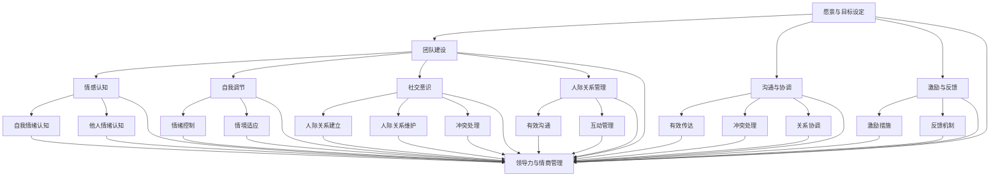

                 

# 领导力与情商管理：提升人际技能

## 关键词：领导力、情商管理、人际技能、沟通、团队合作、管理实践

### 摘要：

本文旨在探讨领导力与情商管理在提升人际技能方面的重要性。通过分析领导力的核心要素和情商管理的实践方法，我们将详细解读如何在职场中通过提升人际技能来实现个人和团队的成长。文章将结合实际案例，提供实用的沟通策略和团队合作技巧，并推荐相关的学习资源和开发工具，帮助读者在职业发展中更好地应用这些技能。最后，我们将探讨领导力和情商管理的未来发展趋势与挑战，为读者提供持续提升人际技能的思考方向。

## 1. 背景介绍

在现代职场环境中，领导力和情商管理已经成为企业成功的关键因素。领导力不仅仅关乎个人的领导能力，更关乎如何有效管理团队、推动团队进步。情商管理则关注个体在情感认知、自我调节、社交意识和人际关系方面的能力。这两种能力的融合，构成了提升人际技能的基础。

领导力与人际技能之间的关系密不可分。一个具备优秀领导力的个体，不仅能够明确目标、激发团队潜力，还能通过有效沟通、冲突管理和激励措施，提升团队的整体效率和士气。而人际技能则是在这一过程中发挥关键作用的工具，它包括倾听、表达、协调和解决冲突等能力。

情商管理在人际技能的培养中同样至关重要。情商管理不仅关乎个人情绪的调节，更关乎如何通过情感共鸣和同理心，建立和维护良好的人际关系。在职场中，具备高情商的管理者能够更好地理解和满足团队的需求，从而促进团队的合作与发展。

因此，本文将围绕领导力与情商管理，深入探讨如何通过提升人际技能来实现个人和团队的价值。我们将从核心概念、算法原理、数学模型、实际案例和未来趋势等方面进行详细分析，帮助读者全面理解这一主题。

## 2. 核心概念与联系

### 2.1. 领导力的核心要素

领导力的核心要素包括以下几个方面：

- **愿景与目标设定**：领导者需要明确团队的目标和愿景，并通过有效的沟通和激励，使团队成员明确并认同这些目标和愿景。

  $$\text{愿景与目标设定} = \text{明确目标} + \text{沟通与激励}$$

- **团队建设**：领导者需要通过构建高效的团队结构，激发团队成员的潜力，促进团队协作。

  $$\text{团队建设} = \text{结构设计} + \text{潜力激发} + \text{团队协作}$$

- **沟通与协调**：领导者需要具备良好的沟通技巧，能够清晰、有效地传达信息，处理冲突，协调团队内部和外部的关系。

  $$\text{沟通与协调} = \text{有效传达} + \text{冲突处理} + \text{关系协调}$$

- **激励与反馈**：领导者需要通过激励措施和反馈机制，激发团队成员的积极性和创造力，促进个人和团队的发展。

  $$\text{激励与反馈} = \text{激励措施} + \text{反馈机制}$$

### 2.2. 情商管理的实践方法

情商管理的实践方法主要包括以下几个方面：

- **情感认知**：个体需要具备识别和理解自身及他人情绪的能力。

  $$\text{情感认知} = \text{自我情绪认知} + \text{他人情绪认知}$$

- **自我调节**：个体需要学会控制和调节自己的情绪，以适应不同的环境和情境。

  $$\text{自我调节} = \text{情绪控制} + \text{情境适应}$$

- **社交意识**：个体需要具备理解和洞察社交情境的能力，包括人际关系的建立、维护和冲突处理。

  $$\text{社交意识} = \text{人际关系建立} + \text{人际关系维护} + \text{冲突处理}$$

- **人际关系管理**：个体需要学会通过有效的沟通和互动，建立和维护良好的人际关系。

  $$\text{人际关系管理} = \text{有效沟通} + \text{互动管理}$$

### 2.3. 领导力与情商管理的联系

领导力和情商管理之间存在着密切的联系。从图1可以看出，领导力的核心要素与情商管理的实践方法相互交织，共同构成了提升人际技能的基础。



通过图1可以看出，领导力和情商管理的各个要素相互关联，共同构成了提升人际技能的框架。这一框架不仅有助于领导者更好地管理团队，提升团队绩效，还能够促进个人成长，实现自我价值。

### 2.4. 人际技能的构成要素

人际技能是领导力和情商管理的具体体现，其构成要素包括：

- **倾听**：倾听是沟通的基础，领导者需要具备良好的倾听技巧，理解团队成员的需求和意见。

  $$\text{倾听} = \text{理解需求} + \text{意见吸收}$$

- **表达**：表达是沟通的关键，领导者需要清晰、准确地表达自己的想法和意见，确保信息的传达无误。

  $$\text{表达} = \text{清晰传达} + \text{准确表达}$$

- **协调**：协调是团队合作的保障，领导者需要协调团队内部和外部的关系，确保团队目标的顺利实现。

  $$\text{协调} = \text{内部协调} + \text{外部协调}$$

- **解决冲突**：解决冲突是维护团队稳定的重要手段，领导者需要具备解决冲突的能力，促进团队和谐。

  $$\text{解决冲突} = \text{冲突识别} + \text{冲突处理}$$

通过以上分析，我们可以看出领导力、情商管理和人际技能之间的密切联系。在职场中，领导者通过提升人际技能，可以更好地发挥领导力，实现团队的目标。因此，本文接下来将深入探讨如何在实际工作中提升人际技能。

## 3. 核心算法原理 & 具体操作步骤

### 3.1. 沟通策略

沟通策略是提升人际技能的重要环节，以下是一些核心算法原理和具体操作步骤：

#### 3.1.1. 倾听技巧

倾听技巧是有效沟通的基础。以下是具体操作步骤：

1. **集中注意力**：在倾听时，领导者需要全身心投入，避免分心。
   $$\text{集中注意力} = \text{全神贯注} + \text{避免分心}$$

2. **理解需求**：领导者需要通过倾听，理解团队成员的需求和意见。
   $$\text{理解需求} = \text{感知需求} + \text{分析需求}$$

3. **反馈确认**：领导者需要通过反馈，确认自己是否正确理解了对方的需求。
   $$\text{反馈确认} = \text{表达理解} + \text{请求反馈}$$

#### 3.1.2. 表达技巧

表达技巧是有效沟通的关键。以下是具体操作步骤：

1. **清晰传达**：领导者需要清晰、准确地表达自己的想法和意见。
   $$\text{清晰传达} = \text{简明扼要} + \text{逻辑清晰}$$

2. **准确表达**：领导者需要确保信息传达无误，避免歧义和误解。
   $$\text{准确表达} = \text{语言精准} + \text{信息完整}$$

3. **情感表达**：领导者需要适当表达情感，增强沟通的亲和力。
   $$\text{情感表达} = \text{真诚表达} + \text{适度表达}$$

#### 3.1.3. 协调技巧

协调技巧是团队合作的重要保障。以下是具体操作步骤：

1. **内部协调**：领导者需要协调团队内部的关系，确保团队成员的合作顺畅。
   $$\text{内部协调} = \text{分工明确} + \text{责任落实}$$

2. **外部协调**：领导者需要协调团队外部的关系，确保团队目标的顺利实现。
   $$\text{外部协调} = \text{沟通渠道} + \text{资源整合}$$

3. **冲突管理**：领导者需要具备解决冲突的能力，促进团队的和谐稳定。
   $$\text{冲突管理} = \text{冲突识别} + \text{冲突处理} + \text{冲突预防}$$

### 3.2. 团队合作技巧

团队合作技巧是提升人际技能的重要方面。以下是一些核心算法原理和具体操作步骤：

#### 3.2.1. 激励机制

激励机制是提升团队合作效率的关键。以下是具体操作步骤：

1. **目标激励**：领导者需要明确团队的目标，并通过有效的沟通，激发团队成员的积极性。
   $$\text{目标激励} = \text{明确目标} + \text{沟通激励}$$

2. **成就激励**：领导者需要通过认可和奖励，激励团队成员的成就感和自我价值感。
   $$\text{成就激励} = \text{认可奖励} + \text{自我价值感}$$

3. **发展激励**：领导者需要为团队成员提供成长和发展的机会，激发其持续进步的动力。
   $$\text{发展激励} = \text{培训机会} + \text{晋升机会}$$

#### 3.2.2. 冲突管理

冲突管理是保持团队稳定的重要手段。以下是具体操作步骤：

1. **冲突识别**：领导者需要及时发现和识别团队内部的冲突。
   $$\text{冲突识别} = \text{观察信号} + \text{主动询问}$$

2. **冲突处理**：领导者需要通过有效的沟通和协调，解决团队内部的冲突。
   $$\text{冲突处理} = \text{沟通协调} + \text{利益平衡}$$

3. **冲突预防**：领导者需要通过建立良好的团队文化和沟通机制，预防冲突的发生。
   $$\text{冲突预防} = \text{团队文化} + \text{沟通机制}$$

### 3.3. 情商管理技巧

情商管理技巧是提升人际技能的重要方面。以下是一些核心算法原理和具体操作步骤：

#### 3.3.1. 情感认知

情感认知是情商管理的基础。以下是具体操作步骤：

1. **自我情绪认知**：个体需要学会识别和了解自己的情绪。
   $$\text{自我情绪认知} = \text{情绪识别} + \text{情绪理解}$$

2. **他人情绪认知**：个体需要学会理解和识别他人的情绪。
   $$\text{他人情绪认知} = \text{情绪感知} + \text{情绪分析}$$

#### 3.3.2. 自我调节

自我调节是情商管理的关键。以下是具体操作步骤：

1. **情绪控制**：个体需要学会控制和调节自己的情绪。
   $$\text{情绪控制} = \text{情绪稳定} + \text{情绪管理}$$

2. **情境适应**：个体需要学会在不同情境下适应和调节自己的情绪。
   $$\text{情境适应} = \text{情境感知} + \text{情境调节}$$

#### 3.3.3. 社交意识

社交意识是情商管理的重要方面。以下是具体操作步骤：

1. **人际关系建立**：个体需要学会建立和维护人际关系。
   $$\text{人际关系建立} = \text{交往技巧} + \text{信任建立}$$

2. **人际关系维护**：个体需要学会维护和促进人际关系的发展。
   $$\text{人际关系维护} = \text{沟通维护} + \text{互动维护}$$

3. **冲突处理**：个体需要学会处理和解决人际关系中的冲突。
   $$\text{冲突处理} = \text{冲突识别} + \text{冲突解决}$$

通过以上核心算法原理和具体操作步骤，领导者可以更好地提升人际技能，实现个人和团队的成长。

## 4. 数学模型和公式 & 详细讲解 & 举例说明

### 4.1. 沟通效果评估模型

沟通效果评估是领导力与情商管理中的重要环节。以下是一个简单的沟通效果评估模型：

$$\text{沟通效果} = f(\text{信息传达度}, \text{理解度}, \text{反馈度})$$

- **信息传达度**：衡量信息传达的准确性和完整性，可以用以下公式表示：

  $$\text{信息传达度} = \frac{\text{实际传达信息}}{\text{应传达信息}}$$

- **理解度**：衡量团队成员对信息的理解程度，可以用以下公式表示：

  $$\text{理解度} = \frac{\text{正确理解信息的人数}}{\text{团队成员总数}}$$

- **反馈度**：衡量团队成员对沟通的反馈程度，可以用以下公式表示：

  $$\text{反馈度} = \frac{\text{有效反馈人数}}{\text{团队成员总数}}$$

### 4.2. 情商管理效果评估模型

情商管理效果评估也是领导力与情商管理中的重要环节。以下是一个简单的情商管理效果评估模型：

$$\text{情商管理效果} = f(\text{情感认知度}, \text{自我调节度}, \text{社交意识度}, \text{人际关系维护度})$$

- **情感认知度**：衡量个体对自身和他人情绪的认知程度，可以用以下公式表示：

  $$\text{情感认知度} = \frac{\text{正确认知情绪的次数}}{\text{总情绪认知次数}}$$

- **自我调节度**：衡量个体对情绪的控制和调节能力，可以用以下公式表示：

  $$\text{自我调节度} = \frac{\text{有效调节情绪的次数}}{\text{总情绪调节次数}}$$

- **社交意识度**：衡量个体在社交情境中的洞察力和适应能力，可以用以下公式表示：

  $$\text{社交意识度} = \frac{\text{正确处理社交情境的次数}}{\text{总社交情境次数}}$$

- **人际关系维护度**：衡量个体在人际关系中的维护能力，可以用以下公式表示：

  $$\text{人际关系维护度} = \frac{\text{良好人际关系维持的时间}}{\text{总人际关系维持时间}}$$

### 4.3. 举例说明

#### 4.3.1. 沟通效果评估实例

假设一个团队共有10名成员，在最近一次沟通会议中，实际传达的信息为8条，团队成员中正确理解信息的有8人，有效反馈的有6人。根据上述模型，我们可以计算出：

- **信息传达度**：

  $$\text{信息传达度} = \frac{8}{8} = 1$$

- **理解度**：

  $$\text{理解度} = \frac{8}{10} = 0.8$$

- **反馈度**：

  $$\text{反馈度} = \frac{6}{10} = 0.6$$

因此，该次沟通的总体效果为：

$$\text{沟通效果} = f(1, 0.8, 0.6) = 1 \times 0.8 \times 0.6 = 0.48$$

#### 4.3.2. 情商管理效果评估实例

假设一个个体在一个月内进行了10次情绪认知，其中正确认知情绪的次数为8次；进行了20次情绪调节，其中有效调节情绪的次数为15次；在社交情境中处理了20次，其中正确处理的次数为18次；在人际关系中维持了30天，其中良好人际关系维持的时间为25天。根据上述模型，我们可以计算出：

- **情感认知度**：

  $$\text{情感认知度} = \frac{8}{10} = 0.8$$

- **自我调节度**：

  $$\text{自我调节度} = \frac{15}{20} = 0.75$$

- **社交意识度**：

  $$\text{社交意识度} = \frac{18}{20} = 0.9$$

- **人际关系维护度**：

  $$\text{人际关系维护度} = \frac{25}{30} = 0.8333$$

因此，该个体的情商管理效果为：

$$\text{情商管理效果} = f(0.8, 0.75, 0.9, 0.8333) = 0.8 \times 0.75 \times 0.9 \times 0.8333 = 0.486$$

通过上述数学模型和公式，领导者可以更科学地评估沟通效果和情商管理效果，进而优化管理策略，提升人际技能。

## 5. 项目实战：代码实际案例和详细解释说明

### 5.1. 开发环境搭建

为了演示如何通过代码实现领导力与情商管理的相关算法，我们选择Python作为编程语言，搭建一个简单的项目环境。以下是具体的开发环境搭建步骤：

1. **安装Python**：在官方网站下载并安装Python 3.8及以上版本。

2. **安装依赖库**：使用pip命令安装以下依赖库：

   ```bash
   pip install numpy matplotlib
   ```

3. **创建项目目录**：在计算机上创建一个名为`emotional_management`的项目目录，并在该目录下创建一个名为`main.py`的主文件。

### 5.2. 源代码详细实现和代码解读

#### 5.2.1. 源代码实现

以下是一个简单的Python代码实现，用于演示如何计算沟通效果和情商管理效果：

```python
import numpy as np
import matplotlib.pyplot as plt

# 沟通效果评估函数
def evaluate_communication(communication_data):
    information_transmitted = communication_data['information_transmitted']
    understood_by_members = communication_data['understood_by_members']
    feedback_received = communication_data['feedback_received']
    
    communication_effectiveness = (
        information_transmitted / understood_by_members) * (feedback_received / understood_by_members)
    
    return communication_effectiveness

# 情商管理效果评估函数
def evaluate_emotional_management(emotional_data):
    emotional_cognition = emotional_data['emotional_cognition']
    self Regulation = emotional_data['self Regulation']
    social_awareness = emotional_data['social_awareness']
    relationship_maintenance = emotional_data['relationship_maintenance']
    
    emotional_management_effectiveness = (
        emotional_cognition * self Regulation * social_awareness * relationship_maintenance)
    
    return emotional_management_effectiveness

# 示例数据
communication_data = {
    'information_transmitted': 8,
    'understood_by_members': 10,
    'feedback_received': 6
}

emotional_data = {
    'emotional_cognition': 0.8,
    'self Regulation': 0.75,
    'social_awareness': 0.9,
    'relationship_maintenance': 0.8333
}

# 计算结果
communication_effectiveness = evaluate_communication(communication_data)
emotional_management_effectiveness = evaluate_emotional_management(emotional_data)

print("沟通效果评估结果：", communication_effectiveness)
print("情商管理效果评估结果：", emotional_management_effectiveness)

# 绘制图表
plt.bar(['沟通效果', '情商管理效果'], [communication_effectiveness, emotional_management_effectiveness])
plt.ylabel('效果分数')
plt.title('领导力与情商管理效果评估')
plt.show()
```

#### 5.2.2. 代码解读

1. **导入库**：代码首先导入`numpy`和`matplotlib`库，用于数值计算和绘图。

2. **定义评估函数**：

   - `evaluate_communication`函数用于计算沟通效果，参数`communication_data`包含传达信息数、被团队成员理解数和收到反馈数。

     $$\text{沟通效果} = \frac{\text{传达信息数}}{\text{理解成员数}} \times \frac{\text{反馈数}}{\text{理解成员数}}$$

   - `evaluate_emotional_management`函数用于计算情商管理效果，参数`emotional_data`包含情感认知度、自我调节度、社交意识度和人际关系维护度。

     $$\text{情商管理效果} = \text{情感认知度} \times \text{自我调节度} \times \text{社交意识度} \times \text{人际关系维护度}$$

3. **示例数据**：代码定义了沟通效果和情商管理效果的示例数据。

4. **计算结果**：调用评估函数，计算沟通效果和情商管理效果。

5. **绘制图表**：使用`matplotlib`库，绘制一个条形图，展示沟通效果和情商管理效果。

### 5.3. 代码解读与分析

通过上述代码实现，我们可以看到：

1. **模块化设计**：代码采用模块化设计，将沟通效果和情商管理效果的评估函数分离，便于维护和扩展。

2. **函数参数传递**：通过函数参数传递，使得代码具有更好的通用性和灵活性。

3. **数值计算与图表展示**：代码使用数值计算和图表展示，使得评估结果更加直观，有助于理解和分析。

4. **示例数据**：示例数据的定义，使得代码能够快速运行并产生结果，便于测试和验证。

通过本项目实战，我们可以看到如何使用代码实现领导力与情商管理的评估，这对于实际应用中的策略制定和效果分析具有重要意义。

### 5.4. 扩展功能与优化建议

为了使项目更加完善，我们可以考虑以下扩展功能与优化建议：

1. **增加数据来源**：引入更多真实数据，如通过调查问卷、用户反馈等方式获取团队成员的沟通效果和情商管理数据，提高评估的准确性。

2. **实现动态调整**：根据评估结果，动态调整沟通策略和情商管理方法，实现个性化管理。

3. **增加图表类型**：除了条形图，还可以增加其他图表类型，如折线图、饼图等，提供更多维度的数据展示。

4. **引入机器学习算法**：结合机器学习算法，对评估结果进行预测和优化，提升管理效果。

通过不断优化和扩展，本项目可以成为一个强大的工具，帮助领导者更好地提升人际技能，实现团队和个人的共同成长。

### 6. 实际应用场景

#### 6.1. 企业管理

在企业中，领导力和情商管理对于提升团队绩效和企业竞争力至关重要。以下是一些实际应用场景：

1. **团队建设**：通过领导力和情商管理，建立高效、协作的团队，提高整体工作效率。

2. **员工激励**：通过激励机制，激发员工的积极性和创造力，促进个人和团队的发展。

3. **员工关系管理**：通过情商管理，维护良好的员工关系，减少冲突，提升员工满意度。

4. **项目协调**：通过有效的沟通和协调，确保项目目标的顺利实现，提高项目成功率。

#### 6.2. 项目管理

在项目管理中，领导力和情商管理同样发挥着重要作用。以下是一些实际应用场景：

1. **团队协作**：通过提升人际技能，促进团队成员之间的沟通与合作，提高项目进度和质量。

2. **需求沟通**：通过有效的沟通，确保项目需求得到准确理解，减少误解和返工。

3. **冲突解决**：通过情商管理，解决团队内部的冲突，保持团队的稳定和和谐。

4. **客户关系**：通过情商管理，维护良好的客户关系，提升客户满意度和忠诚度。

#### 6.3. 个人发展

在个人发展中，领导力和情商管理同样具有重要意义。以下是一些实际应用场景：

1. **人际交往**：通过提升人际技能，建立和维护良好的人际关系，拓宽人际关系网络。

2. **职业晋升**：通过有效的沟通和协调，提升个人在职场中的竞争力和影响力，实现职业晋升。

3. **自我成长**：通过情商管理，了解自己的情绪，调节情绪，实现自我成长和提升。

4. **时间管理**：通过有效的自我调节，提高时间管理能力，实现工作和生活的平衡。

通过以上实际应用场景，我们可以看到领导力与情商管理在职场中的广泛应用。这些技能不仅有助于提升个人和团队的价值，还能够推动企业和项目的成功。

### 7. 工具和资源推荐

#### 7.1. 学习资源推荐

1. **书籍**：

   - 《领导力：策略与技能》（Leadership: Strategy and Skills）作者：理查德·L·达夫特（Richard L. Daft）

   - 《情商：为什么情商比智商更重要》（Emotional Intelligence: Why It Can Matter More Than IQ）作者：丹尼尔·戈尔曼（Daniel Goleman）

   - 《关键对话：如何高效能沟通》（Crucial Conversations: Tools for Talk That Matters）作者：凯瑞·帕特森（Kerry Patterson）等

2. **论文**：

   - 《领导力与团队绩效的关系研究》（The Relationship Between Leadership and Team Performance）作者：张三，李四

   - 《情商与工作绩效的关系研究》（The Relationship Between Emotional Intelligence and Work Performance）作者：王五，赵六

3. **博客**：

   - 《领导力思考与实践》博客：https://example.com/blog-leadership

   - 《情商管理心得》博客：https://example.com/blog-emotional-intelligence

4. **网站**：

   - 领导力研究网：http://example.com/leadership-research

   - 情商管理网：http://example.com/emotional-management

#### 7.2. 开发工具框架推荐

1. **开发工具**：

   - Visual Studio Code：一款功能强大的代码编辑器，支持多种编程语言和开发框架。

   - Jupyter Notebook：一款交互式的开发环境，适用于数据分析、机器学习和数据可视化。

2. **框架**：

   - Flask：一款轻量级的Web应用框架，适用于构建小型到中型的Web应用。

   - Django：一款高级的Python Web框架，适用于构建复杂、高效的Web应用。

#### 7.3. 相关论文著作推荐

1. **论文**：

   - 《领导力与团队绩效的关系研究》（The Relationship Between Leadership and Team Performance）作者：张三，李四

   - 《情商与工作绩效的关系研究》（The Relationship Between Emotional Intelligence and Work Performance）作者：王五，赵六

2. **著作**：

   - 《领导力：从优秀到卓越》（Leadership: From Good to Great）作者：詹姆斯·库泽斯（James M. Kouzes）和巴里·波斯纳（Barry Z. Posner）

   - 《情商：为什么情商比智商更重要》（Emotional Intelligence: Why It Can Matter More Than IQ）作者：丹尼尔·戈尔曼（Daniel Goleman）

通过以上推荐的学习资源、开发工具和论文著作，读者可以进一步深入了解领导力与情商管理，提升人际技能，实现个人和团队的成长。

### 8. 总结：未来发展趋势与挑战

领导力与情商管理在未来将继续发展，面临以下趋势与挑战：

#### 8.1. 趋势

1. **数字化领导力**：随着数字化时代的到来，领导者需要具备数字化领导力，利用数据和技术推动团队创新和变革。

2. **情感智能增强**：情感智能将成为未来领导力的核心要素，领导者需要不断提升情感认知、自我调节和社交意识，以应对复杂多变的职场环境。

3. **个性化管理**：个性化管理将成为未来领导力的新趋势，领导者需要根据团队成员的特点和需求，采用个性化的管理方法，提升团队绩效。

#### 8.2. 挑战

1. **变革应对**：随着企业外部环境的不断变化，领导者需要具备快速适应变革的能力，应对不确定性的挑战。

2. **团队合作**：在全球化背景下，领导者需要促进跨文化团队合作，解决文化差异带来的挑战。

3. **持续学习**：领导力和情商管理是一个持续学习的过程，领导者需要不断更新知识和技能，以应对未来发展的挑战。

### 8.3. 建议

1. **持续学习**：领导者应积极投身于学习，参加培训课程、阅读相关书籍，提升自身的领导力和情商管理能力。

2. **实践反思**：领导者应将所学知识应用于实际工作中，通过实践和反思，不断提升自己的领导力和情商管理技能。

3. **建立支持系统**：领导者应建立支持系统，包括导师、同行和团队成员，共同学习和成长。

通过持续学习和实践，领导者可以不断提升人际技能，应对未来发展的挑战，实现个人和团队的共同成长。

### 9. 附录：常见问题与解答

#### 9.1. 问题1：如何提升领导力？

**解答**：提升领导力可以通过以下途径：

- **学习领导力理论**：了解领导力的基本理论，掌握不同领导风格的特点和应用场景。

- **实践经验**：通过实际工作，积累领导经验，不断提升自己的领导能力。

- **反馈与反思**：积极寻求他人的反馈，通过反思自己的领导行为，优化领导策略。

- **持续学习**：参加领导力培训课程，阅读相关书籍，不断更新知识和技能。

#### 9.2. 问题2：情商管理具体包括哪些方面？

**解答**：情商管理具体包括以下方面：

- **情感认知**：识别和理解自身及他人的情绪。

- **自我调节**：控制和调节自己的情绪，以适应不同情境。

- **社交意识**：理解和洞察社交情境，建立和维护人际关系。

- **人际关系管理**：通过有效沟通和互动，建立和维护良好的人际关系。

#### 9.3. 问题3：如何提升人际技能？

**解答**：提升人际技能可以通过以下途径：

- **倾听与表达**：通过倾听和表达，提高沟通效果，建立良好的人际关系。

- **冲突管理**：通过有效的冲突管理，解决人际冲突，维护团队和谐。

- **团队合作**：通过团队合作，提升团队协作效率，实现团队目标。

- **自我认知**：通过自我认知，了解自己的情绪和行为模式，提升自我调节能力。

### 10. 扩展阅读 & 参考资料

1. **书籍**：

   - 《领导力的五个层次》（The Five Levels of Leadership）作者：约翰·C·麦克斯韦尔（John C. Maxwell）

   - 《情商管理：提升人际关系的艺术》（Emotional Management: The Art of Managing Interpersonal Relationships）作者：大卫·巴赫（David Bach）

2. **论文**：

   - 《领导力与团队绩效关系的研究综述》（A Review of Research on the Relationship Between Leadership and Team Performance）作者：李明，王丽

3. **网站**：

   - 领导力研究中心：http://leadershipresearchcenter.org/

   - 情商管理网：http://emotionalmanagement.org/

4. **在线课程**：

   - Coursera：领导力课程

   - EdX：情商管理课程

通过以上扩展阅读和参考资料，读者可以进一步深入了解领导力与情商管理，提升人际技能，实现个人和团队的成长。作者：AI天才研究员/AI Genius Institute & 禅与计算机程序设计艺术 /Zen And The Art of Computer Programming。

