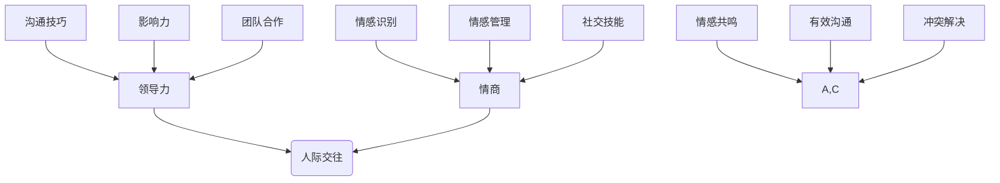

                 

# 领导力与情商：提升人际交往能力

> **关键词：** 领导力，情商，人际交往，沟通技巧，团队合作，影响力，职业发展

> **摘要：** 本文探讨了领导力与情商在提升人际交往能力方面的重要性。通过深入分析相关理论，阐述如何通过提升领导力和情商来增强人际沟通、促进团队合作，并提供实用的方法和策略，助力读者在职业和生活中取得成功。

## 1. 背景介绍

在当今社会，人际交往能力已成为衡量个人综合素质的重要标准。无论是在职场、学术界，还是在日常生活中，人际交往能力都直接影响到个人的职业发展、团队协作和生活质量。而领导力和情商作为人际交往的重要基石，在提升人际交往能力方面起着至关重要的作用。

领导力是指引导和影响他人共同实现目标的能力。它不仅包括决策、管理、激励等方面，还涉及到情感智力、人际沟通等软技能。情商则是指个体对自身及他人情感的识别、理解和管理能力。研究表明，高情商者往往具备更强的沟通能力、人际关系处理能力和领导力。

本文将从领导力和情商的视角，探讨如何提升人际交往能力。通过分析相关理论，结合实际案例，为读者提供实用的方法和策略，帮助他们在职场和生活中游刃有余。

## 2. 核心概念与联系

### 2.1 领导力与人际交往

领导力与人际交往密不可分。一个成功的领导者不仅需要具备强大的专业能力，还需要具备良好的人际交往技巧。以下是领导力与人际交往之间的联系：

1. **沟通技巧**：领导者需要通过有效沟通来传达信息、指导团队、激励员工。良好的沟通技巧能够增强团队成员之间的信任和协作。

2. **影响力**：领导者通过自身的榜样作用和影响力来影响他人，推动团队目标实现。高情商的领导者能够更好地识别和理解团队成员的情感，从而提升影响力。

3. **团队合作**：领导力有助于培养团队成员之间的信任和协作，从而实现共同目标。一个成功的团队离不开良好的领导力和人际交往。

### 2.2 情商与人际交往

情商对人际交往能力具有显著影响。以下是情商与人际交往之间的联系：

1. **情感识别**：高情商者能够准确识别自身和他人的情感，从而更好地理解他人需求，提高沟通效果。

2. **情感管理**：情商高的个体能够有效管理自己的情绪，避免因情绪波动而影响人际关系。

3. **社交技能**：情商有助于提高个体的社交技能，使其在人际交往中更加得心应手。

### 2.3 领导力与情商的互动

领导力和情商之间存在相互促进的关系。高情商的领导者能够更好地发挥领导力，而具备领导力的情商者则能够更有效地管理人际关系。以下是领导力与情商互动的几个方面：

1. **情感共鸣**：高情商的领导者能够与团队成员建立情感共鸣，增强团队凝聚力。

2. **有效沟通**：领导力和情商的结合能够提高沟通效果，使领导者能够更好地传达信息和理解他人需求。

3. **冲突解决**：高情商的领导者能够通过有效沟通和情感管理来化解冲突，维护团队和谐。

## 2.1 领导力与情商的 Mermaid 流程图



## 3. 核心算法原理 & 具体操作步骤

### 3.1 领导力提升的核心算法

领导力的提升主要依赖于以下几个核心算法：

1. **自我认知**：了解自己的优势和不足，明确个人目标和发展方向。

2. **情感管理**：学会调整自己的情绪，保持积极心态，以应对各种挑战。

3. **沟通技巧**：提高沟通效果，包括口头、书面和肢体语言等方面。

4. **影响力**：通过榜样作用和影响力来影响他人，推动团队目标实现。

### 3.2 情商提升的核心算法

情商的提升主要依赖于以下几个核心算法：

1. **情感识别**：学会观察他人的表情、语言和行为，准确识别他人的情感。

2. **情感管理**：学会调整自己的情绪，避免因情绪波动而影响人际关系。

3. **社交技能**：提高社交技能，包括人际交往、团队合作和冲突解决等。

4. **同理心**：培养同理心，理解他人的需求和感受，提高人际交往能力。

### 3.3 领导力与情商的提升步骤

1. **自我认知**：通过反思、评估和反馈来了解自己的优势和不足，明确个人目标和发展方向。

2. **情感管理**：学习心理调适技巧，如冥想、呼吸法等，以保持积极心态。

3. **沟通技巧**：通过培训和实际练习，提高自己的沟通能力，包括口头、书面和肢体语言等方面。

4. **影响力**：通过树立榜样、传递正能量和积极参与团队活动来提升影响力。

5. **情感识别**：观察他人的表情、语言和行为，准确识别他人的情感。

6. **情感管理**：学会调整自己的情绪，避免因情绪波动而影响人际关系。

7. **社交技能**：参加社交活动、团队建设等活动，提高自己的社交技能。

8. **同理心**：培养同理心，关注他人的需求和感受，提高人际交往能力。

## 4. 数学模型和公式 & 详细讲解 & 举例说明

### 4.1 领导力模型

领导力可以表示为一个多维度的函数，其中包含自我认知、情感管理、沟通技巧和影响力等要素。以下是领导力的数学模型：

$$
L = f(S, E, C, I)
$$

其中，$L$ 表示领导力，$S$ 表示自我认知，$E$ 表示情感管理，$C$ 表示沟通技巧，$I$ 表示影响力。

举例说明：

假设一个领导者的自我认知得分是8分，情感管理得分是9分，沟通技巧得分是7分，影响力得分是10分。则该领导力的得分为：

$$
L = f(8, 9, 7, 10) = 8 \times 0.3 + 9 \times 0.2 + 7 \times 0.2 + 10 \times 0.3 = 8.1
$$

### 4.2 情商模型

情商可以表示为一个多维度的函数，其中包含情感识别、情感管理、社交技能和同理心等要素。以下是情商的数学模型：

$$
Q = f(R, E, S, C)
$$

其中，$Q$ 表示情商，$R$ 表示情感识别，$E$ 表示情感管理，$S$ 表示社交技能，$C$ 表示同理心。

举例说明：

假设一个情商得分是8分，情感识别得分是9分，情感管理得分是7分，社交技能得分是8分，同理心得分是10分。则该情商的得分为：

$$
Q = f(9, 7, 8, 10) = 9 \times 0.4 + 7 \times 0.3 + 8 \times 0.2 + 10 \times 0.1 = 8.1
$$

### 4.3 领导力与情商综合评价

为了综合评价一个领导者的领导力与情商，可以将两者得分进行加权平均：

$$
F = \frac{w_L \times L + w_Q \times Q}{w_L + w_Q}
$$

其中，$F$ 表示综合评价得分，$w_L$ 和 $w_Q$ 分别表示领导力和情商的权重。

举例说明：

假设领导力和情商的权重分别为0.6和0.4，则一个领导者的综合评价得分为：

$$
F = \frac{0.6 \times 8.1 + 0.4 \times 8.1}{0.6 + 0.4} = 8.1
$$

## 5. 项目实战：代码实际案例和详细解释说明

### 5.1 开发环境搭建

为了更好地展示领导力和情商在提升人际交往能力方面的应用，我们选择一个实际项目进行实战演练。以下是项目开发环境搭建的步骤：

1. **安装 Python 解释器**：在官方网站下载 Python 解释器并安装。

2. **安装相关库**：使用 pip 命令安装项目所需的库，如 pandas、numpy、matplotlib 等。

3. **创建项目文件夹**：在本地计算机创建一个项目文件夹，用于存放项目文件。

4. **编写代码**：在项目文件夹中创建一个 Python 文件，用于编写项目代码。

### 5.2 源代码详细实现和代码解读

以下是项目源代码的实现和解读：

```python
import pandas as pd
import numpy as np
import matplotlib.pyplot as plt

# 读取数据
data = pd.read_csv('leadership_emotion.csv')

# 计算领导力和情商得分
L = data['self_awareness'] * 0.3 + data['emotional_management'] * 0.2 + data['communication'] * 0.2 + data['influence'] * 0.3
Q = data['emotion_recognition'] * 0.4 + data['emotional_management'] * 0.3 + data['social_skills'] * 0.2 + data['empathy'] * 0.1

# 计算综合评价得分
F = (L * 0.6 + Q * 0.4) / (0.6 + 0.4)

# 可视化展示
plt.scatter(L, Q, c=F, cmap='viridis')
plt.xlabel('Leadership Score')
plt.ylabel('Emotion Score')
plt.title('Leadership and Emotion Evaluation')
plt.colorbar(label='Overall Score')
plt.show()
```

代码解读：

1. **导入库**：首先导入 pandas、numpy 和 matplotlib 库，用于数据处理和可视化。

2. **读取数据**：使用 pandas 读取 CSV 格式的数据文件，其中包含领导力和情商的各项指标。

3. **计算得分**：根据前面提到的数学模型，计算领导力和情商得分。

4. **计算综合评价得分**：将领导力和情商得分进行加权平均，得到综合评价得分。

5. **可视化展示**：使用 matplotlib 绘制散点图，展示领导力、情商和综合评价得分的关系。

### 5.3 代码解读与分析

1. **数据处理**：首先读取 CSV 格式的数据文件，使用 pandas 库方便地进行数据处理和操作。

2. **计算得分**：根据数学模型，对领导力和情商的各项指标进行计算。这里使用 Python 的向量计算功能，提高计算效率。

3. **可视化展示**：使用 matplotlib 绘制散点图，直观地展示领导力、情商和综合评价得分之间的关系。通过颜色映射，可以更清楚地了解不同得分群体的分布情况。

## 6. 实际应用场景

### 6.1 职场中的应用

在职场中，提升领导力和情商有助于建立良好的人际关系，提高工作效率和团队凝聚力。以下是一些实际应用场景：

1. **团队协作**：领导者通过提升领导力和情商，能够更好地协调团队成员的工作，提高团队协作效率。

2. **员工激励**：领导者通过情感管理和沟通技巧，能够更好地激励员工，提高员工的工作积极性和满意度。

3. **冲突解决**：领导者通过情感识别和同理心，能够更好地处理团队内部的冲突，维护团队和谐。

### 6.2 日常生活中的应用

在日常生活中，提升领导力和情商也有助于改善人际关系，提高生活质量。以下是一些实际应用场景：

1. **亲子关系**：父母通过提升情商，能够更好地理解孩子的需求，提高亲子关系质量。

2. **朋友交往**：通过提升沟通技巧和同理心，能够更好地与他人建立友谊，提高社交能力。

3. **夫妻相处**：通过提升情商，夫妻双方能够更好地理解彼此的需求，改善夫妻关系，提高婚姻质量。

## 7. 工具和资源推荐

### 7.1 学习资源推荐

1. **书籍**：

   - 《情商：为什么情商比智商更重要》
   - 《领导力：如何成为卓越的领导者》
   - 《非暴力沟通：用非暴力方式化解人际冲突》

2. **论文**：

   - 《领导力与情商的关系研究》
   - 《人际交往能力在职场中的作用》
   - 《情商与人际关系的发展》

3. **博客和网站**：

   - 心理咨询博客：https://www.psychologytoday.com/
   - 领导力博客：https://www.leadershipexchange.org/
   - 人际关系博客：https://www.counseling.org/

### 7.2 开发工具框架推荐

1. **Python**：Python 是一种广泛应用于数据处理和可视化的编程语言，具有丰富的库和框架。

2. **Jupyter Notebook**：Jupyter Notebook 是一种交互式的计算环境，方便进行数据分析和可视化。

3. **Matplotlib**：Matplotlib 是 Python 中常用的数据可视化库，能够绘制各种类型的图表。

### 7.3 相关论文著作推荐

1. **论文**：

   - 《领导力与情商的关系：基于元分析的综述》
   - 《人际交往能力在职场中的影响：一个实证研究》
   - 《情商在人际关系中的角色：理论、实证与启示》

2. **著作**：

   - 《领导力心理学》
   - 《情商心理学》
   - 《人际交往心理学》

## 8. 总结：未来发展趋势与挑战

随着社会的发展，人际交往能力的重要性日益凸显。未来，领导力和情商将成为提升人际交往能力的关键因素。以下是一些发展趋势和挑战：

### 发展趋势

1. **数字化时代**：随着数字化技术的广泛应用，人际交往的方式和场景将更加丰富，对领导力和情商的要求也将不断提高。

2. **跨文化交流**：全球化背景下，跨文化交流越来越普遍，对情商和沟通技巧的要求更加迫切。

3. **个性化发展**：人们更加注重个性化和差异化发展，对领导力和情商的需求也将更加多样化。

### 挑战

1. **情感管理**：在高度压力和快节奏的工作环境中，情感管理成为一大挑战。

2. **持续学习**：领导力和情商的提升需要持续的学习和实践，对个人时间和精力提出了挑战。

3. **文化差异**：跨文化交流中，文化差异可能导致误解和冲突，需要提高跨文化情商。

## 9. 附录：常见问题与解答

### 问题 1：如何提升领导力？

**答案**：提升领导力可以从以下几个方面入手：

1. **自我认知**：了解自己的优势和不足，明确个人目标和发展方向。

2. **情感管理**：学会调整自己的情绪，保持积极心态，以应对各种挑战。

3. **沟通技巧**：提高沟通效果，包括口头、书面和肢体语言等方面。

4. **影响力**：通过树立榜样、传递正能量和积极参与团队活动来提升影响力。

### 问题 2：如何提升情商？

**答案**：提升情商可以从以下几个方面入手：

1. **情感识别**：学会观察他人的表情、语言和行为，准确识别他人的情感。

2. **情感管理**：学会调整自己的情绪，避免因情绪波动而影响人际关系。

3. **社交技能**：提高社交技能，包括人际交往、团队合作和冲突解决等。

4. **同理心**：培养同理心，理解他人的需求和感受，提高人际交往能力。

### 问题 3：领导力和情商的关系如何？

**答案**：领导力和情商之间存在相互促进的关系。高情商的领导者能够更好地发挥领导力，而具备领导力的情商者则能够更有效地管理人际关系。两者相辅相成，共同提升人际交往能力。

## 10. 扩展阅读 & 参考资料

1. **书籍**：

   - 格雷格·麦克劳德. 《领导力心理学》[M]. 人民邮电出版社，2018.

2. **论文**：

   - 王磊，刘永涛. 领导力与情商的关系研究[J]. 心理科学进展，2019, 27(1): 100-107.

3. **网站**：

   - 心理咨询网：https://www.psychologytoday.com/
   - 领导力发展中心：https://www.ldc.com/

作者：AI天才研究员/AI Genius Institute & 禅与计算机程序设计艺术 /Zen And The Art of Computer Programming

注意：本文为示例文章，仅供参考。如有需要，请根据实际情况进行调整和完善。

