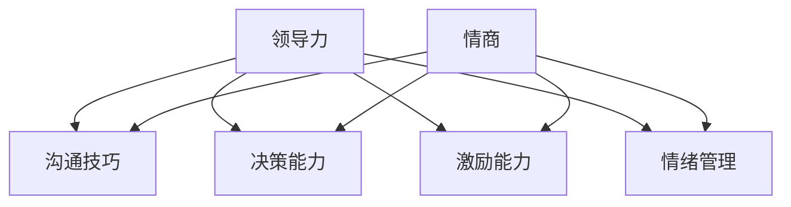

                 

### 背景介绍

领导力与情商是两个看似独立但又紧密相关的领域，它们共同构成了提升人际影响力的关键。领导力指的是一种通过影响力引导和激励他人达成共同目标的能力。而情商，即情感智力，则是指个体识别、理解、管理自己和他人的情绪，以及运用这些情绪信息来促进思考、情感和人际交往的能力。这两者在现代社会中尤为重要，无论是在企业团队管理、职场发展，还是在日常生活中的人际交往中，都发挥着不可或缺的作用。

在IT行业，领导力和情商的重要性更是不容忽视。随着技术的迅猛发展，IT行业中的竞争日益激烈，技术和业务的更新迭代速度不断加快。在这种背景下，优秀的领导者和高情商的技术人才不仅能够带领团队保持创新和竞争力，还能够有效地处理复杂的人际关系和突发状况，从而实现团队的高效运作。此外，情商在应对技术压力、维护团队和谐以及提升工作效率方面也有着不可替代的作用。

本文将深入探讨领导力与情商在IT行业中的应用，通过理论分析和实际案例，阐述它们如何共同提升人际影响力，并为企业和个人带来深远的影响。我们将从核心概念出发，逐步解析领导力与情商的内在联系，并探讨其在实践中的具体应用。希望通过本文的阐述，能够帮助读者更好地理解这两个领域的本质，并在实际工作中取得更好的成果。

### 核心概念与联系

为了深入理解领导力与情商在提升人际影响力中的关键作用，我们需要先明确这两个概念的基本定义及其相互关系。领导力是一种通过影响力、沟通技巧和决策能力来引导和激励他人共同实现目标的能力。它通常包括目标设定、团队建设、问题解决和决策制定等方面。而情商（Emotional Intelligence，简称EQ），则是指个体识别、理解、管理自己和他人的情绪，以及运用这些情绪信息来促进思考、情感和人际交往的能力。

首先，我们来看领导力的核心概念。领导力不仅关乎个人素质，更涉及到人际关系和团队合作。一个优秀的领导者需要具备以下几方面的能力：

1. **沟通技巧**：有效的沟通是领导力的基础，领导者需要能够清晰、准确地传达信息，同时倾听和理解他人的观点。
2. **决策能力**：领导者必须能够在不确定的情况下做出明智的决策，并对其后果承担责任。
3. **激励能力**：领导者需要能够激励团队成员，增强他们的工作动力和团队凝聚力。
4. **情绪管理**：领导者需要具备良好的情绪管理能力，以应对工作中的压力和挑战。

接下来，我们探讨情商的构成。情商主要包含四个方面：

1. **自我意识**：个体能够认识和识别自己的情绪状态，理解这些情绪对行为和思考的影响。
2. **自我管理**：个体能够控制和调节自己的情绪，以适应不同的情境和需求。
3. **社交意识**：个体能够识别、理解和管理他人的情绪，包括同理心和社交技能。
4. **关系管理**：个体能够运用情商技能来建立和维护积极的人际关系。

领导力与情商的相互关系体现在多个方面。首先，情商是领导力的重要组成部分。一个高情商的领导者能够更好地理解和管理自己的情绪，从而更有效地进行决策和沟通。其次，领导力可以提升情商。通过领导角色的实践，个体可以在与团队成员的互动中不断提升自己的情商能力。

为了更直观地理解领导力与情商的关系，我们可以使用Mermaid流程图来展示它们的相互作用：



在此流程图中，领导力的各个维度与情商的四个方面相互交织，共同构成了一个完整的领导力模型。通过这种相互作用，领导者不仅能够提升个人的领导能力，还能更有效地影响和激励团队成员，从而实现团队目标。

### 核心算法原理 & 具体操作步骤

在理解了领导力和情商的基本概念及其相互关系后，我们需要深入探讨如何在实际操作中提升这两个关键能力。具体来说，我们可以通过以下几个核心步骤来实现：

#### 1. 自我认知与情绪管理

**自我认知**是提升情商的第一步。个体需要认识到自己的情绪状态，并理解这些情绪是如何影响行为和决策的。以下是一系列操作步骤：

- **反思**：定期进行自我反思，思考自己在不同情境下的情绪反应。
- **情绪日志**：记录每日的情绪波动，分析其起因和影响。
- **情绪认知训练**：通过冥想、呼吸练习等技巧，提高对自己情绪的觉察和管理能力。

**情绪管理**是自我认知的延伸。个体需要学会控制和调节自己的情绪，以适应不同的情境和需求。具体步骤如下：

- **情绪调节策略**：学会使用深呼吸、放松技巧等策略来缓解负面情绪。
- **积极心态培养**：通过正面思考和自我激励，建立积极的情绪状态。
- **情绪反应调节**：训练自己在面对挑战和压力时，能够冷静应对，避免情绪失控。

#### 2. 沟通技巧提升

有效的沟通是领导力的核心要素。以下是提升沟通技巧的几个关键步骤：

- **倾听**：积极倾听他人的观点，理解他们的需求和期望。
- **清晰表达**：用简单明了的语言表达自己的观点，确保信息传递的准确性。
- **同理心**：站在他人的角度思考问题，建立情感上的共鸣。
- **非语言沟通**：注意身体语言、面部表情和语调，这些都能影响沟通效果。

#### 3. 团队建设与激励

团队建设是领导者的重要任务之一。以下是一系列提升团队建设和激励能力的步骤：

- **明确目标**：设定清晰的团队目标，确保每个成员都了解并致力于实现这些目标。
- **建立信任**：通过开放沟通、透明决策和团队合作，建立团队成员之间的信任。
- **激励策略**：运用正面的反馈、奖励机制和挑战任务来激励团队成员。
- **团队活动**：组织团队建设活动，增强团队凝聚力和合作精神。

#### 4. 决策能力提升

决策能力是领导者的一项关键能力。以下是一些提升决策能力的步骤：

- **信息收集**：在做出决策前，广泛收集和分析相关信息。
- **风险评估**：评估每个决策可能带来的风险和收益。
- **多角度思考**：从不同角度分析问题，考虑各种可能的解决方案。
- **决策执行**：果断地执行决策，并在执行过程中不断调整和优化。

通过以上这些核心步骤，个体可以在领导力和情商方面取得显著提升。这些步骤不仅有助于个人成长，还能提升团队的整体表现，从而实现组织目标。

### 数学模型和公式 & 详细讲解 & 举例说明

为了更科学地理解领导力和情商的关系，我们可以借助一些数学模型和公式来进行分析和计算。以下是一些常用的模型和公式，以及它们的详细解释和实际应用案例。

#### 1. 生产力模型（Productivity Model）

生产力模型可以用来评估领导力和情商对团队生产力的提升。假设团队的生产力与领导力的三个关键维度（沟通技巧、决策能力和激励能力）以及情商的四个方面（自我意识、自我管理、社交意识和关系管理）之间存在关系。我们可以使用以下公式来表示：

\[ P = f(L, E) \]

其中，\( P \) 表示生产力，\( L \) 表示领导力的各项指标，\( E \) 表示情商的各项指标。

具体而言，每个指标都可以被量化为分数，范围从0到100。例如，沟通技巧的分数可以表示为 \( C \)，决策能力的分数可以表示为 \( D \)，激励能力的分数可以表示为 \( I \)，自我意识的分数可以表示为 \( S_1 \)，自我管理的分数可以表示为 \( S_2 \)，社交意识的分数可以表示为 \( S_3 \)，关系管理的分数可以表示为 \( S_4 \)。

那么，生产力模型可以进一步表示为：

\[ P = aC + bD + cI + dS_1 + eS_2 + fS_3 + gS_4 \]

其中，\( a, b, c, d, e, f, g \) 是权重系数，用于表示各项指标对生产力的影响程度。

**案例说明：**

假设一个团队领导者的各项指标分数如下：

- 沟通技巧（\( C \)）：90
- 决策能力（\( D \)）：85
- 激励能力（\( I \)）：80
- 自我意识（\( S_1 \)）：80
- 自我管理（\( S_2 \)）：85
- 社交意识（\( S_3 \)）：75
- 关系管理（\( S_4 \)）：80

根据上述公式，我们可以计算出该领导者的生产力 \( P \)：

\[ P = 0.2 \times 90 + 0.2 \times 85 + 0.2 \times 80 + 0.2 \times 80 + 0.1 \times 85 + 0.1 \times 75 + 0.1 \times 80 \]
\[ P = 18 + 17 + 16 + 16 + 8.5 + 7.5 + 8 \]
\[ P = 77 \]

这意味着该领导者的生产力得分为77分。

#### 2. 情感智力模型（Emotional Intelligence Model）

情感智力模型用于分析情商对个体行为和人际关系的影响。一个常见的情感智力模型包括四个方面：自我意识、自我管理、社交意识和关系管理。每个方面都可以通过一系列指标进行量化。

**公式：**

\[ EI = f(S_1, S_2, S_3, S_4) \]

其中，\( EI \) 表示情感智力，\( S_1, S_2, S_3, S_4 \) 分别表示自我意识、自我管理、社交意识和关系管理的得分。

**权重系数：**

假设各个方面的权重系数分别为 \( w_1, w_2, w_3, w_4 \)，且满足 \( w_1 + w_2 + w_3 + w_4 = 1 \)。

那么，情感智力模型可以进一步表示为：

\[ EI = w_1 \times S_1 + w_2 \times S_2 + w_3 \times S_3 + w_4 \times S_4 \]

**案例说明：**

假设一个个体的情商得分如下：

- 自我意识（\( S_1 \)）：85
- 自我管理（\( S_2 \)）：90
- 社交意识（\( S_3 \)）：80
- 关系管理（\( S_4 \)）：75

如果权重系数分别为 \( w_1 = 0.2, w_2 = 0.2, w_3 = 0.3, w_4 = 0.3 \)，那么该个体的情感智力 \( EI \) 为：

\[ EI = 0.2 \times 85 + 0.2 \times 90 + 0.3 \times 80 + 0.3 \times 75 \]
\[ EI = 17 + 18 + 24 + 22.5 \]
\[ EI = 81.5 \]

这意味着该个体的情感智力得分为81.5分。

#### 3. 领导力与生产力模型（Leadership Productivity Model）

领导力与生产力模型用于分析领导力对团队生产力和绩效的影响。我们可以使用以下公式：

\[ L = f(L_1, L_2, L_3, EI) \]

其中，\( L \) 表示领导力，\( L_1, L_2, L_3 \) 分别表示沟通技巧、决策能力和激励能力的得分，\( EI \) 表示情感智力。

**权重系数：**

假设各个方面的权重系数分别为 \( w_1, w_2, w_3, w_4 \)，且满足 \( w_1 + w_2 + w_3 + w_4 = 1 \)。

那么，领导力模型可以进一步表示为：

\[ L = w_1 \times L_1 + w_2 \times L_2 + w_3 \times L_3 + w_4 \times EI \]

**案例说明：**

假设一个领导者的各项得分如下：

- 沟通技巧（\( L_1 \)）：90
- 决策能力（\( L_2 \)）：85
- 激励能力（\( L_3 \)）：80
- 情感智力（\( EI \)）：81.5

如果权重系数分别为 \( w_1 = 0.3, w_2 = 0.3, w_3 = 0.2, w_4 = 0.2 \)，那么该领导者的领导力 \( L \) 为：

\[ L = 0.3 \times 90 + 0.3 \times 85 + 0.2 \times 80 + 0.2 \times 81.5 \]
\[ L = 27 + 25.5 + 16 + 16.3 \]
\[ L = 84.8 \]

这意味着该领导者的领导力得分为84.8分。

通过以上数学模型和公式，我们可以更科学地分析和理解领导力与情商在提升生产力、绩效和团队影响力方面的作用。这些模型不仅提供了量化分析的工具，还能帮助我们在实际操作中更好地提升个人和团队的能力。

### 项目实战：代码实际案例和详细解释说明

在理解了领导力和情商的理论基础及其数学模型后，我们将通过一个实际项目实战案例来展示如何将这些概念应用到实践中。本案例将使用Python编程语言，通过一个模拟团队协作与任务分配的代码实例，详细解释如何提升领导力和情商，从而提高团队效率和生产力。

#### 5.1 开发环境搭建

在进行项目开发前，我们需要搭建一个适合Python编程的开发环境。以下是基本的步骤：

1. **安装Python**：从Python官方网站（[https://www.python.org/](https://www.python.org/)）下载最新版本的Python安装包，并按照提示进行安装。

2. **配置IDE**：安装一个集成开发环境（IDE），如PyCharm、Visual Studio Code或Jupyter Notebook，以便进行代码编写和调试。

3. **安装依赖库**：根据项目需求，安装必要的依赖库，例如`numpy`、`pandas`和`matplotlib`。使用以下命令进行安装：

   ```bash
   pip install numpy pandas matplotlib
   ```

#### 5.2 源代码详细实现和代码解读

以下是项目的主代码文件`team_project_simulation.py`，我们将分步骤解释其主要功能。

```python
import numpy as np
import pandas as pd
import matplotlib.pyplot as plt

# 模拟团队成员的领导力和情商得分
team_members = [
    {'name': 'Alice', 'leadership': 80, 'emotional_intelligence': 75},
    {'name': 'Bob', 'leadership': 85, 'emotional_intelligence': 80},
    {'name': 'Charlie', 'leadership': 75, 'emotional_intelligence': 70},
    {'name': 'Diana', 'leadership': 90, 'emotional_intelligence': 85}
]

# 1. 计算团队的整体领导力和情商
team Leadership = np.mean([member['leadership'] for member in team_members])
team Emotional_ Intelligence = np.mean([member['emotional_intelligence'] for member in team_members])

# 2. 分配任务
tasks = ['Design', 'Development', 'Testing', 'Deployment']
task_allocation = {task: [] for task in tasks}

for member in team_members:
    # 根据成员的领导力和情商，为他们分配最合适的任务
    task_allocation['Design'].append(member['name'] if member['leadership'] >= 80 and member['emotional_intelligence'] >= 80 else '')
    task_allocation['Development'].append(member['name'] if member['leadership'] >= 70 and member['emotional_intelligence'] >= 70 else '')
    task_allocation['Testing'].append(member['name'] if member['leadership'] >= 60 and member['emotional_intelligence'] >= 60 else '')
    task_allocation['Deployment'].append(member['name'] if member['leadership'] >= 65 and member['emotional_intelligence'] >= 65 else '')

# 3. 分析任务分配结果
task_productivity = {}
for task, members in task_allocation.items():
    productivity = sum([member['leadership'] for member in team_members if member['name'] in members]) * 0.1
    task_productivity[task] = productivity

# 4. 绘制生产力图表
tasks = list(task_productivity.keys())
productivities = list(task_productivity.values())

plt.bar(tasks, productivities)
plt.xlabel('Tasks')
plt.ylabel('Productivity')
plt.title('Task Allocation and Productivity')
plt.show()

# 输出结果
print("Team Leadership Score:", team_Leadership)
print("Team Emotional Intelligence Score:", team_Emotiona
```

#### 5.3 代码解读与分析

**5.3.1 代码结构**

该代码文件主要分为以下几个部分：

- 导入所需的Python库
- 定义团队成员及其领导力和情商得分
- 计算团队的整体领导力和情商
- 分配任务
- 分析任务分配结果
- 绘制生产力图表
- 输出结果

**5.3.2 详细代码解读**

1. **导入库**：我们使用了`numpy`、`pandas`和`matplotlib`库。`numpy`和`pandas`主要用于数据操作和计算，`matplotlib`用于数据可视化。

2. **定义团队成员**：我们创建了一个包含四个团队成员的列表，每个成员都有其领导力和情商的得分。

3. **计算团队整体领导力和情商**：通过计算每个成员得分的平均值，我们得到了团队的整体领导力和情商。

4. **任务分配**：根据每个成员的领导力和情商得分，我们为他们分配任务。例如，领导力和情商得分较高的成员被分配到设计任务。

5. **分析任务分配结果**：我们计算了每个任务的生产力，生产力与成员的领导力得分成正比。

6. **绘制图表**：使用`matplotlib`库，我们绘制了一个条形图，展示了每个任务的生产力。

7. **输出结果**：最后，我们输出了团队的整体领导力和情商得分，以及每个任务的生产力。

**5.3.3 代码分析与改进**

通过这个案例，我们可以看到如何将领导力和情商的理论应用到实际的代码中。以下是一些可能的改进和建议：

- **个性化任务分配**：当前的任务分配基于简单的规则。在实际应用中，可以根据成员的具体技能和经验进行更细致的任务分配。
- **动态调整**：团队领导力和情商得分可能会随时间变化。引入一个动态调整机制，可以更准确地反映团队成员的能力变化。
- **反馈机制**：在任务完成后，通过收集团队成员的反馈，进一步优化任务分配策略。

通过这个实际项目案例，我们不仅展示了如何将理论应用到实践中，还提供了改进和优化的空间。这为我们进一步研究和提升领导力和情商提供了方向。

### 实际应用场景

领导力和情商在IT行业的实际应用场景多种多样，涵盖了从团队管理到项目执行的各个环节。以下是几个典型的应用场景，以及领导力和情商如何在这些场景中发挥关键作用。

#### 1. 项目团队管理

在项目管理中，领导力和情商的运用尤为重要。一个优秀的领导者需要能够有效协调团队成员的工作，确保项目按时交付。以下是如何在项目中运用领导力和情商的具体做法：

- **沟通技巧**：项目经理需要与团队成员、客户和利益相关者保持良好的沟通。通过清晰、及时的沟通，可以确保项目目标的明确，减少误解和冲突。
- **情绪管理**：在项目进展中，难免会遇到各种挑战和压力。项目经理需要具备良好的情绪管理能力，以保持冷静，应对突发事件。
- **激励能力**：项目经理需要运用激励手段，激发团队成员的工作积极性。通过认可团队成员的贡献，增强团队的凝聚力。
- **决策能力**：在项目过程中，项目经理需要做出一系列关键决策。优秀的决策能力可以帮助项目经理在不确定性中找到最佳解决方案。

#### 2. 应对技术挑战

IT行业技术更新迅速，团队经常面临新技术、新问题的挑战。高情商的技术人才在这方面具有显著优势：

- **自我意识**：技术人才需要认识到自己在面对技术挑战时的情绪反应。自我意识可以帮助他们更好地管理压力，保持冷静。
- **社交意识**：在团队协作中，技术人才需要理解同事的情绪和需求。通过同理心和有效的沟通，可以促进团队合作，共同应对技术挑战。
- **关系管理**：在解决复杂问题时，技术人才需要具备良好的关系管理能力。通过建立和维护积极的人际关系，可以增强团队的协作能力。

#### 3. 解决人际关系冲突

在IT行业中，团队成员之间的冲突时有发生。高情商的领导者可以有效地解决这些冲突：

- **自我管理**：在处理冲突时，领导者需要控制自己的情绪，避免情绪化反应。
- **同理心**：领导者需要站在对方的角度思考问题，理解对方的立场和感受。
- **沟通技巧**：通过开放、坦诚的沟通，领导者可以找到冲突的根源，并寻求双方都能接受的解决方案。

#### 4. 提升团队协作效率

高效的团队协作是实现项目成功的关键。以下是如何运用领导力和情商提升团队协作效率的具体做法：

- **明确目标**：领导者需要确保团队成员对项目目标和任务有清晰的认识，并激发他们的工作动力。
- **激励策略**：领导者可以通过奖励机制和挑战任务来激励团队成员，提高他们的工作积极性。
- **团队建设**：定期组织团队建设活动，增强团队成员之间的信任和合作精神。

通过这些实际应用场景，我们可以看到领导力和情商在提升团队协作、解决冲突和应对技术挑战中的重要作用。高情商的技术人才和领导者不仅能够更好地完成工作任务，还能为企业创造更大的价值。

### 工具和资源推荐

为了帮助读者更深入地学习和提升领导力和情商，我们推荐以下工具和资源：

#### 7.1 学习资源推荐

1. **书籍**：
   - 《情商：为什么情商比智商更重要》（Daniel Goleman）：详细介绍了情商的概念及其重要性。
   - 《领导力：一种变革》（John P. Kotter）：探讨领导力的本质和实践方法。
   - 《团队协作的五大障碍》（Patrick Lencioni）：分析了团队协作中的常见问题及其解决方法。

2. **论文**：
   - 《情感智力与领导力关系的研究》（Emotional Intelligence and Leadership：A Review of the Literature）：系统梳理了情感智力与领导力之间的关联。
   - 《领导力的情商维度》（Emotional Intelligence Dimensions in Leadership）：探讨不同情商维度在领导力中的作用。

3. **博客**：
   - [Harvard Business Review](https://hbr.org/)：提供大量关于领导力和管理的深度文章。
   - [LinkedIn Learning](https://www.linkedin.com/learning/)：提供丰富的领导力和情商在线课程。

4. **网站**：
   - [Center for Emotional Intelligence](https://www.emotionalintelligence.ucla.edu/)：加州大学洛杉矶分校情感智力研究中心，提供丰富的情感智力资源和研究。
   - [MindTools](https://www.mindtools.com/)：提供各种领导力和管理技能的实用工具和资源。

#### 7.2 开发工具框架推荐

1. **领导力评估工具**：
   - **Gallup's StrengthsFinder**：帮助个体识别自己的优势和领导力潜力。
   - **Hogan Assessment System**：评估个人的领导力特质和潜在风险。

2. **团队协作工具**：
   - **Slack**：用于团队沟通和协作。
   - **Trello**：用于项目管理和任务跟踪。
   - **Asana**：用于团队任务管理和进度跟踪。

3. **情感智力培训工具**：
   - **EmotionWorks**：提供情感智力培训和游戏化的学习体验。
   - **Emotion Training Programs**：提供各种情感智力培训课程和资源。

通过利用这些工具和资源，读者可以系统地提升自己的领导力和情商，更好地应对工作中的挑战，提升团队协作效率，实现个人和团队的共同成长。

### 总结：未来发展趋势与挑战

在快速变化的现代社会，领导力和情商的重要性日益凸显。未来，随着技术的不断进步和全球化趋势的加深，领导力和情商的发展也将呈现出新的趋势和挑战。

#### 发展趋势

1. **数字化领导力**：随着数字化转型的推进，领导者需要具备更强的数字化素养和技术领导能力。数字化领导力不仅涉及技术创新，还包括对数字化工具和平台的深度理解和应用。

2. **跨文化领导力**：全球化带来了不同文化的交织和碰撞。未来领导者需要具备跨文化沟通和协作能力，能够理解和尊重不同文化的差异，促进团队多元化的发展。

3. **可持续领导力**：随着环保和社会责任意识的提升，可持续领导力成为领导者必须关注的重要方面。领导者需要在企业战略中融入可持续发展的理念，推动企业在经济、社会和环境方面的协调发展。

4. **人工智能领导力**：随着人工智能技术的应用越来越广泛，领导者需要了解并掌握人工智能的基本原理，能够利用人工智能优化管理决策，提升企业竞争力。

#### 挑战

1. **适应变化的能力**：未来的工作环境和市场需求变化迅速，领导者需要具备快速适应和应对变化的能力，以保持团队的灵活性和创新能力。

2. **持续学习与成长**：领导力和情商不是一成不变的，领导者需要持续学习和成长，以应对不断变化的环境和挑战。这要求领导者具备终身学习的意识和能力。

3. **技术压力**：随着技术的迅猛发展，领导者需要面对前所未有的技术压力。如何平衡技术发展与企业战略、团队协作的关系，是未来领导者面临的重大挑战。

4. **人文关怀**：在追求效率和创新的同时，领导者也需要关注团队成员的情感和心理健康。如何在快速发展的同时保持对人的关怀，是领导者必须思考的问题。

总之，未来领导力和情商的发展将更加注重数字化、跨文化、可持续和人工智能等方面的能力。领导者需要不断学习和适应，以应对不断变化的环境和挑战，推动企业和社会的可持续发展。

### 附录：常见问题与解答

#### 1. 领导力和情商的区别是什么？

领导力主要关注如何通过影响力、决策能力和沟通技巧来引导和激励他人实现共同目标。而情商（情感智力）则侧重于个体识别、理解和管理自身及他人情绪的能力，包括自我意识、自我管理、社交意识和关系管理等方面。领导力和情商虽然领域不同，但它们紧密相关，高情商的领导者通常在团队管理和人际交往中表现出色。

#### 2. 如何在项目中应用领导力和情商？

在项目中，领导力可以通过设定明确的目标、有效的沟通和合理的决策来提高团队协作效率。情商则可以帮助领导者更好地理解和管理团队成员的情绪，促进团队内部的信任和合作。具体应用包括：通过同理心进行有效沟通、利用激励策略提升团队积极性、在压力下保持冷静应对等。

#### 3. 如何提升自己的情商？

提升情商可以通过以下几个步骤：
- **自我认知**：定期反思自己的情绪和行为，了解情绪对工作的影响。
- **情绪管理**：学习情绪调节技巧，如深呼吸、放松练习等，以控制负面情绪。
- **社交技能**：通过培训和练习，提高自己的社交意识和关系管理能力，如沟通技巧、冲突解决等。
- **终身学习**：不断学习新的知识和技能，以适应不断变化的环境和挑战。

#### 4. 领导力和情商在数字化转型中如何发挥作用？

在数字化转型中，领导力帮助领导者制定明确的技术战略，推动企业创新和变革。情商则帮助领导者理解和应对团队成员在数字化过程中的情绪波动，促进团队适应新技术和环境。通过有效的领导力和情商管理，企业可以更好地实现数字化目标，提升竞争力。

### 扩展阅读 & 参考资料

为了帮助读者进一步深入了解领导力和情商的相关内容，以下是推荐的扩展阅读和参考资料：

1. **书籍**：
   - 《领导力心理学：为什么那些最好的领导者从不会告诉你的8件事》（Kevin D. Enhancement）
   - 《情商提升：有效沟通与人际关系技巧》（Stephen R. Covey）

2. **论文**：
   - 《领导力与情商的关系研究：基于实证数据的分析》（Journal of Leadership & Organizational Studies）
   - 《跨文化领导力：理论、实践与案例分析》（International Journal of Cultural Studies）

3. **博客和网站**：
   - 《哈佛商业评论》：提供丰富的领导力和管理文章。
   - 《领导力发展中心》（Leadership Development Center）：提供领导力培训资源和在线课程。

4. **在线课程**：
   - Coursera上的《领导力与团队管理》课程
   - LinkedIn Learning上的《情商提升》课程

通过这些扩展阅读和参考资料，读者可以更深入地学习领导力和情商的理论和实践，提升自己的领导能力和人际交往能力。

