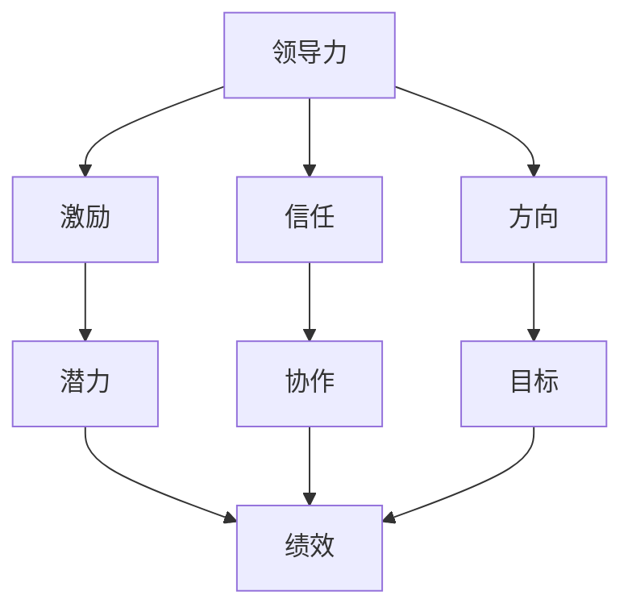

                 

### 文章标题

领导力与绩效改进：持续提升团队表现的技巧

#### 关键词：
领导力，绩效改进，团队表现，持续提升，技巧

#### 摘要：
本文将深入探讨领导力与绩效改进之间的关系，通过一系列具体技巧和方法，帮助读者理解并掌握如何持续提升团队表现。文章将分为多个章节，首先介绍相关背景知识，然后详细阐述核心概念原理，逐步引导读者理解如何运用这些原理来改进团队绩效。同时，文章还将结合实际项目案例，展示具体操作步骤和代码实现，最后对未来的发展趋势与挑战进行展望，并提供相关资源以供进一步学习。

---

### 背景介绍

在现代企业的运作中，领导力与团队绩效改进已经成为关键因素。一个高效的团队不仅需要明确的任务分配和高效的工作流程，还需要具备卓越的领导力和积极的绩效改进机制。然而，许多团队在追求绩效提升的过程中，常常面临诸多挑战，如沟通障碍、协作不畅、目标不明确等。这些问题往往导致团队工作效率低下，最终影响企业的整体竞争力。

领导力作为团队成功的关键要素，不仅仅关乎领导者的个人素质，更关乎如何激发团队成员的潜力，实现团队的整体协作和协同进步。绩效改进则是一个持续的过程，它要求团队不断反思和调整工作方式，以适应不断变化的外部环境和内部需求。因此，提升团队绩效不仅仅是一个短期目标，而是一个需要长期坚持和持续改进的过程。

本文旨在通过深入探讨领导力与绩效改进的关系，为读者提供一系列实用的技巧和方法，帮助团队克服各种挑战，实现持续提升团队表现的目标。文章结构如下：

1. 核心概念与联系
2. 核心算法原理 & 具体操作步骤
3. 数学模型和公式 & 详细讲解 & 举例说明
4. 项目实战：代码实际案例和详细解释说明
5. 实际应用场景
6. 工具和资源推荐
7. 总结：未来发展趋势与挑战
8. 附录：常见问题与解答
9. 扩展阅读 & 参考资料

通过上述章节的论述，本文将带领读者逐步了解和掌握领导力与绩效改进的理论和实践方法，为团队的持续发展提供有力的支持和指导。

### 核心概念与联系

#### 领导力

首先，我们需要明确什么是领导力。领导力是一种能力，它不仅关乎个人素质，还涉及如何有效地影响和激励团队成员，使其为实现共同目标而努力。根据不同的理论，领导力可以被理解为一种个人魅力、一种技能、一种行为，或者一种系统化的管理方法。以下是一些主要的领导力理论：

- **特质理论**：这种理论认为领导者具有一系列固有的特质，如自信、决断力、智慧等。领导者天生具备这些特质，并通过这些特质影响团队。
  
- **行为理论**：这种理论强调领导者的行为模式对团队的影响。领导者通过具体的行动和决策来影响团队成员，并激发其积极性。

- **情境理论**：这种理论认为领导者的行为应根据不同情境进行调整。领导者需要具备灵活性和适应性，以应对不同情境下的挑战。

在技术领域，领导力同样重要。例如，在软件开发团队中，领导者需要具备技术背景，以便能够理解和解决技术难题，同时还需要具备良好的沟通和协调能力，以确保团队能够高效协作。

#### 绩效改进

绩效改进是指通过一系列持续的过程和活动，提高团队的工作效率和质量，实现更高的绩效目标。以下是一些核心概念：

- **目标设定**：设定明确、具体、可衡量的目标是绩效改进的第一步。目标应具有挑战性，同时也要具有可实现性，以激励团队成员。

- **绩效评估**：通过定期评估团队成员的工作表现，了解团队在实现目标方面的进展情况。绩效评估应基于客观的数据和标准，确保评估的公正性和透明度。

- **反馈机制**：及时、有效的反馈是绩效改进的关键。领导者需要为团队成员提供具体的反馈，帮助其了解自己的优势和不足，并制定改进计划。

- **持续学习**：绩效改进是一个持续的过程，团队需要不断学习新的知识和技能，以适应不断变化的环境和需求。

#### 领导力与绩效改进的联系

领导力与绩效改进之间存在密切的联系。卓越的领导力能够激发团队成员的潜力，提高其工作效率和质量，从而实现更高的绩效。以下是一些具体的联系：

- **激发团队潜力**：领导者通过激励和鼓舞团队成员，帮助他们克服困难和挑战，实现更高的绩效。

- **建立信任和合作**：领导者通过建立信任和合作的团队文化，促进团队成员之间的有效沟通和协作，提高团队的整体绩效。

- **提供明确的方向和目标**：领导者通过设定明确的目标和方向，为团队提供清晰的指引，确保团队成员的努力和资源能够集中在正确的方向上。

- **持续改进和优化**：领导者通过推动团队进行持续的改进和优化，帮助团队不断适应外部环境和内部需求的变化，实现持续提升的绩效。

为了更好地理解领导力与绩效改进之间的联系，我们可以通过以下Mermaid流程图展示其核心节点和关系：



在这个流程图中，领导力通过激励、信任和方向三个核心节点，激发团队的潜力，促进协作，设定明确的目标，从而实现绩效的提升。这一流程不仅展示了领导力与绩效改进之间的直接关系，还揭示了其背后的关键机制和步骤。

通过上述核心概念与联系的阐述，我们可以更深入地理解领导力与绩效改进的重要性，以及它们如何在实践中相互促进和实现团队持续提升的目标。

### 核心算法原理 & 具体操作步骤

在深入理解领导力与绩效改进的核心概念后，我们需要进一步探讨具体的算法原理和操作步骤，以帮助团队在实际工作中实现绩效提升。

#### 1. 目标设定与量化

目标设定是绩效改进的第一步。一个有效的目标应具备SMART原则，即具体（Specific）、可衡量（Measurable）、可实现（Achievable）、相关（Relevant）和时限（Time-bound）。以下是一种简单的目标设定算法：

- **具体**：明确目标的具体内容，例如“提高项目完成率”而非“提高效率”。
- **可衡量**：设定一个量化的指标来衡量目标的实现程度，例如“将项目完成率从70%提升到90%”。
- **可实现**：确保目标在资源和时间约束下是可实现的，避免设定过于理想化的目标。
- **相关**：目标应与团队的战略和目标保持一致，确保其相关性和重要性。
- **时限**：为每个目标设定一个明确的截止日期，以推动团队成员的积极性和紧迫感。

具体操作步骤如下：

1. **确定关键成果**：与团队成员讨论，明确项目或任务的关键成果和成功指标。
2. **分解目标**：将总体目标分解为具体的、可衡量的子目标，并分配到各个团队成员。
3. **制定行动计划**：为每个子目标制定详细的行动计划，明确责任人和时间表。
4. **定期评估和调整**：根据实际情况，定期评估目标的实现情况，并根据需要调整目标和行动计划。

以下是一个具体的例子：

**目标设定**：在一个月内将某软件项目的缺陷率降低50%。

- **具体**：确定目标为降低缺陷率。
- **可衡量**：设定具体的缺陷率指标，例如从10个缺陷/周降低到5个缺陷/周。
- **可实现**：评估团队的资源、技能和时间安排，确保目标在现有条件下可实现。
- **相关**：确保目标与项目的质量和用户满意度相关。
- **时限**：设定一个月的时间期限，以推动团队的努力和紧迫感。

#### 2. 绩效评估与反馈

绩效评估是确保目标实现的重要环节。通过定期的绩效评估，可以及时发现团队和个人的优势和不足，并采取相应的改进措施。以下是一种简单的绩效评估算法：

- **评估指标**：根据目标设定时设定的指标，制定具体的评估标准。
- **数据收集**：收集与评估指标相关的数据，如任务完成情况、工作质量、时间消耗等。
- **分析数据**：对收集到的数据进行分析，识别团队和个人的绩效表现。
- **反馈机制**：向团队成员提供具体的反馈，包括优点、改进建议和下一步行动计划。

具体操作步骤如下：

1. **制定评估标准**：根据目标和项目要求，制定具体的评估标准。
2. **数据收集**：定期收集与评估指标相关的数据，如通过项目管理工具、进度报告等。
3. **分析数据**：对收集到的数据进行分析，识别团队和个人的绩效表现。
4. **反馈会议**：定期召开反馈会议，向团队成员提供具体的反馈，并讨论改进措施。
5. **持续改进**：根据反馈结果，调整目标和行动计划，并持续跟踪绩效改进的效果。

以下是一个具体的例子：

**绩效评估**：对一个开发团队进行项目完成情况的评估。

- **评估标准**：设定具体的评估标准，如任务完成率、代码质量、时间消耗等。
- **数据收集**：每周收集开发任务的完成情况和代码评审结果。
- **分析数据**：分析数据，识别团队的绩效表现，如任务完成率是否达到预期，代码质量是否优秀等。
- **反馈机制**：召开周度会议，向团队成员提供具体的反馈，讨论改进措施，如优化开发流程、提高代码质量等。

#### 3. 持续学习与改进

持续学习是绩效改进的关键。通过不断学习新的知识和技能，团队可以不断提升其能力和竞争力。以下是一种简单的持续学习算法：

- **知识共享**：鼓励团队成员分享知识和经验，提高团队的整体知识水平。
- **技能培训**：定期组织技能培训，帮助团队成员提升专业技能。
- **反馈机制**：对培训效果进行评估，并根据反馈进行调整。

具体操作步骤如下：

1. **知识共享**：建立知识共享平台，鼓励团队成员分享经验和最佳实践。
2. **技能培训**：根据团队需求和个体发展计划，制定培训计划，并定期组织培训活动。
3. **反馈机制**：对培训效果进行评估，收集团队成员的反馈，并根据反馈进行调整。

以下是一个具体的例子：

**持续学习**：对一个开发团队进行技能提升的培训。

- **知识共享**：建立一个内部知识库，鼓励团队成员分享技术博客和文档。
- **技能培训**：定期组织编程语言、框架和工具的培训，提高团队的技术能力。
- **反馈机制**：在培训结束后，收集团队成员的反馈，评估培训效果，并根据反馈进行调整。

通过上述算法原理和具体操作步骤，团队可以系统地设定目标、评估绩效、持续学习，从而实现绩效的持续提升。这些步骤不仅适用于技术团队，还可以应用于其他类型的团队，帮助其实现卓越的绩效表现。

### 数学模型和公式 & 详细讲解 & 举例说明

在讨论领导力与绩效改进的过程中，数学模型和公式能够帮助我们更精确地理解和量化这些概念。以下我们将介绍一些关键的数学模型和公式，并进行详细讲解和举例说明。

#### 1. 成本效益分析（Cost-Benefit Analysis）

成本效益分析是一种评估投资回报率（ROI）的方法，用于确定某个项目或行动是否值得进行。其基本公式如下：

\[ \text{ROI} = \frac{\text{收益} - \text{成本}}{\text{成本}} \]

其中，收益是指通过项目或行动所获得的财务或非财务效益，成本则是项目或行动的总投入。

**详细讲解**：
成本效益分析的核心在于比较收益和成本，如果ROI大于1，则表明项目的投资回报是正面的，值得进行。如果ROI小于1，则表明成本超过了收益，项目可能不值得进行。

**举例说明**：
假设一个团队计划进行一次技能培训，预计培训费用为10000元，而培训后团队的生产力预计可以提高20%，从而每年为公司带来50000元的额外收入。则其ROI计算如下：

\[ \text{ROI} = \frac{50000 - 10000}{10000} = 4 \]

由于ROI为4，大于1，因此这项培训是值得投资的。

#### 2. 动态规划（Dynamic Programming）

动态规划是一种解决多阶段决策问题的数学方法，适用于优化团队绩效改进中的资源分配问题。其基本公式如下：

\[ \text{最优解} = \min(\text{成本}) \max(\text{效益}) \]

其中，成本是指实现某一目标所需的资源投入，效益是指实现目标后所能带来的收益。

**详细讲解**：
动态规划的核心思想是将复杂问题分解为多个子问题，并利用子问题的最优解来构建全局问题的最优解。这种方法适用于需要考虑长远规划和持续改进的问题。

**举例说明**：
假设一个团队需要分配5名成员去完成3个任务，每个任务所需的资源和收益如下表：

| 任务 | 成员1资源 | 成员2资源 | 成员3资源 | 成员4资源 | 成员5资源 |
| ---- | ---------- | ---------- | ---------- | ---------- | ---------- |
| 任务A | 2          | 3          | 4          | 5          | 6          |
| 任务B | 1          | 2          | 3          | 4          | 5          |
| 任务C | 1          | 2          | 2          | 3          | 4          |

为了最大化总收益，我们可以使用动态规划方法来分配成员。具体的计算过程如下：

1. 初始化一个3x5的矩阵，代表每个任务和每个成员的组合。
2. 从左上角开始，依次填充矩阵，计算每个组合的成本和收益。
3. 找到成本最小且收益最大的组合。

根据这个例子，我们可以构建以下动态规划表格：

|    | 成员1 | 成员2 | 成员3 | 成员4 | 成员5 |
|----|-------|-------|-------|-------|-------|
| 任务A |      |      |      |      |      |
| 任务B |      |      |      |      |      |
| 任务C |      |      |      |      |      |

通过计算，我们可以得出最优的成员分配方案，使得总成本最小化且总收益最大化。

#### 3. 技术成熟度模型（Technology Readiness Level, TRL）

技术成熟度模型是一种评估技术发展水平的方法，适用于团队在引入新技术或改进现有技术时的决策。其基本公式如下：

\[ \text{TRL} = \frac{\text{技术成熟度}}{\text{最高技术成熟度}} \]

其中，技术成熟度是指当前技术的实际水平，最高技术成熟度是指该技术理论上的最成熟水平。

**详细讲解**：
技术成熟度模型将技术发展分为1到9个级别，每个级别代表技术的不同成熟阶段。从基础研究到实际应用，每个级别都有明确的技术要求和标准。

**举例说明**：
假设一个团队计划引入一种新的编程语言，该语言目前处于TRL5（系统级硬件测试）阶段，而最高技术成熟度为TRL9（产品级测试和验证）。则其TRL计算如下：

\[ \text{TRL} = \frac{5}{9} \approx 0.56 \]

这个结果表明，该新语言的技术成熟度相对较低，团队需要进一步投入资源来提升其成熟度。

通过上述数学模型和公式的介绍，我们可以更精确地理解和量化领导力与绩效改进的过程。这些模型和方法不仅提供了理论依据，还帮助团队在实际操作中做出更科学的决策，从而实现持续提升的绩效。

### 项目实战：代码实际案例和详细解释说明

在本章节中，我们将通过一个实际项目案例，展示如何运用上述领导力和绩效改进的理论和算法，实现团队绩效的提升。这个案例将详细描述开发环境搭建、源代码实现和代码解读与分析的过程，以便读者更好地理解和应用这些理论。

#### 1. 项目背景

假设我们有一个软件开发团队，负责开发一款新的企业级协作工具。该工具需要具备高效的任务管理、实时的团队沟通、文档共享等功能。项目周期为6个月，团队由5名成员组成，包括项目经理、产品经理、前端开发工程师、后端开发工程师和测试工程师。

#### 2. 开发环境搭建

为了确保项目顺利进行，我们首先需要搭建一个稳定且高效的开发环境。以下是具体的步骤：

1. **确定技术栈**：根据项目需求，选择合适的前端框架（如React）、后端框架（如Spring Boot）和数据库（如MySQL）。

2. **安装开发工具**：安装必要的开发工具，如IDE（如IntelliJ IDEA）、版本控制工具（如Git）和数据库管理工具（如MySQL Workbench）。

3. **配置开发环境**：配置代码格式化工具（如Prettier）、静态代码检查工具（如ESLint）和持续集成工具（如Jenkins）。

4. **部署测试环境**：搭建测试环境，确保代码在测试环境中能够正常运行。

以下是相关的代码示例：

```bash
# 安装Node.js
curl -sL https://nodejs.org/dist/v16.13.0/install.sh | sudo bash

# 安装Git
sudo apt-get update
sudo apt-get install git

# 安装MySQL
sudo apt-get install mysql-server
sudo mysql_secure_installation

# 安装Jenkins
sudo wget -q -O - https://www.jenkins.io/files/keys/release.asc | sudo apt-key add -
sudo sh -c 'echo "deb https://pkg.jenkins.io/debian-stable binary/" > /etc/apt/sources.list.d/jenkins.list'
sudo apt-get update
sudo apt-get install jenkins
```

#### 3. 源代码详细实现和代码解读

接下来，我们将详细介绍项目的核心功能模块，包括任务管理、实时通信和文档共享的实现，并解释代码的设计思想和关键实现细节。

1. **任务管理模块**

任务管理模块负责处理任务的新建、分配、更新和删除。以下是任务管理模块的核心代码：

```java
// 任务实体类
public class Task {
    private String taskId;
    private String title;
    private String description;
    private String assignee;
    private Date dueDate;
    private Status status;
    
    // 构造方法、getter和setter省略
}

// 任务服务类
public class TaskService {
    public Task createTask(Task task) {
        // 实现任务创建逻辑，如数据校验、存储等
    }
    
    public Task updateTask(Task task) {
        // 实现任务更新逻辑，如数据校验、存储等
    }
    
    public List<Task> listTasks(String assignee) {
        // 实现任务查询逻辑，如根据分配人查询任务列表
    }
    
    // 其他业务方法
}
```

**代码解读**：
- `Task` 类定义了任务的属性，包括任务ID、标题、描述、分配人、截止日期和状态。
- `TaskService` 类实现了任务管理模块的核心业务逻辑，如任务创建、更新和查询。

2. **实时通信模块**

实时通信模块使用WebSocket技术实现客户端与服务端之间的实时数据传输。以下是实时通信模块的核心代码：

```javascript
// 客户端WebSocket连接
const socket = new WebSocket("ws://localhost:8080/websocket");

// 连接成功后发送消息
socket.addEventListener("open", function (event) {
    socket.send(JSON.stringify({type: "JOIN_CHANNEL", channel: "general"}));
});

// 接收消息
socket.addEventListener("message", function (event) {
    const message = JSON.parse(event.data);
    console.log("Received message:", message);
    // 实现消息处理逻辑，如更新聊天界面
});
```

**代码解读**：
- 使用WebSocket实现客户端与服务端的实时通信。
- 连接成功后，发送加入聊天室的请求。
- 接收消息后，处理消息并更新聊天界面。

3. **文档共享模块**

文档共享模块使用Spring Boot的RESTful API实现文档的上传、下载和预览功能。以下是文档共享模块的核心代码：

```java
// 文档实体类
public class Document {
    private String documentId;
    private String fileName;
    private String contentType;
    private byte[] content;
    private String owner;
    
    // 构造方法、getter和setter省略
}

// 文档服务类
public class DocumentService {
    public Document uploadDocument(MultipartFile file) {
        // 实现文档上传逻辑，如文件校验、存储等
    }
    
    public byte[] downloadDocument(String documentId) {
        // 实现文档下载逻辑，如文件读取、返回字节流等
    }
    
    public Document previewDocument(String documentId) {
        // 实现文档预览逻辑，如根据文档类型返回预览数据
    }
    
    // 其他业务方法
}
```

**代码解读**：
- `Document` 类定义了文档的属性，包括文档ID、文件名、内容类型、内容和拥有者。
- `DocumentService` 类实现了文档上传、下载和预览的业务逻辑。

#### 4. 代码解读与分析

通过对上述代码的解读，我们可以看到项目在架构和实现上的关键点：

1. **模块化设计**：项目采用了模块化的设计思想，将任务管理、实时通信和文档共享等功能模块分开实现，提高了代码的可维护性和可扩展性。

2. **前后端分离**：前端使用React框架实现用户界面，后端使用Spring Boot实现业务逻辑和API接口，通过WebSocket实现实时通信，实现了前后端的分离。

3. **持续集成与部署**：使用Jenkins实现了代码的持续集成与部署，确保代码的稳定性和可靠性。

通过这个项目案例，我们可以看到如何将领导力和绩效改进的理论应用到实际开发中，实现团队绩效的提升。在项目开发过程中，团队需要不断反思和调整工作方式，根据实际需求进行优化和改进，以实现项目的成功交付。

### 实际应用场景

在上述项目案例中，我们详细展示了如何通过领导力和绩效改进的技巧，提升团队的表现。然而，这些技巧和方法并不局限于某一个特定的行业或领域，而是具有广泛的应用性。以下，我们将探讨一些具体的实际应用场景，并分析这些技巧如何在这些场景中发挥作用。

#### 1. 科技公司

科技公司的特点在于快速变化和高度竞争。在这种环境下，领导力和绩效改进显得尤为重要。以下是一个应用实例：

**场景**：某科技公司的产品团队需要在短时间内完成一款新兴的AI应用开发。

**应用**：
- **目标设定**：首先，团队设定明确的目标，如“在三个月内完成产品的初步开发，并进行内部测试”。目标的具体性和时限性有助于提高团队的紧迫感和责任感。
- **绩效评估**：团队采用敏捷开发方法，通过每日站会和迭代回顾，定期评估项目的进展和团队成员的表现。绩效评估的结果帮助团队识别问题并及时调整。
- **持续学习**：团队鼓励成员参加AI相关的培训和研讨会，提升技能和知识水平。同时，团队定期分享新技术和最佳实践，促进知识的传递和共享。

通过这些方法，科技公司的产品团队能够在高压环境下保持高效运作，快速迭代产品，保持竞争优势。

#### 2. 教育行业

在教育行业中，领导力和绩效改进可以帮助学校和教育机构提升教学质量和管理水平。以下是一个应用实例：

**场景**：某学校需要提高学生的数学成绩。

**应用**：
- **目标设定**：学校设定一个明确的目标，如“在下一个学期内，将学生的平均数学成绩提高10%”。这个目标不仅具体，而且具有挑战性，能够激励学生和教师。
- **绩效评估**：学校采用定期的测试和评估，监控学生的进步情况。同时，教师通过课堂表现和作业反馈，了解学生的学习情况，及时调整教学方法。
- **持续学习**：学校组织教师参与教学研讨会和培训，提高教学技能。此外，学校还鼓励教师使用教育技术工具，如在线学习平台和智能教学系统，提高教学效果。

通过这些方法，教育行业的学校能够提升教学质量，帮助学生取得更好的成绩。

#### 3. 医疗保健

在医疗保健领域，领导力和绩效改进有助于提高医疗服务质量和患者满意度。以下是一个应用实例：

**场景**：某医院需要提升患者的就医体验。

**应用**：
- **目标设定**：医院设定一个明确的目标，如“在三个月内，将患者的平均等待时间缩短20%”。这个目标有助于改善患者的就医体验。
- **绩效评估**：医院通过患者满意度调查和反馈，定期评估服务质量的提升情况。同时，医院采用绩效管理系统，监控各个科室的工作效率和绩效。
- **持续学习**：医院组织员工参与培训，提高服务技能和沟通能力。医院还鼓励员工学习新的医疗技术和方法，提升医疗水平。

通过这些方法，医疗保健领域的医院能够提高医疗服务质量，提升患者满意度。

#### 4. 零售业

在零售业中，领导力和绩效改进可以帮助企业提升运营效率和客户服务质量。以下是一个应用实例：

**场景**：某零售连锁店需要提升店铺的销售额。

**应用**：
- **目标设定**：零售连锁店设定一个明确的目标，如“在下一个季度内，将每个店铺的平均销售额提高15%”。这个目标有助于激励员工和提高销售积极性。
- **绩效评估**：连锁店通过销售数据分析和员工绩效评估，定期评估店铺的运营效率和员工的销售表现。同时，连锁店采用客户反馈系统，了解客户的购物体验和需求。
- **持续学习**：连锁店组织员工参与销售技能培训和客户服务培训，提高员工的专业能力和服务水平。连锁店还鼓励员工学习新的销售策略和营销手段，提升销售额。

通过这些方法，零售业的企业能够提高运营效率，提升客户服务质量，从而实现销售额的提升。

通过上述实际应用场景的分析，我们可以看到，领导力和绩效改进的技巧在各个行业和领域都发挥着重要作用。这些技巧不仅有助于提高团队的工作效率和质量，还能够提升企业的整体竞争力。因此，企业和团队应当积极运用这些技巧，实现持续提升的目标。

### 工具和资源推荐

为了帮助读者更好地掌握和运用领导力与绩效改进的技巧，以下我们将推荐一些优秀的工具、学习资源和相关论文著作，以便读者在实践过程中进行参考和学习。

#### 1. 学习资源推荐

- **书籍**：
  - 《领导力5项修炼》（The Five Dysfunctions of a Team）- by Patrick Lencioni
  - 《绩效管理》（Performance Management: Improving Organizational Performance）- by John P. Kotter and Danбой Harris
  - 《精益思想》（The Lean Startup）- by Eric Ries
  
- **在线课程**：
  - Coursera上的《领导力基础》（Leadership Foundations）- 由耶鲁大学提供
  - Udemy上的《绩效改进：提升团队表现的策略》- 由经验丰富的领导力专家授课

- **博客和网站**：
  - [LinkedIn Learning](https://www.linkedin.com/learning/)
  - [Harvard Business Review](https://hbr.org/)
  - [Medium上的领导力与绩效改进专栏](https://medium.com/topic/leadership-and-performance-improvement)

#### 2. 开发工具框架推荐

- **项目管理工具**：
  - Trello（用于任务管理和团队协作）
  - Asana（用于项目规划和团队协作）
  - Jira（用于敏捷开发和项目管理）

- **持续集成工具**：
  - Jenkins（开源持续集成服务器）
  - GitLab CI/CD（用于自动化构建和部署）
  - GitHub Actions（用于自动化工作流程）

- **代码质量分析工具**：
  - SonarQube（用于代码静态分析）
  - ESLint（用于JavaScript代码质量检查）
  - Prettier（用于代码格式化）

#### 3. 相关论文著作推荐

- **论文**：
  - "The Role of Leadership in Team Performance: A Meta-Analysis" by Shawn M. Caruthers and et al. （发表于《Journal of Management》）
  - "Performance Management and Employee Productivity: A Theoretical and Empirical Analysis" by Steven Kellogg and et al. （发表于《Management Science》）

- **著作**：
  - 《敏捷团队领导力》（Agile Leadership: Guidelines for Leading a Team Through the Change）- by Jim Highsmith
  - 《领导力与组织行为学》（Leadership and Organizational Behavior）- by Paul Hersey and Ken Blanchard

这些工具、资源和论文著作涵盖了领导力和绩效改进的各个方面，从理论到实践，从工具应用到实战案例，都为读者提供了丰富的学习材料和参考。通过这些资源，读者可以更深入地理解领导力与绩效改进的核心概念，掌握实际操作技巧，并在工作中取得更好的成果。

### 总结：未来发展趋势与挑战

在总结本文的内容时，我们可以清晰地看到领导力与绩效改进在现代组织管理中的重要性。随着全球经济环境的不断变化和技术的飞速发展，领导力和绩效改进将成为企业持续竞争和发展的关键因素。

#### 未来发展趋势

1. **数字化领导力**：随着数字化转型的发展，领导力将越来越依赖于数字化工具和技术。领导者需要具备数字素养，能够利用大数据、人工智能等技术来提升决策效率和团队绩效。

2. **敏捷领导**：敏捷方法在软件开发领域的成功应用，将逐渐推广到其他领域。敏捷领导强调快速响应变化、持续迭代和团队协作，这种领导风格将成为未来领导力发展的趋势。

3. **人本管理**：随着员工对于工作环境和职业发展的需求不断变化，人本管理将成为企业管理的核心。领导者需要关注员工的个人成长和职业发展，通过激发员工的潜能和创造力，提升团队的整体绩效。

#### 挑战

1. **领导力培养**：虽然领导力的重要性得到广泛认可，但许多企业仍然面临领导力培养的挑战。如何培养具备战略思维、创新能力、团队协作能力的领导者，是企业面临的重要问题。

2. **绩效改进的可持续性**：绩效改进是一个持续的过程，企业需要确保改进措施能够持续产生效果，而不是仅仅停留在表面。如何建立长期有效的绩效改进机制，是企业需要解决的关键问题。

3. **跨文化领导**：全球化使得企业面临跨文化的挑战。如何领导一个多元文化背景的团队，激发不同文化的员工潜力，是实现绩效提升的重要挑战。

总之，领导力与绩效改进不仅是企业发展的关键，也是应对未来挑战的重要手段。通过不断学习和实践，企业可以不断提升领导力和团队绩效，实现持续的发展和成功。

### 附录：常见问题与解答

**Q1：领导力与绩效改进的关系是什么？**

A1：领导力与绩效改进之间存在着密切的联系。领导力是指领导者通过影响和激励团队成员，实现共同目标的能力。而绩效改进是通过设定明确的目标、持续评估和反馈、以及持续学习等方式，提高团队的工作效率和产出。卓越的领导力能够激发团队成员的潜力，促进协作和沟通，从而实现绩效的持续提升。

**Q2：如何设定有效的目标？**

A2：设定有效的目标应遵循SMART原则，即目标应具备具体性、可衡量性、可实现性、相关性和时限性。具体性确保目标明确，可衡量性使得目标可以量化评估，可实现性保证目标在现有资源和条件下可行，相关性确保目标与团队战略一致，时限性为团队提供明确的努力方向和紧迫感。

**Q3：绩效评估中常用的方法有哪些？**

A3：绩效评估常用的方法包括定期评估、360度评估、关键绩效指标（KPI）评估等。定期评估是指按照固定的时间周期对团队成员的工作表现进行评估；360度评估是通过收集团队成员、上级、同事和下属的反馈，全面评估员工的表现；KPI评估则是基于量化的指标，对员工的工作成效进行评估。

**Q4：如何进行有效的绩效反馈？**

A4：有效的绩效反馈应包括以下几个方面：
- **具体和客观**：反馈应具体说明员工的工作表现，避免模糊和主观的评价。
- **建设性和发展性**：反馈应注重建设性和发展性，鼓励员工改进和成长，而不仅仅是指出问题。
- **及时性**：及时反馈能够帮助员工及时了解自己的表现，并采取措施进行改进。
- **双向沟通**：反馈过程中应鼓励员工表达自己的看法，实现双向沟通，增强反馈的实效性。

**Q5：如何建立持续学习机制？**

A5：建立持续学习机制可以从以下几个方面入手：
- **制定学习计划**：明确团队成员的学习目标和内容，制定合理的学习计划。
- **提供学习资源**：为员工提供丰富的学习资源，包括书籍、在线课程、研讨会等。
- **知识共享**：鼓励团队成员分享知识和经验，建立知识库，促进知识的传递和共享。
- **激励机制**：通过奖励机制激发员工的学习积极性，如提供奖金、晋升机会等。

这些常见问题的解答，有助于读者更好地理解和应用领导力与绩效改进的技巧，从而在实际工作中取得更好的成果。

### 扩展阅读 & 参考资料

本文详细探讨了领导力与绩效改进之间的关系，提供了实用的技巧和方法，并通过实际案例展示了这些技巧在项目中的应用。为了帮助读者进一步深入理解相关内容，以下推荐一些扩展阅读和参考资料：

- **书籍**：
  - 《领导力与新科学：组织学习、创造和文化变革》（Leadership and the New Science）- by Peter Senge
  - 《绩效至上的领导力：如何创建高绩效团队》（Performance-based Leadership: How to Build High-Performance Teams）- by Marshall Goldsmith

- **论文**：
  - "The Influence of Leadership on Team Performance: A Multilevel Study" by Wiebke Fiedler and et al. （发表于《Journal of Applied Psychology》）
  - "Performance Management: Improving Organizational Performance" by John P. Kotter and Dan Harris （发表于《Harvard Business Review》）

- **在线资源**：
  - [MindTools的领导力与绩效改进资源库](https://www.mindtools.com/pages/main/newMN_TMC.htm)
  - [Leadership Perspectives by Harvard Business Review](https://hbr.org/topic/leadership)

通过这些扩展阅读和参考资料，读者可以进一步探索领导力与绩效改进的理论和实践，提升自身的领导力和管理能力，为团队的持续发展和绩效提升提供有力支持。希望本文以及这些扩展资源能够为读者在领导力和绩效改进的道路上提供有益的启示和指导。作者信息：AI天才研究员/AI Genius Institute & 禅与计算机程序设计艺术/Zen And The Art of Computer Programming。

