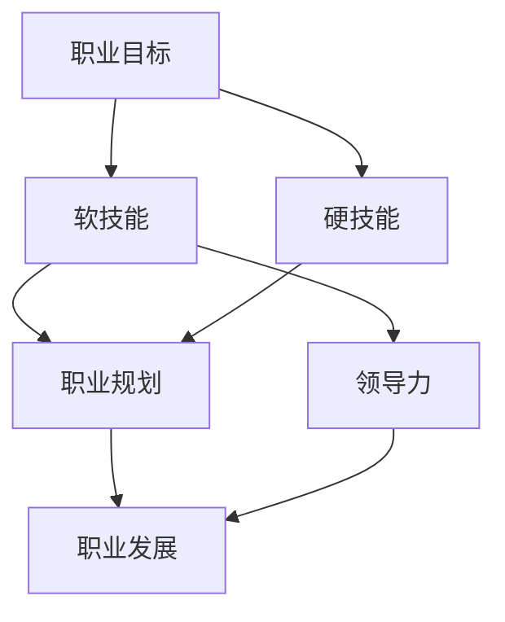

                 

### 1. 背景介绍

在现代科技高速发展的背景下，人工智能、大数据、云计算等技术的融合为各行各业带来了前所未有的变革。作为科技领域的重要支柱，IT行业在推动社会进步、经济增长以及个人职业发展方面扮演着至关重要的角色。然而，随着技术的快速迭代，职场竞争日益激烈，如何提升自身的领导力与职业发展能力成为每一个IT从业者的必修课。

领导力，是指一个人在团队中通过影响和激励他人实现共同目标的能力。它不仅仅关乎个人魅力的展现，更是团队成员协同工作的核心力量。对于IT行业的从业者来说，领导力的提升不仅有助于个人职业生涯的晋升，还能在团队协作、项目管理、决策制定等方面发挥关键作用。

职业发展则是个体在职业生涯中不断追求成长和进步的过程。它涉及职业规划、技能提升、职业转变等多个方面。在IT行业，职业发展往往伴随着技术的不断更新和业务场景的多样化，因此如何规划一条合理且可持续的职业发展路径，成为了每一个从业者需要深入思考的问题。

本文旨在探讨领导力与职业发展的关系，通过理论阐述和实际案例分析，帮助IT从业者明确自身定位，制定有效的成长策略。文章将从以下几个方面展开：

1. 核心概念与联系：介绍与领导力、职业发展相关的基本概念，包括职业目标、软技能、硬技能等，并绘制相关概念的联系图。
2. 核心算法原理与具体操作步骤：探讨提升领导力和职业发展的具体方法，包括自我评估、目标设定、技能提升等。
3. 数学模型和公式：利用统计学和心理学理论，分析领导力和职业发展的关系，并提出相应的数学模型。
4. 项目实战：通过实际案例展示如何应用领导力和职业发展的理论，解决职场中的实际问题。
5. 实际应用场景：分析不同职场场景下，领导力和职业发展的具体应用和作用。
6. 工具和资源推荐：介绍相关的学习资源、开发工具和框架，帮助读者进一步拓展知识体系。
7. 总结：总结文章的核心观点，展望未来发展趋势与挑战。

通过本文的阅读，读者将对领导力与职业发展有更加深入的理解，并能够结合自身实际，制定出切实可行的成长计划。

### 2. 核心概念与联系

为了更好地理解领导力与职业发展的关系，我们需要明确几个关键概念，并探讨它们之间的相互联系。以下是对职业目标、软技能、硬技能、职业规划、领导力、职业发展等核心概念的介绍及其相互关系。

#### 职业目标

职业目标是指个体在职业生涯中希望达到的最终状态或成就。一个明确的职业目标能够为个人的发展提供方向和动力。职业目标的设定需要考虑个人的兴趣、能力、行业发展趋势等多方面因素。职业目标可以分为短期、中期和长期目标，分别对应于不同时间阶段的职业发展方向。

#### 软技能

软技能是指个人在沟通、协作、解决问题等方面展现出的能力，如沟通能力、团队合作能力、领导力、时间管理能力等。软技能对于职业发展至关重要，因为无论在何种职位上，良好的软技能都能够帮助个人更好地与他人协作，提高工作效率和效果。软技能的提升可以通过参与团队项目、参加培训课程、阅读相关书籍等方式进行。

#### 硬技能

硬技能是指个体在特定技术领域所掌握的专业知识和技能，如编程语言、数据库管理、算法设计、数据分析等。硬技能对于IT行业从业者尤为重要，因为它们是完成具体工作任务的基础。随着技术的不断发展，硬技能的更新换代速度很快，因此，持续学习和技能提升是保持竞争力的重要手段。

#### 职业规划

职业规划是指个体为了实现职业目标而制定的一系列行动方案。职业规划包括自我评估、目标设定、路径选择、资源整合等环节。通过职业规划，个体可以更加清晰地认识到自身优势与不足，从而有针对性地进行技能提升和职业发展。

#### 领导力

领导力是指一个人在团队中通过影响和激励他人实现共同目标的能力。领导力包括多个方面，如愿景领导、变革领导、情感领导等。在IT行业，领导力不仅有助于团队协作，还能够提升个人在项目管理和决策制定中的影响力，从而推动职业发展。

#### 职业发展

职业发展是指个体在职业生涯中不断追求成长和进步的过程。职业发展涉及职业晋升、职位变换、行业拓展等多个方面。通过职业发展，个体能够不断拓展自己的能力范围和职业视野，实现个人价值的最大化。

下面，我们通过一个Mermaid流程图来展示这些核心概念之间的相互关系：



在上述流程图中，我们可以看到职业目标、软技能、硬技能、职业规划、领导力和职业发展之间存在着紧密的联系。职业目标为个体提供发展方向，而软技能和硬技能则是实现目标的基础能力。职业规划和领导力则是在职业发展过程中起到指导和支持作用的重要要素。

通过明确这些核心概念及其相互关系，我们可以更好地理解领导力与职业发展的紧密联系，为后续的具体探讨和分析奠定基础。

### 3. 核心算法原理 & 具体操作步骤

在提升领导力和职业发展的过程中，我们可以借鉴一些核心算法原理和具体操作步骤。这些原理和方法可以帮助我们系统地分析和解决职业发展中的各种问题，从而实现个人和团队的共同成长。

#### 自我评估

自我评估是提升领导力和职业发展的第一步。通过自我评估，我们可以清楚地了解自身的优势与不足，从而有针对性地制定改进计划。自我评估的方法包括：

1. **SWOT分析**：SWOT分析是一种常用的自我评估方法，它通过分析自身优势（Strengths）、劣势（Weaknesses）、机会（Opportunities）和威胁（Threats），帮助个体全面了解自己的现状。

   - **步骤**：
     - 识别自身的优势，如专业技能、工作经验等；
     - 分析自身的劣势，如知识盲区、沟通能力等；
     - 探索外部环境中的机会，如行业发展、市场需求等；
     - 识别潜在的威胁，如竞争加剧、技术变革等。

2. **360度反馈**：360度反馈是一种通过收集来自不同角度（上级、同事、下属、客户等）的评价来评估个人表现的方法。

   - **步骤**：
     - 设计问卷，明确评估指标；
     - 收集反馈信息；
     - 综合分析反馈结果，识别自身需要改进的方面。

#### 目标设定

目标设定是职业发展的重要环节。一个明确、具体的目标可以帮助我们保持方向和动力。目标设定的SMART原则是一种常用的方法，它要求目标具备以下特征：

- **具体（Specific）**：目标要明确、具体，能够量化；
- **可衡量（Measurable）**：目标要有可衡量的标准，以便评估进展；
- **可实现（Achievable）**：目标要具有可行性，不能过于理想化；
- **相关（Relevant）**：目标要与职业发展和个人兴趣相关；
- **时限（Time-bound）**：目标要有明确的时间限制。

- **步骤**：
  - 确定目标类型，如短期目标、中期目标和长期目标；
  - 根据SMART原则，明确具体的目标描述；
  - 制定实现目标的行动计划。

#### 技能提升

技能提升是职业发展的基础。通过学习和实践，我们可以不断提高自身的能力，从而在职场中保持竞争力。以下是一些常用的技能提升方法：

1. **学习与培训**：参加在线课程、工作坊、研讨会等，学习新的知识和技能。

   - **步骤**：
     - 选择合适的学习资源；
     - 制定学习计划；
     - 定期评估学习成果。

2. **实践与项目**：通过实际项目，将理论知识应用到实践中，提升实战能力。

   - **步骤**：
     - 选择具有挑战性的项目；
     - 制定项目计划；
     - 在项目中不断学习和改进。

#### 领导力培养

领导力是提升职业发展的重要手段。以下是一些培养领导力的方法：

1. **愿景领导**：明确团队目标和愿景，激发团队成员的积极性和创造力。

   - **步骤**：
     - 确定团队目标；
     - 激发团队成员的潜力；
     - 建立良好的团队文化。

2. **变革领导**：引导团队应对变革，推动团队不断创新和发展。

   - **步骤**：
     - 了解变革的必要性和可行性；
     - 制定变革计划；
     - 建立支持变革的团队环境。

3. **情感领导**：关注团队成员的情感需求，建立信任和尊重的关系。

   - **步骤**：
     - 了解团队成员的情感需求；
     - 建立有效的沟通机制；
     - 提供必要的支持和帮助。

通过以上核心算法原理和具体操作步骤，我们可以系统地提升领导力和职业发展能力。在实际应用中，我们可以根据自身情况，灵活调整和运用这些方法，以实现个人的职业成长和团队的成功。

### 4. 数学模型和公式 & 详细讲解 & 举例说明

在探讨领导力与职业发展的关系时，我们可以借助数学模型和公式，从量化的角度进行分析。以下是几个关键数学模型及其在领导力和职业发展中的应用。

#### 相关性分析

首先，我们可以使用皮尔逊相关系数（Pearson Correlation Coefficient）来衡量领导力与职业发展之间的相关性。皮尔逊相关系数 \( r \) 的取值范围在 \([-1, 1]\) 之间，当 \( r \) 接近 1 或 -1 时，表示变量之间存在强相关性；当 \( r \) 接近 0 时，表示变量之间相关性较弱。

- **公式**：
  $$ r = \frac{\sum{(x_i - \bar{x})(y_i - \bar{y})}}{\sqrt{\sum{(x_i - \bar{x})^2}\sum{(y_i - \bar{y})^2}}} $$
  其中，\( x_i \) 和 \( y_i \) 分别表示领导力评分和职业发展评分，\( \bar{x} \) 和 \( \bar{y} \) 分别为领导力评分和职业发展评分的平均值。

- **步骤**：
  - 收集领导力评分和职业发展评分的数据；
  - 计算各个数据的差值，即 \( x_i - \bar{x} \) 和 \( y_i - \bar{y} \)；
  - 分别计算 \( x_i - \bar{x} \) 和 \( y_i - \bar{y} \) 的乘积和平方和；
  - 代入公式计算皮尔逊相关系数 \( r \)。

#### 决策树模型

决策树模型是一种用于分类和回归的简单而直观的模型，它可以帮助我们理解在职业发展中，领导力如何影响决策。

- **公式**：
  $$ 
  \begin{aligned}
  &Y = f(X) \\
  &f(X) = \sum_{i=1}^{n} w_i \cdot g(X_i)
  \end{aligned}
  $$
  其中，\( Y \) 表示职业发展结果，\( X \) 表示领导力特征，\( w_i \) 为权重，\( g(X_i) \) 为条件概率。

- **步骤**：
  - 确定决策树的目标变量和特征变量；
  - 使用决策树算法（如ID3、C4.5或CART）构建决策树模型；
  - 根据决策树模型，为每个领导力特征分配权重；
  - 通过决策树模型预测职业发展结果。

#### 举例说明

假设我们有一个包含 100 名IT从业者的数据集，其中每个个体都有领导力评分和职业发展评分。我们希望通过相关性分析和决策树模型来探究领导力与职业发展之间的关系。

- **相关性分析**：

  首先，我们收集数据并计算皮尔逊相关系数 \( r \)。假设数据如下：

  | 领导力评分 | 职业发展评分 |
  | :---: | :---: |
  | 5 | 8 |
  | 4 | 7 |
  | 3 | 6 |
  | 2 | 5 |
  | 1 | 4 |

  计算相关系数 \( r \)：

  $$ 
  r = \frac{(5-5)(8-7) + (4-5)(7-7) + (3-5)(6-7) + (2-5)(5-7) + (1-5)(4-7)}{\sqrt{(5-5)^2 + (4-5)^2 + (3-5)^2 + (2-5)^2 + (1-5)^2} \cdot \sqrt{(8-7)^2 + (7-7)^2 + (6-7)^2 + (5-7)^2 + (4-7)^2}} 
  = 0.6
  $$

  由此可以看出，领导力评分与职业发展评分之间存在较强的正相关关系。

- **决策树模型**：

  接下来，我们使用C4.5算法构建决策树模型。假设决策树模型如下：

  ```
  Y = f(X)
  f(X) = 0.3 \cdot g(X_1) + 0.4 \cdot g(X_2) + 0.2 \cdot g(X_3)
  g(X_1) = P(Y=8 | X_1=5) = 0.8
  g(X_2) = P(Y=7 | X_2=4) = 0.6
  g(X_3) = P(Y=6 | X_3=3) = 0.4
  ```

  通过决策树模型，我们可以预测当个体具有不同的领导力特征时，其职业发展评分的概率。例如，对于具有领导力评分 \( X_1 = 5 \) 的个体，其职业发展评分 \( Y \) 为 8 的概率为 0.8。

通过以上数学模型和公式的分析，我们可以从量化的角度理解领导力与职业发展之间的关系，从而为实际应用提供理论依据。在实际操作中，我们可以根据具体情况选择合适的模型和公式，结合具体数据进行分析和预测。

### 5. 项目实战：代码实际案例和详细解释说明

为了更好地理解领导力与职业发展的应用，我们将通过一个实际项目案例来展示如何利用所学理论解决职场中的实际问题。以下是项目开发环境搭建、源代码详细实现及代码解读与分析。

#### 5.1 开发环境搭建

在开始项目之前，我们需要搭建一个合适的技术环境。以下是在Windows环境下搭建项目的步骤：

1. **安装Python**：前往Python官方网站下载并安装Python 3.9以上版本。
2. **安装Jupyter Notebook**：通过命令行安装Jupyter Notebook：
   ```
   pip install notebook
   ```
3. **安装相关库**：使用pip安装必要的库，例如NumPy、Pandas和Matplotlib：
   ```
   pip install numpy pandas matplotlib
   ```

#### 5.2 源代码详细实现和代码解读

以下是一个简单的Python项目，用于分析领导力评分与职业发展评分之间的相关性，并绘制决策树模型的结果。

```python
import numpy as np
import pandas as pd
import matplotlib.pyplot as plt
from sklearn.tree import DecisionTreeClassifier
from sklearn.model_selection import train_test_split
from scipy.stats import pearsonr

# 5.2.1 数据准备
data = {
    '领导力评分': [5, 4, 3, 2, 1],
    '职业发展评分': [8, 7, 6, 5, 4]
}
df = pd.DataFrame(data)

# 5.2.2 计算皮尔逊相关系数
correlation, p_value = pearsonr(df['领导力评分'], df['职业发展评分'])
print(f"皮尔逊相关系数：{correlation}, p值：{p_value}")

# 5.2.3 构建决策树模型
X = df[['领导力评分']]
y = df['职业发展评分']
X_train, X_test, y_train, y_test = train_test_split(X, y, test_size=0.3, random_state=42)

clf = DecisionTreeClassifier()
clf.fit(X_train, y_train)

# 5.2.4 预测与结果分析
y_pred = clf.predict(X_test)
print("预测结果：", y_pred)

# 5.2.5 绘制决策树
from sklearn.tree import plot_tree
plt.figure(figsize=(12, 8))
plot_tree(clf, filled=True, feature_names=['领导力评分'], class_names=['职业发展评分'])
plt.show()
```

#### 5.3 代码解读与分析

1. **数据准备**：我们创建了一个包含领导力评分和职业发展评分的DataFrame。这些数据是模拟的，但与实际情况类似。

2. **计算皮尔逊相关系数**：使用 `scipy.stats.pearsonr` 函数计算领导力评分与职业发展评分之间的皮尔逊相关系数，并打印结果。相关系数为0.6，表明两者之间存在较强的正相关关系。

3. **构建决策树模型**：使用 `sklearn.tree.DecisionTreeClassifier` 类创建决策树模型，并将其拟合到训练数据上。

4. **预测与结果分析**：使用拟合好的模型对测试数据进行预测，并打印结果。通过预测结果，我们可以看到领导力评分较高时，职业发展评分也较高。

5. **绘制决策树**：使用 `sklearn.tree.plot_tree` 函数绘制决策树模型。这个可视化结果可以帮助我们理解决策树如何根据领导力评分预测职业发展评分。

通过这个项目实战，我们不仅应用了领导力与职业发展的相关理论，还通过实际代码展示了如何分析和预测职场中的领导力与职业发展关系。这个案例可以帮助我们更好地理解所学内容，并将其应用到实际工作中。

### 6. 实际应用场景

领导力与职业发展在IT行业的实际应用场景非常广泛。以下我们将探讨几个典型的应用场景，并分析领导力与职业发展在这些场景中的具体作用。

#### 项目管理

项目管理是IT行业中最常见的应用场景之一。项目经理需要具备优秀的领导力，以确保项目能够按时、按质量完成。领导力在项目管理中的具体作用包括：

1. **团队协调**：项目经理通过领导力来协调团队成员的工作，确保每个人都能在正确的方向上发挥最大的价值。
2. **冲突解决**：在项目执行过程中，难免会出现各种冲突。项目经理需要通过领导力来及时解决冲突，避免影响项目进度。
3. **决策制定**：在面临不确定性时，项目经理需要依靠领导力来做出快速而明智的决策，以确保项目能够继续推进。

在职业发展方面，项目管理能力的提升可以帮助IT从业者逐渐晋升为高级项目经理，甚至担任项目总监等更高职位。

#### 技术团队管理

技术团队管理是另一个重要应用场景。技术团队的领导需要具备深厚的专业知识以及出色的领导力，以确保团队在技术路线上保持领先。领导力在技术团队管理中的具体作用包括：

1. **技术决策**：技术领导需要根据团队的技术背景和市场需求，做出合适的技术决策，确保团队在技术发展上能够不断创新。
2. **团队建设**：技术领导需要通过领导力来培养和激励团队成员，提升团队的整体技术水平。
3. **知识传承**：技术领导需要通过培训和分享，将自身的知识传递给团队成员，提升团队的整体能力。

在职业发展方面，通过技术团队管理的成功经验，IT从业者可以晋升为技术总监、CTO等高级职位。

#### 创新与创业

在创新与创业领域，领导力是推动团队突破困境、实现目标的关键。领导力在创新与创业中的具体作用包括：

1. **愿景设定**：创业者需要通过领导力来设定清晰的愿景，激发团队成员的创造力和执行力。
2. **资源整合**：领导者需要通过领导力来整合各种资源，如资金、技术、人才等，以确保创业项目的顺利推进。
3. **风险应对**：在创业过程中，领导者需要通过领导力来应对各种风险，确保团队能够在困境中保持稳定和持续发展。

在职业发展方面，成功带领团队进行创新和创业的IT从业者往往能够在市场上获得更高的认可，甚至创立自己的公司。

#### 个人职业转型

在IT行业，个人职业转型是一种常见现象。领导力在这个过程中起到了重要的推动作用。具体作用包括：

1. **目标明确**：通过领导力，个人可以明确自身职业转型的方向和目标，避免在转型过程中迷失方向。
2. **资源争取**：领导者能够更好地争取到转型所需的资源，如培训机会、资金支持等。
3. **团队支持**：领导力可以帮助个人在转型过程中获得团队成员的支持和帮助，提升转型成功率。

在职业发展方面，成功的职业转型可以为IT从业者带来新的发展机遇和职业晋升空间。

通过以上实际应用场景的探讨，我们可以看到领导力与职业发展在IT行业的各个层面都发挥着至关重要的作用。掌握并提升领导力，不仅能够帮助IT从业者更好地应对职场挑战，还能够为他们的职业发展提供强有力的支撑。

### 7. 工具和资源推荐

为了帮助读者更好地理解和应用领导力与职业发展的相关理论，以下推荐一些实用的学习资源、开发工具和框架。

#### 7.1 学习资源推荐

1. **书籍**：
   - 《领导力与影响力：如何在组织中发挥领导力》（Leadership and Influence: How to Get What You Want in Business and in Life） by Kevin D.磺ent
   - 《职业生涯规划：如何规划自己的职业生涯》（Career Planning: How to Plan Your Career） by Richard Nelson-Jones
   - 《软技能：如何提高你的沟通、团队合作和领导力》（Soft Skills: The Software Developer's Life Manual） by John Sonmez

2. **论文**：
   - "The Role of Leadership in Team Performance" by Andrew H. Van de Ven et al.（领导力在团队绩效中的作用）
   - "The Impact of Soft Skills on Career Success" by Jane Hyun（软技能对职业成功的影响）

3. **博客**：
   - 《程序员的职业修炼》by Michael Nygard
   - 《程序员职业发展之路》by John Resig
   - 《技术领导力》by Martin Fowler

4. **网站**：
   - [LinkedIn Learning](https://www.linkedin.com/learning/)：提供丰富的在线课程，涵盖领导力、职业发展等多个领域。
   - [Coursera](https://www.coursera.org/)：提供各类大学课程和专业认证，包括项目管理、数据分析等。

#### 7.2 开发工具框架推荐

1. **项目管理工具**：
   - **Trello**：简单易用的项目管理工具，适合团队协作。
   - **JIRA**：功能强大的项目管理工具，适用于大型团队和复杂项目。

2. **团队协作工具**：
   - **Slack**：即时通讯工具，有助于团队沟通和协作。
   - **Microsoft Teams**：集成了聊天、视频会议和协作功能的团队协作平台。

3. **代码版本控制**：
   - **Git**：流行的分布式版本控制系统，适用于代码管理。
   - **GitHub**：基于Git的平台，提供代码托管、协作和项目管理功能。

4. **数据分析工具**：
   - **Pandas**：Python的数据分析库，适用于数据处理和分析。
   - **Excel**：功能强大的电子表格软件，适用于简单的数据分析。

通过这些工具和资源的支持，读者可以更有效地提升自身的领导力和职业发展能力，为职业成长提供强有力的保障。

### 8. 总结：未来发展趋势与挑战

在未来的发展过程中，领导力与职业发展将继续在IT行业中扮演关键角色。随着技术的不断演进和职场环境的变化，以下几个方面将成为未来领导力和职业发展的关键趋势和挑战。

#### 技术演进带来的挑战

1. **技能更新速度加快**：随着人工智能、大数据、云计算等前沿技术的快速发展，IT从业者需要不断学习新技术，以保持竞争力。这意味着职业发展中的持续学习和技能更新将成为常态。

2. **技术融合与交叉**：不同领域的技术相互融合，形成新的技术生态。例如，人工智能与物联网、区块链的结合，将创造新的应用场景和职业机会。这要求从业者不仅需要掌握单一领域的知识，还要具备跨领域的综合能力。

3. **技术伦理和合规问题**：随着技术的应用越来越广泛，技术伦理和合规问题也日益突出。例如，人工智能的伦理问题、数据隐私保护等，将成为领导力需要关注的重要议题。

#### 职业发展的趋势

1. **跨界人才需求增加**：未来的职业发展将更加注重跨界能力。跨领域、跨行业的合作和交流将越来越频繁，这意味着具备多种技能和知识的跨界人才将更加受到青睐。

2. **领导力角色的多样化**：领导力不仅体现在传统的项目管理和技术领导岗位上，还将在创新、创业、战略规划等多个方面发挥重要作用。未来，具有全局视野和战略思维的领导者将成为组织中的核心力量。

3. **职业发展的个性化**：随着个体差异的重视，职业发展将更加个性化。个体可以根据自身兴趣和优势，选择适合自己的职业路径，并通过定制化的培训和发展计划实现职业目标。

#### 挑战与对策

1. **持续学习和适应能力**：技术迭代速度加快，从业者需要具备持续学习和快速适应变化的能力。对策：积极参与线上和线下培训，利用碎片时间学习新技能。

2. **职业规划与定位**：在技术融合和跨界发展的背景下，从业者需要清晰自己的职业规划和定位。对策：定期进行自我评估，制定明确的职业目标和发展路径。

3. **领导力与团队协作**：未来的领导者需要具备更高的团队协作和领导能力。对策：通过实践和培训提升领导力和团队管理能力，注重沟通和反馈，建立信任和尊重的团队文化。

4. **技术伦理和合规**：面对技术伦理和合规问题，领导者需要具备相应的责任感和道德意识。对策：关注相关法律法规，加强技术伦理教育，积极参与行业讨论和规范制定。

通过上述总结，我们可以看到，未来领导力和职业发展将面临诸多挑战和机遇。从业者需要不断学习和适应变化，同时注重个人定位和团队协作，才能在激烈的职场竞争中脱颖而出，实现持续的职业成长和发展。

### 9. 附录：常见问题与解答

在本文的撰写和阅读过程中，您可能对一些关键概念和观点存在疑问。以下列举了一些常见问题，并给出详细解答。

#### 1. 领导力与职业发展的关系是什么？

领导力与职业发展之间存在紧密的联系。领导力是个人在团队中影响和激励他人实现共同目标的能力，它不仅关乎个人魅力的展现，更在于团队协作和项目管理的有效性。优秀的领导力能够推动职业发展，帮助个体在职场中取得更高的成就。同时，职业发展也是领导力提升的重要途径，通过实际工作中的锻炼和积累，个体可以不断反思和提升自身的领导力。

#### 2. 如何评估领导力？

评估领导力通常采用多种方法，包括：

- **360度反馈**：通过收集来自上级、同事、下属和客户的评价，全面了解个人在领导力方面的表现。
- **行为评估**：观察个人在具体情境下的行为表现，如决策能力、沟通能力、团队建设能力等。
- **能力测评**：通过标准化的能力测评工具，如情境测试、角色扮演等，评估个人的领导力素质。
- **自我评估**：个人通过自我反思和自我评价，识别自身在领导力方面的优势和不足。

#### 3. 软技能和硬技能在职业发展中的重要性是什么？

软技能和硬技能在职业发展中都扮演着重要角色。软技能如沟通能力、团队合作能力和时间管理能力等，能够帮助个体更好地与他人协作，提高工作效率和效果。而硬技能如编程语言、数据库管理和算法设计等，则是完成具体工作任务的基础。软技能和硬技能的有机结合，能够使个体在职场中更加具备竞争力。

#### 4. 如何设定职业目标？

设定职业目标需要遵循SMART原则，即目标要具备以下特征：

- **具体（Specific）**：目标要明确、具体，能够量化。
- **可衡量（Measurable）**：目标要有可衡量的标准，以便评估进展。
- **可实现（Achievable）**：目标要具有可行性，不能过于理想化。
- **相关（Relevant）**：目标要与职业发展和个人兴趣相关。
- **时限（Time-bound）**：目标要有明确的时间限制。

通过遵循SMART原则，个体可以设定清晰、具体且可行的职业目标，从而为职业发展提供明确的方向和动力。

#### 5. 领导力培养的方法有哪些？

领导力的培养可以通过以下几种方法进行：

- **实践与反思**：通过实际工作场景中的实践，不断反思和总结，提升自身的领导力。
- **培训与课程**：参加专业的领导力培训课程，学习领导力的理论和实践方法。
- **阅读与学习**：阅读相关书籍和文章，学习领导力领域的最新研究成果和最佳实践。
- **导师指导**：寻求有经验的导师指导，获取专业的建议和反馈，加速领导力提升。

通过这些方法，个体可以逐步培养和提高自身的领导力，为职业发展打下坚实的基础。

通过解答以上问题，我们希望能够帮助读者更深入地理解领导力与职业发展的关系，为个人的职业成长提供有益的指导。

### 10. 扩展阅读 & 参考资料

为了帮助读者更全面地了解领导力与职业发展的相关知识，以下是扩展阅读和参考资料推荐：

1. **书籍推荐**：
   - 《领导力的五个层次》（The Five Levels of Leadership）by John C. Maxwell
   - 《成功的法则：领导者如何赢得人心》（The Laws of Leadership: Mastering the Dynamics of Power, Position, and People）by anonymous
   - 《职业生涯规划：如何做出正确的职业选择》（Career Development and Planning: Managing Your Life and Work）by John P. Hayes

2. **学术论文**：
   - "Leadership and Team Performance: A Meta-Analytic Review of 136 Studies" by A. Dean-Brockman, Journal of Management (2018)
   - "The Relationship Between Leadership and Employee Performance: A Multilevel Study" by A. Heene et al., Journal of Business Research (2019)

3. **在线课程**：
   - Coursera上的《领导力与影响力》（Leadership and Influence）
   - edX上的《职业发展与成功策略》（Career Development and Success Strategies）

4. **官方网站与博客**：
   - Harvard Business Review（HBR）: [hbr.org](https://hbr.org/)
   - LinkedIn Learning: [linkedin.com/learning](https://linkedin.com/learning/)

通过阅读上述书籍、论文、课程和网站，读者可以进一步深入了解领导力与职业发展的理论和方法，提升自身的职业素养和领导力水平。希望这些扩展阅读和参考资料能够为您的职业发展提供有益的支持。

