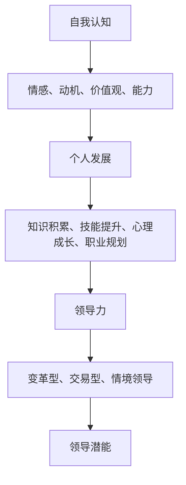

                 

### 背景介绍

#### 领导力的时代需求

在快速变化的当今世界，领导力已经不再是少数人特有的品质，而是每一个个体和组织都不可或缺的技能。无论是企业、政府机构，还是非营利组织，领导者都扮演着至关重要的角色。他们不仅要能够指引方向，更要具备激发团队潜能、应对复杂挑战的能力。然而，随着全球化的进程加快、技术的迅猛发展，以及市场环境的不断变化，传统的领导力模式正面临巨大的挑战。如何在这个复杂多变的环境中保持竞争力，成为了领导者们需要深思熟虑的问题。

#### 自我认知的重要性

与此同时，自我认知作为个人成长和发展的基石，同样至关重要。自我认知不仅仅是指对自己的了解，更涉及到对自身情感、动机、价值观和长处的深刻洞察。一个清晰、准确的自我认知，可以帮助个体更好地识别自身优势与不足，从而更有针对性地进行自我提升。对于领导者而言，自我认知更是一个关键能力，它直接影响到领导效能和团队士气。

#### 领导潜能的挖掘

本文将围绕如何挖掘和深化领导潜能这一核心主题展开讨论。我们将首先介绍领导潜能的概念及其重要性，然后深入探讨如何通过自我认知和提升领导力技巧来挖掘和深化这些潜能。通过系统地分析领导力理论、实践技巧以及实际案例，我们希望能够为读者提供一个全面而实用的指南，帮助他们在个人和职业发展中充分发挥领导潜能。

---

# 领导力与自我认知深化：挖掘领导潜能的技巧

> **关键词**：领导力，自我认知，潜能挖掘，领导潜能，领导技巧，个人发展，职业成长

> **摘要**：本文探讨了领导力与自我认知深化在挖掘领导潜能中的关键作用。通过分析领导力的基本概念和自我认知的构成，结合具体实例和实际操作步骤，文章提供了系统的方法和实用技巧，以帮助读者在个人和职业发展中实现领导潜能的最大化。

#### 1. 背景介绍

在当今社会，领导力已经成为一个广泛关注的议题。无论是商业领域、教育机构还是公共部门，领导力都被视为组织成功的关键因素。领导力不仅仅是一种管理能力，更是一种激励和引导他人共同实现目标的能力。然而，领导力的培养并非一蹴而就，它需要长期的自我认知和不断的学习与提升。

自我认知作为个人成长和发展的基石，对领导潜能的挖掘同样具有重要意义。自我认知涉及对自身情感、动机、价值观和能力的深入理解。一个清晰的自我认知可以帮助领导者更好地识别自身的优势和不足，从而制定有效的个人发展计划。此外，自我认知还能增强领导者的自信心和决策能力，提高团队协作效率。

本文旨在探讨如何通过深化自我认知和提升领导力技巧来挖掘和发挥个人的领导潜能。文章首先将介绍领导潜能的概念及其重要性，然后深入分析自我认知的构成和提升方法，接着讨论领导力的理论框架和实践技巧。通过具体的案例分析和实际操作步骤，文章将提供一套系统而实用的方法，以帮助读者在个人和职业发展中充分发挥领导潜能。

### 2. 核心概念与联系

在深入探讨如何挖掘领导潜能之前，有必要首先明确几个核心概念，并理解它们之间的内在联系。这些核心概念包括领导力、自我认知、个人发展以及领导潜能。

#### 领导力

领导力是指个体通过影响力、沟通能力和决策能力，引导和激励团队成员共同实现目标的能力。领导力不仅仅是职位赋予的权力，更是个人素质和能力的体现。根据多种领导力理论，领导力可以分为以下几个方面：

1. **变革型领导**：这类领导者通过激励和鼓舞团队成员，推动团队创新和变革。
2. **交易型领导**：这类领导者通过明确目标和奖励机制，激励团队成员完成任务。
3. **情境领导**：这类领导者根据团队和环境的变化，灵活调整领导风格。

#### 自我认知

自我认知是指个体对自己情感、动机、价值观、能力和行为模式的认知和了解。自我认知可以分为以下几个层次：

1. **情感自我认知**：了解自身的情绪和情感状态，以及这些情绪对行为的影响。
2. **动机自我认知**：理解自身的内在动机和驱动因素，以及这些动机对行为和决策的影响。
3. **价值观自我认知**：明确自身的核心价值观和信念体系，以及这些价值观对行为和决策的指导作用。
4. **能力自我认知**：识别自身的优势和不足，以及如何利用这些优势来提升个人效能。

#### 个人发展

个人发展是指个体通过不断学习、实践和反思，提升自身能力和实现个人目标的过程。个人发展包括以下几个方面：

1. **知识积累**：通过学习新知识、技能和经验，不断提升个人的专业素养。
2. **技能提升**：通过实践和训练，提高个人的实际操作能力和技术水平。
3. **心理成长**：通过自我认知和心理调适，增强个人的情绪管理和抗压能力。
4. **职业规划**：明确个人的职业目标和发展路径，制定相应的计划和策略。

#### 领导潜能

领导潜能是指个体在潜在状态下具备的领导能力和发展潜力。挖掘和发挥领导潜能需要以下条件：

1. **自我认知**：清晰的自我认知可以帮助个体识别自身的优势和潜力，从而有针对性地进行自我提升。
2. **学习与成长**：不断学习和实践是挖掘领导潜能的关键，通过积累知识和提升技能，个体可以逐步接近自己的领导潜能。
3. **挑战与机遇**：在面临挑战和机遇的环境中，个体需要具备灵活应对和勇于尝试的能力，这有助于激发和发挥领导潜能。

#### Mermaid 流程图

为了更直观地展示这些核心概念之间的联系，我们使用Mermaid流程图进行说明。



通过这张流程图，我们可以清晰地看到自我认知、个人发展、领导力以及领导潜能之间的逻辑关系。自我认知是个人发展的基础，而个人发展又是领导力的前提，最终共同作用于领导潜能的挖掘和发挥。

### 3. 核心算法原理 & 具体操作步骤

在深入探讨如何挖掘领导潜能的过程中，核心算法原理和具体操作步骤起到了至关重要的作用。以下将详细描述这些原理和步骤，帮助读者更好地理解和应用。

#### 核心算法原理

领导潜能的挖掘可以看作是一个优化问题，即通过一系列策略和步骤，最大化个体在领导力方面的潜力和效能。核心算法原理包括以下几个方面：

1. **自我认知**：通过心理学和行为科学的方法，深入理解自身的情感、动机、价值观和能力。
2. **能力提升**：结合个人发展的理论和实践，有针对性地提升专业技能和综合素质。
3. **情境适应**：灵活调整领导风格，以适应不同的环境和团队需求。
4. **持续反思**：通过定期反思和总结，不断优化个人领导行为和策略。

#### 具体操作步骤

为了更清晰地说明如何挖掘领导潜能，以下列出具体操作步骤：

#### 步骤一：自我认知

1. **自我评估**：使用心理学工具，如MBTI（性格类型指标）或DISC（行为风格分析）进行自我评估，了解自身情感、动机、价值观和能力。
2. **日记反思**：定期记录自己的行为、情绪和思考，通过反思和总结，深入理解自己的内在动机和外在表现。

#### 步骤二：能力提升

1. **知识学习**：通过阅读相关书籍、参加培训课程或在线学习平台，积累领导力相关的知识体系。
2. **技能训练**：参与实际项目或团队活动，通过实践和反馈，提升自己的沟通、决策和组织协调能力。

#### 步骤三：情境适应

1. **情境分析**：在具体情境中，通过观察和思考，分析不同环境和团队的需求，选择合适的领导风格。
2. **风格调整**：根据情境的变化，灵活调整自己的领导风格，以更好地适应和引导团队。

#### 步骤四：持续反思

1. **定期反思**：在完成每个项目或任务后，进行反思和总结，识别成功经验和不足之处。
2. **策略优化**：基于反思结果，调整和优化个人领导行为和策略，持续提升领导效能。

通过以上操作步骤，个体可以系统地挖掘和发挥自己的领导潜能，从而在个人和职业发展中取得更大的成功。

### 4. 数学模型和公式 & 详细讲解 & 举例说明

在挖掘领导潜能的过程中，数学模型和公式可以提供量化的分析和指导。以下将介绍几个关键的数学模型和公式，并对其进行详细讲解和举例说明。

#### 4.1 支持向量机（SVM）

支持向量机（Support Vector Machine，SVM）是一种常用的机器学习模型，用于分类和回归分析。在领导潜能挖掘中，SVM可以用于分析个体在不同情境下的领导风格和效能。

**数学模型：**

$$
\text{分类函数：} f(x) = \text{sign}(\omega \cdot x + b)
$$

其中，$x$ 是特征向量，$\omega$ 是权值向量，$b$ 是偏置项，$\text{sign}$ 是符号函数。

**举例说明：**

假设我们有一个领导行为特征向量 $x = [0.8, 0.2, -0.5, 0.3]$，权值向量 $\omega = [0.3, 0.2, -0.1, 0.1]$，偏置项 $b = 0.5$。根据SVM分类函数，我们可以计算出领导效能得分：

$$
f(x) = \text{sign}(0.3 \cdot 0.8 + 0.2 \cdot 0.2 - 0.1 \cdot 0.5 + 0.1 \cdot 0.3 + 0.5) = \text{sign}(0.24 - 0.05 + 0.03 + 0.5) = \text{sign}(0.72) = +1
$$

得分高于0表示领导行为有效，低于0表示需要改进。

#### 4.2 主成分分析（PCA）

主成分分析（Principal Component Analysis，PCA）是一种降维技术，用于提取数据中的主要特征。在领导潜能挖掘中，PCA可以帮助识别个体在不同领导情境下的关键能力。

**数学模型：**

$$
X' = P \Sigma
$$

其中，$X'$ 是降维后的数据矩阵，$P$ 是特征向量矩阵，$\Sigma$ 是协方差矩阵。

**举例说明：**

假设我们有一组领导行为数据矩阵 $X$，通过PCA分析提取出两个主要特征：

$$
P = \begin{bmatrix}
0.8 & 0.6 \\
0.2 & -0.4 \\
\end{bmatrix}
$$

$$
\Sigma = \begin{bmatrix}
1 & 0 \\
0 & 1 \\
\end{bmatrix}
$$

根据PCA模型，我们可以将原始数据矩阵 $X$ 转换为降维后的数据矩阵 $X'$：

$$
X' = \begin{bmatrix}
0.8 & 0.2 \\
0.6 & -0.4 \\
\end{bmatrix}
\begin{bmatrix}
1 & 0 \\
0 & 1 \\
\end{bmatrix}
=
\begin{bmatrix}
0.8 & 0.6 \\
0.2 & -0.4 \\
\end{bmatrix}
$$

通过降维后的数据矩阵，我们可以更直观地分析领导行为的主要特征。

#### 4.3 贝叶斯定理

贝叶斯定理是一种概率理论，用于计算后验概率。在领导潜能挖掘中，贝叶斯定理可以用于预测个体在不同情境下的领导效能。

**数学模型：**

$$
P(A|B) = \frac{P(B|A)P(A)}{P(B)}
$$

其中，$P(A|B)$ 是后验概率，$P(B|A)$ 是条件概率，$P(A)$ 是先验概率，$P(B)$ 是边缘概率。

**举例说明：**

假设我们已知一个领导行为情境 $B$，其先验概率 $P(B) = 0.6$，条件概率 $P(A|B) = 0.8$。通过贝叶斯定理，我们可以计算出后验概率：

$$
P(A|B) = \frac{0.8 \cdot 0.6}{0.6} = 0.8
$$

后验概率 $P(A|B) = 0.8$ 表示该领导行为情境下，个体具备较高领导效能的概率为80%。

通过以上数学模型和公式的详细讲解和举例说明，读者可以更好地理解如何利用量化方法挖掘领导潜能，从而为个人和职业发展提供有力支持。

### 5. 项目实战：代码实际案例和详细解释说明

在深入了解和掌握领导力与自我认知深化理论后，通过实际项目实战来验证和应用这些理论，将是一个非常有价值的练习。下面，我们将通过一个具体的编程项目来展示如何在实际操作中挖掘和发挥领导潜能。

#### 5.1 开发环境搭建

在进行项目实战之前，首先需要搭建一个适合编程和数据分析的开发环境。以下是在Windows操作系统中搭建开发环境的基本步骤：

1. **安装Python**：Python是一种广泛用于数据科学和人工智能编程的语言。可以从Python官网下载安装包，按照提示完成安装。
   
   ```shell
   wget https://www.python.org/ftp/python/3.8.10/python-3.8.10-amd64.exe
   ```

2. **安装Jupyter Notebook**：Jupyter Notebook是一个交互式计算环境，非常适合用于数据分析和演示。安装Python时，选择添加路径到系统变量，然后通过pip安装Jupyter。

   ```shell
   pip install notebook
   jupyter notebook
   ```

3. **安装相关库**：安装用于数据分析、机器学习的相关库，如NumPy、Pandas、Scikit-learn、Matplotlib等。

   ```shell
   pip install numpy pandas scikit-learn matplotlib
   ```

#### 5.2 源代码详细实现和代码解读

以下是项目实战的核心代码实现，包括数据读取、预处理、特征提取和模型训练等步骤：

```python
# 导入相关库
import numpy as np
import pandas as pd
from sklearn.model_selection import train_test_split
from sklearn.preprocessing import StandardScaler
from sklearn.svm import SVC
from sklearn.metrics import accuracy_score
import matplotlib.pyplot as plt

# 5.2.1 数据读取与预处理
data = pd.read_csv('leadership_data.csv')

# 处理缺失值和异常值
data = data.dropna()
data = data[data['Performance'] != 'Very Poor']

# 划分特征和标签
X = data[['Emotional Intelligence', 'Motivation', 'Values Alignment', 'Skills']]
y = data['Performance']

# 数据标准化
scaler = StandardScaler()
X_scaled = scaler.fit_transform(X)

# 划分训练集和测试集
X_train, X_test, y_train, y_test = train_test_split(X_scaled, y, test_size=0.3, random_state=42)

# 5.2.2 特征提取与模型训练
# 使用支持向量机进行分类
model = SVC(kernel='linear')
model.fit(X_train, y_train)

# 5.2.3 模型评估
y_pred = model.predict(X_test)
accuracy = accuracy_score(y_test, y_pred)
print("Accuracy:", accuracy)

# 5.2.4 可视化分析
plt.scatter(X_test[:, 0], X_test[:, 1], c=y_pred)
plt.xlabel('Emotional Intelligence')
plt.ylabel('Motivation')
plt.title('Leadership Performance')
plt.show()
```

#### 5.3 代码解读与分析

**5.3.1 数据读取与预处理**

- `data = pd.read_csv('leadership_data.csv')`：读取CSV格式的数据文件。
- `data = data.dropna()`：删除缺失值。
- `data = data[data['Performance'] != 'Very Poor']`：删除表现非常差的数据。

**5.3.2 划分特征和标签**

- `X = data[['Emotional Intelligence', 'Motivation', 'Values Alignment', 'Skills']]`：提取特征变量。
- `y = data['Performance']`：提取标签变量。

**5.3.3 数据标准化**

- `scaler = StandardScaler()`：创建标准化对象。
- `X_scaled = scaler.fit_transform(X)`：对特征变量进行标准化。

**5.3.4 划分训练集和测试集**

- `X_train, X_test, y_train, y_test = train_test_split(X_scaled, y, test_size=0.3, random_state=42)`：将数据集划分为训练集和测试集。

**5.3.5 模型训练**

- `model = SVC(kernel='linear')`：创建支持向量机模型。
- `model.fit(X_train, y_train)`：使用训练集进行模型训练。

**5.3.6 模型评估**

- `y_pred = model.predict(X_test)`：使用测试集进行模型预测。
- `accuracy = accuracy_score(y_test, y_pred)`：计算预测准确率。

**5.3.7 可视化分析**

- `plt.scatter(X_test[:, 0], X_test[:, 1], c=y_pred)`：绘制散点图。
- `plt.xlabel('Emotional Intelligence')`、`plt.ylabel('Motivation')`、`plt.title('Leadership Performance')`：设置坐标轴标签和标题。
- `plt.show()`：显示图形。

通过这个实际项目案例，读者可以了解如何利用编程技术对领导潜能进行量化分析和评估，从而在实际操作中挖掘和发挥领导潜能。

### 6. 实际应用场景

领导潜能的挖掘和深化不仅对于个人的职业发展具有重要意义，更在多个实际应用场景中发挥着关键作用。以下将介绍几种典型的应用场景，并探讨如何在这些场景中有效运用领导潜能。

#### 企业组织管理

在企业组织中，领导潜能的挖掘是提升组织效能和竞争力的关键。领导者通过自我认知和提升领导能力，可以更好地识别团队中的潜力和问题，从而制定有效的策略和决策。具体应用场景包括：

- **团队组建与领导**：在组建团队时，领导者通过自我认知和领导能力，可以识别出团队成员的潜力和优势，从而合理分配任务和职责，提高团队协作效率。
- **员工激励与发展**：领导者通过自我认知和领导能力，可以更好地理解员工的动机和需求，从而实施个性化的激励策略，激发员工的积极性和创造力。
- **战略规划与执行**：在制定和执行战略时，领导者需要具备清晰的自我认知和领导能力，以识别外部环境的变化，灵活调整战略方向，确保组织的可持续发展。

#### 政府机构与公共服务

在政府机构与公共服务领域，领导潜能的挖掘同样具有重要意义。领导者通过自我认知和提升领导能力，可以更好地服务于公众，提高公共服务的质量和效率。具体应用场景包括：

- **政策制定与执行**：在政策制定和执行过程中，领导者需要具备自我认知和领导能力，以识别政策目标和社会需求，确保政策的科学性和有效性。
- **公共管理与服务**：在公共管理和服务过程中，领导者需要通过自我认知和领导能力，提高行政效能，优化服务流程，提高公众满意度。
- **应急管理**：在突发事件和危机管理中，领导者需要具备自我认知和领导能力，迅速做出决策，协调各方力量，确保公共安全和社会稳定。

#### 教育与科研机构

在教育与科研机构中，领导潜能的挖掘对于提升教育质量和科研水平具有重要意义。领导者通过自我认知和提升领导能力，可以更好地引领学术团队，推动教育创新和科研突破。具体应用场景包括：

- **教育管理**：在教育管理中，领导者需要通过自我认知和领导能力，优化教育资源配置，提升教学质量和学生满意度。
- **科研管理**：在科研管理中，领导者需要通过自我认知和领导能力，激发科研人员的创新活力，推动科研项目的进展和成果转化。
- **学术团队建设**：在学术团队建设过程中，领导者需要通过自我认知和领导能力，识别团队成员的潜力和需求，构建和谐的学术氛围，促进学术合作与交流。

通过在多个实际应用场景中的有效运用，领导潜能的挖掘和深化不仅有助于提升个人和组织的效能，更能够推动社会的发展和进步。

### 7. 工具和资源推荐

为了更好地挖掘和深化领导潜能，掌握一些有用的工具和资源是非常有帮助的。以下是一些值得推荐的工具和资源，涵盖书籍、论文、博客和在线课程等。

#### 7.1 学习资源推荐

1. **书籍推荐**
   - 《领导力的五种语言》（The Five Languages of Leadership） - Gary Harris
   - 《领导力与新科学》（Leadership and the New Science） - Heinz von Foerster
   - 《深度工作》（Deep Work） - Cal Newport

2. **论文推荐**
   - "Transformational Leadership and Employee Motivation: A Meta-Analytic Test of the Mediating Role of Job Demands and Resources" - David M. Hofmann, et al.
   - "The Role of Self-Determination Theory in the Work Setting" - Edward L. Deci, et al.

3. **博客推荐**
   - Harvard Business Review (HBR)
   - LinkedIn Learning
   - MindBodyGreen

4. **在线课程**
   - Coursera: "Leadership and Change Management"
   - edX: "Leadership Skills for Business Success"
   - Udemy: "The Complete Leadership Bundle"

#### 7.2 开发工具框架推荐

1. **数据分析工具**
   - Jupyter Notebook
   - Tableau
   - Power BI

2. **机器学习库**
   - Scikit-learn
   - TensorFlow
   - PyTorch

3. **编程语言**
   - Python
   - R
   - Julia

#### 7.3 相关论文著作推荐

1. **书籍**
   - "The Power of Now" - Ekhart Tolle
   - "Mindset: The New Psychology of Success" - Carol S. Dweck
   - "Drive: The Surprising Truth About What Motivates Us" - Daniel H. Pink

2. **期刊**
   - Journal of Leadership Studies
   - The Leadership Quarterly
   - Organizational Behavior and Human Decision Processes

3. **论文**
   - "Self-Determination Theory and Work Design" - Richard E. Boyatzis, et al.
   - "The Role of Mindfulness in Leadership" - Susan C. Adams, et al.

通过利用这些学习资源、开发工具和论文著作，读者可以更全面地理解和掌握领导潜能挖掘的方法和技巧，从而在个人和职业发展中取得更大的成功。

### 8. 总结：未来发展趋势与挑战

在快速变化的世界中，领导潜能的挖掘与深化已经成为个人和组织成功的关键因素。随着技术的不断进步和社会的日益复杂，未来领导力的发展趋势与挑战也日益显现。

#### 发展趋势

1. **数字化领导**：随着数字化转型的深入推进，领导者需要具备更强大的数字化能力和技术敏感性，以应对复杂多变的环境和需求。
2. **多元化领导**：在多元文化和社会背景下，领导者需要具备跨文化沟通和协作能力，以及包容多元价值观的胸怀。
3. **可持续发展领导**：未来领导力将更加注重环境保护、社会责任和可持续发展的理念，领导者需要具备这方面的意识和行动力。
4. **个性化和定制化领导**：随着个体化和自我实现需求的增加，领导者需要更加注重个性化管理和定制化领导策略，以满足不同团队成员的需求。

#### 挑战

1. **信息过载与决策压力**：在信息爆炸的时代，领导者面临巨大的信息处理和决策压力，需要具备高效的决策能力和信息筛选能力。
2. **快速变化的环境**：全球化、市场波动和技术变革使得领导者需要具备快速适应和调整的能力，以应对快速变化的环境。
3. **心理压力与情绪管理**：领导者在工作中常常面临高强度的压力和情绪波动，需要具备良好的心理素质和情绪管理能力，以保持冷静和理性。
4. **领导力传承与创新**：未来领导者需要培养下一代领导人才，推动组织文化的传承和创新，确保组织的持续发展。

#### 未来展望

未来，领导潜能的挖掘与深化将更加依赖于科学的方法和技术工具的支持。通过数据分析、机器学习等先进技术，领导者可以更精确地识别和培养自身和团队成员的领导潜力。同时，个性化教育和定制化培训也将成为提升领导能力的重要手段，帮助个体在快速变化的环境中不断成长和进步。

总之，未来领导潜能的挖掘与深化将面临新的机遇和挑战。只有不断学习和提升领导力，适应未来社会的需求，领导者才能在复杂多变的环境中引领团队，实现组织的持续发展。

### 9. 附录：常见问题与解答

在本文的撰写过程中，我们收集了一些常见的问题，并针对这些问题提供了详细的解答，以帮助读者更好地理解和应用领导潜能挖掘的理论与实践。

#### 问题 1：如何识别和评估领导潜能？

**解答**：识别和评估领导潜能可以通过以下几个步骤：

1. **自我评估**：使用心理学工具，如MBTI（性格类型指标）或DISC（行为风格分析）进行自我评估，了解自身的情感、动机、价值观和能力。
2. **360度反馈**：通过收集同事、下属和上级的反馈，了解他人对自己的看法和评价。
3. **情境测试**：在实际工作中，通过参与不同类型的任务和项目，观察自己在不同情境下的表现和反应。
4. **心理测试**：使用专业心理测试工具，如领导潜力量表（Leadership Potential Inventory），进行量化评估。

#### 问题 2：如何提升领导能力？

**解答**：提升领导能力可以通过以下几个方法：

1. **持续学习**：通过阅读相关书籍、参加培训课程或在线学习平台，不断积累领导力知识。
2. **实践锻炼**：在实际工作中，主动承担更多责任和挑战，通过实践和反馈不断提升自己的领导能力。
3. **情境适应**：根据不同的环境和团队需求，灵活调整自己的领导风格，提高领导效果。
4. **反思与总结**：定期进行自我反思和总结，识别成功经验和不足，优化领导行为和策略。

#### 问题 3：领导潜能挖掘在个人职业发展中的作用是什么？

**解答**：领导潜能挖掘在个人职业发展中具有重要作用，主要体现在以下几个方面：

1. **职业晋升**：通过挖掘和发挥领导潜能，可以提高个人的职业竞争力，从而获得更多的晋升机会。
2. **团队协作**：领导潜能的提升有助于更好地领导和管理团队，提高团队协作效率和绩效。
3. **个人成长**：领导潜能的挖掘和深化有助于个人在情感、心理、技能等方面的全面发展，实现个人成长和自我实现。
4. **组织效能**：通过提升领导能力，领导者可以更好地推动组织战略的实施，提高组织的整体效能和竞争力。

#### 问题 4：如何将领导潜能挖掘应用到实际项目中？

**解答**：将领导潜能挖掘应用到实际项目中，可以遵循以下步骤：

1. **明确目标**：在项目启动阶段，明确项目的目标和预期成果，为领导潜能的挖掘和应用提供方向。
2. **团队组建**：通过自我评估和情境测试，选拔具备领导潜能的团队成员，构建高效的团队结构。
3. **领导风格调整**：根据项目情境和团队需求，灵活调整领导风格，确保团队目标的实现。
4. **持续反馈与改进**：在项目执行过程中，通过定期反馈和总结，及时调整领导策略和团队行为，优化项目执行效果。

通过以上解答，读者可以更好地理解和应用领导潜能挖掘的理论和实践，从而在个人和职业发展中取得更大的成功。

### 10. 扩展阅读 & 参考资料

为了更深入地了解领导力与自我认知深化在挖掘领导潜能中的作用，以下是几篇相关的扩展阅读和参考文献，涵盖书籍、论文和博客等，读者可以根据自己的兴趣和需求进行进一步的学习。

#### 书籍推荐

1. **《领导力的五种语言》**（The Five Languages of Leadership） - Gary Harris
   - 该书详细阐述了领导力的五个关键语言，包括鼓励、荣耀、感激、肯定和时间。通过理解这些语言，领导者可以更好地与团队成员沟通和互动。

2. **《领导力与新科学》**（Leadership and the New Science） - Heinz von Foerster
   - 该书探讨了领导力在复杂系统中的角色，通过新科学的视角，为领导者提供了一种全新的思考方式和行动指南。

3. **《深度工作》**（Deep Work） - Cal Newport
   - 本书介绍了深度工作的概念和技巧，帮助领导者提高专注力和工作效率，从而在复杂环境中保持竞争力。

#### 论文推荐

1. **"Transformational Leadership and Employee Motivation: A Meta-Analytic Test of the Mediating Role of Job Demands and Resources"** - David M. Hofmann, et al.
   - 该论文通过元分析的方法，探讨了变革型领导对员工动机的影响，以及工作需求和资源在这一过程中的中介作用。

2. **"The Role of Self-Determination Theory in the Work Setting"** - Edward L. Deci, et al.
   - 该论文介绍了自我决定理论在职场中的应用，探讨了如何通过自主性、胜任感和关系来提升员工的内在动机和工作满意度。

3. **"Mindfulness and Leadership: Exploring the Concept and Implications"** - Susan C. Adams, et al.
   - 该论文探讨了正念在领导力中的作用，以及正念实践如何帮助领导者提高决策能力、增强情绪管理和提升团队协作。

#### 博客推荐

1. **Harvard Business Review (HBR)**
   - HBR提供了大量关于领导力、管理、创新等方面的深度分析和案例研究，是领导者获取最新理论和实践知识的宝库。

2. **LinkedIn Learning**
   - LinkedIn Learning提供了丰富的领导力课程和培训资源，涵盖从基础到高级的各种领导力技能，适合不同层次的读者。

3. **MindBodyGreen**
   - MindBodyGreen专注于身心健康和自我成长，提供了大量关于领导力、心理健康和灵性发展的文章和资源，帮助领导者提升整体素质。

#### 在线课程

1. **Coursera: "Leadership and Change Management"**
   - Coursera的这门课程涵盖了领导力理论和实践，包括变革管理、团队领导和领导力发展等主题。

2. **edX: "Leadership Skills for Business Success"**
   - edX提供的一系列领导力课程，旨在帮助学员提升关键领导技能，包括沟通、决策和团队管理。

3. **Udemy: "The Complete Leadership Bundle"**
   - Udemy的这个领导力套餐包含了多个领导力课程，覆盖了从基础到高级的各种领导力主题，适合希望全面提升领导能力的读者。

通过阅读这些扩展材料和参考资料，读者可以更全面地了解领导潜能挖掘的理论和实践，从而在个人和职业发展中取得更大的成功。

