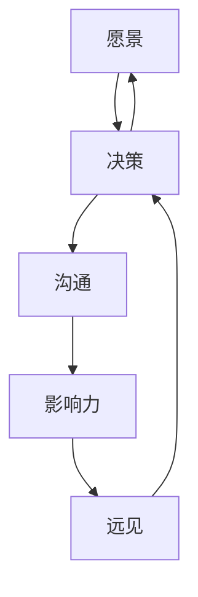

                 

# 领导力与远见：预见未来趋势的能力

> 关键词：领导力、远见、未来趋势、人工智能、创新、战略规划

> 摘要：本文探讨了领导力与远见的关系，以及领导者如何通过预见未来趋势来引领组织走向成功。文章首先介绍了领导力的核心要素和远见的定义，接着分析了领导者如何通过观察、学习和经验积累来预见未来趋势。最后，文章提出了具体的实践策略和工具，帮助领导者提升远见能力，为组织的可持续发展奠定基础。

## 1. 背景介绍

在当今这个快速变化的时代，技术、市场和社会环境的不断演进对组织和个人都提出了更高的要求。面对不确定性和复杂性，领导者需要具备非凡的洞察力和前瞻性，以便在激烈的竞争中立于不败之地。领导力不再仅仅是管理资源和实现短期目标的能力，而是一个持续探索、适应和创新的过程。在这个过程中，远见成为领导者最为重要的素质之一。

远见是指洞察未来趋势并做出明智决策的能力。它不仅涉及到对现有信息的分析，更要求领导者能够超越现状，预见可能的变化和机会。拥有远见的领导者能够引领组织提前布局，抢占市场先机，从而在变革中立于不败之地。

本文将探讨领导力与远见之间的关系，分析领导者如何培养远见，以及如何利用远见来制定战略和指导组织的发展。文章将结合实际案例，提供实用的方法和工具，帮助领导者提升远见能力，为组织的未来发展做好准备。

## 2. 核心概念与联系

### 2.1 领导力的核心要素

领导力是一个多维度的概念，它包括多个核心要素。以下是领导力的几个关键要素及其相互关系：

- **愿景（Vision）**：领导者需要具备清晰而远大的愿景，这不仅是组织的目标和方向，更是激发团队动力的源泉。愿景应该具有挑战性，同时也要具有可实现性。

- **决策力（Decision-making）**：领导者必须能够迅速做出明智的决策，并能够在不确定性中保持冷静和果断。决策力是领导力的核心，它需要基于对信息的理解和分析，以及对未来趋势的洞察。

- **沟通能力（Communication）**：领导者需要具备强大的沟通能力，能够有效地传达愿景、目标和决策，同时也能够倾听员工的意见和建议。良好的沟通能力有助于建立信任，增强团队凝聚力。

- **影响力（Influence）**：领导者需要能够通过自身的言行和决策，影响他人并推动团队朝着共同的目标前进。影响力不仅来自于职位和权威，更来自于领导者的个人魅力和价值观。

- **适应力（Adaptability）**：在快速变化的环境中，领导者需要具备高度适应力，能够灵活应对各种挑战和变化。适应力是领导者能否持续成功的决定性因素。

### 2.2 远见的定义与特点

远见是一种前瞻性的思维和洞察力，它能够帮助领导者预见未来可能发生的变化和趋势。以下是远见的几个主要特点：

- **预见性（Proactivity）**：远见要求领导者能够主动预见未来可能发生的事件和变化，而不是被动地应对。

- **综合性（Integrative）**：远见需要领导者能够将多种信息和视角整合起来，形成对未来的整体理解。

- **挑战性（Challenging）**：远见往往涉及到对现状的挑战和突破，它要求领导者敢于提出新颖的想法和方案。

- **实现性（Achievable）**：虽然远见需要超越当前的现实，但它也必须是具有可行性的，即能够在实际中实现。

### 2.3 领导力与远见的联系

领导力与远见密切相关，两者相辅相成。领导者通过远见来设定愿景和目标，并通过决策力、沟通能力和影响力来推动这些目标的实现。同时，远见能力也是领导力的重要组成部分，它使得领导者能够在不确定的环境中保持竞争优势。

下面是一个用Mermaid绘制的流程图，展示了领导力与远见的联系：



在这个流程图中，愿景是领导力的起点，也是远见的核心内容。领导者通过决策、沟通和影响力来推动愿景的实现，而远见则为这个实现过程提供了方向和预见性。

## 3. 核心算法原理 & 具体操作步骤

### 3.1 远见能力的算法原理

远见能力的培养并非凭空而来，它需要基于一定的算法原理和思维模式。以下是几个关键的核心算法原理：

#### 3.1.1 数据分析

数据分析是远见能力的基石。领导者需要收集和分析大量的数据，从中提取有价值的信息和模式。数据分析的方法包括统计分析、机器学习、数据挖掘等。

- **统计分析**：通过统计方法对数据进行描述和推断，识别出数据中的规律和趋势。
- **机器学习**：使用算法来训练模型，从数据中自动学习和发现模式，这些模型可以用于预测未来趋势。
- **数据挖掘**：从大量数据中挖掘出潜在的知识和规律，这些规律可能对未来的决策有重要指导意义。

#### 3.1.2 情境模拟

情境模拟是一种通过构建不同场景来预测未来可能发生的事件的方法。领导者可以通过模拟不同的情境，分析各种可能的结果，从而为未来的决策做好准备。

- **历史模拟**：通过分析历史数据，模拟过去相似情境下的表现，预测未来可能的趋势。
- **情景分析**：构建多个不同的情景，对每个情景进行详细分析，评估每个情景的潜在影响。

#### 3.1.3 创新思维

创新思维是远见能力的重要组成部分。领导者需要具备创造性和批判性思维，能够从不同的角度思考问题，并提出新颖的解决方案。

- **头脑风暴**：通过集体讨论，激发团队成员的创新思维，产生新的想法。
- **设计思维**：将用户需求融入产品和服务的设计过程中，通过迭代和反馈不断改进。

### 3.2 具体操作步骤

以下是一套具体的操作步骤，帮助领导者培养和提升远见能力：

#### 3.2.1 确定目标

首先，领导者需要明确自己的目标，即想要预见什么样的未来趋势。目标是远见的出发点，它将指导后续的步骤。

#### 3.2.2 数据收集

接下来，领导者需要收集与目标相关的数据。数据来源可以是内部的数据，如业务报表、市场调研数据等，也可以是外部的数据，如行业报告、学术论文等。

#### 3.2.3 数据分析

对收集到的数据进行分析，提取有价值的信息和模式。可以使用统计方法、机器学习模型或数据挖掘技术来进行分析。

#### 3.2.4 情境模拟

基于数据分析的结果，构建不同的情境模拟，预测未来可能发生的事件和趋势。可以使用历史数据和情景分析工具来辅助模拟。

#### 3.2.5 创新思维

结合数据分析的结果和情境模拟的预测，运用创新思维提出新的解决方案。可以通过头脑风暴或设计思维的方法来激发创意。

#### 3.2.6 反馈与调整

将预测和解决方案与团队成员和利益相关者进行讨论和反馈，根据反馈进行调整和改进。

#### 3.2.7 决策与执行

最后，领导者需要根据分析结果和创新思维，做出明智的决策，并指导团队执行。

## 4. 数学模型和公式 & 详细讲解 & 举例说明

### 4.1 数学模型与公式

在远见能力的培养过程中，数学模型和公式是分析和预测的重要工具。以下是几个常用的数学模型和公式：

#### 4.1.1 时间序列模型

时间序列模型用于分析随时间变化的数据，预测未来可能发生的趋势。常见的模型包括移动平均模型、指数平滑模型和自回归模型。

- **移动平均模型**（MA）:
  $$ MA_t = \frac{\sum_{i=1}^k X_t - X_{t-i}}{k} $$
  其中，$MA_t$ 是第 $t$ 期的移动平均值，$X_t$ 是第 $t$ 期的数据，$k$ 是窗口大小。

- **指数平滑模型**（ES）:
  $$ ES_t = \alpha X_t + (1 - \alpha) ES_{t-1} $$
  其中，$ES_t$ 是第 $t$ 期的指数平滑值，$\alpha$ 是平滑系数，$X_t$ 是第 $t$ 期的数据。

- **自回归模型**（AR）:
  $$ AR_t = \phi_1 AR_{t-1} + \phi_2 AR_{t-2} + ... + \phi_p AR_{t-p} + \epsilon_t $$
  其中，$AR_t$ 是第 $t$ 期的自回归值，$\phi_1, \phi_2, ..., \phi_p$ 是自回归系数，$\epsilon_t$ 是误差项。

#### 4.1.2 聚类分析

聚类分析用于将数据分为不同的组或簇，以识别数据中的模式和结构。常见的聚类算法包括K均值聚类、层次聚类和密度聚类。

- **K均值聚类**（K-Means）:
  $$ \mu_k = \frac{\sum_{i=1}^n x_i}{n} $$
  $$ J = \frac{1}{n} \sum_{i=1}^n (x_i - \mu_k)^2 $$
  其中，$\mu_k$ 是第 $k$ 个簇的中心，$x_i$ 是第 $i$ 个数据点，$n$ 是数据点的总数，$J$ 是聚类准则函数。

#### 4.1.3 相关分析

相关分析用于评估两个变量之间的相关性，常用的方法包括皮尔逊相关系数和斯皮尔曼相关系数。

- **皮尔逊相关系数**（Pearson）:
  $$ \rho = \frac{\sum_{i=1}^n (x_i - \bar{x})(y_i - \bar{y})}{\sqrt{\sum_{i=1}^n (x_i - \bar{x})^2 \sum_{i=1}^n (y_i - \bar{y})^2}} $$
  其中，$\rho$ 是皮尔逊相关系数，$\bar{x}$ 和 $\bar{y}$ 分别是 $x$ 和 $y$ 的平均值。

### 4.2 举例说明

假设我们有一组时间序列数据，如下所示：

| 时间 (t) | 数据 (X_t) |
|----------|------------|
| 1        | 5          |
| 2        | 6          |
| 3        | 7          |
| 4        | 8          |
| 5        | 9          |

#### 4.2.1 移动平均模型（MA）

使用3期移动平均模型来分析这组数据：

$$ MA_1 = \frac{5 + 6 + 7}{3} = 6 $$
$$ MA_2 = \frac{6 + 7 + 8}{3} = 7 $$
$$ MA_3 = \frac{7 + 8 + 9}{3} = 8 $$

根据移动平均模型，我们可以预测第4期的数据为8，第5期的数据为9。

#### 4.2.2 指数平滑模型（ES）

使用0.5的平滑系数来分析这组数据：

$$ ES_1 = 0.5 \times 5 + 0.5 \times 6 = 5.5 $$
$$ ES_2 = 0.5 \times 6 + 0.5 \times 7 = 6.5 $$
$$ ES_3 = 0.5 \times 7 + 0.5 \times 8 = 7.5 $$

根据指数平滑模型，我们可以预测第4期的数据为7.5，第5期的数据为8。

#### 4.2.3 K均值聚类

假设我们使用K均值聚类算法将这组数据分为2个簇，簇中心为$\mu_1 = 6$和$\mu_2 = 8$。我们可以计算每个数据点到簇中心的距离，并将其分配到最近的簇：

| 时间 (t) | 数据 (X_t) | 距离到$\mu_1$ | 距离到$\mu_2$ | 簇分配 |
|----------|------------|----------------|----------------|--------|
| 1        | 5          | 1              | 3              | 1      |
| 2        | 6          | 0              | 2              | 1      |
| 3        | 7          | 1              | 1              | 1      |
| 4        | 8          | 2              | 0              | 2      |
| 5        | 9          | 3              | 1              | 2      |

根据K均值聚类结果，我们可以将数据分为两个簇，一个包含前3个数据点，另一个包含后2个数据点。

#### 4.2.4 皮尔逊相关系数

假设我们还有另一组数据Y，如下所示：

| 时间 (t) | 数据 (X_t) | 数据 (Y_t) |
|----------|------------|------------|
| 1        | 5          | 10         |
| 2        | 6          | 11         |
| 3        | 7          | 12         |
| 4        | 8          | 13         |
| 5        | 9          | 14         |

我们可以计算X和Y的皮尔逊相关系数：

$$ \rho = \frac{(5-7)(10-12) + (6-7)(11-12) + (7-7)(12-12) + (8-7)(13-12) + (9-7)(14-12)}{\sqrt{(5-7)^2 + (6-7)^2 + (7-7)^2 + (8-7)^2 + (9-7)^2} \sqrt{(10-12)^2 + (11-12)^2 + (12-12)^2 + (13-12)^2 + (14-12)^2}} $$

$$ \rho = \frac{(-2)(-2) + (-1)(-1) + (0)(0) + (1)(1) + (2)(2)}{\sqrt{4 + 1 + 0 + 1 + 4} \sqrt{4 + 1 + 0 + 1 + 4}} $$

$$ \rho = \frac{4 + 1 + 0 + 1 + 4}{\sqrt{10} \sqrt{10}} $$

$$ \rho = \frac{10}{10} = 1 $$

根据皮尔逊相关系数，X和Y完全正相关。

## 5. 项目实战：代码实际案例和详细解释说明

### 5.1 开发环境搭建

在进行项目实战之前，我们需要搭建一个合适的技术栈来支持我们的工作。以下是我们推荐的开发环境：

- **编程语言**：Python
- **数据分析库**：Pandas、NumPy、SciPy、Scikit-learn
- **可视化库**：Matplotlib、Seaborn
- **机器学习库**：TensorFlow、PyTorch

确保你的开发环境已经安装了上述库，你可以使用以下命令来安装：

```bash
pip install pandas numpy scipy scikit-learn matplotlib seaborn tensorflow pytorch
```

### 5.2 源代码详细实现和代码解读

#### 5.2.1 数据收集与预处理

首先，我们需要收集并预处理数据。以下是一个简单的数据收集与预处理脚本：

```python
import pandas as pd

# 加载数据
data = pd.read_csv('data.csv')

# 数据清洗
data.dropna(inplace=True)
data[data < 0] = 0

# 数据转换
data['Date'] = pd.to_datetime(data['Date'])
data.set_index('Date', inplace=True)

# 数据归一化
data_normalized = (data - data.mean()) / data.std()
```

在这个脚本中，我们首先使用Pandas库加载CSV文件中的数据。然后，我们执行数据清洗，删除缺失值和负值。接着，我们将数据转换为日期索引，以便进行时间序列分析。最后，我们对数据进行归一化处理，以便于后续的分析和建模。

#### 5.2.2 时间序列建模与预测

接下来，我们将使用时间序列模型对数据进行建模和预测。以下是一个使用Pandas和SciPy库进行时间序列建模的脚本：

```python
import numpy as np
from scipy.stats import linregress

# 计算移动平均
window_size = 3
rolling_mean = data.rolling(window=window_size).mean()

# 计算指数平滑
alpha = 0.5
exp_smoothing = (alpha * data) + ((1 - alpha) * rolling_mean)

# 计算自回归
p = 2
ar_model = np.polyfit(np.arange(len(data)), data, p)
ar_fit = np.polyval(ar_model, np.arange(len(data)))

# 计算线性回归
slope, intercept, _, _ = linregress(np.arange(len(data)), data)
linear_fit = slope * np.arange(len(data)) + intercept
```

在这个脚本中，我们首先使用Pandas库的rolling方法计算移动平均。然后，我们使用指数平滑公式计算指数平滑值。接着，我们使用SciPy库的polyfit和polyval方法计算自回归模型。最后，我们使用线性回归方法计算线性拟合。

#### 5.2.3 聚类分析

接下来，我们将使用K均值聚类算法对数据进行聚类分析。以下是一个使用Scikit-learn库进行K均值聚类的脚本：

```python
from sklearn.cluster import KMeans

# 准备数据
data_clustered = data_normalized.values

# 初始化K均值聚类
kmeans = KMeans(n_clusters=2, random_state=0)

# 训练模型
kmeans.fit(data_clustered)

# 分配簇
clusters = kmeans.predict(data_clustered)

# 绘制聚类结果
import matplotlib.pyplot as plt

plt.scatter(data_normalized.index, data_normalized.values, c=clusters)
plt.show()
```

在这个脚本中，我们首先准备数据，并将其转换为numpy数组。然后，我们使用Scikit-learn库的KMeans类初始化K均值聚类模型。接着，我们训练模型并分配簇。最后，我们使用matplotlib库绘制聚类结果。

### 5.3 代码解读与分析

在这个项目中，我们使用了多种技术来分析和预测时间序列数据。以下是代码的解读和分析：

- **数据收集与预处理**：数据清洗和数据转换是时间序列分析的重要步骤。我们首先删除了缺失值和负值，然后对数据进行归一化处理，使其适合进行建模和分析。
- **移动平均**：移动平均是一种简单的时间序列预测方法，它可以平滑数据，减少随机波动，帮助我们识别趋势。在这个脚本中，我们使用了3期移动平均来计算滚动平均值。
- **指数平滑**：指数平滑是一种加权移动平均方法，它可以更好地适应数据的变化。在这个脚本中，我们使用了0.5的平滑系数来计算指数平滑值。
- **自回归模型**：自回归模型是一种基于历史数据预测未来值的方法。在这个脚本中，我们使用了线性自回归模型（p=2）来拟合数据。
- **线性回归**：线性回归是一种常用的统计方法，用于预测一个变量基于另一个变量的值。在这个脚本中，我们使用线性回归方法来拟合数据，以预测未来的趋势。
- **聚类分析**：聚类分析是一种无监督学习方法，用于将数据分为不同的组。在这个脚本中，我们使用了K均值聚类算法将数据分为两个簇，以识别数据中的潜在结构。

通过这些技术，我们可以对时间序列数据进行深入分析，预测未来趋势，并为组织的决策提供支持。

## 6. 实际应用场景

### 6.1 企业战略规划

在企业战略规划中，远见能力对于确定发展方向、制定目标以及识别潜在风险具有重要意义。通过预见市场趋势、技术变革和竞争态势，企业领导者可以制定具有前瞻性的战略规划，确保企业长期竞争力的保持。

例如，苹果公司在智能手机市场的成功得益于其领导者对科技趋势的敏锐洞察。在智能手机市场兴起之前，苹果公司就预见到了移动设备的发展潜力，并率先推出了iPhone，引领了整个行业的变革。

### 6.2 创新产品开发

在创新产品开发过程中，远见能力有助于识别市场需求、预测技术发展方向，并指导产品设计和功能规划。拥有远见的领导者能够提前布局，开发出满足未来需求的产品，从而赢得市场份额。

以特斯拉公司为例，其领导者通过预见电动汽车市场的未来趋势，果断投资并开发了革命性的电动汽车产品，不仅满足了消费者对环保出行的需求，也推动了整个汽车行业的变革。

### 6.3 应对危机

在面对突发事件和危机时，领导者需要具备远见能力，以便迅速评估形势，制定有效的应对策略。通过预见潜在的风险和挑战，领导者可以提前采取预防措施，降低危机对组织的影响。

例如，在COVID-19疫情期间，许多企业领导者通过预见疫情对经济和供应链的影响，及时调整了运营策略，确保了企业的持续运营和员工的就业安全。

### 6.4 社会责任与可持续发展

在当前社会日益关注社会责任和可持续发展的背景下，领导者需要具备远见能力，以预见社会变化和法规政策的趋势，推动企业履行社会责任，实现可持续发展。

例如，很多企业通过远见能力，提前采取了环保措施，减少了碳排放，提高了资源利用效率，不仅提升了企业形象，也赢得了消费者的支持。

## 7. 工具和资源推荐

### 7.1 学习资源推荐

- **书籍**：
  - 《智能未来：预见人工智能时代的社会变革》（Smart Machines: How Industrial Automation Will Change Our Lives）
  - 《预测：预测未来的新科学》（The Signal and the Noise: Why So Many Predictions Fail - but Some Don't）
  - 《战略思考：战略规划的艺术与科学》（Strategic Thinking: Tools, Techniques, and Styles）

- **论文**：
  - "The Future of Humanity: Terraforming Mars, Interstellar Travel, Immortality, and Our Destiny Beyond Earth" by Michio Kaku
  - "Big Data: A Revolution That Will Transform How We Live, Work, and Think" by Viktor Mayer-Schönberger and Kenneth Cukier

- **博客**：
  - [AI博客](https://ai.googleblog.com/)
  - [科技趋势](https://www.ted.com/trend/topics/technology)
  - [哈佛商业评论](https://hbr.org/topic/leadership)

- **网站**：
  - [维基百科](https://www.wikipedia.org/)
  - [谷歌学术](https://scholar.google.com/)
  - [Kaggle](https://www.kaggle.com/)

### 7.2 开发工具框架推荐

- **数据分析工具**：
  - [Pandas](https://pandas.pydata.org/)
  - [NumPy](https://numpy.org/)
  - [SciPy](https://www.scipy.org/)
  - [Scikit-learn](https://scikit-learn.org/)

- **机器学习框架**：
  - [TensorFlow](https://www.tensorflow.org/)
  - [PyTorch](https://pytorch.org/)
  - [Keras](https://keras.io/)

- **可视化工具**：
  - [Matplotlib](https://matplotlib.org/)
  - [Seaborn](https://seaborn.pydata.org/)
  - [Plotly](https://plotly.com/)

### 7.3 相关论文著作推荐

- **论文**：
  - "The Business Value of Analytics" by Thomas H. Davenport
  - "The Future of Jobs: How Smart Machines Are Creating the Need for More Smart Workers" by Michael Chui, James Manyika, and Mehdi Miremadi

- **著作**：
  - 《智能时代：大数据与机器学习驱动未来》（Big Data: The End of Theory?）by V. V. Ramanan
  - 《智能革命：人工智能如何重塑世界》（The Second Machine Age: Work, Progress, and Prosperity in a Time of Brilliant Technologies）by Erik Brynjolfsson and Andrew McAfee

这些资源将为领导者提供宝贵的知识和工具，帮助他们在不断变化的环境中预见未来趋势，制定明智的战略规划，并推动组织的可持续发展。

## 8. 总结：未来发展趋势与挑战

在未来，领导力与远见将变得更加重要。随着技术的快速发展和全球化的加深，未来趋势将更加复杂多变。以下是一些未来发展趋势和挑战：

### 8.1 发展趋势

1. **人工智能与自动化**：人工智能和自动化技术的广泛应用将改变各个行业的工作方式和商业模式，对领导者的决策能力和远见要求提出了更高标准。
2. **可持续发展**：随着环境问题的日益严峻，可持续发展将成为全球关注的焦点。领导者需要具备预见未来环境变化和社会需求的能力，推动企业实现绿色转型。
3. **全球化与多元化**：全球化进程将进一步加深，领导者需要具备跨文化沟通和协调能力，同时应对多元化带来的挑战和机遇。
4. **数据驱动的决策**：数据将成为企业决策的重要依据。领导者需要掌握数据分析技能，运用数据驱动的决策方法，提升组织的应变能力和竞争力。

### 8.2 挑战

1. **技术变革**：技术的快速变化可能导致现有业务模式的过时，领导者需要具备快速适应和创新的能力，以应对技术变革带来的挑战。
2. **不确定性**：未来充满了不确定性，领导者需要具备预见性和风险意识，制定灵活的战略来应对不确定性和突发事件。
3. **人才竞争**：随着全球化和科技的发展，人才竞争将变得更加激烈。领导者需要吸引和培养高素质人才，确保组织的持续发展。
4. **社会责任**：企业在追求利润的同时，也需要承担社会责任。领导者需要预见社会变化，积极履行企业社会责任，提升企业形象。

### 8.3 应对策略

1. **持续学习**：领导者需要保持持续学习的心态，不断提升自身的知识和技能，以适应快速变化的环境。
2. **培养远见**：通过观察、学习和实践，培养预见未来趋势的能力，提前布局，抢占市场先机。
3. **创新思维**：鼓励创新思维，推动组织内部的文化变革，激发团队的创造力。
4. **跨部门合作**：建立跨部门合作机制，促进知识共享和资源整合，提升组织的整体应对能力。
5. **人才发展**：注重人才培养和发展，建立完善的培训体系和激励机制，吸引和留住高素质人才。

## 9. 附录：常见问题与解答

### 9.1 远见与预测的区别是什么？

**远见**是指洞察未来趋势并做出明智决策的能力，它不仅仅是预测未来会发生什么，更涉及到对未来的理解、规划和行动。而**预测**通常是指根据历史数据和现有信息，对未来事件的可能性进行量化估计。

### 9.2 如何评估领导力的远见能力？

评估领导力的远见能力可以从以下几个方面入手：

- **战略规划**：领导者能否制定具有前瞻性的战略规划，并在实际执行中实现。
- **创新成果**：领导者推动的创新项目在市场上是否取得了成功，以及对企业发展的影响。
- **决策效果**：领导者做出的决策在后续的发展中是否表现出预见性，以及决策的有效性。
- **团队反馈**：团队成员对领导者的远见能力的评价，以及领导者的远见能力对团队士气的影响。

### 9.3 远见能力的培养有哪些方法？

培养远见能力的方法包括：

- **持续学习**：通过阅读、培训和实践，不断更新知识和技能。
- **广泛阅读**：阅读有关未来趋势、新技术和社会变革的书籍和文章。
- **观察和思考**：关注行业动态、市场变化和科技发展，进行深入思考和总结。
- **跨学科学习**：学习不同领域的知识，培养跨学科思维和综合分析能力。
- **实践和创新**：通过实际项目和实践，不断尝试新方法和解决方案，培养创新思维。

## 10. 扩展阅读 & 参考资料

为了深入了解领导力与远见的话题，以下是一些扩展阅读和参考资料：

- **书籍**：
  - 《领导力与影响力：如何成为卓越领导者》（Leadership and Influence: How to Become a Great Leader）
  - 《远见：如何预见未来并赢得竞争优势》（Seeing Around Corners: How to Spot Inflection Points in Business Before They Happen）

- **论文**：
  - "Leadership and Vision: Understanding the Relationship and Its Implications" by John P. Kotter and Dan S. Lovallo
  - "The Importance of Vision in Leadership: A Review of the Literature" by Kevin D. Smith

- **网站**：
  - [麦肯锡全球研究院](https://www.mckinsey.com/business-functions/strategy-and-corporate-finance/our-insights)
  - [世界经济论坛](https://www.weforum.org/)

- **博客**：
  - [哈佛商业评论](https://hbr.org/)
  - [麻省理工学院科技评论](https://www.technologyreview.com/)

通过这些资源和进一步学习，读者可以更全面地了解领导力与远见的重要性，以及如何在实践中提升自身的远见能力。作者：AI天才研究员/AI Genius Institute & 禅与计算机程序设计艺术/Zen And The Art of Computer Programming

【END】

