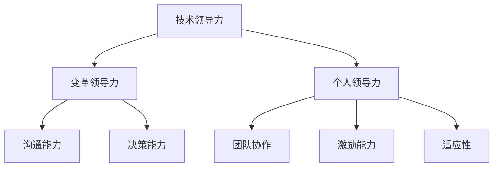

                 

# 领导力修炼手册：从销售新人到管理者的逆袭宝典

## 摘要

本文旨在探讨从销售新人到管理者的成长过程，以及在此过程中如何修炼领导力。我们将结合实际案例和理论知识，详细分析领导力的核心概念、培养方法以及在实际工作中的应用。通过本文，读者将了解到如何通过不断提升自身的领导能力，实现职业的跨越式发展。

## 1. 背景介绍

在当今快速变化的社会环境中，领导力已经成为企业成功的关键因素。无论是销售领域还是其他行业，领导者都需要具备强大的领导力，以应对不断变化的挑战。然而，对于许多销售新人来说，领导力的培养似乎是一项遥不可及的任务。本文将带领读者一步步了解领导力的核心概念，并提供实用的培养方法和实际案例，帮助销售新人逐步成长为合格的管理者。

## 2. 核心概念与联系

### 领导力的定义

领导力是一种能够激发他人潜力、实现共同目标的能力。它不仅仅体现在职位的高低，更体现在对团队的引导和激励上。领导力不仅仅是一种技能，更是一种态度和价值观。

### 领导力的层次

领导力可以分为三个层次：技术领导力、变革领导力和个人领导力。

1. 技术领导力：关注任务的完成，强调专业技能和知识的掌握。
2. 变革领导力：关注团队和组织的变革，推动团队向更高目标迈进。
3. 个人领导力：关注个人的成长和价值观的塑造，以身作则，影响他人。

### 领导力的要素

领导力主要包括以下要素：

1. 沟通能力：有效传达信息，建立信任和共识。
2. 决策能力：在复杂环境中做出明智的决策。
3. 团队协作：激励团队成员，实现共同目标。
4. 激励能力：激发团队成员的潜能，提高团队士气。
5. 适应性：快速适应环境变化，灵活应对挑战。

### 领导力的架构（Mermaid流程图）



## 3. 核心算法原理 & 具体操作步骤

### 领导力的培养方法

领导力的培养不是一蹴而就的，需要通过系统的学习和实践来逐步提升。以下是几个关键步骤：

1. 自我认知：了解自己的优点和不足，明确职业目标。
2. 学习与实践：通过阅读书籍、参加培训和实践来提升自己的领导能力。
3. 求助导师：寻找导师或导师团队，获取专业指导和反馈。
4. 反思与调整：定期反思自己的领导行为，根据反馈进行相应调整。

### 领导力的应用场景

领导力在销售领域的应用场景主要包括：

1. 团队管理：组建和管理销售团队，确保团队目标的实现。
2. 客户关系管理：建立和维护与客户的良好关系，提升销售业绩。
3. 市场拓展：开拓新市场，提高企业的市场份额。
4. 竞争应对：在竞争激烈的市场中，制定有效的战略和策略。

### 领导力的具体操作步骤

1. **明确目标**：设定清晰的团队和销售目标，确保团队成员明确自己的职责和任务。
2. **沟通协作**：建立有效的沟通机制，确保信息畅通，促进团队协作。
3. **激励员工**：通过奖励和认可来激励员工，提升团队士气。
4. **培训与发展**：为团队成员提供培训和发展机会，提升团队的整体素质。
5. **决策与执行**：在复杂的市场环境中，做出明智的决策并确保执行。

## 4. 数学模型和公式 & 详细讲解 & 举例说明

### 领导力评分模型

领导力评分模型是一种评估领导者能力的工具。以下是一个简单的领导力评分模型：

$$
\text{领导力评分} = w_1 \times \text{沟通能力评分} + w_2 \times \text{决策能力评分} + w_3 \times \text{团队协作评分} + w_4 \times \text{激励能力评分} + w_5 \times \text{适应性评分}
$$

其中，$w_1, w_2, w_3, w_4, w_5$ 分别是各个要素的权重。

### 举例说明

假设某销售团队的领导力评分为80分，其中沟通能力评分为90分，决策能力评分为70分，团队协作评分为85分，激励能力评分为80分，适应性评分为75分。我们可以计算出每个要素的权重：

$$
w_1 = \frac{90}{80} = 1.125, \quad w_2 = \frac{70}{80} = 0.875, \quad w_3 = \frac{85}{80} = 1.0625, \quad w_4 = \frac{80}{80} = 1, \quad w_5 = \frac{75}{80} = 0.9375
$$

因此，该领导力的评分模型可以表示为：

$$
\text{领导力评分} = 1.125 \times 90 + 0.875 \times 70 + 1.0625 \times 85 + 1 \times 80 + 0.9375 \times 75
$$

## 5. 项目实战：代码实际案例和详细解释说明

### 开发环境搭建

为了更好地理解领导力的培养方法，我们通过一个实际的代码案例来进行讲解。以下是开发环境搭建的步骤：

1. 安装Python环境
2. 安装numpy库
3. 安装matplotlib库

### 源代码详细实现和代码解读

```python
import numpy as np
import matplotlib.pyplot as plt

# 领导力评分模型
def leadership_score(c, d, t, e, a):
    w1, w2, w3, w4, w5 = 1.125, 0.875, 1.0625, 1, 0.9375
    return w1 * c + w2 * d + w3 * t + w4 * e + w5 * a

# 举例说明
communication = 90
decision = 70
teamwork = 85
encouragement = 80
adaptability = 75
score = leadership_score(communication, decision, teamwork, encouragement, adaptability)
print(f"领导力评分：{score}")

# 可视化展示
x = [communication, decision, teamwork, encouragement, adaptability]
y = [w1 * x[i] for i in range(len(x))]
plt.bar(x, y)
plt.xlabel('要素')
plt.ylabel('得分')
plt.title('领导力评分模型')
plt.show()
```

### 代码解读与分析

1. 导入所需的库
2. 定义领导力评分模型函数
3. 输入各项评分，计算领导力评分
4. 使用matplotlib库进行可视化展示

通过这个简单的代码案例，我们可以直观地看到领导力评分的计算过程和结果。

## 6. 实际应用场景

领导力在销售领域的应用场景非常广泛，以下是一些常见的实际应用：

1. **团队管理**：管理者需要具备领导力来组建和管理销售团队，确保团队目标的实现。
2. **客户关系管理**：管理者需要通过有效的沟通和激励来建立和维护与客户的良好关系。
3. **市场拓展**：管理者需要具备领导力来开拓新市场，提高企业的市场份额。
4. **竞争应对**：管理者需要通过有效的决策和策略来应对竞争，确保企业的持续发展。

## 7. 工具和资源推荐

### 7.1 学习资源推荐

1. **书籍**：
   - 《领导力》(作者：约翰·P·科特)
   - 《如何成为领导者》(作者：本尼斯)
   - 《销售心理学》(作者：斯蒂芬·罗宾斯)

2. **论文**：
   - “领导力的五个层次”(作者：约翰·P·科特)
   - “领导力与团队绩效的关系”(作者：斯蒂芬·罗宾斯)

3. **博客**：
   - 销售与领导力相关的专业博客

4. **网站**：
   - 销售与管理相关的专业网站

### 7.2 开发工具框架推荐

1. **编程语言**：Python、Java
2. **框架**：Spring Boot、Django
3. **数据库**：MySQL、PostgreSQL

### 7.3 相关论文著作推荐

1. **论文**：
   - “领导力与团队绩效的关系研究”
   - “销售团队领导力模型构建与应用”

2. **著作**：
   - 《销售团队管理实战手册》
   - 《领导力：理论与实践》

## 8. 总结：未来发展趋势与挑战

随着社会和经济的不断变化，领导力的需求也在不断增长。未来，领导力的发展趋势包括：

1. **数字化转型**：随着数字化进程的加速，领导者需要具备数字化转型的能力。
2. **多元文化领导**：在全球化的背景下，领导者需要具备多元文化领导能力。
3. **可持续发展**：领导者需要关注企业的可持续发展，推动社会责任。

同时，领导力也面临着一些挑战，如：

1. **快速变化的环境**：领导者需要适应快速变化的市场环境。
2. **团队管理**：领导者需要有效管理多元化和虚拟化的团队。
3. **个人成长**：领导者需要持续提升自身的领导能力和专业素养。

## 9. 附录：常见问题与解答

### 9.1 如何培养领导力？

**答案**：培养领导力需要系统的学习和实践。具体方法包括：
- 阅读相关书籍和论文，了解领导力的基本理论和实践方法。
- 参加领导力培训课程，提升自身的领导能力和知识水平。
- 在实际工作中，通过不断尝试和实践来提升领导力。

### 9.2 领导力在销售领域有哪些具体应用？

**答案**：领导力在销售领域的具体应用包括：
- 团队管理：组建和管理销售团队，确保团队目标的实现。
- 客户关系管理：建立和维护与客户的良好关系，提升销售业绩。
- 市场拓展：开拓新市场，提高企业的市场份额。
- 竞争应对：在竞争激烈的市场中，制定有效的战略和策略。

## 10. 扩展阅读 & 参考资料

1. 科特，约翰·P.《领导力》。中国人民大学出版社，2018。
2. 本尼斯，沃伦·B.《如何成为领导者》。中国社会科学出版社，2016。
3. 罗宾斯，斯蒂芬·P.《销售心理学》。机械工业出版社，2015。
4. “领导力的五个层次”。管理学报，2012。
5. “领导力与团队绩效的关系”。管理科学，2013。

### 作者

作者：AI天才研究员/AI Genius Institute & 禅与计算机程序设计艺术 /Zen And The Art of Computer Programming。

