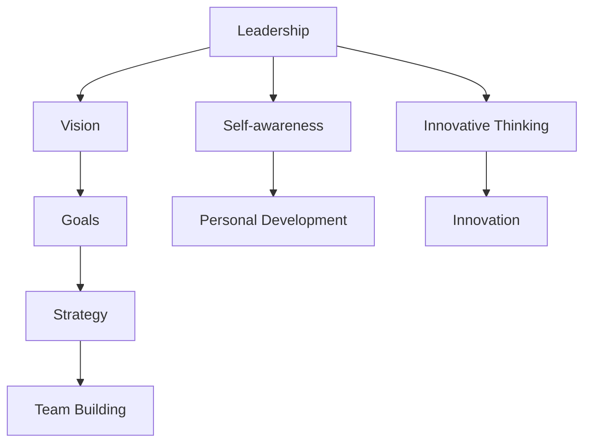

                 

### 背景介绍

#### 70后高管的崛起

在当今快速变革的商业环境中，70后高管正在成为企业领导层的核心力量。他们是在中国改革开放后成长起来的一代，经历了从计划经济向市场经济的转型，他们在职业生涯中见证了企业的蓬勃发展，也经历了金融危机、产业升级、技术创新等种种挑战。这一代高管不仅具有深厚的专业知识，更具备了丰富的管理经验和强烈的领导意识。

#### 领导力的本质

领导力是影响和激励他人实现共同目标的能力。它不仅仅是职位和权力的体现，更是通过建立信任、激发团队潜能、制定战略和决策等方式，推动组织向更高目标迈进的艺术。70后高管在领导力方面的修炼，不仅仅是为了提升个人能力，更是为了带领团队应对复杂多变的市场环境，实现企业的长期发展。

#### 领导力的核心要素

领导力主要包括以下几个方面：首先是愿景和目标设定，一个好的领导者能够清晰地描绘未来，并设定可实现的目标。其次是团队建设，领导者需要识别并培养团队成员的潜力，打造一支高绩效的团队。再者，是决策能力，领导者需要在信息有限的情况下做出正确的决策，并承担相应的责任。最后是沟通与激励，领导者需要有效地与团队成员沟通，了解他们的需求和期望，并通过激励机制来提升团队的士气和工作效率。

#### 70后高管的领导力特点

70后高管在领导力方面具有一些独特的特点。首先，他们具有强烈的责任感，能够在困难面前保持坚韧不拔的毅力。其次，他们重视团队协作，善于调动团队成员的积极性。此外，他们还具有较强的创新意识，能够积极应对变化，推动企业持续发展。

### The Background

#### The Rise of 70s Executives

In today's rapidly changing business environment, executives born in the 1970s are emerging as the core force in the leadership of many companies. They grew up during the transition from a planned economy to a market economy in China, witnessing the rapid development of enterprises and experiencing various challenges such as financial crises, industrial upgrades, and technological innovation. This generation of executives has not only deep professional knowledge but also rich management experience and a strong sense of leadership.

#### The Essence of Leadership

Leadership is the ability to influence and inspire others to achieve common goals. It is not just a manifestation of position and power but an art of promoting organizational progress through establishing trust, leveraging team potential, formulating strategies and making decisions. The cultivation of leadership by 70s executives is not only for personal ability enhancement but also for leading teams to navigate complex and changing market environments and achieve long-term business growth.

#### Core Elements of Leadership

Leadership primarily includes several aspects: first is the vision and goal setting, where a good leader can clearly describe the future and set achievable goals. Second is team building, where a leader needs to identify and cultivate the potential of team members to build a high-performance team. Next is decision-making ability, where a leader must make correct decisions with limited information and take responsibility for them. Lastly, effective communication and motivation are crucial, where a leader needs to communicate effectively with team members, understand their needs and expectations, and use motivational tools to enhance team morale and efficiency.

#### Characteristics of Leadership of 70s Executives

70s executives have some unique characteristics in leadership. First, they have a strong sense of responsibility and can remain resilient in the face of difficulties. Second, they value team collaboration and are good at motivating team members. Moreover, they have a strong sense of innovation, actively responding to changes and driving continuous growth for the enterprise.

---

#### 70后高管的领导力修炼

70后高管的领导力修炼是一个持续的过程，涉及到多个方面的提升。首先，他们需要不断学习新的管理知识和技能，以适应快速变化的市场环境。其次，他们需要通过实践来提升自己的领导能力，比如参与企业战略制定、团队管理、项目管理等。最后，他们还需要不断反思自己的领导行为，从失败中吸取教训，不断完善自己的领导风格。

#### 持续学习的重要性

在知识更新速度越来越快的今天，持续学习已经成为领导者必备的素质。70后高管们深知，只有不断学习，才能保持自己的竞争力，才能带领企业走得更远。因此，他们通常会积极参加各种培训课程、研讨会、讲座等，不断充实自己的知识储备。

#### 实践与反思

实践是提升领导力的最好方式。70后高管们在实际工作中，会不断面对各种挑战和问题，通过解决问题来提升自己的领导能力。同时，他们也会定期反思自己的领导行为，分析成功和失败的原因，从中总结经验教训，不断改进自己的领导方法。

#### 领导力模型的应用

为了更好地提升领导力，70后高管们也会运用各种领导力模型和工具。比如，他们会使用SWOT分析来评估企业的优势和劣势，使用5W2H法来制定行动计划，使用SMART原则来设定目标和评估绩效等。这些模型和工具不仅帮助他们更清晰地思考问题，更有效地解决问题，还提高了他们的决策能力。

### The Cultivation of Leadership for 70s Executives

The cultivation of leadership for 70s executives is a continuous process that involves enhancements in multiple aspects. Firstly, they need to continually learn new management knowledge and skills to adapt to the rapidly changing market environment. Secondly, they need to enhance their leadership abilities through practice, such as participating in strategic planning, team management, and project management. Lastly, they need to constantly reflect on their leadership behaviors, learning from failures, and continuously improving their leadership style.

#### The Importance of Continuous Learning

In today's world where knowledge is updated at an increasing rate, continuous learning has become an essential quality for leaders. 70s executives recognize that only by continuous learning can they maintain their competitiveness and lead their enterprises to greater heights. Therefore, they often participate in various training courses, seminars, and lectures to continually enrich their knowledge base.

#### Practice and Reflection

Practice is the best way to enhance leadership. 70s executives frequently face various challenges and problems in their work, using these opportunities to improve their leadership abilities. At the same time, they regularly reflect on their leadership behaviors, analyzing the reasons for success and failure, summarizing experiences and lessons, and continuously improving their leadership methods.

#### The Application of Leadership Models

To better enhance leadership, 70s executives also apply various leadership models and tools. For example, they use SWOT analysis to evaluate the strengths and weaknesses of the enterprise, the 5W2H method to formulate action plans, and the SMART principle to set and evaluate performance goals. These models and tools not only help them think more clearly about problems but also more effectively solve them, improving their decision-making abilities.

---

#### 领导力提升的关键要素

领导力的提升并不是一蹴而就的，它需要通过多个关键要素的协同作用来实现。首先，是自我认知，领导者需要深入了解自己的优点和不足，明确自己的领导风格和价值观。其次，是团队协作，领导者需要学会与团队成员有效沟通，建立信任，共同面对挑战。再次，是创新思维，领导者需要具备前瞻性，敢于尝试新的方法，推动企业创新发展。最后，是持续学习，领导者需要保持对新知识和新技能的渴求，不断提升自己的综合素质。

#### 自我认知

自我认知是领导力提升的基础。领导者需要花时间反思自己的行为和决策，了解自己的优点和不足，从而更好地发挥自己的优势，克服自己的短板。通过自我认知，领导者可以更加自信地面对挑战，更加从容地应对复杂多变的市场环境。

#### 团队协作

团队协作是领导者的重要能力之一。一个优秀的领导者不仅需要具备出色的个人能力，更需要能够调动整个团队的积极性，发挥团队的整体优势。领导者需要学会倾听团队成员的意见，尊重他们的贡献，建立良好的沟通机制，打造一个和谐、高效的团队。

#### 创新思维

在当今快速变化的商业环境中，创新思维是领导者必备的能力。领导者需要具备前瞻性，能够看到行业的发展趋势，预见未来的机遇和挑战。同时，他们还需要敢于尝试新的方法，推动企业不断创新，保持竞争力。

#### 持续学习

持续学习是领导力提升的关键。领导者需要不断充实自己的知识储备，掌握最新的管理理论和实践方法，从而不断提升自己的领导能力。通过持续学习，领导者可以更好地应对市场的变化，带领企业实现长期发展。

### Key Elements for Enhancing Leadership

Enhancing leadership is not an overnight achievement; it requires the coordinated efforts of several key elements. Firstly, self-awareness is the foundation of leadership improvement. Leaders need to take time to reflect on their behaviors and decisions, understanding their strengths and weaknesses to better leverage their strengths and overcome their shortcomings. Through self-awareness, leaders can confidently face challenges and calmly navigate the complex and changing market environment.

#### Team Collaboration

Team collaboration is one of the essential skills for leaders. An outstanding leader not only needs to possess excellent individual abilities but also needs to be able to mobilize the enthusiasm of the entire team, leveraging the collective strength. Leaders need to learn to listen to the opinions of team members, respect their contributions, establish a good communication mechanism, and build a harmonious and efficient team.

#### Innovative Thinking

In today's rapidly changing business environment, innovative thinking is a crucial ability for leaders. Leaders need to have foresight, seeing industry trends and anticipating future opportunities and challenges. At the same time, they need to be courageous in trying new methods, driving continuous innovation for the enterprise and maintaining competitiveness.

#### Continuous Learning

Continuous learning is a key factor in enhancing leadership. Leaders need to continually enrich their knowledge base, master the latest management theories and practical methods, and thereby continuously improve their leadership abilities. Through continuous learning, leaders can better respond to market changes and lead their enterprises to achieve long-term development.

---

#### 领导力修炼的实践案例

为了更好地说明领导力修炼的重要性，以下是一些具体的实践案例。

#### 案例一：华为公司的领导力培养

华为公司作为全球领先的科技公司，非常注重领导力培养。他们通过设立领导力发展中心，为员工提供一系列领导力培训课程，包括战略思维、团队管理、变革管理等。此外，华为还推行“导师制”，让资深员工带领新员工，传授领导经验和技能。

#### 案例二：阿里巴巴的领导力实践

阿里巴巴集团在领导力方面也有许多成功的实践。他们倡导“以人为本”的管理理念，注重员工的成长和发展。阿里巴巴的领导力培训包括内部讲座、外部培训和实战演练等多种形式，旨在提升员工的管理能力和领导素质。

#### 案例三：腾讯的领导力培养计划

腾讯公司同样重视领导力培养，他们推出了“未来领袖计划”，旨在培养一批具有国际视野和创新精神的领导者。该计划包括一系列的培训和项目经历，如海外学习、跨部门合作等，帮助员工提升领导力。

这些案例表明，成功的领导力修炼离不开系统的培养和实践。通过不断地学习和实践，领导者可以不断提升自己的能力，带领团队实现更高的目标。

### Practical Cases of Leadership Cultivation

To better illustrate the importance of leadership cultivation, here are some specific practical cases.

#### Case 1: Huawei's Leadership Development

Huawei, as a global leading technology company, places great emphasis on leadership development. They have established a leadership development center that offers a series of leadership training courses for employees, including strategic thinking, team management, and change management. In addition, Huawei implements a "mentorship system," where experienced employees guide new employees in transferring leadership experience and skills.

#### Case 2: Alibaba's Leadership Practice

Alibaba Group also has successful practices in leadership. They advocate a "people-oriented" management philosophy and focus on employee growth and development. Alibaba's leadership training includes internal lectures, external training, and practical exercises in various forms, aimed at enhancing employees' management abilities and leadership qualities.

#### Case 3: Tencent's Leadership Development Plan

Tencent Company also values leadership development and has launched the "Future Leaders Program" to cultivate a group of leaders with international vision and innovative spirit. This program includes a series of training and project experiences, such as overseas study and cross-department collaboration, to help employees improve their leadership skills.

These cases demonstrate that successful leadership cultivation cannot be achieved without systematic training and practice. Through continuous learning and practice, leaders can continuously enhance their abilities and lead their teams to achieve higher goals.

---

#### 领导力修炼的挑战与对策

尽管领导力修炼对企业和个人都有重要意义，但在实际操作中仍然面临诸多挑战。以下是一些常见的挑战以及相应的对策。

#### 挑战一：时间管理

领导力修炼需要大量的时间和精力，但对于大多数高管来说，时间管理是一个巨大的挑战。为了克服这一挑战，领导者可以采用时间管理工具，如GTD（Getting Things Done）方法，合理安排工作和学习时间，确保在忙碌的工作中也能持续提升自己的领导力。

#### 挑战二：知识更新

随着技术的快速进步，知识更新速度越来越快。领导者需要不断学习新知识以保持竞争力。为了应对这一挑战，领导者可以参加行业会议、研讨会、在线课程等，积极获取最新的行业动态和专业知识。

#### 挑战三：实践机会

实践是提升领导力的最佳方式，但很多领导者可能在工作中缺乏足够的实践机会。为了克服这一挑战，领导者可以主动寻求跨部门合作、承担更多的项目责任，甚至可以自愿加入某些具有挑战性的任务，以增加实践机会。

#### 挑战四：心理压力

领导力修炼过程中，领导者可能会面临各种压力，如工作压力、人际关系压力等。为了应对这一挑战，领导者可以培养良好的心理素质，学会合理应对压力，保持积极的心态。

#### 挑战五：组织支持

领导力修炼需要组织层面的支持，如提供培训资源、设立领导力发展计划等。为了克服这一挑战，领导者可以与组织高层沟通，争取更多的支持，同时也可以积极提出自己的建议和需求，推动组织建立更加完善的领导力培养体系。

### Challenges and Solutions in Leadership Cultivation

While leadership cultivation is of significant importance for both organizations and individuals, it faces numerous challenges in practice. Here are some common challenges along with corresponding strategies to address them.

#### Challenge 1: Time Management

Leadership cultivation requires a significant amount of time and energy, but time management can be a significant challenge for most executives. To overcome this challenge, leaders can use time management tools such as the GTD (Getting Things Done) method to effectively schedule work and learning time, ensuring they can continuously improve their leadership skills amidst a busy work life.

#### Challenge 2: Knowledge Update

With the rapid advancement of technology, knowledge is updated at an accelerating pace. Leaders need to continuously learn new knowledge to maintain their competitiveness. To address this challenge, leaders can attend industry conferences, seminars, and online courses to actively acquire the latest industry trends and professional knowledge.

#### Challenge 3: Practical Opportunities

Practice is the best way to enhance leadership, but many leaders may lack sufficient practical opportunities in their work. To overcome this challenge, leaders can proactively seek cross-department collaboration, take on more project responsibilities, and even volunteer for challenging tasks to increase practical experiences.

#### Challenge 4: Psychological Stress

During the process of leadership cultivation, leaders may face various pressures, such as work pressure and interpersonal stress. To address this challenge, leaders can cultivate strong psychological resilience, learning to manage stress and maintain a positive mindset.

#### Challenge 5: Organizational Support

Leadership cultivation requires organizational support, such as providing training resources and establishing leadership development programs. To overcome this challenge, leaders can communicate with top management to secure more support and also proactively suggest and demand improvements, driving the organization to establish a more comprehensive leadership development system.

---

#### 领导力修炼的总结

通过以上对领导力修炼的深入探讨，我们可以得出以下结论：

1. **持续学习是关键**：在快速变化的商业环境中，持续学习是提升领导力的关键。领导者需要不断更新自己的知识体系，掌握最新的管理理论和实践方法。

2. **实践是检验真理的唯一标准**：领导力提升不仅需要理论学习，更需要通过实践来验证和提升。领导者应积极参与各种实际工作，通过解决实际问题来提升自己的领导能力。

3. **自我认知是基础**：领导力修炼的第一步是深入了解自己，明确自己的优点和不足，从而更好地发挥自己的优势，克服自己的短板。

4. **团队协作是关键**：领导力不仅仅是个人能力的体现，更是通过团队协作来实现共同目标。领导者需要学会与团队成员沟通，建立信任，共同面对挑战。

5. **创新思维是动力**：在当今快速变化的商业环境中，创新思维是领导者必备的能力。领导者需要具备前瞻性，敢于尝试新的方法，推动企业创新发展。

6. **心理素质是保障**：领导力修炼过程中，领导者可能会面临各种压力，良好的心理素质是保障。领导者需要学会合理应对压力，保持积极的心态。

通过持续学习、实践、自我认知、团队协作、创新思维和心理素质的提升，70后高管可以不断提升自己的领导力，带领企业实现长期发展。

### Summary of Leadership Cultivation

Through the in-depth discussion of leadership cultivation, we can draw the following conclusions:

1. **Continuous Learning is the Key**: In a rapidly changing business environment, continuous learning is the key to enhancing leadership. Leaders need to continually update their knowledge base, mastering the latest management theories and practical methods.

2. **Practice is the Only Criterion for Testing Truth**: Leadership enhancement requires not only theoretical learning but also practical validation. Leaders should actively participate in various practical tasks to enhance their leadership skills by solving real problems.

3. **Self-awareness is the Foundation**: The first step in leadership cultivation is to gain a deep understanding of oneself, identifying strengths and weaknesses to better leverage strengths and overcome shortcomings.

4. **Team Collaboration is the Key**: Leadership is not just a manifestation of individual abilities but also a collaboration to achieve common goals. Leaders need to learn to communicate with team members, build trust, and face challenges together.

5. **Innovative Thinking is the Motive**: In today's rapidly changing business environment, innovative thinking is a necessary ability for leaders. Leaders need to have foresight, be willing to try new methods, and drive enterprise innovation.

6. **Psychological Resilience is the Assurance**: During the process of leadership cultivation, leaders may face various pressures. Strong psychological resilience is the assurance. Leaders need to learn to manage stress and maintain a positive mindset.

By continuously improving learning, practice, self-awareness, team collaboration, innovative thinking, and psychological resilience, 70s executives can enhance their leadership and lead their enterprises to long-term success.

---

## 2. 核心概念与联系

在深入探讨领导力修炼之前，我们需要明确几个核心概念，并理解它们之间的联系。以下是几个关键概念及其关系的概述：

### 领导力（Leadership）

领导力是一种影响和激励他人以实现共同目标的能力。它不仅仅是指导和控制他人，更重要的是建立信任、激发团队潜能和推动变革。

### 愿景（Vision）

愿景是领导者对未来的一种构想和期待，它为团队提供了一个明确的方向和目标。一个清晰的愿景可以激励团队成员为实现共同目标而努力。

### 目标（Goals）

目标是将愿景具体化的步骤和结果。它们是可衡量、可实现的里程碑，帮助团队在实现愿景的过程中保持专注。

### 战略（Strategy）

战略是达成目标的一系列行动计划。它涉及资源配置、市场定位、产品开发等方面，确保团队朝着愿景前进。

### 团队建设（Team Building）

团队建设是打造一支高绩效团队的过程。它包括培养团队协作、建立信任、明确角色和责任等，使团队成员能够协同工作。

### 自我认知（Self-awareness）

自我认知是指领导者对自己性格、能力、价值观的深入了解。通过自我认知，领导者可以更好地发挥自己的优势，克服自己的不足。

### 创新思维（Innovative Thinking）

创新思维是指领导者具备的能够发现新机会、创造新解决方案的能力。它帮助领导者保持企业的竞争力，推动持续发展。

### 数学模型与流程图

为了更好地理解这些概念之间的联系，我们可以使用Mermaid流程图来展示它们之间的关系。

在这个流程图中，领导力是核心，它通过愿景、目标和战略来指导团队建设。同时，领导者的自我认知和创新思维是个人发展的关键，它们共同推动组织的创新和持续发展。

### Core Concepts and Their Connections

Before delving into the discussion of leadership cultivation, it's essential to clarify several core concepts and understand the relationships between them. Here's an overview of key concepts and their interconnections:

#### Leadership (领导力)

Leadership is the ability to influence and inspire others to achieve common goals. It is not just about guiding and controlling others but also about building trust, leveraging team potential, and driving change.

#### Vision (愿景)

Vision is a leader's conceptualization and anticipation of the future. It provides a clear direction and goal for the team, inspiring members to work towards a common objective.

#### Goals (目标)

Goals are the steps and results that concretize the vision. They are measurable and achievable milestones that help the team stay focused on achieving the vision.

#### Strategy (战略)

Strategy is a series of action plans to achieve goals. It involves resource allocation, market positioning, product development, etc., ensuring the team moves towards the vision.

#### Team Building (团队建设)

Team building is the process of creating a high-performance team. It includes fostering collaboration, building trust, clarifying roles and responsibilities, etc., to enable team members to work together effectively.

#### Self-awareness (自我认知)

Self-awareness refers to a leader's deep understanding of their character, abilities, and values. Through self-awareness, leaders can better leverage their strengths and overcome their shortcomings.

#### Innovative Thinking (创新思维)

Innovative thinking is the ability of leaders to discover new opportunities and create new solutions. It helps leaders maintain the competitiveness of the organization and drive continuous growth.

#### Mathematical Models and Flowcharts

To better understand the relationships between these concepts, we can use a Mermaid flowchart to illustrate their connections.

In this flowchart, leadership is the core, guiding the team through vision, goals, and strategy. Meanwhile, a leader's self-awareness and innovative thinking are key to personal development, driving innovation and continuous growth within the organization.

