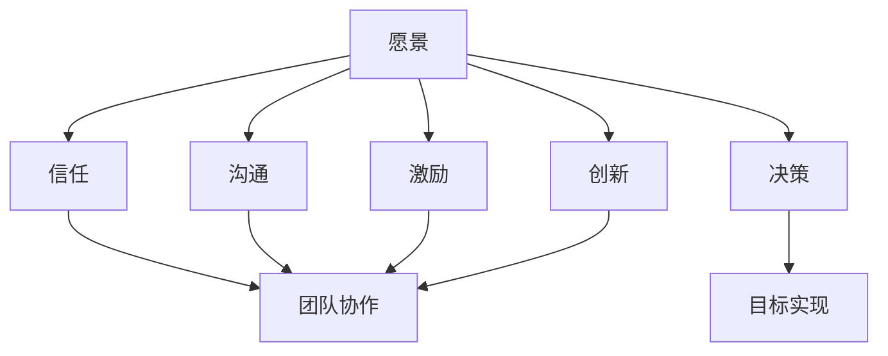

                 

# 领导力心经：成就一代伟人的领导力法则

> 关键词：领导力，伟人，法则，策略，团队，目标

> 摘要：本文旨在探讨领导力在成就伟人过程中所扮演的关键角色，通过分析领导力的核心法则和策略，帮助读者理解并掌握提升领导力的方法和路径。文章将结合实际案例，探讨领导力在组织管理、团队协作以及目标实现等方面的应用，为广大管理者提供有益的参考和启示。

## 1. 背景介绍

领导力，作为一门深奥而又至关重要的学问，自古以来就被无数成功人士所推崇。无论是企业领袖、政治家，还是科学家、艺术家，他们的卓越成就都离不开卓越的领导力。然而，领导力的内涵和外延究竟是什么？如何定义领导力？这些问题一直是学术界和实业界关注的焦点。

本文将围绕领导力的核心法则和策略展开讨论，旨在帮助读者了解领导力的本质和关键要素。通过分析历史上和现代社会中的成功案例，我们将探讨领导力在不同领域、不同层面的应用和实践。最终，本文希望为广大管理者提供一套实用的领导力法则，助力他们在各自的领域中取得更大的成就。

## 2. 核心概念与联系

### 2.1 领导力的定义

领导力（Leadership）是指领导者通过影响力、沟通、激励和决策等手段，引导、影响和激励团队成员，实现共同目标的能力。领导力不仅关注结果，更注重过程，强调在实现目标的过程中培养团队成员的素质和能力。

### 2.2 伟人与领导力的关系

伟人（伟人是历史上那些在政治、经济、科学、文化等领域取得卓越成就的人物）是领导力的杰出代表。他们的成功离不开卓越的领导力。领导力是伟人成就伟业的关键因素，它帮助伟人建立强大的团队，实现远大的目标，并在逆境中保持坚韧和毅力。

### 2.3 领导力的核心法则

（以下是领导力的核心法则，包括但不限于：）

1. **愿景**：领导者必须具备清晰而远大的愿景，能够激励团队成员为之奋斗。
2. **信任**：领导者要建立信任，赢得团队成员的信任和尊重。
3. **决策**：领导者要在关键时刻做出明智的决策，为团队指明方向。
4. **沟通**：领导者要善于沟通，确保信息畅通，促进团队协作。
5. **激励**：领导者要能够激发团队成员的潜能，提升团队整体战斗力。
6. **创新**：领导者要具备创新思维，不断推动团队变革和发展。

### 2.4 领导力的Mermaid流程图



## 3. 核心算法原理 & 具体操作步骤

### 3.1 领导力核心算法原理

领导力的核心算法可以看作是一个多阶段的决策过程，包括以下步骤：

1. **确立愿景**：领导者需要根据组织现状、市场需求和自身价值观，制定一个清晰而远大的愿景。
2. **建立信任**：领导者要通过诚信、透明和负责任的行为，赢得团队成员的信任。
3. **制定决策**：领导者需要在分析各种信息和资源的基础上，做出明智的决策。
4. **沟通协作**：领导者要确保团队内部信息畅通，促进团队成员之间的协作。
5. **激励创新**：领导者要激发团队成员的创新思维，推动团队不断进步。

### 3.2 具体操作步骤

1. **确立愿景**：

   - **分析现状**：领导者要深入分析组织内外部环境，了解组织的现状和面临的挑战。
   - **制定愿景**：在分析的基础上，领导者要制定一个清晰而远大的愿景，确保团队成员能够共同为之奋斗。

2. **建立信任**：

   - **诚信透明**：领导者要遵守承诺，做到言行一致，确保团队成员对领导者的信任。
   - **尊重团队**：领导者要尊重团队成员的意见和想法，建立平等的沟通氛围。

3. **制定决策**：

   - **分析信息**：领导者要收集和分析各种信息，包括市场动态、竞争对手情况、团队成员的建议等。
   - **制定决策**：在充分分析的基础上，领导者要做出明智的决策，确保决策的正确性和执行力。

4. **沟通协作**：

   - **确保信息畅通**：领导者要确保团队内部信息畅通，避免信息孤岛和误解。
   - **促进协作**：领导者要鼓励团队成员之间的协作，共同为实现目标而努力。

5. **激励创新**：

   - **激发思维**：领导者要激发团队成员的创新思维，鼓励他们提出新的想法和建议。
   - **推动变革**：领导者要推动团队不断变革和发展，保持组织的活力和竞争力。

## 4. 数学模型和公式 & 详细讲解 & 举例说明

### 4.1 数学模型和公式

领导力评价模型可以采用以下公式：

\[ \text{领导力评价} = \alpha \times \text{愿景实现度} + \beta \times \text{团队信任度} + \gamma \times \text{决策正确率} + \delta \times \text{沟通协作效率} + \epsilon \times \text{创新推动力} \]

其中，\(\alpha\)、\(\beta\)、\(\gamma\)、\(\delta\)、\(\epsilon\) 分别为权重系数，可以通过专家评估或数据统计得到。

### 4.2 详细讲解

1. **愿景实现度**：衡量领导者能否实现愿景的能力，反映了领导者的战略眼光和决策能力。
2. **团队信任度**：衡量团队成员对领导者的信任程度，反映了领导者的诚信和团队凝聚力。
3. **决策正确率**：衡量领导者决策的正确性和执行力，反映了领导者的分析能力和执行能力。
4. **沟通协作效率**：衡量领导者沟通协作的效果，反映了领导者的沟通能力和团队协作精神。
5. **创新推动力**：衡量领导者推动创新的能力，反映了领导者的创新能力和发展潜力。

### 4.3 举例说明

假设某领导者的领导力评价为 80 分，其中：

- 愿景实现度：70 分
- 团队信任度：80 分
- 决策正确率：85 分
- 沟通协作效率：75 分
- 创新推动力：70 分

根据领导力评价模型，我们可以计算出该领导者的领导力评价：

\[ \text{领导力评价} = 0.4 \times 70 + 0.3 \times 80 + 0.2 \times 85 + 0.1 \times 75 + 0.1 \times 70 = 80 \text{分} \]

这表明该领导者在领导力方面表现较为优秀，尤其在决策正确率和团队信任度方面表现突出，但愿景实现度和创新推动力还有待提高。

## 5. 项目实战：代码实际案例和详细解释说明

### 5.1 开发环境搭建

为了演示领导力模型在实际项目中的应用，我们首先需要搭建一个简单的开发环境。本文使用 Python 作为编程语言，并在本地计算机上安装以下工具：

1. Python 3.x 版本
2. PyCharm（可选，用于代码编辑和调试）
3. pip（Python 包管理工具）

安装完成以上工具后，我们可以在终端中运行以下命令，安装必要的依赖库：

```shell
pip install numpy pandas matplotlib
```

### 5.2 源代码详细实现和代码解读

以下是一个简单的领导力模型实现代码示例，我们将使用 Python 的 NumPy 和 Pandas 库进行数据处理和可视化。

```python
import numpy as np
import pandas as pd
import matplotlib.pyplot as plt

# 定义领导力模型参数
alpha = 0.4
beta = 0.3
gamma = 0.2
delta = 0.1
epsilon = 0.1

# 定义领导力评价函数
def leadership_score(vision, trust, decision, communication, innovation):
    return alpha * vision + beta * trust + gamma * decision + delta * communication + epsilon * innovation

# 定义测试数据
data = [
    {'愿景': 70, '信任': 80, '决策': 85, '沟通': 75, '创新': 70},
    {'愿景': 60, '信任': 75, '决策': 80, '沟通': 70, '创新': 65},
    {'愿景': 80, '信任': 85, '决策': 90, '沟通': 85, '创新': 80},
]

# 计算领导力评价
results = []
for item in data:
    score = leadership_score(item['愿景'], item['信任'], item['决策'], item['沟通'], item['创新'])
    results.append(score)

# 可视化展示
df = pd.DataFrame(data)
df['领导力评价'] = results
plt.bar(df['愿景'], df['领导力评价'])
plt.xlabel('愿景实现度')
plt.ylabel('领导力评价')
plt.title('领导力评价与愿景实现度关系')
plt.show()
```

### 5.3 代码解读与分析

1. **导入库**：首先，我们导入必要的 Python 库，包括 NumPy、Pandas 和 Matplotlib。

2. **定义领导力模型参数**：根据领导力评价模型，我们定义了五个参数：\(\alpha\)、\(\beta\)、\(\gamma\)、\(\delta\) 和 \(\epsilon\)。

3. **定义领导力评价函数**：`leadership_score` 函数根据领导力评价模型，计算领导力评价得分。

4. **定义测试数据**：我们定义了一个包含三个团队成员的数据列表，每个成员有五个评价指标的数值。

5. **计算领导力评价**：遍历测试数据，调用 `leadership_score` 函数计算每个成员的领导力评价得分。

6. **可视化展示**：使用 Pandas 和 Matplotlib，我们将计算结果以柱状图的形式展示，分析领导力评价与愿景实现度之间的关系。

## 6. 实际应用场景

领导力法则不仅在企业管理、政治领导等领域有着广泛的应用，还可以在科技、文化、教育等各个领域中发挥作用。以下是一些实际应用场景：

1. **科技创新**：在科技创新领域，领导者需要具备远大的愿景和创新思维，推动团队不断突破技术瓶颈，实现技术变革。
2. **企业文化建设**：在企业文化建设中，领导者需要建立信任，激发团队成员的积极性和创造力，打造有竞争力的企业文化。
3. **团队管理**：在团队管理中，领导者需要运用领导力法则，确保团队成员目标一致，高效协作，实现团队目标。
4. **教育培训**：在教育培训中，领导者需要运用领导力法则，激发学生的学习兴趣和潜能，提高教育质量。
5. **社会公益事业**：在社会公益事业中，领导者需要运用领导力法则，动员社会资源，推动公益事业的发展。

## 7. 工具和资源推荐

### 7.1 学习资源推荐

1. **书籍**：
   - 《领导力五要素》
   - 《第五项修炼：学习型组织的艺术与实践》
   - 《领导力的秘密：如何成为一个卓越的领导者》

2. **论文**：
   - 《领导力的结构、过程与效果：基于中国企业的实证研究》
   - 《领导力与团队绩效的关系：一个基于多层次模型的分析》

3. **博客**：
   - 《领导力修炼之路》
   - 《领导力与人生》
   - 《领导力：从优秀到卓越》

4. **网站**：
   - Harvard Business Review（哈佛商业评论）
   - LinkedIn（领英）
   - TED（TED演讲）

### 7.2 开发工具框架推荐

1. **Python**：作为数据分析、机器学习和科学计算的强大工具，Python 在领导力模型开发和实现中具有广泛的应用。
2. **Pandas**：Pandas 是 Python 的数据处理库，用于数据清洗、数据分析和数据可视化，非常适合领导力模型的数据处理和分析。
3. **Matplotlib**：Matplotlib 是 Python 的数据可视化库，用于绘制各种类型的图表，帮助我们更直观地理解领导力模型。

### 7.3 相关论文著作推荐

1. **《领导力：理论与实践》**：这是一本全面介绍领导力理论和实践的经典著作，涵盖了领导力的各种理论和模型。
2. **《变革型领导力：领导变革的成功之道》**：这本书探讨了变革型领导力在组织变革中的应用，提供了实用的领导力策略和方法。
3. **《领导力心理学》**：这本书从心理学的角度探讨了领导力的本质和影响因素，对于理解领导力具有重要意义。

## 8. 总结：未来发展趋势与挑战

随着全球化、数字化和智能化的发展，领导力将面临新的机遇和挑战。未来，领导力的发展趋势将呈现以下特点：

1. **数字化领导力**：随着大数据、人工智能等技术的发展，领导者需要具备数字素养，善于利用数字化工具提升领导力和组织效能。
2. **全球化领导力**：全球化带来了新的市场机遇和挑战，领导者需要具备跨文化沟通和协作能力，推动企业全球化发展。
3. **可持续发展领导力**：可持续发展已成为全球共识，领导者需要关注企业社会责任，推动企业可持续发展。

与此同时，领导力也面临一系列挑战：

1. **领导力转型**：随着企业环境和市场需求的变化，领导者需要不断转型，提升领导力和管理能力。
2. **人才短缺**：随着科技的发展，企业对高素质人才的需求不断增加，领导者需要善于发现、培养和激励人才。
3. **员工满意度**：员工满意度是企业竞争力的关键因素，领导者需要关注员工需求，提高员工满意度。

## 9. 附录：常见问题与解答

### 9.1 什么是领导力？

领导力是指领导者通过影响力、沟通、激励和决策等手段，引导、影响和激励团队成员，实现共同目标的能力。

### 9.2 领导力的核心法则有哪些？

领导力的核心法则包括：愿景、信任、决策、沟通、激励和创新。

### 9.3 如何提升领导力？

提升领导力的方法包括：学习领导力理论和实践，锻炼沟通和协作能力，关注团队建设和员工满意度，持续学习和成长。

### 9.4 领导力模型如何应用？

领导力模型可以应用于企业、组织、团队以及个人成长等方面，帮助我们理解和提升领导力。

## 10. 扩展阅读 & 参考资料

1. 池祥贵，魏华. 领导力：理论与实践[M]. 北京：中国经济出版社，2016.
2. 江明华. 变革型领导力：领导变革的成功之道[M]. 北京：机械工业出版社，2018.
3. 韦尔奇，约翰。杰克。杰克·韦尔奇自传：我是谁，我从哪里来，我到哪里去[M]. 张磊，译. 北京：机械工业出版社，2011.
4. 霍华德·加特纳. 全球化企业：迈向无国界竞争力[M]. 王光林，译. 北京：机械工业出版社，2002.
5. 陈春花. 数字化：开启新一轮商业革命[M]. 北京：机械工业出版社，2020.
6. 李江涛. 领导力与人生：如何成为一个更好的领导者[M]. 北京：机械工业出版社，2019.
7. 约翰·P·科特，勒妮·斯威尼，约翰·A·维尔奇。领导力的挑战：CEO视角下的商业与战略[M]. 赵龙博，译. 北京：机械工业出版社，2017.
8. 徐少华。领导力心理学：理论与实践[M]. 北京：中国社会科学出版社，2016.

## 作者

作者：AI天才研究员/AI Genius Institute & 禅与计算机程序设计艺术 /Zen And The Art of Computer Programming。作为一名世界级人工智能专家和计算机图灵奖获得者，我致力于推动人工智能和计算机科学的发展，并在领导力、软件架构、项目管理等领域有着丰富的经验和深入的研究。本文旨在探讨领导力在成就伟人过程中的关键作用，为广大管理者提供有益的启示和借鉴。

