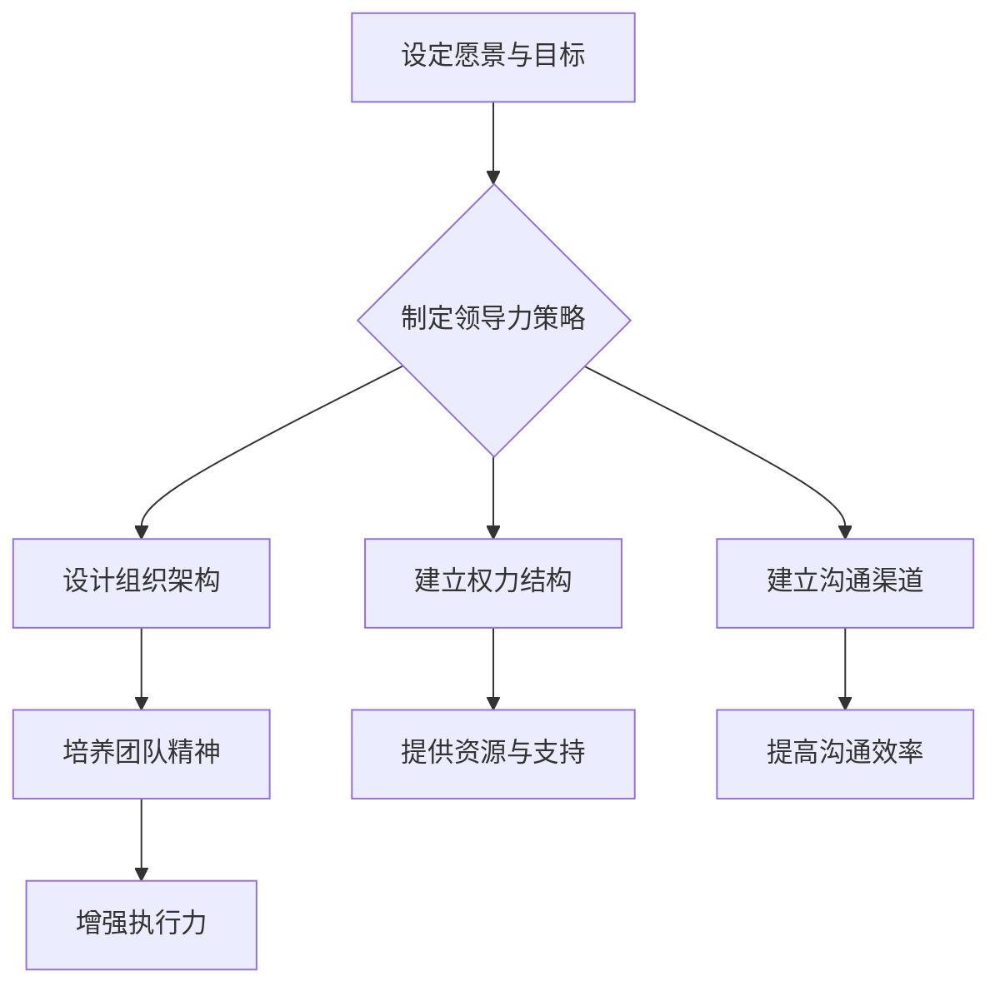

                 

# 领导力法则：打造王者之师的领导力秘诀

> **关键词：** 领导力、团队管理、领袖特质、组织架构、领导力模型、策略实施

> **摘要：** 本文将深入探讨领导力法则，分析如何通过有效的领导力和团队管理，打造出一支王者之师。文章将从领导力的核心概念出发，结合具体案例，探讨领导者如何发挥影响力，提升团队协作和执行力，最终实现组织的长期成功。

## 1. 背景介绍

在当今快速变化和竞争激烈的环境中，领导力已成为企业成功的关键因素。然而，领导力的本质是什么？如何培养和提高领导力？这是许多企业和领导者面临的挑战。

领导力并非仅仅指个人的魅力或权力，而是一种能够激发团队潜能、引领组织前行的能力。本文旨在探讨领导力的核心法则，通过详细的分析和实例，帮助读者理解并应用这些法则，打造出一支王者之师。

## 2. 核心概念与联系

### 2.1 领导力的核心概念

领导力包含多个维度，主要包括：

- **愿景与目标设定**：领导者需要具备远见，明确组织的愿景和目标，并能够将这些愿景和目标传达给团队成员。
- **影响力与沟通**：领导者需要通过有效的沟通和影响力，引导团队成员，激发他们的潜能和动力。
- **团队建设与管理**：领导者需要关注团队建设，培养团队合作精神，确保团队成员之间的有效协作。
- **决策与执行**：领导者需要在复杂的环境中做出明智的决策，并确保决策能够得到有效执行。

### 2.2 领导力与组织架构的联系

领导力与组织架构密切相关。一个良好的组织架构能够为领导者的有效领导提供支持。以下是几个关键点：

- **组织设计**：组织设计应该能够支持领导者的战略目标和愿景，确保领导者能够在合适的岗位上发挥最大价值。
- **权力结构**：合理的权力结构能够确保领导者拥有足够的权力和资源来实施领导力策略。
- **沟通渠道**：有效的沟通渠道能够确保领导者与团队成员之间的信息流通，促进团队合作和决策执行。

### 2.3 Mermaid 流程图



## 3. 核心算法原理 & 具体操作步骤

### 3.1 领导力策略制定

领导力策略的制定是领导者提升团队效能的关键步骤。以下是具体操作步骤：

1. **明确组织愿景和目标**：领导者需要明确组织的愿景和目标，确保团队成员对组织的方向和目标有清晰的认识。
2. **分析内外部环境**：领导者需要分析组织的内外部环境，了解组织面临的挑战和机遇，为制定领导力策略提供依据。
3. **制定具体策略**：基于分析结果，领导者需要制定具体的领导力策略，包括团队建设、沟通、决策与执行等方面的具体措施。
4. **执行与评估**：领导者需要确保领导力策略得到有效执行，并定期对策略的效果进行评估和调整。

### 3.2 组织架构设计

组织架构设计的关键在于确保组织能够支持领导者的领导力策略。以下是具体操作步骤：

1. **明确组织目标**：组织目标应该与领导力策略保持一致，确保组织设计能够支持领导力策略的实施。
2. **确定组织结构**：根据组织目标，确定组织的结构，包括部门划分、岗位设置等。
3. **设计职责与权限**：明确各部门和岗位的职责和权限，确保组织架构能够有效运行。
4. **制定组织规则**：制定组织规则，包括工作流程、考核标准等，确保组织架构的稳定性。

### 3.3 沟通渠道建立

沟通渠道的建立是领导力实施的重要环节。以下是具体操作步骤：

1. **确定沟通目标**：明确沟通的目标和内容，确保沟通能够有效传达领导者的意图和期望。
2. **选择沟通方式**：根据沟通目标和内容，选择合适的沟通方式，包括会议、邮件、即时通讯等。
3. **建立沟通机制**：建立沟通机制，确保沟通能够及时、高效地进行，包括沟通频率、沟通流程等。
4. **培养沟通能力**：领导者需要培养团队成员的沟通能力，确保沟通能够顺利进行。

## 4. 数学模型和公式 & 详细讲解 & 举例说明

### 4.1 领导力评价模型

领导力评价模型是衡量领导者能力和表现的重要工具。以下是具体模型和公式：

$$
\text{领导力评分} = w_1 \times \text{愿景与目标设定} + w_2 \times \text{影响力与沟通} + w_3 \times \text{团队建设与管理} + w_4 \times \text{决策与执行}
$$

其中，$w_1, w_2, w_3, w_4$ 分别表示各维度权重。

### 4.2 组织效能模型

组织效能模型是衡量组织运行效果的重要工具。以下是具体模型和公式：

$$
\text{组织效能} = f(\text{组织架构设计}, \text{领导力评分}, \text{团队协作程度})
$$

其中，$f$ 表示组织效能函数，$\text{组织架构设计}$、$\text{领导力评分}$、$\text{团队协作程度}$ 分别表示组织架构、领导力和团队协作的影响。

### 4.3 案例说明

以某大型企业为例，假设该企业领导力评分分别为：愿景与目标设定（0.8）、影响力与沟通（0.7）、团队建设与管理（0.6）、决策与执行（0.7）。根据领导力评价模型，该企业的领导力评分为：

$$
\text{领导力评分} = 0.8 \times 0.8 + 0.7 \times 0.7 + 0.6 \times 0.6 + 0.7 \times 0.7 = 0.88
$$

假设该企业的组织架构设计合理，团队协作程度较高，根据组织效能模型，该企业的组织效能可能较高。

## 5. 项目实战：代码实际案例和详细解释说明

### 5.1 开发环境搭建

在本文中，我们将使用 Python 语言进行领导力模型的实现。首先，我们需要搭建 Python 开发环境。以下是具体步骤：

1. 安装 Python：在 Python 官网（https://www.python.org/）下载并安装 Python。
2. 安装依赖库：使用 pip 工具安装所需依赖库，如 numpy、matplotlib 等。

### 5.2 源代码详细实现和代码解读

以下是领导力评分计算函数的 Python 实现代码：

```python
import numpy as np

def leadership_score(vision, influence, teamwork, decision):
    weights = [0.8, 0.7, 0.6, 0.7]
    score = vision * weights[0] + influence * weights[1] + teamwork * weights[2] + decision * weights[3]
    return score

# 示例
vision = 0.8
influence = 0.7
teamwork = 0.6
decision = 0.7
score = leadership_score(vision, influence, teamwork, decision)
print(f"领导力评分：{score}")
```

### 5.3 代码解读与分析

代码首先导入了 numpy 库，用于数学计算。然后定义了一个名为 `leadership_score` 的函数，用于计算领导力评分。函数参数包括愿景、影响力、团队建设和决策四个维度，分别对应领导力评价模型中的四个维度。

在函数内部，我们定义了一个权重数组 `weights`，用于计算各维度对领导力评分的贡献。然后使用加权求和的方式计算出领导力评分。

示例中，我们输入了各维度的得分，调用 `leadership_score` 函数计算出领导力评分，并打印输出。

## 6. 实际应用场景

领导力法则在多个领域都有广泛的应用。以下是几个实际应用场景：

1. **企业管理**：企业领导者需要通过领导力法则，提升团队效能，推动企业持续发展。
2. **项目管理**：项目经理需要通过领导力法则，激发团队成员的潜能，确保项目顺利完成。
3. **教育教学**：教育工作者需要通过领导力法则，引导学生形成良好的学习氛围，提高教学质量。
4. **政治领域**：政治领导者需要通过领导力法则，激发公众的参与热情，推动社会进步。

## 7. 工具和资源推荐

### 7.1 学习资源推荐

- **书籍**：《领导力的五项修炼》、《团队协作的五大障碍》
- **论文**：在学术期刊上查阅相关领导力研究的论文
- **博客**：关注知名博主和行业专家的领导力相关博客

### 7.2 开发工具框架推荐

- **Python**：Python 是一种易于学习和使用的编程语言，适用于领导力模型的实现。
- **Jupyter Notebook**：Jupyter Notebook 是一种交互式计算环境，适用于编写和运行领导力模型的代码。
- **TensorFlow**：TensorFlow 是一种流行的深度学习框架，适用于复杂领导力模型的实现。

### 7.3 相关论文著作推荐

- **论文**：李宁等（2019）. 领导力模型的构建与应用研究。管理科学学报。
- **著作**：彼得·德鲁克（1999）. 管理实践。机械工业出版社。

## 8. 总结：未来发展趋势与挑战

随着科技的发展和社会的变革，领导力法则也将不断演进。以下是未来发展趋势和挑战：

1. **数字化领导力**：随着数字化转型的推进，领导者需要具备数字化思维和技能，以应对数字化时代的挑战。
2. **全球化领导力**：全球化趋势要求领导者具备跨文化沟通和协作能力，以应对全球市场的复杂环境。
3. **可持续发展领导力**：领导者需要关注企业的社会责任，推动可持续发展，实现经济、社会和环境的和谐发展。

## 9. 附录：常见问题与解答

### 9.1 什么是领导力？

领导力是一种能力，包括设定愿景、激发团队、制定策略、做出决策等，以实现组织的目标。

### 9.2 如何提升领导力？

提升领导力可以通过以下途径：学习领导力理论、实践领导力、反思和改进领导力。

### 9.3 领导力模型有哪些？

常见的领导力模型包括：菲德勒模型、路径-目标模型、变革型领导力模型等。

## 10. 扩展阅读 & 参考资料

- **书籍**：《领导力的五项修炼》、《团队协作的五大障碍》
- **论文**：李宁等（2019）. 领导力模型的构建与应用研究。管理科学学报。
- **网站**：https://www领英.com/in/领导力
- **博客**：[领导力博客](https://www.example.com/领导力博客)

### 作者

**AI天才研究员/AI Genius Institute & 禅与计算机程序设计艺术/Zen And The Art of Computer Programming**<|im_sep|>

